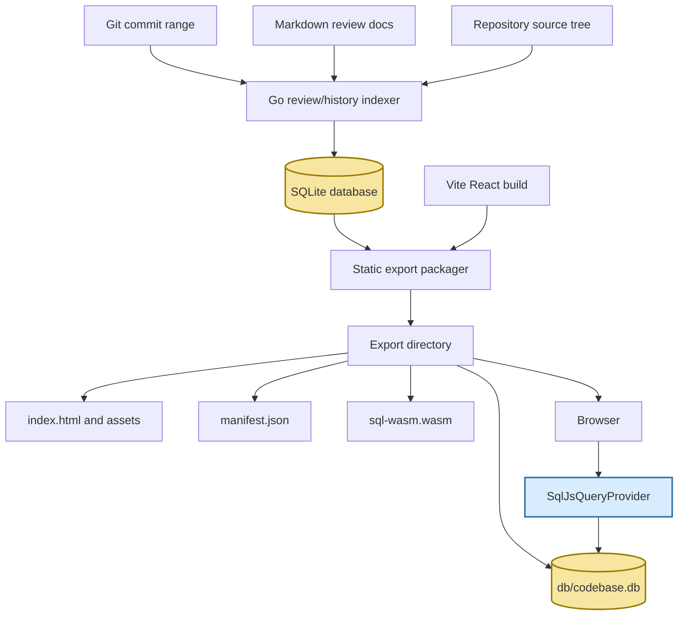

# Static SQL.js Codebase Browser: SQLite as the Browser Runtime

This report explains the architectural turn in `codebase-browser`: from a Go-served documentation browser with prototype static paths to a standalone static review browser whose runtime data model is a SQLite database opened directly in the browser with `sql.js`. The interesting lesson is not merely that `sql.js` works. The lesson is that a codebase browser already wants a relational model, and once that model exists, the cleanest static runtime is often to ship the database itself rather than manufacture a second, smaller, more fragile API-shaped export.

> [!summary]
> - The static browser now has one runtime data source: `db/codebase.db`, opened in the browser with `sql.js`.
> - Go is no longer a review/runtime server. It indexes commits, review docs, source metadata, and references offline, then packages a static export.
> - The old `precomputed.json`, TinyGo `search.wasm`, `wasm_exec.js`, and Go `/api/*` server paths were removed so the codebase reflects the chosen architecture.
> - The most important technical rule is byte discipline: Go symbol offsets are byte offsets, so browser body extraction slices `Uint8Array` first and decodes UTF-8 second.

The reference repository is `/home/manuel/code/wesen/2026-04-19--go-codebase-browser`. The active implementation ticket is `GCB-015 — Implement sql.js static codebase browser and review renderer`, with the main design document under `ttmp/2026/05/01/GCB-015--implement-sql-js-static-codebase-browser-and-review-renderer/design-doc/01-sql-js-static-frontend-architecture-and-implementation-guide.md`.

## 1. The problem: a static browser should not depend on knowing every question in advance

A code review browser starts with a modest promise: show the reader what changed, where it changed, and why the change matters. The first version of that promise can be satisfied with precomputation. If a review document mentions three symbols and two diffs, the export step can prepare exactly those artifacts and put them in a JSON file. The browser can load that file and render the page.

That model fails when the browser becomes a browser rather than a slideshow.

A real codebase browser is open-ended. The reader can click from a review paragraph into a source file, from a source file into a symbol, from a symbol into its history, from a history row into a body diff, and from that diff into callers and callees. These questions are not known when the review document is written. They are discovered by navigation.

The previous prototype used a structure like this:

```text
SQLite DB
  -> Go precomputes selected review payloads
  -> precomputed.json
  -> TinyGo WASM receives reviewData
  -> React asks WASM for known answers
```

That is a reasonable prototype because it proves that rich review widgets can exist. But it is the wrong final shape because it turns a relational database into an incomplete cache of anticipated answers. The failure mode was explicit: the browser tried to show a body diff for a symbol outside the curated review payload and got `STATIC_NOT_PRECOMPUTED`.

That error is revealing. It is not just a missing map entry. It is the architecture saying, "I can only answer questions the exporter predicted." A browser should not have that limitation when the database already contains commits, files, symbols, references, and file contents.

The correction was to make SQLite the runtime artifact, not just the build artifact.

## 2. The new mental model

The new model is simple enough to draw on a whiteboard:



Go does not disappear. It moves to the correct side of the line. Go is very good at walking repositories, reading Git history, parsing source, resolving symbols, rendering markdown directives, and creating a high-fidelity SQLite artifact. It is no longer asked to be present at runtime.

The browser also becomes simpler. It no longer decides whether it is in "server mode" or "static mode." It no longer has a `ServerQueryProvider`. It no longer makes `/api/*` application requests. It loads `manifest.json`, fetches `db/codebase.db`, initializes `sql.js`, and uses a single semantic provider: `SqlJsQueryProvider`.

The important boundary is this:

| Side | Responsibility | Representative files |
|---|---|---|
| Go offline indexing | Build the SQLite fact base from Git, source, and markdown docs. | `internal/review/indexer.go`, `internal/review/schema.go`, `internal/history/*` |
| Go offline packaging | Build/copy the SPA, copy the DB, render static review docs into the copied DB, write manifest metadata. | `internal/staticapp/export.go`, `internal/staticapp/reviewdocs.go`, `internal/staticapp/manifest.go` |
| Browser runtime | Open SQLite with `sql.js`, query it locally, render pages and widgets. | `ui/src/api/sqljs/sqlJsDb.ts`, `ui/src/api/sqlJsQueryProvider.ts` |
| Tests and guardrails | Ensure the static export does not regress toward old runtime artifacts. | `internal/staticapp/export_test.go`, `ui/src/api/sqljs/sqlRows.test.ts`, `ui/src/api/sqlJsQueryProvider.test.ts` |

This separation matters because it removes ambiguity. There is no hidden server to rescue the browser if a query was not precomputed. There is only the database and the provider. If a page needs data, the question is: what SQL should answer it?

## 3. The database is the product boundary

The central design decision is that the SQLite file is both the browser runtime database and the LLM/script artifact. This is stronger than treating SQLite as a private implementation detail.

The database contains commit history, package snapshots, file snapshots, symbol snapshots, references, file contents, and review documents. The browser uses these tables through `sql.js`, but they are also inspectable by humans and scripts. This makes the export useful even outside the React UI. A reviewer can open the DB with `sqlite3`, ask what symbols changed, list references to a function, or inspect rendered review docs.

The core tables are conceptually:

```text
commits
snapshot_packages
snapshot_files
snapshot_symbols
snapshot_refs
file_contents
review_docs
review_doc_snippets
static_review_rendered_docs
```

The first group describes what the repository looked like at each indexed commit. `snapshot_symbols` records where symbols live, what their signatures are, and what byte ranges define their bodies. `snapshot_refs` records cross-reference edges between symbols. `file_contents` stores content by hash so multiple snapshots can refer to the same bytes without duplicating rows unnecessarily. The review tables store the markdown review documents and, after export-time rendering, their static HTML representation.

The shape is relational because the questions are relational:

- Which symbols exist at `HEAD`?
- Which file content belongs to this file at this commit?
- Which refs leave this symbol?
- Which refs point to this symbol?
- Which body hashes did this symbol have across commits?
- Which files changed between two commits?
- Which rendered review document has this slug?

If those questions were stored as separate JSON blobs, each new page would require a new blob format. In SQLite they are queries over the same facts.

## 4. Export is a compiler pass, not a server startup

The static export command is best understood as a compiler pass. It takes a database and a frontend build and produces a directory that any static file server can host.

The implementation lives in `internal/staticapp/export.go`. Its high-level orchestration is deliberately plain:

```go
func Export(ctx context.Context, opts Options) error {
    if opts.BuildSPA {
        buildSPA(ctx)
    }

    copyTree("ui/dist/public", opts.OutDir)
    copyFile(opts.DBPath, opts.OutDir + "/db/codebase.db")

    if opts.RenderReviewDocs {
        AddRenderedReviewDocs(ctx, opts.OutDir + "/db/codebase.db", opts.RepoRoot)
    }

    manifest := buildManifest(ctx, opts, opts.OutDir + "/db/codebase.db")
    writeManifest(opts.OutDir, manifest)
}
```

The order is important. The source database is copied first, then static-only mutations happen on the copied output database. That rule prevents export from modifying the artifact that indexing produced. Export is packaging plus enrichment, not a second indexing run.

The resulting directory contains:

```text
export/
├── index.html
├── assets/
├── manifest.json
├── db/
│   └── codebase.db
├── sql-wasm.wasm
└── sql-wasm-browser.wasm
```

It deliberately does not contain:

```text
precomputed.json
search.wasm
wasm_exec.js
```

Those names are useful negative tests. If they reappear, the old runtime is leaking back in.

The manifest records the runtime contract. It says the query engine is `sql.js`, the DB path is `db/codebase.db`, and `hasGoRuntimeServer` is false. This is not just metadata for the browser. It is a statement of architecture.

## 5. Review markdown is rendered ahead of time, but widgets stay semantic

Review documents are markdown. They contain prose and codebase directives such as snippets, diffs, symbol histories, impact graphs, and file references. The system keeps Go markdown rendering for now, but stores the rendered result in SQLite during export.

That logic lives in `internal/staticapp/reviewdocs.go`. It creates a table:

```sql
CREATE TABLE IF NOT EXISTS static_review_rendered_docs (
    slug TEXT PRIMARY KEY,
    title TEXT NOT NULL,
    html TEXT NOT NULL,
    snippets_json TEXT NOT NULL DEFAULT '[]',
    errors_json TEXT NOT NULL DEFAULT '[]',
    rendered_at INTEGER NOT NULL DEFAULT 0
);
```

Then it loads the latest snapshot, reads rows from `review_docs`, renders each markdown page through the existing docs renderer, and upserts the result into the copied output DB.

This gives the browser a simple review-doc query:

```sql
SELECT slug, title, html, snippets_json, errors_json
FROM static_review_rendered_docs
WHERE slug = ?
```

There is a subtle design compromise here. Rendering markdown ahead of time reduces browser complexity, but it does not mean every interactive widget must be precomputed. The rendered HTML can contain placeholders or structured metadata. The React side can hydrate widgets by calling semantic provider methods such as `getSymbolBodyDiff`, `getCommitDiff`, `getImpact`, or `getSnippet`. The browser still uses SQLite for the live data.

The rule is:

> Render prose and directive structure at export time. Query codebase facts at runtime from SQLite.

This rule keeps authoring pleasant without recreating the `precomputed.json` trap.

## 6. The browser opens the database once

The browser bootstrap is intentionally small. `ui/src/api/sqljs/sqlJsDb.ts` has three singletons:

```ts
let sqlJsPromise: Promise<SqlJsStatic> | null = null;
let manifestPromise: Promise<StaticManifest> | null = null;
let dbPromise: Promise<Database> | null = null;
```

The loader initializes `sql.js`, reads `manifest.json`, fetches the SQLite database bytes, and constructs a `SQL.Database`:

```ts
export async function getStaticDb(): Promise<Database> {
  if (!dbPromise) {
    dbPromise = (async () => {
      const [SQL, manifest] = await Promise.all([getSqlJs(), getStaticManifest()]);
      const dbPath = manifest.db?.path ?? 'db/codebase.db';
      const response = await fetch(dbPath);
      const bytes = new Uint8Array(await response.arrayBuffer());
      return new SQL.Database(bytes);
    })();
  }
  return dbPromise;
}
```

There is no endpoint construction here. There is no runtime mode flag. There is no fallback path to a Go process. This is what makes the rest of the frontend predictable: every API slice eventually calls the same provider, and the provider eventually calls the same database.

The row helpers in `ui/src/api/sqljs/sqlRows.ts` also encode a discipline that matters in long-running browser sessions: every prepared statement must be freed.

```ts
export function queryAll<T extends SqlRow = SqlRow>(
  db: Database,
  sql: string,
  params: SqlValue[] = [],
): T[] {
  const stmt = db.prepare(sql);
  try {
    stmt.bind(params);
    const rows: T[] = [];
    while (stmt.step()) {
      rows.push(stmt.getAsObject() as T);
    }
    return rows;
  } finally {
    stmt.free();
  }
}
```

This is small code, but it is foundational. If every provider method uses `queryAll` and `queryOne`, statement cleanup becomes the default rather than a habit each query author must remember.

## 7. The provider is semantic, not transport-shaped

The frontend still uses RTK Query hooks, but those hooks call semantic provider methods. They do not encode HTTP paths. That distinction is important.

A transport-shaped API asks questions like:

```text
GET /api/history/diff?from=...&to=...
GET /api/source?path=...
GET /api/xref/:id
```

A semantic provider asks questions like:

```ts
provider.getCommitDiff(from, to)
provider.getSource(path, commit)
provider.getXref(symbolId, commit)
provider.getImpact(symbolId, direction, depth, commit)
```

The second form is the right abstraction because the frontend wants domain answers, not URLs. Today those answers come from `sql.js`. If a future implementation uses a worker, `sql.js-httpvfs`, or a remote query service, the semantic boundary can remain intact.

The provider covers both the generic browser and the review widgets:

- index summary and package lists;
- symbol lookup and search;
- source file content;
- snippets and snippet references;
- file xrefs;
- commit lists and commit ref resolution;
- commit diffs;
- symbol histories;
- body diffs;
- impact graphs;
- rendered review document listing and lookup.

This breadth is why removing the old runtime paths mattered. If half the app used SQL and half the app still used `/api/*` or TinyGo, every page would carry mode-dependent behavior. A single provider turns runtime behavior into a property of the architecture rather than a set of conditionals.

## 8. Commit references are resolved in the browser

A static browser still needs Git-like conveniences. Review docs and history pages should be able to say `HEAD`, `HEAD~1`, a full hash, a short hash, or a unique prefix. In the sql.js runtime, this is just provider logic over the `commits` table.

The essential algorithm is:

```text
commits = list successful commits
ordered = commits sorted by author_time ascending
newest = ordered[len(ordered)-1]

if ref == "" or ref == "HEAD":
    return newest.hash

if ref matches "HEAD~N":
    return ordered[newest_index - N].hash, if it exists

if ref equals a full hash or short_hash:
    return that hash

matches = commits where hash starts with ref
if len(matches) == 1:
    return matches[0].hash
if len(matches) > 1:
    raise AMBIGUOUS_REF

raise NOT_FOUND
```

The provider-level tests now lock this in with an in-memory sql.js database. That test seam is small: `SqlJsQueryProvider` accepts an optional DB loader, while production still defaults to `getStaticDb`. This lets tests exercise real SQL statements without mocking browser fetches or checking in a large fixture database.

The distinction between list order and resolution order is worth noting. `listCommits()` returns commits newest first for UI display. `resolveCommitRef()` sorts ascending internally so `HEAD~N` can count backward from the newest commit. The test protects both behaviors.

## 9. Body diffs depend on byte offsets, not JavaScript strings

The most treacherous implementation detail is not SQL. It is text encoding.

Go symbol positions are byte offsets. JavaScript strings are indexed by UTF-16 code units. Those are not the same thing. If the source contains non-ASCII text, slicing a decoded JavaScript string by Go byte offsets can cut through the wrong character boundary and produce broken snippets or diffs.

The correct sequence is:

```text
file_contents.content -> Uint8Array
slice Uint8Array by Go byte offsets
then decode the sliced bytes as UTF-8
```

The helper says exactly that:

```ts
export function extractUtf8Range(
  bytes: Uint8Array,
  startOffset: number,
  endOffset: number,
): string {
  if (startOffset < 0 || endOffset > bytes.length || startOffset > endOffset) {
    throw new Error(`invalid byte range ${startOffset}-${endOffset} for content length ${bytes.length}`);
  }
  return utf8Decoder.decode(bytes.slice(startOffset, endOffset));
}
```

A good test case is `a🙂b`. It looks like three user-visible characters, but it is six UTF-8 bytes: `a` is one byte, `🙂` is four bytes, and `b` is one byte. The test asserts that slicing bytes `[1, 5)` decodes to the emoji. This is the kind of small regression test that prevents a future maintainer from "simplifying" the code into a Unicode bug.

The deeper lesson is that database schemas carry coordinate systems. `start_offset` and `end_offset` are not generic positions. They are byte offsets into stored content blobs. The browser must respect that coordinate system.

## 10. Commit diffs and impact graphs are queries plus small algorithms

Some runtime behavior is pure SQL. Looking up a rendered review doc is one row. Listing commits is one query. Fetching a source file is a join from snapshot metadata to content bytes.

Other behavior is SQL plus a small browser-side algorithm.

Commit diffs are a good example. SQLite does not have `FULL OUTER JOIN`, so the provider uses `UNION ALL` patterns to compute added, removed, and modified files or symbols. The browser then computes summary stats from those rows. This is not a workaround; it is a normal adaptation to SQLite's dialect.

Impact analysis is another example. The database stores reference edges in `snapshot_refs`. The provider does breadth-first search over those edges at runtime:

```text
frontier = [root_symbol]
seen = {root_symbol}

for depth in 1..max_depth:
    next = []
    for symbol in frontier:
        refs = refs_from(symbol) or refs_to(symbol), depending on direction
        for ref in refs:
            neighbor = other endpoint of ref
            record edge
            if neighbor not seen:
                seen.add(neighbor)
                next.append(neighbor)
    frontier = next
```

This is exactly the kind of computation that should not be precomputed into JSON for every symbol, depth, direction, and commit. The graph is already in SQLite. The browser can traverse it when the user asks.

## 11. Worktrees are the current bridge to historical correctness

Indexing multiple commits requires reading the repository as it existed at each commit. The current extractor is filesystem-oriented, so multi-commit review indexing automatically uses Git worktrees. This was an important cleanup: the user no longer has to remember a `--worktrees` flag for `review index` or `review db create`. If there is more than one commit, the indexer uses worktrees as an implementation detail.

That choice is pragmatic. The eventual ideal might be a git-object-backed extractor that reads blobs through `git cat-file` or an overlay filesystem abstraction. But the current implementation needs real files on disk, and worktrees make the snapshots correct.

The bug that exposed this was subtle. A 20-commit DB built without worktrees showed repeated current-checkout snapshots, so symbol histories had no real body changes. The same range built with worktrees showed distinct body hashes for functions such as `review.Register`, `review.newIndexCmd`, and `staticapp.Export`. Once that was established, the command interface was simplified: multi-commit indexing now does the right thing automatically.

The working rule is:

> Do not expose correctness knobs as user-facing theory. If multi-commit indexing requires worktrees today, enable them automatically and leave a future ticket for a better extractor.

## 12. Removing code was part of the implementation, not cleanup after it

The project reached its clean shape only after deleting the old paths. The important removals were:

- `review serve` and the Go review server path;
- `cmd/wasm` and `internal/wasm`;
- `internal/static` and `internal/bundle`;
- `precomputed.json`, `search.wasm`, and `wasm_exec.js` generated artifacts;
- `ui/src/api/wasmClient.ts`;
- `ui/src/api/runtimeMode.ts`;
- the old `ServerQueryProvider` abstraction;
- the general Go `/api/*` server runtime under `internal/server`;
- the embedded web package under `internal/web`;
- the Vite `/api` dev proxy;
- the unpackaged structured query concepts UI.

This was not aesthetic minimalism. Each remaining runtime path would have taught the next maintainer the wrong lesson. If `serve` still exists, someone will ask whether static bugs should be fixed in the server. If `precomputed.json` still exists, someone will add another map. If `runtimeMode.ts` still exists, someone will add another branch.

Deletion made the architecture executable. The command help no longer lists `serve`. The export tests assert that legacy runtime files are absent. Grep no longer finds active references to the old TinyGo/precomputed runtime outside negative tests and historical docs.

The pattern is worth preserving:

> When a prototype has served its purpose, remove it before it becomes a compatibility promise.

## 13. Test strategy: small unit tests plus static export smoke

The test suite now has three layers.

The first layer is Go export behavior. `internal/staticapp/export_test.go` verifies that the static export copies the DB, writes the manifest, and omits old runtime files. It also verifies that rendered review docs are inserted into the copied DB.

The second layer is TypeScript/sql.js unit behavior. `ui/src/api/sqljs/sqlRows.test.ts` tests statement helpers, BLOB conversion, and byte-safe UTF-8 slicing. `ui/src/api/sqlJsQueryProvider.test.ts` tests commit listing and ref resolution with an in-memory sql.js database.

The third layer is manual browser smoke, with Playwright-style checks used during development: review pages load, direct history routes render, source xrefs appear, package tree navigation works, and no `/api/*` requests are made. The next natural step is to turn those smokes into committed Playwright regressions.

A useful future regression suite would assert:

- `/#/review/static-smoke` renders from `static_review_rendered_docs`;
- `/#/history?symbol=...Register` renders a body diff;
- `/#/source/cmd/codebase-browser/cmds/review/root.go` renders source refs and file xrefs;
- route changes reset scroll;
- the package tree is collapsed and navigable;
- no network request URL contains `/api/`;
- no UI text contains `STATIC_NOT_PRECOMPUTED`.

The tests should not merely prove that components mount. They should protect the architectural promises.

## 14. What this project teaches

The project is a case study in choosing the right runtime boundary. The tempting boundary was an API: the Go program knows how to answer questions, so perhaps the browser should call the Go program. The better boundary was a data artifact: the Go program knows how to build a database, so the browser should carry the database.

That choice has several consequences.

First, it makes static hosting honest. A static export can be served by `python3 -m http.server`, GitHub Pages-style hosting, or any plain file server. There is no hidden application process.

Second, it makes the browser more capable, not less. Removing the server did not remove history, diffs, xrefs, or impact analysis. Those features moved into SQL-backed provider methods.

Third, it makes the artifact useful to non-browser consumers. The same `db/codebase.db` can be queried by scripts, inspected by LLMs, or archived with a review.

Fourth, it makes failure modes clearer. A missing symbol is a query/data issue. A broken body diff is an offset/content issue. A missing review page is a rendering/export issue. None of these are confused with "which runtime mode am I in?"

Finally, it shows why technical debt is often a wrong story, not just extra code. The old TinyGo path was not large compared to the whole repository, but it told a competing story: static export means precompute selected JSON and call WASM. The old server path told another competing story: the browser is a client of a Go HTTP API. GCB-015 replaced both with one story: static export means SQLite in the browser.

## 15. Current status

The implementation is now past the architectural cutoff. The static sql.js runtime exists, the old runtime paths have been removed, and initial regression tests are in place.

Implemented and validated:

- `review db create` and `review index` build unified SQLite review/history databases.
- Multi-commit review indexing automatically uses worktrees.
- `review export` packages a static Vite app plus `db/codebase.db` and `manifest.json`.
- Review docs are rendered into `static_review_rendered_docs` on the copied output DB.
- The browser loads SQLite with `sql.js`.
- The frontend uses `SqlJsQueryProvider` for index, package, symbol, search, source, xref, history, diff, impact, and review-doc paths.
- The old TinyGo/precomputed runtime has been deleted.
- The old Go server runtime has been deleted.
- Vitest covers sql.js row helpers, UTF-8 byte slicing, tokenizer smokes, and commit-ref provider semantics.
- `go test ./...`, `pnpm -C ui run test`, `pnpm -C ui run typecheck`, and `docmgr doctor --ticket GCB-015 --stale-after 30` pass.

The main remaining work is not architectural uncertainty. It is hardening:

- Add Playwright regression tests for the static export.
- Add provider-level tests for body diffs, source refs, snippet refs, and file xrefs.
- Decide whether to add SQLite FTS for symbol search or keep `LIKE` search until scale demands it.
- Add optional `static_export_metadata` if the manifest should also be queryable from inside the DB.
- Update any remaining high-level docs whose opening paragraphs still describe the older one-binary server origin rather than the current static export product.

## 16. Working rules to carry forward

The project now has a set of rules that should guide future changes:

- The browser runtime asks SQLite, not Go.
- Go may enrich the copied output DB during export, but it should not create parallel opaque JSON data models for core browser behavior.
- If derived data is worth shipping, prefer a SQLite table or view over an ad hoc file.
- Browser APIs should be semantic provider methods, not endpoint strings.
- Source body extraction must slice bytes before decoding UTF-8.
- Multi-commit indexing must produce real historical snapshots; until a git-object extractor exists, that means automatic worktrees.
- Static export tests should assert absence of old runtime files, not just presence of new files.
- Dead runtime paths should be deleted rather than marked "legacy" when there is no external compatibility contract.

These rules are more important than any individual file. They are what keep the system from drifting back into a hybrid of server mode, precomputed mode, and SQL mode.

## 17. Closing: SQLite as the interface between build time and reading time

The final architecture feels obvious in retrospect because the database was already there. The hard part was trusting it enough to make it the runtime boundary.

A codebase browser is a reading tool. It helps a person move through facts: commits, files, symbols, references, snippets, diffs, and explanations. SQLite is a compact way to carry those facts. `sql.js` is the bridge that lets the browser ask questions locally. React is the interface that turns the answers into a reading experience.

The result is a clean pipeline:

```text
index facts once -> package facts once -> read facts many times
```

That is the right shape for a static review artifact. It can be opened by a browser, queried by a script, handed to an LLM, archived with a pull request, or served from a plain directory. It does not need a Go process to explain itself.
