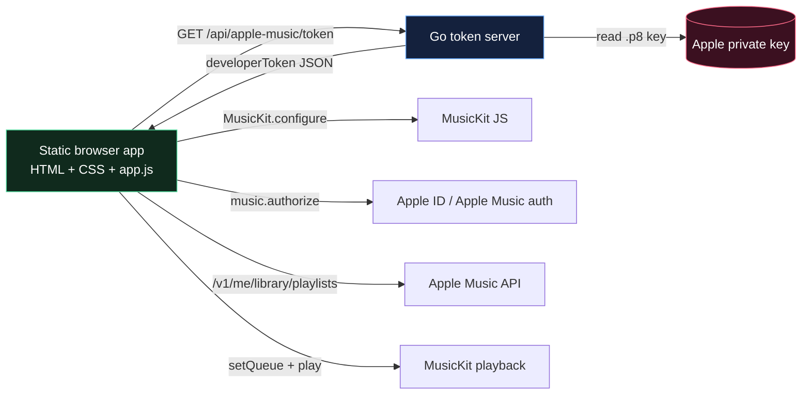
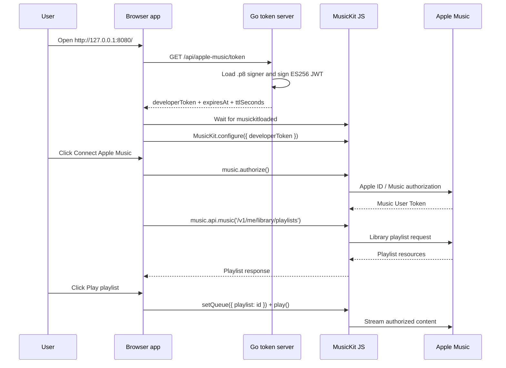

# Static Apple Music Player Deep Dive

This project builds a small Apple Music player whose user interface is almost entirely static HTML, CSS, and JavaScript. The page loads MusicKit JS in the browser, asks a local Go server for a short-lived Apple Music developer token, lets the user authorize Apple Music, lists library playlists, and then uses MusicKit for playback. The project is small, but it is a useful case study in a common architectural pattern: a static frontend that becomes safe only because a narrow backend keeps one important secret out of the browser.

> [!summary]
> The project has three main ideas:
> 1. The browser can own MusicKit, user authorization, playlist listing, queue control, and playback.
> 2. The backend must own the Apple `.p8` private key and developer-token signing.
> 3. The whole application can stay simple if the backend is treated as a token vending machine, not as a music proxy.

The current implementation is complete through the planned local phases: Go/Glazed CLI, token server, static MusicKit frontend, playlist rendering, playback controls, security headers, README, ticket diary, and reMarkable delivery. It still needs a live Apple Music browser smoke test with an active Apple Developer membership, a real MusicKit key, and an Apple Music account.

## Why this project exists

The motivating desire is straightforward: make a custom Apple Music player that can be opened like a little local webapp. The page should not be a large hosted service. It should not require a React build system just to show a few controls. It should feel like a static artifact: an `index.html`, a stylesheet, and a script.

Apple Music prevents the naive version of that idea. MusicKit JS is browser-side, but it is initialized with a **Developer Token**. That token is a JWT signed with an Apple Developer private key. The private key arrives from Apple as a `.p8` file, and it must not be included in static assets. If it were placed in JavaScript, anyone who could load or inspect the page could extract it. If a long-lived developer token were pasted into the page, it would be less catastrophic than leaking the private key, but it would still authenticate the app as the developer until it expired.

That tension defines the architecture. The frontend wants to be static; the token cannot be static. The solution is to keep the frontend static for everything that can safely happen in the browser, and to add the smallest possible backend for the one thing that cannot.

## Current project status

The repository is at:

```text
/home/manuel/code/wesen/2026-05-01--static-music-player
```

Implemented code and docs include:

- `cmd/static-music-player/main.go` — Cobra root command for the CLI.
- `internal/commands/serve.go` — Glazed-backed `serve` command and operator flags.
- `internal/appconfig/config.go` — configuration defaults, environment fallback, and validation.
- `internal/applemusic/signer.go` — Apple `.p8` key loading and ES256 JWT signing.
- `internal/server/server.go` — HTTP server, health endpoint, token endpoint, static serving, CORS, and security headers.
- `web/index.html` — static app shell.
- `web/app.js` — MusicKit bootstrap, authorization, playlist loading, queue control, and playback state.
- `web/styles.css` — responsive player UI styling.
- `README.md` — operator instructions and live browser smoke checklist.
- `ttmp/2026/05/01/apple-music-static-player--almost-self-contained-apple-music-player-webapp/` — docmgr ticket, design guide, diary, tasks, changelog, and source research.

The final implementation commits in the repo tell the story of the build:

| Commit | Purpose |
| --- | --- |
| `63e78ef` | Documented the Apple Music static player plan. |
| `d920813` | Added the Go/Glazed server skeleton. |
| `45ff9c4` | Added Apple Music token signing and token endpoint. |
| `61ce4f0` | Bootstrapped the static MusicKit frontend. |
| `38d0d64` | Added authorization and playlist UI. |
| `e2b9b1c` | Added playback controls and now-playing UI. |
| `97e9b3d` | Hardened headers and documented operation. |

The main missing piece is not code structure. It is credentials. The available Team ID is `9HUGJA6SNP`, but the Apple Developer Program account appears to be inactive or expired; the user reported a renewal date of July 8, 2015 and could not see the Certificates / Identifiers / Profiles section. Without active access to Apple Developer key creation, the app cannot obtain the real MusicKit `.p8` key needed for live testing.

## The key architectural lesson

A static application is not the same thing as a secret-free application. This distinction is the center of the project.

MusicKit JS can do a surprising amount in the browser. It can load Apple’s player runtime, prompt the user to authorize Apple Music, receive a Music User Token, call Apple Music API endpoints, manage queues, and play protected audio. None of those operations require the local backend to understand playlists or music playback.

But MusicKit needs to know which developer application is making the request. That identity comes from a Developer Token. Creating that token requires the Apple private key. This one fact prevents a fully static implementation.

The resulting system has a clean division of responsibility:



The backend does not know the user’s playlists. It does not store user tokens. It does not proxy every Apple API call. It signs developer tokens. Everything else happens in the browser.

That is the simplest mental model for the project:

> The backend proves the app’s developer identity. The browser proves the user’s Apple Music identity. MusicKit joins those two identities to make library access and playback possible.

## Project shape

The project is intentionally small. There are only two runtime layers.

```text
repo root
├── cmd/static-music-player/main.go     # CLI entrypoint
├── internal/
│   ├── appconfig/config.go             # flags/env/defaults/validation
│   ├── applemusic/signer.go            # .p8 -> ECDSA key -> ES256 JWT
│   ├── commands/serve.go               # Glazed serve command
│   └── server/server.go                # HTTP routes and headers
├── web/
│   ├── index.html                      # static app shell
│   ├── app.js                          # MusicKit frontend logic
│   └── styles.css                      # UI styling
├── README.md                           # operator guide
├── .env.example                        # fake example env
└── ttmp/...                            # ticket docs and diary
```

The Go code is not a music backend. It is a local auth-support service. The JavaScript code is not merely decoration. It is the actual Apple Music client.

That inversion matters. In many webapps, the backend owns the domain model and the frontend displays it. Here the browser owns most domain behavior because Apple’s MusicKit runtime already exists there. The backend is deliberately boring.

## The backend: a token vending machine

The backend is easiest to understand from the outside inward. A browser asks for a token:

```text
GET /api/apple-music/token
```

The server responds:

```json
{
  "developerToken": "<signed ES256 JWT>",
  "expiresAt": "2026-05-02T...Z",
  "ttlSeconds": 3600
}
```

The server does not return its Team ID, Key ID, private key path, or any diagnostic that would reveal private key material. The token itself is returned because the browser needs it to initialize MusicKit, but the response is marked `Cache-Control: no-store` so browsers and intermediaries are told not to persist it.

The signer in `internal/applemusic/signer.go` does the critical work:

```go
func (s *Signer) SignDeveloperToken(now time.Time, ttl time.Duration) (string, time.Time, error) {
    if ttl <= 0 {
        return "", time.Time{}, fmt.Errorf("developer token TTL must be positive")
    }
    if ttl > MaxDeveloperTokenTTL {
        return "", time.Time{}, fmt.Errorf("developer token TTL %s exceeds maximum %s", ttl, MaxDeveloperTokenTTL)
    }

    expiresAt := now.Add(ttl)
    claims := jwt.MapClaims{
        "iss": s.teamID,
        "iat": now.Unix(),
        "exp": expiresAt.Unix(),
    }
    token := jwt.NewWithClaims(jwt.SigningMethodES256, claims)
    token.Header["kid"] = s.keyID

    signed, err := token.SignedString(s.privateKey)
    if err != nil {
        return "", time.Time{}, fmt.Errorf("sign Apple Music developer token: %w", err)
    }
    return signed, expiresAt, nil
}
```

There are three important details in this function.

First, the JWT is signed with `ES256`. Apple’s `.p8` key is parsed as a PKCS#8 ECDSA private key. The project tests this with temporary generated ECDSA keys rather than real Apple secrets.

Second, the `kid` value lives in the JWT header, not the claims. This is how Apple knows which registered key to use for verification.

Third, the token has an expiration. Apple allows relatively long developer-token lifetimes, but the project defaults to one hour. The shorter lifetime reduces the blast radius if a token is accidentally copied from a browser session or log.

## Configuration and startup

The server can be configured either with flags or environment variables. The important variables are:

| Variable | Meaning |
| --- | --- |
| `APPLE_MUSIC_TEAM_ID` | The Apple Developer Team ID; for this project the known value is `9HUGJA6SNP`. |
| `APPLE_MUSIC_KEY_ID` | The Key ID from Apple’s MusicKit key. |
| `APPLE_MUSIC_PRIVATE_KEY_PATH` | Local path to the downloaded `AuthKey_<KEY_ID>.p8` file. |
| `APPLE_MUSIC_TOKEN_TTL_SECONDS` | Optional token lifetime in seconds; `3600` is a good development value. |
| `STATIC_MUSIC_PLAYER_ADDR` | Optional bind address, defaulting to `127.0.0.1:8080`. |
| `STATIC_MUSIC_PLAYER_STATIC_DIR` | Optional static directory, defaulting to `web`. |
| `STATIC_MUSIC_PLAYER_ALLOWED_ORIGIN` | Optional explicit CORS origin for split frontend/backend development. |

The `serve` command lives in `internal/commands/serve.go`. It is implemented as a Glazed bare command so it gets Glazed parsing and command-inspection behavior while still behaving like a long-running server process.

The conceptual startup sequence is:

```text
CLI flags + env
  -> appconfig.Config.ApplyDefaultsAndEnv
  -> ValidateForServe
  -> ParseTokenTTL
  -> applemusic.NewSigner
  -> server.New
  -> http.Server.ListenAndServe
```

In pseudocode:

```go
func runServe(settings ServeSettings) error {
    cfg := ConfigFromFlags(settings).ApplyDefaultsAndEnv()
    validate address, Team ID, Key ID, private key path, TTL

    signer := NewAppleMusicSigner(cfg.TeamID, cfg.KeyID, cfg.PrivateKeyPath)
    srv := server.New(cfg, signer)

    serve /api/healthz
    serve /api/apple-music/token
    serve static files from web/
}
```

This is intentionally linear. There is no database, no background worker, and no user-account table. The server either has enough local configuration to sign a token, or it refuses to start.

## The frontend: the real Apple Music client

The static frontend in `web/app.js` is where the music behavior lives. Its state object is small enough to fit on one screen, and that is a good sign:

```js
const state = {
  phase: 'booting',
  developerTokenExpiresAt: null,
  tokenLoaded: false,
  musicKitLoaded: false,
  configured: false,
  authorized: false,
  playlistsLoading: false,
  playlists: [],
  currentPlaylistId: null,
  nowPlaying: null,
  playbackState: 'stopped',
  music: null,
  error: null,
};
```

The first browser problem is ordering. The page needs two things before it can configure MusicKit:

1. A developer token from the local backend.
2. The MusicKit JS global loaded from Apple’s CDN.

Those two tasks can happen in parallel:

```js
const [tokenResponse] = await Promise.all([
  loadDeveloperToken(),
  waitForMusicKit(),
]);

state.music = await configureMusicKit(tokenResponse.developerToken);
```

This is a small piece of code, but it captures the whole shape of the app. The local backend does not initialize MusicKit. The browser does. The backend only supplies the signed token.

After MusicKit is configured, the user must explicitly click **Connect Apple Music**. That click matters because browser authorization flows often need a real user gesture. The code then calls:

```js
await state.music.authorize();
const response = await state.music.api.music('/v1/me/library/playlists');
```

At that point the app has both identities it needs:

- the app/developer identity from the developer token, and
- the user identity from MusicKit authorization.

Only then can it read personal library playlists.

## The runtime sequence

The whole runtime is best understood as a chain of handoffs. Each stage gives the next stage exactly the credential or state it needs.



Notice what never happens: the backend never receives the Music User Token, never sees playlist results, and never controls playback. That is not an omission. It is a boundary.

## Playlist and playback behavior

The playlist step normalizes Apple’s response into a small UI shape:

```js
function normalizePlaylists(response) {
  const data = response?.data?.data ?? response?.data ?? [];
  if (!Array.isArray(data)) {
    return [];
  }
  return data.map((playlist) => ({
    id: playlist.id,
    name: playlist.attributes?.name ?? 'Untitled playlist',
    description: playlist.attributes?.description?.standard ?? playlist.attributes?.description ?? '',
    trackCount: playlist.attributes?.trackCount ?? null,
    rawType: playlist.type,
  })).filter((playlist) => playlist.id);
}
```

This function is defensive because the exact MusicKit JS wrapper shape should be verified live. It supports the likely response paths `response.data.data` and `response.data`. It also avoids assuming that every playlist has a description or track count.

Playback uses the library playlist ID directly:

```js
async function playPlaylist(playlist) {
  state.currentPlaylistId = playlist.id;
  state.nowPlaying = {
    title: playlist.name,
    subtitle: 'Loading playlist queue…',
    artworkURL: '',
  };

  await state.music.setQueue({ playlist: playlist.id });
  await state.music.play();

  refreshNowPlaying();
  refreshPlaybackState();
}
```

This is one of the main places that needs real Apple testing. It is plausible that MusicKit accepts the library playlist ID directly, but Apple APIs sometimes distinguish catalog playlist IDs from library playlist IDs. If live testing fails here, the fix will likely be in the queue descriptor passed to `setQueue`, not in the backend.

The now-playing panel reads `state.music.nowPlayingItem` and attempts to extract title, artist, album, and artwork. The artwork helper handles two likely shapes: an artwork object with a URL function, and an artwork object with a template string containing `{w}` and `{h}`.

## Security model

The security model is simple enough to state precisely.

The backend protects:

- the Apple `.p8` private key,
- the signing operation,
- the token TTL policy,
- the CORS policy for token access,
- the CSP and browser security headers.

The browser receives:

- a short-lived developer token,
- a MusicKit instance,
- a Music User Token managed by MusicKit,
- playlist data and playback state.

The browser should not receive:

- the `.p8` private key,
- server environment variables,
- server filesystem paths beyond generic diagnostics,
- logs containing token values.

The repository also enforces some basic secret hygiene:

```text
*.p8
.env
.env.*
!.env.example
```

The token endpoint adds:

```text
Cache-Control: no-store
```

The server adds a Content Security Policy:

```text
default-src 'self';
script-src 'self' https://js-cdn.music.apple.com;
connect-src 'self' https://*.apple.com https://api.music.apple.com;
style-src 'self';
img-src 'self' data: https:;
media-src https: blob:;
frame-src https://*.apple.com;
base-uri 'self';
form-action 'self'
```

This CSP is a starting point, not a law of nature. MusicKit may require additional Apple domains during real authorization or playback. If the first live browser smoke test shows CSP violations, the correct response is to add the smallest necessary origin and record why.

## Testing strategy

The project has three levels of tests.

### Unit tests

The Go tests cover configuration, signing, and HTTP behavior:

- `internal/appconfig/config_test.go` verifies TTL parsing and config validation.
- `internal/applemusic/signer_test.go` generates temporary ECDSA keys, signs JWTs, and checks header/claim shape.
- `internal/server/server_test.go` verifies health, token responses, cache headers, CORS rejection, and security headers.

The key testing decision is that no real Apple key is required for unit tests. Tests generate a temporary P-256 ECDSA key and write it as PKCS#8 PEM into `t.TempDir()`.

That matters because tests must be safe to run in CI, on an intern laptop, or in an agent session without ever needing a real `.p8` file.

### Local smoke tests

The local smoke tests prove that the pieces serve and respond correctly:

```bash
go test ./...

curl -s http://127.0.0.1:8080/api/apple-music/token \
  | jq '{hasToken: (.developerToken | length > 20), expiresAt, ttlSeconds}'

curl -fsS http://127.0.0.1:8080/ | grep -q "Static Apple Music Player"
curl -fsS http://127.0.0.1:8080/app.js | grep -q "setQueue"
```

These tests deliberately avoid printing full tokens. They ask only whether a plausible token exists and whether the TTL metadata is right.

### Live browser smoke test

The live test is still pending. It requires:

- active Apple Developer membership,
- a MusicKit-enabled key,
- the `.p8` key file,
- the Team ID (`9HUGJA6SNP`),
- the Key ID,
- an Apple ID with Apple Music access,
- an interactive browser session.

The live checklist in `README.md` is the right next step:

1. Start the server.
2. Open `http://127.0.0.1:8080/`.
3. Confirm token and MusicKit states become ready/configured.
4. Click **Connect Apple Music**.
5. Complete Apple’s authorization prompt.
6. Confirm playlists render.
7. Click **Play playlist**.
8. Confirm playback starts.
9. Confirm Previous, Play/Pause, and Next work.
10. Confirm now-playing title/artwork update.

## The phased build

The project was built in six implementation phases after the initial design ticket.

### Phase 0: documentation baseline

The first phase created the docmgr ticket and captured the design before writing code. This was valuable because the central decision — static frontend plus token backend — is a security boundary, not a style preference.

The main artifact is:

```text
ttmp/2026/05/01/apple-music-static-player--almost-self-contained-apple-music-player-webapp/design-doc/01-apple-music-static-player-architecture-and-implementation-guide.md
```

### Phase 1: repository and CLI skeleton

This phase added the Go module, Glazed/Cobra CLI, `serve` command, health endpoint, and placeholder frontend. The point was to establish a runnable shape before implementing signing.

### Phase 2: developer-token backend

This phase added the `.p8` parser, ES256 JWT signing, `/api/apple-music/token`, no-store headers, CORS behavior, and tests. This was the most security-sensitive backend phase.

### Phase 3: MusicKit bootstrap

This phase replaced the placeholder frontend with a static app that fetches the developer token and calls `MusicKit.configure` after the MusicKit script loads.

### Phase 4: authorization and playlists

This phase added the user-gesture-driven Connect button, `music.authorize()`, the playlist API call, playlist normalization, and playlist cards.

### Phase 5: playback

This phase added `setQueue`, play/pause, previous/next, selected playlist state, now-playing metadata, and artwork rendering.

### Phase 6: hardening and delivery

This phase added CSP, README, `.gitignore`, `.env.example`, operator instructions, and refreshed documentation upload to reMarkable.

The build order is important. It avoided debugging MusicKit playback before token signing worked, and it avoided styling a UI before proving the authentication path.

## What is blocked by Apple account state

The project is currently blocked on real Apple Developer key creation. The Team ID is known:

```text
9HUGJA6SNP
```

But the Apple Developer Program account appears inactive or expired. The user could not find the Certificates section and reported:

```text
Renewal date: July 8, 2015
Device reset date: July 8, 2015
```

If the membership is inactive, Apple will not expose the resources needed to create the MusicKit key. The missing pieces are:

```bash
APPLE_MUSIC_KEY_ID=...
APPLE_MUSIC_PRIVATE_KEY_PATH=/path/to/AuthKey_<KEY_ID>.p8
```

Until those exist, the app can be structurally tested but not live-tested against Apple Music.

## How to run it once credentials exist

The local environment should look like this:

```bash
export APPLE_MUSIC_TEAM_ID=9HUGJA6SNP
export APPLE_MUSIC_KEY_ID=YOUR_KEY_ID
export APPLE_MUSIC_PRIVATE_KEY_PATH=/absolute/path/to/AuthKey_YOUR_KEY_ID.p8
export APPLE_MUSIC_TOKEN_TTL_SECONDS=3600
```

Validate the environment:

```bash
./ttmp/2026/05/01/apple-music-static-player--almost-self-contained-apple-music-player-webapp/scripts/check_apple_music_env.sh
```

Start the server:

```bash
go run ./cmd/static-music-player serve \
  --addr 127.0.0.1:8080 \
  --static-dir web
```

Open:

```text
http://127.0.0.1:8080/
```

If the token endpoint works but MusicKit fails, check browser console errors and CSP violations. If playlists load but playback fails, inspect whether `music.setQueue({ playlist: playlist.id })` accepts library playlist IDs.

## Things likely to need live corrections

This project has reached the stage where more local code work has diminishing returns until the Apple runtime is tested. The most likely live-test fixes are:

- **CSP origins.** MusicKit may need additional Apple domains for authorization frames, API calls, or media playback.
- **MusicKit event names.** The frontend currently supports `MusicKit.Events.*` when present and string fallbacks otherwise, but real v3 behavior should be observed.
- **Playback state constants.** `isPlaying()` currently treats numeric `2` and string `playing` as playing. Live behavior may differ.
- **Library playlist queue shape.** The call `setQueue({ playlist: id })` may need a different descriptor for library playlists.
- **Response shape.** `normalizePlaylists()` handles likely shapes, but real MusicKit data should drive final normalization.

These are not architectural risks. They are integration risks at the boundary with Apple’s JavaScript runtime.

## The deeper pattern

The reusable pattern is not “how to build an Apple Music player.” It is broader:

> Put the secret-bearing operation behind the smallest possible backend, and let the browser own the user-facing integration when the vendor SDK is designed to run there.

This pattern appears whenever a browser SDK needs an application credential that cannot safely live in static files. The wrong response is to move the whole app server-side. The right response is often to isolate the secret operation.

The decision table looks like this:

| Responsibility | Best location | Reason |
| --- | --- | --- |
| Private key storage | Backend | Cryptographic secret. |
| Developer token signing | Backend | Requires private key. |
| MusicKit script loading | Browser | Vendor SDK is browser-native. |
| Apple user authorization | Browser | User gesture and Apple popup flow. |
| Music User Token | Browser / MusicKit | User-scoped credential managed by SDK. |
| Playlist query | Browser / MusicKit | Requires user authorization and is supported by SDK. |
| Playback | Browser / MusicKit | DRM and media playback are SDK/browser concerns. |
| UI state | Browser | Local interactive state. |

The strength of the architecture is that every row has a reason. Nothing is placed on the backend because “backends are serious,” and nothing is placed in the browser because “static is simpler.” The boundary follows the credentials.

## Open questions

- Can the Apple Developer Program membership be renewed or reactivated so a MusicKit key can be created?
- Once renewed, does Apple’s portal expose MusicKit under Keys, Media IDs, or another current UI label?
- Does MusicKit JS accept library playlist IDs directly in `setQueue({ playlist: id })`?
- Does the CSP need additional Apple origins during real authorization and playback?
- Should the project later embed `web/*` with `go:embed` for single-binary distribution?
- Should the token endpoint be rate-limited before any remote deployment?

## Near-term next steps

1. Renew or verify the Apple Developer Program membership.
2. Create a MusicKit-capable key and download the `.p8` file.
3. Configure `APPLE_MUSIC_TEAM_ID=9HUGJA6SNP`, `APPLE_MUSIC_KEY_ID`, and `APPLE_MUSIC_PRIVATE_KEY_PATH` locally.
4. Run `go test ./...` and the env checker.
5. Start the server and run the live browser smoke checklist.
6. Record any CSP, event-name, response-shape, or queue-shape fixes in the ticket diary.
7. If live testing passes, consider a final packaging pass with `go:embed`.

## Project working rule

Do not make the backend smarter until there is evidence it needs to be. The backend’s virtue is that it is narrow: it validates local configuration, signs Apple Music developer tokens, and serves static files. The browser is the player. MusicKit is the Apple integration. If a future feature tempts the backend to store user tokens, proxy playlist calls, or own playback state, first ask what problem that solves and what secret or persistence boundary justifies it.

That rule keeps the project understandable. It also keeps the risk localized. The only true server secret is the `.p8` key, and the code is shaped around protecting it.
