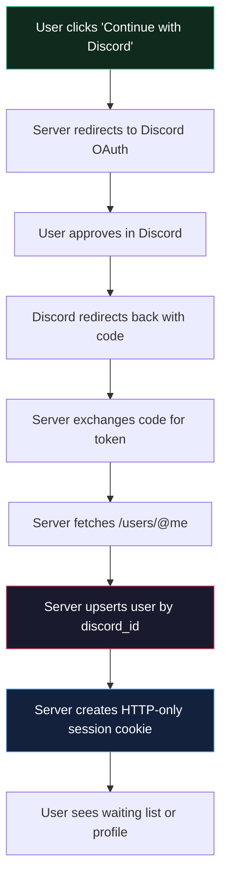
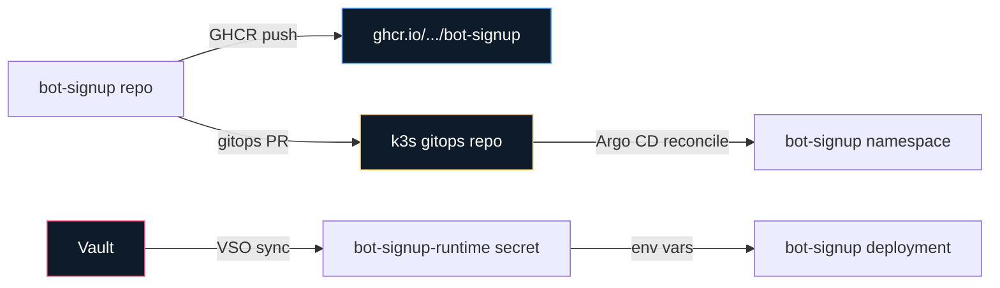

# VibeBot Sessions — Discord Bot Vibe-Coding Signup Platform

> [!summary]
> VibeBot Sessions is a single-binary web application where people sign up to build Discord bots using JavaScript. The Go backend handles Discord OAuth, a SQLite waiting-list database, and admin approval workflows. The React frontend is embedded at runtime using `go:embed` and served by the same process. The production deployment targets Hetzner k3s with Argo CD reconciliation and Vault-synced runtime secrets. The project's most interesting architectural decisions center on three things: replacing passwords entirely with Discord OAuth as the only identity path, using `go:embed` to produce a single portable binary instead of a two-service system, and using a Kubernetes Job with an attached PVC as the operator access path for SQLite read/write operations.

---

## Why this project exists

The go-go-golems team runs a Discord bot runtime at [github.com/go-go-golems/discord-bot](https://github.com/go-go-golems/discord-bot). The runtime lets developers write bot logic in JavaScript and run it against the Discord API. The runtime is production-ready. The gap is onboarding: someone who wants to use it needs to know it exists, sign up, get access, and start coding. VibeBot Sessions fills that gap.

The system has a controlled access model. Not everyone who wants a bot should get one immediately. The platform uses a waiting list: people sign up with their Discord identity, an administrator reviews the request, and if approved, the admin fills in the four Discord application credentials (application ID, bot token, guild ID, public key) that the user's bot will need. The approved user then logs in, sees their credentials, and reads the tutorial to start coding.

The business requirement that shaped the entire auth layer came after the initial design was written. The first design used passwords, bcrypt hashing, and JWTs stored in localStorage. The product direction changed: there should be no password at all. Discord OAuth should be the only identity path, using HTTP-only session cookies. The already-committed password/JWT backend was replaced wholesale rather than layered. That pivot is the central story of the implementation.

---

## The three identities of the project

Every substantial project has multiple overlapping purposes. VibeBot Sessions is no exception. It is simultaneously:

1. **A Discord bot onboarding platform.** The core product: a waiting-list and approval system that gives users their Discord bot credentials and a tutorial to start coding.

2. **A single-binary Go + React deployment.** The architectural constraint that shapes the entire project structure: a Go HTTP server that embeds a React SPA via `go:embed`, producing one distributable binary.

3. **A k3s GitOps application with Vault-synced secrets.** The operational reality: the Hetzner k3s cluster uses Argo CD to reconcile desired state from a GitOps repository, Vault to hold OAuth credentials, and Vault Secrets Operator to materialize them into Kubernetes Secrets at runtime.

These three identities are not in conflict, but they each pull the design in different directions. The onboarding platform wants flexible user flows. The single-binary requirement wants minimal external dependencies. The GitOps model wants declarative desired state and zero interactive ops. The implementation resolves those tensions through deliberate choices at each layer.

---

## Architecture decision: no passwords, ever

The original design document specified signup and login forms with email, Discord ID, and a password field. The server would bcrypt-hash passwords and return a JWT in a JSON response. The frontend would store the JWT in `localStorage` and send it as a `Bearer` token on every API call.

That design is a reasonable starting point for a self-contained auth system. But it has a specific problem here: the platform already needs Discord OAuth for something else. Users must have a Discord identity to get a bot token assigned. The Discord API will tell the app who the user is. Adding a password layer on top of that means managing a second identity system for no good reason.

The product decision was to remove passwords entirely. The only signup and login path is Discord OAuth. The app never asks for a password because it never needs one.

This decision has cascading consequences:



The session cookie is the only credential. There is no JWT, no `localStorage`, no `Bearer` header. Every authenticated request carries the cookie automatically. The cookie is HTTP-only, so JavaScript cannot read it. The cookie is signed with a server-side secret, so tampering is detected and rejected.

---

## The session system

The session manager lives in `internal/auth/sessions.go`. It is a small, self-contained piece that signs small cookie payloads using HMAC-SHA256.

The key insight of the session design is that the session cookie does not contain the user ID in plaintext. It contains a signed, base64-encoded payload: `userID|expiresAt`. The signature proves the payload was written by the server. If any part of the payload is changed, verification fails.

```go
func (m *SessionManager) sign(payload string) string {
    mac := hmac.New(sha256.New, m.secret)
    mac.Write([]byte(payload))
    sig := mac.Sum(nil)
    return base64.RawURLEncoding.EncodeToString([]byte(payload)) + "." +
           base64.RawURLEncoding.EncodeToString(sig)
}

func (m *SessionManager) ReadSession(r *http.Request) (int64, error) {
    cookie, err := r.Cookie(SessionCookieName)
    if err != nil {
        return 0, err
    }
    payload, err := m.verify(cookie.Value)
    if err != nil {
        return 0, err
    }
    parts := strings.Split(payload, "|")
    userID, _ := strconv.ParseInt(parts[0], 10, 64)
    expires, _ := strconv.ParseInt(parts[1], 10, 64)
    if time.Now().Unix() > expires {
        return 0, fmt.Errorf("session expired")
    }
    return userID, nil
}
```

The OAuth state cookie follows the same pattern. When the user initiates Discord OAuth, the server generates a random state value, signs it into a cookie along with the `return_to` URL, and sends the state in the redirect to Discord. When Discord returns, the callback verifies the signed cookie matches the state parameter. This prevents CSRF attacks and open-redirect exploits without needing an `oauth_states` database table.

```go
func sanitizeReturnTo(returnTo string) string {
    if returnTo == "" ||
       !strings.HasPrefix(returnTo, "/") ||
       strings.HasPrefix(returnTo, "//") ||
       strings.Contains(returnTo, "://") {
        return "/waiting-list"
    }
    return returnTo
}
```

The `sanitizeReturnTo` function is the open-redirect defense. Even if an attacker crafts a state cookie with `return_to=https://evil.com`, the function rejects it and falls back to `/waiting-list`. The return path must be an origin-relative path starting with `/`.

---

## The database layer

SQLite is the database. This is a deliberate choice for a platform in its first iteration. The entire database is one file on disk. There is no separate database server to install, configure, or maintain. The Go process opens the file, enables WAL mode for concurrent reads during writes, and runs embedded SQL migrations.

```go
func Open(ctx context.Context, path string) (*DB, error) {
    db, err := sql.Open("sqlite", path)
    if err != nil {
        return nil, err
    }
    _, _ = db.Exec("PRAGMA journal_mode=WAL")
    _, _ = db.Exec("PRAGMA foreign_keys=ON")
    // ...
}
```

The schema has two tables: `users` and `bot_credentials`. The `bot_credentials` table is a one-to-one child of `users`. When an admin approves a user, the approval inserts the four Discord credential fields into `bot_credentials` atomically with the user status change.

```sql
CREATE TABLE IF NOT EXISTS users (
    id            INTEGER PRIMARY KEY AUTOINCREMENT,
    discord_id    TEXT    UNIQUE NOT NULL,
    email         TEXT    UNIQUE,
    display_name  TEXT    NOT NULL,
    avatar_url    TEXT,
    status        TEXT    NOT NULL DEFAULT 'waiting'
                  CHECK(status IN ('waiting','approved','rejected','suspended')),
    role          TEXT    NOT NULL DEFAULT 'user'
                  CHECK(role IN ('user','admin')),
    last_login_at TEXT,
    created_at    TEXT    NOT NULL DEFAULT (datetime('now')),
    updated_at    TEXT    NOT NULL DEFAULT (datetime('now'))
);

CREATE TABLE IF NOT EXISTS bot_credentials (
    id              INTEGER PRIMARY KEY AUTOINCREMENT,
    user_id         INTEGER UNIQUE NOT NULL
                    REFERENCES users(id) ON DELETE CASCADE,
    application_id  TEXT    NOT NULL,
    bot_token       TEXT    NOT NULL,
    guild_id        TEXT    NOT NULL,
    public_key      TEXT    NOT NULL,
    approved_by     INTEGER REFERENCES users(id),
    approved_at     TEXT,
    created_at      TEXT    NOT NULL DEFAULT (datetime('now')),
    updated_at      TEXT    NOT NULL DEFAULT (datetime('now'))
);
```

The `user_status` values control the UI. A waiting user sees the waiting-list page. An approved user sees their profile with their bot credentials. A rejected or suspended user sees a status message with a logout option. The distinction between `role` (user vs admin) and `status` (waiting vs approved vs rejected vs suspended) is intentional: every user has a role, and every user has a status, and they are independent axes.

---

## The server and routing

The Go backend uses `net/http.ServeMux` from Go 1.22+. This means routes are registered with method-qualified patterns: `mux.HandleFunc("GET /api/health", ...)`. The `ServeMux` handles method matching, so `GET /api/profile` and `PUT /api/profile` are separate patterns.

The server exposes three groups of routes:

**Public routes** — accessible without authentication:
- `GET /api/health` — server health
- `GET /api/stats` — public user count statistics
- `GET /auth/discord/login` — initiates OAuth flow
- `GET /auth/discord/callback` — completes OAuth flow

**Authenticated user routes** — requires a valid session cookie:
- `GET /api/auth/me` — current user identity
- `POST /api/auth/logout` — clears session
- `GET /api/profile` — current user's profile including credentials if approved
- `PUT /api/profile` — update display name or email

**Admin routes** — requires session plus `role=admin`:
- `GET /api/admin/waitlist` — all users with `status='waiting'`
- `GET /api/admin/users` — all users with pagination
- `POST /api/admin/users/{id}/approve` — approve and assign bot credentials
- `POST /api/admin/users/{id}/reject` — reject the signup request
- `POST /api/admin/users/{id}/suspend` — suspend an approved user
- `POST /api/admin/users/{id}/enable` — re-enable a suspended user
- `PUT /api/admin/users/{id}/credentials` — update bot credentials
- `DELETE /api/admin/users/{id}` — delete user and cascade credentials

The OAuth Discord client lives in `internal/auth/discord_oauth.go`. It wraps `golang.org/x/oauth2` and implements two methods: `AuthCodeURL(state string)` and `ExchangeAndFetchUser(ctx, code)`. The `ExchangeAndFetchUser` method exchanges the authorization code for a token, then immediately calls `https://discord.com/api/users/@me` to get the Discord user identity before returning.

```go
func (d *DiscordOAuth) ExchangeAndFetchUser(ctx context.Context, code string) (*DiscordUser, error) {
    token, err := d.config.Exchange(ctx, code)
    if err != nil {
        return nil, fmt.Errorf("exchange discord code: %w", err)
    }
    client := d.config.Client(ctx, token)
    return fetchDiscordUser(ctx, client)
}
```

The `fetchDiscordUser` function makes a direct HTTP call to Discord's `/users/@me` endpoint using the OAuth2-access-token client. The response is a `DiscordUser` struct with ID, username, discriminator, global name, avatar hash, email, and verification status.

---

## The frontend: React, Vite, Tailwind

The frontend is a React SPA with Vite as the build tool, Tailwind CSS for styling, Redux Toolkit for global state, and RTK Query for API calls.

The frontend makes no assumptions about auth. On startup, it calls `GET /api/auth/session` (or `GET /api/auth/me`) to determine whether the user has a valid server-side session. If yes, the user is logged in. If no, they are a visitor. The frontend never holds a long-lived token.

RTK Query is configured with `credentials: 'include'` so that all API requests send the session cookie:

```typescript
const baseQuery = fetchBaseQuery({
  baseUrl: '/',
  credentials: 'include',
});

export const apiSlice = createApi({
  reducerPath: 'api',
  baseQuery,
  endpoints: (builder) => ({
    getMe: builder.query<User, void>({
      query: () => '/api/auth/me',
    }),
    logout: builder.mutation<void, void>({
      query: () => ({ url: '/api/auth/logout', method: 'POST' }),
    }),
    getStats: builder.query<Stats, void>({
      query: () => '/api/stats',
    }),
    // ... admin endpoints
  }),
});
```

The React Router routes are the following:

| Path | Component | Auth required? |
| --- | --- | --- |
| `/` | `LandingPage` | No |
| `/auth/callback` | `OAuthCallbackPage` | No |
| `/waiting-list` | `WaitingListPage` | Yes |
| `/profile` | `ProfilePage` | Yes |
| `/tutorial` | `TutorialPage` | No |
| `/admin` | `AdminDashboard` | Yes, admin only |
| `/admin/users/:id` | `AdminUserDetail` | Yes, admin only |
| `*` | `NotFoundPage` | No |

The landing page matches a visual reference that was provided during the design phase: an off-white background with purple accents, a two-column hero with a value-prop left side and a signup card on the right, and three "What you get" feature cards below. The signup card has a "Continue with Discord" button as the only call-to-action, since password signup no longer exists.

The profile page shows the user's Discord identity, their account status, and — if approved — their bot credentials. The bot token is masked by default with a "Show" toggle and a "Copy" button. The tutorial page renders the full discord-bot tutorial markdown with syntax highlighting for code blocks and a copy button on each code sample.

---

## The `go:embed` embedded frontend

Production deployment is a single Go binary. The React frontend is compiled and the output is embedded into the binary using `//go:embed`.

The embedding system lives in `internal/web/`:

```go
//go:embed embed/public
var assets embed.FS
```

When the embedded assets are present (the `embed` build tag is active), the server adds an SPA fallback handler:

```go
spaHandler, err := web.NewSPAHandler(&web.SPAOptions{
    APIPrefixes: []string{"/api", "/auth"},
})
mux.Handle("GET /{filepath...}", spaHandler)
```

The SPA handler checks incoming requests: if the path starts with `/api` or `/auth`, the request passes through to the API/auth handlers. If not, the handler looks for a matching static file. If no file exists, it serves `index.html`, which allows React Router to handle client-side routing.

The `web.NewSPAHandler` function also acts as a guard: if `index.html` is not present in the embedded filesystem (for example, when running `make dev-backend` without having built the frontend), it returns an error and the SPA handler is not registered. The server still functions as an API-only backend in that case.

The `cmd/build-web/main.go` builds the frontend using Dagger. The Dagger pipeline:

1. Mounts the `ui/` directory into a `node:22-bookworm` container.
2. Enables `corepack` and activates `pnpm@10.15.1`.
3. Runs `pnpm install --frozen-lockfile --prefer-offline` to install dependencies using a cached store.
4. Runs `pnpm run build` to produce the Vite production build.
5. Exports `ui/dist/` to `internal/web/embed/public/`.

If Docker or Dagger is unavailable, a local fallback runs `pnpm --dir ui build` and copies the output directly:

```go
func buildWebLocal(ctx context.Context) error {
    // Run: pnpm --dir ui run build
    // Copy: ui/dist/* -> internal/web/embed/public/
}
```

The `Makefile`'s `build` target runs the full pipeline in sequence: frontend lint, frontend build, Storybook build, `go run ./cmd/build-web`, and `go build -tags embed -o bot-signup ./cmd/bot-signup`.

---

## The deployment: k3s, Argo CD, Vault

The production target is the Hetzner k3s cluster that runs other go-go-golems applications. The deployment follows the established pattern from the Pyxis project:



The GitOps repository owns the Kubernetes desired state. The app repository owns the Docker image and the GitOps PR automation. The `Dockerfile` produces a minimal Debian-based image that includes the Go binary but not the Node.js toolchain.

```dockerfile
FROM golang:1.25-bookworm AS build
COPY --from=web /src/ui/dist ./internal/web/embed/public
RUN CGO_ENABLED=0 go build -tags embed -trimpath -ldflags="-s -w" -o /out/bot-signup ./cmd/bot-signup

FROM debian:bookworm-slim AS runtime
COPY --from=build /out/bot-signup /usr/local/bin/bot-signup
EXPOSE 8080
ENTRYPOINT ["bot-signup"]
CMD ["serve"]
```

The runtime image includes CA certificates and runs as a non-root `appuser`. A `/data` volume is declared so that a PersistentVolumeClaim can mount storage for the SQLite database file. This matters: the SQLite database lives on a PVC, not inside the container. Operator access to the database uses a short-lived Kubernetes Job that mounts the same PVC and runs `sqlite3` against the file.

---

## The production SQLite access pattern

The first Discord login created a production user row. Promoting that user to admin required writing directly to the SQLite database on the PVC. The approach that worked was a Kubernetes Job that runs `alpine:3.20` with `apk add sqlite` and mounts the `bot-signup-data` PVC at `/data`.

```yaml
spec:
  template:
    spec:
      volumes:
        - name: data
          persistentVolumeClaim:
            claimName: bot-signup-data
      containers:
        - name: sqlite
          image: alpine:3.20
          command: ["sh", "-c"]
          args:
            - apk add --no-cache sqlite
              && sqlite3 /data/bot-signup.db "update users set role = 'admin', updated_at = datetime('now') where discord_id = 'YOUR_DISCORD_ID';"
              && sqlite3 /data/bot-signup.db "select id, discord_id, email, display_name, role, status from users;"
          volumeMounts:
            - name: data
              mountPath: /data
```

The query was guarded: the Job first checked that exactly one user existed before running the broad update. A future improvement would target the specific Discord ID rather than updating all users.

The key operational notes:

- The PVC is `ReadWriteOnce`, which is fine for the current single-replica deployment.
- SQLite WAL files (`-wal`, `-shm`) must not be casually copied while the app is running.
- The runtime image does not include `sqlite3`, so direct `kubectl exec` into the app container does not work for DB access.

---

## What was tricky: the route conflict

The first container smoke test during deployment planning exposed a Go `http.ServeMux` panic. The server's `mux.Handle("GET /{filepath...}", spaHandler)` conflicted with `mux.HandleFunc("GET /", indexHandler)` because the catch-all `/{filepath...}` matches the same requests as `/`.

This was not a compilation problem. It was a runtime problem: the server compiled fine and the `--help` smoke passed, but when `serve` actually ran with embedded assets present, the HTTP server initialization failed.

The fix is to register only one SPA catch-all pattern and ensure it does not overlap with existing routes. The `/api` and `/auth` prefixes are already excluded by the SPA handler before the fallback logic runs, so the conflict was specifically between `/` (registered by the health handler or a catch-all) and `/{filepath...}`.

In practice, this means the SPA handler should not be registered if there is already a `GET /` handler, or the ordering should be reversed: register the SPA catch-all first, then API routes on top of it. Go's `ServeMux` handles exact pattern matches before wildcards, so as long as `/api/health` and `/auth/discord/login` are registered before the catch-all, they take precedence.

---

## What was tricky: the auth pivot

The most significant implementation challenge was not a technical problem but a timeline problem. The original design document was written with passwords and JWTs. Implementation began. Phases 1 through 4 were committed: Go scaffold, SQLite layer, auth endpoints with bcrypt and JWT, profile and admin handlers.

Then the product direction changed. No passwords. Discord OAuth only. Session cookies instead of JWTs.

The committed implementation had to be replaced, not modified. The correct approach was:

1. Remove `internal/auth/jwt.go`, `internal/auth/password.go`, and the related tests.
2. Add `internal/auth/discord_oauth.go` with the OAuth2 Discord flow.
3. Add `internal/auth/sessions.go` with the signed cookie session manager.
4. Update the database models: remove `password_hash`, add Discord fields.
5. Replace auth routes: `POST /api/auth/signup` → `GET /auth/discord/login`, `POST /api/auth/login` → `GET /auth/discord/callback`.
6. Replace JWT middleware with session middleware.
7. Update frontend auth plan: remove login/signup forms, add Discord OAuth button.

The database migration was rewritten entirely rather than added incrementally. This is clean for a new project with no production data, but it means any developer who had run the old migration would need to delete their local `data/bot-signup.db` and reinitialize.

---

## Testing strategy

The project has three layers of tests.

**Go unit tests** cover the business logic: database operations, auth handlers, session management, and server routes. The auth tests use a mock Discord OAuth client to avoid needing real Discord credentials during test runs. The key test patterns:

```go
func TestOAuthCallback_CreatesUserAndSession(t *testing.T) {
    // Mock Discord OAuth returns a known user
    mockOAuth := &mockDiscordOAuth{user: &DiscordUser{
        ID:          "123456",
        Username:    "testuser",
        GlobalName:  "Test User",
        Email:       "test@example.com",
    }}
    srv := server.New(db, server.Options{
        DiscordOAuthOverride: mockOAuth,
    })
    // Exchange code, verify session cookie and user record
}
```

**Frontend tests** use Storybook stories as the primary test artifact. Each component has a story that demonstrates its behavior in isolation. Storybook stories are built and committed as static output (`ui/storybook-static/`), and the CI workflow runs `pnpm --dir ui build-storybook` to catch rendering regressions.

**Playwright smoke tests** run against the live app (or the embedded binary started in a container) to verify the critical user flows: landing page loads, Discord OAuth initiates, callback completes, waiting-list page renders, profile page shows approved credentials.

---

## The GitOps structure

The GitOps repository at `gitops/kustomize/bot-signup/` contains:

```text
namespace.yaml           — creates the bot-signup namespace
serviceaccount.yaml      — bot-signup service account
vault-connection.yaml    — VaultConnection CR for VSO
vault-auth.yaml          — VaultAuth CR with Kubernetes auth method
runtime-secret.yaml     — VaultStaticSecret pointing to kv/apps/bot-signup/prod/runtime
image-pull-secret.yaml  — VaultStaticSecret for GHCR private images
persistentvolumeclaim.yaml — 1Gi ReadWriteOnce PVC at /data
deployment.yaml         — 1 replica, env from runtime-secret, health probe on /api/health
service.yaml            — port 80 → container port 8080
ingress.yaml            — bot-vibing.yolo.scapegoat.dev with Traefik
kustomization.yaml      — wires all resources in the right order
```

The `runtime-secret.yaml` uses Vault Secrets Operator to sync secrets from Vault:

```yaml
apiVersion: secrets.hashicorp.com/v1beta1
kind: VaultStaticSecret
metadata:
  name: bot-signup-runtime
  annotations:
    argocd.argoproj.io/sync-wave: "-1"
spec:
  vaultAuthRef: bot-signup
  mount: kv
  type: kv-v2
  path: apps/bot-signup/prod/runtime
  refreshAfter: 30s
  destination:
    name: bot-signup-runtime
    create: true
    overwrite: true
```

The Vault path `kv/apps/bot-signup/prod/runtime` contains the Discord OAuth credentials and session secret. VSO syncs them into a Kubernetes Secret named `bot-signup-runtime`, which the Deployment references via `envFrom` or `secretKeyRef` entries.

---

## The GitHub Actions CI pipeline

The `publish-image.yaml` workflow runs on every PR and on every push to `main`. It:

1. Runs `go test ./...` to validate the Go backend.
2. Runs `pnpm --dir ui lint` and `pnpm --dir ui build` to validate the frontend.
3. Runs `BUILD_WEB_LOCAL=1 make build` to produce the embedded binary.
4. Builds the Docker image with Docker Buildx and pushes to GHCR.
5. On merge to `main`, opens a GitOps PR that updates the Kustomize image tag to the published SHA.

The GitOps PR automation is in `scripts/open_gitops_pr.py`. It reads `deploy/gitops-targets.json` to find the target files in the GitOps repository and updates the image tag in `deployment.yaml`:

```json
{
  "targets": [
    {
      "repo": "/home/manuel/code/wesen/2026-03-27--hetzner-k3s",
      "files": [
        "gitops/kustomize/bot-signup/deployment.yaml"
      ]
    }
  ]
}
```

The workflow skips GitOps PR creation if `GITOPS_PR_TOKEN` is not configured, which is the right behavior for a first deployment where the remote repository does not yet exist.

---

## The key commit history

The implementation followed a linear phase order:

| Commit | Phase | Purpose |
| --- | --- | --- |
| `3ac2707` | Design ticket | docmgr baseline, design doc written |
| `c01343c` | Phase 1 | Go scaffold: Cobra CLI, `serve` command, health endpoint |
| `b9090b8` | Phase 2 | SQLite layer: database, models, migrations |
| `acffb5d` | Phase 3 | Auth endpoints with bcrypt/JWT (later replaced) |
| `24c3187` | Phase 4 | Profile and admin handlers |
| `2c49ce9` | Phase 3R | Auth pivot: replace password/JWT with Discord OAuth + sessions |
| `93e0a81` | Phase 4R | Profile/admin handlers updated for session auth |
| `6ec0645` | Phase 5 | Vite + React + Tailwind frontend scaffold, landing page |
| `5d71b1a` | Phase 7 | User pages: waiting list, profile, tutorial page |
| `55287f1` | Phase 8 | Admin pages: dashboard, approval form |
| `1f16ac0` | Phase 9 | Dagger web build pipeline |
| `5ef26f0` | Phase 10 | Dockerfile, GitHub Actions CI, GitOps packaging |
| `185247e` | Polish | Approval form lint fixes, credential admin flow |

The phases marked with `R` are the refactored phases after the auth pivot. The auth pivot (`2c49ce9`) replaced three phases worth of committed code.

---

## Open questions

- **ServeMux conflict resolution.** The current workaround for the `GET /{filepath...}` vs `GET /` panic is to register routes in the right order. The proper long-term fix needs review: should `GET /` be removed from the mux in production, should the SPA handler use a different pattern, or should `internal/web/static.go` be updated to avoid the conflict?
- **GitHub remote.** The local repository has no `origin` remote. GHCR publishing in CI requires a GitHub repository to exist. When the remote is added, the `publish-image` workflow can push images.
- **SQLite on PVC.** The current deployment uses a single-replica Deployment with a ReadWriteOnce PVC. This is appropriate for the initial version, but scaling beyond one replica requires either moving to a server database or adding SQLite locking verification.
- **First-admin bootstrap.** The current process for promoting the first admin requires a Kubernetes Job that runs `sqlite3` against the PVC. A CLI command like `bot-signup admin promote --discord-id=...` would be cleaner for repeated operations.

---

## Project working rule

Do not add a second authentication path. The entire point of this platform is to reduce onboarding friction by using Discord as the identity provider. Any addition of password-based signup, magic link email auth, or external OAuth provider (Google, GitHub) would add complexity and go against the product design. If a future use case suggests one of those, first ask what problem it solves that Discord OAuth does not already solve for a Discord bot platform.

---

## Related projects and references

The platform depends on the go-go-golems/discord-bot runtime. The deployment model follows the Pyxis project pattern. The implementation drew from the go-web-frontend-embed skill and the go-go-golems project setup conventions.

Key paths:
- App repository: `/home/manuel/code/wesen/2026-05-01--bot-signup`
- Design diary: `ttmp/2026/05/01/bot-signup--discord-bot-vibe-coding-signup-platform/reference/01-investigation-diary.md`
- Deployment diary: `ttmp/2026/05/01/BOT-SIGNUP-K3S-DEPLOY--deploy-bot-signup-to-k3s-via-bot-vibing-yolo-scapegoat-dev/reference/01-deployment-diary.md`
- GitOps package: `/home/manuel/code/wesen/2026-03-27--hetzner-k3s/gitops/kustomize/bot-signup/`
- Pyxis deployment reference: `/home/manuel/code/wesen/2026-03-27--hetzner-k3s/gitops/kustomize/pyxis/`
- Pyxis production diary: `/home/manuel/code/wesen/2026-04-23--pyxis/ttmp/2026/04/29/PYXIS-PRODUCTION-ARGOCD-GLAZED--turn-pyxis-into-a-deployed-glazed-application-on-argocd-k3s/reference/01-production-deployment-diary.md`