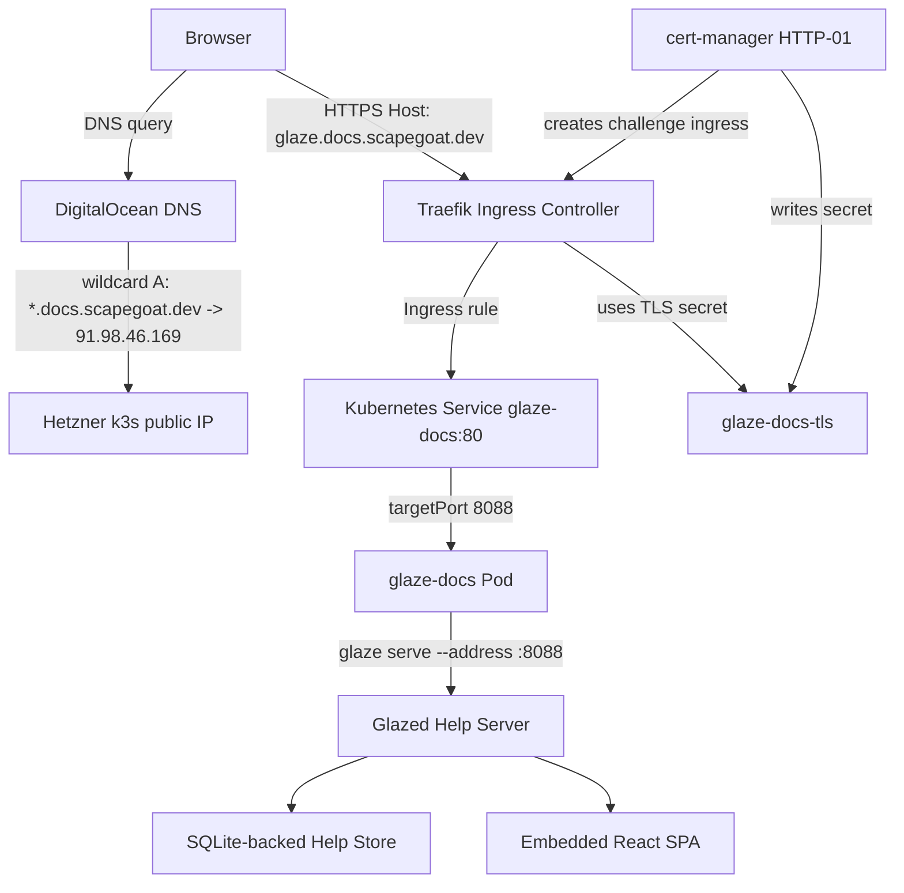
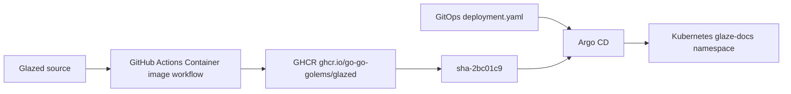

# Deploying Glazed Help Browser to Argo CD: Production Deep Dive

This report explains the production deployment of the Glazed help browser at `https://glaze.docs.scapegoat.dev`. It covers the application build, the container image, the GitOps manifests, DNS, TLS, Argo CD reconciliation, and the runtime failures that appeared after the first successful rollout. The goal is to preserve the whole engineering path: what worked, what failed, why each failure happened, and what changes made the deployment stable.

> [!summary]
> 1. The final production path is `Glazed source -> GitHub Actions -> GHCR image -> Argo CD Application -> Kubernetes Deployment/Service/Ingress -> Traefik -> cert-manager -> DigitalOcean DNS`.
> 2. The deployment initially looked healthy at the `/api/health` level, but the browser exposed two real runtime defects: SQLite in-memory connection handling on the server and null `versions` handling in the React app.
> 3. The container build needed CGO, Debian runtime libraries, a noninteractive Corepack setup, and a `.dockerignore` that excluded local `node_modules` from the Docker context.
> 4. The final deployed image is pinned in GitOps as `ghcr.io/go-go-golems/glazed:sha-2bc01c9`, and the public API currently returns `{"ok":true,"sections":72}`.

## Current production state

The production endpoint is live:

```text
https://glaze.docs.scapegoat.dev
```

The deployed Kubernetes application is:

```text
namespace: glaze-docs
Deployment: glaze-docs
Service: glaze-docs
Ingress: glaze-docs
TLS Secret: glaze-docs-tls
Argo CD Application: glaze-docs
```

The current image in the k3s GitOps repository is:

```text
ghcr.io/go-go-golems/glazed:sha-2bc01c9
```

The important verification outputs were:

```bash
curl https://glaze.docs.scapegoat.dev/api/health
```

```json
{"ok":true,"sections":72}
```

```bash
curl https://glaze.docs.scapegoat.dev/api/packages
```

```json
{
  "packages": [
    {
      "name": "glazed",
      "displayName": "Glazed",
      "versions": [],
      "sectionCount": 72
    }
  ],
  "defaultPackage": "glazed"
}
```

The important final commits are:

| Repository | Commit | Purpose |
|------------|--------|---------|
| `go-go-golems/glazed` | `8e7029f Keep help SQLite store on one connection` | Fix the in-memory SQLite runtime failure. |
| `go-go-golems/glazed` | `b2e13ce Harden help browser runtime errors` | Add client error boundary and null-safe package version handling. |
| `go-go-golems/glazed` | `2bc01c9 Make container web build noninteractive` | Add `.dockerignore` and make Docker/Corepack builds noninteractive. |
| `wesen/2026-03-27--hetzner-k3s` | `cf4b573 Update Glaze docs image to hardened build` | Pin the deployment to `sha-2bc01c9`. |
| `wesen/terraform` | `1e5c368 Add docs wildcard DNS record` | Add `*.docs.scapegoat.dev -> 91.98.46.169`. |
| `wesen/terraform` | `41acc7a Preserve crib wildcard DNS record` | Restore an unrelated but legitimate crib DNS record discovered during planning. |

## Why this deployment exists

`glaze serve` turns the Glazed help system into a browser-accessible documentation site. Locally, it can serve the embedded React help browser and a JSON API backed by the Glazed help store. The production deployment makes that help browser available under the `docs.scapegoat.dev` namespace.

The target hostname was specific:

```text
glaze.docs.scapegoat.dev
```

The DNS requirement was broader:

```text
*.docs.scapegoat.dev
```

The wildcard DNS record is intentional. It reserves a future documentation namespace where additional documentation applications can be added without changing DNS for every subdomain. TLS is deliberately narrower for now: only `glaze.docs.scapegoat.dev` receives a certificate, because the cluster's current `letsencrypt-prod` issuer uses HTTP-01. Wildcard certificates require DNS-01, and the future DNS-01 platform work is tracked separately in the k3s GitOps repository.

## The repositories and their responsibilities

Three repositories participate in the deployment. The deployment is easiest to operate when their responsibilities remain separate.

| Repository | Path | Responsibility |
|------------|------|----------------|
| Glazed application | `/home/manuel/workspaces/2026-05-02/multi-package-hosting-glazed/glazed` | Build `glaze`, embed the web UI, publish GHCR image. |
| k3s GitOps | `/home/manuel/code/wesen/2026-03-27--hetzner-k3s` | Define Argo CD `Application`, Kubernetes `Deployment`, `Service`, and `Ingress`. |
| Terraform DNS | `/home/manuel/code/wesen/terraform` | Manage DigitalOcean DNS records for `scapegoat.dev`. |

The deployment crosses repository boundaries, but each repo has a single source-of-truth role. The application repo should not contain cluster routing. The k3s repo should not build the application. The Terraform repo should not know about pods or containers. Keeping the responsibilities separate made it possible to isolate the later failures: one was a server implementation bug, one was a browser runtime bug, one was a Docker build-context problem, and one was Terraform state drift unrelated to Glazed.

## Architecture

The runtime request path is:



The build and deployment path is:



The DNS and TLS decisions are separate:

```text
DNS: *.docs.scapegoat.dev A 91.98.46.169
TLS: glaze.docs.scapegoat.dev only
```

This distinction matters. Wildcard DNS is just a routing convenience at the DNS layer. Wildcard TLS is an ACME certificate issuance problem and requires DNS-01. The current production deployment uses wildcard DNS but concrete HTTP-01 TLS.

## Application build design

The production image must contain two things:

1. the `glaze` binary,
2. the embedded browser UI assets served by `pkg/web`.

The Dockerfile builds both:

```dockerfile
FROM golang:1.25-bookworm AS builder
ENV CI=true \
  COREPACK_ENABLE_DOWNLOAD_PROMPT=0
WORKDIR /src
COPY . .

RUN apt-get update \
  && apt-get install -y --no-install-recommends nodejs npm ca-certificates \
  && npm install -g corepack@latest \
  && corepack enable \
  && go generate ./pkg/web \
  && CGO_ENABLED=1 GOOS=linux go build -trimpath -ldflags='-s -w' -o /out/glaze ./cmd/glaze

FROM debian:bookworm-slim
RUN apt-get update \
  && apt-get install -y --no-install-recommends ca-certificates \
  && rm -rf /var/lib/apt/lists/* \
  && useradd --system --uid 65532 --gid nogroup --home-dir /nonexistent --shell /usr/sbin/nologin nonroot
COPY --from=builder /out/glaze /usr/local/bin/glaze
USER nonroot:nogroup
EXPOSE 8088
ENTRYPOINT ["/usr/local/bin/glaze"]
CMD ["serve", "--address", ":8088"]
```

Two parts of this Dockerfile are more important than they first look.

First, `CGO_ENABLED=1` is required. The help store depends on `github.com/mattn/go-sqlite3`, which requires cgo. A fully static `CGO_ENABLED=0` binary compiles but fails at runtime when SQLite is used. The observed error was:

```text
Binary was compiled with 'CGO_ENABLED=0', go-sqlite3 requires cgo to work. This is a stub
```

The fix was not cosmetic. It changed the runtime model from a static Go binary to a Debian-based runtime image with a cgo-built binary.

Second, `go generate ./pkg/web` must run before compiling the Go binary. The web UI is embedded into the Go package. A Go-only build that skips web generation can compile a server that lacks the intended frontend assets. The Docker build therefore has to provide both Go and Node/Corepack/pnpm tooling.

## Container workflow and image tags

The image publishing workflow is:

```text
.github/workflows/container.yml
```

It publishes:

- a branch tag, such as `main`,
- a version tag, when building from a version tag,
- a commit tag, such as `sha-2bc01c9`.

The production deployment originally used `main`, but it was later pinned to a SHA tag for deterministic rollout. The final image is:

```text
ghcr.io/go-go-golems/glazed:sha-2bc01c9
```

Pinning matters because `main` is mutable. If Argo CD re-applies a deployment using `main`, the same GitOps commit can resolve to different image contents at different times. The SHA tag makes the GitOps commit describe a stable artifact.

## The `.dockerignore` failure mode

The Docker build eventually hit a problem caused by sending too much local state into the Docker build context. The important local directory was:

```text
web/node_modules
```

Including `node_modules` in the Docker context is both slow and unsafe. It can also create confusing build failures because the container build now sees host-generated dependencies instead of a clean dependency install. The fix was to add `.dockerignore`:

```text
.git
.gitignore
.github
node_modules
**/node_modules
web/dist
pkg/web/dist
coverage
.DS_Store
.tmp
tmp
ttmp
```

This made the Docker build context match the intended source inputs: code, package metadata, and build scripts, not local generated artifacts.

The Dockerfile was also changed to set:

```dockerfile
ENV CI=true \
  COREPACK_ENABLE_DOWNLOAD_PROMPT=0
```

That makes Corepack/web builds noninteractive. Container builds should not depend on a prompt, a TTY, or a local developer's package-manager state.

## Kubernetes manifests

The GitOps application lives in:

```text
/home/manuel/code/wesen/2026-03-27--hetzner-k3s/gitops/applications/glaze-docs.yaml
```

It points Argo CD at:

```text
gitops/kustomize/glaze-docs
```

The Kustomize package defines a deployment, service, and ingress. The final deployment uses:

```yaml
containers:
  - name: glaze-docs
    image: ghcr.io/go-go-golems/glazed:sha-2bc01c9
    imagePullPolicy: IfNotPresent
    args:
      - serve
      - --address
      - :8088
    ports:
      - containerPort: 8088
        name: http
    readinessProbe:
      httpGet:
        path: /api/health
        port: http
    livenessProbe:
      httpGet:
        path: /api/health
        port: http
```

The service maps cluster port 80 to container port 8088:

```text
Service glaze-docs:80 -> Pod containerPort 8088
```

The ingress routes:

```text
Host: glaze.docs.scapegoat.dev
Path: /
```

and asks cert-manager for a certificate named:

```text
glaze-docs-tls
```

The deployment is intentionally small: one replica, no persistent volume, no external secrets, no database service. The help content is embedded and loaded into the server's help store at startup.

## DNS and the unrelated crib drift

The DNS change for Glazed was simple:

```hcl
wildcard_docs_a = {
  type  = "A"
  name  = "*.docs"
  value = "91.98.46.169"
  ttl   = 3600
}
```

It creates:

```text
*.docs.scapegoat.dev -> 91.98.46.169
```

The first Terraform plan also wanted to destroy an unrelated record:

```text
*.crib.scapegoat.dev -> 100.67.90.12
```

That was not part of the Glazed deployment, but it was discovered because both records live in the same Terraform-managed `scapegoat.dev` zone. The destroy was stopped before apply. Investigation later showed that `*.crib` was a legitimate record applied during the crib-k3s work but never committed to Terraform. The remediation was to add the missing `wildcard_crib_a` block back to Terraform config and then apply only the docs record.

The final DNS apply result for the docs work was:

```text
Apply complete! Resources: 1 added, 0 changed, 0 destroyed.
```

This matters for the Glazed story because the deployment did not proceed by blindly applying a Terraform plan. The DNS step was treated as infrastructure reconciliation, not as a formality.

## TLS: why explicit HTTP-01 was chosen

The initial idea included wildcard TLS for `*.docs.scapegoat.dev`. The current cluster issuer does not support that. It uses HTTP-01:

```yaml
solvers:
  - http01:
      ingress:
        ingressClassName: traefik
```

HTTP-01 can validate a concrete hostname if Let's Encrypt can reach an HTTP challenge path through the ingress controller. It cannot issue wildcard certificates. Wildcard certificates require DNS-01.

The current production decision is therefore:

```text
Use wildcard DNS now.
Use concrete TLS for glaze.docs.scapegoat.dev now.
Track DNS-01 wildcard TLS as future platform work.
```

This decision avoided turning a single app deployment into a cert-manager platform migration.

## Argo CD rollout sequence

The GitOps repository commit that introduced the app was:

```text
aeda4d3 Deploy Glaze docs application
```

After image hardening, the deployment was updated to:

```text
cf4b573 Update Glaze docs image to hardened build
```

The Argo CD application was applied manually because it was not yet present in the cluster:

```bash
kubectl apply -f gitops/applications/glaze-docs.yaml
```

After that, Argo CD reconciled the Kustomize package. The final status was:

```text
glaze-docs   Synced   Healthy
```

The pod rollout completed:

```text
deployment "glaze-docs" successfully rolled out
```

The cert-manager certificate became ready:

```text
certificate.cert-manager.io/glaze-docs-tls   True   glaze-docs-tls
```

The public page and API then responded over HTTPS.

## First runtime failure: SQLite in-memory connections

The first deployed image could start and initially report that help sections were loaded:

```text
Loaded help sections sections=72
Help browser listening address=:8088
```

But browser API requests began returning 500s:

```text
GET /api/sections -> 500
GET /api/packages -> 500
```

The server logs showed:

```text
failed to list sections error="no such table: sections"
failed to list packages error="no such table: sections"
health check failed error="no such table: sections"
```

The root cause was the behavior of SQLite in-memory databases with Go's `database/sql` pool. A plain SQLite `:memory:` database is per connection. If the store creates tables on one connection and a later request uses another connection from the pool, that later connection sees a different empty in-memory database. It does not contain the `sections` table.

The simplified failure model is:

```text
startup:
  conn A opens :memory:
  conn A creates sections table
  conn A loads 72 sections

request:
  database/sql gives handler conn B
  conn B opens its own :memory:
  conn B has no sections table
  SELECT ... FROM sections fails
```

The fix was to restrict the store to one open connection when using SQLite:

```go
db, err := sql.Open("sqlite3", dbPath)
if err != nil {
    return nil, errors.Wrap(err, "failed to open database")
}

// A plain :memory: SQLite database is per connection. The store is often used
// in-memory by the help server, so keep one connection to avoid requests
// seeing a fresh empty database without the sections table.
db.SetMaxOpenConns(1)
```

This was committed as:

```text
8e7029f Keep help SQLite store on one connection
```

After deploying an image that included this change, `/api/sections`, `/api/packages`, and `/api/health` returned valid data consistently.

## Second runtime failure: null package versions in the browser

The next visible problem was a white page in the browser. The console showed:

```text
TypeError: can't access property 0, D.versions is null
```

The API response had a package with no versions:

```json
{
  "name": "glazed",
  "displayName": "Glazed",
  "versions": null,
  "sectionCount": 72
}
```

or, after the server-side hardening:

```json
{
  "name": "glazed",
  "displayName": "Glazed",
  "versions": [],
  "sectionCount": 72
}
```

The UI had code paths that assumed `versions` was always a non-null array:

```ts
const effectiveVersion = currentPackage?.versions.length ? selectedVersion : '';
setSelectedVersion(packageData.defaultVersion || initial?.versions[0] || '');
setSelectedVersion(nextPackage?.versions[0] || '');
```

The correct defensive model is:

```ts
const currentVersions = currentPackage?.versions ?? [];
const effectiveVersion = currentVersions.length ? selectedVersion : '';

const initialVersions = initial?.versions ?? [];
setSelectedVersion(packageData.defaultVersion || initialVersions[0] || '');

const nextVersions = nextPackage?.versions ?? [];
setSelectedVersion(nextVersions[0] || '');
```

The deeper lesson is that TypeScript types describe the intended API contract, but production JSON is the actual input. If the server can emit `null` for an array field, the client must either tolerate it or the server must be fixed to emit `[]`. In this deployment, both were improved: the server returns empty arrays, and the client no longer crashes if the field is null.

## Error boundary: preventing white pages

The browser initially failed as a full React crash. The requested improvement was to show an error message instead of a white page. The hardening commit added a React error boundary:

```tsx
<Provider store={store}>
  <HashRouter>
    <ErrorBoundary>
      <App />
    </ErrorBoundary>
  </HashRouter>
</Provider>
```

The boundary renders a visible failure panel with:

- a clear title,
- the error message,
- a link to `/api/health`,
- optional component stack details.

This does not fix the underlying bug by itself. It changes the failure mode from blank page to inspectable page. That matters operationally because a user or operator can distinguish:

```text
server unavailable
API returning invalid shape
client-side render crash
static assets missing
```

without opening DevTools first.

## The font 404

After the hardened image was deployed, Playwright showed the app rendering correctly. The only remaining browser console error was:

```text
GET https://cdn.jsdelivr.net/gh/polgfred/mac-fonts@main/Chicago.woff2 404
```

This comes from:

```text
web/src/styles/global.css
```

The CSS references:

```css
@font-face {
  font-family: 'Chicago_';
  src: url('https://cdn.jsdelivr.net/gh/polgfred/mac-fonts@main/Chicago.woff2') format('woff2');
}
```

This is not currently a functional outage because the app falls back to system fonts. It is still worth fixing. Production pages should not depend on an external GitHub-backed CDN URL for a decorative font unless the asset is pinned, vendored, or optional without console noise.

## Secret scanning status

The GitHub Actions status for the final Glazed commit was mostly green:

```text
Container image: success
golang-pipeline: success
golangci-lint: success
Dependency Scanning: success
CodeQL Analysis: success
Secret Scanning: failure
```

The secret scanning failure appears to be the same pre-existing TruffleHog workflow issue observed on earlier runs, where the workflow reports a same-BASE/HEAD condition rather than an actual leaked secret. It should still be fixed as CI hygiene, but it did not block the container image or the deployment.

## What worked well

The existing platform conventions worked well. The k3s repository already had an understandable shape:

```text
gitops/applications/<app>.yaml
gitops/kustomize/<app>/deployment.yaml
gitops/kustomize/<app>/service.yaml
gitops/kustomize/<app>/ingress.yaml
```

That made it straightforward to add `glaze-docs` without inventing a deployment pattern.

The health endpoint was also useful. It confirmed quickly whether the server could count loaded help sections:

```text
GET /api/health -> {"ok":true,"sections":72}
```

The local container smoke test caught the CGO problem before the first cluster deploy. The public browser test then caught the SQLite and client runtime problems that a compile-only or root-page-only check would not have caught.

The final Argo CD rollout was clean once the right image existed. The application reached `Synced` and `Healthy`, the Deployment reached `1/1`, and cert-manager issued the HTTP-01 certificate automatically.

## What went wrong

The problems fell into separate layers.

### Build layer

The first natural Docker shape was too static for `go-sqlite3`. The code compiled but could not run the help store. The fix was `CGO_ENABLED=1` and a Debian runtime image.

The Docker build context also included local generated files until `.dockerignore` was added. That made the container build less reproducible and eventually caused build problems around `web/node_modules`.

### Runtime server layer

The SQLite store used `:memory:` with the default `database/sql` connection pool. That made different requests see different SQLite databases. The server could load data at startup and still fail later with `no such table: sections`.

### Runtime client layer

The browser assumed `versions` was always an array. Production data exposed the null/empty version case, causing a React crash. The app now handles missing versions and has an error boundary for unexpected crashes.

### Infrastructure layer

Terraform planning uncovered unrelated DNS drift for `*.crib.scapegoat.dev`. This did not break Glazed, but it delayed the DNS apply and required investigation. The important success is that the unexpected destroy was caught before apply.

### Process layer

The deployment crossed multiple repos and included accidental work on an unrelated Codebase Browser task. That work had to be reverted before continuing with Glazed. Cross-repo sessions need an explicit ledger of which repository is being changed and why.

## Validation procedure that should be reused

A useful validation sequence for this deployment is:

```bash
# Application tests
cd /home/manuel/workspaces/2026-05-02/multi-package-hosting-glazed/glazed
GOWORK=off go test ./pkg/help/server ./pkg/web ./pkg/help/store

# Web tests and build
cd web
npm test
npm run build

# GitOps render
cd /home/manuel/code/wesen/2026-03-27--hetzner-k3s
kubectl kustomize gitops/kustomize/glaze-docs >/tmp/glaze-docs.yaml

# DNS drift check
cd /home/manuel/code/wesen/terraform
direnv exec . terraform -chdir=dns/zones/scapegoat-dev/envs/prod plan -detailed-exitcode

# Cluster rollout
kubectl -n argocd get application glaze-docs -o wide
kubectl -n glaze-docs get deploy,svc,ingress,pods,certificate

# Public API
curl -fsS https://glaze.docs.scapegoat.dev/api/health
curl -fsS https://glaze.docs.scapegoat.dev/api/packages | jq .
curl -fsS 'https://glaze.docs.scapegoat.dev/api/sections?' | jq '{total, count:(.sections|length)}'
```

A root-page request is not enough. The critical API calls are `/api/packages` and `/api/sections`, because they exercise the package/version list and the SQLite-backed section listing path.

## Operational model for future updates

Future updates should follow this order:

1. Commit and push application changes in Glazed.
2. Wait for the GHCR image tag `sha-<commit>` to exist.
3. Run or verify the public API against a local container if the change touches server/runtime behavior.
4. Update `gitops/kustomize/glaze-docs/deployment.yaml` to the new immutable image tag.
5. Commit and push the k3s GitOps change.
6. Let Argo CD sync or force a refresh.
7. Validate API, UI, TLS, and pod logs.

The image tag should remain immutable. `main` can be published for convenience, but production should point at `sha-...`.

## File reference

Application repo:

```text
Dockerfile
.dockerignore
.github/workflows/container.yml
pkg/help/store/store.go
pkg/help/server/handlers.go
pkg/help/server/serve.go
pkg/web/static.go
web/src/App.tsx
web/src/main.tsx
web/src/components/ErrorBoundary.tsx
web/src/components/PackageSelector/PackageSelector.tsx
web/src/styles/global.css
```

GitOps repo:

```text
gitops/applications/glaze-docs.yaml
gitops/kustomize/glaze-docs/kustomization.yaml
gitops/kustomize/glaze-docs/deployment.yaml
gitops/kustomize/glaze-docs/service.yaml
gitops/kustomize/glaze-docs/ingress.yaml
```

Terraform repo:

```text
dns/zones/scapegoat-dev/envs/prod/main.tf
```

Ticket docs:

```text
/home/manuel/workspaces/2026-05-02/multi-package-hosting-glazed/glazed/ttmp/2026/05/02/DEPLOY-GLAZE-DOCS--deploy-glaze-serve-to-docs-scapegoat-dev/
```

## Lessons

The main lesson is that a Kubernetes deployment can be healthy at the orchestration layer while still broken at the application interaction layer. Argo CD can be synced, the pod can be ready, the certificate can be valid, and the root page can return HTML, while `/api/sections` still returns 500 or the React app crashes after receiving valid-but-unexpected JSON.

The second lesson is that local smoke tests need to exercise the same paths the browser uses. For this application, that means `/api/health`, `/api/packages`, `/api/sections`, and at least one section-detail request. A health check that only counts sections is useful, but it does not prove that package listing and section listing work through the request path.

The third lesson is that in-memory SQLite needs explicit connection-pool handling in Go. If a process uses `:memory:` and `database/sql`, it should either use one connection, use a shared-cache URI deliberately, or use an on-disk database. The default pool is not a safe abstraction for a single in-memory database.

The fourth lesson is that GitOps deployments should pin images. The final state is much easier to audit because `deployment.yaml` names `sha-2bc01c9`, not a moving `main` tag.

The fifth lesson is that Terraform plans must be read as change proposals, not as confirmation prompts. The docs DNS apply discovered an unrelated crib DNS drift. Stopping on that unexpected destroy preserved a legitimate production-adjacent record and led to a separate incident reconstruction.

## Current follow-ups

The deployment is working. The remaining useful cleanup items are:

1. Remove, vendor, or replace the broken external Chicago font URL so the browser console is clean.
2. Fix the Secret Scanning workflow so the repository has a fully green CI signal.
3. Keep `glaze-docs` pinned to immutable image tags for future releases.
4. Consider adding an automated browser smoke test that loads the deployed page and clicks at least one section.
5. Implement the future DNS-01 wildcard TLS issue only when wildcard docs certificates are needed.

## Related notes and artifacts

- Deployment ticket: `/home/manuel/workspaces/2026-05-02/multi-package-hosting-glazed/glazed/ttmp/2026/05/02/DEPLOY-GLAZE-DOCS--deploy-glaze-serve-to-docs-scapegoat-dev/`
- Future DNS-01 issue: `https://github.com/wesen/2026-03-27--hetzner-k3s/issues/65`
- Production URL: `https://glaze.docs.scapegoat.dev`
- Terraform incident report: [[ARTICLE - Incident Deep Dive - Terraform State Drift from an Uncommitted Crib DNS Apply]]
