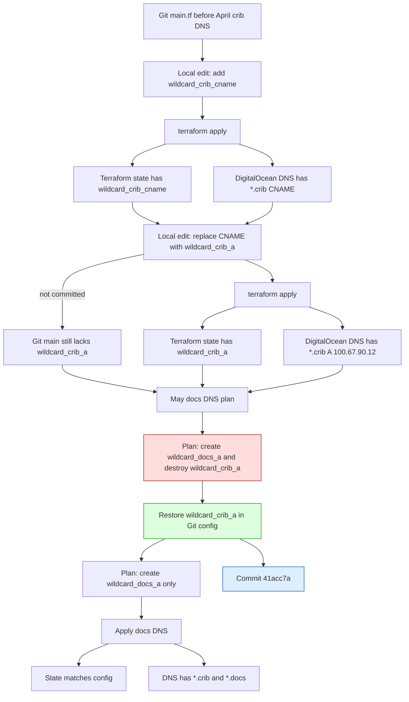

# Incident Deep Dive: Terraform State Drift from an Uncommitted Crib DNS Apply

This report explains a small but instructive infrastructure incident: a Terraform-managed DigitalOcean DNS record for `*.crib.scapegoat.dev` existed in live infrastructure and Terraform state, but was absent from the checked-in Terraform configuration on `main`. The mismatch was discovered while applying an unrelated DNS change for the Glazed documentation deployment. The important result is not only that the record was preserved, but that the investigation reconstructed exactly how it entered state without entering Git history.

> [!summary]
> 1. The immediate change was supposed to add only `*.docs.scapegoat.dev -> 91.98.46.169`, but the first Terraform plan also wanted to destroy `*.crib.scapegoat.dev`.
> 2. `*.crib.scapegoat.dev` was a legitimate record from the April crib-k3s work: it intentionally points at the Tailscale IP `100.67.90.12`.
> 3. The April session edited and applied Terraform twice, first as a CNAME and then as an A record, but did not commit the Terraform repository.
> 4. The May remediation restored the missing `wildcard_crib_a` block to Terraform config, applied only the docs DNS addition, and committed the preservation on `main`.

## Why this note exists

The surface symptom was ordinary Terraform drift. A plan contained one expected create and one unexpected destroy. That happens often enough that it is tempting to treat it as a routine operational detail: read the plan, stop before apply, fix the config, rerun the plan. But this incident was worth writing up because it shows a complete failure chain across several tools:

- Terraform state captured a change made from a local checkout.
- DigitalOcean DNS served the resulting record.
- Git did not contain the configuration that produced that state.
- A later, unrelated DNS change surfaced the mismatch.
- A minitrace archive preserved enough tool-level evidence to reconstruct the exact sequence.

The lesson is not “Terraform is dangerous.” Terraform did what it was designed to do. The lesson is that Terraform state is an independent source of truth, and any workflow that lets state advance without a matching Git commit creates deferred operational ambiguity. The ambiguity may not hurt immediately. It becomes visible when the next operator touches the same state.

## Executive timeline

| Time | Event |
|------|-------|
| 2026-04-15 22:03 UTC | The crib session edited `main.tf` to add `wildcard_crib_cname` as `*.crib -> k3s-proxmox.tail879302.ts.net.` |
| 2026-04-15 22:03 UTC | Terraform applied the CNAME, creating `digitalocean_record.records["wildcard_crib_cname"]`. |
| 2026-04-15 23:21 UTC | The crib session edited `main.tf` again, replacing the CNAME with `wildcard_crib_a` as `*.crib -> 100.67.90.12`. |
| 2026-04-15 23:21 UTC | Terraform applied the replacement, destroying the CNAME and creating the A record with DigitalOcean ID `1815943791`. |
| 2026-04-16 onward | The session committed many changes in `crib-k3s` and `poll-modem`, but no Terraform commit was made. |
| 2026-05-02 | During the Glazed docs deployment, Terraform planned to create `wildcard_docs_a` and destroy missing-from-config `wildcard_crib_a`. |
| 2026-05-02 | The plan was stopped before apply. `wildcard_crib_a` was restored to `main.tf`, and the plan became one create, zero destroy. |
| 2026-05-02 | Terraform applied only `wildcard_docs_a`; `wildcard_crib_a` was preserved. |
| 2026-05-02 | Commit `41acc7a Preserve crib wildcard DNS record` recorded the missing crib DNS configuration on Terraform `main`. |

The important boundary is between April 15 and May 2. On April 15, Terraform state was advanced. On May 2, Git was reconciled back to the state that already existed.

## The systems involved

There were three distinct systems in play. The failure is easier to understand if each system's responsibility is kept separate.

### Terraform DNS repository

The canonical repository for DigitalOcean DNS records is:

```text
/home/manuel/code/wesen/terraform
```

The relevant Terraform environment is:

```text
/home/manuel/code/wesen/terraform/dns/zones/scapegoat-dev/envs/prod
```

The important file is:

```text
dns/zones/scapegoat-dev/envs/prod/main.tf
```

That file contains a map of managed DNS records. Terraform creates one `digitalocean_record.records[...]` resource per map entry. The map key becomes part of the Terraform resource address, so a rename from `wildcard_crib_cname` to `wildcard_crib_a` is not a mutation of one resource address. It is a destroy/create replacement from Terraform's perspective.

The simplified shape is:

```hcl
locals {
  base_records = {
    wildcard_yolo_a = {
      type  = "A"
      name  = "*.yolo"
      value = "91.98.46.169"
      ttl   = 3600
    }

    wildcard_crib_a = {
      type  = "A"
      name  = "*.crib"
      value = "100.67.90.12"
      ttl   = 3600
    }

    wildcard_docs_a = {
      type  = "A"
      name  = "*.docs"
      value = "91.98.46.169"
      ttl   = 3600
    }
  }
}
```

The actual resource then iterates over the map. The key detail is that absence from the map means Terraform should destroy any existing state object with that missing key.

### crib-k3s GitOps repository

The crib cluster's GitOps repository is:

```text
/home/manuel/code/wesen/crib-k3s
```

This repository manages Kubernetes resources for the Proxmox/Tailscale cluster. It contains Argo CD applications, Traefik `IngressRoute` objects, cert-manager DNS01 issuer configuration, and application manifests for services such as `poll-modem`, Grafana, and Jellyfin.

The crib system used `*.crib.scapegoat.dev` as its service hostname namespace. Later state in that repository confirms that `*.crib.scapegoat.dev` became a tailnet-facing DNS pattern, with services such as:

```text
argocd.crib.scapegoat.dev
modem.crib.scapegoat.dev
grafana.crib.scapegoat.dev
watch.crib.scapegoat.dev
```

The crib repository is not the source of truth for DigitalOcean DNS. It documents and consumes the DNS pattern, but the actual `scapegoat.dev` zone is managed in the Terraform repo.

### Glazed docs deployment

The May 2 task was unrelated to crib. The target was to deploy `glaze serve` at:

```text
https://glaze.docs.scapegoat.dev
```

The DNS record needed for that deployment was:

```hcl
wildcard_docs_a = {
  type  = "A"
  name  = "*.docs"
  value = "91.98.46.169"
  ttl   = 3600
}
```

That is the change that led to the Terraform plan. The crib drift was discovered because the docs deployment touched the same Terraform state file.

## The first signal: a plan with an unexpected destroy

The first Terraform plan for the docs change did not show only the desired create. It showed:

```text
Plan: 1 to add, 0 to change, 1 to destroy.
```

The create was expected:

```text
# digitalocean_record.records["wildcard_docs_a"] will be created
name  = "*.docs"
type  = "A"
value = "91.98.46.169"
```

The destroy was not expected:

```text
# digitalocean_record.records["wildcard_crib_a"] will be destroyed
fqdn  = "*.crib.scapegoat.dev"
type  = "A"
value = "100.67.90.12"
```

This is the critical operational moment. The plan was not applied. If it had been applied unchanged, it would have removed a live DNS record for the crib cluster while adding the docs wildcard. The fact that Terraform displayed the destroy was the safety mechanism working correctly. The remaining question was why the destroy existed.

Terraform's explanation was precise:

```text
because key ["wildcard_crib_a"] is not in for_each map
```

That sentence tells the whole local technical story. Terraform state contained a resource addressed as:

```text
digitalocean_record.records["wildcard_crib_a"]
```

But the current configuration map did not contain the key:

```text
wildcard_crib_a
```

From Terraform's perspective, the desired configuration no longer included the resource. Destroying it was the expected reconciliation action.

## Why Terraform behaved correctly

Terraform compares desired configuration with state. It does not compare Git history with live infrastructure. It also does not know whether a missing block was deleted intentionally, lost during a bad merge, or never committed in the first place.

A simplified model of the Terraform reconciliation loop is:

```text
configuration = read_hcl_files()
state         = read_remote_state()
live          = refresh_provider_objects(state)

for each resource in state:
    if resource.address not in configuration:
        plan_destroy(resource)

for each resource in configuration:
    if resource.address not in state:
        plan_create(resource)
    else if live differs from configuration:
        plan_update_or_replace(resource)
```

For the docs incident, the relevant sets were:

```text
configuration keys before fix:
  wildcard_yolo_a
  wildcard_docs_a
  ...

state keys before fix:
  wildcard_yolo_a
  wildcard_crib_a
  ...
```

The set difference was:

```text
state - configuration = { wildcard_crib_a }
configuration - state = { wildcard_docs_a }
```

So the plan was exactly:

```text
destroy wildcard_crib_a
create  wildcard_docs_a
```

The plan looked dangerous because it was dangerous, not because it was wrong.

## Immediate containment

The immediate containment was to restore `wildcard_crib_a` to the configuration before applying anything. The restored block was:

```hcl
wildcard_crib_a = {
  type  = "A"
  name  = "*.crib"
  value = "100.67.90.12"
  ttl   = 3600
}
```

After restoring that block, Terraform was planned again. The new plan was:

```text
Plan: 1 to add, 0 to change, 0 to destroy.
```

Only the docs record remained:

```text
# digitalocean_record.records["wildcard_docs_a"] will be created
name  = "*.docs"
type  = "A"
value = "91.98.46.169"
```

That plan was then applied. The result was:

```text
Apply complete! Resources: 1 added, 0 changed, 0 destroyed.
```

A follow-up plan returned:

```text
No changes. Your infrastructure matches the configuration.
```

This final no-op plan matters. It confirms that the Terraform configuration, Terraform state, and live DigitalOcean DNS were reconciled after the remediation.

## The recovery commit

The missing crib block was committed to Terraform `main` after the apply:

```text
41acc7a Preserve crib wildcard DNS record
```

That commit is intentionally small. It adds only:

```hcl
wildcard_crib_a = {
  type  = "A"
  name  = "*.crib"
  value = "100.67.90.12"
  ttl   = 3600
}
```

The earlier docs DNS commit was:

```text
1e5c368 Add docs wildcard DNS record
```

Together, the Terraform history now contains both the new docs wildcard and the recovered crib wildcard. The order reflects discovery rather than original intent: docs was committed first; crib preservation was committed second because the drift was only discovered during planning.

## Reconstructing the origin with go-minitrace

The first local Git search did not find a branch containing the crib block. The local Terraform repository had only two branches:

```text
main
task/federation-assets-live-publish
```

After `git fetch --all --prune`, searches over local and remote refs found `wildcard_crib_a` only in the newly-created preservation commit. `git log -S'wildcard_crib'` also found only the May 2 commit. Stash and reflog did not reveal an older crib-bearing Terraform commit.

The missing evidence came from an agent transcript archive, converted to minitrace format:

```text
/home/manuel/code/wesen/trace-analysis/2026/04/18/crib-k3s-argocd-analysis/archives/go-go-labs-3ee65/active/2026-04/3ee65b80-847e-4268-a479-47432e9594f4.minitrace.json
```

The archive was queried with `go-minitrace`, using DuckDB over the normalized `tool_calls` table. The core query looked for Terraform-related edits and shell commands:

```sql
SELECT
  CAST(tc->>'emitting_turn_index' AS INTEGER) AS turn_idx,
  tc->>'timestamp' AS ts,
  tc->>'tool_name' AS tool,
  tc->'input'->>'command' AS command,
  LEFT(COALESCE(tc->'output'->>'result', tc->'output'->>'error', ''), 4000) AS output
FROM sessions_base, UNNEST(tool_calls) AS t(tc)
WHERE (tc->>'tool_name') IN ('bash','Bash','edit','Edit')
  AND (
    lower(COALESCE(tc->'input'->>'command','')) LIKE '%terraform%'
    OR lower(COALESCE(tc->'input'->>'command','')) LIKE '%dns/zones/scapegoat%'
    OR lower(COALESCE(tc->'input'->>'command','')) LIKE '%code/wesen/terraform%'
    OR lower(COALESCE(tc->'input'->'arguments'->>'path','')) LIKE '%dns/zones/scapegoat%'
    OR lower(COALESCE(tc->'input'->'arguments'->>'path','')) LIKE '%code/wesen/terraform%'
    OR lower(COALESCE(tc->'output'->>'result','')) LIKE '%wildcard_crib%'
  )
ORDER BY turn_idx;
```

A second query extracted only the Terraform file edits:

```sql
SELECT
  CAST(tc->>'emitting_turn_index' AS INTEGER) AS turn_idx,
  tc->>'timestamp' AS ts,
  tc->>'tool_name' AS tool,
  tc->'input'->'arguments'->>'path' AS path,
  CAST(tc->'input'->'arguments'->'edits' AS VARCHAR) AS edits,
  LEFT(COALESCE(tc->'output'->>'result',''),1000) AS output
FROM sessions_base, UNNEST(tool_calls) AS t(tc)
WHERE (tc->>'tool_name') IN ('edit','Edit')
  AND lower(COALESCE(tc->'input'->'arguments'->>'path','')) LIKE '%terraform%'
ORDER BY turn_idx;
```

This found two exact edits to the Terraform DNS file.

### First edit: add the CNAME

At turn `527`, timestamp `2026-04-15T22:03:35.542Z`, the session edited:

```text
/home/manuel/code/wesen/terraform/dns/zones/scapegoat-dev/envs/prod/main.tf
```

It added:

```hcl
wildcard_crib_cname = {
  type  = "CNAME"
  name  = "*.crib"
  value = "k3s-proxmox.tail879302.ts.net."
  ttl   = 3600
}
```

At turn `530`, the session ran:

```bash
cd ~/code/wesen/terraform && source .envrc && terraform -chdir=dns/zones/scapegoat-dev/envs/prod plan 2>&1
```

At turn `531`, the session ran:

```bash
cd ~/code/wesen/terraform && source .envrc && terraform -chdir=dns/zones/scapegoat-dev/envs/prod apply -auto-approve 2>&1
```

The output showed the creation of:

```text
digitalocean_record.records["wildcard_crib_cname"]
```

The resulting output record was:

```text
wildcard_crib_cname = {
  fqdn  = "*.crib.scapegoat.dev"
  id    = "1815938877"
  type  = "CNAME"
  value = "k3s-proxmox.tail879302.ts.net."
}
```

### Second edit: replace the CNAME with an A record

The session later discovered that the CNAME/Funnel model was not the desired final model. Tailscale Funnel did not serve arbitrary custom-domain SNI the way the crib setup needed. The practical fix was to make `*.crib.scapegoat.dev` tailnet-facing by pointing it directly at the Tailscale IP.

At turn `683`, timestamp `2026-04-15T23:21:11.464Z`, the session replaced the CNAME block with:

```hcl
wildcard_crib_a = {
  type  = "A"
  name  = "*.crib"
  value = "100.67.90.12"
  ttl   = 3600
}
```

At turn `684`, it ran:

```bash
cd ~/code/wesen/terraform && source .envrc && terraform -chdir=dns/zones/scapegoat-dev/envs/prod apply -auto-approve 2>&1
```

The plan embedded in the apply output showed:

```text
# digitalocean_record.records["wildcard_crib_a"] will be created
# digitalocean_record.records["wildcard_crib_cname"] will be destroyed
```

The final output showed:

```text
wildcard_crib_a = {
  fqdn  = "*.crib.scapegoat.dev"
  id    = "1815943791"
  type  = "A"
  value = "100.67.90.12"
}
```

That record ID, `1815943791`, is the same ID later observed in state during the May 2 docs DNS plan. This connects the April apply to the May drift with a concrete provider object identity.

## Proving the absence of a Terraform commit

The minitrace archive was also queried for `git commit` commands. The archive contained 44 commit commands. They were in these repositories:

```text
../poll-modem
~/code/wesen/crib-k3s
~/code/wesen/corporate-headquarters/poll-modem
```

There was no `git commit` in:

```text
~/code/wesen/terraform
```

A targeted query for git commands mentioning `wesen/terraform` also did not reveal a Terraform add/commit/push. The archive therefore supports the following conclusion:

```text
The April session edited and applied Terraform DNS changes, then committed related application and GitOps work, but did not commit the Terraform repository.
```

That is the incident's root cause.

## Root cause

The direct root cause was an uncommitted Terraform apply.

More precisely:

1. A local checkout of `/home/manuel/code/wesen/terraform` was edited to add `*.crib.scapegoat.dev`.
2. Terraform was applied from that checkout, so remote state and live DigitalOcean DNS advanced.
3. The local Terraform file change was not committed and pushed.
4. Later, another session used `main` as if it were the complete desired state.
5. Terraform correctly planned to destroy the state object missing from `main.tf`.

The contributing factors were:

- The operator was working across multiple repositories in one long session: `poll-modem`, `crib-k3s`, and `terraform`.
- The active project identity was the crib-k3s deployment, not the Terraform repo, so Git hygiene naturally focused on `crib-k3s` and `poll-modem` commits.
- The Terraform change was a small supporting infrastructure change, easy to apply and easy to forget.
- The session continued into certificate, ingress, poll-modem, Grafana, and monitoring work, increasing the chance that a cross-repo loose end would be lost.
- The archive later revealed that sensitive environment output was printed during Terraform setup, which suggests the session was in a fast debugging mode rather than a clean release workflow.

## Why this did not become an outage

This did not become an outage because the May 2 operator treated the Terraform plan as evidence rather than as a formality. The unexpected destroy was noticed before apply.

The safe response sequence was:

```text
1. Plan.
2. Notice unexpected destroy.
3. Do not apply.
4. Identify whether the resource is legitimate.
5. Restore desired config for the legitimate resource.
6. Re-plan until the unexpected destroy disappears.
7. Apply the narrow plan.
8. Run a no-op plan afterward.
9. Commit the recovered configuration.
```

This is the correct pattern for any Terraform plan that contains a surprise destroy. The point is not to avoid all destroys. Some destroys are intentional. The point is to make every destroy explainable before it executes.

## The final state after remediation

After the May 2 remediation, the Terraform output included both records:

```text
wildcard_crib_a = {
  fqdn  = "*.crib.scapegoat.dev"
  id    = "1815943791"
  type  = "A"
  value = "100.67.90.12"
}

wildcard_docs_a = {
  fqdn  = "*.docs.scapegoat.dev"
  id    = "1817649829"
  type  = "A"
  value = "91.98.46.169"
}
```

Terraform then reported:

```text
No changes. Your infrastructure matches the configuration.
```

That is the desired steady state: Git configuration, Terraform state, and live DNS all agree.

## Technical model of the failure

The failure can be represented as a state machine with three stores: Git, Terraform state, and live DNS.



The key transition is `E2 -> G1`: the local edit existed, and the apply existed, but the commit did not. Git and state diverged at that point.

## Why the CNAME became an A record

The original crib plan described `*.crib.scapegoat.dev` as a Tailscale Funnel path. The intended CNAME was:

```text
*.crib.scapegoat.dev -> k3s-proxmox.tail879302.ts.net.
```

That idea was plausible because Tailscale Funnel exposes a Tailscale machine through Tailscale's edge. The problem was TLS/SNI behavior. The session found that Funnel accepted the Tailscale hostname but did not behave as a general custom-domain TLS ingress for `argocd.crib.scapegoat.dev`.

The practical crib model became:

```text
*.crib.scapegoat.dev -> 100.67.90.12
```

That makes the hostname useful on the tailnet. Traefik and cert-manager then handle service routing and TLS for crib hostnames. The record is not a public internet A record in the usual sense; `100.67.90.12` is a Tailscale address. It is a DNS convenience for tailnet-connected clients.

This also explains why the record is legitimate even though it may look strange in a public DigitalOcean zone. It deliberately publishes a tailnet IP for a homelab namespace.

## What go-minitrace added to the investigation

Without minitrace, the investigation could have concluded only this:

```text
Terraform state contains wildcard_crib_a, but Git did not. It probably came from an uncommitted apply or a deleted branch.
```

That conclusion would have been operationally sufficient but not evidentially complete. `go-minitrace` turned the hypothesis into a reconstructed sequence:

- It identified the exact edit that created `wildcard_crib_cname`.
- It identified the exact apply that created the DigitalOcean CNAME record.
- It identified the exact edit that replaced it with `wildcard_crib_a`.
- It identified the exact apply that destroyed the CNAME and created the A record.
- It identified the final DigitalOcean record ID.
- It showed many Git commits in adjacent repos and no Terraform commit.

The archive was valuable because it preserved tool calls, not just chat summaries. A human-written session summary said that DNS was added, but the tool trace proved which file was edited, which command ran, and what Terraform returned.

## Security note about transcript archives

The minitrace archive is sensitive. During the April session, shell output included environment content from `.envrc`, including credentials. This report intentionally avoids reproducing those values.

Operationally, this matters because transcript archives are not just logs of decisions. They may contain:

- shell commands with inline tokens,
- command output containing secrets,
- paths to secret material,
- Kubernetes secret creation commands,
- provider tokens printed during debugging.

The archive should be treated as local sensitive evidence, not as publishable documentation. Reports derived from it should quote only the minimum non-secret evidence needed to support the conclusion.

## Incident class: state advanced without source advancing

This incident belongs to a broader class of infrastructure failures:

```text
A mutable control plane is changed successfully, but the declarative source of truth is not updated to match it.
```

In Terraform, the mutable control plane is provider state plus remote objects. In Kubernetes, it might be live objects changed with `kubectl edit`. In Argo CD, it might be manual cluster changes that are later pruned. The failure pattern is the same:

| System | Source of truth | Mutable/live state | Drift symptom |
|--------|-----------------|--------------------|---------------|
| Terraform DNS | HCL in Git | Terraform state + DigitalOcean DNS | Plan wants to destroy or recreate unexpected records |
| Argo CD | Git manifests | Kubernetes live objects | App appears OutOfSync or prunes manual resources |
| cert-manager | Certificate/Issuer manifests | ACME orders, challenges, secrets | Repeated challenges or orphaned certificates |
| Cloud provider console | Terraform/OpenTofu config | Manually-created provider objects | Import required or plan deletes unmanaged objects |

The core operational rule is the same in all cases: if a declarative system is the owner, do not let live state become the only place where a decision exists.

## Recommended operating procedure for Terraform DNS changes

The following procedure would have prevented the missing commit.

### 1. Start with status and branch

Before editing DNS:

```bash
cd /home/manuel/code/wesen/terraform
git status --short
git branch --show-current
git pull --ff-only
```

If the working tree is not clean, decide whether the existing changes are part of the same unit of work. Do not apply from an ambiguous tree.

### 2. Make the config change

Edit the DNS map in:

```text
dns/zones/scapegoat-dev/envs/prod/main.tf
```

Then format and validate:

```bash
terraform -chdir=dns/zones/scapegoat-dev/envs/prod fmt -check
```

### 3. Save a plan and read every destroy

Use an explicit plan file:

```bash
direnv exec . terraform -chdir=dns/zones/scapegoat-dev/envs/prod plan -out=/tmp/scapegoat-dns.tfplan
```

Do not apply a plan with an unexplained destroy. If the plan contains a destroy, classify it:

```text
expected destroy: yes/no
resource owner: this repo / another repo / manual / unknown
business impact: harmless / service-affecting / unknown
```

If the answer is unknown, stop.

### 4. Apply exactly the reviewed plan

```bash
direnv exec . terraform -chdir=dns/zones/scapegoat-dev/envs/prod apply /tmp/scapegoat-dns.tfplan
```

Applying the saved plan prevents a different plan from being generated at apply time.

### 5. Run a no-op plan

```bash
direnv exec . terraform -chdir=dns/zones/scapegoat-dev/envs/prod plan -detailed-exitcode
```

Exit code `0` means no diff. Exit code `2` means there are still changes. Exit code `1` means an error.

### 6. Commit immediately

```bash
git status --short
git diff -- dns/zones/scapegoat-dev/envs/prod/main.tf
git add dns/zones/scapegoat-dev/envs/prod/main.tf
git commit -m "Add <hostname> DNS record"
git push origin main
```

The commit should happen in the Terraform repository before switching back to application or GitOps work. This is the step that was missing in April.

## Recommended checklist for cross-repo infrastructure sessions

The April crib session crossed at least three repositories. Cross-repo work is normal for infrastructure tasks, but it needs an explicit ledger.

A useful ledger is:

```text
Repo: /home/manuel/code/wesen/terraform
Purpose: DNS record for *.crib.scapegoat.dev
Changed: yes
Applied live: yes
Committed: no/yes
Pushed: no/yes

Repo: /home/manuel/code/wesen/crib-k3s
Purpose: Argo CD apps and ingress routes
Changed: yes
Applied live: yes
Committed: yes
Pushed: yes

Repo: /home/manuel/code/wesen/corporate-headquarters/poll-modem
Purpose: app container and serve mode
Changed: yes
Applied live: yes
Committed: yes
Pushed: yes
```

The invariant is simple:

```text
If a repo was changed and its effects were applied live, that repo must be either committed or explicitly reverted before the session ends.
```

This invariant is stricter than “commit useful work.” It says that applied infrastructure changes are not allowed to remain only in a local working tree.

## Detection queries for future incident research

The minitrace workflow used here can be reused for future incident research.

To find Terraform-related tool calls:

```sql
SELECT
  CAST(tc->>'emitting_turn_index' AS INTEGER) AS turn_idx,
  tc->>'timestamp' AS ts,
  tc->>'tool_name' AS tool,
  tc->'input'->>'command' AS command,
  LEFT(COALESCE(tc->'output'->>'result', tc->'output'->>'error', ''), 4000) AS output
FROM sessions_base, UNNEST(tool_calls) AS t(tc)
WHERE (tc->>'tool_name') IN ('bash','Bash','edit','Edit')
  AND (
    lower(COALESCE(tc->'input'->>'command','')) LIKE '%terraform%'
    OR lower(COALESCE(tc->'input'->'arguments'->>'path','')) LIKE '%terraform%'
  )
ORDER BY turn_idx;
```

To list all commits in a session:

```sql
SELECT
  CAST(tc->>'emitting_turn_index' AS INTEGER) AS turn_idx,
  tc->>'timestamp' AS ts,
  tc->'input'->>'command' AS command,
  LEFT(COALESCE(tc->'output'->>'result', tc->'output'->>'error', ''), 2000) AS output
FROM sessions_base, UNNEST(tool_calls) AS t(tc)
WHERE (tc->>'tool_name') IN ('bash','Bash')
  AND lower(COALESCE(tc->'input'->>'command','')) LIKE '%git commit%'
ORDER BY turn_idx;
```

To prove a negative, the query is not enough by itself. It supports a negative conclusion only within a bounded archive. The correct wording is:

```text
No Terraform git commit appears in this minitrace archive.
```

Not:

```text
No Terraform git commit could have happened anywhere.
```

In this incident, the archive boundary was still strong evidence because it contained the exact Terraform edits and applies plus the adjacent commits in the other repositories.

## What should be cleaned up next

The Terraform state is now clean, but some crib-k3s documentation likely still reflects the earlier CNAME/Funnel mental model. The live and final model is:

```text
*.crib.scapegoat.dev -> 100.67.90.12
```

The older model was:

```text
*.crib.scapegoat.dev -> k3s-proxmox.tail879302.ts.net.
```

A documentation cleanup should update the crib-k3s README and early diary sections to distinguish between:

1. the initial CNAME/Funnel attempt,
2. the discovered Funnel/SNI limitation,
3. the final tailnet A-record design,
4. the use of Traefik `IngressRoute` and the shared wildcard certificate for service exposure.

The cleanup should not erase the historical path. It should mark the CNAME/Funnel design as an attempted design and the A-record design as the current design.

## Working rules extracted from the incident

1. **A Terraform apply is not complete until the source repo is committed.** Applying changes updates state and live infrastructure; committing records why those state changes exist.

2. **Every unexpected destroy is a stop sign.** The correct response is not to apply and fix later. The correct response is to understand or remove the destroy before apply.

3. **A no-op plan is the end-of-work proof.** After applying, run a plan that returns no changes. This validates that the configuration, state, and provider agree.

4. **Cross-repo sessions need an explicit repo ledger.** If the work touches Terraform, GitOps, and application code, each repo needs its own status/commit/push line before the session ends.

5. **Transcript archives are useful incident evidence, but they are sensitive.** Use them for reconstruction, not for unredacted publication.

6. **Terraform state can preserve decisions that Git forgot.** When state and Git disagree, do not assume the state is wrong. It may contain the only surviving record of a real applied decision.

7. **Resource keys are part of Terraform identity.** Renaming `wildcard_crib_cname` to `wildcard_crib_a` is a destroy/create at the Terraform address level, even if both records represent the same DNS name.

## Final assessment

This was a near-miss rather than a service outage. The crib DNS record was legitimate, live, and in Terraform state. The only missing piece was the Git configuration that should have accompanied the April apply. The May docs deployment exposed the mismatch before it caused harm.

The remediation was correct: stop on the unexpected destroy, restore the missing crib block, re-plan until only the intended docs record remained, apply that narrow plan, verify no drift, and commit the restored configuration. The deeper investigation added confidence by proving where the record came from and why Git did not know about it.

The most useful long-term lesson is procedural. Declarative infrastructure is only reliable when the declaration and the live state advance together. When they diverge, Terraform will eventually force the question. The safest operators are the ones who treat that question as evidence to investigate, not as noise to click through.

## Related notes and artifacts

- [[ARTICLE - Deploying k3s on Proxmox - A Technical Deep Dive]]
- [[PROJ - poll-modem k3s Cluster on Proxmox]]
- Terraform DNS repo: `/home/manuel/code/wesen/terraform`
- crib-k3s GitOps repo: `/home/manuel/code/wesen/crib-k3s`
- Glazed deployment workspace: `/home/manuel/workspaces/2026-05-02/multi-package-hosting-glazed/glazed`
- Source minitrace archive: `/home/manuel/code/wesen/trace-analysis/2026/04/18/crib-k3s-argocd-analysis/archives/go-go-labs-3ee65/active/2026-04/3ee65b80-847e-4268-a479-47432e9594f4.minitrace.json`
- Recovery commit in Terraform: `41acc7a Preserve crib wildcard DNS record`
- Docs DNS commit in Terraform: `1e5c368 Add docs wildcard DNS record`
