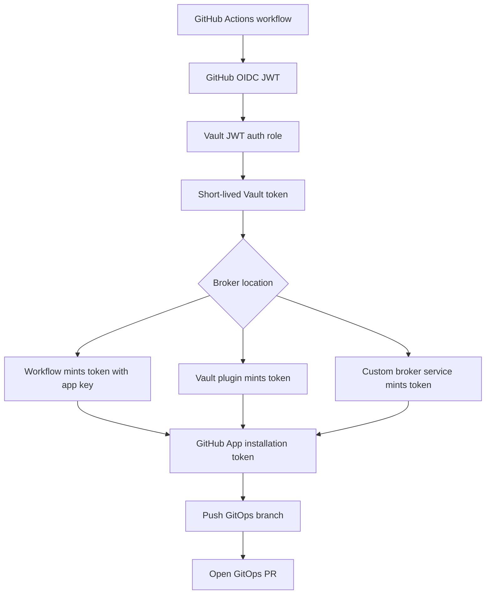
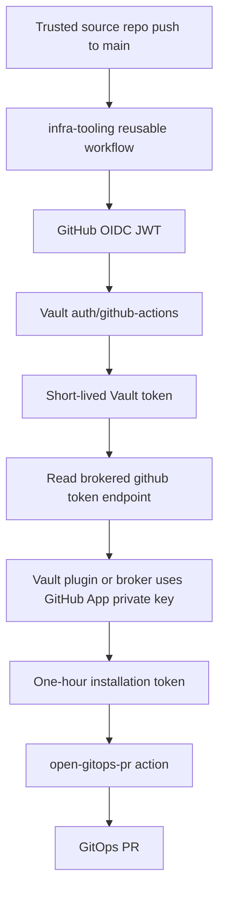

# Research: Vault OIDC and Short-Lived GitHub App Tokens for GitOps PR Automation

This report studies the next security step after `HK3S-0028`: replacing the Vault-stored static GitHub pull-request token with a short-lived GitHub App installation token. The platform already uses GitHub Actions OIDC to authenticate trusted workflows to Vault. That solved the source-repository secret problem. It did not eliminate the GitHub-side credential that is needed to push a branch and open a pull request against the GitOps repository.

The research question is precise: after Vault has accepted a GitHub Actions OIDC token and issued a short-lived Vault token, what should produce the short-lived GitHub credential used for the GitOps PR? That component is the credential broker.

> [!summary]
> - The current system issues short-lived Vault tokens, but the GitHub token used for PR creation is still a static credential stored in Vault.
> - The desired system should issue a short-lived GitHub App installation token after Vault validates the workflow identity.
> - The fastest migration path is Vault-stored GitHub App material plus `actions/create-github-app-token@v3`.
> - The stronger target architecture is a Vault plugin or internal broker that returns only an installation token; the CI runner should not receive the GitHub App private key.
> - For GitOps PR automation, the GitHub App should normally need only `Contents: write`, `Pull requests: write`, and implicit `Metadata: read` on the GitOps repository.

## Research corpus

The research artifacts were stored with the ticket so the investigation can be replayed.

```text
/home/manuel/code/wesen/2026-03-27--hetzner-k3s/ttmp/2026/05/02/HK3S-0028--enable-github-actions-oidc-access-to-vault/sources
/home/manuel/code/wesen/2026-03-27--hetzner-k3s/ttmp/2026/05/02/HK3S-0028--enable-github-actions-oidc-access-to-vault/scripts
```

The `sources/` directory contains Kagi result captures, Defuddle-cleaned source documents, and ChatGPT synthesis output. The `scripts/` directory contains the exact collection scripts and ChatGPT prompt.

The most important source files are:

| Source file | Why it matters |
|---|---|
| `github-oidc-reference.defuddle.md` | Defines GitHub Actions OIDC claims such as `aud`, `sub`, `repository`, `workflow_ref`, and `job_workflow_ref`. |
| `github-oidc-vault.defuddle.md` | Documents GitHub's recommended Vault JWT auth pattern and the need for `id-token: write` plus claim restrictions. |
| `github-oidc-reusable-workflows.defuddle.md` | Documents `job_workflow_ref`, which matters now that the pattern has moved into shared `infra-tooling`. |
| `github-create-app-token-action.defuddle.md` | Documents the official action for creating GitHub App installation tokens, including repository/permission narrowing and post-job revocation. |
| `github-generate-installation-token-docs.defuddle.md` | Documents the REST API flow for creating installation tokens and states that installation access tokens expire after one hour. |
| `vault-plugin-secrets-github-readme.defuddle.md` | Documents a community Vault secrets engine that brokers GitHub App installation tokens from Vault. |
| `ephemeral-github-tokens-via-vault.defuddle.md` | Explains the Vault-plugin model and why PATs are weaker than GitHub App installation tokens. |
| `chatgpt-github-app-token-research-clean.md` | Independent synthesis of broker options, implementation sequence, and failure modes. |

## The problem after HK3S-0028

`HK3S-0028` moved the platform from this model:

```text
source repo GitHub secret GITOPS_PR_TOKEN
  -> workflow uses token to push GitOps branch and open PR
```

to this model:

```text
GitHub Actions OIDC token
  -> Vault auth/github-actions
  -> short-lived Vault token
  -> read repo-specific GitHub token from Vault
  -> push GitOps branch and open PR
```

The second model is much stronger. Source repositories no longer hold the GitHub PR token. Vault roles bind the requesting workflow to exact GitHub OIDC claims. Vault policies allow only repo-specific KV paths. Terraform owns the Vault auth mount, roles, and policies.

The remaining weakness is the underlying GitHub credential. It is still a static token. If it is copied into multiple Vault paths, the Vault paths are repo-specific but the GitHub credential behind them is shared. Even if we later create distinct static fine-grained PATs per source repository, each one remains a long-lived GitHub credential that must be rotated and protected.

The next design should remove the static PR token from the runtime path.

## Two different short-lived tokens

The first conceptual rule is to distinguish the Vault token from the GitHub token.

| Token | Issuer | Consumer | Current lifetime | Purpose |
|---|---|---|---|---|
| GitHub Actions OIDC JWT | GitHub Actions OIDC provider | Vault | Very short | Proves workflow identity to Vault. |
| Vault token | Vault | GitHub Actions workflow | 10 minutes, max 30 minutes in current config | Authorizes secret reads or broker calls in Vault. |
| GitHub PR token | GitHub | Git and GitHub API | Currently static; desired one hour or less | Pushes branch and opens PR against the GitOps repo. |

`HK3S-0028` made the first two rows short-lived and claim-bound. It did not make the third row short-lived. A Vault token cannot push to GitHub. GitHub needs a GitHub credential. The next ticket should therefore focus on short-lived GitHub credentials.

## GitHub App installation tokens

GitHub Apps are the natural fit for this problem. A GitHub App can be installed on selected repositories and granted selected permissions. The app authenticates by signing a GitHub App JWT with its private key. That JWT is then exchanged for an installation access token.

GitHub's installation-token documentation gives three important facts:

1. The token is created through `POST /app/installations/{installation_id}/access_tokens`.
2. The request can optionally narrow the token to specific repositories or repository IDs.
3. The request can optionally narrow the token to specific permissions.
4. The token response includes the token, expiry time, permissions, and repositories.
5. The installation access token expires after one hour.

This gives a better runtime credential for GitOps PR automation:

```text
GitHub App private key + installation id
  -> short-lived installation access token
  -> Git push and PR creation
```

The installation token is still sensitive. It can write to the GitOps repository during its lifetime. But the operational model is different from a PAT: expiry is automatic, repository access is installation-scoped, permissions are app-scoped and token-narrowed, and activity is attributed to the GitHub App rather than a human token.

## Minimum GitHub App permissions

For the current GitOps PR helper, the app needs to clone the GitOps repository, create or update a branch, push a commit, and open a pull request. The minimum repository permissions should be tested, but the research points to this baseline:

| Permission | Level | Reason |
|---|---|---|
| `Metadata` | read | Baseline access for repository identity and API calls. |
| `Contents` | write | Required for authenticated Git writes, branch/ref updates, and committing manifest changes. |
| `Pull requests` | write | Required to create or update pull requests. |
| `Workflows` | none by default | Needed only if automation modifies files under `.github/workflows`. The GitOps PR flow should not. |
| `Administration` | none | Not needed for image-bump branches and PRs. |
| `Actions`, `Secrets`, `Members` | none | Not needed for the GitOps PR path. |

The app should be installed only on the GitOps repository at first:

```text
wesen/2026-03-27--hetzner-k3s
```

The installation token should also be narrowed at mint time. When using `actions/create-github-app-token@v3`, the caller should pass `repositories` and explicit permission inputs instead of inheriting every installation permission:

```yaml
- uses: actions/create-github-app-token@v3
  id: app-token
  with:
    client-id: ${{ steps.vault.outputs.APP_CLIENT_ID }}
    private-key: ${{ steps.vault.outputs.APP_PRIVATE_KEY }}
    owner: wesen
    repositories: 2026-03-27--hetzner-k3s
    permission-contents: write
    permission-pull-requests: write
```

The action documentation says that by default the generated token is scoped to the current repository or to `repositories` if set, inherits installation permissions unless explicit `permission-*` inputs are supplied, is emitted as `token`, is masked, and is revoked in the post step unless `skip-token-revoke` is true. The post-step revocation is good for a single-job GitOps PR flow. It also means the token should not be passed across jobs.

## What is the credential broker?

The credential broker is the component that holds, or has access to, the GitHub App private key and uses it to request installation tokens. The broker is the only component that can turn long-lived app material into short-lived GitHub write credentials.

The broker can be placed in several different parts of the architecture.



The rest of the report compares the broker locations.

## Option A: Vault stores app material, workflow mints token

This is the fastest migration path. Vault continues to be the admission-control layer. The workflow authenticates to Vault through GitHub Actions OIDC, reads GitHub App material from Vault, uses the official GitHub action to create an installation token, then uses that installation token for the GitOps PR.

```text
GitHub Actions OIDC
  -> Vault JWT auth
  -> read app client id and private key from Vault
  -> actions/create-github-app-token
  -> short-lived GitHub installation token
  -> open GitOps PR
```

A concrete workflow shape is:

```yaml
permissions:
  contents: read
  packages: write
  pull-requests: write
  id-token: write

steps:
  - name: Read GitHub App material from Vault
    uses: hashicorp/vault-action@v3
    with:
      url: https://vault.yolo.scapegoat.dev
      method: jwt
      path: github-actions
      role: hair-booking-gitops-pr
      jwtGithubAudience: https://vault.yolo.scapegoat.dev
      exportToken: false
      secrets: |
        kv/data/ci/github-apps/gitops-pr-bot client_id | APP_CLIENT_ID
        kv/data/ci/github-apps/gitops-pr-bot private_key | APP_PRIVATE_KEY

  - name: Mint GitHub App installation token
    id: app-token
    uses: actions/create-github-app-token@v3
    with:
      client-id: ${{ steps.vault.outputs.APP_CLIENT_ID }}
      private-key: ${{ steps.vault.outputs.APP_PRIVATE_KEY }}
      owner: wesen
      repositories: 2026-03-27--hetzner-k3s
      permission-contents: write
      permission-pull-requests: write

  - name: Open GitOps PR
    env:
      GH_TOKEN: ${{ steps.app-token.outputs.token }}
    run: ./open-gitops-pr
```

The advantage is implementation speed. It requires no custom service and no Vault plugin. It uses GitHub's maintained action. It is likely the best first implementation for the next ticket because it replaces the static PAT while leaving the existing GitOps PR helper model intact.

The disadvantage is important: the workflow sees the GitHub App private key. The private key is more powerful than an installation token because it can mint future installation tokens until the key is revoked. A trusted main-branch workflow can receive it, but any code that runs after the key is fetched must be treated as credential-adjacent. This option is a migration step, not the strongest end state.

## Option B: Vault plugin mints installation tokens

The cleanest Vault-native architecture is a GitHub secrets engine. The workflow authenticates to Vault, then requests a GitHub token from Vault. Vault holds the GitHub App private key and performs the App JWT and installation-token request internally. The workflow receives only the short-lived installation token.

```text
GitHub Actions OIDC
  -> Vault JWT auth
  -> vault read github/token/gitops-pr
  -> short-lived GitHub installation token
  -> open GitOps PR
```

The research found the community project `martinbaillie/vault-plugin-secrets-github`. Its README describes the plugin as an intermediary for a GitHub App installed into an organization. Vault-authenticated users can request GitHub tokens from the plugin if Vault RBAC allows it. The plugin authenticates with the GitHub App and requests a token on behalf of the user. The plugin also supports Vault policy constraints using required parameters and allowed parameter values, for example requiring a specific installation ID, repository IDs, and permission set.

This architecture has the best security shape among the off-the-shelf options:

- The runner never receives the GitHub App private key.
- Vault policy can restrict who can ask for which token shape.
- Vault audit logs record token issuance requests.
- GitHub installation tokens still expire after one hour.
- The GitHub App can be installed only on the GitOps repository.

The cost is operational. A Vault plugin becomes part of the trusted computing base. It must be installed into the Vault runtime, registered in the plugin catalog, upgraded deliberately, and reviewed for compatibility with the deployed Vault version. On K3s, this means deciding how plugin binaries enter the Vault pod, how checksums are managed, how upgrades are tested, and whether Terraform should manage the mount and roles.

Option B is the best target architecture if the plugin is accepted operationally.

## Option C: Custom broker service

A custom broker service is a small internal service that validates a workflow's authority and returns a short-lived GitHub App installation token. It can validate the GitHub OIDC token directly, or it can require a Vault token issued by the existing `auth/github-actions` role.

```text
GitHub Actions OIDC
  -> Vault JWT auth
  -> workflow calls broker with Vault token
  -> broker validates policy
  -> broker mints GitHub installation token
  -> workflow opens GitOps PR
```

A custom broker can also perform the PR operation itself:

```text
GitHub Actions OIDC
  -> Vault JWT auth
  -> workflow submits desired image update to broker
  -> broker pushes branch and opens PR
  -> workflow never sees a GitHub write token
```

The first custom-broker version still returns a token. The second version returns no GitHub token and performs the GitHub operation inside the broker. That second shape provides the narrowest runtime exposure but requires the broker to validate GitOps target metadata, patch manifests safely, create idempotent branches, open or update PRs, and expose useful failure messages.

This is the most flexible option and the most engineering work. It makes sense when the platform has many source repositories, stricter audit requirements, or a desire to centralize PR creation behavior beyond what reusable GitHub workflows can enforce.

## Option D: Keep static tokens but split them per repository

This is the smallest hardening step, but it does not answer the short-lived-token question. It would replace one shared static token with separate fine-grained static tokens stored in repo-specific Vault paths.

```text
kv/ci/github/bot-signup/gitops-pr-token      -> bot-signup-specific PAT
kv/ci/github/hair-booking/gitops-pr-token    -> hair-booking-specific PAT
```

This reduces blast radius and improves rotation. It does not remove long-lived GitHub credentials. It is a fallback if GitHub App implementation is delayed, not the recommended long-term path.

## Comparison table

| Design | Runner sees app private key? | Runner sees GitHub write token? | Token lifetime | New infrastructure | Recommended role |
|---|---:|---:|---|---|---|
| Static PAT in Vault | No | Yes, static PAT | Long-lived | None | Current state only. |
| Per-repo static PATs | No | Yes, static PAT | Long-lived | None | Small hardening fallback. |
| Vault KV app key + `actions/create-github-app-token` | Yes | Yes, installation token | One hour, post-job revocation by action | None | Best first migration off PATs. |
| Vault GitHub secrets plugin | No | Yes, installation token | One hour | Vault plugin | Best Vault-native target if plugin is acceptable. |
| Custom token broker | No | Yes, installation token | One hour | Broker service | Strong platform target when custom logic is justified. |
| Custom PR broker | No | No | Internal only | Broker service | Strongest separation, highest implementation cost. |

## OIDC claim binding for the broker stage

The GitHub OIDC token contains claims that are useful for Vault roles. The current roles bind `repository_owner`, `repository`, `ref`, and `event_name`. That is good enough for the first implementation. The next stage should consider tighter bindings because token minting is more sensitive than reading a static path.

Relevant GitHub OIDC claims include:

| Claim | Use |
|---|---|
| `aud` | Ensures the token was minted for this Vault/broker audience. |
| `iss` | Must be `https://token.actions.githubusercontent.com`. |
| `sub` | High-level subject. Can encode repository, branch, pull request, or environment. |
| `repository` | Exact owner/repo string. |
| `repository_id` | Stable numeric repository identity; safer than names if repositories are renamed. |
| `repository_owner` | Owner or organization. Useful but too broad by itself. |
| `repository_visibility` | Can require `private` for private automation. |
| `ref` | Branch or tag ref. For deploys, usually `refs/heads/main`. |
| `event_name` | Should be `push` for the current deploy path. |
| `workflow_ref` | The caller workflow file and ref. |
| `job_workflow_ref` | The reusable workflow file and ref, important for `infra-tooling`. |
| `environment` | Useful when GitHub environments protect credentialed jobs. |

The reusable-workflow documentation is particularly relevant now that `infra-tooling` owns the common workflow. For jobs that use reusable workflows, GitHub includes `job_workflow_ref`. HashiCorp Vault can use custom claims such as `job_workflow_ref` in trust conditions. That means a future role can require both:

1. the source repository is trusted, and
2. the credentialed job is running through the approved reusable workflow.

A stricter Vault role should look like this in shape:

```json
{
  "role_type": "jwt",
  "user_claim": "repository",
  "bound_audiences": ["https://vault.yolo.scapegoat.dev"],
  "bound_claims": {
    "repository": "wesen/hair-booking",
    "repository_owner": "wesen",
    "repository_visibility": "private",
    "ref": "refs/heads/main",
    "event_name": "push",
    "job_workflow_ref": "go-go-golems/infra-tooling/.github/workflows/publish-ghcr-image.yml@refs/heads/main"
  },
  "token_policies": ["gha-hair-booking-github-app-token"]
}
```

The exact claim values should be confirmed with a temporary claim-inspection workflow or by decoding a GitHub OIDC JWT in a controlled private run. The OIDC token itself is a secret and should not be printed in public logs.

## Recommended architecture for the next ticket

The next ticket should implement a two-phase migration.

### Phase 1: Replace static PAT with GitHub App installation token

Phase 1 should use the official action and Vault-stored app material. This gives an immediate security improvement without requiring a Vault plugin or custom service.

```mermaid
flowchart TD
    A[Trusted source repo push to main] --> B[infra-tooling reusable workflow]
    B --> C[GitHub OIDC JWT]
    C --> D[Vault auth/github-actions]
    D --> E[Short-lived Vault token]
    E --> F[Read GitHub App client id and private key from Vault]
    F --> G[actions/create-github-app-token@v3]
    G --> H[One-hour installation token]
    H --> I[open-gitops-pr action]
    I --> J[GitOps PR]
```

This phase should change `infra-tooling` to support a new credential source:

```yaml
gitops_pr_token_source: github-app-vault
github_app_vault_secret_path: kv/data/ci/github-apps/gitops-pr-bot
github_app_owner: wesen
github_app_repositories: 2026-03-27--hetzner-k3s
github_app_permission_contents: write
github_app_permission_pull_requests: write
```

The Vault secret would contain:

```text
kv/ci/github-apps/gitops-pr-bot
  client_id
  private_key
```

The workflow should mint the token as late as possible, immediately before the GitOps PR operation. It should not pass the token across jobs. It should leave `skip-token-revoke` unset so the action revokes the token in its post step.

### Phase 2: Move app private key handling out of CI

Phase 2 should evaluate and choose between a Vault plugin and a custom broker. The target flow is:



The workflow contract can remain almost the same if Phase 1 is designed carefully. Instead of exporting a static `GITOPS_PR_TOKEN`, the workflow exports a short-lived installation token. The `open-gitops-pr` action does not need to know how the token was produced.

## Implementation sequence for Phase 1

1. Create a dedicated organization-owned GitHub App, for example `wesen-gitops-pr-bot`.
2. Install the app only on `wesen/2026-03-27--hetzner-k3s`.
3. Grant only `Contents: write`, `Pull requests: write`, and implicit `Metadata: read`.
4. Generate a private key and record the app client ID or app ID.
5. Store the app material in Vault under a platform path, not under a source-repo path.
6. Add a new Terraform-managed Vault policy for app-token minting.
7. Tighten Vault role claims if possible, including `job_workflow_ref` for shared `infra-tooling` usage.
8. Extend `infra-tooling` with a new `gitops_pr_token_source: github-app-vault` mode.
9. Use `hashicorp/vault-action@v3` to read app material.
10. Use `actions/create-github-app-token@v3` to mint a token with explicit repository and permission narrowing.
11. Use the token as `GH_TOKEN` for `open-gitops-pr`.
12. Test with `hair-booking` first.
13. Test with `bot-signup`.
14. Disable reads of the old static `kv/ci/github/<repo>/gitops-pr-token` paths for those workflows.
15. Revoke the old static PAT after a short rollback window.

## Terraform and Vault ownership

The current GitHub Actions Vault auth resources are owned by:

```text
/home/manuel/code/wesen/terraform/vault/github-actions/envs/k3s
```

The next ticket should keep that ownership model. New roles and policies should be added there. Secret values should not be committed to Terraform. There are two likely Vault storage areas:

```text
kv/ci/github-apps/gitops-pr-bot
kv/ci/github/<repo>/gitops-pr-token
```

The first is app material. The second is the current static token path. During Phase 1, the app material path is needed. After Phase 2, the app private key should ideally be held by the plugin or broker in a way that workflows cannot read directly.

If using a Vault plugin, Terraform should eventually manage:

- plugin mount path,
- plugin config,
- plugin roles or endpoint policy,
- Vault policies that restrict exact token requests.

If using a custom broker, Terraform may manage only Vault policies and perhaps Kubernetes deployment manifests in the GitOps repo. The broker code and deployment would become a separate platform component.

## Failure modes

### Vault login succeeds but GitHub App token creation fails

Likely causes:

- app client ID is wrong,
- private key is malformed,
- private key newlines are escaped incorrectly,
- app is not installed on the target owner or repository,
- requested repository is not in the installation.

The first diagnostic is to inspect the `actions/create-github-app-token` step. Do not print the private key. Confirm the action input names match the current action version.

### Installation token cannot push the GitOps branch

Likely causes:

- `Contents: write` permission is missing,
- branch rules prevent the app from creating `automation/*` branches,
- the token is scoped to the wrong repository,
- the Git remote uses the wrong owner/repo.

The fix is to verify the app installation and token narrowing. The token should be for `wesen/2026-03-27--hetzner-k3s`, not for the source repository.

### Installation token can push but cannot open the PR

Likely causes:

- `Pull requests: write` is missing,
- the app token is not accepted by the `gh` command because `GH_TOKEN` is not set,
- the branch was pushed to an unexpected remote or owner.

The fix is to inspect the token minting step output metadata and the `gh pr create` command arguments.

### The token expires during a long job

Installation tokens expire after one hour. The GitOps PR step should mint the token as late as possible, after build and image push. The token should not be minted in an earlier job and passed forward. If a PR step can exceed one hour, it should mint a fresh token inside that job.

### The workflow can exfiltrate the app private key

This is the main weakness of Phase 1. Mitigations:

- fetch the private key only in the credentialed job,
- keep that job small,
- avoid unpinned third-party actions after key retrieval,
- use protected environments if practical,
- restrict Vault roles with exact claims,
- rotate app keys after testing,
- move to a broker or plugin for the final design.

### The Vault role is too broad

If a Vault role accepts all repositories under an owner, any compromised repo under that owner can request GitHub App material. Bind roles to exact source repositories, protected branches, push events, and reusable workflow claims where possible.

### The broker allows arbitrary token shapes

If a Vault plugin or custom broker lets the caller request arbitrary repositories and permissions, the broker has simply moved the privilege problem. The server side should define allowed token shapes. Caller inputs should select among known roles, not supply unconstrained permission JSON.

## Recommended decision

The next implementation should use a staged design:

1. **Immediate implementation:** use a GitHub App installed only on the GitOps repo, store app material in Vault, and use `actions/create-github-app-token@v3` from `infra-tooling` to mint short-lived installation tokens.
2. **Target architecture research spike:** evaluate the Vault GitHub secrets plugin against the deployed Vault version and K3s operational model.
3. **Final hardening:** move private-key use out of CI by adopting the plugin or writing a small broker that returns only installation tokens.

This path gives a quick reduction in risk while preserving a path to the stronger design.

## Working rules

- The source repository should never store a GitHub PR token as a GitHub secret.
- Vault OIDC should remain the admission-control layer for trusted CI jobs.
- The GitHub App should be installed only where it needs write access.
- Installation tokens should be minted as late as possible and used in the same job.
- The app private key should not be considered safe just because it is stored in Vault; if CI reads it, CI can exfiltrate it.
- The final architecture should make the private key non-exportable from the runner's perspective.
- Token permission requests should be server-side constrained, not caller-controlled.

## Proposed follow-up ticket

A good follow-up ticket title is:

```text
HK3S-0029--replace-static-gitops-pr-token-with-github-app-installation-tokens
```

Suggested scope:

1. Create and install a GitHub App for GitOps PR automation.
2. Store app material in Vault for the first migration phase.
3. Extend `infra-tooling` with `gitops_pr_token_source: github-app-vault`.
4. Validate with hair-booking.
5. Validate with bot-signup.
6. Revoke the old static GitHub token.
7. Evaluate whether to deploy a Vault GitHub secrets plugin or custom broker.
8. Update the platform runbooks and this research note with final implementation results.

## Related notes

- [[ARTICLE - Vault OIDC for GitHub Actions - Secretless CI GitOps]]
- `/home/manuel/code/wesen/2026-03-27--hetzner-k3s/docs/github-actions-vault-oidc-playbook.md`
- `/home/manuel/code/wesen/2026-03-27--hetzner-k3s/ttmp/2026/05/02/HK3S-0028--enable-github-actions-oidc-access-to-vault/`
