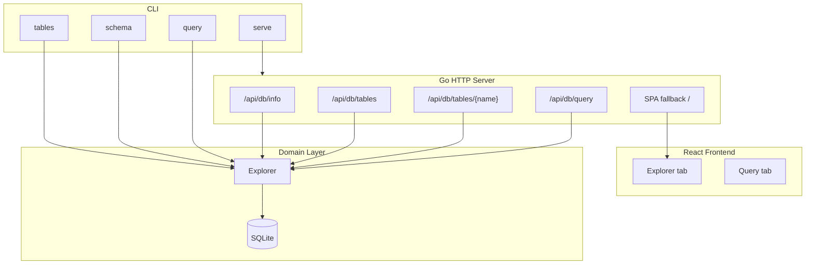

# SQLite Introspection: Exact Page-Level Size Analysis with Go and React

This article describes the design and implementation of a tool that inspects SQLite databases and reports exact page-level sizes for tables and indexes. The tool exposes both a command-line interface for scripting and a web interface for interactive exploration. The central technical problem is obtaining accurate size measurements from SQLite's `dbstat` virtual table and presenting them in a way that reveals where disk space is actually consumed.

> [!summary]
> The key ideas:
> 1. SQLite's `dbstat` virtual table reports exact page-level sizes, but most Go SQLite drivers do not compile it in.
> 2. `modernc.org/sqlite` is a pure-Go driver that includes `dbstat` by default, enabling exact size queries without CGO.
> 3. A Go 1.22+ HTTP server using only `net/http.ServeMux` serves a REST API and embeds a React frontend into a single binary.
> 4. The frontend uses stacked proportional bars to compare table data against index sizes on a shared scale.
> 5. Per-column size estimates are obtained by sampling row bytes via `length(CAST(col AS BLOB))`, which complements the page-level `dbstat` totals.

![[Pasted image 20260502122207.png]]
## Why exact size measurement matters

When a SQLite database file grows, the natural question is: where is the space going? SQLite stores everything — tables, indexes, triggers, views — in a single file. The `sqlite_master` catalog tells you what objects exist, but it does not tell you how large they are.

Without size information, you cannot answer questions like:

- Which table consumes the most space?
- Are indexes larger than the data they index?
- Did a recent schema change create an unexpectedly large index?

Approximate methods exist. Row count multiplied by an average row size gives a rough estimate. But SQLite uses variable-length encoding, page reuse, overflow pages, and B-tree internal nodes. A table with many small rows may use less space than a table with fewer large rows. Row count alone is a poor proxy for size.

The `dbstat` virtual table solves this by exposing SQLite's internal page allocation. Each row in `dbstat` represents one page in the database file, with columns for the object name (`name`), page type (`leaf`, `internal`, `overflow`), and page size (`pgsize`). Summing `pgsize` grouped by `name` yields the exact byte size of each table and index.

## The dbstat problem in Go

The `dbstat` virtual table is available only when SQLite is compiled with the `SQLITE_ENABLE_DBSTAT_VTAB` option. Most `sqlite3` command-line builds include it. Most Go SQLite drivers do not.

Three Go SQLite drivers were evaluated:

| Driver | CGO? | Has dbstat? | Notes |
|--------|------|-------------|-------|
| `github.com/mattn/go-sqlite3` | Yes | No | Most popular; widely used but lacks dbstat |
| `modernc.org/sqlite` | No | Yes | Pure Go port; compiles dbstat by default |
| `github.com/ncruces/go-sqlite3` | No | No | Wasm-based; no dbstat support |

The `mattn/go-sqlite3` driver is a CGO wrapper around the C SQLite library. Because it does not set `SQLITE_ENABLE_DBSTAT_VTAB` at compile time, querying `dbstat` from Go produces:

```
no such table: dbstat
```

The `ncruces/go-sqlite3` driver is a pure-Go port built from a WebAssembly compilation of SQLite. It also omits dbstat. Only `modernc.org/sqlite` — a pure Go transpilation of the SQLite C code — includes dbstat in its default build.

Switching to `modernc.org/sqlite` requires two changes: the import path and the driver name used with `sql.Open`:

```go
import (
    "database/sql"
    _ "modernc.org/sqlite"
)

db, err := sql.Open("sqlite", "/path/to/db.sqlite")
```

The driver name is `"sqlite"`, not `"sqlite3"`. This is the only API surface change. The `database/sql` contract remains identical.

## Architecture

The tool is structured as a single Go binary that embeds a React frontend. In development, the Go server and Vite dev server run separately. In production, `go:embed` packages the built frontend into the binary.



### Layer responsibilities

The **Domain layer** (`internal/sqlite`) contains all SQLite-specific logic. It defines data structures (`DBInfo`, `TableInfo`, `ColumnInfo`, `IndexInfo`) and an `Explorer` type that runs introspection queries. This layer has no dependencies on HTTP or CLI concerns.

The **Application layer** (`internal/server`) is an HTTP server using Go 1.22+ `net/http.ServeMux` with pattern matching. Routes use Go's new syntax:

```go
mux.HandleFunc("GET /api/db/tables/{name}", handleTableDetail)
```

Path parameters are extracted with `r.PathValue("name")`. No third-party router is needed.

The **Presentation layer** has two surfaces: CLI commands built with the Glazed framework (`pkg/commands/`), and a React web UI (`ui/`) using RTK Query, Tailwind CSS, and Vite.

### Single-binary deployment

The production build embeds the React frontend using `go:embed`:

```go
//go:build embed

package web

import "embed"

//go:embed embed/*
var embedFS embed.FS
```

A build script (`internal/web/generate_build.go`) runs `pnpm build` and copies `ui/dist/` into `internal/web/embed/`. The `go generate` command triggers this step. The final binary serves both the API and the static SPA from one process on one port.

## Size measurement: two methods

The tool uses two complementary methods for size measurement. The primary method is exact. The secondary method is approximate and applies only to per-column breakdowns.

### Method 1: dbstat (exact page-level)

For each table and index, the exact size is:

```sql
SELECT SUM(pgsize) FROM dbstat WHERE name = 'table_name'
```

This sums the bytes of every page allocated to that object. It includes leaf pages, internal B-tree nodes, and overflow pages. It is exact because it reads SQLite's own page allocation records.

The `dbstat` schema is:

| Column | Meaning |
|--------|---------|
| `name` | Object name (table, index, or `sqlite_schema`) |
| `path` | Page path within the B-tree |
| `pageno` | Page number in the database file |
| `pagetype` | `leaf`, `internal`, or `overflow` |
| `ncell` | Number of cells on the page |
| `payload` | Payload bytes on the page |
| `unused` | Unused bytes on the page |
| `mx_payload` | Maximum payload size on the page |
| `pgoffset` | Byte offset of the page in the file |
| `pgsize` | Size of the page (usually 4096 bytes) |

The `pgsize` column is the one that matters for total size. Grouping by `name` and summing `pgsize` gives the exact allocation per object.

### Method 2: Row sampling (approximate per-column)

`dbstat` reports the total size of a table but does not break it down by column. To estimate per-column sizes, the tool samples rows and measures the byte length of each column value:

```sql
SELECT length(CAST(col1 AS BLOB)), length(CAST(col2 AS BLOB)), ...
FROM table_name
LIMIT 1000
```

`length(CAST(col AS BLOB))` returns the number of bytes SQLite uses to store the value, which is exactly what we need for size estimation. The sample mean is multiplied by the total row count to extrapolate:

```
estimated_column_size = avg_sample_bytes * row_count
```

This is approximate because:
- It assumes uniform column size distribution
- It does not account for page overhead or B-tree internal nodes
- NULL values contribute 0 bytes, which matches SQLite's storage but may surprise users

The sampling method is used only for per-column visualization. The table total from `dbstat` remains the authoritative size.

## The HTTP API

The server exposes a small REST API for the frontend:

| Method | Path | Returns |
|--------|------|---------|
| GET | `/api/db/info` | Database metadata, WAL/SHM sizes |
| GET | `/api/db/tables` | All tables with sizes and row counts |
| GET | `/api/db/tables/{name}` | Full schema: columns, indexes, sizes |
| GET | `/api/db/tables/{name}/rows` | Paginated row data |
| GET | `/api/db/query?q=SELECT...` | Ad-hoc read-only SQL results |

All responses are JSON. Error responses have an `error` field and appropriate HTTP status codes.

### Safety

The query endpoint accepts arbitrary SQL but restricts it to `SELECT` statements:

```go
trimmed := strings.TrimSpace(strings.ToUpper(q))
if !strings.HasPrefix(trimmed, "SELECT") {
    respondError(w, http.StatusBadRequest, "only SELECT queries are allowed")
    return
}
```

Dynamic table names are quoted with SQLite's `%q` formatter to prevent injection through identifiers:

```go
query := fmt.Sprintf("SELECT COUNT(*) FROM %q", tableName)
```

The `%q` formatter wraps identifiers in double quotes and escapes embedded quotes. This is the correct way to handle dynamic identifiers in SQLite.

### SPA fallback

The SPA handler serves static files when they exist and falls back to `index.html` for all other paths. It must not intercept `/api/*` routes. The implementation reads `index.html` into memory at startup and serves it for unknown paths:

```go
func (h *spaHandler) ServeHTTP(w http.ResponseWriter, r *http.Request) {
    path := path.Clean(r.URL.Path)
    if strings.HasPrefix(path, "/api") {
        http.NotFound(w, r)
        return
    }
    // Try to serve the file; fall back to index.html
}
```

Registration order matters: API routes are registered before the SPA handler because `http.ServeMux` matches routes in registration order.

## The React frontend

The frontend is a single-page application with two tabs: **Explorer** and **Query**.

### Data fetching

All API calls go through an RTK Query slice:

```typescript
export const sqliteApi = createApi({
  reducerPath: 'sqliteApi',
  baseQuery: fetchBaseQuery({ baseUrl: '/api/' }),
  endpoints: (builder) => ({
    getDBInfo: builder.query<DBInfo, void>({ query: () => 'db/info' }),
    getTables: builder.query<{ tables: TableInfo[] }, void>({ query: () => 'db/tables' }),
    getTableDetail: builder.query<SchemaDetail, string>({
      query: (name) => `db/tables/${encodeURIComponent(name)}`,
    }),
  }),
})
```

RTK Query handles caching, deduplication, loading states, and error states automatically.

### Size visualization

The core visualization challenge is comparing table data sizes against index sizes. A table with 10 MB of data and 50 MB of indexes is a different story than a table with 50 MB of data and 10 MB of indexes. The UI must make this distinction visible.

The solution is a stacked proportional bar chart. Each bar represents one table. The bar is divided into two segments:

- **Emerald** (green): table data bytes
- **Amber** (orange): index bytes

All bars are the same width. The proportion of emerald to amber within each bar shows the data-to-index ratio for that table. The bar length does not encode magnitude — the magnitude is shown in text next to the bar. This design choice separates two different questions:

1. How big is this table relative to the whole database? (answered by the text)
2. What fraction of this table's space is data vs indexes? (answered by the bar)

The bars are rendered in a single CSS grid with three columns: name, bar track, and size text. Using one shared grid ensures the bar column has identical width for all rows, which makes the proportions directly comparable.

### Table detail view

When a table is selected, the detail view shows:

1. **Columns** with sky-blue bars showing each column's estimated size relative to the largest column or index
2. **Indexes** with amber bars on the same scale

The shared scale is critical. If index bars used a different maximum than column bars, you could not visually compare an index size against a column size. The maximum is computed across both collections:

```typescript
const allSizes = [
  ...detail.columns.map(c => c.size_bytes),
  ...detail.indexes.map(i => i.size_bytes),
]
const maxItemSize = Math.max(...allSizes, 1)
```

This means an index that is twice as large as the largest column will have a bar twice as long. The visual comparison is immediate.

### WAL and SHM reporting

SQLite in WAL mode creates two additional files alongside the main database file:

- `<database>-wal`: the write-ahead log
- `<database>-shm`: the shared-memory index for the WAL

The tool reports all three sizes in the database overview:

```go
info.SizeBytes = fi.Size()                    // main db file
info.WalSizeBytes = walFi.Size()              // -wal file
info.ShmSizeBytes = shmFi.Size()              // -shm file
info.TotalSizeBytes = info.SizeBytes + info.WalSizeBytes + info.ShmSizeBytes
```

Without this, a user examining a WAL-mode database might see a 260 MB file and wonder where the data is, not realizing the WAL file is empty because the database was checkpointed. Conversely, an active database might have significant uncheckpointed WAL data that is not visible in the main file size.

## The Glazed CLI

The command-line interface uses the Glazed framework, which provides structured output formatting for free. Each command implements `cmds.GlazeCommand` and emits `types.Row` objects. Glazed handles `--output json`, `--output csv`, `--output yaml`, and `--output table` automatically.

A Glazed command has three parts:

1. A `CommandDescription` with flags, arguments, and help text
2. A `RunIntoGlazeProcessor` method that executes the logic and emits rows
3. Cobra wiring that builds the command tree

The `tables` command lists all tables with sizes:

```go
type TablesCommand struct {
    *cmds.CommandDescription
}

func (c *TablesCommand) RunIntoGlazeProcessor(
    ctx context.Context,
    vals *values.Values,
    gp middlewares.Processor,
) error {
    explorer := sqlite.NewExplorer(dbPath)
    tables, err := explorer.GetTables()
    // ... emit rows to gp
}
```

The `schema` command shows column and index details for a single table. The `query` command runs arbitrary `SELECT` statements with structured output. The `serve` command starts the HTTP server.

## Key design decisions

### Why standard library HTTP?

Go 1.22 introduced pattern matching in `http.ServeMux`. Routes like `GET /api/db/tables/{name}` are now part of the standard library. For a simple API surface, this is sufficient. Adding chi, gin, or echo would introduce dependencies without adding capability.

### Why RTK Query over SWR or React Query?

RTK Query was chosen because it integrates with Redux Toolkit's store, provides automatic caching and cache invalidation, and generates type-safe hooks from endpoint definitions. For a tool with a small API surface, the integration benefits outweigh the additional boilerplate.

### Why Tailwind CSS?

Tailwind's utility-first approach matches the dark-mode data dashboard aesthetic of the tool. The design system is built on a slate color palette with emerald and amber accents. Custom component patterns (cards, badges, buttons) are extracted as Tailwind `@layer components` directives.

### Why single binary?

Embedding the frontend into the Go binary means deployment is one file. There is no Node.js runtime requirement on the server, no separate static file server, and no version skew between frontend and backend. The tradeoff is a slightly more complex build process, encoded in the Makefile.

## Code locations

The reference implementation is at `/home/manuel/code/wesen/2026-05-02--sqlite-size-viz`. Key files:

- `internal/sqlite/types.go` — Data structures for database metadata
- `internal/sqlite/introspect.go` — `Explorer` implementation with dbstat queries and sampling
- `internal/server/server.go` — HTTP server setup and graceful shutdown
- `internal/server/handlers.go` — REST endpoint implementations
- `internal/web/spa.go` — SPA fallback handler
- `pkg/commands/root.go` — Root command with Glazed integration
- `ui/src/store/api.ts` — RTK Query API slice
- `ui/src/components/SizeVisualizer.tsx` — Stacked proportional bar chart
- `ui/src/components/TableDetail.tsx` — Column and index detail with shared-scale bars
- `ui/src/components/TableList.tsx` — Sidebar table list with stacked bars
- `Makefile` — Build targets for dev and production

## Verification

The accuracy of dbstat-based sizes was verified against the `sqlite3` CLI, which also has dbstat compiled in. For a 263 MB test database:

```bash
$ sqlite3 review.db "SELECT SUM(pgsize) FROM dbstat WHERE name = 'snapshot_refs'"
81641472

$ ./sqlite-viz tables --db review.db --output json | jq '.[] | select(.name == "snapshot_refs") | .size_bytes'
81641472
```

The totals match exactly. The total of all tables and indexes reported by the tool is 263.24 MB against a database file size of 263.25 MB — a 16 KB difference that represents SQLite's internal bookkeeping structures (freelist pages, page headers, reserved space).

## Open questions

- Should the tool support `VACUUM` analysis to show reclaimable space?
- Should query plans (`EXPLAIN QUERY PLAN`) be visualized?
- How should foreign key relationships be displayed graphically?
- What is the performance limit for databases larger than 1 GB?

## Related notes

- [[PROJ - SQLite Size Visualizer]] — the project note for this implementation
- `ttmp/2026/05/02/SQLITE-VIZ-001--sqlite-size-visualizer-cli-web-explorer/` — ticket documentation with design docs, API reference, and implementation diary
