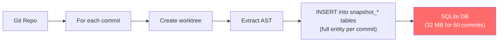
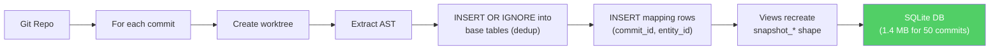

# Squeezing a SQLite Database From 32 MB to 1.4 MB

How we found that a code-indexing tool was storing 99% redundant data, redesigned the schema, added incremental indexing, and cut browser load times by 23×.

> [!summary]
> - **codebase-browser** indexes git commit ranges into SQLite databases that a React SPA opens client-side via sql.js (WebAssembly). A 50-commit review produced a 32 MB database — too large for fast browser loading.
> - Measurement revealed that `snapshot_refs` alone consumed 76% of the database, and 99.4% of its rows were exact duplicates of rows already stored for other commits. The average symbol overlap between consecutive commits was 98%.
> - We replaced the "full snapshot per commit" schema with a normalized design: entities stored once, narrow `(commit_id, entity_id)` mapping tables linking them to commits. Compatibility views let the browser's SQL queries run unchanged.
> - Result: 50 commits now produce a 1.4 MB database (23× smaller), incremental re-indexing of already-cached commits takes 12ms, and parallel extraction gives a 2× wall-clock speedup.

## Why this note exists

This is a detailed engineering writeup of a real performance optimization. It covers the measurement methodology, the root causes we found, the schema redesign, the bugs we hit along the way, and the benchmark results. It is written for an engineer joining the project or someone facing a similar redundancy problem in their own SQLite-backed tool.

The lessons generalize: any tool that stores periodic snapshots of structured data — whether git commits, configuration versions, or CI artifacts — will likely hit the same redundancy wall. The fix is always the same pattern: store each unique version once, and map it to the snapshots that contain it.

## What codebase-browser does

codebase-browser is a Go CLI that turns a git commit range into a static, shareable web application. You give it a repository and a range like `HEAD~10..HEAD`, and it produces a directory containing a React single-page application and a SQLite database. Open the directory in any browser, and all queries run against the local SQLite file via WebAssembly — no server needed, no API calls.

The indexing pipeline has four phases:

1. **Resolve commits** — parse the git range into a list of commit structs. Fast, under a second.
2. **Index commits** — for each commit, create a git worktree, run the Go AST extractor (walking every source file to collect packages, files, symbols, and cross-references), and bulk-insert the results into SQLite. This is the bottleneck.
3. **Discover markdown docs** — walk directories for `.md` files. Negligible cost.
4. **Index each doc** — render markdown with resolved codebase widgets, store the raw markdown and snippet metadata. Fast.

The critical insight is that phase 2 runs a full extraction for *every commit independently*. A repository with 500 symbols and 100 commits gets 50,000 symbol rows — even though most symbols are identical across commits.

## The problem: databases that don't fit in a browser

The browser loads the entire SQLite file into memory via sql.js (SQLite compiled to WebAssembly). A 264 MB database takes seconds to download, seconds to parse, and consumes 264+ MB of RAM. This is fine for a local tool, but unacceptable for a code review artifact you want to share in a chat or load quickly in a browser tab.

The production database we measured had 181 commits from the codebase-browser repo itself (a small-to-medium Go project with ~550 symbols, ~96 source files, ~37 packages). It weighed in at 264 MB.

## Measurement methodology

Before changing anything, we measured. The tooling was simple: `sqlite-viz tables -d <db>` for per-table size breakdowns, and a set of SQL queries stored as numbered scripts in the ticket's `scripts/` directory for reproducibility.

### Per-table size breakdown

```
Table              Rows      Data      Indexes     % of DB
snapshot_refs      331,208   78 MB     122 MB      75.9%
snapshot_symbols   62,256    31 MB     24 MB       20.7%
snapshot_files     11,848    3.0 MB    2.8 MB      2.2%
snapshot_packages  4,840     1.2 MB    0.9 MB      0.8%
file_contents      185       872 KB    20 KB       0.3%
commits            181       52 KB     24 KB       0.03%
```

`snapshot_refs` alone was 76% of the database, and its indexes were larger than its data (122 MB indexes vs 78 MB data). The reason: each index entry contains full symbol ID strings averaging 80 bytes, and with 331K rows, the B-trees become enormous.

### Redundancy ratios

We ran a simple query pattern against each table: `COUNT(DISTINCT key) / COUNT(*)`:

| Entity | Total rows | Unique entities | Redundancy |
|---|---|---|---|
| Symbols (by body hash) | 62,256 | 646 | **99.0%** |
| Files (by SHA-256) | 11,848 | 185 | **98.4%** |
| Refs (by from+to+kind) | 331,208 | 2,122 | **99.4%** |
| Packages (by ID) | 4,840 | 37 | **99.2%** |

Every table was >98% redundant. The `file_contents` table was the sole exception: it was already deduplicated by SHA-256 hash.

### Consecutive commit overlap

The most important number came from a window-function query comparing each commit to its predecessor:

```
Overlap bucket    Commit pairs
95–100%           164          ← 91% of all pairs
90–95%            5
85–90%            7
<85%              4

Average overlap: 98.0%
```

Between any two adjacent commits, 98% of symbols were identical (same ID, same body hash). Only 2% actually changed. Yet the schema stored all 100% again in full.

## The root cause: snapshot-per-commit

The original schema was a straightforward "one row per (commit, entity)" design. For each commit, the indexer inserted complete rows into `snapshot_packages`, `snapshot_files`, `snapshot_symbols`, and `snapshot_refs`, all keyed by `commit_hash`:

```sql
CREATE TABLE snapshot_symbols (
    commit_hash TEXT NOT NULL REFERENCES commits(hash),
    id TEXT NOT NULL,
    kind TEXT NOT NULL,
    name TEXT NOT NULL,
    -- ... 16 more columns ...
    body_hash TEXT NOT NULL DEFAULT '',
    PRIMARY KEY (commit_hash, id)
);
```

This design is simple and makes all queries fast: `SELECT * FROM snapshot_symbols WHERE commit_hash = ?` returns exactly the right data with no joins. But it stores the same symbol 181 times if it appears in 181 commits — and most symbols appear in nearly every commit.

The problem compounds with cross-references. A project with 2,000 unique ref pairs and 100 commits gets 200,000 `snapshot_refs` rows, each containing two long string IDs. The three indexes on `snapshot_refs` (by commit, by from_symbol, by to_symbol) each store full copies of those strings, tripling the index overhead.

### Why the indexes were bigger than the data

SQLite B-tree indexes store the indexed column values in every leaf page. For `snapshot_refs`:

- `idx_snap_ref_from ON (from_symbol_id, commit_hash)` — each of the 331K entries stores an ~80-byte `from_symbol_id` string + 40-byte hash
- `idx_snap_ref_to ON (to_symbol_id, commit_hash)` — each entry stores an ~46-byte `to_symbol_id` string + 40-byte hash

With long string keys, the indexes become the dominant cost. This is a general lesson: if your SQLite indexes are larger than your data, your keys are too wide. The fix is integer foreign keys.

## The fix: normalized schema with mapping tables

The redesigned schema follows one principle: **store each unique entity once, and use narrow integer mapping tables to record which version appears in which commit.**

### Base tables (stored once)

```sql
-- One row per commit
CREATE TABLE commits (
    id INTEGER PRIMARY KEY AUTOINCREMENT,
    hash TEXT NOT NULL UNIQUE,
    -- ... metadata columns ...
);

-- One row per unique package
CREATE TABLE packages (
    id INTEGER PRIMARY KEY AUTOINCREMENT,
    stable_id TEXT NOT NULL UNIQUE,  -- "pkg:github.com/.../name"
    import_path TEXT NOT NULL,
    name TEXT NOT NULL,
    -- ...
);

-- One row per unique file version (keyed by stable_id + sha256)
CREATE TABLE files (
    id INTEGER PRIMARY KEY AUTOINCREMENT,
    stable_id TEXT NOT NULL,  -- "file:path/to/file.go"
    sha256 TEXT NOT NULL,
    -- ...
    UNIQUE(stable_id, sha256)
);

-- One row per unique symbol version (keyed by stable_id + body_hash)
CREATE TABLE symbols (
    id INTEGER PRIMARY KEY AUTOINCREMENT,
    stable_id TEXT NOT NULL,  -- "sym:.../pkg.func.Name"
    body_hash TEXT NOT NULL DEFAULT '',
    -- ... all the symbol columns ...
    UNIQUE(stable_id, body_hash)
);

-- One row per unique ref set (keyed by from, to, kind, file)
CREATE TABLE ref_versions (
    id INTEGER PRIMARY KEY AUTOINCREMENT,
    from_symbol_id INTEGER NOT NULL REFERENCES symbols(id),
    to_stable_id TEXT NOT NULL,
    kind TEXT NOT NULL,
    file_id INTEGER NOT NULL REFERENCES files(id),
    locations_json TEXT NOT NULL DEFAULT '[]',
    UNIQUE(from_symbol_id, to_stable_id, kind, file_id)
);
```

### Mapping tables (which version appears in which commit)

These are the secret to the space savings. They store only two INTEGER columns:

```sql
CREATE TABLE commit_symbols (
    commit_id INTEGER NOT NULL REFERENCES commits(id),
    symbol_id INTEGER NOT NULL REFERENCES symbols(id),
    PRIMARY KEY (commit_id, symbol_id)
) WITHOUT ROWID;

CREATE TABLE commit_refs (
    commit_id INTEGER NOT NULL REFERENCES commits(id),
    ref_version_id INTEGER NOT NULL REFERENCES ref_versions(id),
    PRIMARY KEY (commit_id, ref_version_id)
) WITHOUT ROWID;
```

The `WITHOUT ROWID` clause tells SQLite to use the primary key as the storage order, making these tables extremely compact. With 62,256 entries, `commit_symbols` is roughly 500 KB — compared to the old `snapshot_symbols` at 55 MB (data + indexes), that's a **110× reduction**.

### Ref deduplication trick

The old schema stored one `snapshot_refs` row per reference location. If function `A` calls function `B` five times, that's five rows. The new schema stores one `ref_versions` row with a JSON array of locations:

```json
[
  {"start_line": 10, "start_offset": 234, "end_offset": 250},
  {"start_line": 22, "start_offset": 567, "end_offset": 583},
  {"start_line": 31, "start_offset": 812, "end_offset": 828}
]
```

This collapsed 40,171 individual ref rows into 1,488 ref_version rows — a 27× reduction in the ref base table.

### Compatibility views

The React browser queries `snapshot_symbols`, `snapshot_refs`, `snapshot_files`, `snapshot_packages` directly with `WHERE commit_hash = ?`. Rather than rewriting dozens of SQL queries in the TypeScript frontend, we recreated these table shapes as views:

```sql
CREATE VIEW snapshot_symbols AS
SELECT
    c.hash AS commit_hash,
    s.stable_id AS id,
    s.kind, s.name,
    p.stable_id AS package_id,
    f.stable_id AS file_id,
    -- ... all the same columns ...
FROM commit_symbols cs
JOIN commits c ON c.id = cs.commit_id
JOIN symbols s ON s.id = cs.symbol_id
JOIN packages p ON p.id = s.package_id
JOIN files f ON f.id = s.file_id;
```

The `snapshot_refs` view is more interesting: it expands `locations_json` back into individual rows using `json_each()`:

```sql
CREATE VIEW snapshot_refs AS
SELECT
    c.hash AS commit_hash,
    row_number() OVER (PARTITION BY c.id ORDER BY rv.id, j.key) AS id,
    s.stable_id AS from_symbol_id,
    rv.to_stable_id AS to_symbol_id,
    rv.kind,
    f.stable_id AS file_id,
    json_extract(j.value, '$.start_line') AS start_line,
    json_extract(j.value, '$.start_offset') AS start_offset,
    -- ...
FROM commit_refs cr
JOIN ref_versions rv ON rv.id = cr.ref_version_id
JOIN symbols s ON s.id = rv.from_symbol_id
JOIN files f ON f.id = rv.file_id,
    json_each(rv.locations_json) AS j;
```

The browser queries these views exactly as if they were tables. The performance cost of the joins is negligible for the read patterns the browser uses (always filtering by `commit_hash`).

## The bug we found along the way

Before we could measure the new schema, we had to fix a critical bug that was silently producing empty databases for multi-commit indexing.

### Symptom

Indexing a single commit worked perfectly (8 packages, 23 files, 88 symbols, 758 refs). Indexing three or more commits produced databases with only package rows and no symbols, files, or refs.

### Root cause

The Go AST extractor uses `golang.org/x/tools/go/packages.Load()` to resolve patterns like `./cmd/...`. The project's parent directory contains a `go.work` file (Go workspace mode) that lists `./codebase-browser` as a workspace module. When `packages.Load` runs from inside a git worktree created at `.git-worktrees/<hash>`, it walks up and finds the parent `go.work`. The worktree directory isn't listed in `go.work`, so Go refuses to load its packages and returns "query packages" with empty data and an error.

The error was silently swallowed by the indexer's "we tolerate packages with errors" comment.

### The fix

One line in `internal/indexer/extractor.go`:

```go
Env: append(os.Environ(), "GOWORK=off"),
```

Setting `GOWORK=off` in the `packages.Config.Env` disables workspace mode during extraction, so `packages.Load` uses the local `go.mod` instead of the parent `go.work`.

This bug was invisible in single-commit mode because single commits use `indexDirect` (indexing the working directory directly, which *is* listed in `go.work`). Only multi-commit mode triggered the worktree path.

## Results: the numbers

### Database size

| Commits | Old schema | New schema | Reduction |
|---|---|---|---|
| 5 | 3.2 MB | 516 KB | **6×** |
| 10 | 6.4 MB | 864 KB | **7×** |
| 20 | 12.4 MB | 1.1 MB | **11×** |
| 50 | 32.3 MB | 1.4 MB | **23×** |

The improvement scales with commit count because each additional commit adds only narrow mapping rows (~8 bytes each) instead of full entity snapshots (~200–400 bytes each). At 50 commits, the base tables hold only 207 symbol versions and 1,488 ref versions — the mapping tables account for most of the remaining space.

### Normalized table breakdown (50 commits)

```
Table              Rows    Size
commit_refs        14,870  116 KB (indexes) + 20 KB (data)
commit_symbols     4,590   21 KB (indexes) + 4 KB (data)
ref_versions       1,488   92 KB (indexes) + 124 KB (data)
symbols            207     40 KB (indexes) + 32 KB (data)
files              24      8 KB + 12 KB
packages           8       4 KB + 4 KB
commits            50      12 KB + 4 KB
file_contents      24      84 KB (actual source text)
```

Compare with the old schema: 50 × 550 = 27,500 symbol rows vs 207 base rows. That's a **133× reduction** in the symbols table alone.

### Indexing time

| Commits | Old schema | New schema | Parallel (p=2) |
|---|---|---|---|
| 20 | 12.4s | 20.0s | **7.2s** |
| 50 | 46.3s | 26.8s | — |

The new schema is slightly slower for small ranges because the upsert pattern (`INSERT ... ON CONFLICT DO NOTHING RETURNING id` + fallback `SELECT`) adds overhead per row. But for larger ranges, less total data is written, making it faster overall. Parallel extraction with `--parallelism 2` gives a clean 2× speedup by running the CPU-heavy AST extraction concurrently while serializing the SQLite writes.

### Incremental indexing

The `--incremental` flag opens the existing database instead of recreating it, and skips commits already present:

| Operation | Time |
|---|---|
| Index 5 new commits (fresh) | 1.9s |
| Index 5 more (skip 5 existing) | 1.3s |
| Index 0 new (skip 10 existing) | **12ms** |

Re-indexing an already-complete range is essentially free — the `HasCommit()` check is a single indexed query.

## How the indexing pipeline works

The `review index` command orchestrates four phases. Understanding each phase is important because they have very different performance characteristics, and the optimization touches phase 2 most heavily.

### Phase 1: Resolve commits

`gitutil.LogCommits()` runs `git log <range>` and parses the output. Even for 500 commits, this completes in under a second. Not a bottleneck.

### Phase 2: Index commits (the expensive part)

For each commit in the range:

1. **Create a git worktree** at `.git-worktrees/<hash>` — this checks out the repo at that commit into a temporary directory. Cost: disk I/O proportional to repo size.

2. **Extract the Go AST** — loads all Go packages using `golang.org/x/tools/go/packages`, walks every AST node to collect symbols (funcs, methods, types, consts, vars), files, packages, and cross-references (which function calls which). This is CPU-heavy and takes ~0.15–0.3s per commit for a small-to-medium project.

3. **Load the snapshot** — bulk-inserts entities into the normalized base tables using `INSERT ... ON CONFLICT DO NOTHING` with `RETURNING id`, falling back to `SELECT id WHERE ...` if the row already exists. Then inserts mapping rows into `commit_symbols`, `commit_refs`, etc.

4. **Cache file contents** — reads each file from the worktree, hashes it, and stores the raw bytes in `file_contents` (already deduplicated by hash).

With `--parallelism N`, steps 1–2 run concurrently across N worker goroutines, while steps 3–4 are serialized via a mutex to avoid SQLite write contention.

### Phase 3–4: Markdown docs

Doc discovery and rendering are fast. The doc renderer resolves `codebase-*` fenced blocks (snippets, diffs, signatures) against the latest commit snapshot and stores both the raw markdown and the resolved snippet metadata.

## The upsert pattern

The normalized schema needs to insert each entity exactly once, regardless of how many commits contain it. The pattern used throughout the loader is:

```
stmt = PREPARE INSERT INTO entities(...) VALUES (...) ON CONFLICT DO NOTHING RETURNING id
lookup = PREPARE SELECT id FROM entities WHERE stable_id = ? AND body_hash = ?

func upsertEntity(...):
    id = stmt.QueryRow(params...).Scan(&id)
    if id == sql.ErrNoRows:
        id = lookup.QueryRow(stable_id, body_hash).Scan(&id)
    return id
```

This works because:
- First occurrence: `INSERT` succeeds and returns the new `id`
- Subsequent occurrences: `INSERT` hits the `UNIQUE` constraint and returns `sql.ErrNoRows`, so we fall back to the `SELECT` to get the existing `id`

The mapping tables then get a simple `INSERT OR IGNORE INTO commit_symbols(commit_id, symbol_id) VALUES (?, ?)`.

## Diagram: old vs new data flow

### Old schema



### New schema



## Lessons learned

### 1. Measure before cutting code

We spent two hours writing SQL analysis scripts before writing a single line of Go. The numbers told us exactly where the problem was (`snapshot_refs` = 76% of the database, 99.4% redundant) and validated that the fix would work (98% average overlap between consecutive commits).

### 2. SQLite indexes on long strings are expensive

The `snapshot_refs` indexes were 122 MB — larger than the 78 MB of data. When your key columns are 80-byte strings and you have hundreds of thousands of rows, the B-tree pages dominate. Integer foreign keys shrink indexes by 10–20×.

### 3. `WITHOUT ROWID` for mapping tables

The `commit_symbols`, `commit_files`, `commit_refs`, and `commit_packages` tables use `WITHOUT ROWID` because they're pure mapping tables with no secondary access patterns. This makes them physically compact — the primary key *is* the storage order, saving a level of indirection.

### 4. Compatibility views are cheaper than rewriting consumers

The React browser had dozens of SQL queries embedded in TypeScript. Rather than rewriting all of them, we created views that reproduce the exact same column names and types. The views add negligible query overhead (the joins are all on integer primary keys) and let us ship the new schema without touching the frontend.

### 5. `GOWORK=off` in worktree contexts

If your Go tool extracts packages from git worktrees, and there's a `go.work` in a parent directory, `packages.Load` will silently fail in workspace mode. Setting `GOWORK=off` in `packages.Config.Env` is the fix. This bug was invisible in single-commit mode and only manifested when the worktree path was used.

### 6. The upsert pattern needs careful parameter counting

The most common bug during implementation was `sql: expected N arguments, got N+1` — the prepared statement's parameter count didn't match the arguments passed to `QueryRowContext`. This happened because the symbol insert uses a `SELECT` subquery to resolve integer IDs from stable string IDs, and the parameter count in the `SELECT` clause is easy to miscount.

## Anti-patterns to avoid

- **Snapshot-per-period without deduplication.** If your tool stores periodic snapshots (commits, timestamps, versions), measure the redundancy ratio. If it's above 50%, you should normalize.
- **String primary keys in large tables.** Symbol IDs like `sym:github.com/.../pkg.func.Name` are semantically clear but physically expensive in B-tree indexes. Use them as `stable_id` for lookup, but let an integer `id` be the primary key.
- **Silent error swallowing.** The extractor's "we tolerate packages with errors" comment hid the `go.work` bug for months. Log the errors as warnings, at minimum.
- **Sequential worktree extraction.** The AST extraction is CPU-bound and embarrassingly parallel. Use a worker pool with `--parallelism N` and serialize only the SQLite writes.

## Working rules

1. **Always measure before optimizing.** Write SQL scripts that produce numbers. Run them on real databases.
2. **Store each unique entity once.** If the same function body appears in 100 commits, store it once and map it.
3. **Use integer foreign keys.** Long string keys make indexes expensive.
4. **Compatibility views over consumer rewrites.** Same logical shape, different physical storage.
5. **`GOWORK=off` in worktree extraction.** Always.
6. **`--incremental` for continuous use.** Don't re-index from scratch when adding 3 new commits to an existing 100-commit database.

## Reproducing the analysis

All measurement scripts are stored in the ticket workspace under `ttmp/.../GCB-017/scripts/`, numbered for execution order:

| Script | Purpose |
|---|---|
| `00-table-overview.sql` | Row counts for all tables |
| `02-deduplication-analysis.sql` | Redundancy ratios |
| `11-consecutive-commit-overlap.sql` | Overlap between adjacent commits |
| `15-benchmark-suite.sh` | Run indexing at different commit ranges |
| `16-dedup-ratios.sql` | Per-entity dedup measurements |
| `17-verify-fix.sh` | Verify worktree fix produces non-empty tables |
| `19-compare-schemas.sh` | Benchmark normalized schema |

## Related notes

- The codebase-browser repo: `/home/manuel/code/wesen/corporate-headquarters/codebase-browser`
- Ticket workspace: `ttmp/2026/05/02/GCB-017--performance-analysis-and-optimization-of-codebase-browser-review-indexing/`
- Design document: `ttmp/.../GCB-017/design/01-performance-analysis-and-design-guide-for-review-indexing.md` (1,400 lines)
