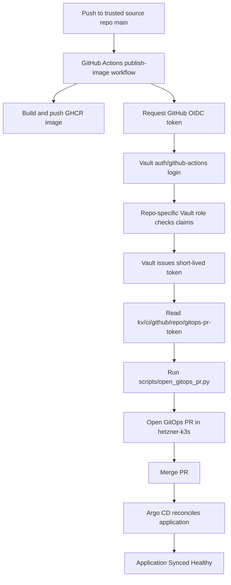

> [!warning] The credential this describes is deprecated — the mechanism is not
> The Vault OIDC exchange described here is still exactly how CI authenticates: a workflow JWT
> is presented to `auth/github-actions` and traded for a short-lived Vault token. That part is
> current.
>
> What CI reads **afterwards** has changed. This note has it read a long-lived personal access
> token from `kv/ci/github/<repo>/gitops-pr-token`. That PAT expired in production and GitHub
> rejected the push with `Bad credentials` — Vault returned the secret successfully, so the
> failure surfaced only at the GitHub API. Since
> [[Projects/2026/06/01/ARTICLE - GitHub App Tokens for GitOps PR Automation]] the credential is
> a GitHub App id and private key at `kv/ci/github/<repo>/gitops-pr-app`, exchanged for an
> installation token that lives for one run. `TF-012-GITOPS-GITHUB-APP-MIGRATION` (terraform
> repo, 2026-07-17) completed the migration.
>
> Use `gitops_pr_token_source: github_app`, never `vault` or `secret`.

# Vault OIDC for GitHub Actions: Secretless CI to GitOps

This is the CI credential-boundary branch of the [[infrastructure-and-release]] project map.

This report explains the GitHub Actions OIDC integration added to the K3s Vault platform in `HK3S-0028`. The implemented system lets a trusted GitHub Actions workflow authenticate to Vault with a short-lived GitHub-issued OIDC token, receive a short-lived Vault token, read the GitOps pull-request credential from Vault, open a deployment pull request, and let Argo CD reconcile the cluster after merge.

The first live proof used the `bot-signup` repository. The second proof applied the same pattern to `hair-booking`. Both source repositories now have no direct `GITOPS_PR_TOKEN` repository secret, both workflows read repo-specific GitOps PR credentials from Vault through GitHub Actions OIDC, both opened GitOps PRs, and Argo CD reconciled both applications to `Synced Healthy`.

> [!summary]
> - GitHub Actions now authenticates to Vault through `auth/github-actions`, a dedicated Vault JWT auth mount configured for `https://token.actions.githubusercontent.com`.
> - The first role, `bot-signup-gitops-pr`, is bound to `wesen/2026-05-01--bot-signup`, `refs/heads/main`, `push` events, and audience `https://vault.yolo.scapegoat.dev`.
> - The second role, `hair-booking-gitops-pr`, is bound to `wesen/hair-booking` with the same branch, event, and audience constraints.
> - The policies read only repo-specific KV v2 data paths: `kv/data/ci/github/bot-signup/gitops-pr-token` and `kv/data/ci/github/hair-booking/gitops-pr-token`.
> - The OIDC-only proof runs are bot-signup run `25262280702` and hair-booking run `25262282471`; they created GitOps PRs `67` and `68`, and Argo CD reconciled both apps to `Synced Healthy` at revision `236eec258f09d451fbbb7d8e70047d1133310f77`.

## Why this project exists

The platform already had a clear deployment contract before this work. A source repository builds and publishes an immutable image, CI opens a pull request against the GitOps repository, a reviewer merges the desired-state change, and Argo CD reconciles the cluster. That model is documented in `/home/manuel/code/wesen/2026-03-27--hetzner-k3s/docs/source-app-deployment-infrastructure-playbook.md` and is the correct deployment boundary for this cluster.

The missing piece was the credential boundary inside GitHub Actions. The `bot-signup` workflow needed a `GITOPS_PR_TOKEN` so it could push a branch and open a pull request in `/home/manuel/code/wesen/2026-03-27--hetzner-k3s`. Keeping that token as a long-lived GitHub repository secret works, but it spreads credential storage into each source repository. It also makes Vault less central than the rest of the platform design intends.

GitHub Actions OIDC changes the authentication step. Instead of storing a Vault token or GitOps credential directly in the source repository, the workflow requests a GitHub-issued identity token for the current run. Vault validates that token against GitHub's issuer and the role's bound claims. If the workflow is the one Vault expects, Vault issues a short-lived Vault token with a narrow policy. The workflow then reads only the credential it needs.

The implemented system does not remove every static credential from the platform. The GitOps PR credential still exists, but it is now stored in Vault under repo-specific paths such as `kv/ci/github/bot-signup/gitops-pr-token` and `kv/ci/github/hair-booking/gitops-pr-token`. The improvement is that GitHub Actions no longer stores that credential directly in the source repositories. Vault becomes the central policy boundary, audit boundary, and rotation boundary.

## The control planes involved

There are five control planes in the working system. Each has a specific responsibility.

| Control plane | Repository or service | Responsibility |
|---|---|---|
| Source repositories | `/home/manuel/code/wesen/2026-05-01--bot-signup`, `/home/manuel/code/wesen/hair-booking` | Run tests, build images, publish GHCR tags, ask Vault for repo-specific GitOps PR tokens, and open deployment PRs. |
| Vault | `https://vault.yolo.scapegoat.dev` | Validates GitHub OIDC tokens, issues short-lived Vault tokens, and stores the GitOps PR credential. |
| GitOps repository | `/home/manuel/code/wesen/2026-03-27--hetzner-k3s` | Stores desired Kubernetes state, including `gitops/kustomize/bot-signup/deployment.yaml` and `gitops/kustomize/hair-booking/deployment.yaml`. |
| GitHub pull requests | `wesen/2026-03-27--hetzner-k3s` PRs | Review and merge the image-pin change. |
| Argo CD | K3s cluster | Reconciles the merged desired state into the cluster. |

The important property is that no step performs the next step's job. The source repository does not apply Kubernetes manifests. Vault does not open GitOps PRs. Argo CD does not build images. The workflow succeeds because each boundary has a narrow interface.

## System flow

The following diagram shows the implemented flow, starting with a push to `main` in a trusted source repository and ending with the cluster running the new image.



The security-sensitive step is not the secret read itself. The sensitive step is the authentication decision that precedes the read. Vault only issues the short-lived token when the GitHub OIDC token satisfies the role constraints.

## The Vault auth mount

The new Vault auth mount is `auth/github-actions`. It is separate from both existing Vault identity paths:

- `auth/oidc` remains the human operator login path backed by Keycloak.
- `auth/kubernetes` remains the in-cluster workload path backed by Kubernetes service account tokens.
- `auth/github-actions` is the CI/CD path backed by GitHub Actions OIDC tokens.

The bootstrap script is:

```text
/home/manuel/code/wesen/2026-03-27--hetzner-k3s/scripts/bootstrap-vault-github-actions-oidc.sh
```

The script performs four operations:

1. It verifies `vault` and `jq` exist and requires explicit `VAULT_ADDR` and `VAULT_TOKEN`.
2. It enables `auth/github-actions` as a `jwt` auth backend if it does not already exist.
3. It configures the backend with GitHub's issuer and OIDC discovery URL.
4. It writes all policies and roles found under `vault/policies/github-actions` and `vault/roles/github-actions`.

The relevant mount configuration is:

```bash
vault write "auth/${github_actions_auth_path}/config" \
  oidc_discovery_url="https://token.actions.githubusercontent.com" \
  bound_issuer="https://token.actions.githubusercontent.com"
```

This says that Vault should validate JWTs using GitHub's OIDC discovery metadata and only accept tokens whose issuer is GitHub Actions.

## Production roles

The implementation now has two production GitHub Actions roles:

| Role | Source repository | Bound ref | Bound event | Policy | KV path read |
|---|---|---|---|---|---|
| `bot-signup-gitops-pr` | `wesen/2026-05-01--bot-signup` | `refs/heads/main` | `push` | `gha-bot-signup-gitops-pr` | `kv/data/ci/github/bot-signup/gitops-pr-token` |
| `hair-booking-gitops-pr` | `wesen/hair-booking` | `refs/heads/main` | `push` | `gha-hair-booking-gitops-pr` | `kv/data/ci/github/hair-booking/gitops-pr-token` |

The role files are stored in:

```text
/home/manuel/code/wesen/2026-03-27--hetzner-k3s/vault/roles/github-actions/bot-signup-gitops-pr.json
/home/manuel/code/wesen/2026-03-27--hetzner-k3s/vault/roles/github-actions/hair-booking-gitops-pr.json
```

The bot-signup role is:

```json
{
  "role_type": "jwt",
  "user_claim": "repository",
  "bound_audiences": ["https://vault.yolo.scapegoat.dev"],
  "bound_claims": {
    "repository_owner": "wesen",
    "repository": "wesen/2026-05-01--bot-signup",
    "ref": "refs/heads/main",
    "event_name": "push"
  },
  "policies": ["gha-bot-signup-gitops-pr"],
  "ttl": "10m",
  "max_ttl": "30m",
  "token_explicit_max_ttl": "30m"
}
```

The hair-booking role has the same shape, but its `repository` claim is `wesen/hair-booking` and its policy is `gha-hair-booking-gitops-pr`.

Each claim has a purpose.

| Claim or field | Purpose |
|---|---|
| `repository_owner` | Restricts the role to the `wesen` owner. |
| `repository` | Restricts the role to one exact source repository. |
| `ref` | Restricts the role to `refs/heads/main`. |
| `event_name` | Restricts the role to `push` events. |
| `bound_audiences` | Requires the workflow to request a token specifically for `https://vault.yolo.scapegoat.dev`. |
| `ttl` and `max_ttl` | Limits the useful life of the Vault token issued to the workflow. |

The roles intentionally do not accept pull request events. Pull request workflows can run code that should not receive deployment credentials. The production roles are bound to trusted branch pushes only.

## Production policies

The policy files are stored in:

```text
/home/manuel/code/wesen/2026-03-27--hetzner-k3s/vault/policies/github-actions/bot-signup-gitops-pr.hcl
/home/manuel/code/wesen/2026-03-27--hetzner-k3s/vault/policies/github-actions/hair-booking-gitops-pr.hcl
```

The bot-signup policy is:

```hcl
path "kv/data/ci/github/bot-signup/gitops-pr-token" {
  capabilities = ["read"]
}

path "auth/token/lookup-self" {
  capabilities = ["read"]
}

path "auth/token/renew-self" {
  capabilities = ["update"]
}

path "auth/token/revoke-self" {
  capabilities = ["update"]
}
```

The hair-booking policy is identical except for the secret path:

```hcl
path "kv/data/ci/github/hair-booking/gitops-pr-token" {
  capabilities = ["read"]
}
```

The policies do not grant broad KV access. They do not grant `auth/*`, `sys/*`, or application runtime secret access. Each workflow can read exactly one CI credential path and inspect, renew, or revoke its own Vault token.

This is the main security property of the implementation. GitHub Actions is not a Vault administrator. Each workflow is a narrowly scoped Vault client for one release task.

## Repo-specific secret paths

The GitOps PR token is stored under repo-specific Vault paths:

```text
kv/ci/github/bot-signup/gitops-pr-token
kv/ci/github/hair-booking/gitops-pr-token
```

The field name is:

```text
token
```

The live seeding commands were:

```bash
vault kv put kv/ci/github/bot-signup/gitops-pr-token token="$GITOPS_PR_TOKEN"
vault kv put kv/ci/github/hair-booking/gitops-pr-token token="$GITOPS_PR_TOKEN"
```

The readback was verified without printing the credential:

```bash
vault kv get -format=json kv/ci/github/bot-signup/gitops-pr-token \
  | jq '{has_token: (.data.data.token != null), token_len: (.data.data.token | length)}'

vault kv get -format=json kv/ci/github/hair-booking/gitops-pr-token \
  | jq '{has_token: (.data.data.token != null), token_len: (.data.data.token | length)}'
```

The current paths are repo-specific even if they contain the same underlying GitOps PR credential today. This gives Vault separate policy boundaries and separate future rotation targets. A later hardening step can replace the shared underlying credential with distinct fine-grained tokens per source repository.

## Workflow shape after hardening

The source repository workflows are:

```text
/home/manuel/code/wesen/2026-05-01--bot-signup/.github/workflows/publish-image.yaml
/home/manuel/code/wesen/hair-booking/.github/workflows/publish-image.yaml
```

Each workflow grants OIDC token permission:

```yaml
permissions:
  contents: read
  packages: write
  pull-requests: write
  id-token: write
```

The `gitops-pr` job reads the token from Vault. Bot-signup uses:

```yaml
- name: Read GitOps PR token from Vault
  uses: hashicorp/vault-action@v3
  with:
    url: https://vault.yolo.scapegoat.dev
    method: jwt
    path: github-actions
    role: bot-signup-gitops-pr
    jwtGithubAudience: https://vault.yolo.scapegoat.dev
    exportToken: true
    secrets: |
      kv/data/ci/github/bot-signup/gitops-pr-token token | GITOPS_PR_TOKEN
```

Hair-booking uses the same step with `role: hair-booking-gitops-pr` and `kv/data/ci/github/hair-booking/gitops-pr-token`.

There are four details to understand.

First, `id-token: write` allows the workflow to request a GitHub OIDC token. Without that permission, the Vault action cannot get a JWT to present to Vault.

Second, `jwtGithubAudience` must match the role's `bound_audiences`. This prevents a token minted for another service from being accepted by this Vault role.

Third, the rollout scaffolding has been removed. The workflows no longer set `continue-on-error: true` on the Vault step and no longer fall back to `${{ secrets.GITOPS_PR_TOKEN }}`.

Fourth, the user deleted `GITOPS_PR_TOKEN` from both source repositories after the workflow hardening. The successful proof runs therefore could not have used a hidden source-repository secret fallback.

The token handoff into the existing PR helper is now strict:

```bash
if [ -z "${GITOPS_PR_TOKEN:-}" ]; then
  echo "GITOPS_PR_TOKEN was not available from Vault."
  exit 1
fi
export GH_TOKEN="${GITOPS_PR_TOKEN}"
python3 scripts/open_gitops_pr.py \
  --config deploy/gitops-targets.json \
  --all-targets \
  --image "ghcr.io/${{ github.repository }}:${image_tag}" \
  --push \
  --open-pr
```

This preserves the existing `scripts/open_gitops_pr.py` contract. The only change is where the `GH_TOKEN` value comes from, and that source is now mandatory Vault OIDC.

## Live proof

The live proof now has six independent observations.

### 1. Vault bootstrap succeeded for two repositories

The operator logged into Vault through the existing Keycloak-backed OIDC path. The token helper contained the OIDC token, and the token carried the `admin` identity policy. The bootstrap ran against:

```text
VAULT_ADDR=https://vault.yolo.scapegoat.dev
```

After adding hair-booking, the bootstrap output was:

```text
vault GitHub Actions OIDC bootstrap complete
  auth path: auth/github-actions
  issuer: https://token.actions.githubusercontent.com
  policies: 2
  roles: 2
```

The validation output was:

```text
vault GitHub Actions OIDC validation passed
  auth path: auth/github-actions
  issuer: https://token.actions.githubusercontent.com
  expected audience: https://vault.yolo.scapegoat.dev
  policies: 2
  roles: 2
```

### 2. Source repository fallbacks were removed

The bot-signup and hair-booking workflows no longer reference `${{ secrets.GITOPS_PR_TOKEN }}`. The user also deleted the `GITOPS_PR_TOKEN` secret from both GitHub repositories. A `gh secret list` check found no secrets matching `GITOPS` in either repository.

That turns the proof from a staged migration test into a stricter OIDC-only test. If the Vault OIDC login, role binding, policy, or KV path were wrong, the PR-opening job would fail.

### 3. Bot-signup succeeded through OIDC only

The hardened bot-signup proof run was:

```text
GitHub Actions run: 25262280702
Repository: wesen/2026-05-01--bot-signup
Workflow: publish-image
Branch: main
Event: push
Result: success
Commit: c9a625f7c16ef6c2961fb275a321c2171ebed83c
```

It opened:

```text
https://github.com/wesen/2026-03-27--hetzner-k3s/pull/67
```

The PR changed exactly one file:

```text
gitops/kustomize/bot-signup/deployment.yaml
```

The image changed to:

```text
ghcr.io/wesen/2026-05-01--bot-signup:sha-c9a625f
```

### 4. Hair-booking succeeded through OIDC only

The hair-booking proof run was:

```text
GitHub Actions run: 25262282471
Repository: wesen/hair-booking
Workflow: publish-image
Branch: main
Event: push
Result: success
Commit: 9e15899bb19ed082a650c2588ecec80de76f7762
```

The workflow logs showed `VAULT_TOKEN` and `GITOPS_PR_TOKEN` only as masked values. It opened:

```text
https://github.com/wesen/2026-03-27--hetzner-k3s/pull/68
```

The PR changed exactly one file:

```text
gitops/kustomize/hair-booking/deployment.yaml
```

The image changed to:

```text
ghcr.io/wesen/hair-booking:sha-9e15899
```

### 5. Both GitOps PRs were merged

The GitOps PRs merged into the K3s repo:

```text
PR 67: Deploy 2026-05-01--bot-signup sha-c9a625f to bot-signup-prod
PR 68: Deploy hair-booking sha-9e15899 to hair-booking-prod
```

The image-bump merge revision was:

```text
ada4a38c7476c6c7afc95b01d830b951b5f16efd
```

### 6. Argo CD reconciled both applications

Bot-signup reconciled without additional repair. Hair-booking initially became stuck in `Progressing` because the default rolling update strategy tried to create a surge pod on a single-node cluster with insufficient spare CPU and memory:

```text
0/1 nodes are available: 1 Insufficient cpu, 1 Insufficient memory.
```

A first attempt to switch to `strategy.type: Recreate` failed under Argo CD server-side apply because the live Deployment still had defaulted `spec.strategy.rollingUpdate` fields:

```text
Deployment.apps "hair-booking" is invalid: spec.strategy.rollingUpdate: Forbidden: may not be specified when strategy `type` is 'Recreate'
```

The working fix kept `RollingUpdate` but disabled surge:

```yaml
strategy:
  type: RollingUpdate
  rollingUpdate:
    maxSurge: 0
    maxUnavailable: 1
```

That change was committed as:

```text
236eec258f09d451fbbb7d8e70047d1133310f77
fix(hair-booking): avoid surge during rollout
```

Final Argo CD state:

```text
bot-signup   Synced Healthy 236eec258f09d451fbbb7d8e70047d1133310f77
hair-booking Synced Healthy 236eec258f09d451fbbb7d8e70047d1133310f77
```

Final deployed images:

```text
bot-signup   ghcr.io/wesen/2026-05-01--bot-signup:sha-c9a625f
hair-booking ghcr.io/wesen/hair-booking:sha-9e15899
```

This confirms the full release path for two source repositories: GitHub OIDC, Vault auth, repo-specific secret read, GitOps PR, merge, and cluster rollout.

## Validation commands

Use these commands when checking the system later.

### Validate Vault auth configuration

```bash
cd /home/manuel/code/wesen/2026-03-27--hetzner-k3s
export VAULT_ADDR=https://vault.yolo.scapegoat.dev
vault login -method=oidc role=operators
export VAULT_TOKEN="$(<"$HOME/.vault-token")"
./scripts/validate-vault-github-actions-oidc.sh
```

Expected output should report at least two policies and two roles while bot-signup and hair-booking are onboarded.

### Inspect the live roles

```bash
for role in bot-signup-gitops-pr hair-booking-gitops-pr; do
  vault read -format=json "auth/github-actions/role/${role}" \
    | jq '{role_type: .data.role_type, user_claim: .data.user_claim, bound_audiences: .data.bound_audiences, bound_claims: .data.bound_claims, token_policies: (.data.token_policies // .data.policies), token_ttl: .data.token_ttl, token_max_ttl: .data.token_max_ttl}'
done
```

### Inspect the policies

```bash
vault policy read gha-bot-signup-gitops-pr
vault policy read gha-hair-booking-gitops-pr
```

### Verify the secrets without printing them

```bash
for path in \
  kv/ci/github/bot-signup/gitops-pr-token \
  kv/ci/github/hair-booking/gitops-pr-token
do
  vault kv metadata get -format=json "$path" \
    | jq --arg path "$path" '{path: $path, current_version: .data.current_version, updated_time: .data.updated_time}'

  vault kv get -format=json "$path" \
    | jq --arg path "$path" '{path: $path, has_token: (.data.data.token != null), token_len: (.data.data.token | length)}'
done
```

### Confirm source repositories have no fallback secret

```bash
gh secret list --repo wesen/2026-05-01--bot-signup | awk '$1 ~ /GITOPS/ {print $1}'
gh secret list --repo wesen/hair-booking | awk '$1 ~ /GITOPS/ {print $1}'
```

Expected output is empty.

### Inspect the GitHub Actions proof runs

```bash
cd /home/manuel/code/wesen/2026-05-01--bot-signup
gh run view 25262280702 --json jobs -q '.jobs[] | [.name,.status,.conclusion] | @tsv'

cd /home/manuel/code/wesen/hair-booking
gh run view 25262282471 --json jobs -q '.jobs[] | [.name,.status,.conclusion] | @tsv'
```

Each run should show the image build job and the `Open GitOps PR` job as `completed success`.

### Inspect the generated GitOps PRs

```bash
for pr in 67 68; do
  gh pr view "$pr" \
    --repo wesen/2026-03-27--hetzner-k3s \
    --json number,title,url,headRefName,baseRefName,files
done
```

PR 67 should contain only `gitops/kustomize/bot-signup/deployment.yaml`. PR 68 should contain only `gitops/kustomize/hair-booking/deployment.yaml`.

### Validate Argo CD state

```bash
cd /home/manuel/code/wesen/2026-03-27--hetzner-k3s
for app in bot-signup hair-booking; do
  kubectl -n argocd get application "$app" \
    -o jsonpath='{.metadata.name} {.status.sync.status} {.status.health.status} {.status.sync.revision}{"\n"}'
done
```

Expected output after the OIDC-only rollout proof:

```text
bot-signup Synced Healthy 236eec258f09d451fbbb7d8e70047d1133310f77
hair-booking Synced Healthy 236eec258f09d451fbbb7d8e70047d1133310f77
```

## How to onboard another repository

A second repository should not reuse `bot-signup-gitops-pr`. Create a new role and policy pair. The role should bind to the exact repository, branch, event, and audience. The policy should grant only the secret paths needed by that workflow.

The implementation sequence is:

1. Create a policy under `vault/policies/github-actions/<repo-purpose>.hcl`.
2. Create a role under `vault/roles/github-actions/<repo-purpose>.json`.
3. Run `./scripts/bootstrap-vault-github-actions-oidc.sh` with a Vault operator token.
4. Run `./scripts/validate-vault-github-actions-oidc.sh`.
5. Seed the required Vault KV path.
6. Add `id-token: write` to the workflow.
7. Add a `hashicorp/vault-action@v3` step with the matching role, path, audience, and secret mapping.
8. Trigger a trusted `push` event and verify the Vault step succeeds.
9. Do not add a source-repository `GITOPS_PR_TOKEN` fallback unless you are doing a deliberate staged migration. For new repositories, Vault OIDC should be the required path.

A minimal role template is:

```json
{
  "role_type": "jwt",
  "user_claim": "repository",
  "bound_audiences": ["https://vault.yolo.scapegoat.dev"],
  "bound_claims": {
    "repository_owner": "wesen",
    "repository": "wesen/<repo>",
    "ref": "refs/heads/main",
    "event_name": "push"
  },
  "policies": ["gha-<repo-purpose>"],
  "ttl": "10m",
  "max_ttl": "30m",
  "token_explicit_max_ttl": "30m"
}
```

A minimal workflow step is:

```yaml
- name: Read deployment credential from Vault
  uses: hashicorp/vault-action@v3
  with:
    url: https://vault.yolo.scapegoat.dev
    method: jwt
    path: github-actions
    role: <repo-purpose>
    jwtGithubAudience: https://vault.yolo.scapegoat.dev
    exportToken: true
    secrets: |
      kv/data/ci/github/<repo>/gitops-pr-token token | GITOPS_PR_TOKEN
```

## Failure modes

### `id-token: write` is missing

The workflow cannot request a GitHub OIDC token. Vault will never receive a JWT, so login cannot proceed. Add `id-token: write` to the workflow permissions.

### The audience does not match

Vault checks `bound_audiences`. If the workflow requests the wrong audience, Vault rejects the login. The workflow's `jwtGithubAudience` and the role's `bound_audiences` must match exactly.

### The branch or event does not match

The production roles accept only `refs/heads/main` and `push`. A workflow dispatch, pull request, feature branch, or tag run will not satisfy the current role. That is intentional for the first production role.

### The KV path is missing

Vault login can succeed while the secret read fails. Verify the path with `vault kv get` from an operator shell and confirm the policy grants `read` on the KV v2 data path, not just the logical CLI path.

### The workflow opens no PR

If the Vault action succeeds but no PR appears, inspect whether `GITOPS_PR_TOKEN` reached the `Open GitOps pull request` step and whether the token has permission to push branches and open PRs in `wesen/2026-03-27--hetzner-k3s`.

### Argo CD does not deploy after merge

The GitOps PR may be correct while Argo CD has not refreshed yet. Check the `Application` object, force a refresh if needed, and verify that the app already exists in the cluster. New Argo CD `Application` objects still require a one-time bootstrap.

## Security properties

The current implementation has these security properties:

- GitHub Actions receives a Vault token only after Vault validates GitHub's issuer, audience, repository owner, repository, ref, and event name.
- The Vault token is short-lived: 10 minutes by default, with a 30 minute maximum.
- Each attached policy can read only one repo-specific GitOps PR credential path and self-token endpoints.
- Pull request workflows do not match the production roles.
- The source repositories no longer contain direct `GITOPS_PR_TOKEN` secrets.
- Human Vault administration remains on the separate Keycloak-backed `oidc/` path.
- In-cluster workload secret sync remains on the separate Kubernetes auth path.

These properties depend on keeping roles narrow. A broad role that accepts all repositories under an owner would reduce the value of the design. A broad policy that grants `kv/*` or `auth/*` would also reduce the value of the design.


## Final generalization: infra-tooling and Terraform ownership

The last step moved the working pattern out of one-off repository workflows and into the platform repositories that should own it long term.

### Shared infra-tooling workflow

The reusable workflow in `/home/manuel/code/wesen/corporate-headquarters/infra-tooling` now supports Vault-backed GitOps PR credentials directly:

```text
.github/workflows/publish-ghcr-image.yml
actions/open-gitops-pr/entrypoint.sh
examples/platform/publish-image-ghcr.caller.example.yml
docs/platform/source-repo-to-gitops-pr.md
```

The important workflow inputs are:

```yaml
gitops_pr_token_source: vault
vault_role: hair-booking-gitops-pr
vault_secret_path: kv/data/ci/github/hair-booking/gitops-pr-token
```

The reusable workflow requests GitHub OIDC, logs into Vault with `hashicorp/vault-action@v3`, exports `GITOPS_PR_TOKEN`, and then calls the packaged `open-gitops-pr` action. The action now accepts `GITOPS_PR_TOKEN` from the environment, so callers do not need to pass a direct `github_token` input.

The infra-tooling change was committed as:

```text
21ecb022827e9c7166b426dd2fb38fe180ba32ff
feat: support Vault OIDC GitOps PR tokens
```

Hair-booking was converted to use that shared workflow instead of carrying its own local build and Vault-login implementation:

```text
59e3d91b1de850eb6492de28eb9f2d0906fd51f5
ci: use shared Vault OIDC publish workflow
```

The shared workflow proof run was:

```text
GitHub Actions run: 25263470636
Repository: wesen/hair-booking
Result: success
Jobs: release / publish, release / Open GitOps PR
```

It opened GitOps PR 69:

```text
https://github.com/wesen/2026-03-27--hetzner-k3s/pull/69
```

PR 69 changed only `gitops/kustomize/hair-booking/deployment.yaml`, bumping the image to:

```text
ghcr.io/wesen/hair-booking:sha-59e3d91
```

After merging PR 69, Argo CD reconciled hair-booking to:

```text
Synced Healthy 595dc960ccbeba8118680b27a16986d8c9ba6abd
```

### Terraform ownership

The Vault GitHub Actions OIDC resources were imported into Terraform and are now managed from:

```text
/home/manuel/code/wesen/terraform/vault/github-actions/envs/k3s
```

This Terraform stack owns:

- `auth/github-actions`
- GitHub Actions JWT auth mount configuration
- `gha-bot-signup-gitops-pr`
- `gha-hair-booking-gitops-pr`
- `bot-signup-gitops-pr`
- `hair-booking-gitops-pr`

It does not manage the secret values under `kv/ci/github/...`; those remain live Vault KV secrets that can be rotated independently.

The import sequence moved the live script-created resources into remote Terraform state, then the implementation was changed from generic endpoint resources to first-class Vault provider resources:

- `vault_jwt_auth_backend`
- `vault_jwt_auth_backend_role`
- `vault_policy`

A final `terraform plan -detailed-exitcode` reported:

```text
No changes. Your infrastructure matches the configuration.
```

The Terraform ownership commit was:

```text
cfaa63df7a25b63a6d75e4d58e371972db40805e
feat(vault): manage GitHub Actions OIDC with Terraform
```

This completes the journey from a script-first proof to a shared workflow and Terraform-owned Vault control plane.

## Current status

The implementation is complete and proven for two source repositories, then generalized through shared `infra-tooling` and imported into Terraform ownership.

Committed changes:

- Initial K3s implementation: `b7e27b6d618055e9609592527532d0fbaa9fe13e`
- Initial bot-signup workflow proof: `0596fd7fd0b1153fc7262e77ae360a4ab9b2962c`
- Report and runbook documentation: `93535a17a2a32a53a35f57e345d7bab85af3766a`
- Hair-booking Vault role and policy: `abf1ac470a6fd2c741521562c4ce4ddedddbf1a2`
- Bot-signup fallback removal: `c9a625f7c16ef6c2961fb275a321c2171ebed83c`
- Hair-booking workflow OIDC wiring: `9e15899bb19ed082a650c2588ecec80de76f7762`
- GitOps PR merges for both app image bumps: `ada4a38c7476c6c7afc95b01d830b951b5f16efd`
- Hair-booking no-surge rollout fix: `236eec258f09d451fbbb7d8e70047d1133310f77`
- Ticket documentation of OIDC-only validation: `011eaec5e28cfb44069311945a41e750c2e1c79f`

OIDC-only proof:

- bot-signup GitHub Actions run: `25262280702`
- hair-booking GitHub Actions run: `25262282471`
- bot-signup GitOps PR: `67`
- hair-booking GitOps PR: `68`
- OIDC-only Argo CD proof: both `bot-signup` and `hair-booking` were `Synced Healthy` at revision `236eec258f09d451fbbb7d8e70047d1133310f77`.
- Shared infra-tooling proof: hair-booking run `25263470636`, GitOps PR `69`, final Argo CD revision `595dc960ccbeba8118680b27a16986d8c9ba6abd`.

The important change since the first proof is that both source repositories had their `GITOPS_PR_TOKEN` repository secrets deleted. The successful runs therefore prove the intended steady state, not merely a migration path.

## Remaining follow-ups

The ticket goal is complete. Remaining work is optional hardening and cleanup.

1. Convert bot-signup to the shared `infra-tooling` reusable workflow when convenient.
2. Consider splitting the underlying GitOps PR credential into distinct fine-grained tokens per source repository, even though the Vault paths are already repo-specific.
3. Consider standardizing `maxSurge: 0` / `maxUnavailable: 1` for single-replica, PVC-backed apps on the single-node cluster.
4. Optionally add a claim-inspection workflow if future roles should bind `workflow_ref` or `job_workflow_ref`.

## Related files

- `/home/manuel/code/wesen/2026-03-27--hetzner-k3s/scripts/bootstrap-vault-github-actions-oidc.sh`
- `/home/manuel/code/wesen/2026-03-27--hetzner-k3s/scripts/validate-vault-github-actions-oidc.sh`
- `/home/manuel/code/wesen/2026-03-27--hetzner-k3s/vault/policies/github-actions/bot-signup-gitops-pr.hcl`
- `/home/manuel/code/wesen/2026-03-27--hetzner-k3s/vault/roles/github-actions/bot-signup-gitops-pr.json`
- `/home/manuel/code/wesen/2026-05-01--bot-signup/.github/workflows/publish-image.yaml`
- `/home/manuel/code/wesen/2026-05-01--bot-signup/scripts/open_gitops_pr.py`
- `/home/manuel/code/wesen/2026-03-27--hetzner-k3s/ttmp/2026/05/02/HK3S-0028--enable-github-actions-oidc-access-to-vault/`
