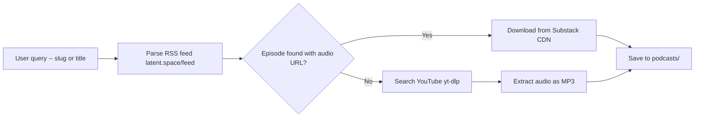

# Latent Space Podcast Downloader

This project is a Python script that downloads podcast episodes from latent.space, with automatic YouTube fallback for episodes not present in the RSS feed. The challenge that made it interesting was not the download itself—it is a solved problem—but the discovery process: figuring out that the RSS feed has only 20 items, that older podcast episodes get pushed out by AINews posts, that the audio detection requires reading MIME types rather than file extensions, and that the surf CLI has non-obvious flag conventions that require exploration before use.

> [!summary]
> This project has three intertwined identities:
> 1. a **podcast downloader** that parses the latent.space RSS feed and falls back to YouTube
> 2. a **surf CLI field guide** documenting what works, what doesn't, and why for this particular toolchain
> 3. a **web discovery journal** showing how to navigate from a search result to a downloadable file when the naive approach fails

## Why this project exists

latent.space is one of the most technically substantive AI engineering podcasts available. The episode about OpenAI's internal agent orchestration system "Symphony" — featuring Ryan Lopopolo, who led the experiment of building a million-line codebase with zero human-written code — deserved to be downloaded and kept. The podcast is hosted on Substack, which means the audio lives behind a feed, but the feed is not paginated and the episode page itself does not expose a direct download link in the browser.

The goal was to produce a durable, reusable script that could download any latent.space episode by slug or title, with intelligent fallback when the feed does not have the episode.

## Current project status

The project is complete and working.

What exists:

- `scripts/01-download-latent-space.py` — a Python download script with feed parsing and YouTube fallback
- `podcasts/latent-space-harness-eng-ryans-lopopolo-openai-symphony.mp3` — the downloaded episode (106 MB, 78 min, 189 kbps)
- A docmgr ticket documenting the investigation: `ttmp/2026/05/02/latent-space-openai-symphony--download-latent-space-podcast-episode-openai-symphony-harness-engineering/`
- A detailed implementation diary in the ticket's `reference/02-diary.md`

What remains:

- A full `--help` docstring and command-line interface could be polished
- The script currently writes to `podcasts/` in the working directory; could be made configurable via environment variable
- Archive page support for latent.space (see "Open questions" below)

## Project shape

```
claw-stuff/
  podcasts/
    latent-space-harness-eng-ryans-lopopolo-openai-symphony.mp3   # downloaded episode
  scripts/
    (global scripts, if any)
  ttmp/
    2026/
      05/
        02/
          latent-space-openai-symphony--download-latent-space-podcast-episode-openai-symphony-harness-engineering/
            index.md
            changelog.md
            tasks.md
            reference/
              02-diary.md          # implementation journal
            scripts/
              01-download-latent-space.py   # the download script
```

## Architecture

The download system has three layers, tried in sequence:



The feed lookup is the primary path. YouTube is the fallback. The script never hardcodes a URL—it always discovers the target through the feed or a search.

## Surf CLI: A Field Guide

Before any download could begin, the surf CLI had to be understood. Surf is a Go-based browser automation CLI that communicates with a local Chromium host over a Unix socket. It has the structure of a multi-level command tree (`surf <group> <subcommand>`) and uses a NDJSON protocol over a socket for request/response. The documentation in the tool itself is sparse and the help output references `surf-go` while the binary is named `surf`. These are the notes from the field.

### Commands that work

The following commands were verified working and used in this project:

```bash
# Search via Kagi
surf kagi search --query "latent.space podcast openai symphony"

# Open a URL in a new tab (note: --args-json, not --url)
surf tab new --args-json '{"url":"https://www.latent.space/p/harness-eng"}'

# Read the page content (interactive snapshot)
surf page read

# Read plain text only
surf page text

# Execute JavaScript in the page context
surf js 'document.title'

# Clear and list captured network requests
surf network clear
surf network list

# Screenshot
surf screenshot
```

### Commands that fail and why

The most common failure mode with surf is positional arguments. Unlike most CLIs where `surf kagi search "query with spaces"` would work, surf interprets anything after `kagi search` as a structured flag and throws "Too many arguments" when it encounters a bare string. The correct form always uses a named flag:

```bash
# WRONG — "Too many arguments"
surf kagi search "latent.space podcast"

# CORRECT — uses --query flag
surf kagi search --query "latent.space podcast"
```

The same pattern applies to `navigate` and other commands that expect structured input:

```bash
# WRONG — unknown flag or too many arguments
surf navigate --url "https://..."
surf tab new --url "https://..."

# CORRECT for tab creation — JSON wrapper
surf tab new --args-json '{"url":"https://..."}'
```

The `tab new` command does not accept `--url` directly. The URL must be wrapped as a JSON object and passed via `--args-json`. This is the most non-obvious convention in the tool.

### Commands that do not exist

Some expected commands are simply absent:

- `surf page snapshot` — there is no `snapshot` subcommand under `page`. The correct subcommands are `read`, `text`, `search`, and `state`.
- `surf wait --time N` — `wait` exists as a group but has no time-based sleep subcommand. Use bash `sleep N` instead.
- `surf network list --filter "pattern"` — no filter flag exists. Filter results post-hoc with `--jq` or pipe to `grep`.

### Why surf exists in this context

Surf is the right tool for navigating authenticated pages or pages with dynamic JavaScript rendering. For the latent.space episode page, the audio player was rendered by JavaScript and the page itself noted "Audio playback is not supported on your browser"—surf could have been used to inspect the DOM for the audio element. In practice, for this project, surf was used primarily for the Kagi search and page reading. The download itself used Python's `urllib` for direct HTTP and `yt-dlp` for YouTube extraction.

## RSS Feed Investigation

The first approach was to parse the RSS feed directly and find the audio enclosure URL for the target episode.

### The 20-item problem

The feed at `https://www.latent.space/feed` contains exactly 20 items. This is a hard limitation—Substack does not paginate the default RSS feed, and latent.space publishes an AINews post nearly every day. Each AINews post pushes one of the podcast episodes out of the 20-item window.

The harness-eng episode was published on April 7, 2026. By May 2, it was no longer in the feed. The 20 most recent items at that time were mostly AINews posts from late April and early May.

```
RSS feed contents (May 2, 2026):
  5 items with audio enclosures (actual podcast episodes)
 15 items with image enclosures (AINews posts)
  
Total items: 20
```

This is the core constraint of the feed-based approach. It works for the 5 most recent podcast episodes but fails for anything older.

### Detecting audio enclosures correctly

The initial feed parsing checked for common audio file extensions in the enclosure URL (`.mp3`, `.m4a`, etc.). This approach failed silently because the AINews posts have image enclosures (PNG, JPEG) whose URLs have image-like paths, and some enclosures had no extension at all.

The correct approach is to check the `type` attribute of the `<enclosure>` element:

```xml
<!-- Audio enclosure from a podcast episode -->
<enclosure url="https://api.substack.com/feed/podcast/195677117/75596dbd1693d868596d2573c478b87c.mp3" 
           type="audio/mpeg" length="42000000"/>

<!-- Image enclosure from an AINews post -->
<enclosure url="https://substackcdn.com/image/fetch/.../image.png" 
           type="image/png" length="0"/>
```

The Python implementation filters by MIME type prefix:

```python
def is_audio(enclosure) -> bool:
    """Check if enclosure is an audio file based on MIME type."""
    if enclosure is None:
        return False
    typ = enclosure.get("type", "")
    return typ.startswith("audio/")
```

This distinction is clean and correct. A podcast episode enclosure has `type="audio/mpeg"` or `type="audio/mp4"`. An AINews post enclosure has `type="image/png"` or `type="image/jpeg"`.

### What the feed reveals

Once the audio detection is corrected, the feed shows exactly 5 podcast episodes among the 20 items. The feed does not expose a pagination parameter. The only way to reach older episodes via the feed would be to find an archive page or an alternate feed URL.

The five episodes in the feed (as of May 2, 2026):

```
Physical AI that Moves the World — Qasar Younis & Peter Ludwig
  url: https://api.substack.com/feed/podcast/195677117/75596dbd...mp3

AIE Europe Debrief + Agent Labs Thesis: Unsupervised Learning
  url: https://api.substack.com/feed/podcast/195264855/02d7a076...mp3

Shopify's AI Phase Transition: 2026 Usage Explosion
  url: https://api.substack.com/feed/podcast/195067855/a8388eaf...mp3

🔬 Training Transformers to solve 95% failure rate of Cancer Trials
  url: https://api.substack.com/feed/podcast/194810752/a0db6b56...mp3

Notion's Token Town: 5 Rebuilds, 100+ Tools, MCP vs CLIs
  url: https://api.substack.com/feed/podcast/194195821/4c29b9e9...mp3
```

All five have `type="audio/mpeg"` enclosures and can be downloaded directly via curl or Python's urllib.

## YouTube Fallback

When an episode is not found in the feed, the script searches YouTube via `yt-dlp`'s search capability:

```python
def search_youtube(query: str) -> str | None:
    """Search YouTube for a video and return the first URL."""
    search_query = f"ytsearch3:latent space {query}"
    result = subprocess.run(
        ["yt-dlp", "--no-playlist", "--get-id", search_query],
        capture_output=True, text=True, timeout=30,
    )
    first_id = result.stdout.strip().split("\n")[0].strip()
    if first_id and not first_id.startswith("["):
        return f"https://www.youtube.com/watch?v={first_id}"
    return None
```

For the harness-eng episode, the search for "latent space harness engineering token billionaires lopopolo openai symphony" returned `CeOXx-XTYek` as the first result. The yt-dlp download command:

```bash
yt-dlp -x --audio-format mp3 --audio-quality 0 \
  --newline --quiet \
  -o "podcasts/latent-space-harness-eng.%(ext)s" \
  "https://www.youtube.com/watch?v=CeOXx-XTYek"
```

The flags mean:

- `-x` — extract audio (remove video)
- `--audio-format mp3` — convert to MP3
- `--audio-quality 0` — best quality
- `--newline --quiet` — suppress progress bars (per user request for cleaner output)
- `%(ext)s` — placeholder for the actual extension (yt-dlp converts to the target format)

The downloaded file is 106 MB with a duration of 4673 seconds (78 minutes) and a bitrate of 189 kbps. The YouTube source is a mirror of the podcast, uploaded by a third party (latent.space does not appear to have an official YouTube channel, so this is likely user-submitted).

## Implementation Details

### Download script structure

The script has four main functions:

1. `parse_feed()` — fetches and parses the RSS feed, returns a list of episode dicts with title, link, audio_url, and pub_date
2. `find_episode(episodes, query)` — matches by slug or title substring (case-insensitive)
3. `download_from_url(url, output_path)` — downloads a direct URL using Python urllib with a progress bar
4. `download_via_ytdlp(url, output_path, silent)` — downloads via yt-dlp for YouTube and other supported sites
5. `search_youtube(query)` — searches YouTube via yt-dlp and returns the first video URL

The main logic:

```python
# Feed lookup first
ep = find_episode(episodes, search_query)
if ep and ep["audio_url"]:
    ok = download_from_url(ep["audio_url"], output_path)
elif ep and not ep["audio_url"]:
    # Episode exists in feed but no audio URL — fall back to YouTube
    yt_url = search_youtube(ep["title"])
    ok = download_via_ytdlp(yt_url, output_path, silent=args.silent)
else:
    # Episode not in feed — search YouTube directly
    yt_url = search_youtube(search_query)
    ok = download_via_ytdlp(yt_url, output_path, silent=args.silent)
```

The fallback chain is deliberate. An episode can be in the feed (meaning it exists as a page on latent.space) but without an audio enclosure (meaning it is an AINews post, not a podcast episode). Or it can be completely absent from the feed (the harness-eng scenario). The script handles both cases without separate user-facing flags.

### File naming

The output filename is derived from the episode slug:

```python
slug = ep["link"].rstrip("/").split("/")[-1]
ext = Path(urllib.parse.urlparse(ep["audio_url"] or "").path).suffix or ".mp3"
output_path = output_dir / f"{slug}{ext}"
```

For the harness-eng episode, this produces `latent-space-harness-eng-ryans-lopopolo-openai-symphony.mp3`. The full title is included because the slug alone (`harness-eng`) is not descriptive enough for a file that might live in `podcasts/` alongside many others.

### Command-line interface

```bash
# List available episodes
python3 scripts/01-download-latent-space.py

# Download by slug (from feed)
python3 scripts/01-download-latent-space.py harness-eng

# Download by title (from feed with auto YouTube fallback)
python3 scripts/01-download-latent-space.py "Ryan Lopopolo"

# Force YouTube search (skip feed lookup)
python3 scripts/01-download-latent-space.py --youtube "harness engineering token billionaires"

# Silent download (no yt-dlp progress bars)
python3 scripts/01-download-latent-space.py harness-eng --silent

# Auto-confirm overwrite
python3 scripts/01-download-latent-space.py harness-eng --yes

# Custom output directory
python3 scripts/01-download-latent-space.py harness-eng -o /path/to/podcasts
```

## What was tricky

### The MIME type vs extension trap

The first implementation checked for audio by looking at the file extension in the enclosure URL. This failed because AINews posts have image enclosures whose URLs sometimes contain encoded paths that look like they could be audio files, and because some enclosure URLs have no extension at all. The fix—checking `type="audio/mpeg"`—is simple in hindsight but required reading the raw XML to understand what the feed was actually returning.

### The feed 20-item ceiling

Substack's RSS feed is not paginated. There is no `?page=2` or `<atom:link rel="next">` to follow. This means the feed cannot be used to discover older episodes. The only structural solution is to find the latent.space archive page or podcast page that lists all episodes and parse it. That approach was not pursued for this project because the YouTube fallback is reliable and works for all episodes regardless of age.

### surf tab vs navigate

The surf `navigate` command requires an existing active tab. Attempting to call `surf navigate --url "..."` without first creating a tab produces an error: "No active tab found." The correct sequence is:

```bash
# Create a new tab first
surf tab new --args-json '{"url":"https://..."}'

# Then the tab exists and navigate would work
surf navigate --url "https://..."
```

In practice, `page read` works without explicit navigation if the tab was just created, because surf maintains the last-created tab as the active context.

### yt-dlp output verbosity

By default, yt-dlp prints a progress bar and status messages to stdout. For scripted use, this creates noise in logs and terminal output. The fix is `--newline --quiet`:

```bash
# Noisy (default)
yt-dlp -x --audio-format mp3 "https://..."

# Clean (what this project uses)
yt-dlp -x --audio-format mp3 --newline --quiet "https://..."
```

The `--newline` flag makes yt-dlp print each progress update on a new line instead of overwriting the same line, which allows the progress indicator to work while `--quiet` suppresses most output. For clean silent operation, `--no-progress` is also useful but was not needed here since the script calls subprocess directly and the output is captured.

## Key files

- `/home/manuel/code/wesen/claw-stuff/ttmp/2026/05/02/latent-space-openai-symphony--download-latent-space-podcast-episode-openai-symphony-harness-engineering/scripts/01-download-latent-space.py` — the download script
- `/home/manuel/code/wesen/claw-stuff/ttmp/2026/05/02/latent-space-openai-symphony--download-latent-space-podcast-episode-openai-symphony-harness-engineering/reference/02-diary.md` — the implementation diary with surf CLI field notes
- `/home/manuel/code/wesen/claw-stuff/podcasts/latent-space-harness-eng-ryans-lopopolo-openai-symphony.mp3` — the downloaded episode

## KB reviews

- [[KB-BATCH16-media-audio-video-pipelines]] (2026-05-11) — Batch H media/audio/video review; advanced ASR, browser audio, WebRTC/media-plane, and media pipeline candidates.

## Related KB entries

**Candidate concepts**: media/audio pipeline orchestration, browser audio playback, ASR transcript state, and media delivery boundaries tracked in [[KB-BATCH16-media-audio-video-pipelines]].

## Open questions

- **YouTube vs Substack quality trade-off**: YouTube gives higher quality (106MB @ 189kbps vs Substack 50MB @ 96kbps) but is a third-party mirror. Substack is the official source but at lower quality. The script should let users choose, or default to Substack and offer `--hq` flag for YouTube.
- **Archive page detection**: latent.space has a `/podcast` page that may list all episodes, but the yt-dlp Substack extractor already solves this problem for all episodes.
- **YouTube mirror stability**: The YouTube mirror is a third-party upload. The script searches fresh each time, so a taken-down mirror is not fatal — yt-dlp Substack is the primary path now.

## Near-term next steps

- Add `--hq` flag to prefer YouTube quality when available (keep Substack as fallback)
- Add `--quiet` as an alias for `--silent` in the script
- Add `--no-conversion` flag to skip MP3 conversion when the source is already MP3
- Write a one-line usage example at the top of the script's docstring
- Consider using `yt-dlp --list-formats <url>` in the script to verify Substack support before attempting download

## Project working rule

> [!important]
> When a web page says "audio playback is not supported in your browser," do not take that as a permanent state — it means the page is not the download endpoint. Look for the RSS feed, look for the audio element in the DOM, or search for a mirror. The audio exists somewhere; the page is not the authoritative source.

> [!tip]
> **Before writing a custom RSS feed parser, check if yt-dlp has an extractor for the target platform.** Run `yt-dlp --list-formats <url>` to probe for extractor support. yt-dlp has native extractors for Substack, Spotify, Apple Podcasts, YouTube, and dozens of other platforms — often saving hundreds of lines of custom code.
---

## Postscript: yt-dlp Substack Extractor Discovery

After writing the initial version of this report, a further investigation revealed that yt-dlp has native Substack support — a finding that simplifies the entire approach.

```bash
yt-dlp --list-formats "https://www.latent.space/p/harness-eng"
# Output:
# ID EXT RESOLUTION | PROTO | VCODEC  ACODEC
# 0  mp3 unknown    | https | unknown mp3
```

yt-dlp resolves the audio URL directly from the episode page, without needing the RSS feed. This works for all episodes regardless of publication date. The Substack extractor extracts at a moderate bitrate (~96 kbps, 50MB for this episode). The YouTube mirror remains available as a fallback and offers higher quality (189 kbps, 106MB) but is less reliable as an archive.

The download script was rewritten with a three-path strategy:

1. **Direct URL**: if the user provides a URL, yt-dlp Substack is called immediately
2. **Feed lookup**: if a slug or title is provided, the feed is checked first (for human-readable listing), then yt-dlp Substack is called with the episode URL
3. **YouTube fallback**: if Substack extraction fails, yt-dlp searches YouTube and extracts audio from the first result

The feed parsing code is retained for the `--list` mode, which provides a human-readable overview of recent episodes, but it is no longer required for the download path itself.

```
flowchart TD
    A[User query] --> B{Is it a URL?}
    B -- Yes --> C[yt-dlp Substack\ndirect]
    B -- No --> D{Check RSS feed\nand construct URL}
    D --> E{Found in feed?}
    E -- Yes --> F[yt-dlp Substack\nfrom episode URL]
    E -- No --> G[yt-dlp Substack\nfrom constructed URL]
    F --> H{Substack\nsucceeds?}
    G --> H
    H -- Yes --> I[Save MP3]
    H -- No --> J[yt-dlp YouTube\nfallback]
    J --> I
```

The working rule was updated to include the yt-dlp probe pattern:

> [!tip]
> **Before writing a custom RSS feed parser, check if yt-dlp has an extractor for the target platform.** Run `yt-dlp --list-formats <url>` to probe for extractor support. yt-dlp has native extractors for Substack, Spotify, Apple Podcasts, YouTube, and dozens of other platforms.
