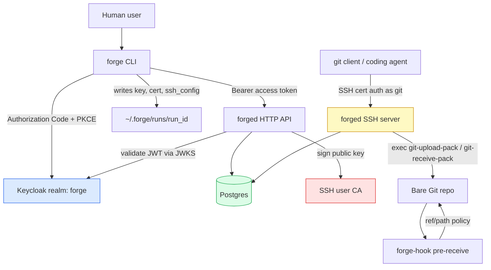
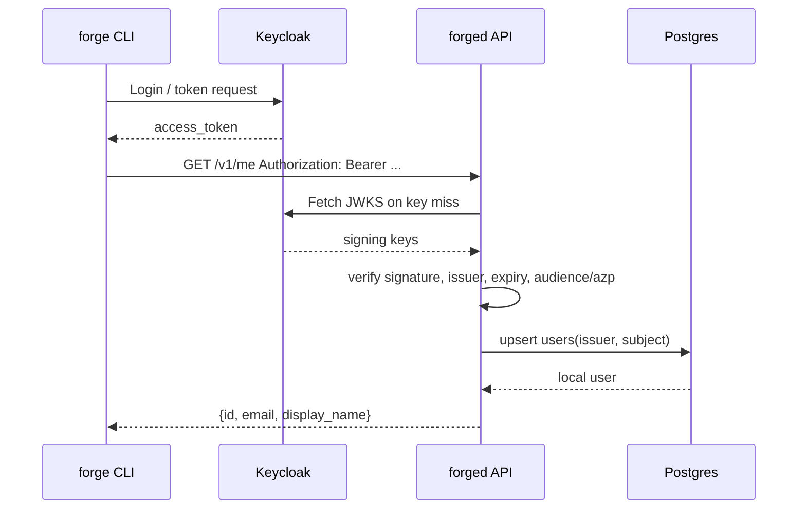
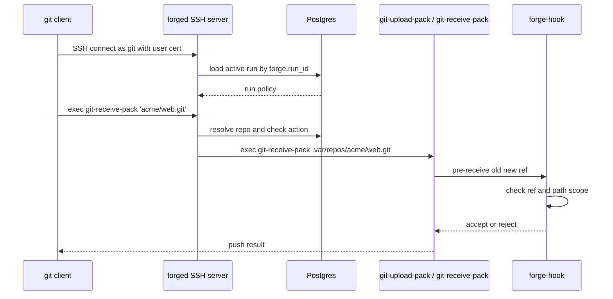

# Wish Git: OAuth-Scoped Git-over-SSH for Coding Agents

Wish Git is a small Git forge experiment with one central idea: a local coding agent should be able to use ordinary Git, but it should not receive a human's long-lived credentials. The human authenticates through Keycloak. The server creates a short-lived, narrowly scoped agent run. The CLI generates a fresh SSH keypair, the server signs that key as an OpenSSH user certificate, and the agent uses normal Git-over-SSH for clone, fetch, and push.

> [!summary]
> Wish Git reuses Git's existing SSH transport instead of implementing the Git pack protocol. The security boundary is an `agent_run` row in Postgres, represented to Git as a short-lived SSH user certificate and enforced again at SSH command execution and Git `pre-receive` time.
>
> The current MVP has a working local runaround: Keycloak, Postgres, API server, SSH server, certificate issuance, `forge agent start`, `git clone`, branch-scoped push, and hook-enforced path/ref policy.

The project is interesting because it sits at the seam between identity systems and old, reliable developer tooling. OAuth is good at authenticating humans and issuing web API tokens. Git-over-SSH is good at moving Git objects efficiently with the Git client people already have. OpenSSH certificates connect those two worlds. A short-lived certificate turns a web-authenticated delegation into something `git clone` and `git push` can already use.

## The problem: agents need delegation, not identity theft

A local coding agent often needs to read a repository, create a branch, commit changes, and push them somewhere for review. The tempting shortcut is to give the agent the same credentials the human uses: a GitHub token, a private SSH key, or a long-lived credential helper session. That is convenient, but it gives the agent the wrong kind of power. It can usually access too many repositories, push to too many branches, and keep working after the intended task is over.

Wish Git's model is to make the delegation explicit. The human still logs in, but the thing handed to the agent is not the human's OAuth refresh token. It is a fresh SSH private key plus a short-lived certificate. The certificate is bound to an agent run, and the run says what the agent may do.

The shape is:

```text
User authenticates with Keycloak
        ↓
CLI creates an agent run for one repo and scope
        ↓
CLI generates a fresh local SSH keypair
        ↓
Server signs the public key as an OpenSSH user cert
        ↓
Agent uses ordinary Git-over-SSH
        ↓
SSH server and Git hook enforce run policy
```

This is not a replacement for a full code hosting product. It is a narrow substrate for controlled Git access by local automation.

## The mental model

There are three credentials in the system, and they play different roles.

| Credential | Holder | Lifetime | Purpose |
|---|---|---:|---|
| Keycloak access token | `forge` CLI | minutes | Authorize API calls such as `POST /v1/agent-runs` |
| Keycloak refresh token | OS keyring | longer | Refresh CLI login without storing plaintext secrets |
| SSH private key + certificate | local run directory | minutes | Let Git use SSH without receiving OAuth tokens |

The important separation is that the coding agent can operate with the SSH material alone. It does not need the OAuth refresh token. If the agent key leaks, the damage is constrained by certificate expiry, run status, repository scope, action scope, ref scope, and path scope.

In the codebase, this model appears as three layers:

- `internal/auth` validates Keycloak tokens for HTTP API calls.
- `internal/certs` signs SSH user certificates for active agent runs.
- `internal/sshserver` and `internal/githook` enforce Git read/write policy at SSH and Git hook time.

The database is the source of truth. The certificate is proof that a holder possesses a key for a run; it is not, by itself, the complete authorization decision.

## Architecture



The project currently builds three binaries:

- `forged` runs the HTTP API and, when SSH keys are configured, the SSH Git server.
- `forge` is the CLI used by the human or local automation.
- `forge-hook` is installed into bare repositories as the `pre-receive` hook.

The package layout mirrors those responsibilities. `internal/api` owns HTTP handlers. `internal/store` owns Postgres migrations and data access. `internal/sshserver` owns SSH authentication and Git command execution. `internal/githook` owns push-time ref/path checks. `internal/cli` owns config, OAuth login, local key generation, and the `agent start` orchestration.

## The database as the authorization spine

The schema is deliberately simple. It stores users, repositories, repository permissions, agent runs, issued certificates, and audit events. The central table is `agent_runs`.

An agent run answers five questions:

1. Who delegated this work?
2. Which repository is the run for?
3. Which Git actions are allowed?
4. Which refs and paths are allowed?
5. When does the delegation stop being valid?

A representative run looks like this:

```json
{
  "repo": "acme/web",
  "allowed_actions": ["git.read", "git.push"],
  "allowed_refs": ["refs/heads/agent/<run_id>/*"],
  "allowed_paths": ["src/**"],
  "expires_at": "2026-05-01T22:57:11Z",
  "status": "active"
}
```

The table matters because every sensitive transition comes back to it. Cert issuance checks that the run is active and owned by the user. SSH authentication loads the active run by ID from the certificate extension. Git command execution compares the requested repository and action against the run. Push hooks receive allowed refs and paths derived from the run.

In pseudocode, the authorization shape is:

```go
func authorizeGitCommand(cert, sshCommand):
    runID := cert.Extensions["forge.run_id"]
    run := db.GetActiveRun(runID)

    cmd := ParseGitSSHCommand(sshCommand)
    repo := db.GetRepository(cmd.FullName)

    if repo.ID != run.RepoID:
        deny("repository not allowed")

    action := "git.read"
    if cmd.Service == "git-receive-pack":
        action = "git.push"

    if !AllowsAction(run, action):
        deny("action not allowed")

    execGit(cmd.Service, repo.DiskPath, runPolicyEnvironment(run))
```

Notice what is not happening: the raw SSH command is not passed to a shell. The server parses it, allows only `git-upload-pack` and `git-receive-pack`, maps a logical repo name to a DB-backed disk path, and uses `exec.CommandContext`.

## Keycloak and the API boundary

Keycloak is the identity provider. The local dev stack imports a `forge` realm with a public `forge-cli` client and a dev user `ada`. The CLI's production-oriented path is Authorization Code + PKCE with a loopback callback. For non-interactive smoke testing, the dev realm also enables direct grants so a script can obtain a token without opening a browser.

The API validates tokens through JWKS:



The implementation is in `internal/auth`. `oidc.go` discovers the Keycloak realm metadata. `jwks.go` fetches and caches RSA keys. `jwt.go` validates token signature and claims. The development realm produced tokens without a `sub` claim during the smoke test, so the current validator has a fallback to `preferred_username`. That fallback is useful for local progress, but production should use stable OIDC `sub`; usernames can change.

This is a good example of an MVP compromise worth documenting. The code works locally, the smoke test passes, and the caveat is visible. The next production-hardening step is not mysterious: fix the Keycloak mapper so `sub` is present and remove or restrict the fallback.

## From API token to SSH certificate

Once the user is authenticated to the API, `forge agent start` creates the run and asks for a cert. The CLI does four local things and two remote things:


The server signs with the configured SSH user CA. The resulting cert has principal `git`, a key ID of the form `run=<run>;user=<user>;cert=<cert>`, and extensions containing the run ID, user ID, and repo binding. The smoke test validates the output with `ssh-keygen -L`.

A real smoke excerpt looked like this:

```text
Type: ssh-ed25519-cert-v01@openssh.com user certificate
Signing CA: ED25519 SHA256:vmLLmNqjqH0J6D67zu6653IkZS2CTEQ1YunLLAopwF0
Key ID: "run=7f3f431a-...;user=00a7f929-...;cert=133607e9-..."
Serial: 4
Principals:
        git
```

The certificate is short-lived. More importantly, the SSH server does not merely trust the certificate contents. It uses the run ID from the cert to load the active run from Postgres. Revocation and expiry are therefore checked at connection time.

## Git-over-SSH without implementing Git

Git-over-SSH is pleasantly old-fashioned. The Git client connects to SSH and asks the server to execute a command like:

```text
git-upload-pack 'acme/web.git'
git-receive-pack 'acme/web.git'
```

Wish Git exploits that boundary. It does not speak pack protocol. It authenticates the SSH session, parses the requested command, authorizes it, and then execs Git.



The SSH code has two especially important rules:

- Raw public keys are rejected. Only OpenSSH user certificates signed by the configured CA are accepted.
- Authorization data is stored in `ssh.Permissions.Extensions`, not in mutable variables captured by the public-key callback.

That second rule matters because SSH public-key callbacks have subtle ordering and proof-of-possession behavior. The implementation keeps the authenticated run context attached to the server connection permissions, then later reads it when a session executes a Git command.

## Push policy: why checks happen twice

A push is more complicated than a fetch. Before `git-receive-pack` starts, the SSH server can answer only a coarse question: is this run allowed to push to this repository at all? It cannot yet know which refs will be updated or which files will change. That information is produced inside receive-pack.

So push policy is enforced twice:

1. The SSH server checks action scope before starting `git-receive-pack`.
2. `forge-hook pre-receive` checks ref and path scope before Git updates refs.

The hook reads standard pre-receive input:

```text
<oldrev> <newrev> <refname>
```

It rejects deletes, rejects non-fast-forward updates, rejects refs outside the allowed patterns, and computes changed paths. For normal updates it runs:

```bash
git diff --name-only "$oldrev" "$newrev"
```

For a new branch it runs:

```bash
git diff-tree --root --no-commit-id --name-only -r "$newrev"
```

Then each path is matched against allowed path globs such as `src/**`.

The current implementation passes policy to the hook through environment variables set by `git-receive-pack` execution:

```text
FORGE_RUN_ID=<run_id>
FORGE_ALLOWED_REFS=refs/heads/agent/<run_id>/*
FORGE_ALLOWED_PATHS=src/**
```

That is sufficient for the MVP and the smoke test. The stronger production version is for `forge-hook` to load policy from the database or a local API using `FORGE_RUN_ID`, so the hook remains database-backed even if environment propagation is misconfigured.

## The end-to-end smoke test

The strongest evidence for the current system is `scripts/smoke-git-ssh.sh`. It starts after services are running and executes the whole path.

The script:

1. gets a dev Keycloak token;
2. verifies `forge whoami`;
3. creates a repo;
4. runs `forge agent start`;
5. checks the cert with `ssh-keygen -L`;
6. clones over SSH;
7. commits `src/hello.txt`;
8. pushes to `agent/<run_id>/demo`.

The important output is not just that each command exits zero. It is that the push is accepted through the same mechanism real Git clients use:

```text
== push ==
To forge-7f3f431aeced49c7ad:acme/script1777687931.git
 * [new branch]      HEAD -> agent/7f3f431a-eced-49c7-ad20-38ee4251002a/demo
smoke test passed
```

Several useful failures were discovered while building this smoke test:

- Local Postgres already used port `5432`, so the Forge dev database moved to host port `55432`.
- Some local ports selected for `forged` were occupied by unrelated services, so the smoke guide now explains how to override API and SSH ports.
- The dev Keycloak token lacked `sub`, forcing either a realm-mapper fix or a temporary validator fallback.
- Git hook execution could not find `forge-hook` by name, because hooks run in a sparse environment. The server now installs an absolute `bin/forge-hook` path when available.

These are exactly the kinds of details that make a project real. The architecture was sound, but the integration edges were where the system became trustworthy.

## What the implementation teaches

The main lesson is that scoped agent access is best treated as delegation, not authentication. The user authenticates. The agent receives a delegated capability. That capability is short-lived, inspectable, and narrow.

The second lesson is that old protocols can be safer when used carefully. Git-over-SSH already exists, and it is robust. The project becomes smaller and more compatible because it does not try to reimplement Git. The hard part is not object transfer; the hard part is authentication, authorization, and hook-time policy.

The third lesson is that every boundary should fail closed:

- no raw SSH keys;
- no arbitrary SSH commands;
- no shell execution for Git services;
- no push to unscoped refs;
- no path changes outside the run scope;
- no long-lived agent credential.

A useful way to read this codebase is to follow one request as it crosses boundaries. Start at `forge agent start`, then follow the HTTP requests into `internal/api`, the persisted run in `internal/store`, the cert in `internal/certs`, the SSH auth in `internal/sshserver`, and the push hook in `internal/githook`. Each package owns one boundary.

## Project status

The current project is an MVP that works locally. It has a real smoke test, a real Keycloak dev realm, real Postgres migrations, real SSH certificates, and real Git clone/push over SSH.

The main implemented pieces are:

- `cmd/forged`: HTTP API, migrations, optional SSH server startup.
- `cmd/forge`: login, whoami, repo create, agent start/renew/revoke, SSH key generation.
- `cmd/forge-hook`: pre-receive policy helper.
- `scripts/smoke-git-ssh.sh`: full happy-path local smoke test.
- `README.md`: local setup and runaround.

The important remaining work is hardening:

- Replace dev Keycloak shortcuts with production-grade `sub` and audience mapping.
- Make hooks load policy from DB/API by run ID.
- Add negative end-to-end smoke tests for push-to-main and out-of-scope path changes.
- Add CI that can run unit tests and, ideally, a containerized integration smoke.
- Decide whether audit write failures should fail security-sensitive API requests.
- Add rate limits around token-adjacent routes, cert issuance, and SSH auth failures.

## Working rule

The working rule for Wish Git is: the database owns authorization, and every external artifact is only a pointer back to that authorization. OAuth tokens point to users. SSH certificates point to runs. Git commands point to repositories. Hooks point to ref/path policy. If a future change makes the artifact itself the source of truth, it is probably weakening the design.

That rule keeps the project understandable. The user logs in. The run defines scope. The cert proves possession. The SSH server checks the run. The hook checks the push. Git does the Git work.
