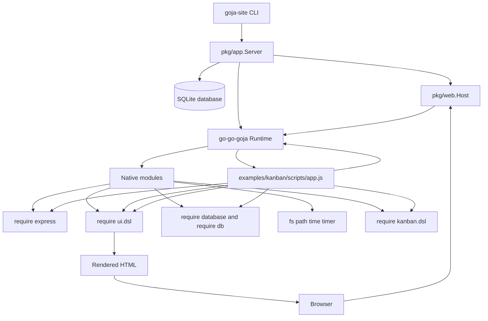
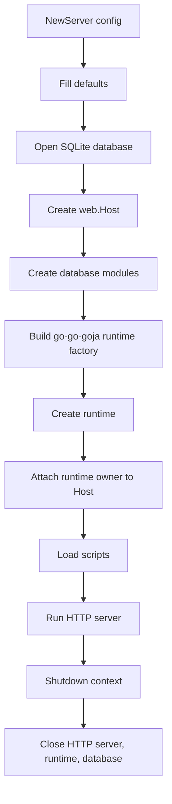
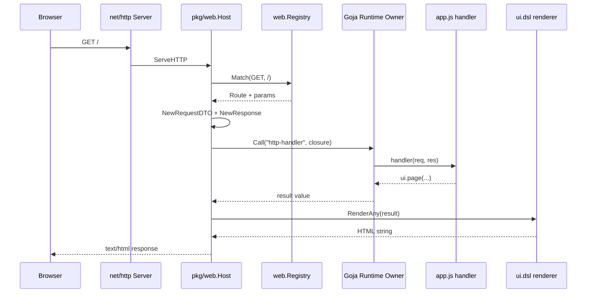

# Goja Site: A Trusted JavaScript Website Host in Go

This article explains the full `goja-site` project: how a Go command-line server hosts small trusted websites written in server-side JavaScript, how the Goja runtime is constructed, how the Express-style routing module works, how `ui.dsl` turns JavaScript function calls into safe HTML, how SQLite is exposed through the `database` module, and how the Field Notes Kanban example grew from a hand-written interactive app into a reusable `kanban.dsl` demonstration.

The project lives at `/home/manuel/code/wesen/2026-05-03--goja-hosting-site`. It is small enough to read in one sitting, but it contains several important architectural ideas: a Go CLI built with Glazed and Cobra, a single owned Goja runtime, native modules registered per runtime, an HTTP host that dispatches requests into JavaScript handlers, a minimal Express-like API, a server-side HTML DSL, and a pattern for lifting browser interaction mechanics into reusable Go-owned JavaScript modules.

> [!summary]
> - `goja-site` is a trusted server-side JavaScript website host implemented in Go. JavaScript scripts register routes, query SQLite, and return `ui.dsl` nodes or response calls.
> - The Go layer owns process lifecycle, HTTP serving, SQLite setup, Goja runtime construction, module registration, request parsing, response rendering, and safe runtime entry through the runtime owner.
> - The JavaScript layer owns application behavior: migrations, route declarations, SQL queries, page composition, and domain-specific callbacks.
> - The architecture deliberately resembles Express, but it is not Node. It is a Go server with a Goja runtime and a small set of native modules chosen for trusted local/server apps.

## Why this project exists

The motivating question is: what is the smallest useful web-hosting environment we can build if JavaScript is the application language, Go is the host, and the target is trusted local or internal apps rather than arbitrary multi-tenant execution?

A typical Node application brings a large runtime, npm dependencies, a bundler story, a database driver story, and a web framework. That ecosystem is powerful, but it is also large. A typical Go application has a strong server story, static binaries, good standard library HTTP support, and direct control over process lifecycle, but embedding application logic usually means recompiling. `goja-site` explores the middle: Go provides the host and trusted capabilities; JavaScript provides fast iteration and compact application scripts.

The project is not trying to be a secure sandbox for untrusted code. That distinction matters. The server exposes a preconfigured SQLite database and trusted modules such as `fs`, `path`, `time`, and `timer`. The model is closer to "this repository contains my app scripts" than "random users upload code." That lets the project focus on developer ergonomics and architecture rather than sandbox hardening.

The first serious example is a Kanban board. A Kanban app is useful as a test case because it exercises many layers at once:

- persistent state through SQLite,
- server-rendered HTML,
- forms and JSON endpoints,
- static assets,
- custom styling,
- search and filtering,
- card movement,
- browser interaction,
- eventually reusable DSL design.

A hello-world route would prove that the server can call JavaScript. The Kanban app proves that the stack can host a small real website.

## The project in one diagram

At runtime, the project looks like this:



The Go process owns the server. JavaScript does not listen on a socket. JavaScript registers handlers. When a request arrives, Go matches the route, constructs a request object, constructs a response object, and calls the JavaScript handler inside the Goja runtime owner.

The simplest mental model is:

```text
Go owns infrastructure.
JavaScript owns application logic.
ui.dsl owns HTML values.
web.Host owns HTTP dispatch.
```

That separation keeps the system understandable. If a route returns the wrong HTML, inspect the JavaScript handler and `ui.dsl`. If a route is not found, inspect `web.Registry` and `express_module.go`. If a request body is wrong, inspect `web/body.go` and `request_response.go`. If a module is unavailable, inspect `pkg/app/server.go` and the runtime builder.

## The CLI entrypoint

The command-line entrypoint is intentionally conventional Go. `cmd/goja-site/main.go` creates a Cobra root command and wires Glazed logging and command generation:

```go
root := &cobra.Command{
    Use:   "goja-site",
    Short: "Host small JavaScript websites on go-go-goja",
    Long:  "goja-site runs trusted JavaScript website scripts with go-go-goja, SQLite, fs, an Express-style router, and an HTML UI DSL.",
    PersistentPreRunE: func(cmd *cobra.Command, args []string) error {
        return logging.InitLoggerFromCobra(cmd)
    },
}
```

The actual user-facing command is `serve`, defined in `cmd/goja-site/serve.go`. It exposes four flags:

| Flag | Default | Meaning |
|---|---:|---|
| `--addr` | `:8080` | HTTP bind address. |
| `--db` | `./app.db` | SQLite database path. |
| `--scripts` | `./scripts` | Directory containing JavaScript files to load. |
| `--dev` | `false` | Whether HTTP responses should include detailed JavaScript handler errors. |

The example command is:

```bash
go run ./cmd/goja-site serve \
  --db examples/kanban/kanban.db \
  --scripts examples/kanban/scripts \
  --addr :8080 \
  --dev
```

The command does not itself know about Goja, Express, SQLite modules, or UI rendering. Its job is to decode settings, set up cancellation on `SIGINT` / `SIGTERM`, create an `app.Server`, and call `Run`:

```go
srv, err := app.NewServer(app.Config{
    Addr: settings.Addr,
    DBPath: settings.DBPath,
    ScriptsDir: settings.ScriptsDir,
    Dev: settings.Dev,
})
...
return srv.Run(ctx)
```

This is a good boundary. CLI code should parse user intent and manage process lifecycle. It should not become the web framework.

## The server object: process-level ownership

The center of the project is `pkg/app.Server`:

```go
type Server struct {
    cfg     Config
    db      *sql.DB
    runtime *engine.Runtime
    host    *web.Host
    httpSrv *http.Server
}
```

This struct owns the resources that must be created and closed together:

- the SQLite database connection,
- the Goja runtime,
- the web host and route registry,
- the HTTP server.

The lifecycle is:



The defaulting logic is deliberately boring:

```go
if cfg.Addr == "" {
    cfg.Addr = ":8080"
}
if cfg.DBPath == "" {
    cfg.DBPath = "./app.db"
}
if cfg.ScriptsDir == "" {
    cfg.ScriptsDir = "./scripts"
}
```

Boring defaults are valuable here. The interesting behavior belongs in modules and scripts, not in hidden configuration rules.

## SQLite and the database modules

`NewServer` opens one SQLite database:

```go
db, err := sql.Open("sqlite3", cfg.DBPath)
...
if err := db.Ping(); err != nil { ... }
```

Then it creates two native database modules from `go-go-goja`:

```go
databaseModule := databasemod.New(
    databasemod.WithPreconfiguredDB(db),
    databasemod.WithConfigureEnabled(false),
)
dbAliasModule := databasemod.New(
    databasemod.WithName("db"),
    databasemod.WithPreconfiguredDB(db),
    databasemod.WithConfigureEnabled(false),
)
```

The important choices are:

- The database is preconfigured by Go, not opened arbitrarily by JavaScript.
- JavaScript gets both `require("database")` and `require("db")` access patterns.
- Runtime scripts cannot reconfigure the database module because `WithConfigureEnabled(false)` is used.

In the Kanban example, server-side JavaScript uses the module directly:

```javascript
const db = require("database");

function migrate() {
  db.exec(`CREATE TABLE IF NOT EXISTS cards (... )`);
}

function listCards(filters) {
  return db.query("SELECT * FROM cards ORDER BY position, id");
}
```

The database module is one of the reasons this project feels like an application environment rather than a toy embedding. JavaScript can perform migrations, seed data, query rows, and update state without the Go app needing domain-specific methods.

## Building the Goja runtime

The runtime is created through `go-go-goja`'s engine builder:

```go
factory, err := engine.NewBuilder().
    WithModules(
        engine.NativeModuleSpec{
            ModuleID: "database:app",
            ModuleName: databaseModule.Name(),
            Loader: databaseModule.Loader,
        },
        engine.NativeModuleSpec{
            ModuleID: "database:db-alias",
            ModuleName: dbAliasModule.Name(),
            Loader: dbAliasModule.Loader,
        },
    ).
    UseModuleMiddleware(engine.MiddlewareOnly("fs", "path", "time", "timer")).
    WithRuntimeModuleRegistrars(
        web.NewExpressRegistrar(host),
        uidsl.NewRegistrar(),
        kanbanddsl.NewRegistrar(),
    ).
    Build()
```

This single builder call defines the JavaScript world available to app scripts.

There are three categories of modules:

1. Preconfigured database modules are installed explicitly with `WithModules` because they capture the server's SQLite connection.
2. Trusted utility modules such as `fs`, `path`, `time`, and `timer` are enabled through module middleware.
3. Runtime-aware modules such as `express`, `ui.dsl`, and `kanban.dsl` are registered through runtime module registrars.

The distinction between ordinary native modules and runtime module registrars matters. The Express module needs the `web.Host` for this server. The Kanban DSL keeps a runtime-scoped board registry. These are not process-global stateless modules; they are tied to this server/runtime combination.

After building the factory, `NewServer` creates the runtime:

```go
rt, err := factory.NewRuntime(context.Background())
...
host.SetRuntime(rt.Owner)
```

The `rt.Owner` is the safe entrypoint for calling into the Goja runtime from HTTP requests. This is a key concurrency boundary. The HTTP server may receive requests concurrently, but Goja execution must be coordinated.

## Loading application scripts

The server loads JavaScript files from `--scripts` after the runtime and modules exist:

```go
func (s *Server) LoadScripts(ctx context.Context) error {
    files, err := scriptFiles(s.cfg.ScriptsDir)
    ...
    for _, file := range files {
        data, err := os.ReadFile(file)
        _, err = s.runtime.Owner.Call(ctx, "load-script", func(_ context.Context, vm *goja.Runtime) (any, error) {
            _, err := vm.RunScript(file, string(data))
            return nil, err
        })
    }
    return nil
}
```

The file discovery is simple and deterministic:

```go
filepath.WalkDir(dir, func(path string, d os.DirEntry, err error) error {
    if d.IsDir() { return nil }
    if strings.HasSuffix(path, ".js") {
        files = append(files, path)
    }
    return nil
})
sort.Strings(files)
```

Sorting matters. If an application uses multiple scripts, deterministic load order makes behavior reproducible. There is no hot reload, dependency graph, or bundler in this project. Scripts are loaded in sorted order into one runtime. That is enough for the current goal.

When `examples/kanban/scripts/app.js` runs, it registers routes. It does not return a value to the server. The side effect of loading the script is that `app.get(...)`, `app.post(...)`, `app.static(...)`, and `board.mount(...)` populate the host's route registry.

## The HTTP host

`pkg/web.Host` is the Go HTTP handler that sits between the browser and JavaScript route handlers:

```go
type Host struct {
    registry *Registry
    dev      bool
    renderer Renderer
    owner    runtimeowner.Runner
    static   []StaticMount
}
```

Its responsibilities are narrow:

- serve static mounts,
- match dynamic routes,
- parse requests into DTOs,
- create response objects,
- call JavaScript handlers through the runtime owner,
- render returned UI nodes if the handler returns a value,
- hide or reveal errors depending on dev mode.

The request path is:

```go
func (h *Host) ServeHTTP(w http.ResponseWriter, r *http.Request) {
    for _, mount := range h.static {
        if r.URL.Path == mount.Prefix || strings.HasPrefix(r.URL.Path, mount.Prefix+"/") {
            mount.Handler.ServeHTTP(w, r)
            return
        }
    }

    route, params, ok := h.registry.Match(r.Method, r.URL.Path)
    if !ok {
        http.NotFound(w, r)
        return
    }

    req, err := NewRequestDTO(r, params)
    res := NewResponse(w, h.renderer)

    _, err = h.owner.Call(r.Context(), "http-handler", func(ctx context.Context, vm *goja.Runtime) (any, error) {
        result, err := route.Handler(goja.Undefined(), vm.ToValue(req.Map()), res.JSObject(vm))
        ...
    })
}
```

This host has a small but important convenience: if a route handler returns a value and has not already sent a response, the host decides how to send it:

```go
if !res.Sent() && !goja.IsUndefined(result) && !goja.IsNull(result) {
    if _, ok := result.Export().(string); ok {
        return nil, res.Send(vm, result)
    }
    return nil, res.HTML(vm, result)
}
```

That means JavaScript can write either style:

```javascript
app.get("/hello", (req, res) => res.html(ui.h1("Hello")));
```

or the terser:

```javascript
app.get("/hello", (req, res) => ui.h1("Hello"));
```

The second form works because returned non-string values are rendered as HTML through the configured renderer, which is `uidsl.RenderAny`.

## Route matching

The route registry in `pkg/web/route_registry.go` is intentionally small. It supports:

- exact path segments,
- named parameters such as `:id`,
- wildcard `*`,
- method matching with `ALL` as fallback.

Routes are stored in insertion order:

```go
type Registry struct {
    mu     sync.RWMutex
    routes []Route
}
```

Matching walks that slice:

```go
for _, route := range r.routes {
    if route.Method != method && route.Method != "ALL" {
        continue
    }
    params, ok := matchPattern(route.Pattern, path)
    if ok {
        return route, params, true
    }
}
```

The path pattern matcher is simple enough to understand fully:

```go
func matchPattern(pattern, path string) (map[string]string, bool) {
    pp := splitPath(pattern)
    sp := splitPath(path)
    params := map[string]string{}
    for i := 0; i < len(pp); i++ {
        if pp[i] == "*" {
            return params, true
        }
        if i >= len(sp) {
            return nil, false
        }
        if strings.HasPrefix(pp[i], ":") {
            name := strings.TrimPrefix(pp[i], ":")
            params[name] = sp[i]
            continue
        }
        if pp[i] != sp[i] {
            return nil, false
        }
    }
    return params, len(pp) == len(sp)
}
```

This is not a full router like chi, gin, or Express. It is enough for the project. It supports routes like:

```javascript
app.get("/hello/:name", ...)
app.post("/cards/:id/move", ...)
app.post("/_kanban/:boardId/action/:action", ...)
```

Actually, the Kanban DSL registers its action route as a concrete board path with an action parameter:

```text
POST /_kanban/trail-notes/action/:action
```

The simplicity is a feature. Because the router is small, the request path is easy to trace when something goes wrong.

## Request parsing

`pkg/web/request_response.go` defines the request DTO exposed to JavaScript:

```go
type RequestDTO struct {
    Method  string
    URL     string
    Path    string
    Query   map[string]any
    Params  map[string]string
    Headers map[string]string
    Cookies map[string]string
    IP      string
    Body    any
    RawBody string
}
```

The JavaScript handler receives a plain object:

```javascript
app.post("/echo", (req, res) => {
  res.json({ title: req.body.title });
});
```

Query parameters are normalized so single values are strings and repeated values are arrays:

```go
query := map[string]any{}
for k, vals := range r.URL.Query() {
    if len(vals) == 1 {
        query[k] = vals[0]
    } else {
        query[k] = vals
    }
}
```

Request bodies are parsed in `pkg/web/body.go`:

```go
if strings.Contains(ct, "application/json") {
    var v any
    if err := json.Unmarshal(data, &v); err != nil {
        return nil, raw, err
    }
    return v, raw, nil
}
```

Form bodies become maps:

```go
if strings.Contains(ct, "application/x-www-form-urlencoded") || strings.Contains(ct, "multipart/form-data") {
    r.Body = io.NopCloser(strings.NewReader(raw))
    if err := r.ParseForm(); err != nil { ... }
    m := map[string]any{}
    for k, vals := range r.PostForm {
        if len(vals) == 1 { m[k] = vals[0] } else { m[k] = vals }
    }
    return m, raw, nil
}
```

Everything else is exposed as a raw string.

This gives the app enough convenience without hiding the original body. The `rawBody` field is useful when debugging or when a future endpoint needs custom parsing.

## Responses: explicit methods and implicit return values

The response object exposed to JavaScript has methods inspired by Express:

```go
_ = obj.Set("status", func(code int) *goja.Object { r.setStatus(code); return obj })
_ = obj.Set("set", func(name, value string) *goja.Object { r.setHeader(name, value); return obj })
_ = obj.Set("type", func(value string) *goja.Object { r.setHeader("Content-Type", value); return obj })
_ = obj.Set("json", func(v goja.Value) error { return r.JSON(vm, v) })
_ = obj.Set("send", func(v goja.Value) error { return r.Send(vm, v) })
_ = obj.Set("html", func(v goja.Value) error { return r.HTML(vm, v) })
_ = obj.Set("redirect", ...)
_ = obj.Set("end", func() error { return r.End() })
```

The response object tracks whether a response has been sent:

```go
type Response struct {
    mu       sync.Mutex
    w        http.ResponseWriter
    renderer Renderer
    status   int
    headers  map[string]string
    sent     bool
}
```

That prevents double writes. If JavaScript calls `res.json(...)`, the host will not also render the handler's return value. If the handler returns a string, `res.Send` writes text or HTML based on the leading character. If it returns a `ui.dsl` node, `res.HTML` uses the renderer.

This dual style is convenient for scripts. For simple pages, return a node:

```javascript
app.get("/", (req, res) => ui.page({ title: "Home" }, ui.h1("Hello")));
```

For explicit API endpoints, call response methods:

```javascript
app.get("/api/cards", (req, res) => {
  res.json(listCards(req.query));
});
```

For redirects:

```javascript
res.redirect("/");
```

The API is small, but it covers the application patterns used in the Kanban example.

## The Express-style module

The Express module is implemented in `pkg/web/express_module.go`. It is not Express itself. It is a small compatibility-inspired API that gives JavaScript scripts a familiar way to register routes.

The module exports one function:

```javascript
const express = require("express");
const app = express.app();
```

The Go loader is:

```go
func (r *ExpressRegistrar) loader(vm *goja.Runtime, moduleObj *goja.Object) {
    exports := moduleObj.Get("exports").(*goja.Object)
    _ = exports.Set("app", func() goja.Value { return r.appObject(vm) })
}
```

The app object exposes route methods:

```go
for _, method := range []string{"get", "post", "put", "patch", "delete", "all"} {
    method := method
    _ = obj.Set(method, func(pattern string, handler goja.Value) error {
        fn, ok := goja.AssertFunction(handler)
        if !ok {
            return fmt.Errorf("app.%s(%q) requires a function handler", method, pattern)
        }
        r.host.Register(strings.ToUpper(method), pattern, fn)
        return nil
    })
}
```

and static mounts:

```go
_ = obj.Set("static", func(prefix, dir string) error {
    if prefix == "" || dir == "" {
        return fmt.Errorf("app.static requires prefix and directory")
    }
    r.host.RegisterStatic(prefix, dir)
    return nil
})
```

The static support is used by the Kanban example:

```javascript
app.static("/assets", "examples/kanban/assets");
```

The key design is that the app object does not execute requests. It registers handlers into `web.Host`. Go remains the HTTP server. JavaScript describes the routes.

## The UI DSL: HTML as values

`ui.dsl` is the other core module. It lets JavaScript construct HTML without string concatenation:

```javascript
const ui = require("ui.dsl");

ui.page({ title: "Demo" },
  ui.link({ rel: "stylesheet", href: "/style.css" }),
  ui.main(
    ui.h1("Hello"),
    ui.p("Rendered from server-side JavaScript")
  )
)
```

The module exports tag functions from `pkg/uidsl/module.go`:

```go
var tags = []string{
    "html", "head", "body", "title", "meta", "link", "script", "style",
    "main", "img", "br", "hr", "time", "svg", "path", ...
    "div", "span", "h1", "h2", "h3", "h4", "p", "a", "form",
    "input", "button", "select", "option", ...
}
```

Each tag function calls `elementFromCall`:

```go
func elementFromCall(tag string, call goja.FunctionCall) *Element {
    attrs := map[string]any{}
    args := call.Arguments
    if len(args) > 0 && isAttrs(args[0]) {
        if m, ok := args[0].Export().(map[string]any); ok {
            attrs = m
        }
        args = args[1:]
    }
    return &Element{Tag: tag, Attrs: attrs, Children: nodesFromArgs(args)}
}
```

The first argument is treated as attributes if it looks like an object rather than a node or scalar. Everything else becomes children.

The internal node model in `pkg/uidsl/node.go` is small:

```go
type Node interface{ isNode() }

type Document struct {
    Title string
    Head  []Node
    Body  []Node
}

type Element struct {
    Tag      string
    Attrs    map[string]any
    Children []Node
}

type Text struct{ Value string }
type RawHTML struct{ Value string }
type Fragment struct{ Children []Node }
```

This is enough for HTML rendering and enough for other Go modules to construct UI nodes directly. `kanban.dsl` uses this: it creates `uidsl.Element` structs for board shells, columns, cards, and move forms, while app-specific card bodies come from JavaScript `ui.dsl` hooks.

## Rendering and escaping

The renderer in `pkg/uidsl/render.go` converts nodes into HTML strings:

```go
func RenderAny(vm *goja.Runtime, v goja.Value) (string, error) {
    n, err := Normalize(vm, v)
    if err != nil { return "", err }
    var b bytes.Buffer
    if err := renderNode(&b, n); err != nil { return "", err }
    return b.String(), nil
}
```

Normalization accepts several kinds of values:

```go
switch v := x.(type) {
case nil:
    return &Fragment{}, nil
case Node:
    return v, nil
case string:
    return &Text{Value: v}, nil
case int, int64, float64, bool:
    return &Text{Value: fmt.Sprint(v)}, nil
case []Node:
    return &Fragment{Children: v}, nil
case []any:
    children, err := normalizeChildren(v)
    return &Fragment{Children: children}, nil
}
```

Rendering escapes text:

```go
case *Text:
    b.WriteString(html.EscapeString(v.Value))
```

and escapes attributes:

```go
b.WriteString(html.EscapeString(value))
```

This is the main safety improvement over building HTML strings by hand. If a card title contains `<script>`, it is text, not markup. Raw HTML exists through `ui.raw(...)`, but that is an explicit escape hatch.

Attributes get convenience handling. Boolean attributes render only when true:

```go
if bv, ok := v.(bool); ok {
    if bv {
        b.WriteByte(' ')
        b.WriteString(k)
    }
    continue
}
```

Classes can be arrays or maps:

```go
if k == "class" {
    switch x := v.(type) {
    case []any:
        ...join truthy values...
    case map[string]any:
        ...include truthy class names...
    }
}
```

Styles can be maps:

```go
if k == "style" {
    if m, ok := v.(map[string]any); ok {
        ...sort keys and join key:value pairs...
    }
}
```

The renderer also knows about void tags such as `img`, `input`, `link`, and `meta`, so it does not emit closing tags for them.

The tests capture the essential contract:

```go
node := vm.ToValue(&Element{
    Tag: "div",
    Attrs: map[string]any{"class": "a&b", "hidden": true},
    Children: []Node{&Text{Value: "<hello>"}},
})
got, err := RenderAny(vm, node)
```

Expected output:

```html
<div class="a&amp;b" hidden>&lt;hello&gt;</div>
```

The test for `ui.page(...)` confirms document rendering:

```html
<!doctype html>
<title>Demo</title>
<link href="/x.css" rel="stylesheet">
<main><h1>Hi</h1></main>
```

## The `ui.page` convenience

`ui.page(...)` builds a `Document`. It accepts an optional attributes object with a `title` field, then separates head-like children from body children:

```go
var headTags = map[string]bool{
    "meta": true,
    "link": true,
    "style": true,
    "title": true,
}
```

The page helper lets JavaScript write:

```javascript
ui.page({ title: "Trail Notes: Cascade Loop" },
  ui.link({ rel: "stylesheet", href: "/style.css" }),
  ui.main({ class: "page" }, ...)
)
```

The link goes into the document head. The main element goes into the body. The renderer adds the standard doctype, charset, and viewport tags:

```html
<!doctype html>
<html>
<head>
  <meta charset="utf-8">
  <meta name="viewport" content="width=device-width, initial-scale=1">
  ...
</head>
<body>...</body>
</html>
```

This helper is small but important. It keeps server-side JavaScript page construction readable without requiring every app to remember the boilerplate document shell.

## The Kanban example as a full-stack exercise

The Kanban app in `examples/kanban/scripts/app.js` is the best way to understand how the project feels from the JavaScript side. The top of the file imports the application environment:

```javascript
const db = require("database");
const express = require("express");
const ui = require("ui.dsl");
const kanban = require("kanban.dsl");

const app = express.app();
app.static("/assets", "examples/kanban/assets");
```

Then the app defines normal domain functions:

- `migrate()` creates and evolves the SQLite schema.
- `seedIfEmpty()` inserts demo cards.
- `listCards(filters)` handles search and status/tag filtering.
- `moveCard({ id, toStatus, toIndex })` updates card status and position.
- `stylesheet()` returns CSS.
- `boardPage(query)` composes the page.

This is ordinary application code. The interesting part is that it runs inside Goja but talks to Go-owned modules.

The schema is created from JavaScript:

```javascript
db.exec(`CREATE TABLE IF NOT EXISTS cards (
  id INTEGER PRIMARY KEY AUTOINCREMENT,
  title TEXT NOT NULL,
  description TEXT,
  status TEXT NOT NULL DEFAULT 'todo',
  position INTEGER NOT NULL DEFAULT 0,
  tag TEXT NOT NULL DEFAULT 'Planning',
  due_date TEXT NOT NULL DEFAULT '',
  done INTEGER NOT NULL DEFAULT 0,
  image TEXT NOT NULL DEFAULT '',
  created_at TEXT NOT NULL DEFAULT CURRENT_TIMESTAMP,
  updated_at TEXT NOT NULL DEFAULT CURRENT_TIMESTAMP
)`);
```

The app route is registered from JavaScript:

```javascript
app.get("/", (req, res) => res.html(boardPage(req.query)));
```

The CSS route is also registered from JavaScript:

```javascript
app.get("/style.css", (req, res) => {
  res.type("text/css; charset=utf-8").send(stylesheet());
});
```

An API endpoint returns JSON:

```javascript
app.get("/api/cards", (req, res) => {
  res.json(listCards(req.query));
});
```

A form endpoint creates cards and redirects:

```javascript
app.post("/cards", (req, res) => {
  const body = req.body || {};
  const title = String(body.title || "").trim();
  if (!title) return res.status(400).send("title is required");
  ...insert card...
  res.redirect("/");
});
```

This demonstrates all major host features: GET, POST, body parsing, query parsing, response status, JSON, text/CSS, HTML, redirect, static assets, and SQLite.

## Why `kanban.dsl` was added after the base stack

The base project originally implemented Kanban interactions directly in `app.js`: browser search, drag/drop, move form handling, JSON move endpoints, and board refresh behavior. That was a useful first phase because it proved the stack could support a real app.

But the pattern was wrong for reuse. If every app has to write its own browser Kanban runtime, then `goja-site` is merely a server-side JS host. The deeper idea is to let Go native modules provide reusable application DSLs that bridge server-side callbacks and browser behavior.

`kanban.dsl` is the first strong example of that idea. It is described in detail in the companion note [[ARTICLE - Kanban DSL - Server Rendered Boards with Goja Callbacks]]. At the project level, the important point is that the base architecture made `kanban.dsl` possible without major rewrites:

- `ui.dsl` already made HTML values composable.
- `express` already let scripts register routes.
- `web.Host` already dispatched HTTP into Goja safely.
- `database` already let callbacks mutate state.
- `app.NewServer` already had a runtime registrar pattern.

The Kanban DSL is therefore not a separate architecture. It is a layer built on top of the primitives this project already established.

## Request timeline: from browser to JavaScript handler

For an ordinary page request, the call path is:



The server has two ways for the JavaScript handler to send a response:

1. Explicitly use `res`:

   ```javascript
   app.get("/api/cards", (req, res) => res.json(listCards(req.query)));
   ```

2. Return a value:

   ```javascript
   app.get("/hello", (req, res) => ui.h1("Hello"));
   ```

The host handles both. This dual style is what makes small page routes pleasant while still supporting explicit API endpoints.

## Request timeline: form post to database mutation

For a form submission such as creating a card, the path includes body parsing and redirect:

```text
Browser submits form
  -> POST /cards application/x-www-form-urlencoded
  -> web.parseBody reads body and calls r.ParseForm
  -> req.body becomes { title, description, status, tag }
  -> app.js handler validates title
  -> db.exec inserts row
  -> res.redirect("/")
  -> browser loads updated board page
```

The JavaScript handler sees a simple object:

```javascript
const body = req.body || {};
const title = String(body.title || "").trim();
```

The Go layer did the HTTP parsing. The JavaScript layer does the application validation. That is the recurring pattern.

## Request timeline: Kanban drag/drop to callback

For Kanban drag/drop, the path is longer because browser behavior is involved:

```text
Browser drag/drop
  -> /_kanban/client.js reads data-kb-card-id and data-kb-drop-column
  -> POST /_kanban/trail-notes/action/cardMoved JSON envelope
  -> web.Host parses JSON body
  -> mounted kanban.dsl action route extracts :action
  -> Board.Dispatch("cardMoved", body)
  -> event normalized with boardId/action/from/to
  -> app.js cardMoved callback runs
  -> moveCard updates SQLite
  -> callback returns { ok: true, refresh: true, toast }
  -> kanban.dsl rerenders board fragment with ui.dsl
  -> JSON response includes html
  -> browser replaces board root
```

The base project and the Kanban DSL are visible together here. `web.Host` does HTTP. `kanban.dsl` does action dispatch. `app.js` does domain mutation. `ui.dsl` does render values. The browser runtime does DOM replacement.

## Error handling and development mode

The host has a simple dev/prod distinction. If a JavaScript handler fails and the response has not been sent, dev mode returns the detailed error:

```go
if err != nil && !res.Sent() {
    if h.dev {
        http.Error(w, fmt.Sprintf("JavaScript handler error: %v", err), http.StatusInternalServerError)
    } else {
        http.Error(w, "internal server error", http.StatusInternalServerError)
    }
}
```

This is important for a scripting environment. During development, the app author needs to see errors from JavaScript, Goja, and Go callbacks. In a non-dev setting, returning raw internal errors is not desirable.

The server creation path also cleans up on failure. If opening the database succeeds but runtime creation fails, the database is closed. If script loading fails after runtime creation, `s.Close(...)` is called. This is ordinary Go hygiene, but it prevents confusing half-started processes.

## Static files

Static file support is implemented directly in `web.Host`:

```go
type StaticMount struct {
    Prefix  string
    Handler http.Handler
}

func (h *Host) RegisterStatic(prefix, dir string) {
    prefix = cleanPath(prefix)
    h.static = append(h.static, StaticMount{
        Prefix: prefix,
        Handler: http.StripPrefix(prefix, http.FileServer(http.Dir(dir))),
    })
}
```

Static mounts are checked before dynamic routes:

```go
for _, mount := range h.static {
    if r.URL.Path == mount.Prefix || strings.HasPrefix(r.URL.Path, mount.Prefix+"/") {
        mount.Handler.ServeHTTP(w, r)
        return
    }
}
```

The Kanban app uses this for assets:

```javascript
app.static("/assets", "examples/kanban/assets");
```

This is enough for images such as the trail map. The app still serves CSS dynamically from JavaScript because the example CSS is embedded in `stylesheet()`. A larger app could mount a static CSS directory instead.

## What this project is not

It is useful to name the non-goals because they explain some implementation choices.

This project is not a Node compatibility layer. It does not try to run arbitrary Express apps. The Express-like API is a small inspired surface: `app.get`, `app.post`, `app.static`, `req`, `res`, and route params.

It is not a secure untrusted-code sandbox. It intentionally exposes trusted modules and a preconfigured database. If untrusted code were a goal, the module list, filesystem access, database access, timeouts, memory limits, and request isolation model would need a different design.

It is not a full frontend framework. `ui.dsl` renders server-side HTML values. It does not implement hydration, virtual DOM diffing, or client-side component state.

It is not a production router. The route matcher is intentionally small. That keeps the code understandable and enough for the project's examples.

Those constraints are not weaknesses. They keep the architecture focused.

## Testing evidence

The test suite covers the core contracts.

### UI DSL tests

`pkg/uidsl/render_test.go` verifies escaping and page rendering. It checks that text and attributes are escaped:

```html
<div class="a&amp;b" hidden>&lt;hello&gt;</div>
```

It also checks that `ui.page(...)` produces document-level HTML with title, link, and body content.

### Route registry tests

`pkg/web/route_registry_test.go` verifies route matching behavior such as params and wildcards. The registry is small enough that these tests are the best documentation of its supported path syntax.

### Web host integration tests

`pkg/web/host_integration_test.go` runs a real host with a real Goja runtime and registers JavaScript routes:

```javascript
const express = require("express");
const ui = require("ui.dsl");
const app = express.app();
app.get("/hello/:name", (req, res) => ui.h1("Hello " + req.params.name));
```

Then Go sends an HTTP request and checks that the response contains:

```html
<h1>Hello Goja</h1>
```

Another test posts JSON:

```javascript
app.post("/echo", (req, res) => res.status(201).json({ title: req.body.title }));
```

and verifies that `req.body.title` is decoded.

These tests are important because they exercise the full bridge: Go HTTP request, route match, body parsing, runtime owner call, JavaScript handler, response object, and writer output.

### Kanban DSL tests

The Kanban DSL tests extend the same pattern into mounted client routes and action dispatch. They prove that a module built on top of `express` and `ui.dsl` can register its own routes and serve its own browser code.

That is a significant architectural validation. It means `goja-site` can host higher-level DSLs, not just one-off scripts.

## Common failure modes

### `require("express")` or `require("ui.dsl")` fails

Check `pkg/app/server.go`. Modules are registered at runtime creation. If a module is missing from `WithRuntimeModuleRegistrars(...)`, scripts will fail during `LoadScripts`.

### Routes are registered but never hit

Check the path normalization and route pattern. `cleanPath` ensures leading slashes and removes trailing slashes. `matchPattern` is segment-based. A pattern like `/cards/:id/move` matches `/cards/1/move`, not `/cards/1/move/extra`.

### JSON body is missing

Check the `Content-Type`. `parseBody` only JSON-decodes when the header contains `application/json`. If the client posts JSON without that header, JavaScript will see the raw string.

### Form body is missing

Check that the form uses a supported content type. Browser forms with `method="post"` generally submit `application/x-www-form-urlencoded` unless file uploads are involved. `parseBody` also recognizes `multipart/form-data`.

### HTML is escaped unexpectedly

If JavaScript passes a string as a child, it is text and will be escaped. Use `ui.raw(...)` only for trusted raw HTML. Most app code should not need it.

### Returned object becomes text instead of HTML

The renderer can only render values that normalize to `ui.dsl` nodes. If a route returns an arbitrary JavaScript object and does not call `res.json(...)`, the host may try to render it as HTML. API routes should call `res.json(...)` explicitly.

### JavaScript handler panics bring down the request

In dev mode, the HTTP response includes the JavaScript handler error. In non-dev mode, it returns a generic internal server error. Use `--dev` while building apps.

### Goja nil/undefined interop surprises

When Go code reads JavaScript object properties, handle missing values defensively. The Kanban event normalizer uses a `missingValue` helper because missing properties can appear as nil, undefined, or null depending on the path.

## Design lessons

The project demonstrates several reusable patterns.

First, native modules should be small and deliberate. `express` does route registration. `ui.dsl` constructs HTML. `kanban.dsl` owns Kanban mechanics. The database module owns SQL access. Each module has a clear job.

Second, Go should own lifecycle and concurrency. The server opens and closes resources. The runtime owner serializes or coordinates entry into Goja. HTTP handlers do not poke the VM directly from arbitrary goroutines.

Third, JavaScript should own app meaning. The Kanban app decides what a card is, how it is rendered, how rows are ordered, and what moving to `done` means. The Go host does not know those business rules.

Fourth, HTML values are a useful intermediate representation. Because `ui.dsl` returns nodes rather than strings, Go modules such as `kanban.dsl` can compose with app-provided render hooks. That is much harder if everything is string concatenation.

Fifth, a simple server-rendered model can remain interactive when paired with small generic browser runtimes. The project does not need a full frontend framework to support useful drag/drop behavior. It needs a clear event protocol and fragment replacement.

## Near-term next steps

The current project is a strong foundation, but several improvements would make it more robust.

1. Add persistent browser automation. Manual Playwright validation found a real drag/drop issue. A CI-level browser test would protect that behavior.
2. Improve documentation for writing new apps. A tutorial should show a minimal app, a database-backed app, and a DSL-backed interactive app.
3. Add a development reload story. Today scripts load once at startup. A dev mode that restarts the runtime or reloads scripts would speed iteration.
4. Add typed result helpers for response patterns. API routes currently use plain JS objects; helper conventions could improve consistency.
5. Expand `ui.dsl` carefully. More tags and helpers are useful, but the core should remain small and predictable.
6. Harden static asset and path handling if the project moves beyond trusted local apps.
7. Add richer error pages in dev mode. A stack-aware HTML error page would be friendlier than plain text.
8. Continue extracting reusable DSL modules. `kanban.dsl` proves the pattern; other app widgets could follow it.

## Closing perspective

`goja-site` is interesting because it does not choose between Go and JavaScript. It gives each language a role that suits it. Go handles the process, the HTTP server, SQLite ownership, module boundaries, and safe runtime entry. JavaScript handles application behavior, route declarations, SQL usage, and page composition. The `ui.dsl` module gives JavaScript a safe way to produce HTML values. The Express-style module gives it a familiar way to register HTTP handlers. The Kanban DSL shows that higher-level reusable interaction modules can be built on top.

The result is a compact application environment. A single JavaScript file can define a database-backed website with custom HTML and interactive behavior, while the Go server remains understandable and inspectable. The architecture is not large, but it is layered. Each request crosses those layers in a predictable order. Each module has a reason to exist. That is the quality that makes the project worth preserving: it is small enough to modify, but rich enough to teach the shape of a real hosted scripting environment.
