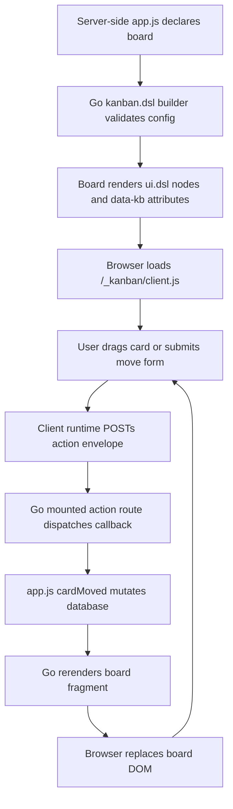
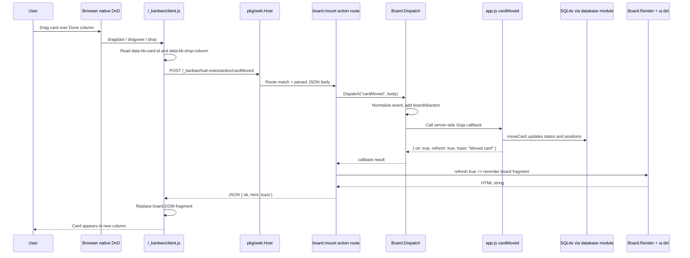

# Kanban DSL: Server-Rendered Boards with Goja Callbacks

This article explains the implementation of `kanban.dsl`, a server-side Goja module for building flexible Kanban boards without forcing every application to write its own browser-side drag/drop code. The implementation lives in `/home/manuel/code/wesen/2026-05-03--goja-hosting-site`, and the concrete example is the Field Notes-style Kanban app under `examples/kanban/scripts/app.js`.

The central idea is simple but powerful: application authors should describe a board in server-side JavaScript, render cards with `ui.dsl`, and write domain callbacks such as `cardMoved(event)` in Goja. The Go module should own the repetitive browser mechanics: live search, precise move forms, HTML5 drag/drop, action POSTs, server-rendered fragment replacement, and the generic client script route. The application still owns the data model and business rules. The DSL owns the protocol.

> [!summary]
> - `kanban.dsl` turns Kanban boards into a builder-defined server-side object with validated columns, data hooks, render hooks, feature flags, and action callbacks.
> - `board.mount(app, "/_kanban")` registers both server routes and a DSL-owned browser runtime, so the app does not need a custom `/app.js` for standard Kanban interactions.
> - Drag/drop travels through a deliberately small protocol: browser DOM attributes → generic `/_kanban/client.js` runtime → `POST /_kanban/:board/action/cardMoved` → Go dispatch → Goja `cardMoved(event)` callback → database mutation → server-rendered HTML fragment → DOM replacement.
> - The most important drag/drop bug was not in the callback protocol. It was in the browser contract: cards must render `draggable="true"`, and the runtime needs CSS that prevents text selection from stealing the drag gesture.

## Why this project exists

The first Kanban example in `goja-site` proved that a trusted server-side JavaScript app could render a useful web page. It used `require("database")` for SQLite, `require("express")` for HTTP routing, and `require("ui.dsl")` for HTML construction. The app was already interesting because it used Goja not as a scripting afterthought but as the application language for a small website.

The problem appeared as soon as the board became interactive. A useful Kanban board needs search, move forms, drag/drop, JSON endpoints, card ordering, and UI refresh behavior. In the early app, much of that logic lived in app-specific browser JavaScript. That worked, but it did not scale as a pattern. Every Kanban app would have to relearn the same browser details: how to make a card draggable, how to compute a destination index, how to post the action, how to handle errors, how to rerender or patch the DOM, and how to keep progressive enhancement intact.

The goal of `kanban.dsl` is to move that repeated interaction machinery into a reusable Go native module while preserving the parts that must remain application-specific. A trail-planning board, an editorial pipeline, a sales CRM, and a personal habit board all share the idea of cards moving between columns. They do not share schemas, card bodies, validation rules, or side effects. The DSL therefore cannot be a fixed database-backed Kanban widget. It has to be a protocol and rendering framework.

The design boundary is:

- The app owns data: SQL schema, queries, mutation functions, validation rules, and domain-specific callbacks.
- The app owns presentation: custom card markup, toolbar markup, page chrome, styles, and surrounding `ui.dsl` components.
- The DSL owns mechanics: builder validation, standard DOM attributes, mounted routes, client runtime, drag/drop behavior, precise move behavior, event envelopes, callback dispatch, and fragment replacement.

That boundary is what makes the DSL reusable. It is also what makes the implementation interesting.

## The mental model

A `kanban.dsl` board is not primarily a data structure. It is a contract between four layers:

1. A server-side JavaScript declaration describes what the board is.
2. A Go native module validates that declaration and renders HTML nodes.
3. A generic browser runtime interprets `data-kb-*` attributes and sends action envelopes.
4. A server-side Goja callback receives those envelopes and mutates application state.

The easiest way to understand the system is to think of it as a loop:



The loop is server-rendered. The browser is not maintaining a full client-side board model. It briefly moves a card in the DOM during dragover because that is necessary for good feedback, but the canonical state remains in SQLite and server-side JavaScript. After a successful callback, the server rerenders the board and the browser replaces the fragment.

This choice is deliberate. Server-rendered fragments are less clever than client-side patches, but they fit the project. The application already has a flexible `ui.dsl` renderer. The card body may contain arbitrary server-side UI nodes: images, badges, forms, progress bars, domain-specific metadata, and eventually custom widgets. If the browser tried to patch domain-specific cards, it would need to understand the domain. Fragment refresh lets the browser stay generic.

## The public API: a fluid builder rather than a loose options object

The user explicitly asked for a fluid builder API so that the Go side could enforce the shape of a board. That request changed the design. A large object literal would be convenient, but it would be too loose for a DSL that coordinates browser behavior and server callbacks.

A loose object API might look like this:

```javascript
kanban.board("trail-notes", {
  columns: [
    { id: "todo", title: "To Do" },
    { id: "done", title: "Done" },
  ],
  cards(ctx) { return listCards(ctx.query); },
  actions: {
    cardMoved(event) { ... }
  }
});
```

That is short, but it hides too many mistakes. A user can misspell `cardMoved`, enable `dragDrop` without registering a move callback, duplicate a column ID, forget to provide a card identity hook, or accidentally pass a non-function. The Go side can validate an object literal, but every error arrives late and with less context.

The builder API makes the desired structure visible:

```javascript
const board = kanban.board("trail-notes")
  .title("Trail Notes: Cascade Loop")
  .theme("field-notes")
  .className("board")
  .columns(cols => cols
    .column("todo").title("To Do").done()
    .column("progress").title("In Progress").done()
    .column("done").title("Done").terminal(true).done()
    .column("someday").title("Someday").done()
  )
  .data(data => data
    .cards(ctx => listCards(ctx.query || {}))
    .id(card => String(card.id))
    .column(card => card.status)
    .position(card => Number(card.position || 0))
    .searchText(card => searchText(card))
  )
  .features(features => features
    .search({ mode: "client" })
    .preciseMove()
    .dragDrop()
  )
  .render(render => render
    .card((card, ctx) => ui.fragment(
      ui.div({ class: "card-top" },
        ui.span({ class: "check", "aria-hidden": "true" }, Number(card.done) ? "✓" : ""),
        ui.h3(card.title),
        ui.button({ class: "card-menu", "aria-label": "Card menu" }, "...")
      ),
      ui.p({ class: "desc" }, card.description),
      card.image ? ui.img({ class: "card-image", src: card.image, alt: "Trail map sketch" }) : null,
      ui.div({ class: "card-meta" },
        ui.span({ class: "tag" }, card.tag || "Planning"),
        card.due_date ? ui.time({ datetime: card.due_date }, card.due_date) : ui.span("")
      )
    ))
  )
  .actions(actions => actions
    .cardMoved(event => {
      const moved = moveCard({
        id: event.cardId,
        toStatus: event.to.columnId,
        toIndex: event.to.index,
      });
      return { ok: true, refresh: true, card: moved, toast: "Moved card" };
    })
  )
  .build();
```

The builder reads like a declaration, but it is not merely syntactic sugar. Each sub-builder narrows the meaning of what is being configured. `columns(...)` receives a `ColumnListBuilder`. `data(...)` receives a `DataBuilder`. `features(...)` receives a `FeatureBuilder`. `actions(...)` receives an `ActionBuilder`. That separation lets Go expose smaller method sets and produce more useful validation errors.

The central implementation is `pkg/kanbanddsl/builder.go`. The `BoardBuilder` stores a mutable `BoardConfig` until `.build()` freezes it into a `Board`:

```go
type BoardBuilder struct {
    runtime *Runtime
    vm      *goja.Runtime
    cfg     BoardConfig
    errors  []string
    built   bool
}
```

The builder object exported to JavaScript is a Goja object whose methods mutate this Go struct and return the same JavaScript object for chaining:

```go
_ = obj.Set("title", func(title string) goja.Value {
    b.cfg.Title = strings.TrimSpace(title)
    return obj
})

_ = obj.Set("columns", func(fn goja.Value) goja.Value {
    b.runSubBuilder("columns", fn, newColumnListBuilder(b).JSObject())
    return obj
})
```

The interesting moment is `.build()`:

```go
_ = obj.Set("build", func() goja.Value {
    board, err := b.Build()
    if err != nil {
        panic(b.vm.NewGoError(err))
    }
    return board.JSObject()
})
```

`Build()` checks the whole accumulated declaration:

```go
if len(b.cfg.Columns) == 0 {
    errs = append(errs, "at least one column is required")
}
if b.cfg.Data.Cards == nil {
    errs = append(errs, "data.cards(fn) is required")
}
if b.cfg.Data.ID == nil {
    errs = append(errs, "data.id(fn) is required")
}
if b.cfg.Data.Column == nil {
    errs = append(errs, "data.column(fn) is required")
}
if (b.cfg.Features.DragDrop || b.cfg.Features.PreciseMove) &&
   !b.cfg.Features.ReadOnly &&
   b.cfg.Actions.CardMoved == nil {
    errs = append(errs,
        "features.dragDrop()/preciseMove() require actions.cardMoved(fn) unless readOnly() is enabled")
}
```

The important detail is that errors are aggregated. Instead of failing one missing field at a time, the builder can report the shape of the whole invalid board:

```text
kanban.board("broken") is invalid:
  - at least one column is required
  - data.cards(fn) is required
  - data.id(fn) is required
  - data.column(fn) is required
  - features.dragDrop()/preciseMove() require actions.cardMoved(fn) unless readOnly() is enabled
```

That matters for a DSL. A good DSL teaches the correct shape while it rejects the wrong shape. It should not merely panic.

## The server-side module boundary

`kanban.dsl` is registered as a native Goja module. The registrar is intentionally small:

```go
type Registrar struct{}

func NewRegistrar() *Registrar { return &Registrar{} }
func (r *Registrar) ID() string { return "kanban-dsl" }
func (r *Registrar) RegisterRuntimeModules(ctx *engine.RuntimeModuleContext, reg *require.Registry) error {
    reg.RegisterNativeModule("kanban.dsl", Loader)
    return nil
}
```

The application server wires it into the runtime factory alongside `express` and `ui.dsl`:

```go
WithRuntimeModuleRegistrars(
    web.NewExpressRegistrar(host),
    uidsl.NewRegistrar(),
    kanbanddsl.NewRegistrar(),
)
```

The module loader creates a runtime-scoped Kanban registry:

```go
func Loader(vm *goja.Runtime, moduleObj *goja.Object) {
    rt := &Runtime{
        vm: vm,
        boards: map[string]*Board{},
        clientPrefixes: map[string]bool{},
    }
    exports := moduleObj.Get("exports").(*goja.Object)
    _ = exports.Set("board", func(id string) goja.Value {
        return newBoardBuilder(rt, vm, id).JSObject()
    })
    _ = exports.Set("clientScript", func() string { return ClientScript() })
}
```

Runtime scope is important. A Goja runtime owns its callbacks and JavaScript objects. The boards, callback functions, and mounted prefixes belong to that runtime. They should not leak into a process-global registry where another runtime could accidentally call them.

## Rendering: the HTML is the protocol

The browser runtime is generic because the rendered HTML carries a stable `data-kb-*` contract. This is one of the most important implementation choices. The client script does not need to know about Field Notes, trail cards, SQLite, or app-specific CSS classes. It only needs to know how to find boards, cards, columns, and action endpoints.

`pkg/kanbanddsl/render.go` renders the board root with attributes like:

```html
<section class="kb-root" data-kb-root="trail-notes">
  <script defer src="/_kanban/client.js"></script>
  <form class="search-form" ...>...</form>
  <div
    id="kanban-trail-notes"
    class="kb-board kanban-board board kb-theme-field-notes"
    data-kb-board-id="trail-notes"
    data-kb-action-base="/_kanban/trail-notes/action"
  >
    ...columns...
  </div>
</section>
```

Each column has a stable identity and a drop list:

```html
<section class="kb-column column" data-kb-column-id="done" data-kb-column-title="Done">
  <div class="kb-column-header column-header">
    <h2>Done</h2>
    <span class="kb-count count" data-kb-count="done">3</span>
  </div>
  <div class="kb-card-list card-list" data-kb-drop-column="done">
    ...cards...
    <div class="kb-drop-sentinel" data-kb-drop-sentinel></div>
  </div>
</section>
```

Each card carries its ID, current column, current index, search text, and draggable state:

```html
<article
  class="kb-card kanban-card"
  data-kb-card-id="1"
  data-kb-card-column="todo"
  data-kb-card-index="0"
  data-kb-search-text="research campsites ..."
  draggable="true"
>
  ...custom app-rendered card body...
</article>
```

This HTML is both view and protocol. The human sees a card. The browser runtime sees an action source.

The body of a card is still app-specific. In the example, the card body is produced by the `render.card(...)` hook in `app.js`:

```javascript
.render(render => render
  .card((card, ctx) => ui.fragment(
    ui.div({ class: "card-top" },
      ui.span({ class: "check", "aria-hidden": "true" }, Number(card.done) ? "✓" : ""),
      ui.h3(card.title),
      ui.button({ class: "card-menu", "aria-label": "Card menu" }, "...")
    ),
    ui.p({ class: "desc" }, card.description),
    card.image ? ui.img({ class: "card-image", src: card.image, alt: "Trail map sketch" }) : null,
    ui.div({ class: "card-meta" },
      ui.span({ class: "tag" }, card.tag || "Planning"),
      card.due_date ? ui.time({ datetime: card.due_date }, card.due_date) : ui.span("")
    )
  ))
)
```

The DSL wraps that custom body in the protocol shell. That is the design in miniature: flexible inside, standardized outside.

## Mounting: importing the DSL means Go can serve browser code

The most useful thing `board.mount(app, "/_kanban")` does is not just route registration. It establishes that the Go DSL is allowed to inject and serve its own browser runtime. This is the piece that removes application-specific client JavaScript.

The mount function lives in `pkg/kanbanddsl/mount.go`. It receives the JavaScript `express` app object and calls its methods from Go:

```go
func (b *Board) Mount(app goja.Value, prefix string) error {
    prefix = normalizePrefix(prefix)
    b.mounted = prefix

    if !b.runtime.clientPrefixes[prefix] {
        callAppMethod(b.vm, app, "get", cleanJoin(prefix, "client.js"), func(req, res goja.Value) goja.Value {
            resObj := res.ToObject(b.vm)
            callMethod(b.vm, resObj, "type", b.vm.ToValue("application/javascript; charset=utf-8"))
            callMethod(b.vm, resObj, "send", b.vm.ToValue(ClientScript()))
            return goja.Undefined()
        })
        b.runtime.clientPrefixes[prefix] = true
    }

    ...fragment route...
    ...action route...
}
```

This is an inversion worth noticing. In normal Express-style JavaScript, the app author calls `app.get(...)` with a JavaScript handler. Here the Go native module calls the JavaScript-facing `app.get(...)` method with a Go-backed handler. The existing `express` bridge does not need to know that the handler came from Go; it only sees a Goja callable.

Mounting registers three routes:

| Route | Purpose |
|---|---|
| `GET /_kanban/client.js` | Serve the generic browser runtime owned by the DSL. |
| `GET /_kanban/trail-notes/fragment` | Rerender a board fragment for server-side refreshes or future server search. |
| `POST /_kanban/trail-notes/action/:action` | Receive browser action envelopes and dispatch server-side callbacks. |

The application does not define `/app.js` anymore. In the earlier implementation it did. After the migration, `examples/kanban/scripts/app.js` keeps its app-specific routes, but the Kanban browser runtime comes from the DSL.

This has a large practical benefit. If drag/drop is fixed once in `pkg/kanbanddsl/client_runtime.go`, every app that uses `kanban.dsl` benefits. If the action envelope evolves, the protocol evolves centrally. If we add keyboard movement or accessible reorder buttons later, apps do not each need a new copy.

## The drag/drop path, step by step

Drag/drop is the part of the system where all layers meet. A user gesture in the browser becomes a database mutation in server-side JavaScript, then comes back as fresh HTML. The full path looks like this:



The browser runtime starts with `dragstart`:

```javascript
document.addEventListener('dragstart', event => {
  const card = event.target.closest('[data-kb-card-id]');
  if (!card) return;
  dragged = card;
  debug('dragstart', {
    cardId: card.dataset.kbCardId,
    columnId: card.dataset.kbCardColumn,
    index: card.dataset.kbCardIndex
  });
  card.classList.add('kb-dragging', 'dragging');
  event.dataTransfer.effectAllowed = 'move';
  event.dataTransfer.setData('text/plain', card.dataset.kbCardId || '');
});
```

At this moment the runtime has not talked to the server. It has simply remembered the dragged card element and configured the native drag operation.

During `dragover`, the runtime has to call `event.preventDefault()`. This is not cosmetic. In HTML5 drag/drop, preventing default during dragover is how a drop target declares that dropping is allowed. Without it, the browser often refuses to fire the useful drop behavior.

```javascript
document.addEventListener('dragover', event => {
  const list = event.target.closest('[data-kb-drop-column]');
  if (!list || !dragged) return;
  event.preventDefault();

  const before = cardAfterPointer(list, event.clientY);
  if (before) list.insertBefore(dragged, before);
  else list.insertBefore(dragged, list.querySelector('[data-kb-drop-sentinel]'));

  updateCounts(boardFor(list));
});
```

The card is moved optimistically in the DOM. This is user feedback, not persistence. If the later server call fails, the runtime logs the error and reloads the page.

On `drop`, the browser constructs the event envelope:

```javascript
document.addEventListener('drop', async event => {
  const list = event.target.closest('[data-kb-drop-column]');
  if (!list || !dragged) return;
  event.preventDefault();

  const board = boardFor(list);
  const card = dragged;
  const fromColumnId = card.dataset.kbCardColumn || '';
  const fromIndex = Number(card.dataset.kbCardIndex || 0);
  const toColumnId = list.dataset.kbDropColumn || '';
  const toCards = [...list.querySelectorAll('[data-kb-card-id]')];
  const toIndex = Math.max(0, toCards.indexOf(card));
  const visibleCardIds = toCards.map(el => el.dataset.kbCardId || '');

  await postAction(board, 'cardMoved', {
    cardId: card.dataset.kbCardId || '',
    from: { columnId: fromColumnId, index: fromIndex },
    to: { columnId: toColumnId, index: toIndex },
    visibleCardIds
  });
});
```

The envelope deliberately uses domain-neutral names:

```json
{
  "cardId": "1",
  "from": { "columnId": "todo", "index": 0 },
  "to": { "columnId": "done", "index": 0 },
  "visibleCardIds": ["1", "6", "7", "8"]
}
```

The browser does not send SQL. It does not send JavaScript code. It does not know that the app calls the column field `status`. It only sends the movement event in Kanban terms. The app maps that to its domain in `cardMoved`.

## Posting an action: small protocol, constrained endpoint

`postAction(...)` is the generic RPC-like function in the browser runtime:

```javascript
async function postAction(board, action, event) {
  const url = actionBase(board) + '/' + encodeURIComponent(action);
  debug('postAction', { boardId: board && board.dataset.kbBoardId, action, url, event });

  const response = await fetch(url, {
    method: 'POST',
    headers: { 'Content-Type': 'application/json', 'Accept': 'application/json' },
    body: JSON.stringify(event || {})
  });

  const payload = await response.json().catch(() => ({}));
  if (!response.ok || payload.ok === false) {
    throw new Error(payload.error || response.statusText || 'Kanban action failed');
  }

  if (payload.html) {
    const root = board.closest('[data-kb-root]') || board;
    const template = document.createElement('template');
    template.innerHTML = payload.html.trim();
    const replacement = template.content.firstElementChild;
    if (replacement) root.replaceWith(replacement);
  }

  if (payload.toast) console.info('[kanban]', payload.toast);
  return payload;
}
```

The URL comes from the rendered board attribute:

```html
data-kb-action-base="/_kanban/trail-notes/action"
```

So `postAction(board, "cardMoved", event)` becomes:

```text
POST /_kanban/trail-notes/action/cardMoved
```

The browser can ask for `cardMoved`, but it cannot call arbitrary JavaScript. The server-side Go DSL dispatches only to callbacks registered in the builder. Unknown actions return an error result.

This is one of the safety properties of the design. The browser sends action names and event data. The Go module decides whether that action exists. The app callback is a function value captured during `.build()`.

## Server dispatch: from HTTP to Goja callback

The HTTP request enters `pkg/web.Host`, which matches the Express-style route, parses the request body, and runs the handler through the runtime owner. The runtime owner matters because Goja runtimes are not general concurrent data structures. Requests must enter the runtime in a controlled way.

The mounted action route in `pkg/kanbanddsl/mount.go` extracts the action name and request body:

```go
params := reqObj.Get("params").ToObject(b.vm)
action := params.Get("action").String()
body := reqObj.Get("body")
result, err := b.Dispatch(action, body)
```

`Dispatch` in `pkg/kanbanddsl/dispatch.go` performs two jobs: find the callback and normalize the event.

```go
func (b *Board) Dispatch(action string, event goja.Value) (goja.Value, error) {
    fn, ok := b.action(action)
    if !ok {
        return b.vm.ToValue(map[string]any{
            "ok": false,
            "error": fmt.Sprintf("unknown kanban action %q", action),
        }), nil
    }
    if event == nil || goja.IsUndefined(event) || goja.IsNull(event) {
        event = b.vm.ToValue(map[string]any{})
    }
    normalized := b.normalizeEvent(action, event)
    result, err := fn(goja.Undefined(), normalized)
    ...
}
```

The action lookup is explicit:

```go
switch action {
case "cardMoved":
    return b.cfg.Actions.CardMoved, b.cfg.Actions.CardMoved != nil
case "cardCreated":
    return b.cfg.Actions.CardCreated, b.cfg.Actions.CardCreated != nil
...
default:
    if b.cfg.Actions.Custom != nil {
        fn, ok := b.cfg.Actions.Custom[action]
        return fn, ok
    }
}
```

Event normalization adds `boardId` and `action`, and it also adapts precise move form posts into the same shape as drag/drop events:

```go
func (b *Board) normalizeEvent(action string, event goja.Value) goja.Value {
    obj := event.ToObject(b.vm)
    _ = obj.Set("boardId", b.cfg.ID)
    _ = obj.Set("action", action)
    if action == "cardMoved" {
        if missingValue(obj.Get("from")) {
            _ = obj.Set("from", map[string]any{
                "columnId": firstString(obj.Get("fromColumnId")),
                "index":    firstInt(obj.Get("fromIndex")),
            })
        }
        if missingValue(obj.Get("to")) {
            _ = obj.Set("to", map[string]any{
                "columnId": firstString(obj.Get("toColumnId"), obj.Get("toStatus"), obj.Get("status")),
                "index":    firstInt(obj.Get("toIndex"), obj.Get("index")),
            })
        }
    }
    return obj
}
```

This normalization was not perfect on the first attempt. A live action POST revealed a nil pointer panic when `normalizeEvent` called `.String()` or `.ToInteger()` on missing Goja values while constructing fallback fields. The fix was to treat `nil`, `undefined`, and `null` as missing through a helper:

```go
func missingValue(v goja.Value) bool {
    return v == nil || goja.IsUndefined(v) || goja.IsNull(v)
}
```

That bug is a good example of where Go and JavaScript interop requires care. In JavaScript, reading a missing property gives `undefined`. In Goja, a Go variable holding a value can also be `nil` depending on how it was obtained. Defensive normalization makes the bridge robust.

## The app callback: where domain logic belongs

Once dispatch finds the callback, control enters `examples/kanban/scripts/app.js`:

```javascript
.actions(actions => actions
  .cardMoved(event => {
    const moved = moveCard({
      id: event.cardId,
      toStatus: event.to.columnId,
      toIndex: event.to.index,
    });
    return { ok: true, refresh: true, card: moved, toast: "Moved card" };
  })
)
```

This is the line where the generic Kanban event becomes application logic. The DSL says `to.columnId`. The app says that means `status`. The DSL says `to.index`. The app says that means reordering rows in a SQLite-backed status column.

The actual mutation happens in `moveCard(...)`:

```javascript
function moveCard({ id, toStatus, toIndex }) {
  id = Number(id);
  toStatus = validStatus(String(toStatus || "todo"));
  toIndex = Number.isFinite(Number(toIndex)) ? Number(toIndex) : 0;

  const existing = db.query("SELECT * FROM cards WHERE id = ?", id)[0];
  if (!existing) throw new Error("card " + id + " not found");

  const fromStatus = existing.status;
  const done = toStatus === "done" ? 1 : 0;
  const destination = db.query(
    "SELECT * FROM cards WHERE status = ? AND id != ? ORDER BY position, id",
    toStatus,
    id
  );
  const clamped = Math.max(0, Math.min(toIndex, destination.length));
  destination.splice(clamped, 0, { ...existing, status: toStatus, done });

  db.exec(
    "UPDATE cards SET status = ?, done = ?, updated_at = CURRENT_TIMESTAMP WHERE id = ?",
    toStatus,
    done,
    id
  );
  destination.forEach((card, index) => {
    db.exec("UPDATE cards SET position = ? WHERE id = ?", (index + 1) * 10, card.id);
  });
  if (fromStatus !== toStatus) normalizeColumn(fromStatus);

  return db.query("SELECT * FROM cards WHERE id = ?", id)[0];
}
```

The app chooses the persistence semantics. Moving to `done` sets `done = 1`. Moving out of `done` sets `done = 0`. Reordering uses spaced positions: `(index + 1) * 10`. The destination column is renumbered after the insertion, and the source column is normalized if the move crossed columns.

None of that belongs in `kanban.dsl`. A different app might log a habit completion, update an editorial workflow state, or mark a sales deal as won. The DSL should deliver the event and rerender the board. The app should decide what the event means.

## Refreshing: why the server returns HTML

After `cardMoved` returns, the mounted action route inspects the callback result:

```go
out := map[string]any{"ok": true}
if exported, ok := result.Export().(map[string]any); ok {
    for k, v := range exported {
        out[k] = v
    }
}

if shouldRefresh(out["refresh"]) {
    node, err := b.Render(b.vm.ToValue(map[string]any{"query": reqObj.Get("query").Export()}))
    html, err := uidsl.RenderAny(b.vm, b.vm.ToValue(node))
    out["html"] = html
}

callMethod(b.vm, res.ToObject(b.vm), "json", b.vm.ToValue(out))
```

The default behavior is intentionally refresh-friendly: if the callback asks for `refresh: true`, the server rerenders the board and includes an `html` string in the JSON response. The browser then replaces the old board root with the new one.

This approach has several advantages:

- The browser runtime does not need to understand application-specific card markup.
- Server-side render hooks stay authoritative.
- Database mutation and visual refresh are coupled through one server response.
- Future card render changes do not require browser patch logic.
- Event delegation means replaced nodes do not require explicit rebinding.

The trade-off is that a full board fragment is larger than a tiny patch. For the current project, that is the right trade-off. The board is modest, server rendering is simple, and correctness is more important than minimizing bytes.

## The drag bug: what failed and what fixed it

The most instructive failure happened after the first implementation seemed to work in synthetic tests. Browser validation through manually dispatched `DragEvent` objects succeeded. But when the user tried to drag a card by hand, dragging the card header selected text, and dragging the `...` button did not move the card.

That symptom pointed to the browser’s native drag initiation, not the server callback path. If `dragstart` does not fire, the server will never see an action. The rendered card at the time had a bare `draggable` attribute. In HTML, `draggable` is an enumerated attribute. The reliable explicit form is:

```html
draggable="true"
```

not merely:

```html
draggable
```

The fix in `pkg/kanbanddsl/render.go` was small but important:

```go
if b.cfg.Features.DragDrop && !b.cfg.Features.ReadOnly {
    // "draggable" is an enumerated HTML attribute, not a boolean attribute.
    // Render draggable="true" instead of bare "draggable" so browsers
    // reliably start native HTML5 drag operations.
    attrs["draggable"] = "true"
}
```

The second part of the fix was runtime CSS. Even with `draggable="true"`, dragging text inside a card can feel like text selection if the page allows selection everywhere. The runtime now injects generic drag styles:

```javascript
function ensureRuntimeStyles() {
  if (document.getElementById('goja-kanban-runtime-styles')) return;
  const style = document.createElement('style');
  style.id = 'goja-kanban-runtime-styles';
  style.textContent = '\n' +
    '  [data-kb-card-id][draggable="true"] { cursor: grab; }\n' +
    '  [data-kb-card-id][draggable="true"]:active { cursor: grabbing; }\n' +
    '  [data-kb-card-id][draggable="true"],\n' +
    '  [data-kb-card-id][draggable="true"] * { user-select: none; -webkit-user-select: none; }\n' +
    '  [data-kb-card-id].kb-dragging { opacity: .45; }\n' +
    '  [data-kb-column-id].kb-drag-over { outline: 3px dashed currentColor; outline-offset: 4px; }\n';
  const parent = document.head || document.body || document.documentElement;
  if (parent) parent.appendChild(style);
}
```

The fallback insertion target is not accidental. The user saw unrelated console errors about `document.head` or `document.body` being null in an `index.js` script. Those errors did not come from `/_kanban/client.js`, but the Kanban runtime should not make the same fragile assumption. If the script runs early, it should still be able to attach styles to `document.documentElement` or wait for `DOMContentLoaded`.

After the fix, browser inspection showed the correct state:

```json
{
  "draggableAttribute": "true",
  "draggableProperty": true,
  "cursor": "grab",
  "userSelect": "none",
  "hasRuntimeStyles": true
}
```

And Playwright’s high-level `dragTo(...)` finally succeeded:

```json
{
  "before": "todo",
  "after": "done",
  "doneCount": "4",
  "response": { "status": 200, "ok": true }
}
```

This is the kind of bug that only appears when the full browser contract is exercised. Unit tests can prove that `draggable="true"` is rendered. Server tests can prove that action dispatch works. Synthetic events can prove that event handlers work. But the real user gesture depends on native browser behavior: attributes, CSS, selection, interactive descendants, and drag target geometry.

## Testing strategy and evidence

The implementation has tests at several levels because each level catches a different class of mistake.

### Runtime builder tests

`pkg/kanbanddsl/builder_test.go` verifies that the module can be required from a Goja runtime and that a board can render expected HTML:

```go
value, err := rt.VM.RunString(`
    const kanban = require("kanban.dsl");
    const ui = require("ui.dsl");
    const board = kanban.board("test")
      .columns(cols => cols
        .column("todo").title("To Do").done()
        .column("done").title("Done").terminal(true).done())
      .data(data => data
        .cards(ctx => [{ id: 1, title: "One", status: "todo", position: 10 }])
        .id(card => String(card.id))
        .column(card => card.status)
        .position(card => card.position)
        .searchText(card => card.title))
      .features(features => features.search().preciseMove().dragDrop())
      .render(render => render.card(card => ui.fragment(ui.h3(card.title))))
      .actions(actions => actions.cardMoved(event => ({ ok: true, refresh: true })))
      .build();
    ui.render(board.render({ query: {} }));
`)
```

The test asserts important protocol markers:

```go
for _, want := range []string{
    `data-kb-board-id="test"`,
    `data-kb-card-id="1"`,
    `draggable="true"`,
    `To Do`,
    `Done`,
    `data-kb-move-form`,
} { ... }
```

This catches accidental changes to the HTML contract.

### Validation error tests

The builder validation test intentionally creates an invalid board:

```javascript
kanban.board("broken")
  .features(features => features.dragDrop())
  .build();
```

The expected error includes all missing requirements:

- at least one column,
- `data.cards`,
- `data.id`,
- `data.column`,
- `actions.cardMoved`.

This test protects the DSL’s teaching behavior. The builder should guide users toward a complete board.

### Dispatch normalization tests

`TestDispatchNormalizesCardMovedEvent` verifies that a flat event shape from a precise move form is normalized into the same `from` / `to` shape used by drag/drop:

```javascript
board.dispatch("cardMoved", {
  cardId: "7",
  fromColumnId: "todo",
  fromIndex: 1,
  toColumnId: "done",
  toIndex: 0
});
```

The callback observes:

```text
dispatch:cardMoved:7:todo:done:0
```

This matters because drag/drop and form submission should reach the app through the same callback contract.

### Mounted HTTP tests

`pkg/kanbanddsl/mount_test.go` proves that a mounted board serves the client script and handles the action endpoint through the actual `web.Host` route layer:

```go
page := getString(t, server.URL+"/")
client := getString(t, server.URL+"/_kanban/client.js")
resp, err := http.Post(
    server.URL+"/_kanban/mounted/action/cardMoved",
    "application/json",
    bytes.NewBufferString(`{"cardId":"1","to":{"columnId":"done","index":0}}`),
)
```

The test checks that the action response contains refreshed HTML with the moved card:

```go
if !strings.Contains(string(body), `"html"`) ||
   !strings.Contains(string(body), `data-kb-card-column=\"done\"`) {
    t.Fatalf("action response missing refreshed HTML: %s", body)
}
```

This catches integration problems between `kanban.dsl`, `express`, `web.Host`, `ui.dsl`, and Goja runtime ownership.

### Browser validation

The final validation was done against the running example on `http://127.0.0.1:60128/`. The checks covered:

- `/_kanban/client.js` is injected and served.
- Live search hides nonmatching cards and updates counts.
- Precise move form submission posts to `/_kanban/trail-notes/action/cardMoved`.
- Drag/drop emits `dragstart`, `drop`, and `postAction` debug logs.
- Drag/drop receives HTTP 200 and refreshed HTML.
- The moved card appears in the destination column after fragment replacement.

The most useful debug lines were:

```text
[kanban.debug] dragstart {cardId: 1, columnId: todo, index: 0}
[kanban.debug] drop {cardId: 1, fromColumnId: todo, fromIndex: 0, toColumnId: done, toIndex: 0}
[kanban.debug] postAction {boardId: trail-notes, action: cardMoved, url: /_kanban/trail-notes/action/cardMoved, event: Object}
[kanban.debug] postAction response {action: cardMoved, status: 200, hasHtml: true, payload: Object}
[kanban] Moved card
```

These logs are opt-in through local storage:

```javascript
localStorage.setItem("gojaKanbanDebug", "1")
```

That is a good pattern for DSL-owned browser runtimes. The logs are available when debugging but silent by default for normal apps.

## Common failure modes

### The browser selects text instead of dragging

This usually means the native drag operation is not starting. Check the rendered card:

```javascript
const card = document.querySelector('[data-kb-card-id="1"]');
card.getAttribute('draggable'); // should be "true"
card.draggable;                 // should be true
getComputedStyle(card).userSelect; // should be "none"
```

The fix in this project was to render `draggable="true"` and inject `user-select: none` for draggable card descendants.

### `dragover` fires but `drop` does not behave correctly

Make sure the runtime calls:

```javascript
event.preventDefault();
```

inside `dragover`. HTML5 drop targets need this. Without it, the browser treats the target as not accepting drops.

### The card moves visually but snaps back or reloads

That means the optimistic DOM move happened, but the server action failed. Enable debug logging:

```javascript
localStorage.setItem("gojaKanbanDebug", "1")
```

Then watch for:

```text
[kanban.debug] postAction ...
kanban drag/drop failed ...
```

Check the network response from:

```text
POST /_kanban/trail-notes/action/cardMoved
```

### The action endpoint returns refreshed HTML but the DOM does not change

Check that the rendered board has a root wrapper:

```html
<section class="kb-root" data-kb-root="trail-notes">
```

The client runtime replaces this root:

```javascript
const root = board.closest('[data-kb-root]') || board;
root.replaceWith(replacement);
```

If a custom `boardShell` hook changes the structure, it must preserve a replaceable root or the runtime replacement strategy needs to be taught about the custom shell.

### Search inputs do nothing

Search inputs can be outside the `data-kb-board-id` element but inside the `data-kb-root` wrapper. The runtime’s `boardFor(element)` accounts for that:

```javascript
function boardFor(element) {
  if (!element) return null;
  const board = element.closest('[data-kb-board-id]');
  if (board) return board;
  const root = element.closest('[data-kb-root]');
  return root ? root.querySelector('[data-kb-board-id]') : null;
}
```

This was another real fix. The toolbar is rendered before the board element, so a simple `closest('[data-kb-board-id]')` was insufficient.

### The app callback does not receive `event.to.columnId`

The event normalizer handles both nested drag/drop events and flat form events. If a callback sees missing `to`, inspect the POST body and the normalization path in `pkg/kanbanddsl/dispatch.go`. The helper functions `firstString`, `firstInt`, and `missingValue` are there specifically to keep Goja nil/undefined/null values from causing panics.

## Why the `...` button is not a good drag handle

The user noticed that dragging on the `...` button did not do anything. That is not surprising. The `...` element is rendered as a real button:

```javascript
ui.button({ class: "card-menu", "aria-label": "Card menu" }, "...")
```

Buttons are interactive controls. Browsers often give them their own pointer and drag behavior. Starting a card drag from an interactive child can be inconsistent, and if the button eventually opens a menu, using it as a drag handle would be confusing.

The current rule should be: drag from the card body or header text, not from the menu button. If we want a dedicated drag target, the better design is to add an explicit handle:

```html
<button class="kb-drag-handle" aria-label="Drag card" data-kb-drag-handle>↕</button>
```

Then the runtime could require dragstart to originate from either the card itself or the drag handle. That would be cleaner for accessibility and for future card menus.

## Implementation inventory

The implementation is spread across a small set of files. Each file has a distinct responsibility.

| File | Responsibility |
|---|---|
| `pkg/kanbanddsl/registrar.go` | Registers `kanban.dsl` as a runtime module. |
| `pkg/kanbanddsl/module.go` | Exports `board(id)` and `clientScript()`. |
| `pkg/kanbanddsl/types.go` | Defines board, column, data, feature, render, and action specs. |
| `pkg/kanbanddsl/builder.go` | Implements the fluid builder API and validation. |
| `pkg/kanbanddsl/render.go` | Renders boards, columns, cards, move forms, and protocol attributes as `ui.dsl` nodes. |
| `pkg/kanbanddsl/mount.go` | Registers client script, fragment, and action routes through the Express-style app object. |
| `pkg/kanbanddsl/dispatch.go` | Maps action names to callbacks and normalizes event envelopes. |
| `pkg/kanbanddsl/client_runtime.go` | Contains the generic browser runtime for search, precise move, drag/drop, and fragment replacement. |
| `pkg/kanbanddsl/builder_test.go` | Tests builder rendering, validation, dispatch normalization, and client script export. |
| `pkg/kanbanddsl/mount_test.go` | Tests mounted HTTP routes through the real web host. |
| `examples/kanban/scripts/app.js` | Demonstrates a real app using `kanban.dsl` with SQLite and custom `ui.dsl` card rendering. |
| `pkg/app/server.go` | Wires `kanban.dsl` into the app runtime alongside `express` and `ui.dsl`. |

The architecture is intentionally modular. A future implementation can improve the client runtime or add new action types without rewriting the builder. A future app can use the same builder and provide entirely different cards and callbacks.

## Working rules for future development

The implementation has enough shape now that future work should follow a few rules.

- Keep `ui.dsl` and `kanban.dsl` separate. `ui.dsl` should remain a general HTML DSL. `kanban.dsl` can depend on it, but it should not push Kanban-specific concepts down into the HTML layer.
- Keep browser actions declarative. The browser should post action names and event envelopes. It should not send code, SQL, or application-specific mutation instructions.
- Prefer server-rendered refresh until there is a proven need for patches. Fragment replacement keeps the browser runtime small and lets render hooks remain expressive.
- Preserve progressive enhancement. Precise move forms are not a fallback afterthought; they are the accessible baseline. Drag/drop is an enhancement on top.
- Treat `data-kb-*` attributes as a public internal protocol. If these names change, tests and migration notes should change with them.
- Add browser-level tests for native interaction bugs. Go unit tests cannot catch text selection stealing drag gestures.
- Keep debug logging opt-in. A reusable runtime should be diagnosable without being noisy.

## Near-term next steps

The current implementation proves the architecture. The next improvements should make it easier to use and harder to misuse.

1. Add an explicit drag handle option. This would avoid ambiguity around interactive children such as the `...` menu button.
2. Add keyboard movement. A board that supports drag/drop should also support accessible keyboard reordering.
3. Add browser automation to CI if the repo adopts Playwright as a persistent test harness. The manual validation found a real issue that unit tests missed.
4. Improve error display. Right now action errors can be alerted or logged. A better runtime could render an inline board-level error region.
5. Support server search mode through the fragment endpoint. The protocol already has a fragment route; richer query synchronization can build on it.
6. Consider action result schemas. Today results are loosely exported maps. A stricter result codec would improve validation and documentation.
7. Add more examples: editorial pipeline, sales CRM, and habit board. These were designed in the ticket docs and would prove that the DSL is not tied to the Field Notes schema.

## The larger lesson

The main lesson of this implementation is that a useful DSL is not just a prettier API. It is a boundary. `kanban.dsl` is valuable because it draws the boundary in the right place. The application remains free to define data, rendering, and business meaning. The DSL standardizes the mechanics that every Kanban board repeats.

Drag/drop is the clearest example. The application should not know that HTML5 drag/drop requires `event.preventDefault()` during `dragover`. It should not know that `draggable` is an enumerated attribute and needs `draggable="true"`. It should not know how to construct the POST URL from a board root. It should not know how to replace a server-rendered fragment. But the application absolutely should know what moving a card means. In the Field Notes app, it means updating `status`, `done`, `position`, and `updated_at` in SQLite.

That separation is the architecture. The browser handles gestures. The DSL handles protocol. The app handles meaning.

When the pieces are arranged that way, a card drag becomes a clean story: a user gesture becomes a small event envelope, the envelope becomes a server-side callback, the callback updates domain state, and the server sends back the truth as HTML. The result feels interactive in the browser, but the system remains server-rendered, inspectable, and easy to extend.
