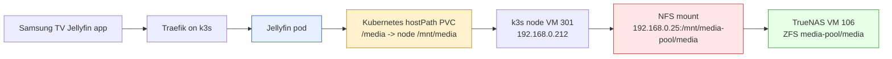

# Postmortem - Jellyfin, TrueNAS, and the Missing NFS Mount

This postmortem explains a Jellyfin outage that looked, at first, like a transcoding problem. The visible symptom was `FFmpeg exited with code 254` while the Samsung TV client tried to play Serial Experiments Lain. The underlying fault was not FFmpeg, Jellyfin's HLS controller, the file codec, or the TV client. The source files were simply not present inside the container because the storage stack below Jellyfin had not come back after a power outage.

> [!summary]
> - TrueNAS VM 106 was stopped after a power outage because it did not have Proxmox `onboot` configured.
> - k3s VM 301 did restart, but its `/mnt/media` NFS mount was manual and not persisted in `/etc/fstab`.
> - Jellyfin's media PVC is a Kubernetes `hostPath` pointed at `/mnt/media`, so the pod saw an empty local directory instead of the TrueNAS dataset.
> - Restarting TrueNAS, remounting NFS, and restarting Jellyfin restored playback. Proxmox startup ordering and a persistent NFS fstab entry were added to prevent recurrence.

## The system that failed

The Jellyfin deployment is small, but it crosses several administrative boundaries. That is what made the failure non-obvious. Jellyfin itself runs in k3s. Its configuration lives in a local-path PVC, its cache is an `emptyDir`, and its media library is mounted at `/media` from a Kubernetes PVC named `jellyfin-media`. That PVC is not a network volume in Kubernetes terms; it is a `hostPath` that points at `/mnt/media` on the k3s node.

The network storage lives one layer lower. TrueNAS SCALE runs as Proxmox VM 106 at `192.168.0.25`. It exports the ZFS dataset `/mnt/media-pool/media` over NFS. The k3s node, VM 301 at `192.168.0.212`, is expected to mount that export at `/mnt/media`. Jellyfin then sees that host directory through Kubernetes.

The architecture can be drawn as a short chain:



This chain has two important properties. First, Jellyfin's database stores paths like `/media/[Kanavid] Serial Experiments Lain .../03 Serial Experiments Lain - #i ...mp4`. Those paths are true only if every mount underneath them is healthy. Second, a Kubernetes `hostPath` does not know whether `/mnt/media` is the intended NFS filesystem or an empty directory on the node root disk. If the path exists, Kubernetes can mount it into the pod.

That distinction matters because the failure was not "the media directory is gone" in any durable sense. The TrueNAS pool still existed. The Jellyfin database still contained the media item. The files still existed on the NAS once it was started. What vanished was the runtime connection between the k3s node and the NAS.

## The symptom: FFmpeg 254 and a repeating HLS failure

The incident began as a Jellyfin stack trace from `DynamicHlsController.GetDynamicSegment`. The relevant request was an HLS segment URL:

```text
GET /videos/c6ed3be1-1912-9193-1dec-983975b7a0e7/hls1/main/9.ts
MediaBrowser.Common.FfmpegException: FFmpeg exited with code 254
```

HLS playback asks the server for a playlist and then for many small `.ts` segment files. If one segment fails, the client may retry, prefetch, or request nearby segments. That is why the log appeared to scroll repeatedly even after playback had stopped on the TV. Jellyfin kept attempting to satisfy segment requests for a stream whose source file could not be opened.

The most useful evidence was not the ASP.NET stack trace. The stack trace told us where the exception surfaced, not why FFmpeg exited. The decisive evidence was in Jellyfin's per-transcode FFmpeg log under `/config/log`:

```text
/usr/lib/jellyfin-ffmpeg/ffmpeg ...
  -i file:"/media/[Kanavid] Serial Experiments Lain 1-13(END) [BD][1080p][AAC][MP4]/03 Serial Experiments Lain - #i [BD][1080p][AAC].mp4" ...

[in#0 @ ...] Error opening input: No such file or directory
Error opening input file file:/media/[Kanavid] Serial Experiments Lain .../03 Serial Experiments Lain - #i ...mp4.
Error opening input files: No such file or directory
```

This is a good example of a general debugging rule: when an orchestrator reports a generic child-process failure, find the child process's own stderr. Jellyfin knew that FFmpeg returned 254. FFmpeg knew that the input file did not exist.

## The first fork: is this a media problem or a mount problem?

A missing input file can mean several different things. The file may have been deleted. The library path may be wrong. Permissions may prevent access. The database may point to an old name. Or the filesystem that should contain the file may not be mounted.

The investigation checked `/media` from inside the running Jellyfin pod:

```text
/media entries:
# no output

Filesystem      Size  Used Avail Use% Mounted on
/dev/sda1        29G   12G   17G  43% /media
```

That output was more revealing than it looks. The Jellyfin media library was supposed to be backed by a 3.6T TrueNAS dataset. Instead, `/media` was on the k3s VM root filesystem, a 29G disk. An empty `/media` on `/dev/sda1` meant the pod was not seeing the NFS-backed host path.

The Kubernetes objects confirmed the path translation:

```yaml
# gitops/kustomize/jellyfin/pvc.yaml
apiVersion: v1
kind: PersistentVolume
metadata:
  name: jellyfin-media
spec:
  storageClassName: manual
  capacity:
    storage: 3.5T
  accessModes:
    - ReadWriteMany
  hostPath:
    path: "/mnt/media"
  persistentVolumeReclaimPolicy: Retain
```

The number `3.5T` in the PV is a declaration to Kubernetes; it does not prove that the host path currently points at a 3.5T filesystem. A `hostPath` is only a way to expose a node path into a pod. The correctness of that node path is external to Kubernetes.

## The second fork: why was `/mnt/media` empty?

The older project documentation filled in the intended storage design. The Obsidian project note `PROJ - Jellyfin Media Server` recorded the original command:

```bash
mount -t nfs 192.168.0.25:/mnt/media-pool/media /mnt/media
```

A node debug pod showed that the k3s node had no active `/mnt/media` mount and no persistent fstab entry for it:

```text
mounts containing /mnt/media:
# no output

/etc/fstab:
LABEL=cloudimg-rootfs / ext4 ...
LABEL=BOOT /boot ext4 ...
LABEL=UEFI /boot/efi vfat ...
```

The local directory existed:

```text
/mnt/media listing:
total 8.0K
drwxr-xr-x 2 root root 4.0K Apr 16 02:23 .
drwxr-xr-x 3 root root 4.0K Apr 16 02:23 ..
```

That explains how the failure could be silent. `/mnt/media` existed, so Kubernetes could mount it. But it was not the NFS mount. It was just an empty directory on the k3s node.

The next check was TrueNAS reachability. From the k3s node and from the operator machine, `192.168.0.25` did not respond to ping or NFS probes. The Proxmox host had the answer:

```bash
ssh root@192.168.0.227 'qm status 106; qm list | grep 106'
```

The result was direct:

```text
status: stopped
106 TrueNAS stopped 16384 32.00 0
```

After the power outage, Proxmox had restarted the k3s VM but not the TrueNAS VM. k3s came back without its storage dependency.

## The root cause

The root cause was an incomplete boot dependency chain.

TrueNAS VM 106 did not have Proxmox autostart enabled. k3s VM 301 did have `onboot=1`, so it restarted after the power outage. Because the NFS mount from TrueNAS to the k3s node was also manual, not persisted in `/etc/fstab` or a systemd mount unit, the k3s node came up with an ordinary empty `/mnt/media` directory. The Jellyfin pod then mounted that directory through its hostPath PVC and served a library whose database paths pointed at files that were not present.

The failure can be summarized as a dependency graph running in the wrong order:

```mermaid
flowchart TD
    power[Power returns]
    proxmox[Proxmox boots]
    truenas[TrueNAS VM 106]
    k3s[k3s VM 301]
    nfs[/mnt/media NFS mount]
    jellyfin[Jellyfin pod]
    playback[Playback request]
    error[FFmpeg: input file not found]

    power --> proxmox
    proxmox -. did not autostart .-> truenas
    proxmox --> k3s
    k3s -. no persistent mount .-> nfs
    k3s --> jellyfin
    jellyfin --> playback --> error

    style truenas fill:#ffe6e6,stroke:#cc3333
    style nfs fill:#ffe6e6,stroke:#cc3333
    style error fill:#ffcccc,stroke:#990000
```

The important lesson is that storage dependencies need to be expressed in the system that boots them. It is not enough that an operator once ran `mount -t nfs ...` by hand. Manual state disappears on reboot. If a container depends on that state, the dependency needs to be encoded in Proxmox startup policy, systemd, Kubernetes, or all three.

## The repair

The immediate repair had four steps.

First, start TrueNAS:

```bash
ssh root@192.168.0.227 'qm start 106 && qm status 106'
```

TrueNAS became reachable after roughly 23 seconds. Its NFS export was visible again:

```text
Export list for 192.168.0.25:
/mnt/media-pool/media 192.168.0.0/24
```

Second, mount the export on the k3s node. The successful mount was performed by SSHing to the node as `ubuntu` and using `sudo`:

```bash
ssh ubuntu@192.168.0.212 \
  'sudo mount -t nfs 192.168.0.25:/mnt/media-pool/media /mnt/media'
```

The restored mount looked like this:

```text
192.168.0.25:/mnt/media-pool/media on /mnt/media type nfs4 (...)
Filesystem                          Size  Used Avail Use% Mounted on
192.168.0.25:/mnt/media-pool/media  3.6T  9.9G  3.6T   1% /mnt/media
```

The directory now contained the expected media, including Serial Experiments Lain:

```text
drwxrwxr-x+ 2 3000 3000 17 Apr 18 01:21 [Kanavid] Serial Experiments Lain 1-13(END) [BD][1080p][AAC][MP4]
```

Third, restart Jellyfin. This step matters because the running pod had already bind-mounted the empty host directory. After the NFS mount was restored on the node, the existing pod still showed `/media` on `/dev/sda1`. Restarting the deployment forced Kubernetes to create a fresh pod with the host path resolved to the now-mounted NFS filesystem:

```bash
KUBECONFIG=/home/manuel/code/wesen/crib-k3s/kubeconfig.yaml \
  kubectl -n jellyfin rollout restart deployment/jellyfin
```

The new pod saw the correct filesystem:

```text
/media now:
Filesystem                          Size  Used Avail Use% Mounted on
192.168.0.25:/mnt/media-pool/media  3.6T  9.9G  3.6T   1% /media
lain-03-present
lain-04-present
```

Fourth, encode the boot dependency so the same failure does not recur after the next outage.

On Proxmox, TrueNAS now starts before k3s:

```bash
ssh root@192.168.0.227 \
  'qm set 106 --onboot 1 --startup order=10,up=120 && \
   qm set 301 --startup order=20,up=30'
```

The resulting configuration includes:

```text
TrueNAS:
name: TrueNAS
onboot: 1
startup: order=10,up=120

k3s:
name: k3s-server
onboot: 1
startup: order=20,up=30
```

On the k3s node, the NFS mount is now persisted in `/etc/fstab`:

```fstab
192.168.0.25:/mnt/media-pool/media /mnt/media nfs4 defaults,_netdev,nofail,x-systemd.automount,x-systemd.requires=network-online.target,x-systemd.after=network-online.target 0 0
```

The `_netdev` option tells systemd this is a network filesystem. `nofail` prevents the node from failing boot if the NAS is temporarily unavailable. `x-systemd.automount` lets systemd establish the mount on demand. The `network-online.target` dependency expresses the ordering that was previously only implicit.

## Why the playlist symptom was not fully explained

The user also reported that playlists appeared empty, even though they had stored Serial Experiments Lain entries there. Restoring `/media` explains why playback failed, but it does not fully explain playlist membership.

The current Jellyfin config showed:

```text
/config/data/playlists
# directory exists, no playlist files under it
```

A local copy of `/config/data/jellyfin.db` showed that the Playlists folder exists, but there were zero playlist child items:

```sql
SELECT Id, Name, Path, Type
FROM BaseItems
WHERE Type LIKE '%Playlist%';
```

The database still contained media items under `/media`, which is why Jellyfin could present and attempt playback for a stale item. But the current config did not contain playlist item records. That leaves several possibilities:

- The playlists were stored in an older Jellyfin config/database state and are not present in the active PVC.
- A scan or migration removed playlist entries when paths were unavailable.
- The UI was showing a playlist container from metadata, but membership had already been deleted.
- Playlist state may exist in a backup, a previous `jellyfin.db`, or another Jellyfin data location, but it is not in the active `/config/data/playlists` directory.

This is why the remediation was deliberately conservative: restore storage first, avoid running a full scan while `/media` is empty, and only then investigate playlist recovery. A full scan against an empty media root can turn a temporary mount problem into persistent library churn.

## What made this incident tricky

The incident crossed three layers that each reported a different version of the truth.

| Layer | What it knew | What it did not know |
|---|---|---|
| Jellyfin | A media item exists at a `/media/...` path in its database. | Whether `/media` is backed by the intended TrueNAS filesystem. |
| Kubernetes | The pod has a hostPath volume mounted at `/media`. | Whether the node path is an NFS mount or an empty local directory. |
| Proxmox | VM 301 was configured to autostart. | That VM 301 depends on VM 106 for its media filesystem. |
| k3s node | `/mnt/media` exists as a directory. | That the directory is useless unless it is mounted from TrueNAS. |

The failure mode is common in small homelab clusters because the architecture grows one successful manual step at a time. A manual mount works, Jellyfin sees the media, and the system is considered done. The missing piece only appears after the first real reboot.

A useful mental model is this: if the service needs it after a reboot, it is configuration, not a command history entry. The command that got the system working once should become a runbook step, a systemd unit, an fstab entry, a Proxmox startup policy, or a Kubernetes manifest.

## Runbook for this failure class

When Jellyfin reports FFmpeg exit 254 for HLS playback, do not start by changing codecs. Start by proving the source file exists inside the pod.

```bash
export KUBECONFIG=/home/manuel/code/wesen/crib-k3s/kubeconfig.yaml
kubectl -n jellyfin exec deploy/jellyfin -- df -h /media
kubectl -n jellyfin exec deploy/jellyfin -- ls -lah /media | head
```

If `/media` is on `/dev/sda1` or appears empty, check the k3s node mount:

```bash
ssh ubuntu@192.168.0.212 'mount | grep " /mnt/media " || true; df -h /mnt/media; ls -lah /mnt/media | head'
```

If the mount is missing, check TrueNAS:

```bash
ssh root@192.168.0.227 'qm status 106; qm config 106 | grep -E "^(name|onboot|startup):"'
showmount -e 192.168.0.25
```

Repair in order:

```bash
ssh root@192.168.0.227 'qm start 106'
# wait until showmount works
ssh ubuntu@192.168.0.212 'sudo mount -t nfs 192.168.0.25:/mnt/media-pool/media /mnt/media'
kubectl -n jellyfin rollout restart deployment/jellyfin
kubectl -n jellyfin exec deploy/jellyfin -- df -h /media
```

If boot persistence is missing, configure it:

```bash
ssh root@192.168.0.227 \
  'qm set 106 --onboot 1 --startup order=10,up=120 && \
   qm set 301 --startup order=20,up=30'
```

And on the k3s node:

```fstab
192.168.0.25:/mnt/media-pool/media /mnt/media nfs4 defaults,_netdev,nofail,x-systemd.automount,x-systemd.requires=network-online.target,x-systemd.after=network-online.target 0 0
```

## Preventive measures

The incident suggests four preventive rules for this cluster.

- Every Proxmox VM that provides a dependency to another VM should have `onboot` and `startup` ordering configured. In this case, storage must start before compute.
- Every manually mounted filesystem used by Kubernetes should be represented in `/etc/fstab` or a systemd mount unit. If it is only in shell history, it is not part of the system.
- Every `hostPath` used as a storage bridge should have a health check that verifies the expected backing filesystem. A directory existing is not enough; `df -h` should show the TrueNAS export.
- Jellyfin media scans should not run while `/media` is empty. First restore the mount, then restart Jellyfin, then scan if needed.

A lightweight smoke test would have caught this immediately after reboot:

```bash
ssh root@192.168.0.227 'qm status 106; qm status 301'
ssh ubuntu@192.168.0.212 'df -h /mnt/media'
KUBECONFIG=/home/manuel/code/wesen/crib-k3s/kubeconfig.yaml \
  kubectl -n jellyfin exec deploy/jellyfin -- df -h /media
```

The expected result is that both `/mnt/media` on the node and `/media` in the pod report `192.168.0.25:/mnt/media-pool/media` and a size around `3.6T`.

## Final state

At the end of the repair, the system was healthy in the ways relevant to playback:

- TrueNAS VM 106 was running.
- TrueNAS VM 106 had `onboot=1` and startup order `10`.
- k3s VM 301 had `onboot=1` and startup order `20`.
- The k3s node had the NFS export mounted at `/mnt/media`.
- The k3s node had a persistent fstab entry for the NFS mount.
- The Jellyfin deployment was restarted.
- The new Jellyfin pod saw `/media` as the TrueNAS NFS filesystem.
- Serial Experiments Lain episode files were present at the paths Jellyfin was trying to play.

The unresolved follow-up is playlist recovery. The playback outage was caused by missing media storage; the empty playlists appear to be absent from the active Jellyfin config database and should be investigated as a data-recovery problem rather than a transcoding problem.

## Related files and notes

- Repo: `/home/manuel/code/wesen/crib-k3s`
- Jellyfin Deployment: `/home/manuel/code/wesen/crib-k3s/gitops/kustomize/jellyfin/deployment.yaml`
- Jellyfin PV/PVC: `/home/manuel/code/wesen/crib-k3s/gitops/kustomize/jellyfin/pvc.yaml`
- Investigation ticket: `/home/manuel/code/wesen/crib-k3s/ttmp/2026/05/03/JELLYFIN-TRANSCODE-PLAYLISTS--investigate-jellyfin-ffmpeg-exit-254-and-empty-playlists/`
- Original project note: `[[PROJ - Jellyfin Media Server]]`
