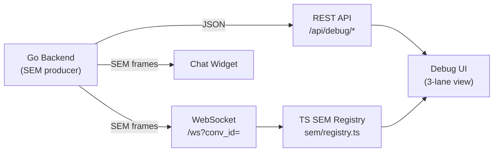
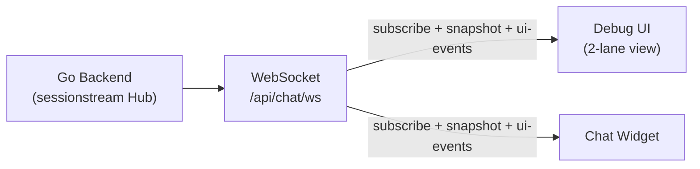
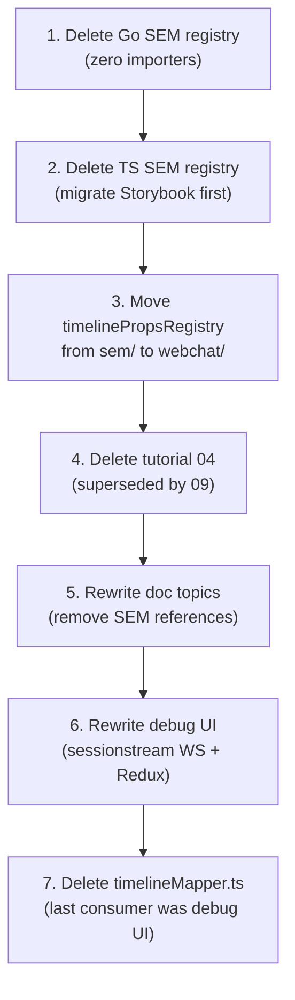

# Removing a Dead Event Pipeline: SEM Frame Cleanup in Pinocchio

This article documents the removal of a defunct event-processing pipeline from a Go + TypeScript application. The pipeline — called SEM (Structured Event Middleware) — was once the backbone of a web chat system's data flow, connecting the backend to both a production chat widget and a debug observation UI. When the system migrated to a new event-streaming library (sessionstream), the SEM code was left in place but never removed. Over time, it accumulated into ~9000 lines of dead Go packages, TypeScript modules, Storybook stories, mock data factories, and documentation that described an architecture that no longer existed.

The cleanup proceeded in five commits across seven phases, from safe Go package deletion to a full debug UI rewrite. The article explains what was found, how each layer was validated before deletion, and the end-to-end testing approach that confirmed the replacement system works with real data.

> [!summary]
> - The SEM pipeline had zero production consumers after a sessionstream migration, but ~9000 lines of code remained across Go, TypeScript, mocks, and documentation.
> - The debug UI was completely broken: it connected to a non-existent WebSocket endpoint and called REST routes that were never registered on the server.
> - The cleanup followed a dependency-order strategy: delete leaf packages first, migrate remaining consumers, then delete the now-unreferenced intermediaries.
> - End-to-end Playwright testing against a live server confirmed that the rewritten debug UI receives both snapshot replays and live streaming events from the production sessionstream WebSocket.

## Why this note exists

Dead code is a tax on every future change. When a system undergoes a major architectural migration — in this case, from a custom event pipeline to a library — the old code does not disappear on its own. It stays in the codebase, is imported by test fixtures and documentation, and creates confusion about which parts of the system are actually active. This article captures the investigation and removal process so that the pattern can be applied to other migration cleanups.

## The system before and after

### Before: SEM frame pipeline

The original architecture used a custom event pipeline called SEM. The backend produced SEM frames — structured envelopes containing event type, payload, and metadata — which were pushed over a WebSocket connection. On the frontend, a TypeScript registry (`sem/registry.ts`) mapped event types to handler functions. The debug UI consumed these frames through a dedicated debug WebSocket (`/ws?conv_id=`) and a set of REST endpoints (`/api/debug/*`) that returned conversation lists, turn details, and timeline snapshots.

The data flow looked like this:



Three data paths fed the debug UI: a WebSocket for real-time frames, REST endpoints for historical data, and a TypeScript registry for routing frame types to UI handlers. The debug UI itself had three visual lanes: raw frames at the top, a projected entity view in the middle, and a timeline of turns at the bottom.

### After: sessionstream

The migration replaced SEM with sessionstream, an external library (`github.com/go-go-golems/sessionstream`) that provides a `Hub`, `UIProjection`, `TimelineProjection`, and `SchemaRegistry`. The production chat widget was rewritten to consume this new data source. The debug UI was not migrated — it remained connected to the old endpoints, which no longer existed on the server.

After the cleanup, the debug UI connects to the same production WebSocket that the chat widget uses:



The debug UI now has two lanes: a UI event track showing named events with sequence numbers, and an entity view showing the current state of all tracked entities (chat messages, reasoning blocks, user messages). There is no separate debug endpoint, no separate data path, and no custom frame registry. The debug UI is a passive observer of the same data stream the chat widget renders.

## Investigation: proving the pipeline was dead

Before deleting anything, the investigation had to establish that each piece of SEM infrastructure had zero or near-zero consumers. This required searching across Go source, TypeScript source, test files, Storybook stories, documentation, and embedded tutorial content.

### Layer 1: Go SEM registry

The Go SEM registry lived in `pkg/sem/registry/registry.go`. It exported two functions: `RegisterByType` and `Handle`. A search for both names across all Go files returned zero results outside the package itself. The package was never imported by any other Go code:

```bash
# Check for Go SEM registry consumers
# Result: zero matches outside pkg/sem/registry/ itself
grep -rn 'RegisterByType|semregistry' --include="*.go" .
```

**Verdict:** Dead. Safe to delete.

### Layer 2: TypeScript SEM registry

The TypeScript registry (`sem/registry.ts`) exported `handleSem`, `registerDefaultSemHandlers`, and related functions. A search for its import path showed a single consumer:

```bash
# Check for TS SEM registry consumers
# Result: one match
# src/webchat/ChatWidget.stories.tsx
grep -rn 'from.*sem/registry' --include="*.ts" --include="*.tsx" src/
```

The only file importing the SEM registry was a Storybook story — a development-only artifact, not production code. The production chat widget (`wsManager.ts`) had already been migrated to sessionstream and contained zero SEM references.

**Verdict:** Dead in production. One Storybook consumer needs migration before deletion.

### Layer 3: Debug UI API layer

The debug UI had two data sources: a WebSocket manager (`debugTimelineWsManager.ts`) and an RTK Query API layer (`debugApi.ts`). The WebSocket manager connected to `/ws?conv_id=`, and the API layer called endpoints under `/api/debug/`. Neither of these routes existed in the server's HTTP mux:

```bash
# Check if debug endpoints exist in the server
# Result: zero matches
grep -rn '/ws|/api/debug' cmd/web-chat/app/server.go
```

The debug UI was loading in the browser (activated via `?debug=1` query parameter) but could never actually fetch data. Every connection attempt failed silently.

**Verdict:** Completely broken. No backend support exists. Safe to rewrite.

### Layer 4: Misplaced utilities

Two files lived under `sem/` but were not SEM-specific: `timelinePropsRegistry.ts` (a public API surface for configuring timeline displays) and `timelineMapper.ts` (a mapping utility used by the debug UI). These needed relocation, not deletion.

**Verdict:** Relocate to `webchat/`, then delete `timelineMapper.ts` after its last consumer (the debug UI) is rewritten.

### Layer 5: Documentation and tutorials

Four documentation topic files and one tutorial contained SEM references:

| File | Issue |
|------|-------|
| `webchat-frontend-integration.md` | Described SEM envelope structure as the integration contract |
| `webchat-frontend-architecture.md` | Documented the SEM frame pipeline as the data flow architecture |
| `13-js-api-reference.md` | Listed SEM registry functions as public API |
| `webchat-debugging-and-ops.md` | Referenced `onSem` debug hook |
| Tutorial 04 (1041 lines) | Complete guide to building SEM-based timeline widgets |

Tutorial 04 was fully superseded by Tutorial 09, which covered the sessionstream-based approach.

**Verdict:** Rewrite doc topics, delete tutorial 04, update cross-reference in tutorial 09.

## Execution: five commits in dependency order

The cleanup followed a strict dependency order. Each commit was validated by the full build pipeline (`make build`, `go test`, `npm run check`) before proceeding.

### Commit 1: Delete Go SEM registry (`ccceef6`)

The safest change first: a Go package with zero importers.

```
- pkg/sem/registry/registry.go (70 lines)
```

No import updates needed. The Go compiler confirmed the deletion was safe by building successfully.

### Commit 2: Delete TS SEM registry, migrate story, relocate utilities (`e981ca2`)

Three changes in one commit:

1. **Deleted** `sem/registry.ts` and `sem/registry.test.ts` (410 lines).
2. **Rewrote** `ChatWidget.stories.tsx` to populate the Redux store directly instead of going through the SEM registry. The story previously called `registerDefaultSemHandlers()` and then dispatched events through `handleSem()`. After the rewrite, it dispatches plain Redux actions to set the same state shape that the production sessionstream consumer produces.
3. **Moved** `sem/timelinePropsRegistry.ts` to `webchat/timelinePropsRegistry.ts` and updated the re-export in `webchat/index.ts`.

One file was kept temporarily: `sem/timelineMapper.ts`. It was imported by the debug UI, which had not yet been rewritten. Its import path was updated to point to the new location of `timelinePropsRegistry.ts`, and it was marked for deletion in a later commit.

### Commit 3: Delete obsolete tutorial (`ab46129`)

Deleted tutorial 04 (1041 lines) and removed its cross-reference from tutorial 09. The tutorial was embedded in the Go binary via `go:embed`, so the deletion was picked up automatically on the next build — no manifest or registry needed updating.

### Commit 4: Rewrite doc topics (`7f52c12`)

Four documentation files were rewritten. Three received full rewrites (`webchat-frontend-integration.md`, `webchat-frontend-architecture.md`, `13-js-api-reference.md`) because they were so deeply SEM-centric that patching individual references would have produced an inconsistent narrative. The fourth (`webchat-debugging-and-ops.md`) received a small fix to remove a stale `onSem` reference.

Like the tutorials, the doc topics are embedded in the Go binary. The rewrites took effect immediately on rebuild.

### Commit 5: Migrate debug UI to sessionstream (`2992681`)

This was the largest change: 89 files changed, 327 insertions, 8638 deletions.

The rewrite replaced three subsystems:

**1. API layer → Redux slice**

The old store used RTK Query (`debugApi.ts`) with auto-generated hooks like `useGetConversationsQuery()` and `useGetTurnsQuery()`. These called REST endpoints that did not exist. The new store uses a plain Redux slice (`debugSlice.ts`) populated by the WebSocket manager:

```typescript
// debugSlice.ts — simplified state shape
interface DebugState {
  sessionId: string | null;
  entities: Record<string, unknown>;
  events: Array<{ seq: number; name: string; payload: unknown }>;
  entityCount: number;
  eventCount: number;
}
```

Routes that previously used `useGetXxxQuery()` hooks now use `useAppSelector()` to read from this slice.

**2. WebSocket manager → sessionstream client**

The old WebSocket manager (`debugTimelineWsManager.ts`) connected to `/ws?conv_id=` and parsed SEM envelopes. The new client (`debugWsManager.ts`) connects to the production endpoint `/api/chat/ws` and speaks the sessionstream subscribe protocol:

```
connect to ws://host/api/chat/ws
send: { "type": "subscribe", "sessionId": "<uuid>" }
receive: { "type": "snapshot", "entities": { "<id>": { ... } } }
receive: { "type": "ui-event", "name": "ChatMessageAppended", "payload": {...}, "seq": 123 }
```

The client dispatches received data into the Redux slice. The initial `snapshot` message populates the entity map. Subsequent `ui-event` messages are appended to the event list and used to update the entity map in place.

**3. UI components → 2-lane layout**

The old debug UI had three lanes (raw frames, projection, timeline) and a conversation list for selecting which session to observe. The new UI has two lanes (UI events, entities) and a session ID text input:

```
┌──────────────────────────────────────────┐
│ 🔍 Debug UI     [Overview|Timeline|Events]│
│ Session ID: [____________] [Follow]       │
│ live: connected                           │
├──────────────────────────────────────────┤
│  ⚡ UI Events        │  🎯 Entities      │
│  ┌─────────────┐     │  ┌─────────────┐  │
│  │ ChatMsgApp  │#1585│  │ ChatMessage │  │
│  │ ChatMsgFin  │#1585│  │ chat-msg-1  │  │
│  │ ChatReaFin  │#1584│  │             │  │
│  │ ChatMsgApp  │#1583│  │ ChatMessage │  │
│  │ ...         │     │  │ chat-msg-1- │  │
│  │             │     │  │ user        │  │
│  └─────────────┘     │  └─────────────┘  │
└──────────────────────────────────────────┘
```

Twenty-three component files were deleted because they referenced old SEM types, mock data factories, or debug API hooks. The remaining components (AppShell, TimelineLanes, EventTrackLane, ProjectionLane) were rewritten to read from the new Redux slice.

**4. Deleted directories**

- `debug-ui/api/` — `debugApi.ts`, `turnParsing.ts`, and their tests
- `debug-ui/mocks/` — MSW handlers, factories, fixtures, and scenarios for the old debug API
- `debug-ui/ui/format/` — `phase.ts`, `time.ts`, `text.ts` for formatting old SEM types
- `debug-ui/ui/presentation/` — `blocks.ts`, `events.ts`, `timeline.ts` for rendering old SEM structures
- `sem/timelineMapper.ts` — last consumer was the deleted debug UI

## Verification: end-to-end testing with Playwright

After all code changes were committed, the debug UI was tested against a live server. The test confirmed that the rewritten UI can connect to a real session, receive an initial entity snapshot, and stream live events as the chat generates responses.

### Test setup

Two servers ran in tmux sessions:

- **Go backend** on port 8080: `go run ./cmd/web-chat web-chat --addr :8080 --timeline-db /tmp/pinocchio-debug-test/timeline.db`
- **Vite dev server** on port 5178: `npx vite --port 5173 --host` (Vite picked 5178 because 5173–5177 were occupied)

### Test sequence

The test used two browser tabs: one for the production chat UI, one for the debug UI.

1. **Opened debug UI** at `http://localhost:5178/?debug=1`. The page rendered correctly: three navigation links (Overview, Timeline, Events), a session ID text input, and a Follow button. Status showed "live: idle".

2. **Created a real chat session** in a second tab at `http://localhost:8080/`. Sent the message "Hello, this is a test message". The server created session `3e867542-47ab-43c3-8b7e-eccb645b80b4` and the chat widget received a full response from the LLM.

3. **Connected debug UI** to the real session by entering the session ID and clicking Follow. The status changed to "live: connected" and the Overview page showed:
   - **3 entities**: ChatMessage (assistant response), ChatMessage (user message), ChatMessage:thinking (reasoning trace)
   - Each entity card displayed its full content, messageId, and related fields

4. **Sent a second message** from the chat tab. The debug UI received 795 live events in real-time:
   - `ChatMessageAccepted` (#792)
   - `ChatMessageStarted` (#793)
   - `ChatReasoningStarted` (#794)
   - ~480 `ChatReasoningAppended` events (#795–#1277)
   - `ChatReasoningFinished` (#1278)
   - ~305 `ChatMessageAppended` events (#1279–#1585)
   - `ChatMessageFinished` (#1585)
   - `ChatAgentModePreviewCleared` (#1585)

5. **Verified all three pages**: Overview showed the 2-lane view with summary statistics. Timeline showed the same 2-lane view with entity and event counts. Events showed the full event list with named events and sequence numbers.

### What the test proved

The test confirmed three things that type-checking alone could not:

1. **The WebSocket subscribe protocol works end-to-end.** The debug UI sends a subscribe message, the server responds with a snapshot, and subsequent events are delivered in real-time.

2. **Entity snapshots are correctly parsed and rendered.** The three entities from the first conversation appeared with their full content — not just IDs or truncated previews.

3. **Live streaming works without data loss.** All 795 events from a second message were received in order, from `ChatMessageAccepted` through `ChatAgentModePreviewCleared`.

## The dependency-order deletion pattern

The cleanup followed a specific ordering constraint that is worth stating explicitly: delete leaf nodes first, then work toward the root. If the debug UI had been deleted before `timelineMapper.ts`, the mapper's import would have broken. If the Go registry had been deleted before confirming it had zero importers, the Go build would have caught it — but only if the build was actually run.

The order was:



Steps 1–5 could have been reordered. Step 6 had to come after step 2 (which migrated the Storybook story that was the only other consumer of SEM registry utilities). Step 7 had to come after step 6, because the debug UI was the last file importing `timelineMapper.ts`.

## Common failure modes in pipeline migration cleanups

### Mistaking "code that references X" for "code that works with X"

The debug UI's `debugTimelineWsManager.ts` imported SEM types and processed `{ sem: true }` envelopes. From a grep perspective, it looked like an active SEM consumer. In reality, the WebSocket endpoint it connected to (`/ws?conv_id=`) was never registered on the server. The code referenced SEM, but it was already dead — it just had not been deleted yet.

The fix is to trace the full connection path, not just the import graph. A file that imports a type is not necessarily a consumer of a working system.

### Keeping intermediaries too long

`timelineMapper.ts` was imported by the debug UI. When `timelinePropsRegistry.ts` was moved in commit 2, the mapper's import path had to be updated. The mapper itself could not be deleted until commit 5, when the debug UI rewrite removed its last consumer. This created a temporary state where the mapper existed only to bridge the old debug UI to the relocated registry. The alternative — rewriting the debug UI first — would have been riskier because the rewrite touched 89 files. Keeping the mapper for two commits was the safer trade-off.

### Documentation that describes a dead architecture

Four doc topic files and one tutorial described the SEM pipeline as if it were the current architecture. Anyone reading them would build against APIs that no longer exist. The danger here is not just confusion — it is that new code written against the documented (but dead) API would itself become dead code on arrival.

Full rewrites of documentation are often better than patching individual references. The old docs were so deeply SEM-centric that patching would have produced a hybrid narrative — half SEM, half sessionstream — that would have been more confusing than either pure version.

## Working rules

- **Delete in dependency order.** Leaf packages first, then intermediaries, then the root. Run the full build pipeline after each deletion.
- **Trace the full connection path, not just imports.** A file that imports a type is not evidence that the system works. The WebSocket endpoint must exist, the REST route must be registered, and the handler must produce data.
- **Verify with real data, not just type-checking.** TypeScript type-checking confirms that imports resolve and types align. It does not confirm that the WebSocket subscribe protocol works, that snapshot entities are correctly parsed, or that live events arrive in order.
- **Full doc rewrites beat patching when the architecture changed.** If the old docs describe a fundamentally different system, rewriting them is faster and produces a more coherent result than updating references one by one.
- **Storybook stories are production-adjacent code.** They are the first place to look for dead consumers, and they must be migrated before their dependencies can be deleted.

## Related notes

- Ticket: `ttmp/2026/05/03/SEM-CLEANUP--remove-dead-sem-frame-pipeline-and-update-documentation/`
- Design doc: `ttmp/.../design/01-sem-cleanup-architecture-analysis-and-implementation-guide.md`
- Implementation diary: `ttmp/.../reference/01-investigation-diary.md`

