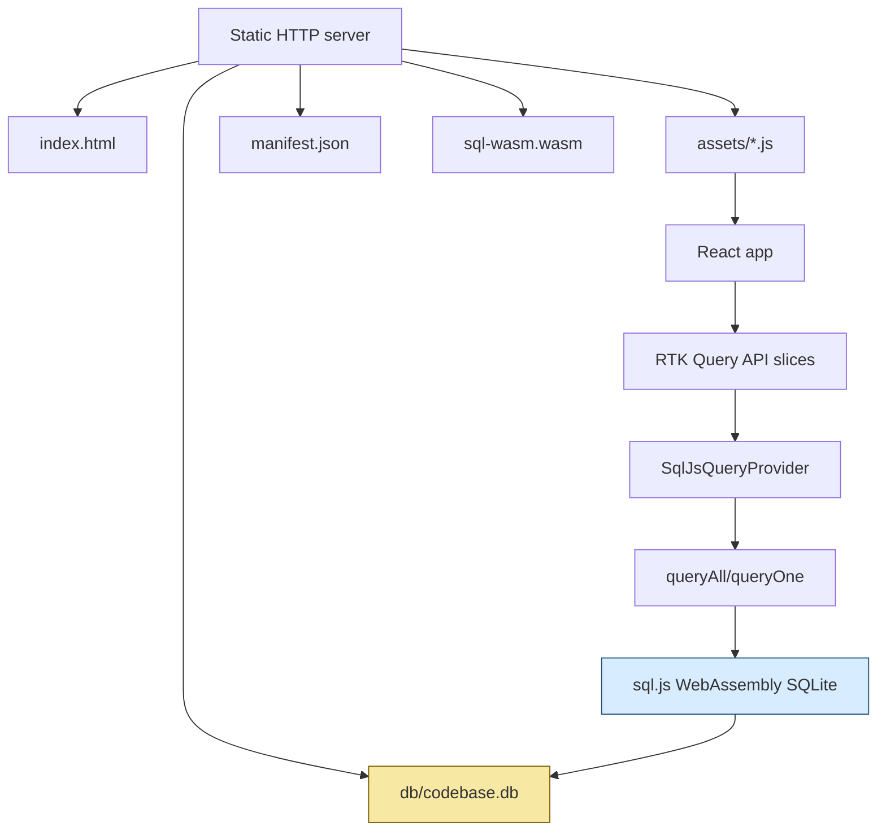
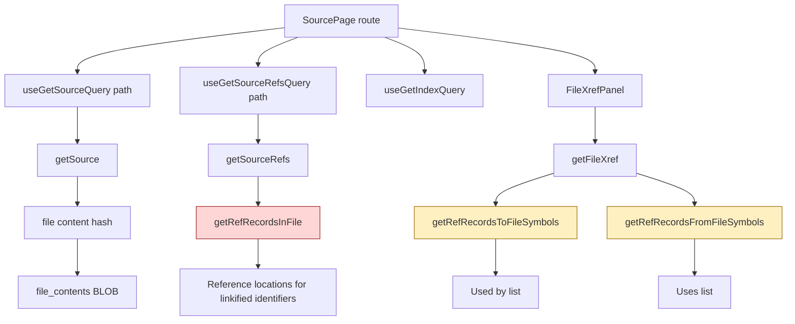
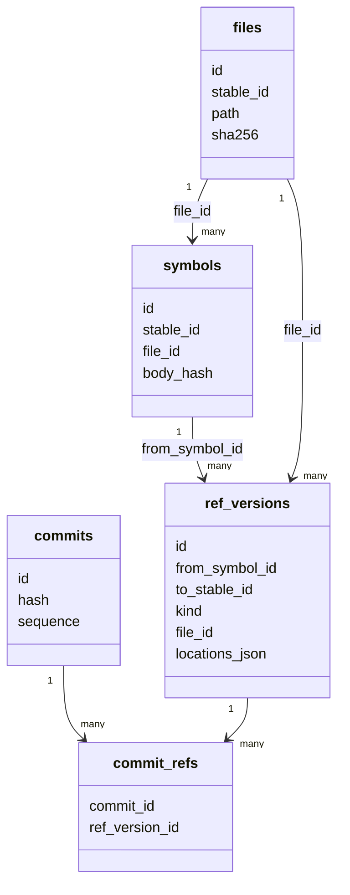
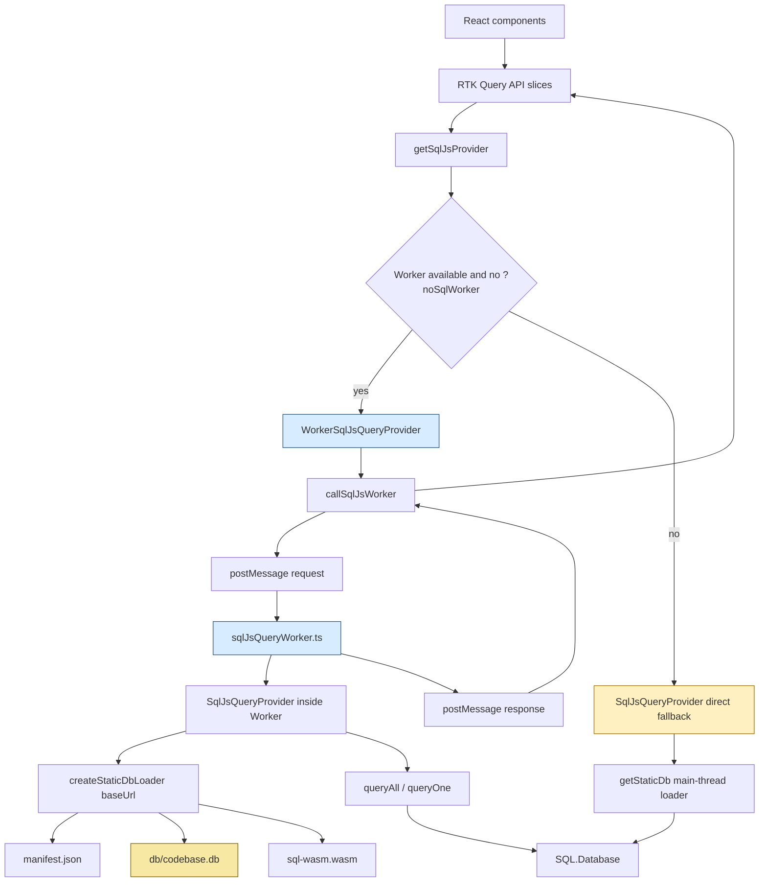

# SQLite in the Browser: Measuring and Fixing sql.js Performance in Static Code Review Sites

A static code review site is an attractive artifact. It can be copied, hosted from any static server, opened by a reviewer without a backend, and preserved as a durable snapshot of a repository at a moment in time. The trick is that interactivity still has to come from somewhere. In `codebase-browser`, that somewhere is SQLite running in the browser through `sql.js`, a WebAssembly build of SQLite.

> [!summary]
> - Browser-side SQLite works well when queries are shaped for the browser runtime, not just for theoretical SQL elegance.
> - A compatibility view named `snapshot_refs` made one source-page query take about 60 seconds in native SQLite and freeze the browser through sql.js.
> - Rewriting hot queries against normalized base tables reduced the source-reference lookup to tens of milliseconds in the browser.
> - A Web Worker is now the resilience layer around sql.js: it moves SQLite stepping off the main thread while preserving the existing provider contract and `?noSqlWorker` fallback.

This article is a technical deep dive into a concrete incident. A full static export of the Glazed repository exposed a source-page freeze in `codebase-browser`. The freeze was diagnosed with browser profiling, native SQLite query plans, sql.js timing logs, and Playwright. The resulting fix is a useful general lesson: when SQLite moves into the browser, query shape becomes user-interface behavior.

## Why this note exists

The triggering incident happened while testing a full static export of Glazed:

```text
Repo: /home/manuel/code/wesen/corporate-headquarters/glazed
Static export before fix: http://127.0.0.1:4183/
Static export after fix:  http://127.0.0.1:4184/
Problem route: /source/pkg/help/publish/sqlite_validator.go
```

Clicking the source file made the browser CPU jump to 100%. The page did not simply take a little longer than expected; it felt wedged. The source file was not huge. The exported SQLite database was large, but not absurdly large. The failure lived in the gap between these two facts: the UI asked for a small answer, but the SQL query forced SQLite to examine and expand a very large reference space before returning it.

The goal of this note is not only to record that bug. The goal is to preserve the mental model for future work:

- Browser-side SQLite is a database runtime embedded inside the UI process.
- Static exports trade server complexity for client-side CPU and memory responsibility.
- Views are abstraction boundaries, but they are not free performance boundaries.
- A query plan is part of frontend architecture when the database runs in the browser.

## The static browser mental model

A `codebase-browser` static export contains a React application and a SQLite database. At runtime there is no Go server. A static HTTP server is enough:

```bash
cd /tmp/glazed-full-export-gcb021
python3 -m http.server 4184
```

The browser loads the application, fetches the database, initializes sql.js, and answers route-level questions locally.



This architecture is powerful because it produces a portable artifact. It also means the browser tab becomes the database server. If a query takes 30 seconds, the user does not experience that as a remote backend being slow. The user experiences it as a frozen page, because the current sql.js execution path runs on the main thread.

The core synchronous loop is small:

```ts
while (stmt.step()) {
  rows.push(stmt.getAsObject() as T);
}
```

That loop lives in `ui/src/api/sqljs/sqlRows.ts`. It is easy to miss because the provider methods around it are `async`, but after the database promise resolves, SQLite stepping is synchronous. The browser cannot repaint or handle input until the loop returns.

## The source page data path

The route `/source/pkg/help/publish/sqlite_validator.go` uses several queries. The conceptual path is:



The raw source bytes were cheap to load. The expensive work was reference lookup. The source view wants to turn identifier tokens into links, so it asks for all reference locations in the file. The xref panel below the source asks which external symbols call into this file and which external symbols this file uses.

That is a reasonable UI feature. The question is how to ask SQLite for the data.

## The database shape: normalized tables and compatibility views

The history database is normalized. Instead of storing every file, symbol, and reference row once per commit, it stores unique versions and maps commits to them.

Reference-related tables look like this:

```text
commits
  id
  hash
  sequence
  ...

symbols
  id
  stable_id
  file_id
  body_hash
  ...

files
  id
  stable_id
  path
  sha256
  ...

ref_versions
  id
  from_symbol_id
  to_stable_id
  kind
  file_id
  locations_json

commit_refs
  commit_id
  ref_version_id
```

A `ref_versions` row says: from this source symbol, to this target stable symbol ID, with this kind, in this file, at these locations. The locations are stored as JSON because multiple call sites can share the same logical edge.



The schema also exposes compatibility views named `snapshot_packages`, `snapshot_files`, `snapshot_symbols`, and `snapshot_refs`. These views reconstruct a snapshot-shaped interface over the normalized tables. They are useful because many frontend queries can ask simple questions without knowing the normalized storage details.

The problem was `snapshot_refs`:

```sql
CREATE VIEW snapshot_refs AS
SELECT
    c.hash AS commit_hash,
    row_number() OVER (PARTITION BY c.id ORDER BY rv.id, j.key) AS id,
    s.stable_id AS from_symbol_id,
    rv.to_stable_id AS to_symbol_id,
    rv.kind,
    f.stable_id AS file_id,
    json_extract(j.value, '$.start_line') AS start_line,
    json_extract(j.value, '$.start_offset') AS start_offset,
    json_extract(j.value, '$.end_offset') AS end_offset
FROM commit_refs cr
JOIN commits c ON c.id = cr.commit_id
JOIN ref_versions rv ON rv.id = cr.ref_version_id
JOIN symbols s ON s.id = rv.from_symbol_id
JOIN files f ON f.id = rv.file_id,
    json_each(rv.locations_json) AS j;
```

The view expands `locations_json` into one row per reference location. That is exactly the shape the UI eventually needs. It is not necessarily the shape the UI should query directly on a large database.

## The scale that made the bug visible

The full Glazed export was large enough to turn a bad query shape into a visible freeze:

```text
DB size: 198.92 MB
commits: 1577
packages: 199
files_unique: 2783
file_contents: 2776
symbols_unique: 8659
refs_unique: 127927
commit_files_rows: 172776
commit_symbols_rows: 1733053
commit_refs_rows: 6074525
```

The biggest database objects were reference-related:

```text
commit_refs                      68.98 MB
sqlite_autoindex_ref_versions_1  38.27 MB
ref_versions                     30.02 MB
file_contents                    19.84 MB
commit_symbols                   19.37 MB
idx_ref_to                        9.57 MB
```

This tells us where future performance risk lives. Source text and file metadata are not the large part. Cross-reference data is the large part.

## How the freeze was measured

The first signal came from a browser profiler. The hot stack was:

```text
getRefRecordsInFile
  queryAll(...)
    p.prototype.step
      sql-wasm-browser.wasm
```

That stack matters because it crosses three conceptual boundaries:

- `getRefRecordsInFile` is the codebase-browser provider method.
- `queryAll` is the shared sql.js stepping helper.
- `sql-wasm-browser.wasm` is SQLite running in WebAssembly.

The profiler told us the browser was busy doing database work. It did not yet tell us whether sql.js was inherently too slow or whether the query was bad.

Native SQLite answered that question. The old query shape was:

```sql
SELECT COUNT(*)
FROM snapshot_refs
WHERE commit_hash=(SELECT hash FROM commits ORDER BY sequence DESC LIMIT 1)
  AND file_id='file:pkg/help/publish/sqlite_validator.go';
```

It returned only 82 rows, but it took about a minute:

```text
82
Run Time: real 60.285 user 45.081491 sys 5.700637
```

The query plan showed broad view expansion:

```text
CO-ROUTINE snapshot_refs
  SCAN cr
  SEARCH rv USING INTEGER PRIMARY KEY
  SEARCH s USING INTEGER PRIMARY KEY
  SEARCH c USING INTEGER PRIMARY KEY
  SEARCH f USING INTEGER PRIMARY KEY
  SCAN json_each(...)
  USE TEMP B-TREE FOR ORDER BY
SCAN snapshot_refs
USE TEMP B-TREE FOR ORDER BY
```

The key observation is that the outer query looked selective, but the view body forced expensive work before the file-level answer emerged.

## The better query shape

The normalized query asks a more operationally precise question:

1. Which commit are we looking at?
2. Which file are we looking at?
3. Which reference versions are mapped into that commit and file?
4. Only for those reference versions, what are the JSON locations?

```sql
WITH latest AS (
  SELECT id FROM commits ORDER BY sequence DESC LIMIT 1
),
file AS (
  SELECT id FROM files WHERE stable_id='file:pkg/help/publish/sqlite_validator.go'
)
SELECT COUNT(*)
FROM commit_refs cr
JOIN latest ON latest.id=cr.commit_id
JOIN ref_versions rv ON rv.id=cr.ref_version_id
JOIN file ON file.id=rv.file_id,
     json_each(rv.locations_json) j;
```

This returned the same count in about 9 ms:

```text
82
Run Time: real 0.009 user 0.008321 sys 0.000374
```

The difference is not subtle. It is the difference between expanding a large conceptual snapshot and walking a constrained part of a normalized graph.

The general rule is:

> Constrain by stable entity identity and commit membership before expanding JSON or windowed compatibility views.

## The implemented fix

The fix had two parts.

First, `queryAll` gained measurement instrumentation. Opening a page with `?debugSql` now prints query start and done records. Slow queries over 1000 ms log even without explicit debug mode.

Second, hot reference helpers in `ui/src/api/sqlJsQueryProvider.ts` stopped using `snapshot_refs`. They now query normalized base tables directly.

The critical source-reference query is now shaped like this:

```sql
SELECT s.stable_id AS fromSymbolId,
       rv.to_stable_id AS toSymbolId,
       rv.kind,
       f.stable_id AS fileId,
       json_extract(j.value, '$.start_line') AS startLine,
       json_extract(j.value, '$.start_col') AS startCol,
       json_extract(j.value, '$.end_line') AS endLine,
       json_extract(j.value, '$.end_col') AS endCol,
       json_extract(j.value, '$.start_offset') AS startOffset,
       json_extract(j.value, '$.end_offset') AS endOffset
FROM commits c
JOIN commit_refs cr
  ON cr.commit_id = c.id
JOIN ref_versions rv
  ON rv.id = cr.ref_version_id
JOIN symbols s
  ON s.id = rv.from_symbol_id
JOIN files f
  ON f.id = rv.file_id
JOIN json_each(rv.locations_json) j
WHERE c.hash = ?
  AND f.stable_id = ?
ORDER BY startOffset, endOffset;
```

The aliases still match the `RefRecordSQL` TypeScript shape, so the UI does not know this changed. That is the right kind of refactor: preserve the API contract and improve the implementation beneath it.

Other helpers were rewritten for:

- refs in a symbol body range,
- refs to symbols declared in a file,
- refs from symbols declared in a file,
- symbol-level used-by and uses queries.

Tests were added for the cases most likely to break semantically:

- source refs return offsets in the file,
- snippet refs are clipped to a symbol body range,
- file xrefs exclude intra-file references.

The file-xref test caught a real bug in an early rewrite. That was important. SQL performance work often fails by returning quickly but returning the wrong rows.

## Browser measurements after the fix

The fixed export was served at:

```text
http://127.0.0.1:4184/
```

Playwright loaded:

```text
http://127.0.0.1:4184/?debugSql&v=gcb021-run2#/source/pkg/help/publish/sqlite_validator.go
```

The page reached source and xref readiness in about 2.25 seconds:

```json
{
  "elapsedMs": 2252,
  "hasSource": true,
  "usedBy": "6",
  "uses": "25"
}
```

The browser console showed the key query timings:

```text
source refs query: 82 rows in 19 ms
file used-by query: 6 rows in 2 ms
file uses query: 70 raw rows in 42 ms
```

A separate Long Task observer run showed:

```json
{
  "elapsedMs": 1163,
  "body": [
    "pkg/help/publish/sqlite_validator.go",
    "Used by (6)",
    "Uses (25)"
  ],
  "maxLongTaskMs": 170
}
```

The old export at port 4183 remained a negative control. Playwright timed out waiting for the same source+xref readiness. That is exactly what we want from a validation story: the old artifact still demonstrates the failure; the new artifact demonstrates the fix.

## Working rules for SQLite in the browser

The incident suggests a set of practical rules.

- Prefer normalized base-table queries for hot paths. Compatibility views are fine for convenience and exploration, but they should not be trusted automatically on source/xref routes.
- Measure query plans in native SQLite before blaming WebAssembly. If native SQLite takes 60 seconds, sql.js is not the root problem.
- Measure in the browser after native fixes. A 10 ms native query may still cost more in sql.js, but the ratio is usually manageable if the query shape is good.
- Keep query result sets small. Structured clone, React rendering, and syntax-highlighting overlays all become costs after SQLite returns.
- Preserve UI API shapes while changing SQL internals. Components should consume `SourceRefView` and `FileXrefResponse`, not know which tables produced them.
- Add semantic tests for query rewrites. Performance tests prove speed; fixture tests prove meaning.
- Treat the main thread as a scarce resource. Even fast queries should be measured because they run inside the UI process today.

## The Web Worker implementation

The query rewrite made the Glazed source page fast, but it did not remove the underlying main-thread risk. The important distinction is between query latency and UI responsiveness. A bad SQL query still has to be fixed at the SQL level, because a Web Worker does not change the query plan. A Worker changes where synchronous SQLite stepping happens. If `stmt.step()` runs in a Worker, the main thread can continue to paint, handle input, display loading states, and let React process unrelated UI work while the query runs.

GCB-022 implemented that Worker layer. The implementation keeps the existing frontend API shape and inserts a provider boundary between React and sql.js. React components and RTK Query endpoints still ask for source text, references, xrefs, commits, review documents, and diffs. They no longer need to know whether the answer is produced by a direct `SqlJsQueryProvider` on the main thread or by a `WorkerSqlJsQueryProvider` proxy that sends the call to a Worker.

The implemented architecture is:



The provider contract lives in `ui/src/api/queryProvider.ts`. It is deliberately broad enough to cover the existing static-browser feature set:

```ts
export interface CodebaseQueryProvider {
  getIndex(): Promise<IndexSummary>;
  getPackageLites(): Promise<PackageLite[]>;
  getSymbol(id: string): Promise<Symbol>;
  searchSymbols(query: string, kind?: string): Promise<Symbol[]>;

  getSource(path: string, commitRef?: string): Promise<string>;
  getSnippet(symbolId: string, kind?: string, commitRef?: string): Promise<string>;
  getSnippetRefs(symbolId: string, commitRef?: string): Promise<SnippetRefView[]>;
  getSourceRefs(path: string, commitRef?: string): Promise<SourceRefView[]>;
  getFileXref(path: string, commitRef?: string): Promise<FileXrefResponse>;
  getXref(symbolId: string, commitRef?: string): Promise<XrefResponse>;

  listCommits(): Promise<CommitRow[]>;
  resolveCommitRef(ref: string): Promise<string>;
  getCommit(ref: string): Promise<CommitRow>;
  getSymbolHistory(symbolId: string): Promise<SymbolHistoryEntry[]>;
  getSymbolBodyDiff(from: string, to: string, symbolId: string): Promise<BodyDiffResult>;
  getCommitDiff(from: string, to: string): Promise<CommitDiff>;
  getImpact(options: ImpactQueryOptions): Promise<ImpactResponse>;

  listReviewDocs(): Promise<ReviewDocMeta[]>;
  getReviewDoc(slug: string): Promise<DocPage>;
}
```

This interface is the main design seam. `SqlJsQueryProvider` implements it directly. `WorkerSqlJsQueryProvider` implements the same interface by forwarding every method through Worker RPC. The API slices import `getSqlJsProvider()` from `ui/src/api/sqlJsProviderRegistry.ts`, so component code remains insulated from the execution mode.

The provider registry is intentionally small:

```ts
function shouldUseSqlWorker(): boolean {
  if (typeof window === 'undefined') return false;
  if (typeof Worker === 'undefined') return false;
  const params = new URLSearchParams(window.location.search);
  return !params.has('noSqlWorker');
}

export function getSqlJsProvider(): CodebaseQueryProvider {
  if (!provider) {
    provider = shouldUseSqlWorker() ? new WorkerSqlJsQueryProvider() : new SqlJsQueryProvider();
  }
  return provider;
}
```

The `?noSqlWorker` parameter is not a compatibility promise for old exports. It is a diagnostic switch. It lets us compare direct main-thread sql.js behavior against Worker-backed behavior on the same static export, and it provides a fallback if a browser or bundler environment does not support module Workers.

## The Worker RPC protocol

The Worker protocol is a request-response protocol over `postMessage`. Each request gets a numeric ID, a provider method name, a positional argument list, the static-site base URL, and a debug flag. Each response echoes the request ID and is either a successful result with timing metadata or a serialized provider error.

```ts
export interface SqlJsWorkerRequest {
  id: number;
  method: string;
  args: unknown[];
  baseUrl?: string;
  debugSql?: boolean;
}

export type SqlJsWorkerResponse =
  | { id: number; ok: true; result: unknown; timing: SqlJsWorkerTiming }
  | { id: number; ok: false; error: SerializedProviderError };
```

The main-thread client in `ui/src/api/sqljs/workerClient.ts` maintains three pieces of state:

- `worker`, the lazily created module Worker.
- `nextID`, the monotonically increasing request identifier.
- `pending`, a map from request ID to promise resolvers.

The core call path is:

```ts
export function callSqlJsWorker<T>(method: string, args: unknown[]): Promise<T> {
  const id = nextID++;
  const request: SqlJsWorkerRequest = {
    id,
    method,
    args,
    baseUrl: workerBaseUrl(),
    debugSql: debugSqlEnabled(),
  };
  return new Promise<T>((resolve, reject) => {
    pending.set(id, { resolve: resolve as (value: unknown) => void, reject });
    getWorker().postMessage(request);
  });
}
```

The response handler looks up the pending promise by ID. If the response is successful, it resolves the promise and optionally logs `[sql.js-worker:done]` when `?debugSql` is enabled. If the response is an error, it reconstructs a `QueryError` when the serialized error contains a query error code. This preserves the existing frontend error contract: widgets and pages still receive useful `message`, `code`, and `details` fields instead of a generic Worker failure.

The Worker entrypoint in `ui/src/api/sqljs/sqlJsQueryWorker.ts` performs the inverse operation. It receives a request, creates or reuses a provider for the request's `baseUrl`, looks up the named method on the provider, calls it, measures elapsed time, and posts a response.

```ts
self.onmessage = async (event: MessageEvent<SqlJsWorkerRequest>) => {
  const { id, method, args, baseUrl = self.location.href, debugSql = false } = event.data;
  const started = performance.now();

  try {
    const queryProvider = getProvider(baseUrl);
    const fn = queryProvider[method as keyof CodebaseQueryProvider];
    if (typeof fn !== 'function') {
      throw new Error(`unknown sql.js provider method: ${method}`);
    }

    if (debugSql) {
      console.warn('[sql.js-worker:start]', { method, args });
    }
    const result = await (fn as (...methodArgs: unknown[]) => Promise<unknown>).apply(queryProvider, args);
    self.postMessage({ id, ok: true, result, timing: { method, elapsedMs: performance.now() - started } });
  } catch (error) {
    self.postMessage({ id, ok: false, error: serializeProviderError(error) });
  }
};
```

This protocol deliberately avoids sharing a `SQL.Database` object with the main thread. The database object is not transferred. Requests and responses contain serializable data: strings, arrays, objects, numbers, and structured error records.

## Worker-owned database loading

The Worker must load the same static assets that the main thread used to load: `manifest.json`, `db/codebase.db`, and `sql-wasm.wasm`. The subtle part is URL resolution. The Worker script is emitted as a hashed asset such as `assets/sqlJsQueryWorker-*.js`. Relative paths inside that Worker would naturally resolve relative to the Worker asset, not necessarily relative to the static export root. The implementation therefore sends `document.baseURI` as `baseUrl` with every request.

`ui/src/api/sqljs/sqlJsDb.ts` now exposes `createStaticDbLoader(options)`:

```ts
export function createStaticDbLoader(options: StaticDbLoaderOptions = {}): () => Promise<Database> {
  let localSqlJsPromise: Promise<SqlJsStatic> | null = null;
  let localManifestPromise: Promise<StaticManifest> | null = null;
  let localDbPromise: Promise<Database> | null = null;
  const { baseUrl } = options;

  return async () => {
    if (!localDbPromise) {
      localDbPromise = (async () => {
        localSqlJsPromise ??= initSqlJs({
          locateFile: (file) =>
            file === 'sql-wasm.wasm'
              ? resolveStaticAsset('sql-wasm.wasm', baseUrl)
              : resolveStaticAsset(file, baseUrl),
        });
        localManifestPromise ??= fetch(resolveStaticAsset('manifest.json', baseUrl)).then(...);
        const [SQL, manifest] = await Promise.all([localSqlJsPromise, localManifestPromise]);
        const dbPath = manifest.db?.path ?? 'db/codebase.db';
        const response = await fetch(resolveStaticAsset(dbPath, baseUrl));
        const bytes = new Uint8Array(await response.arrayBuffer());
        return new SQL.Database(bytes);
      })();
    }
    return localDbPromise;
  };
}
```

The old `getStaticDb()` path still exists for direct mode and tests. Worker mode creates a local loader inside the Worker:

```ts
provider = new SqlJsQueryProvider(createStaticDbLoader({ baseUrl }));
```

This matters for memory. In Worker mode, the main thread should not create its own `SQL.Database`; the Worker should be the only owner of the loaded SQLite database. The main thread owns request orchestration and rendering state, not SQLite memory.

## Worker validation after implementation

The Worker-backed build was validated against the full Glazed static export. The export used the same large database shape that originally exposed the source-page freeze:

```text
Export: /tmp/glazed-full-export-gcb022
Server: http://127.0.0.1:4185/
Database size in manifest: 208592896 bytes
Commits: 1577
```

The Worker-enabled route was:

```text
http://127.0.0.1:4185/?debugSql&v=gcb022#/source/pkg/help/publish/sqlite_validator.go
```

The console showed Worker-level timing records:

```text
[sql.js-worker:start] getIndex
[sql.js-worker:start] listReviewDocs
[sql.js-worker:start] getSource
[sql.js-worker:start] getSourceRefs
[sql.js-worker:done] listReviewDocs 828ms
[sql.js-worker:done] getIndex 885ms
[sql.js-worker:done] getSource 904ms
[sql.js-worker:done] getSourceRefs 904ms
[sql.js-worker:start] getFileXref
[sql.js-worker:done] getFileXref 42ms
```

The first four calls include Worker startup and initial database loading. They should not be read as pure SQL timings. Once the Worker has loaded the database, subsequent provider calls are much cheaper, as shown by `getFileXref` completing in 42 ms.

A Playwright long-task observer run reached source and xref readiness in under one second and reported no main-thread long tasks:

```json
{
  "elapsedMs": 968,
  "longTasks": [],
  "maxLongTaskMs": 0,
  "textOk": true
}
```

The direct fallback was validated with:

```text
http://127.0.0.1:4185/?debugSql&noSqlWorker&v=gcb022-direct#/source/pkg/help/publish/sqlite_validator.go
```

It reached the same source page successfully:

```json
{
  "elapsedMs": 916,
  "textOk": true
}
```

These measurements should be interpreted carefully. The optimized SQL made the route fast in both modes. The Worker validation proves that the Worker path works, that the static assets resolve correctly from the Worker, that the large database can be loaded inside the Worker, and that the main thread remains free of observed long tasks on this route. A separate deliberate slow-query harness is still useful because the fixed Glazed route no longer contains a slow query.

## What the Worker implementation changes and what it does not change

The Worker implementation changes the execution boundary for sql.js. Synchronous SQLite stepping no longer has to occur on the main thread when Worker mode is available. It also introduces a clean provider seam that will make future data-access changes easier to test.

It does not change the database schema. It does not make `snapshot_refs` safe for hot reference queries. It does not remove the need to inspect query plans. It does not automatically cancel long-running SQLite calls. If a Worker query wedges, the first robust cancellation strategy is to terminate and recreate the Worker, reject pending promises, and let the UI recover. True SQLite interruption can be considered later, but it is not required for the first reliable version.

The key technical rules after GCB-022 are:

- Hot SQL must still constrain by commit and entity identity before expanding JSON or compatibility views.
- Worker mode should be the default in browser environments that support module Workers.
- `?noSqlWorker` should remain available for debugging and performance comparison.
- Worker responses must preserve `QueryError` details because widget and page error rendering depend on actionable diagnostics.
- The Worker should own the `SQL.Database` instance in Worker mode; loading the same 199 MB database in both main thread and Worker should be avoided.
- Browser validation should include both route readiness and main-thread long-task observation.

## Implemented phased plan and remaining work

The Worker migration followed the phased plan closely. The completed work is important because it defines the stable base for the next performance work.

### Phase 1: Preserve the provider contract — done

- `CodebaseQueryProvider` now describes the public query-provider methods.
- `SqlJsQueryProvider` implements the interface directly.
- `sqlJsProviderRegistry.ts` chooses the provider implementation.
- Existing tests still instantiate `SqlJsQueryProvider` directly where direct SQL behavior is under test.

### Phase 2: Add the Worker RPC skeleton — done

- `sqlJsQueryWorker.ts` is the Worker entrypoint.
- `workerClient.ts` manages request IDs, pending promises, responses, timing logs, and Worker-level errors.
- `WorkerSqlJsQueryProvider` is the main-thread provider proxy.
- The implementation forwards the full provider surface, not just the initial source-page subset.

### Phase 3: Move database ownership into the Worker — done

- `createStaticDbLoader({ baseUrl })` lets the Worker resolve static assets correctly.
- Worker mode loads `manifest.json`, `db/codebase.db`, and `sql-wasm.wasm` inside the Worker.
- `?noSqlWorker` keeps the direct path available for debugging and comparison.

### Phase 4: Implement the full provider surface — done

- Source, snippet, xref, history, impact, index, and review-doc methods are forwarded.
- RTK Query API slices continue to depend on `getSqlJsProvider()` rather than on a concrete provider class.
- `QueryError` serialization preserves codes, messages, details, names, and stacks where available.

### Phase 5: Instrument and validate — mostly done

- Worker method timings are logged as `[sql.js-worker:start]` and `[sql.js-worker:done]` when `?debugSql` is enabled.
- Internal SQL timings still flow through `queryAll` and `queryOne` instrumentation.
- The full Glazed source route was validated with Worker mode and direct fallback mode.
- The remaining validation gap is an intentional slow-query harness. The fixed Glazed route is now fast, so it does not prove how the UI behaves while a Worker query is genuinely slow.

### Phase 6: Polish resilience — still open

- Add explicit Worker reset and terminate behavior for wedged queries.
- Reject all pending requests when resetting the Worker.
- Add request timeout policy at the Worker-client layer.
- Consider request-level cancellation later. The first dependable recovery mechanism can be Worker termination and recreation rather than true SQLite interruption.

## Follow-up work worth building

The next tasks are not all equal. Some harden the Worker implementation; others improve perceived performance or prevent future query regressions.

### 1. Add a deliberate slow-query responsiveness harness

The current Worker route is fast because the SQL was fixed first. We still need a test that intentionally runs a slow query inside the Worker and proves that the main thread remains interactive. A useful harness would expose a debug-only provider method or test-only route that runs a bounded expensive query, then use Playwright to verify that a button click, animation frame counter, or input field still responds while the Worker is busy.

The test should answer one question: if a future query takes several seconds, does the UI remain usable while it waits?

### 2. Add Worker reset and timeout behavior

`workerClient.ts` already rejects pending promises on Worker error and has a test reset hook. Production code should get an explicit recovery path:

```ts
function resetSqlJsWorker(reason: string): void {
  worker?.terminate();
  worker = null;
  for (const request of pending.values()) {
    request.reject(new Error(reason));
  }
  pending.clear();
}
```

Then individual requests can have a timeout policy. If a request exceeds the timeout, terminate the Worker, reject all pending requests, and let subsequent queries recreate a fresh Worker. This is coarse-grained, but it is reliable and simple.

### 3. Cache repeated commit and HEAD-resolution queries

The GCB-021 console logs showed repeated `listCommits()` and `resolveCommitRef('HEAD')` calls. They were not the freeze root cause, but they add unnecessary work. Provider-level caching can reduce startup query volume:

- cache `listCommits()` after first load,
- cache `resolveCommitRef('HEAD')`,
- optionally cache `getCommit('HEAD')`,
- invalidate only when the static DB changes, which effectively means page reload or provider reset.

This is low-risk because static exports are immutable during a browser session.

### 4. Add query-plan regression checks for hot paths

The source-page freeze came from accidentally using a compatibility view on a hot route. A regression test can check that hot query strings do not include `snapshot_refs`, or a native SQLite smoke can run `EXPLAIN QUERY PLAN` against representative queries and fail when the plan contains broad `SCAN snapshot_refs` behavior.

The goal is not to make every query-plan detail stable. The goal is to prevent reintroducing the specific failure class: broad snapshot-reference expansion before commit/file constraints.

### 5. Promote the browser performance smoke into a repo command

The GCB-021 CDP smoke script is useful enough to become a standard command or Make target. A future target could accept a static export URL and a source path, then report:

- route readiness time,
- presence of source text,
- used-by and uses counts,
- Worker timing logs,
- maximum main-thread long task duration,
- whether `?noSqlWorker` fallback still works.

This would make large-export validation repeatable instead of ad hoc.

### 6. Add visible loading and recovery states for Worker queries

Moving sql.js into a Worker gives the UI the opportunity to remain responsive. The UI should make that visible. Long-running source/xref queries should show precise loading states, and Worker reset errors should include an action such as retrying the query. The frontend already has improved widget error rendering; the same principle should apply to Worker-level query failures.

### 7. Consider progressive result delivery later

The current RPC protocol returns one complete result per request. That is enough for source pages and review docs today. For larger future features, the Worker could stream chunks: first metadata, then partial rows, then completion. This should not be built until there is a route that needs it, because it complicates request state and React integration.

## Closing thought

SQLite in the browser is a real database architecture with a different deployment boundary. The browser process performs database loading, query execution, result materialization, and rendering coordination. The query planner is part of frontend performance, and a view that works for a small export can become a UI freeze at full repository scale.

The durable lesson is to measure the path the user actually takes. In this case, that path began with a click on a source file and ended inside `stmt.step()` in WebAssembly. Once we could see that path, the fix became straightforward: ask SQLite the question in the shape the data was built to answer, then move query execution into a Worker so a future slow query does not monopolize the main thread.

## Related notes

- [[ARTICLE - Squeezing a SQLite Database From 32 MB to 1.4 MB - How We Found and Fixed 99 Pct Redundancy in Codebase-Browser]]
  