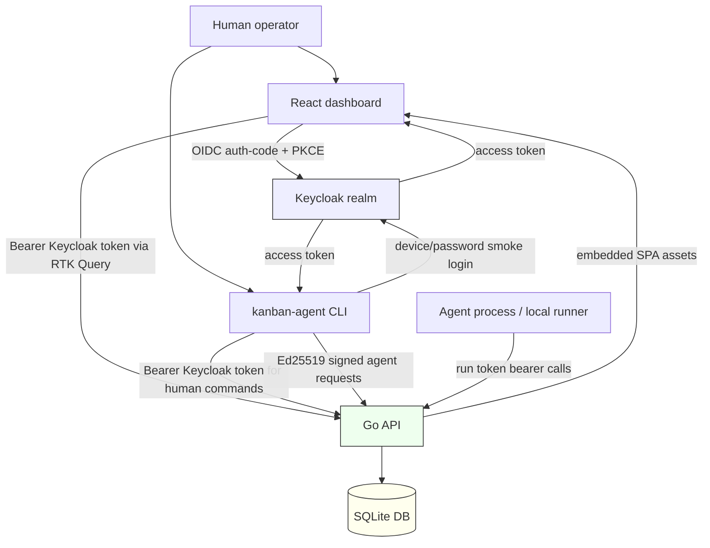
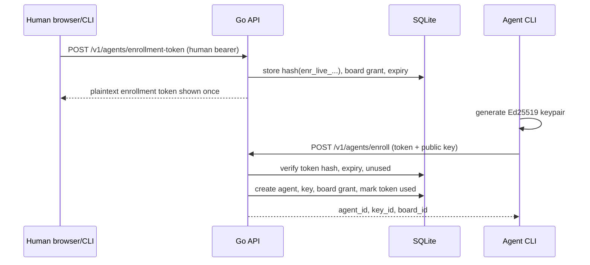

# Agent Enroll - Full Stack Kanban Agent System Technical Report

This report describes the final state of the Agent Enroll project: a Go-based Kanban agent credential system with a browser dashboard, a Glazed CLI, Keycloak-backed human authentication, Ed25519-backed agent authentication, task-scoped run tokens, usage and audit visibility, and a full local smoke-test path that crosses both the browser and agent execution planes.

The project began as a focused MVP for safely enrolling automation agents into a Kanban system. It ended as a private-alpha grade full-stack system. The backend can create organizations, boards, tasks, agents, runs, comments, usage records, and audit events. The CLI can authenticate as a human, enroll agents, claim tasks, drive runs, refresh run tokens, heartbeat, comment, update status, and complete or fail work. The React dashboard can log a human in through Keycloak, create and inspect Kanban state, manage enrollment tokens and agents, observe run state, inspect usage and audit history, and run as either a Vite development app or an embedded single-binary Go-served SPA.

> [!summary]
> Agent Enroll preserves three separate authority planes: Keycloak human tokens manage the system, Ed25519 agent keys claim work, and opaque short-lived run tokens mutate only one claimed task/run.
>
> The final system includes a Go API, SQLite persistence, local Keycloak realm, Glazed CLI with embedded help, React/Vite/RTK Query dashboard, MSW/Storybook component system, Go-served SPA packaging, CORS, CI, audit query, usage/quota tracking, heartbeat/last-seen tracking, run-token refresh, local runner, task detail/comments/status UX, and full browser-plus-agent smoke validation.
>
> The most important implementation rule is that Keycloak authenticates humans only. Agents are application-native records, not Keycloak users, and run tokens are issued and checked by the Go API.

## Why this project exists

Coding agents need controlled participation in a task system. A human operator should be able to create work, decide which agent is allowed to work on which board, observe progress, and revoke access. An agent should not receive a broad human token. It should not be able to manage organizations, change billing state, create other agents, or mutate unrelated tasks. It should be able to prove that it is an enrolled agent, claim one eligible task, and then perform task-scoped updates for that run.

That requirement defines the whole architecture. The system needs human authentication, but human identity is not enough. It also needs agent authentication, task claiming, run lifecycle state, token revocation, replay protection, usage accounting, auditability, and a UI that shows humans what is happening without weakening the backend rules.

The design therefore separates credentials by purpose:

| Credential | Issued by | Verified by | Stored where | Main authority |
|---|---|---|---|---|
| Keycloak access token | Keycloak realm | Go API JWKS verifier | Browser/CLI session state | Human org, board, task, agent-management, usage, audit operations subject to local membership/role checks. |
| Agent Ed25519 keypair | CLI/agent enrollment flow | Go API signature verifier | Public key in SQLite, private key in CLI config | Signed agent operations, especially `claim-next` and run-token refresh. |
| Enrollment token | Go API | Go API hash lookup | Hash in SQLite, plaintext shown once | One-time headless agent enrollment. |
| Run token | Go API | Go API hash lookup | Hash in SQLite, plaintext returned to agent/run only | Task/run-scoped mutation while the run is active and token is valid. |

The system remains understandable because these authorities are not interchangeable. A human token can create an enrollment token but cannot impersonate an agent signature. An agent key can claim work but does not become a human identity. A run token can update one task but cannot claim another task or manage agents.

## Current final status

The project is complete as a local/private-alpha MVP. It has been implemented, documented, tested, and smoke-tested end to end.

The final smoke test used live local services and exercised the complete product loop:

- Keycloak at `http://localhost:8081`.
- Go API at `http://localhost:8080`.
- Vite dashboard at `http://localhost:5173`.
- Browser OIDC login as `dev@example.com`.
- Dashboard creation of org, board, task, and enrollment token.
- CLI enrollment of an app-native agent.
- Signed agent claim of the browser-created task.
- Run-token heartbeat, status update, agent comment, signed token refresh, and completion.
- Dashboard verification of task detail, agent/run state, usage, audit events, and logout.
- Browser console checks after every major step.

Non-secret smoke evidence:

```text
org:   org_JiuEbjyu4m9UryiZK5G7eg
board: brd__S-FFyZYEn05ea9ULq2jug
task:  tsk_voxvOlqo2jEaS1wznGWCdA
agent: agt_uRUGj9sX-QeAsIGmdZtbCg
run:   run_OaDDqPfdBgyMIRh55WfJjg
```

Usage after one claim:

```text
plan=free
period=2026-05
used=1
limit=50
remaining=49
```

Audit contained 11 events, including:

```text
org.created
board.created
task.created
agent.enrollment_token.created
agent.created
run.claim_next
task.status.updated
task.comment.created
run.token_refreshed
run.completed
```

## Implementation timeline

The git history shows how the system grew from a security design into a full product surface:

```text
884219c Docs: design agent enrollment MVP
af47bee Phase 1: add API and CLI skeleton
80b6c42 Phase 3: add human Kanban endpoints
3bf5e06 Phase 7: add agent enrollment and claim flow
e545432 Test agent enrollment and claim flow
ebd0321 Phase 2: add Keycloak auth and compose stack
7d340e6 Fix Keycloak basic scope for sub claim
c52c535 Harden agent revocation and smoke tests
dd9313f Add private alpha hardening
b7e3c30 Docs: add threat model guide
81f606e Docs: add project README
5a1dbb4 Docs: plan Glazed CLI migration
7ab3d49 CLI: add Glazed root and embedded help
5b685fe CLI: migrate remaining commands to Glazed
208626a Docs: record Keycloak Glazed CLI smoke test
d894892 Audit: add audit log query API and CLI
fb229b6 Usage: record agent claim events
ec14afd Usage: add free tier quota enforcement
7d86149 Runs: add heartbeat tracking
dc35ca5 Runs: add signed run token refresh
2f93f16 CLI: add local agent runner
0da4d75 CLI: refresh runner token file
dadb330 Tasks: add task detail and comments CLI
54e7a34 Tasks: validate and command task status
bb56bac API: add agents and runs list endpoints
4d9447d Docs: add React dashboard implementation guide
7aa4a00 Web: scaffold retro React dashboard
92a3faf Web: add dashboard pages and widget stories
439abd2 Web: add dashboard mutation forms
c317211 Web: add org switcher and revoke confirmation
c7fa962 Web: add secret and filter widgets
f0be7ed Web: add session shell states
f4a5d11 Web: add enrollment token flow
5952f9d Web: improve agent management states
fd6bd57 Web: improve audit and usage UX
b706a9e Web: improve task comment UX
385f785 Web: add Storybook interaction checks
e16153f Web: add route smoke tests
cfc14cb Web: align API parity and CORS
1dfb6a2 CI: add dashboard validation
cb1dc84 Web: embed dashboard in API
f7d8fc6 Web: add browser OIDC session plumbing
1c3e9ee Web: finish browser OIDC smoke fixes
bfa77ac Docs: add frontend smoke postmortem
7491159 Diary: record full system smoke test
```

The order matters. The backend security primitive came first. The CLI became structured and self-documenting next. Runtime features such as audit, usage, heartbeat, token refresh, and the runner filled the private-alpha gaps. The dashboard then moved from Storybook/MSW design system to real API, CORS, embedding, OIDC, live browser smoke, and finally full browser-plus-agent smoke.

## System architecture

At a high level, Agent Enroll has four execution surfaces:

1. The Go API server.
2. The `kanban-agent` CLI.
3. The browser dashboard.
4. Local Keycloak for human identity.

The Go API is the domain authority. It validates Keycloak tokens, verifies agent signatures, mints and checks run tokens, writes SQLite rows, enforces local roles, records usage and audit, and serves the embedded dashboard.



The project deliberately does not use Keycloak for agents. Keycloak remains the human identity provider. The Go API implements all agent and run authorization because those rules are domain-specific and depend on task, board, run, grant, nonce, token hash, expiry, and revocation state.

## Repository layout

The repository is organized by execution surface and domain package:

```text
cmd/api/main.go
  API process startup, flags, auth-mode selection, CORS config, rate-limit toggle, SPA registration.

cmd/kanban-agent/main.go
  Glazed/Cobra CLI root and command registration.

cmd/kanban-agent/cli/support.go
  CLI config file, HTTP helpers, bearer auth, token refresh, signed API request construction.

cmd/kanban-agent/commands/
  Glazed command implementations for auth, orgs, boards, tasks, agents, enrollment, claim, run, usage, audit, runner.

cmd/kanban-agent/commands/doc/
  Embedded Glazed help pages: getting started, reference, developer guide.

internal/auth/
  Development auth, Keycloak JWT/JWKS validation, OIDC device flow, password-grant smoke helper, refresh-token helper.

internal/core/
  Human-managed domain operations: orgs, boards, tasks, comments, task status.

internal/agent/
  Agent records, keys, grants, enrollment tokens, signed request verification, revocation, list API.

internal/runs/
  Claim-next transaction, run records, run-token creation/authentication/refresh, heartbeat, run-token mutations.

internal/audit/
  Append-only audit inserts and query support.

internal/usage/
  Usage ledger, free-plan subscription rows, quota checks, usage summary.

internal/storage/
  SQLite open, schema creation, WAL PRAGMAs, idempotent column helpers, backup.

internal/http/
  API route wiring, handler methods, CORS, rate limiting, integration tests.

internal/web/
  Vite asset generation, embedded filesystem, disk fallback, SPA deep-link fallback.

web/dashboard/
  React/Vite dashboard with RTK Query, MSW, Tailwind CSS, Storybook, Vitest tests.

dev/keycloak/
  Docker Compose local Keycloak realm, test users, client settings.

ttmp/2026/05/03/
  Ticket workspaces, diaries, design docs, postmortems, smoke playbooks, sources.
```

The separation is not only organizational. Each package owns a boundary. `internal/auth` validates human identity but does not decide whether a human may revoke an agent. `internal/agent` manages agent records and signed requests but does not store human tokens. `internal/runs` owns run-token binding and task-scoped mutations. `web/dashboard` displays state but does not bypass the API or manually fetch Kanban domain endpoints.

## The data model

The SQLite schema is the system's authority map. The important tables are not only boards and tasks; they are the tables that bind credentials to allowed operations.

| Table | Purpose |
|---|---|
| `users` | Local user records derived from Keycloak `sub` or development tokens. |
| `orgs` | Organization boundary for membership, boards, agents, usage, and audit. |
| `memberships` | Local org roles such as owner/admin/member. |
| `boards` | Work containers inside orgs. |
| `tasks` | Work items with status, body, board, org, and optional claimed run. |
| `agents` | Application-native automation identities. |
| `agent_keys` | Ed25519 public keys, active/revoked state, key ids. |
| `agent_board_grants` | Per-board agent permissions: claim, comment, update status. |
| `enrollment_tokens` | Hashes of one-time headless enrollment tokens plus expiry/use state. |
| `agent_nonces` | Replay protection for signed agent requests. |
| `runs` | Run lifecycle rows bound to task, agent, org, board, status, heartbeat. |
| `run_tokens` | Hashes of opaque run tokens, expiry, revocation, scopes, task/run binding. |
| `comments` | Human or agent/run comments on tasks. |
| `audit_log` | Security and domain event history. |
| `usage_events` | Ledger rows for billable or quota-relevant usage. |
| `subscriptions` | Local plan/quota state for an org. |

SQLite is configured for server use with WAL:

```sql
PRAGMA journal_mode = WAL;
PRAGMA synchronous = NORMAL;
PRAGMA foreign_keys = ON;
PRAGMA busy_timeout = 5000;
```

WAL mode matters because a dashboard plus CLI plus API can create concurrent reads and writes. The project still keeps SQLite simple, but it avoids the unsafe backup pattern of copying only the main `kanban.db` file while WAL is active. The safe path is `VACUUM INTO`, exposed in `Store.Backup(ctx, path)` and documented in smoke playbooks.

## Human authentication

Human users authenticate through Keycloak in real mode or through development tokens in local fast mode.

In Keycloak mode, the API receives:

```http
Authorization: Bearer <keycloak_access_token>
```

The API validates:

- JWT signature through the realm JWKS endpoint.
- Issuer.
- Expiry.
- Audience or authorized party for `kanban-agent-cli`.
- Presence of a stable `sub` claim.

The Keycloak `sub` issue was an important implementation lesson. The initial realm import omitted the `basic` client scope. In Keycloak 25, the access-token `sub` claim is emitted through the `Subject (sub)` mapper on the `basic` scope. The project briefly considered a fallback based on email/username, then removed it after research showed the correct fix: include `basic` in `defaultClientScopes`.

The relevant realm setting is:

```json
"defaultClientScopes": ["web-origins", "acr", "basic", "profile", "email"]
```

The API treats Keycloak identity as authentication only. Local authorization still depends on `memberships` and role checks. For example, an authenticated human may be a member of one org and not another. Agent management requires `owner` or `admin` role.

## Agent enrollment

Agents can be created in two ways.

Interactive enrollment is human-authenticated. The CLI generates an Ed25519 keypair locally, sends the public key to the API with org and board information, and stores the private key in local CLI config.

Headless enrollment uses a one-time enrollment token. A human creates the token for a specific org/board/name. The server stores only a hash of the token. The agent presents the plaintext token once with its generated public key. The server burns the token and creates the agent/key/grant rows.



The private key remains outside the server. The server stores the public key and checks future signed requests against `agent_keys` and `agents` state. If an agent or key is revoked, future signature verification fails because the verifier joins only active agents and active keys.

## Signed agent requests

Signed agent requests use Ed25519 and a canonical string that includes the method, path, body hash, timestamp, and nonce.

Headers:

```http
X-Agent-Id: agt_...
X-Key-Id: key_...
X-Timestamp: 2026-05-04T01:00:00Z
X-Nonce: nonce_...
X-Signature: base64_ed25519_signature
```

Canonical string:

```text
METHOD
PATH
SHA256(body)
TIMESTAMP
NONCE
```

Verification pseudocode:

```text
verifySignedRequest(request):
    read exact request body bytes
    require agent id, key id, timestamp, nonce, signature headers
    parse timestamp and require freshness window
    load active agent + active key by agent id and key id
    insert nonce for this agent/key
        if insert violates uniqueness: reject replay
    canonical = method + path + sha256(body) + timestamp + nonce
    verify Ed25519 signature over canonical
    return agent principal and original body bytes
```

The exact body bytes matter. The handler reads the body once, verifies the signature over those bytes, and then unmarshals the same bytes. If the client signs one JSON encoding and sends another, verification fails.

Signed requests are used for:

- `POST /v1/runs/claim-next`
- `POST /v1/runs/{run_id}/token`

The first creates a run and run token. The second lets an active agent recover/refresh a run token for its own still-running run.

## Atomic task claiming

Claiming a task is the most important write transaction. It must be atomic because multiple agents may ask for work at the same time.

The service performs the claim under a transaction. The essential guard is that the task update succeeds only if the task is still claimable.

Pseudocode:

```text
claimNext(agent, boardID):
    tx = begin

    verify agent has can_claim grant for boardID
    verify org quota permits another claim

    task = select first task
           where board_id = boardID
             and status = 'todo'
             and claimed_by_run_id is null
           order by created_at
           limit 1

    if no task:
        rollback and return no_work

    run = insert runs(status='running', task_id=task.id, agent_id=agent.id)

    updated = update tasks
              set status='claimed', claimed_by_run_id=run.id
              where id=task.id
                and status='todo'
                and claimed_by_run_id is null

    if updated != 1:
        rollback and report claim conflict

    runToken = random opaque token with rt_live_ prefix
    insert run_tokens(hash(runToken), run_id, task_id, expiry, scopes)
    insert usage_events(kind='agent_task_claimed')
    insert audit_log(action='run.claim_next')

    commit
    return task, run, plaintext runToken
```

Tests cover the concurrent claim invariant. Two agents may race for the same single task; only one claim should succeed.

## Run tokens

A run token is an opaque plaintext value returned once to the agent. It is stored in SQLite only as a hash.

The run token is not an agent credential. It does not prove possession of the agent private key. It proves that the caller has the token minted for one active run and task. Every run-token mutation compares the token-bound IDs to route/request IDs before writing.

Run-token endpoints:

```text
POST  /v1/tasks/{task_id}/comments
PATCH /v1/tasks/{task_id}/status
POST  /v1/runs/{run_id}/heartbeat
POST  /v1/runs/{run_id}/complete
POST  /v1/runs/{run_id}/fail
```

Authentication pseudocode:

```text
authenticateRunToken(token):
    tokenHash = hash(token)
    row = select run_token + run + task + agent data by tokenHash
    require token not expired
    require token not revoked
    require run.status == 'running'
    require task.claimed_by_run_id == run.id
    return principal(org_id, board_id, task_id, run_id, agent_id, scopes)

updateTaskStatus(routeTaskID, token, status):
    principal = authenticateRunToken(token)
    require principal.task_id == routeTaskID
    require status is valid
    update task status
    insert audit_log(task.status.updated)
```

This model keeps authority narrow. If a run token leaks, the attacker can only operate within the token's remaining lifetime, only for one task/run, and only until revocation/completion/expiry invalidates the token.

## Run-token refresh

Run-token refresh uses signed agent authentication, not the old run token. This was a deliberate design decision. A long-running agent may lose or expire its run token but still hold the agent private key. If the agent signs a request for `POST /v1/runs/{run_id}/token`, the server can verify that:

- the signing agent is active;
- the run belongs to that agent;
- the run is still running;
- the task is still claimed by that run;
- the board grant still permits claim/work;
- the signature timestamp and nonce are valid.

The server then mints a new `rt_live_...` token and stores only its hash. Older unexpired tokens remain valid until expiry or revocation in the current policy.

## Heartbeat and last-seen tracking

Heartbeat is a run-token operation. It updates both run and agent liveness:

```text
POST /v1/runs/{run_id}/heartbeat
Authorization: Bearer rt_live_...
```

The service updates:

- `runs.last_heartbeat_at`
- `agents.last_seen_at`

The dashboard displays heartbeat information in run tables and task detail. The full smoke test verified heartbeat by completing a run with a visible heartbeat timestamp on the task detail page.

## Local runner

The local runner command connects the CLI to actual agent execution:

```bash
kanban-agent run --board brd_... -- ./child-command args...
```

The runner performs the sequence an automation wrapper normally needs:

```text
1. Select local enrolled agent for the board.
2. Signed claim-next.
3. Write task JSON to a temp file.
4. Write current run token to a 0600 token file.
5. Start child process with KANBAN_* environment variables.
6. Heartbeat while child runs.
7. Refresh run token while child runs.
8. Update token file when refreshed.
9. Complete run on child exit code 0.
10. Fail run on nonzero exit.
11. Remove temp files unless --keep-temp is set.
```

The token-file behavior is important. Environment variables cannot be mutated inside an already-running child process, but a long-running child can reread `KANBAN_RUN_TOKEN_FILE` to observe refreshed tokens. The runner keeps `KANBAN_RUN_TOKEN` as the initial token for compatibility and uses the token file for current token state.

## Usage ledger and quota

The usage system records successful claims, not arbitrary task mutations. A claim is the billable/quota-relevant event because it represents an agent starting work on a task.

The ledger table is append-only. The quota check happens inside the claim transaction. This is important because the project uses SQLite with `db.SetMaxOpenConns(1)`. Querying outside the active transaction while a transaction is open can deadlock/block. The quota logic therefore has a transaction-aware function:

```go
usage.EnsureCanClaim(ctx, tx, orgID, nowTime)
```

New orgs receive a free plan with 50 included runs. If the org exhausts quota, `claim-next` returns `402 Payment Required` with `quota_exceeded`. The dashboard usage page shows the current period, plan, used count, limit, and remaining count.

In the final smoke test, one successful claim produced:

```text
plan=free
period=2026-05
used=1
limit=50
remaining=49
```

## Audit logging

Audit logging records security-sensitive and domain-important actions. It is not a debugging log. It is a durable event table for later inspection.

Events include:

```text
org.created
board.created
task.created
agent.created
agent.enrollment_token.created
agent.revoked
run.claim_next
task.comment.created
task.status.updated
run.token_refreshed
run.completed
run.failed
```

The API exposes:

```text
GET /v1/audit-log?org_id=...&action=...&actor_type=...&resource_type=...&before=...&after=...&limit=...
```

The CLI exposes:

```bash
kanban-agent audit list --org org_... --action run.claim_next --output json
```

The dashboard Audit page provides filters and a table. The full smoke test confirmed that audit shows both human and agent events in one org-scoped history.

## Glazed CLI

The CLI started as manual `os.Args` and `flag.FlagSet` parsing. It was migrated to Glazed and Cobra so commands have structured output, consistent field definitions, embedded help, and a maintainable command tree.

The root command initializes:

- Cobra command tree.
- Glazed logging section.
- Glazed output settings.
- Embedded help system.
- Help pages for getting started, reference, and developer guide.

The CLI command tree includes:

```text
kanban-agent status
kanban-agent login
kanban-agent logout
kanban-agent org create/list
kanban-agent board create/list
kanban-agent task create/list/show/comments/status
kanban-agent agent create-token/revoke
kanban-agent enroll
kanban-agent claim
kanban-agent run --board ... -- child...
kanban-agent run token/comment/status/heartbeat/complete/fail
kanban-agent audit list
kanban-agent usage
kanban-agent complete            # compatibility wrapper
```

Secret-returning commands intentionally emit secrets because automation needs them. The documentation and diary avoid recording actual enrollment or run tokens. The CLI can output JSON for scripts, but the operator must treat `enrollment_token` and `run_token` fields as secrets.

## Browser dashboard

The dashboard lives under `web/dashboard` and uses:

- React.
- Vite.
- React Router.
- Redux Toolkit / RTK Query.
- MSW for mock API flows.
- Tailwind CSS v4.
- Storybook.
- Vitest and Testing Library.

The dashboard was built component-first:

```text
Atoms
  RetroButton, RetroInput, RetroSelect, RetroBadge, RetroCheckbox, RetroIconButton, PixelDivider

Molecules
  WindowTitleBar, SessionStatus, OrgSwitcher, ConfirmDialog, ModalWindow, AuditFilterBar,
  SecretRevealBox, CommandCopyBox, QuotaMeter

Organisms
  RetroWindow, KanbanBoard, KanbanColumn, TaskCard, BoardsTable, AgentsTable,
  RunsTable, AuditLogTable, UsageSummaryPanel, TaskDetailPanel, CommentsPanel,
  NewOrgForm, NewBoardForm, NewTaskForm, EnrollmentTokenForm, CommentForm

Pages
  BoardsPage, BoardDetailPage, TaskDetailPage, AgentsPage, UsagePage, AuditPage, AuthCallbackPage

Layout
  AppShell
```

The component system follows the retro Mac OS visual direction from the UI information architecture ticket. The goal is not decorative nostalgia; it is a consistent, high-contrast operational dashboard built from windows, title bars, strong borders, sparse accents, and readable tables.

The dashboard routes are org-scoped:

```text
/
  -> first real org after login, or no-org message

/auth/callback
  -> OIDC callback completion

/orgs/:orgId
  -> boards overview

/orgs/:orgId/boards/:boardId
  -> Kanban board detail

/orgs/:orgId/tasks/:taskId
  -> task detail, runs, comments, status

/orgs/:orgId/agents
  -> agents, active runs, enrollment token creation, revocation

/orgs/:orgId/usage
  -> usage and quota

/orgs/:orgId/audit
  -> audit log filters and table
```

## RTK Query boundary

All Kanban `/v1/...` domain requests in the dashboard go through `web/dashboard/src/api/kanbanApi.ts`. Manual `fetch` is allowed only for OIDC protocol endpoints such as discovery, token exchange, refresh, and logout.

This rule keeps server state centralized. Mutations invalidate RTK Query tags, and pages reload through the cache/invalidation system instead of hand-written effect code.

The base query attaches the browser access token:

```ts
prepareHeaders(headers) {
  const token = sessionStorage.getItem('kanban.access_token')
    ?? import.meta.env.VITE_DEV_ACCESS_TOKEN;
  if (token) headers.set('authorization', `Bearer ${token}`);
  return headers;
}
```

The final full smoke test verified browser network requests with `Authorization: Bearer <Keycloak access token>` for `/v1/...` calls.

## Browser OIDC

Browser login uses OIDC authorization-code-with-PKCE. The implementation is in `web/dashboard/src/auth/oidc.ts` and `web/dashboard/src/pages/AuthCallbackPage.tsx`.

Flow:

```text
1. User clicks Login.
2. Dashboard fetches OIDC discovery.
3. Dashboard generates PKCE verifier and OIDC state.
4. Dashboard stores verifier/state in sessionStorage.
5. Dashboard computes S256 code challenge.
6. Browser redirects to Keycloak authorization endpoint.
7. User signs in.
8. Keycloak redirects to /auth/callback with code and state.
9. Dashboard validates state.
10. Dashboard exchanges code + verifier for tokens.
11. Dashboard stores tokens in sessionStorage.
12. Dashboard clears callback state and reloads /.
13. App derives logged-in session from stored token claims.
```

Two important bugs were found during live browser smoke testing:

1. The dashboard requested `offline_access`, but the local Keycloak client/user was not allowed to receive offline tokens. The browser showed a CORS-looking `Failed to fetch`, but Keycloak logs showed `error="not_allowed", reason="Offline tokens not allowed for the user or client"`. The fix was to request only `openid profile email`.
2. React remount/StrictMode behavior could cause duplicate code exchange. The fix was an in-memory callback promise/code pair plus a sessionStorage callback lock.

The smoke test also forced route/session gating. Signed-out route components must not mount and call authenticated `/v1/...` endpoints. `RequireSession` in `App.tsx` prevents those queries from firing while logged out.

## Storybook, MSW, route tests, and console testing

The frontend validation strategy has layers:

| Layer | Tool | Purpose |
|---|---|---|
| Component catalog | Storybook | Review atoms, molecules, organisms, pages, visual states, empty/error/dense variants. |
| Mock API | MSW | Provide realistic `/v1/...` fixtures for Storybook, dev, and Vitest. |
| Interaction checks | Storybook `play` tests | Verify dialog focus, secret reveal, form interaction, modal close behavior. |
| Route smoke | Vitest + Testing Library + MSW | Render real routes and ensure pages load with provider/query setup. |
| Live browser smoke | Playwright/browser + Keycloak + Go API | Validate OIDC, CORS, bearer headers, real API shape, console cleanliness. |

The browser console became a required validation source. It exposed real issues that builds and Storybook did not catch:

- token endpoint failures that looked like CORS but came from Keycloak scope rejection;
- duplicate auth-code exchange;
- signed-out pages issuing unwanted 401 requests;
- redirect to MSW-only `org_demo` against live API;
- `null` list fields causing React crashes.

The final accepted dashboard smoke state had no application console errors or warnings after major navigations and logout.

## Go-served SPA packaging

The dashboard can be served in development through Vite or in production by the Go API binary.

Production packaging:

```bash
go generate ./internal/web
  # runs pnpm -C web/dashboard build
  # copies dist into internal/web/embed

go build -tags embed ./cmd/api
  # embeds internal/web/embed assets into the API binary
```

Request handling:

```text
/v1/...                -> API route
/healthz              -> health route
/assets/index-...js   -> static dashboard asset
/orgs/.../tasks/...   -> SPA fallback serves index.html, React Router handles route
```

The SPA handler deliberately excludes API prefixes so deep-link fallback does not swallow backend routes.

## Local Keycloak environment

The local Keycloak setup is under `dev/keycloak`:

```text
dev/keycloak/docker-compose.yml
dev/keycloak/realm-kanban.json
dev/keycloak/README.md
```

Important local values:

```text
Realm issuer: http://localhost:8081/realms/kanban
Client ID:    kanban-agent-cli
User:         dev@example.com / devpassword
Admin:        admin / admin
```

The browser dashboard needs Keycloak web origins and API CORS aligned to the same origin:

```text
Dashboard: http://localhost:5173
API:       http://localhost:8080
Keycloak:  http://localhost:8081
```

The final smoke practice is to kill occupied canonical ports instead of drifting to random Vite ports. Stable origins make Keycloak redirect URI, web origin, and CORS debugging much simpler.

## API reference

Human bearer endpoints:

```text
POST /v1/orgs
GET  /v1/orgs
POST /v1/boards
GET  /v1/boards
POST /v1/tasks
GET  /v1/tasks
GET  /v1/tasks/{task_id}
GET  /v1/tasks/{task_id}/comments
POST /v1/tasks/{task_id}/comments
PATCH /v1/tasks/{task_id}/status
POST /v1/agents
GET  /v1/agents?org_id=...
POST /v1/agents/enrollment-token
POST /v1/agents/{agent_id}/revoke
GET  /v1/runs?org_id=...&status=...
GET  /v1/usage?org_id=...
GET  /v1/audit-log?org_id=...
```

Anonymous/headless endpoint:

```text
POST /v1/agents/enroll
```

Signed agent endpoints:

```text
POST /v1/runs/claim-next
POST /v1/runs/{run_id}/token
```

Run-token endpoints:

```text
POST  /v1/runs/{run_id}/heartbeat
POST  /v1/runs/{run_id}/complete
POST  /v1/runs/{run_id}/fail
POST  /v1/tasks/{task_id}/comments
PATCH /v1/tasks/{task_id}/status
```

Some endpoints accept both human and run-token bearer auth. The task comment endpoint is one example: a human dashboard user can add an operator comment, and an agent run can add a run-scoped comment through the same path.

## Security invariants

The following invariants define the project:

- A Keycloak token proves human identity only; local membership and role tables decide local authorization.
- Agents are not Keycloak users.
- Agent private keys are generated client-side and never sent to the server.
- The server stores public keys and token hashes, not plaintext agent private keys or plaintext run/enrollment tokens.
- Signed agent requests include method, path, body hash, timestamp, and nonce.
- Nonces are stored to prevent replay.
- Claiming is transactional and uses a guarded task update.
- Run tokens are opaque, short-lived, revocable, and scoped by server-side rows to one run/task.
- Run-token handlers verify URL IDs against token-bound IDs.
- Agent revocation revokes keys and outstanding run tokens.
- Owner/admin role is required for agent management.
- Usage accounting happens inside the claim transaction.
- Audit events record important human and agent/run mutations.
- Browser `/v1/...` calls go through RTK Query with bearer headers; OIDC protocol calls remain separate.

## Testing and validation

Backend tests cover:

- canonical signed request construction;
- interactive enrollment;
- one-time enrollment-token reuse rejection;
- signed claim-next;
- nonce replay rejection;
- concurrent claim behavior;
- run-token hash storage;
- run-token task binding;
- revoked-agent rejection;
- member rejection for agent management;
- human comments;
- CORS preflight;
- rate limiter behavior;
- SQLite WAL and backup behavior;
- SPA fallback routing.

Frontend tests and builds cover:

- TypeScript/Vite production build;
- Storybook static build;
- Storybook interaction checks;
- MSW-backed route smoke tests;
- dashboard asset generation for Go embedding.

Main validation commands:

```bash
go test ./...
cd web/dashboard && pnpm test:ui
cd web/dashboard && pnpm build
cd web/dashboard && pnpm build-storybook
go generate ./internal/web
go build -tags embed ./cmd/api ./cmd/kanban-agent
docmgr doctor --ticket AGENT-ENROLL-MVP
docmgr doctor --ticket WEB-UI-REACT-IMPLEMENTATION
```

Full manual validation is documented in:

```text
ttmp/2026/05/03/WEB-UI-REACT-IMPLEMENTATION--react-dashboard-implementation-guide-with-retro-mac-os-design-system/playbook/01-full-system-browser-and-agent-smoke-test-playbook.md
```

## Important project documents

Primary ticket workspaces:

```text
ttmp/2026/05/03/AGENT-ENROLL-MVP--agent-enrollment-token-mvp-for-kanban/
ttmp/2026/05/03/GLAZED-CLI-MIGRATION--migrate-kanban-agent-cli-to-glazed-commands-and-embedded-help/
ttmp/2026/05/03/WEB-UI-REACT-IMPLEMENTATION--react-dashboard-implementation-guide-with-retro-mac-os-design-system/
ttmp/2026/05/03/UI-INFORMATION-ARCHITECTURE--retro-mac-os-dashboard-information-architecture/
```

Key docs:

```text
AGENT-ENROLL-MVP/design-doc/01-agent-enrollment-token-mvp-implementation-guide.md
AGENT-ENROLL-MVP/design-doc/02-threat-model-for-agent-enrollment-mvp.md
AGENT-ENROLL-MVP/playbook/01-local-smoke-test-playbook.md
GLAZED-CLI-MIGRATION/design-doc/01-glazed-cli-migration-and-embedded-help-implementation-guide.md
WEB-UI-REACT-IMPLEMENTATION/design/01-react-dashboard-implementation-guide.md
WEB-UI-REACT-IMPLEMENTATION/design/02-frontend-implementation-and-testing-postmortem.md
WEB-UI-REACT-IMPLEMENTATION/playbook/01-full-system-browser-and-agent-smoke-test-playbook.md
```

Existing Obsidian note for the backend MVP:

```text
/home/manuel/code/wesen/obsidian-vault/Projects/2026/05/03/PROJ - Agent Enroll - Kanban Agent Credential MVP Deep Dive.md
```

This report supersedes that earlier project note as the full-stack final project report. The earlier note remains useful for the backend/security MVP narrative.

## Current limitations

The system is private-alpha ready, not production finished. The remaining limitations are concrete:

- CLI private keys and refresh tokens still live in local config files. They are permissioned, but OS keychain or split secret storage should be considered.
- Backend list responses can still produce null list fields in some paths; the frontend is hardened, but backend normalization to `[]` would be cleaner.
- Browser tokens are stored in `sessionStorage`. Production should review CSP, XSS exposure, and whether a backend-managed HTTP-only cookie session is preferable.
- `offline_access` is not requested by the browser flow. A production refresh-token policy still needs a decision.
- Rate limiting is in-memory and single-process. Multi-instance deployments need distributed limiting or infrastructure-level controls.
- Backup automation exists as a safe primitive, but retention, scheduling, restore drills, and incident playbooks need operationalization.
- Role modeling is simple: owner/admin/member. More product roles may be needed later.
- Trusted proxy configuration remains a follow-up before using forwarded IP headers in production.
- Full browser-plus-agent E2E is manual. It should become an automated Playwright plus CLI orchestration test.

## Recommended next work

The highest-value next work is not more feature surface. It is making the validated smoke path repeatable and hardening production edges.

1. Automate the full smoke test.
   - Start Keycloak, API, and dashboard.
   - Log in through browser OIDC.
   - Create org/board/task.
   - Create enrollment token.
   - Enroll CLI agent.
   - Claim, heartbeat, comment, refresh, complete.
   - Verify usage/audit.
   - Fail on console errors.
   - Redact all secrets from logs.

2. Normalize backend list responses.
   - Ensure empty lists encode as `[]` in JSON.
   - Add API tests for empty orgs/boards/tasks/agents/runs/audit responses.

3. Harden credential storage.
   - Split agent private keys and human refresh tokens from the main CLI config.
   - Consider OS keychain integration or encrypted local key files.

4. Decide browser session strategy.
   - Keep sessionStorage with CSP and short token lifetimes, or move to backend-managed secure cookies.
   - Define refresh-token policy explicitly.

5. Operationalize backup and audit.
   - Add scheduled `VACUUM INTO` backups.
   - Add restore-test automation.
   - Add audit export or incident-oriented query playbooks.

6. Production deployment guide.
   - TLS, Keycloak production realm, CORS origins, filesystem permissions, backup paths, reverse proxy, and logs.

## Working rules for future contributors

Keep these rules visible when modifying the system:

- Do not make agents Keycloak users.
- Do not mint run tokens in Keycloak.
- Do not send agent private keys to the server.
- Do not store plaintext enrollment or run tokens.
- Do not weaken Keycloak `sub` validation.
- Do not trust URL IDs without comparing them to token-bound or membership-bound rows.
- Do not call Kanban `/v1/...` endpoints from the dashboard outside RTK Query.
- Do not ignore browser console errors during live smoke testing.
- Do not copy secret-bearing smoke outputs into diaries, tickets, or vault notes.
- Do not copy a live WAL-mode SQLite database by copying only `kanban.db`; use `VACUUM INTO`.

## Closing state

The final result is a coherent full-stack private-alpha system. The backend implements the credential and task authority model. The CLI can operate both as a human management tool and as an agent/run driver. The dashboard gives human operators a working browser UI over real backend state. Keycloak handles human identity without absorbing agent/run semantics. SQLite stores the domain model with WAL and backup support. Audit and usage give operational visibility. Storybook, MSW, route tests, Go tests, CI, Go embedding, and live smoke testing provide validation at different layers.

The most important outcome is that the project preserves the intended authority narrowing from beginning to end:

```text
human Keycloak token
  -> local org role
  -> agent enrollment or management
  -> agent Ed25519 key proves app-native agent identity
  -> signed claim creates one run for one task
  -> opaque run token mutates only that task/run
  -> audit and usage record what happened
  -> dashboard lets humans observe and manage the result
```

That path has now been implemented, tested, documented, and smoke-tested through both browser and CLI surfaces.
