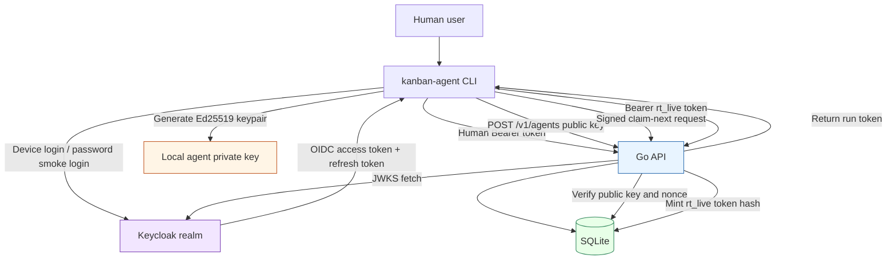
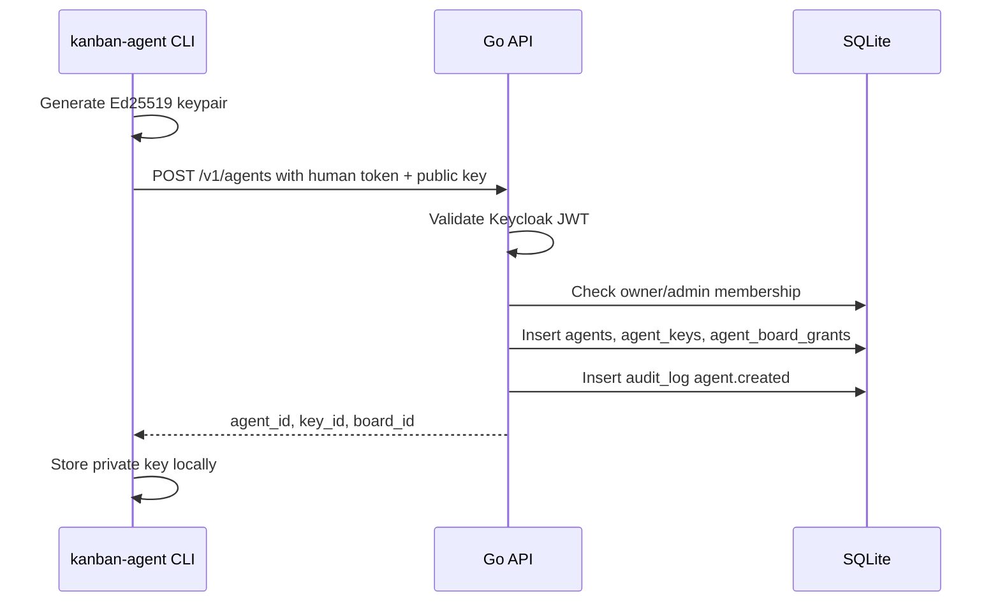
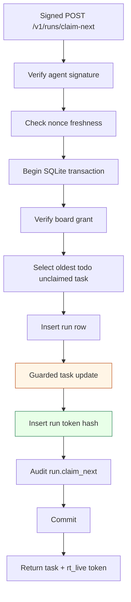

# Agent Enroll - Kanban Agent Credential MVP Deep Dive

This project implements a small but security-sensitive Kanban agent credential system. Humans log in through Keycloak, create boards and tasks, enroll automation agents, and let those agents claim work. The central design choice is that agents are not Keycloak users. Keycloak authenticates humans; the Go application owns agent identity, signed agent requests, short-lived run tokens, task-scoped authorization, and revocation.

> [!summary]
> The project proves one security primitive: a human may enroll an agent, the agent proves possession of an Ed25519 private key, the server atomically claims one task, and the server returns a short-lived opaque run token that can mutate only that task and run.
>
> The implementation now includes a Go API, CLI, SQLite schema, local Keycloak realm, JWKS validation, agent enrollment, one-time enrollment tokens, signed `claim-next`, run-token authorization, audit logging, WAL/backup hardening, rate limiting, tests, a smoke playbook, and a threat model.

## Why this project exists

Coding agents need a way to participate in a task system without inheriting human authority. A human can manage an organization, create a board, create tasks, and decide which agents are allowed to work on which board. An agent should not be able to create users, manage billing, read arbitrary tasks, or mutate unrelated work. The agent should be able to do a narrower thing: claim an available task from an allowed board and update that task during one run.

That requirement creates a credential-design problem. Keycloak is already good at human identity, but the agent workflow needs application-native authority. A Keycloak access token can tell the API who a human is. It cannot, by itself, express that `run_123` may update only `tsk_456` for the next fifteen minutes while the task is still claimed by that run. Those rules are Kanban domain rules. They belong in the Go service and its database.

The MVP therefore separates authority into three layers:

| Credential | Issuer | What it proves | What it may do |
|---|---|---|---|
| Human access token | Keycloak | A person authenticated through the realm. | Call human management endpoints, subject to local org roles. |
| Agent private key signature | CLI/agent keypair, verified by Go API | An enrolled agent possesses its private key. | Authenticate signed agent operations such as `claim-next`. |
| Run token | Go API | One run has been created for one task. | Mutate only the task/run bound to the token row until expiry/revocation. |

This separation is the project. Everything else exists to preserve it.

## Current project status

The repository is at a complete MVP plus initial private-alpha hardening pass.

What exists now:

- Go API server in `cmd/api/main.go`.
- Go CLI in `cmd/kanban-agent/main.go`.
- SQLite schema and WAL setup in `internal/storage/sqlite.go`.
- Local Keycloak Docker Compose setup in `dev/keycloak/`.
- Keycloak JWT/JWKS validation in `internal/auth/jwks.go`.
- Device login, local smoke-test password grant, and refresh-token support in `internal/auth/device.go`.
- Human org, board, and task endpoints in `internal/core/core.go` and `internal/http/handlers.go`.
- Interactive and token-based agent enrollment in `internal/agent/agent.go`.
- Ed25519 canonical request verification in `internal/agent/signature.go`.
- Claim-next, run-token creation, run-token authentication, comments, status updates, complete, and fail in `internal/runs/runs.go`.
- Audit logging in `internal/audit/audit.go`.
- In-memory rate limiting in `internal/http/ratelimit.go`.
- Integration and security tests in `internal/http/flow_test.go`.
- Ticket documentation under `ttmp/2026/05/03/AGENT-ENROLL-MVP--agent-enrollment-token-mvp-for-kanban/`.

The latest commit sequence tells the implementation story:

```text
884219c Docs: design agent enrollment MVP
af47bee Phase 1: add API and CLI skeleton
80b6c42 Phase 3: add human Kanban endpoints
3bf5e06 Phase 7: add agent enrollment and claim flow
e545432 Test agent enrollment and claim flow
ebd0321 Phase 2: add Keycloak auth and compose stack
7d340e6 Fix Keycloak basic scope for sub claim
c52c535 Harden agent revocation and smoke tests
dd9313f Add private alpha hardening
b7e3c30 Docs: add threat model guide
```

The project deliberately built the product primitive before overbuilding identity-provider machinery. Keycloak came in as human authentication, but the core agent/run-token mechanism remained inside the Go application.

## Repository shape

The code is small enough that each package has a clear responsibility.

```text
cmd/api/main.go
  API process startup, flags, auth mode, rate-limit toggle.

cmd/kanban-agent/main.go
  CLI commands, local config, Keycloak login/refresh, agent key generation, request signing.

internal/auth/
  Development auth, Keycloak JWT validation, JWKS cache, device login, refresh-token flow.

internal/core/
  Human-managed Kanban domain operations: orgs, boards, tasks.

internal/agent/
  Agent enrollment, enrollment tokens, role checks, revocation, signed request verification.

internal/runs/
  Claim-next transaction, run-token minting, run-token auth, task/run mutation.

internal/http/
  HTTP route wiring, auth boundaries, rate limiting, JSON handlers, integration tests.

internal/storage/
  SQLite open, WAL setup, migrations, backup support.

internal/audit/
  Append-only audit event insertion.

internal/crypto/
  ID generation, opaque token generation, token hashing.

dev/keycloak/
  Local Keycloak realm and Docker Compose stack.

ttmp/.../AGENT-ENROLL-MVP--agent-enrollment-token-mvp-for-kanban/
  Ticket docs, diary, implementation guide, threat model, smoke playbook, research sources.
```

The package layout matters because it mirrors the authority boundaries. Human auth code does not issue run tokens. Run-token code does not validate Keycloak JWTs. Signature code does not decide org roles. The system remains understandable because each package answers one kind of question.

## Architecture

At runtime, the MVP has four main components: Keycloak, the Go API, SQLite, and the CLI/agent process.



Keycloak is intentionally narrow. It authenticates humans and signs access tokens. The Go API validates those tokens locally through JWKS, then performs local authorization based on `memberships`, `agents`, `agent_board_grants`, `runs`, and `run_tokens`.

SQLite is not merely persistence. It is part of the security model. The database stores active agent keys, revoked key state, nonce history, task claims, token hashes, roles, and audit events. A bug in SQL predicates can become an authorization bug, so the important queries are written to bind operations to `org_id`, `board_id`, `task_id`, and `run_id` rather than trusting caller-provided IDs.

## The core mental model

The simplest way to understand the system is to track what each credential can authorize.

```text
Human token
  -> create orgs, boards, tasks
  -> create/revoke agents if owner/admin
  -> create enrollment tokens if owner/admin

Agent private key
  -> sign a fresh request
  -> prove possession of an enrolled active key
  -> ask to claim from a granted board

Run token
  -> authenticate one run
  -> mutate one task
  -> complete/fail one run
```

A broader credential can create a narrower credential, but the narrower credential does not inherit everything from the broader one. A human creates an agent; the agent does not become the human. An agent claims a task; the run token does not become the agent. This one-way narrowing keeps failures contained.

That rule appears throughout the code:

- `internal/auth/jwks.go` maps a Keycloak subject to a local user.
- `internal/agent/agent.go` requires owner/admin before creating or revoking agents.
- `internal/agent/signature.go` verifies active agent keys but does not grant task access by itself.
- `internal/runs/runs.go` checks board grants before claim and token-bound IDs before mutation.

The most common mistake would be to treat any valid credential as a general session. This project avoids that by making every credential answer a specific question.

## Human authentication and local authorization

Human authentication uses Keycloak. The API supports development-token auth for local tests, but the proper path is Keycloak mode. The API configuration in `cmd/api/main.go` includes:

```text
KANBAN_AUTH_MODE=keycloak
KANBAN_KEYCLOAK_ISSUER=http://localhost:8081/realms/kanban
KANBAN_KEYCLOAK_CLIENT_ID=kanban-agent-cli
```

The local realm is defined in `dev/keycloak/realm-kanban.json`. One important detail emerged during implementation: Keycloak 25+ emits the `sub` claim through the built-in `basic` client scope. Our first realm import omitted `basic` from the explicit `defaultClientScopes`, so fresh access tokens lacked `sub`. The fix was not to create a custom mapper; it was to restore the built-in scope:

```json
"defaultClientScopes": ["web-origins", "acr", "basic", "profile", "email"]
```

After that, a freshly minted token included a stable subject:

```json
{
  "sub": "5ff75126-d093-4f4a-a73d-1044e2eeb040",
  "azp": "kanban-agent-cli",
  "email": "dev@example.com",
  "preferred_username": "dev@example.com"
}
```

The Go validator in `internal/auth/jwks.go` requires `sub`. That is the right behavior because local users are keyed by `keycloak|<sub>`, not by email. Email can change. Subject is the identity anchor.

Authentication is not authorization. After the API knows the human user, local role checks decide what the human can do. In the current hardening pass, agent management requires `owner` or `admin`. That rule lives in `internal/agent/agent.go`, not in Keycloak. Keycloak does not know which Kanban org the user owns.

## Agent enrollment

There are two enrollment paths.

The interactive path is for a local developer:

```bash
kanban-agent login --keycloak ...
kanban-agent enroll --org org_... --board brd_... --name local-coder
```

The CLI generates an Ed25519 keypair locally. It sends only the public key to the API. The private key remains on the CLI machine. The API validates the human token, checks owner/admin role, validates the public key size, inserts the agent/key/grant rows, and returns `agent_id` and `key_id`.



The headless path is for remote systems:

```bash
kanban-agent agent create-token --org org_... --board brd_... --name ci-agent
kanban-agent enroll --token enr_live_...
```

The enrollment token is high entropy, short-lived, one-time, and stored only as a hash. The server burns it in the same transaction that creates the agent.

Pseudocode for the token path:

```go
func EnrollWithToken(token, publicKey string) error {
    hash := HashToken(token)

    tx := Begin()
    row := SELECT token WHERE token_hash = hash AND used_at IS NULL
    if row missing: reject
    if row.expires_at < now: reject

    validate public key
    create agent
    create key
    create board grant
    UPDATE enrollment_tokens SET used_at = now
    INSERT audit event
    commit
}
```

The security property is not that the token cannot leak. Copy-paste secrets can leak. The property is that leakage has a small window and a single use.

## Signed agent requests

After enrollment, the agent does not use Keycloak. It signs requests with its private key. The canonical request string is defined in `internal/agent/signature.go`:

```text
METHOD
PATH
SHA256(body)
TIMESTAMP
NONCE
```

The body hash is important because JSON bodies are part of the operation. A signature over only method and path would not protect `board_id`. The timestamp and nonce are important because a valid signature captured once should not be replayable forever.

Server verification proceeds in a deliberate order:

1. Check required signature headers exist.
2. Parse and validate timestamp freshness.
3. Load the active agent key and active agent row.
4. Reconstruct the canonical string from the exact body bytes.
5. Verify Ed25519 signature.
6. Insert the nonce into `agent_nonces`.
7. Reject duplicate nonce inserts as replay.

The handler reads the request body once, verifies the signature over those bytes, and then unmarshals the same bytes. This detail prevents a class of bugs where the server verifies one representation but executes another.

## Claim-next and run-token minting

The `claim-next` operation is where authentication becomes task authority. A valid agent signature proves identity, but it does not prove task access. Task access comes from `agent_board_grants`, task status, and a transaction.



The guarded update is the race protection:

```sql
UPDATE tasks
SET status = 'claimed',
    claimed_by_run_id = ?,
    updated_at = ?
WHERE id = ?
  AND board_id = ?
  AND claimed_by_run_id IS NULL
  AND status = 'todo';
```

The code checks that exactly one row was updated. If two agents race, only one can win. The integration test `TestConcurrentClaimOnlyOneAgentWins` proves this behavior with two enrolled agents and one task.

The run token is opaque. The API returns the plaintext once, but SQLite stores only `HashToken(token)`. Opaque tokens are easier to revoke than JWTs in this MVP because the server remains authoritative for expiry, revocation, scopes, run status, task binding, and agent binding.

## Run-token authorization

Run tokens are bearer tokens, but they are narrow bearer tokens. When a request arrives with:

```http
Authorization: Bearer rt_live_...
```

the server hashes the token, finds the `run_tokens` row, checks expiry and revocation, checks that the run is still `running`, and constructs a server-side principal:

```go
type TokenPrincipal struct {
    OrgID   string
    BoardID string
    TaskID  string
    RunID   string
    AgentID string
    Scopes  map[string]bool
}
```

Every mutation must bind to this principal. The URL is not authority. The token row is authority.

For example, a task status update must prove the URL task is the token-bound task:

```go
if taskIDFromURL != p.TaskID {
    return forbidden
}

UPDATE tasks
SET status = ?, updated_at = ?
WHERE id = p.TaskID
  AND org_id = p.OrgID
  AND board_id = p.BoardID
  AND claimed_by_run_id = p.RunID
```

The test `TestRunTokenStoredHashedAndBoundToTask` captures two invariants: the stored DB value is not the plaintext run token, and the token cannot update a different task.

## SQLite as part of the security design

SQLite is not only storage. It enforces many of the system's security properties through state and transactions.

Important tables include:

| Table | Security role |
|---|---|
| `memberships` | Local org roles after Keycloak authentication. |
| `agent_keys` | Active/revoked public keys for agent signature verification. |
| `agent_board_grants` | Board-specific agent permissions. |
| `enrollment_tokens` | Hashes, expiry, and one-time burn state. |
| `agent_nonces` | Replay protection for signed requests. |
| `runs` | Run lifecycle and task binding. |
| `run_tokens` | Hashes, scopes, expiry, revocation, and task/run binding. |
| `audit_log` | Evidence for sensitive operations. |

The storage layer now enables WAL mode:

```sql
PRAGMA journal_mode = WAL;
PRAGMA synchronous = NORMAL;
PRAGMA foreign_keys = ON;
PRAGMA busy_timeout = 5000;
```

WAL improves read/write behavior for a server process, but it changes backup rules. A live WAL database may have state in `kanban.db-wal`, so operators should not copy only `kanban.db`. The project adds `Store.Backup(ctx, path)` using `VACUUM INTO`, and the smoke playbook includes a backup integrity check.

## Rate limiting and abuse resistance

Rate limiting is deliberately simple and in-memory. The system is currently a single API process with SQLite, so a process-local token bucket is enough for private-alpha abuse resistance. It is not a distributed rate limiter.

The rate limiter in `internal/http/ratelimit.go` tracks buckets by key:

```text
ip:<remote-address>
human:create-enrollment-token:<user-id>
agent:claim:<agent-id>
run:comment:<run-id>
run:status:<run-id>
```

This gives two layers of protection. Anonymous or pre-auth traffic is limited by IP. Once the API knows the human, agent, or run, it can apply a more precise identity-specific limit. For example, `claim-next` is IP-limited before signature verification and agent-limited after signature verification.

The main thing to remember is that rate limiting does not establish correctness. It reduces load and slows abuse. Correctness still comes from signatures, roles, grants, transactions, token hashes, and binding checks.

## Audit logging

Audit logging records security-relevant actions in `audit_log`. The implementation writes events for org, board, task, agent, token, claim, comment, status, complete, fail, and revoke operations.

Audit events answer questions like:

- Which human created an enrollment token?
- Which agent claimed a task?
- Which run updated a task status?
- When was an agent revoked?

The current limitation is usability. Audit rows are written, but there is no API or CLI command to query them yet. That is one of the next useful project tasks. A security control that records evidence is only half finished until operators can retrieve the evidence during an incident.

## Threat model

The threat model document in the ticket gives the full treatment, but the essential concerns are straightforward.

| Threat | Current control | Remaining risk |
|---|---|---|
| Human token misuse | Keycloak JWT validation, local roles, refresh expiry. | CLI refresh tokens still live in local config. |
| Agent key theft | Board grants, active/revoked key state, revocation endpoint. | Agent private keys still live in CLI JSON config. |
| Enrollment token leak | One-time use, expiry, hash-only storage, IP rate limit. | Copy-paste secret can be used before legitimate enrollment. |
| Replay of signed request | Timestamp window and nonce table. | Nonce cleanup is not yet a dedicated maintenance job. |
| Double task claim | Transaction and guarded task update. | Need monitoring/retry policy if conflicts become common. |
| Run token abuse | Short expiry, hash storage, task/run binding, revocation. | Plaintext token can still be used until expiry if leaked. |
| Database leak | No plaintext bearer tokens stored. | Task content and audit history are disclosed. |
| API load abuse | In-memory rate limiting. | Not distributed; no trusted-proxy config yet. |

The key invariant is separation of authority: human tokens manage, agent keys claim, run tokens mutate one task. Most design decisions can be evaluated by asking whether they preserve or weaken that separation.

## Tests and validation

The test suite now includes unit and integration coverage for the important security behaviors.

Representative tests:

- `internal/agent/signature_test.go`
  - canonical request construction.
- `internal/http/flow_test.go`
  - interactive enroll, claim, comment, status, complete;
  - one-time enrollment token reuse rejection;
  - nonce replay rejection;
  - concurrent claim race;
  - run-token hash and task binding;
  - member cannot manage agents;
  - revoked agent cannot claim.
- `internal/http/ratelimit_test.go`
  - token-bucket exhaustion, refill, and independent keys.
- `internal/storage/sqlite_test.go`
  - WAL mode and backup reopen.

The standard validation command is:

```bash
go test ./...
docmgr doctor --ticket AGENT-ENROLL-MVP
```

The ticket also contains a repeatable smoke playbook:

```text
ttmp/2026/05/03/AGENT-ENROLL-MVP--agent-enrollment-token-mvp-for-kanban/playbook/01-local-smoke-test-playbook.md
```

That playbook covers fast dev-auth testing, Keycloak-backed testing, fresh-token `sub` assertion, headless enrollment-token reuse rejection, and WAL-safe backup checks.

## Key implementation details

### ID and token generation

`internal/crypto/random.go` generates prefixed IDs and high-entropy opaque tokens. Prefixes make logs and debugging readable:

```text
org_  usr_  brd_  tsk_  agt_  key_  enr_  run_  rt_  cmt_  aud_
```

Opaque tokens use a live prefix such as `rt_live_...` or `enr_live_...`. The plaintext is returned once; hashes go into SQLite.

### Keycloak token validation

The API validates Keycloak access tokens locally. It fetches the JWKS, selects the RSA key by `kid`, checks RS256, issuer, expiry, and client identity via `aud` or `azp`, then requires `sub`.

This avoids introspecting every request while still letting the API trust Keycloak signatures.

### Refresh-token support

The CLI stores access and refresh tokens. Before a human-auth API call, it checks token expiry and refreshes if the access token is near expiration. This makes Keycloak access tokens short-lived without making the CLI painful to use.

This is a usability improvement and a security tradeoff. The refresh token is now an important local secret. A future version should move tokens into OS keychain storage or a better-separated credential file.

### Role enforcement

The current role model is intentionally small:

```text
owner/admin: may manage agents and enrollment tokens
member: may use ordinary Kanban endpoints, but may not manage agents
```

The role check lives in application code because Keycloak does not know the local Kanban organization model. This is the right place for the check.

## What was learned

The main lesson is that agent authorization should be product-native. Keycloak is the correct place to authenticate humans, but it is not the right place to model every agent, run, task, and board relationship in the MVP. The Go API can express those relationships directly in SQL and code, and the resulting system is easier to test.

The second lesson is that the hardest security decisions are often boundaries, not algorithms. Ed25519 signing is straightforward. SHA-256 token hashing is straightforward. The important design work is deciding what the signature means, what the token can touch, which row is authoritative, and how authority narrows from human to agent to run.

The third lesson is that local identity-provider configuration matters. The missing Keycloak `sub` claim looked at first like a token-validation problem. The correct fix was to restore the built-in `basic` client scope so the standard `Subject (sub)` mapper was applied. That is now documented in the ticket sources and `dev/keycloak/README.md`.

## Current limitations

The MVP is not done in the sense of being production-complete. It is done in the sense that the core primitive exists and has an initial safety envelope.

Important limitations:

- CLI private keys and refresh tokens are still stored in local config JSON with `0600` permissions.
- Audit logs are written but not exposed through an API or CLI.
- Rate limiting is in-memory and resets on process restart.
- Rate limiting uses `RemoteAddr`; trusted proxy support does not exist yet.
- Backup support exists, but there is no scheduled backup/retention/restore automation.
- Role enforcement is basic and string-based.
- There is no production deployment guide yet.
- There are no incident response playbooks yet.

These are not flaws in the core design. They are the next layer of operational work.

## Near-term next steps

The next useful tasks are operational and ergonomic.

1. Add audit log query/export tooling.
   - `GET /v1/audit-log?org_id=...`
   - `kanban-agent audit list --org org_...`

2. Split CLI credential storage.
   - Move agent private keys out of the main config JSON.
   - Move Keycloak refresh tokens toward OS keychain support or a dedicated credential file.

3. Add incident response playbooks.
   - Leaked agent key.
   - Leaked run token.
   - Leaked human refresh token.
   - Leaked SQLite backup.

4. Add backup automation.
   - Scheduled `VACUUM INTO` backup.
   - Integrity check.
   - Restore test.
   - Retention policy.

5. Add production deployment guidance.
   - TLS.
   - Keycloak production realm assumptions.
   - SQLite filesystem permissions.
   - Reverse proxy and trusted IP handling.
   - Rate-limit configuration.

## Important project docs

The docmgr ticket contains the durable implementation record:

```text
ttmp/2026/05/03/AGENT-ENROLL-MVP--agent-enrollment-token-mvp-for-kanban/
```

Important files:

- `design-doc/01-agent-enrollment-token-mvp-implementation-guide.md`
- `design-doc/02-threat-model-for-agent-enrollment-mvp.md`
- `playbook/01-local-smoke-test-playbook.md`
- `reference/01-diary.md`
- `sources/00-keycloak-sub-claim-research-summary.md`

These are not secondary artifacts. They explain why the code is shaped the way it is, especially around Keycloak, signed requests, run-token scoping, and SQLite hardening.

## KB reviews

- [[KB-PLAYBOOK-TRIAL - Intern Reports for 6 Projects]] (2026-05-11) — concept extraction + classification; application-native authorization tribal at 3/3 (READY), three-layer credential separation at 2/3

## Related KB entries — Keycloak JWT/JWKS validation pattern used for human authentication
- [[On-Ramp/oauth-2-oidc-flows]] — the browser OAuth flow for human login
- [[Fundamentals/access-control-models]] — authn/authz/delegation separation; the model behind three-layer credential narrowing
- [[Tribal/sqlite-as-application-database]] — SQLite as security-relevant storage (hash-only token storage, transactional claims, WAL + backup)
- [[Tribal/application-native-authorization]] — Keycloak authenticates humans, the Go application owns agent/run/task authorization

**Tribal candidates** (our-specific patterns not yet at 3-project threshold):
- Three-layer credential separation (2/3) — human token → agent key → run token; each narrower than the last; seen in Wish Git (Keycloak → OAuth → SSH cert), Agent Enroll (Keycloak → agent key → run token)
- Canonical request signing (1/3) — Ed25519 signatures on METHOD + PATH + SHA256(body) + TIMESTAMP + NONCE
- Opaque scoped bearer tokens (1/3) — hash-only storage, task/run binding, short expiry, revocation
- Enrollment tokens (one-time, hash-only) (1/3) — short-lived, hash-stored, single-use enrollment secret; burns in the same transaction that creates the agent

## Project working rule

When adding a feature, identify which authority plane it belongs to before writing code.

- If it is about who the human is, it belongs near Keycloak auth.
- If it is about what the human may manage, it belongs in local role checks.
- If it is about which agent is speaking, it belongs in signed request verification.
- If it is about which task may be mutated, it belongs in run-token authorization.
- If it is about evidence, it belongs in audit logging.
- If it is about persistence correctness, it belongs in SQLite transactions and backup procedures.

The system stays understandable when those questions have separate answers. The system becomes fragile when one broad credential starts answering all of them.
