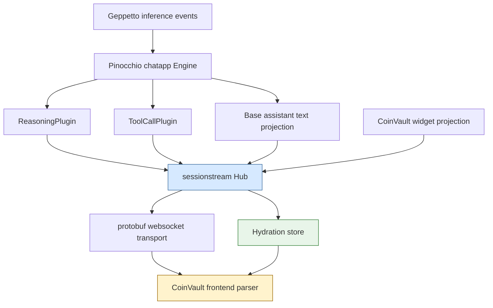
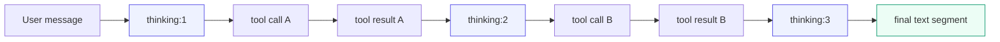

# Sessionstream, Chatapp, and CoinVault Cleanup

This report explains the cleanup that turned a set of loosely connected streaming, chat, and runtime-debug paths into a more explicit protocol stack. The work touched `sessionstream`, Pinocchio's `pkg/chatapp` and shared chat plugins, CoinVault's sessionstream frontend/backend integration, and a small prerequisite fix in Geppetto's reasoning event stream.

The main result is not a single feature. It is a set of contracts that now agree with each other: websocket frames are protobuf-defined, ordinals have explicit meanings, timeline entities preserve their creation and update positions, reasoning/tool-call behavior lives in shared plugins, and CoinVault consumes the shared protocol instead of carrying its own runtime-debug dialect.

> [!summary]
> - `sessionstream` now has a protobuf websocket transport contract and explicit ordinal vocabulary: `snapshotOrdinal`, `eventOrdinal`, `createdOrdinal`, `lastEventOrdinal`, and `sinceSnapshotOrdinal`.
> - Pinocchio's chatapp now has reusable `ReasoningPlugin` and `ToolCallPlugin` implementations, plus segment-aware transcript identities for interleaved thinking, tool calls, tool results, and assistant text.
> - CoinVault now consumes the shared chatapp/sessionstream protocol, removed its legacy runtime-debug reasoning/tool schemas, renamed its remaining widget schema to `coinvault.widgets.v1`, and passed real browser hydration validation with a multi-tool model run.

## Why this cleanup existed

The original system had several working pieces, but their contracts were not aligned. `sessionstream` had a generic model for sessions, projections, hydration, and websocket delivery. Pinocchio had chat-specific behavior built on that model. CoinVault had its own sessionstream-backed chat UI and a domain-specific widget projection path. Geppetto emitted reasoning and tool-loop events from the inference layer.

The problem was that each layer had accumulated local answers to the same questions:

- What is the websocket wire format?
- What does an ordinal mean?
- Which ID identifies a visible transcript row?
- How does a reasoning block differ from a final assistant message?
- Should tool-call UI events be product-specific or shared?
- How does hydration reconstruct the same order a live user saw?

The cleanup made those answers explicit. It did not move all behavior into one repository. It kept the generic substrate in `sessionstream`, the reusable chat application pieces in Pinocchio's `pkg/chatapp`, and the CoinVault-specific widgets in CoinVault. The important change is that the seams between them now use typed payloads, stable IDs, and named ordinal fields.

## The repositories and their responsibilities

The work crossed four repositories, but the ownership boundaries are now sharper than before.

| Repository | Main responsibility after cleanup | Important paths |
|---|---|---|
| `sessionstream` | Generic session streaming substrate, hydration store, websocket transport, protobuf frame schema. | `proto/sessionstream/v1/transport.proto`, `pkg/sessionstream/transport/ws/server.go`, `pkg/sessionstream/hydration/sqlite/store.go`, `pkg/sessionstream/projection.go` |
| `pinocchio` | Chat application engine, protobuf chatapp payloads, reusable chat plugins for reasoning and tools. | `proto/pinocchio/chatapp/v1/chat.proto`, `pkg/chatapp/chat.go`, `pkg/chatapp/plugins/reasoning.go`, `pkg/chatapp/plugins/toolcall.go` |
| `2026-03-16--gec-rag` / CoinVault | Product-specific webchat server, CoinVault widgets, frontend parser/store/rendering, profile/runtime integration. | `internal/webchat/server.go`, `internal/webchat/coinvault_projection_feature.go`, `proto/coinvault/widgets/v1/widgets.proto`, `web/src/ws/parsing.ts` |
| `geppetto` | Inference event source, reasoning stream semantics, tool-loop defaults. | `pkg/events/chat-events.go`, `pkg/steps/ai/openai/engine_openai.go`, `pkg/inference/toolloop/config.go` |

The final arrangement is deliberately layered. `sessionstream` does not know about chat. Pinocchio's `chatapp` does not know about CoinVault inventory widgets. CoinVault does not own generic reasoning/tool-call projection logic. Geppetto does not publish redundant reasoning delta types that downstream code can accidentally consume incorrectly.



## The starting state

Before the cleanup, the code had three important kinds of drift.

First, the websocket transport was still documented and partially shaped around ad-hoc JSON frames. That was workable for small demos, but it was not a durable contract for consumers that need generated TypeScript types, `google.protobuf.Any` unpacking, and `uint64` ordinal safety.

Second, the word `ordinal` was overloaded. A single field name could refer to a backend event position, a snapshot cursor, a visible row's creation point, or the latest event that updated a row. That ambiguity mattered because hydration does not replay the live UI event stream. Hydration reconstructs the final materialized timeline from stored entities. If entity ordering information is absent, a hydrated page can sort or display rows differently from the live stream.

Third, reasoning and tool-call rendering logic existed in more than one place. Pinocchio had a reasoning feature under `cmd/web-chat` that was not importable as a reusable package. CoinVault had a `RuntimeDebugFeature` that duplicated tool-call projection and had its own reasoning event names. The duplication became a real bug when reasoning content showed only the latest delta rather than accumulated text in one path.

The cleanup did not treat these as independent bugs. It treated them as contract failures. If transport, hydration, plugin identity, and frontend parsing all agree, then each individual UI bug becomes less likely.

## Geppetto prerequisite: remove the redundant reasoning delta path

The first prerequisite was in Geppetto. The OpenAI completion streaming path emitted both accumulated thinking events and a redundant reasoning-delta event. Most consumers already used `EventThinkingPartial`, which carries both the delta and the accumulated completion. One downstream path used `EventReasoningTextDelta`, which represented only the latest delta and caused reasoning content to be replaced rather than accumulated.

The fix was to remove the redundant event family rather than patching one consumer. That decision matters because it reduced the protocol surface. After the cleanup, downstream code has one correct reasoning partial event to consume.

The important deleted concepts were:

- `EventReasoningTextDelta`
- `EventReasoningTextDone`
- `NewReasoningTextDelta`
- `NewReasoningTextDone`

The implementation updated OpenAI and OpenAI Responses engines to stop emitting those events, updated tests, and deleted the event type definitions from `pkg/events/chat-events.go`.

This was not just a local bug fix. It prepared the rest of the cleanup by ensuring the shared `ReasoningPlugin` would project accumulated reasoning from the canonical event source.

## Sessionstream cleanup: protobuf transport and named ordinals

The `sessionstream` changes establish the substrate contract. The core additions are:

- `proto/sessionstream/v1/transport.proto`
- generated Go bindings under `pkg/sessionstream/pb/proto/sessionstream/v1/`
- websocket server support for protobuf JSON `ClientFrame` and `ServerFrame`
- explicit snapshot and entity ordinals in hydration state
- Systemlab documentation and UI updates that teach the new field names

The new transport schema replaces informal frame names with protobuf oneofs.

```proto
message ClientFrame {
  oneof frame {
    SubscribeRequest subscribe = 1;
    UnsubscribeRequest unsubscribe = 2;
    PingFrame ping = 3;
    PongFrame pong = 4;
  }
}

message ServerFrame {
  oneof frame {
    HelloFrame hello = 1;
    SnapshotFrame snapshot = 2;
    SubscribedFrame subscribed = 3;
    UnsubscribedFrame unsubscribed = 4;
    UiEventFrame ui_event = 5;
    ErrorFrame error = 6;
    PingFrame ping = 7;
    PongFrame pong = 8;
  }
}
```

The important point is not merely that protobuf exists. The important point is that every frame now has a typed shape. A browser client can decode a `ServerFrame`, inspect which oneof arm is present, and unpack the payload with a protobuf registry. Application payloads still belong to the application; the transport only requires that they are protobuf messages packed into `google.protobuf.Any`.

### The ordinal vocabulary

The cleanup made ordinal roles explicit.

| Field | Type location | Meaning |
|---|---|---|
| `Event.Ordinal` | backend event | The event position assigned by the hub or consumer path. |
| `UiEventFrame.eventOrdinal` | websocket live frame | The backend event ordinal that produced this UI event. |
| `Snapshot.snapshotOrdinal` | Go hydration snapshot | The latest timeline event ordinal materialized into the snapshot. |
| `SnapshotFrame.snapshotOrdinal` | websocket snapshot frame | The same cursor as `Snapshot.snapshotOrdinal`, delivered to the client. |
| `SnapshotEntity.createdOrdinal` | websocket snapshot entity | The event ordinal that first created this entity. |
| `SnapshotEntity.lastEventOrdinal` | websocket snapshot entity | The event ordinal that most recently updated this entity. |
| `SubscribeRequest.sinceSnapshotOrdinal` | websocket client frame | An advisory client cursor. The current reference adapter still sends current snapshot plus future live events, not hidden replay. |

This vocabulary closes a common bug class. A hydrated page should not need to guess entity display order from `kind` and `id`. The store now records when each entity first appeared and when it was last updated.

The relevant Go type changed from a minimal entity to an entity with order metadata:

```go
type TimelineEntity struct {
    Kind             string
    Id               string
    CreatedOrdinal   uint64
    LastEventOrdinal uint64
    Payload          proto.Message
    Tombstone        bool
}
```

The SQLite hydration store uses those fields when applying and snapshotting entities. If a projection does not set them explicitly, the store uses the applied event ordinal. If an entity already exists and the projection omits `CreatedOrdinal`, the store preserves the existing creation ordinal.

In simplified form, `Apply` now behaves like this:

```go
func Apply(session, eventOrdinal, entities):
    begin transaction

    for entity in entities:
        created = entity.CreatedOrdinal
        last = entity.LastEventOrdinal

        if created == 0:
            created = eventOrdinal

        if last == 0:
            last = eventOrdinal

        if entity already exists and entity.CreatedOrdinal == 0:
            created = existing.createdOrdinal

        write entity version with eventOrdinal, created, last

        if tombstone:
            delete current entity
        else:
            upsert current entity with created, last, payload

    advance session.snapshotOrdinal to max(existing, eventOrdinal)
    commit
```

Snapshot reads then order by `created_ordinal`, `last_event_ordinal`, `kind`, and `entity_id`. That ordering rule means hydration can reconstruct the logical timeline order instead of deriving it from arbitrary key order.

### Systemlab documentation and UI updates

The Systemlab chapters were updated because they are the teaching surface for `sessionstream`. The old prose used `ordinal`, `cursor`, and `sinceOrdinal` too broadly. The updated chapters now teach the protocol names directly:

- Phase 1 explains that ordinals become more specific in later phases.
- Phase 2 adds a table for `snapshotOrdinal`, `createdOrdinal`, `lastEventOrdinal`, `eventOrdinal`, and `sinceSnapshotOrdinal`.
- Phase 3 shows protobuf JSON examples for subscribe, snapshot, and UI event frames.
- Phase 4 notes that application payload schemas stay in example code while the transport sees protobuf messages and `Any` wrappers.
- Phase 5 explains the snapshot cursor, projection cursor, event cursor, and entity ordering fields.

The Systemlab browser code was also updated. Its websocket clients now send protobuf JSON-shaped frames:

```json
{
  "subscribe": {
    "sessionId": "reconnect-demo",
    "sinceSnapshotOrdinal": "0"
  }
}
```

The renderers now display snapshot ordinals, entity creation/update ordinals, and live event ordinals. That matters because documentation is only trustworthy if the teaching UI shows the same concepts that the code uses.

## Pinocchio cleanup: shared chat plugins and transcript segments

Pinocchio's cleanup had two related goals. First, reasoning and tool-call projection needed to move out of a command package and into reusable chatapp plugins. Second, transcript rows needed stable segment IDs so interleaved reasoning, tools, and assistant text would not fold into one entity during hydration.

### Shared plugin extraction

Before the cleanup, `cmd/web-chat` had a reasoning feature in package `main`, and CoinVault had its own runtime-debug feature. That made reuse difficult and encouraged protocol drift. The extracted plugins now live under:

- `pinocchio/pkg/chatapp/plugins/reasoning.go`
- `pinocchio/pkg/chatapp/plugins/toolcall.go`

The command app wires them like normal chatapp plugins:

```go
plugins.NewReasoningPlugin()
plugins.NewToolCallPlugin()
```

The shared `ToolCallPlugin` introduced typed protobuf payloads in `proto/pinocchio/chatapp/v1/chat.proto`:

- `ToolCallUpdate`
- `ToolResultUpdate`
- `ToolCallEntity`
- `ToolResultEntity`

The reasoning plugin initially kept `structpb.Struct` payloads to preserve the existing flexible reasoning UI payload shape. That choice later required the CoinVault frontend to register `StructSchema`, which became an important validation finding.

### Segment-aware transcript identity

The more subtle Pinocchio bug was not about payload shape. It was about entity identity.

A tool-using assistant turn can produce this sequence:

```text
thinking #1
ToolCall A
ToolResult A
thinking #2
ToolCall B
ToolResult B
thinking #3
assistant text
```

Before GP-64, all reasoning for one assistant turn used one entity ID:

```text
chat-msg-1:thinking
```

That ID can only represent one row in a timeline store that upserts by `(kind, id)`. During live streaming, the UI looked as though the thoughts panel moved, cleared, and refilled. During hydration, earlier thinking blocks were gone because the snapshot only contained the final projected state for that ID.

The fix was to make transcript rows segment-aware:

```text
chat-msg-1:thinking:1
chat-msg-1:thinking:2
chat-msg-1:thinking:3
chat-msg-1:text:1
chat-msg-1:text:2
```

The parent assistant turn still has a logical ID such as `chat-msg-1`, but visible rows get their own entity IDs. The protobuf chat message schema now carries segment metadata:

```proto
message ChatMessageUpdate {
  string message_id = 1;
  string role = 2;
  string content = 3;
  string text = 4;
  string status = 5;
  bool streaming = 6;

  string parent_message_id = 10;
  int32 segment = 11;
  string segment_type = 12;
  bool final = 13;
}
```

The reasoning plugin maintains per-parent segment state. In simplified form:

```go
func ensureReasoningSegment(parentID string) (id string, segment int) {
    state := segments[parentID]

    if !state.active {
        state.current++
        state.active = true
    }

    segments[parentID] = state
    return fmt.Sprintf("%s:thinking:%d", parentID, state.current), state.current
}

func finishReasoningSegment(parentID string) {
    state := segments[parentID]
    state.active = false
    segments[parentID] = state
}
```

The base chatapp runtime sink received similar text segmentation. Assistant text now streams into `chat-msg-N:text:M` instead of always using the parent assistant turn ID. Tool events act as transcript boundaries. If text is active and a tool-call event arrives, the runtime sink finishes the current text segment before delegating the tool event to plugins.

The important algorithm is:

```go
func PublishEvent(event):
    switch event.type:
    case PartialCompletion:
        id, segment = ensureTextSegment()
        publish ChatMessageAppended(id, parent, segment, segmentType="text")

    case Final:
        id, segment = ensureTextSegment()
        publish ChatMessageFinished(id, parent, segment, segmentType="text", final=true)

    case ToolBoundary:
        if active text segment exists:
            publish ChatMessageFinished(id, parent, segment, segmentType="text", final=false)
        delegate to ToolCallPlugin

    default:
        delegate to plugins
```

The `final` flag is a run-level signal. A finished non-final text segment should not end the whole active run in the frontend. Only the final assistant text segment should do that.

### User-visible max-iteration warnings

The Pinocchio chatapp cleanup also added a user-visible warning for max-iteration failures. Geppetto's default max iterations were raised from 5 to 20, but a model can still hit the limit. Previously that failure was mostly represented as a stopped assistant message with an error. The chatapp now publishes a separate warning `ChatMessage` when the runtime error text indicates max iterations were reached.

That warning is intentionally visible in the transcript:

```text
Warning: inference stopped because max iterations (20) reached. The answer may be incomplete; try narrowing the request or increasing the max-iterations setting.
```

This is a small change, but it follows the same principle as the larger cleanup: runtime state should be projected into explicit user-visible entities when it affects the user's interpretation of the answer.

## CoinVault cleanup: consume shared protocol, keep only product-specific widgets

CoinVault had the largest consumer-side change. The cleanup removed product-specific duplicates where shared chatapp behavior now exists, while preserving CoinVault-specific widget projection.

### Removed runtime-debug protocol

CoinVault previously had a runtime-debug feature that emitted its own event names and protobuf payloads for reasoning and tools:

- `CoinVaultReasoningDelta`
- `CoinVaultReasoningDone`
- `CoinVaultToolCall`
- `CoinVaultToolResult`
- `proto/coinvault/webchat/v1/runtime_debug.proto`

Those were removed. CoinVault now registers and consumes the shared plugins:

```go
plugins.NewReasoningPlugin()
plugins.NewToolCallPlugin()
```

The frontend parser now handles the shared sessionstream/chatapp events:

- `ChatReasoningStarted`
- `ChatReasoningAppended`
- `ChatReasoningFinished`
- `ChatToolCallStarted`
- `ChatToolCallUpdated`
- `ChatToolCallFinished`
- `ChatToolResultReady`
- `ChatMessage*`

It no longer keeps compatibility branches for the legacy `CoinVault*` runtime-debug messages. This was a fresh cutover. There is no dual parser path for the old reasoning/tool protocol.

### Struct payload registration

One browser smoke test found an important frontend error:

```text
type.googleapis.com/google.protobuf.Struct is not in the type registry
```

The shared `ReasoningPlugin` publishes reasoning payloads as `google.protobuf.Struct`. The frontend had registered chatapp and CoinVault schemas, but not `StructSchema`. The fix was to import and register `StructSchema`, then unpack reasoning events with:

```ts
const structPayload = frame.payload
  ? anyUnpack(frame.payload, StructSchema)
  : undefined;

const payload = toJson(StructSchema, structPayload) as Record<string, unknown>;
```

This issue was valuable because it proved that the frontend was now actually using protobuf `Any` unpacking. The error was not a rendering problem. It was a schema registry problem, which is the correct failure mode for a typed protobuf transport.

### Raw tool payload tolerance

Tool inputs and results are strings in the shared chatapp tool payloads. They usually contain JSON, but they can also contain raw strings. The CoinVault frontend parser now uses a non-throwing helper:

```ts
function parseJsonOrRaw(value: string | undefined): unknown {
  const trimmed = value?.trim() ?? "";
  if (!trimmed) return {};

  try {
    return JSON.parse(trimmed);
  } catch {
    return { raw: value };
  }
}
```

That rule prevents a UI crash when a tool argument or result is valid text but not valid JSON. The parser still preserves the content; it simply represents non-JSON as `{ raw: value }`.

### Active-run tracking with non-final segments

After assistant text segmentation, a `ChatMessageFinished` event no longer always means the whole assistant turn is done. It can mean one text segment has ended before a tool call. CoinVault's frontend run tracking was updated accordingly.

The old logic treated any finished assistant message as the end of the run. The new logic checks the `final` flag:

```ts
if (status === "finished") {
  store.dispatch(trackAssistantForActiveRun(entity.id));

  if (entity.data.final === true) {
    store.dispatch(endActiveRunTracking());
    store.dispatch(setRunStatus("finished"));
    store.dispatch(setActiveRunId(null));
    store.dispatch(setRunIssue(null));
  }

  return;
}
```

This preserves live UX during interleaved tool runs. Intermediate text segments can finish without disabling the send button or marking the run complete.

### CoinVault widgets remain product-specific

After removing runtime-debug schemas, one CoinVault protobuf namespace remained. It originally lived under `coinvault.webchat.v1`, which became confusing because the old runtime-debug code had also lived under `webchat/v1`. The remaining schema was not runtime-debug. It was the product-specific widget protocol.

That namespace was renamed to:

```text
coinvault.widgets.v1
```

The files now are:

- `proto/coinvault/widgets/v1/widgets.proto`
- `internal/pb/proto/coinvault/widgets/v1/widgets.pb.go`
- `web/src/pb/proto/coinvault/widgets/v1/widgets_pb.ts`

The schema is intentionally small:

```proto
message CoinVaultWidgetUpsert {
  string id = 1;
  string type = 2;
  google.protobuf.Struct payload = 3;
}

message CoinVaultWidgetEntity {
  string id = 1;
  string type = 2;
  google.protobuf.Struct payload = 3;
}
```

This remains in CoinVault because inventory cards, inventory tables, stats rows, and projection errors are product-specific UI entities. They should not move into `sessionstream` or Pinocchio `chatapp`.

The distinction is now clear:

| Behavior | Owner |
|---|---|
| Websocket frame protocol | `sessionstream` |
| Chat messages, reasoning rows, tool call rows | Pinocchio `pkg/chatapp` |
| CoinVault inventory widgets | CoinVault |
| LLM reasoning/tool-loop event source | Geppetto |

## Hydration and live streaming now share the same identity model

The most important technical result is that live streaming and hydration now agree on entity identity. This is the invariant that fixes the GP-64 class of bugs.

A live stream can deliver many UI events for a single row. The frontend upserts them by entity ID. That is correct. The bug appears only when two different logical rows reuse one entity ID.

The fixed transcript looks like this:

```text
ChatMessage / chat-msg-1-user
ChatMessage / chat-msg-1:thinking:1
ChatToolCall / call-A
ChatToolResult / call-A:result
ChatMessage / chat-msg-1:thinking:2
ChatToolCall / call-B
ChatToolResult / call-B:result
ChatMessage / chat-msg-1:thinking:3
ChatMessage / chat-msg-1:text:5
```

Each durable row has its own ID. Updates within a row reuse the same ID. New logical rows get new IDs. That is the whole rule.



Hydration stores the final state of each of those rows. It does not need to reconstruct them from the live event stream because their identities are already distinct.

## Validation evidence

The cleanup was validated at several levels.

### Unit and build validation

`sessionstream`:

```bash
go test ./...
make lint
```

`pinocchio`:

```bash
go test ./pkg/chatapp/... ./cmd/web-chat/...
go build ./...
```

`coinvault`:

```bash
go test $(go list ./... | grep -v '/ttmp/')
cd web && npm run typecheck
cd web && npm run test:unit
cd web && npm run build
```

The full CoinVault `go test ./...` still fails when it includes old `ttmp/.../scripts` directories that contain multiple standalone `main` packages in one directory. The implementation validation excludes `/ttmp/` for that reason.

### Browser validation with a real multi-tool run

The most important validation was a hydrated browser test against CoinVault using `wafer-qwen3.5-397b`.

The prompt was:

```text
Use your SQL documentation tool and then run one SQL query if possible. Think before each tool call. Then answer briefly with what happened.
```

The model performed two tool calls:

- `sql_doc`
- `sql_query`

The hydrated backend snapshot contained separate reasoning rows:

```text
chat-msg-1:thinking:1
chat-msg-1:thinking:2
chat-msg-1:thinking:3
```

It also contained a final assistant text row:

```text
chat-msg-1:text:5
segmentType: text
final: true
```

A fresh browser load at the conversation URL verified:

- websocket status was connected;
- the model showed `wafer-qwen3.5-397b`;
- three separate `Thoughts` panels rendered;
- two tool-call/result pairs rendered;
- expanding the thoughts panels showed distinct reasoning content around the tool calls;
- the browser console had no warnings or errors.

This test matters because it exercised the full chain:

```text
Geppetto events
→ Pinocchio chatapp plugins
→ sessionstream timeline + UI projections
→ SQLite hydration snapshot
→ protobuf websocket transport
→ CoinVault TypeScript parser
→ Redux timeline upsert
→ React transcript rendering
```

## Important commits

The cleanup was split into small commits across the affected repositories.

### Sessionstream

- `39fc58c Add sessionstream websocket transport protos`
- `60496e9 Use generated websocket transport frames`
- `a6c132e Clean up snapshot and entity ordinals`
- `779f841 Reset old hydration schemas during ordinal rollout`
- `f7c1024 docs: align systemlab with protobuf transport ordinals`
- `ca3f9cd chore(ws): remove obsolete frame type constants`

### Pinocchio

- `cf484a2` / related commits for shared plugin extraction and generated chatapp protobuf payloads
- `1d34a3a test(chatapp): cover shared ToolCallPlugin lifecycle`
- `fa1945f feat(chatapp): publish warning message when max iterations are reached`
- `10998ab feat(chatapp): segment thinking and assistant text transcript rows`

### CoinVault

- `dbfff24 feat(webchat): replace RuntimeDebugFeature with shared ReasoningPlugin and ToolCallPlugin`
- `9ce30dd fix(webchat): tolerate raw tool payload strings in shared plugin events`
- `48c59d4 fix(webchat): register Struct payloads for shared reasoning events`
- `4a9cc18 feat(webchat): consume segmented shared chatapp transcript schema`
- `4635c78 refactor(webchat): rename CoinVault widget proto namespace`

### Geppetto

- `1662231 GP-62: delete EventReasoningTextDelta and EventReasoningTextDone types`
- `11de03b chore(inference): default tool max iterations to 20`

The Geppetto documentation commits also preserve the GP-62, GP-63, and GP-64 design records and validation diary.

## Failure modes removed

The cleanup removed or reduced several failure modes.

### Failure mode: reasoning shows only the latest delta

Cause: a downstream consumer used a delta-only reasoning event.

Fix: delete the redundant `EventReasoningTextDelta` event family and consume accumulated thinking partials.

### Failure mode: earlier thinking blocks disappear after hydration

Cause: multiple thinking phases reused `chat-msg-N:thinking`.

Fix: allocate segment-aware IDs such as `chat-msg-N:thinking:1` and `chat-msg-N:thinking:2`.

### Failure mode: assistant text around tool calls folds into one row

Cause: all assistant text in a turn streamed into one parent assistant message ID.

Fix: allocate text segment IDs and close active text segments on tool boundaries.

### Failure mode: frontend crashes unpacking reasoning payloads

Cause: shared reasoning events used `google.protobuf.Struct`, but the frontend protobuf registry did not include `StructSchema`.

Fix: register `StructSchema` and unpack reasoning payloads through protobuf `Any` handling.

### Failure mode: hydrated timeline order differs from live order

Cause: snapshot entities lacked creation/update ordinal metadata and could be ordered by key rather than event position.

Fix: store and transport `createdOrdinal` and `lastEventOrdinal` for every timeline entity.

### Failure mode: protocol documentation says `sinceOrdinal` while code uses `sinceSnapshotOrdinal`

Cause: transport evolved from ad-hoc JSON to protobuf frames without the docs and Systemlab UI being updated everywhere.

Fix: update README, Systemlab chapters, Systemlab websocket clients, renderers, labels, and lint cleanup.

## The current model to preserve

The cleaned-up model has a small set of rules. Future work should preserve these rules unless there is a deliberate design change.

1. **The generic transport belongs to `sessionstream`.** It defines `ClientFrame`, `ServerFrame`, snapshot frames, UI event frames, and ordinal fields. It does not define chat or CoinVault payload semantics.

2. **Application payloads are protobuf messages.** Transports carry them as `google.protobuf.Any`. Frontends must register the schemas they expect to unpack.

3. **Ordinals must be named by role.** Use `eventOrdinal` for live UI events, `snapshotOrdinal` for hydrated timeline state, `createdOrdinal` for first entity creation, `lastEventOrdinal` for latest entity update, and `sinceSnapshotOrdinal` for subscribe cursors.

4. **Entity IDs define durable rows.** If two things should appear as two transcript rows after hydration, they must have two entity IDs during live streaming.

5. **Shared chat behavior belongs in Pinocchio `pkg/chatapp`.** Reasoning and tool-call projection are not CoinVault-specific. Product-specific widgets remain in CoinVault.

6. **Fresh cutovers should remove old protocol branches.** Keeping old `CoinVaultReasoningDelta` or `CoinVaultToolCall` parsing would make the new protocol harder to reason about. The cleanup intentionally removed those branches.

7. **Documentation and teaching UI must match the protocol.** Systemlab now uses protobuf JSON frame shapes and displays the named ordinal fields. That alignment should be maintained.

## A compact implementation checklist for similar cleanup work

This cleanup suggests a repeatable sequence for future protocol cleanups.

1. **Delete redundant event sources before fixing consumers.** If two event types claim to describe the same thing and one is wrong more easily, remove the ambiguous one.

2. **Name every cursor by what it measures.** Do not use one field called `ordinal` for event position, snapshot position, and entity update position.

3. **Move reusable projection code to importable packages.** A feature in `cmd/...` is not a reusable feature. Put shared plugins under a package with tests.

4. **Give every durable UI row its own entity ID.** Upsert stores are correct only when IDs match logical row identity.

5. **Generate schemas before updating frontend parsers.** The parser should consume generated protobuf descriptors and unpack `Any` payloads through a registry.

6. **Run one real browser hydration test.** Unit tests catch projection rules. A browser hydration test catches schema registration, TypeScript parser assumptions, Redux upsert behavior, and renderer ordering.

7. **Update the teaching docs last.** Once code and validation settle, update durable docs and teaching UI to use the final protocol names.

## What remains intentionally product-specific

Not everything should be extracted. CoinVault still owns its domain widgets. The `CoinVaultProjectionFeature` maps product-specific projection requests into widget entities. Those widgets have types such as inventory cards, inventory tables, stock alerts, stats rows, and projection errors. They belong in CoinVault because they depend on CoinVault data and UI concepts.

The important distinction is now visible in the schema names:

```text
sessionstream.v1                  generic websocket transport
pinocchio.chatapp.v1              shared chat timeline payloads
coinvault.widgets.v1              CoinVault-specific widget payloads
```

That naming is part of the cleanup. It prevents a future reader from mistaking CoinVault widgets for a generic webchat protocol.

## Final state

The system is now more explicit at every seam:

- `sessionstream` has a protobuf websocket schema and clear ordinal fields.
- Pinocchio chatapp has generated protobuf payloads, shared reasoning/tool plugins, segment-aware transcript rows, and user-visible max-iteration warnings.
- CoinVault consumes the shared chatapp protocol, registers the right protobuf schemas, removes legacy runtime-debug parsing, and keeps only product-specific widget schemas under `coinvault.widgets.v1`.
- Geppetto no longer emits the redundant reasoning-delta events that caused accumulated thinking to be replaced.

The cleanup is significant because it changed the failure mode of the system. Before, a transcript ordering bug could hide inside duplicated event names, ad-hoc JSON parsing, overloaded ordinals, or reused entity IDs. After the cleanup, the contracts force the bug to appear in one of a small number of explicit places: schema registration, ordinal assignment, entity identity, or projection logic. That is a better system to debug and a better system to extend.
