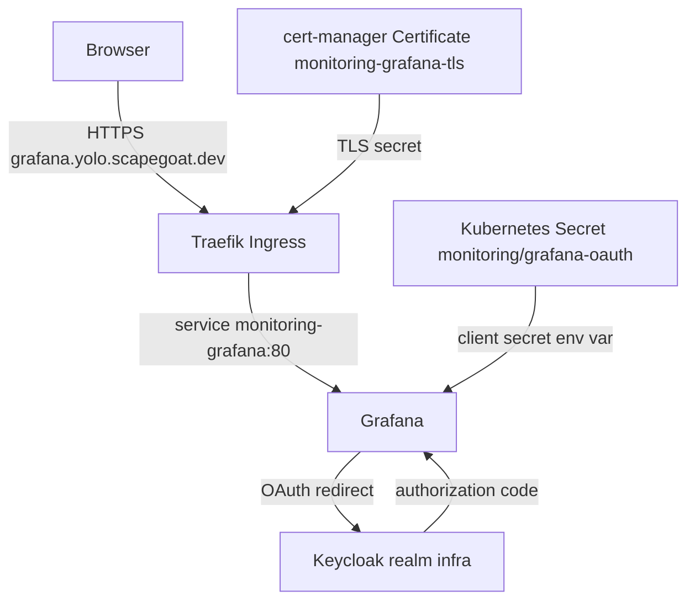
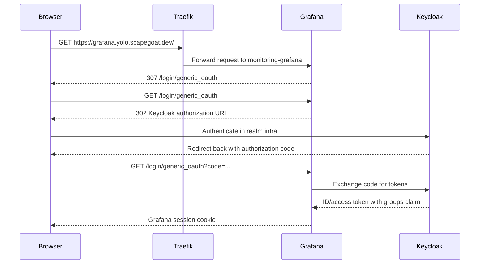

> [!warning] Keycloak is superseded by ZITADEL for new work
> ZITADEL is the platform's identity provider going forward; see
> [[Research/playbooks/infra/PLAYBOOK - Production ZITADEL for a Single Go Web Application on k3s]]
> and [[Research/playbooks/infra/PLAYBOOK - Production Multi-Tenant ZITADEL SaaS Platform on k3s]].
> Do not stand up a new Keycloak realm for a new service.
>
> Keycloak is still deployed (`gitops/kustomize/keycloak`) and two live integrations still
> depend on it: Vault operator login (`auth/oidc` → `https://auth.scapegoat.dev/realms/infra`)
> and Grafana. This note stays accurate for those; treat it as describing a system being
> migrated off, not a pattern to copy.

# Grafana Keycloak Login on Hetzner k3s

This note records the shorter but important follow-up to the k3s resize: Grafana was exposed at `https://grafana.yolo.scapegoat.dev` with a valid Let's Encrypt certificate and Grafana's built-in Generic OAuth login against Keycloak. The immediate goal was to stop relying on local port-forwarding or an ad hoc proxy while also avoiding anonymous public Grafana access.

> [!summary]
> Grafana was not already configured for Keycloak login in the Hetzner/yolo cluster. The repository had a plan, but the live cluster had no Grafana Ingress and no OAuth configuration.
>
> The browser's HSTS certificate error came from Traefik serving a default self-signed certificate for an unmatched hostname.
>
> The implemented path is browser → Traefik Ingress → Grafana → Keycloak Generic OAuth in the `infra` realm.

## Why this note exists

Grafana is operationally useful only if it is easy to reach during maintenance. Port-forwarding works for a single operator at a terminal, but it is not a good access model for routine dashboard use. Direct public exposure without authentication is also not acceptable. The right access model is an HTTPS route with a valid certificate and identity-provider login.

This cluster already has the required building blocks:

- Traefik handles external HTTP and HTTPS routing.
- cert-manager can issue Let's Encrypt certificates through `letsencrypt-prod`.
- Keycloak is already exposed at `https://auth.yolo.scapegoat.dev`.
- Grafana is installed by `kube-prometheus-stack` through the Argo CD Application `gitops/applications/monitoring.yaml`.

The work was to connect those parts cleanly.

## Initial state

The existing playbook was:

```text
docs/grafana-keycloak-access-playbook.md
```

It already described the desired model:

```text
browser
  -> https://grafana.yolo.scapegoat.dev
  -> Traefik TLS ingress
  -> Grafana generic_oauth
  -> Keycloak realm/client
```

The live cluster did not yet implement that model. In `gitops/applications/monitoring.yaml`, Grafana ingress was disabled:

```yaml
grafana:
  enabled: true
  ingress:
    enabled: false
```

Runtime checks confirmed:

- no `Ingress` existed in the `monitoring` namespace for Grafana;
- no OAuth-related Grafana environment variables were configured;
- no `grafana-oauth` Secret existed;
- the live Grafana configuration did not include `auth.generic_oauth`.

## The certificate error

Firefox reported:

```text
MOZILLA_PKIX_ERROR_SELF_SIGNED_CERT
```

and refused to allow an exception because the hostname used HSTS.

That error did not mean Grafana had a bad certificate. There was no Grafana route yet. The request reached Traefik for `grafana.yolo.scapegoat.dev`, but Traefik had no matching Ingress with a valid certificate for that hostname. In that case Traefik can present a default certificate. The browser correctly rejected it.

The durable fix was not to bypass the browser warning. The durable fix was to create the real Ingress and have cert-manager issue the certificate.

## Target architecture



The important point is that Keycloak is not used as a Traefik forward-auth proxy here. Grafana itself performs the OAuth flow. Traefik terminates TLS and routes requests. Grafana decides whether the user is authenticated.

## Keycloak client shape

A confidential OIDC client was created in the `infra` realm:

```text
realm: infra
client_id: grafana
redirect_uri: https://grafana.yolo.scapegoat.dev/login/generic_oauth
web_origin: https://grafana.yolo.scapegoat.dev
```

A groups mapper was added so Grafana can receive group claims and map users to roles.

The current role mapping is:

```text
infra-admins -> Grafana Admin
all other authenticated users -> Grafana Viewer
```

This is functional, but it deserves review. A dedicated `grafana-admins` group would be more precise if Grafana administration should be separated from general infrastructure administration.

## Grafana configuration

The main repository change is in:

```text
gitops/applications/monitoring.yaml
```

Grafana's chart values now enable Generic OAuth:

```yaml
grafana:
  grafana.ini:
    server:
      root_url: https://grafana.yolo.scapegoat.dev
    auth:
      disable_login_form: true
      oauth_auto_login: true
    auth.generic_oauth:
      enabled: true
      name: Keycloak
      allow_sign_up: true
      client_id: grafana
      client_secret: $__env{GF_AUTH_GENERIC_OAUTH_CLIENT_SECRET}
      scopes: openid profile email
      auth_url: https://auth.yolo.scapegoat.dev/realms/infra/protocol/openid-connect/auth
      token_url: https://auth.yolo.scapegoat.dev/realms/infra/protocol/openid-connect/token
      api_url: https://auth.yolo.scapegoat.dev/realms/infra/protocol/openid-connect/userinfo
      role_attribute_path: contains(groups[*], 'infra-admins') && 'Admin' || 'Viewer'
```

The OAuth client secret is provided by an environment variable:

```yaml
envValueFrom:
  GF_AUTH_GENERIC_OAUTH_CLIENT_SECRET:
    secretKeyRef:
      name: grafana-oauth
      key: client-secret
```

This keeps the secret out of the Grafana values and out of Git.

## Ingress and certificate configuration

The Grafana ingress is now enabled through the same Helm values:

```yaml
ingress:
  enabled: true
  ingressClassName: traefik
  annotations:
    cert-manager.io/cluster-issuer: letsencrypt-prod
  hosts:
    - grafana.yolo.scapegoat.dev
  tls:
    - secretName: monitoring-grafana-tls
      hosts:
        - grafana.yolo.scapegoat.dev
```

This causes Kubernetes to create an Ingress. cert-manager observes the annotation and creates a Certificate for `grafana.yolo.scapegoat.dev`. Traefik then serves the issued certificate for that host.

After the change, the live cluster reported:

```text
Ingress: monitoring/monitoring-grafana
Host:    grafana.yolo.scapegoat.dev
Address: 91.98.46.169
TLS:     monitoring-grafana-tls
```

The certificate became ready:

```text
monitoring-grafana-tls   Ready=True   issuer letsencrypt-prod
```

## Request flow

The login flow is short and deterministic:



Validation showed:

```text
/login -> HTTP 307 to /login/generic_oauth
/login/generic_oauth -> HTTP 302 to Keycloak auth endpoint
```

That confirms Grafana is performing OAuth auto-login and redirecting to Keycloak.

## The implementation sequence

The work happened in this order:

1. Verify Grafana OAuth and Ingress were not already configured in the live yolo cluster.
2. Inspect `../crib-k3s` because that cluster had a Grafana route. It had a useful routing pattern, but not the same Keycloak/OAuth setup.
3. Create or update the `grafana` Keycloak client in realm `infra`.
4. Add a groups protocol mapper for the client.
5. Store the client secret in the Kubernetes Secret `monitoring/grafana-oauth`.
6. Update `gitops/applications/monitoring.yaml` with Grafana OAuth and Ingress settings.
7. Apply the monitoring Application and wait for Grafana rollout.
8. Wait for cert-manager to issue `monitoring-grafana-tls`.
9. Verify browser-level redirects with `curl -I`.

The reproducible script saved in the ticket is:

```text
ttmp/2026/05/05/K3S-PERF-MONITORING-CLEANUP--k3s-performance-monitoring-and-unused-workload-cleanup/scripts/15-enable-grafana-keycloak-login.sh
```

## Validation commands

Check the Ingress:

```bash
kubectl --kubeconfig .cache/kubeconfig-tailnet.yaml \
  -n monitoring get ingress monitoring-grafana -o wide
```

Check the certificate:

```bash
kubectl --kubeconfig .cache/kubeconfig-tailnet.yaml \
  -n monitoring get certificate monitoring-grafana-tls -o wide
```

Check Grafana rollout:

```bash
kubectl --kubeconfig .cache/kubeconfig-tailnet.yaml \
  -n monitoring rollout status deploy/monitoring-grafana
```

Check OAuth redirect:

```bash
curl -I https://grafana.yolo.scapegoat.dev/login/generic_oauth
```

Expected result:

```text
HTTP/2 302
location: https://auth.yolo.scapegoat.dev/realms/infra/protocol/openid-connect/auth?client_id=grafana...
```

## Vault/VSO durability update

The first live implementation created the OAuth client secret directly as a Kubernetes Secret:

```text
monitoring/grafana-oauth
```

That made Grafana login work, but it left the secret as manual cluster state. Manual cluster state is not durable in this GitOps environment. If the Secret is deleted, if the cluster is rebuilt, or if another reconciliation path overwrites it, the operator must remember how to recreate it.

The secret has now been moved into the standard Vault Secrets Operator pattern:

```text
Vault kv/infra/monitoring/grafana-oauth
  -> Vault policy grafana-oauth
  -> Kubernetes auth role grafana-oauth
  -> ServiceAccount monitoring/grafana-oauth
  -> VaultAuth monitoring/grafana-oauth
  -> VaultStaticSecret monitoring/grafana-oauth
  -> Kubernetes Secret monitoring/grafana-oauth
  -> Grafana env var GF_AUTH_GENERIC_OAUTH_CLIENT_SECRET
```

The GitOps manifests added for this are:

```text
gitops/kustomize/monitoring-extras/vault-connection.yaml
gitops/kustomize/monitoring-extras/grafana-oauth-serviceaccount.yaml
gitops/kustomize/monitoring-extras/grafana-oauth-vault-auth.yaml
gitops/kustomize/monitoring-extras/grafana-oauth-vault-static-secret.yaml
```

The Vault-side declarations are:

```text
vault/policies/kubernetes/grafana-oauth.hcl
vault/roles/kubernetes/grafana-oauth.json
```

The Vault policy grants read access only to:

```text
kv/data/infra/monitoring/grafana-oauth
```

This is the important security boundary. Grafana does not receive broad Vault access. The `grafana-oauth` service account can authenticate to Vault only through the Kubernetes auth role bound to the `monitoring` namespace and only read the one OAuth secret path needed by Grafana.

Live validation showed:

```text
vaultconnection/vault                 Healthy=True Ready=True
vaultauth/grafana-oauth               Healthy=True Ready=True
vaultstaticsecret/grafana-oauth       Synced=True Healthy=True Ready=True
secret/grafana-oauth owner            VaultStaticSecret/grafana-oauth
```

Grafana OAuth redirect still works after VSO took ownership of the Secret:

```text
https://grafana.yolo.scapegoat.dev/login/generic_oauth
  -> HTTP 302 to https://auth.yolo.scapegoat.dev/realms/infra/...
```

One remaining improvement is the group model. `infra-admins` works as a first pass. A dedicated group would make authorization clearer:

```text
grafana-admins -> Admin
grafana-viewers -> Viewer
```

Then the Grafana role expression can be updated to match those groups.

## Working rules

- Do not expose Grafana anonymously on a public hostname.
- Do not store the OAuth client secret in Git.
- Use a real Ingress and cert-manager certificate; do not bypass HSTS certificate errors.
- Prefer Grafana's built-in Generic OAuth for this setup instead of adding a separate proxy layer.
- Keep the Keycloak client redirect URI exact: `https://grafana.yolo.scapegoat.dev/login/generic_oauth`.
- Treat live Kubernetes Secrets as transitional unless they are produced by Vault Secrets Operator or another declared secret flow.
- Bind Vault Kubernetes auth roles to narrow service accounts and namespaces; the Grafana OAuth role should read only `kv/infra/monitoring/grafana-oauth`.

## Related files

Repository:

```text
/home/manuel/code/wesen/2026-03-27--hetzner-k3s
```

Implementation files:

```text
gitops/applications/monitoring.yaml
gitops/kustomize/monitoring-extras/vault-connection.yaml
gitops/kustomize/monitoring-extras/grafana-oauth-serviceaccount.yaml
gitops/kustomize/monitoring-extras/grafana-oauth-vault-auth.yaml
gitops/kustomize/monitoring-extras/grafana-oauth-vault-static-secret.yaml
vault/policies/kubernetes/grafana-oauth.hcl
vault/roles/kubernetes/grafana-oauth.json
docs/grafana-keycloak-access-playbook.md
```

Ticket artifacts:

```text
ttmp/2026/05/05/K3S-PERF-MONITORING-CLEANUP--k3s-performance-monitoring-and-unused-workload-cleanup/reference/01-investigation-diary.md
ttmp/2026/05/05/K3S-PERF-MONITORING-CLEANUP--k3s-performance-monitoring-and-unused-workload-cleanup/scripts/15-enable-grafana-keycloak-login.sh
```
