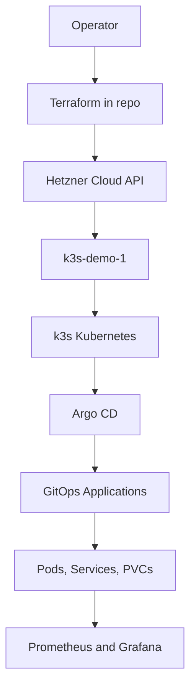
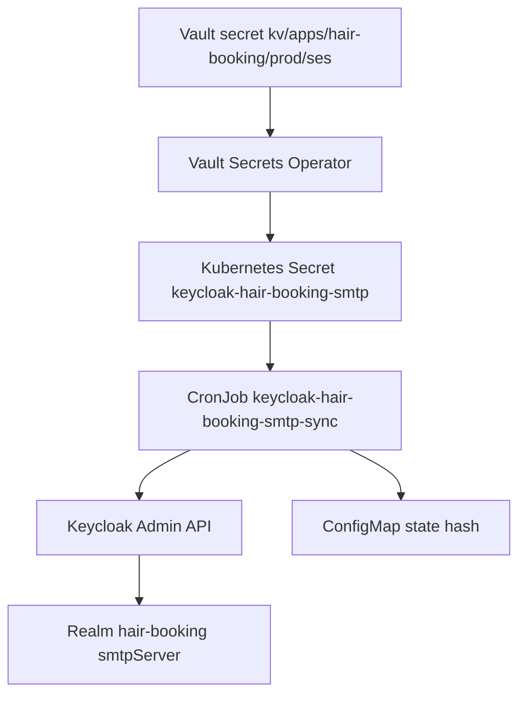

# Hetzner k3s Resize Postmortem: Capacity, Reboot, and Recovery

This report explains a real maintenance incident in the Hetzner k3s cluster at `/home/manuel/code/wesen/2026-03-27--hetzner-k3s`. The cluster ran out of schedulable CPU and memory headroom, was resized from `cpx32` to `cpx42`, rebooted, and then required post-reboot repair of Argo CD repo-server and a Keycloak SMTP synchronization job.

The purpose of this note is not only to record that the resize happened. The purpose is to explain the system behavior that made the incident possible: Kubernetes requests versus live usage, Terraform replacement hazards, single-node k3s constraints, Argo CD service dependencies, and CronJob startup races. A future operator should be able to use this note to understand the failure and repeat the recovery safely.

> [!summary]
> The cluster was not primarily failing because Linux had no free CPU at that instant. It was failing because Kubernetes had already reserved nearly all node CPU and memory through pod requests.
>
> The resize to `cpx42` doubled the Kubernetes allocatable CPU and memory, reducing request pressure from roughly 96% CPU / 95% memory to roughly 51% CPU / 50% memory.
>
> The post-reboot failures were separate operational issues: an `argocd-repo-server` pod stuck as `Unknown` left its Service without endpoints, and a Keycloak CronJob ran before Keycloak accepted HTTP connections.

## Why this postmortem exists

A one-node Kubernetes cluster is simple to run until it is not. There is only one scheduler target, one local disk location for `local-path` volumes, one control-plane node, and one reboot domain. When the node is short on schedulable resources, there is no second node that can absorb replacement pods during rollouts. When the node reboots, every control-plane and application component restarts together.

This incident exposed three classes of operational knowledge that should be preserved:

- Kubernetes scheduling failures must be diagnosed from **requests and allocatable capacity**, not only from live CPU and memory usage.
- Terraform plans for existing infrastructure must be inspected for replacement actions before applying, especially when cloud-init/user-data is present.
- Post-reboot health checks must include Kubernetes Services and endpoints, not only pods, because a Service can exist while routing to no ready backend.

The main ticket for this work is:

```text
/home/manuel/code/wesen/2026-03-27--hetzner-k3s/ttmp/2026/05/05/K3S-PERF-MONITORING-CLEANUP--k3s-performance-monitoring-and-unused-workload-cleanup
```

The detailed ticket postmortem is:

```text
ttmp/2026/05/05/K3S-PERF-MONITORING-CLEANUP--k3s-performance-monitoring-and-unused-workload-cleanup/reference/02-postmortem-k3s-capacity-resize-and-post-reboot-recovery.md
```

## The system at the time of the incident

The cluster is a Hetzner Cloud VM named `k3s-demo-1`. Terraform manages the server through the `hcloud_server.node` resource in `main.tf`. k3s runs directly on the server. Argo CD manages most workloads from manifests under `gitops/applications` and `gitops/kustomize`.



The important files are:

```text
main.tf
terraform.tfvars
gitops/applications/monitoring.yaml
gitops/applications/*.yaml
gitops/kustomize/keycloak/keycloak-hair-booking-smtp-sync-cronjob.yaml
gitops/kustomize/keycloak/keycloak-hair-booking-smtp-sync-configmap.yaml
```

The important runtime components are:

| Component | Role |
|---|---|
| `k3s-demo-1` | Hetzner VM and only Kubernetes node. |
| k3s | Kubernetes distribution running control plane and workloads. |
| Argo CD | GitOps reconciler for applications. |
| `argocd-repo-server` | Argo CD component that renders Git/Helm/Kustomize manifests. |
| kube-scheduler | Kubernetes control-plane component that places pods on nodes. |
| Keycloak | Identity provider used by application login flows. |
| `keycloak-hair-booking-smtp-sync` | CronJob that reconciles Keycloak realm SMTP settings from Vault-backed secrets. |
| Prometheus/Grafana | Observability stack used for usage and capacity analysis. |

## The initial symptom

The reported scheduler error was:

```text
0/1 nodes are available: 1 Insufficient cpu, 1 Insufficient memory.
no new claims to deallocate, preemption: 0/1 nodes are available:
1 No preemption victims found for incoming pod.
```

The incoming pod was a `coinvault` pod. Its deployment requests were visible in `gitops/kustomize/coinvault/deployment.yaml`:

```yaml
resources:
  requests:
    cpu: 250m
    memory: 512Mi
  limits:
    memory: 1Gi
```

The node before resize had 4 allocatable CPU cores and roughly 8 GiB allocatable memory. The total requested resources were almost at the node boundary:

```text
CPU requests:    3865m / 4 cores = 96%
Memory requests: 7380Mi / ~8Gi   = 95%
```

This is the central fact. Kubernetes refused to schedule the pod because placing it would exceed the node's allocatable request budget.

## Requests, usage, and why `kubectl top` was not enough

A new operator often starts with `kubectl top node` or `kubectl top pods`. That is useful, but it answers a different question than the scheduler answers.

`kubectl top` reports live usage. It tells you what containers are consuming right now. The scheduler does not use that value for initial placement. The scheduler uses requests.

| Term | Source | Used by scheduler? | Meaning |
|---|---|---:|---|
| CPU usage | kubelet/cAdvisor via Metrics Server or Prometheus | No | CPU actually consumed over a recent interval. |
| Memory usage | kubelet/cAdvisor | No | Memory currently used by containers. |
| CPU request | pod spec | Yes | CPU reserved for scheduling. |
| Memory request | pod spec | Yes | Memory reserved for scheduling. |
| CPU/memory limit | pod spec | Partly, not for fit in the same way | Maximum allowed consumption for a container. |
| Allocatable | node status | Yes | Node capacity available to pods after system reservations. |

The scheduler logic can be summarized as:

```pseudo
for each node:
    if sum(existing_pod_cpu_requests) + incoming_pod_cpu_request > node.allocatable_cpu:
        reject node with Insufficient cpu

    if sum(existing_pod_memory_requests) + incoming_pod_memory_request > node.allocatable_memory:
        reject node with Insufficient memory

    if all hard constraints pass:
        node is a scheduling candidate
```

In this cluster there was only one node. Once that one node failed the request-fit checks, the pod had nowhere else to go.

Preemption did not help because there were no useful lower-priority victims. Most workloads use default priority, so the scheduler cannot solve the problem by evicting an equivalent-priority workload.

## Why resizing was chosen

Right-sizing and cleanup were both valid follow-up actions. A snapshot comparison of pod requests and live usage showed several applications with memory requests far above their observed point-in-time usage. That evidence is useful, but it is not sufficient by itself to lower production requests. Memory usage can spike during startup, migrations, imports, or unusual traffic.

The immediate operational problem was that the cluster needed headroom now. The chosen repair was to resize the Hetzner server from `cpx32` to `cpx42`.

Before:

```text
server_type: cpx32
Kubernetes allocatable CPU: 4
Kubernetes allocatable memory: ~8Gi
```

After:

```text
server_type: cpx42
Kubernetes allocatable CPU: 8
Kubernetes allocatable memory: ~16Gi
```

The resize was not a substitute for cleanup. It was the emergency capacity repair. The cleanup and right-sizing work remains useful because it prevents the same pattern from returning.

## The Terraform resize hazard

The operator shut down the server with:

```bash
hcloud server shutdown k3s-demo-1
```

Terraform was then used to change the server type. The desired change was simple:

```hcl
server_type = "cpx42"
```

The server resource also needed:

```hcl
keep_disk = true
```

This matters because the cluster uses local storage. Preserving the disk preserves the k3s node data and local-path persistent volumes.

The first Terraform plan was unsafe. It showed:

```text
Plan: 1 to add, 0 to change, 1 to destroy.
```

The cause was `user_data` drift. The Hetzner provider treats `user_data` changes as requiring replacement. For an already-created server, cloud-init user data is creation-time input. Replacing the server to replay cloud-init was not the desired operation.

The safe change was added to `main.tf`:

```hcl
lifecycle {
  ignore_changes = [user_data]
}
```

The safe plan then showed:

```text
Plan: 0 to add, 1 to change, 0 to destroy.
```

This distinction is the most important Terraform lesson in the incident. A resize should update the existing server in place. A destroy/create replacement can change identity, IP, and disk state. Even when backups exist, that is a different operation with a different risk profile.

## The resize result

After applying the safe plan and powering the server back on, Hetzner reported:

```text
Name:   k3s-demo-1
Status: running
Type:   cpx42
Cores:  8
Memory: 16.0 GB
```

Terraform state reported:

```text
server_type       = "cpx42"
keep_disk         = true
primary_disk_size = 160
status            = "running"
```

Kubernetes reported:

```text
Capacity:
  cpu:    8
  memory: 15982912Ki

Allocatable:
  cpu:    8
  memory: 15982912Ki
```

Allocated requests dropped to about half of allocatable capacity:

```text
cpu requests:    4115m (51%)
memory requests: 7892Mi (50%)
```

The scheduler capacity incident was resolved at this point. The cluster had enough request headroom for the previously blocked `coinvault` pod to schedule. The remaining `coinvault` problem was no longer scheduling. It became an application startup/configuration problem.

## Post-reboot issue 1: Argo CD repo-server had no endpoints

After the reboot, the Argo CD UI showed an error like:

```text
Unable to load data: connection error:
desc = "transport: Error while dialing:
dial tcp 10.43.217.6:8081: connect: connection refused"
```

`10.43.217.6` was the ClusterIP of `service/argocd-repo-server`. The Service existed, but the endpoint set was empty because the old repo-server pod was stuck in `Unknown` state.

The diagnosis command was:

```bash
kubectl --kubeconfig .cache/kubeconfig-tailnet.yaml \
  -n argocd get pods,svc,endpoints \
  -l app.kubernetes.io/name=argocd-repo-server -o wide
```

The important distinction is that a Service is only a stable virtual address. It does not imply that any backend is ready. Endpoints show whether the Service has actual pod IPs to route to.

The recovery was safe because repo-server is managed by a Deployment:

```bash
kubectl --kubeconfig .cache/kubeconfig-tailnet.yaml \
  -n argocd delete pod -l app.kubernetes.io/name=argocd-repo-server

kubectl --kubeconfig .cache/kubeconfig-tailnet.yaml \
  -n argocd rollout status deploy/argocd-repo-server --timeout=120s
```

The Deployment created a fresh pod, and the Service endpoints returned:

```text
endpoints/argocd-repo-server   10.42.0.241:8084,10.42.0.241:8081
```

The general rule is: when an in-cluster client gets connection refused to a Service IP, check endpoints. If the endpoints are empty, debug readiness and the selected pods before debugging DNS or network policy.

## Post-reboot issue 2: Keycloak SMTP sync ran too early

The Keycloak application initially appeared Degraded because the `keycloak-hair-booking-smtp-sync` CronJob failed. This job is defined in:

```text
gitops/kustomize/keycloak/keycloak-hair-booking-smtp-sync-cronjob.yaml
gitops/kustomize/keycloak/keycloak-hair-booking-smtp-sync-configmap.yaml
```

Its purpose is to keep the `hair-booking` Keycloak realm SMTP settings aligned with a Vault-backed Kubernetes Secret.



The job failed while trying to authenticate to Keycloak:

```text
http://keycloak/realms/master/protocol/openid-connect/token
```

The error was:

```text
ConnectionRefusedError: [Errno 111] Connection refused
urllib.error.URLError: <urlopen error [Errno 111] Connection refused>
```

This was not an SMTP-provider connection failure. It was an internal Keycloak HTTP service connection failure. The likely sequence was:

```text
node rebooted
Keycloak pod started but was not yet accepting HTTP
CronJob fired on its */15 schedule
Job tried to fetch an admin token
Keycloak refused the connection
Job failed after its attempts
Argo CD marked the app Degraded
```

The immediate repair was to rerun the CronJob once Keycloak was healthy:

```bash
kubectl --kubeconfig .cache/kubeconfig-tailnet.yaml \
  -n keycloak create job \
  --from=cronjob/keycloak-hair-booking-smtp-sync \
  keycloak-hair-booking-smtp-sync-manual-$(date +%Y%m%d%H%M%S)
```

The manual job completed and reported the realm as in sync. The stale failed Job was then deleted.

## Durable Keycloak fix: retry token acquisition

The durable fix was to make the Python reconciler retry Keycloak token acquisition. The new function catches `urllib.error.URLError`, waits, and retries before failing.

```python
def fetch_token_with_retries(base_url: str, client_id: str, username: str, password: str) -> str:
    attempts = int(os.environ.get("KEYCLOAK_CONNECT_ATTEMPTS", "30"))
    delay_seconds = int(os.environ.get("KEYCLOAK_CONNECT_RETRY_SECONDS", "10"))
    last_error = None
    for attempt in range(1, attempts + 1):
        try:
            return fetch_token(base_url, client_id, username, password)
        except urllib.error.URLError as exc:
            last_error = exc
            print(
                f"keycloak token request attempt {attempt}/{attempts} failed: {exc}",
                file=sys.stderr,
            )
            if attempt == attempts:
                break
            time.sleep(delay_seconds)
    raise last_error
```

The call site changed from:

```python
access_token = fetch_token(...)
```

to:

```python
access_token = fetch_token_with_retries(...)
```

The default retry window is about five minutes. This is long enough to absorb ordinary startup ordering delays while still failing if Keycloak is genuinely unavailable.

## What remained after the recovery

After the resize and post-reboot repairs, the remaining degraded application was `coinvault`. Its log showed:

```text
legacy inference_settings.api_keys wrapper is no longer supported; rename it to inference_settings.api
```

This is not a scheduler problem. It is not a Hetzner resize problem. It is an application configuration/schema problem. Keeping these causes separate matters because otherwise the operator may continue debugging node capacity after the node capacity issue has already been fixed.

The current classification is:

| Issue | Status | Cause class |
|---|---|---|
| FailedScheduling due to CPU/memory | Resolved | Node request capacity. |
| Argo CD UI connection refused | Resolved | repo-server Service had no endpoints. |
| Keycloak Degraded | Resolved | CronJob startup race. |
| coinvault CrashLoopBackOff | Open | Application config schema. |

## Operational runbook for the next resize or reboot

The maintenance path should be explicit.

Before shutdown:

```bash
kubectl --kubeconfig .cache/kubeconfig-tailnet.yaml get pods -A
kubectl --kubeconfig .cache/kubeconfig-tailnet.yaml get pvc -A
kubectl --kubeconfig .cache/kubeconfig-tailnet.yaml describe node k3s-demo-1 \
  | grep -A35 -E 'Capacity:|Allocatable:|Allocated resources:'
```

For Terraform resize:

```bash
terraform plan -out /tmp/resize.tfplan
```

Read the plan. Continue only if it says:

```text
0 to add, 1 to change, 0 to destroy
```

After reboot:

```bash
kubectl --kubeconfig .cache/kubeconfig-tailnet.yaml get nodes -o wide
kubectl --kubeconfig .cache/kubeconfig-tailnet.yaml top node
kubectl --kubeconfig .cache/kubeconfig-tailnet.yaml get pods -A -o wide | egrep -v ' Running | Completed '
kubectl --kubeconfig .cache/kubeconfig-tailnet.yaml -n argocd get applications
```

Check Argo CD repo-server explicitly:

```bash
kubectl --kubeconfig .cache/kubeconfig-tailnet.yaml \
  -n argocd get pods,svc,endpoints \
  -l app.kubernetes.io/name=argocd-repo-server -o wide
```

If the Service has no endpoints and the pod is stale or `Unknown`, recreate the pod through the Deployment:

```bash
kubectl --kubeconfig .cache/kubeconfig-tailnet.yaml \
  -n argocd delete pod -l app.kubernetes.io/name=argocd-repo-server
```

Check failed Jobs:

```bash
kubectl --kubeconfig .cache/kubeconfig-tailnet.yaml get jobs -A
kubectl --kubeconfig .cache/kubeconfig-tailnet.yaml get pods -A | grep -E 'Error|CrashLoopBackOff|Unknown'
```

## Monitoring implications

The incident produced two monitoring requirements.

First, the cluster needs request saturation alerts:

```promql
sum(kube_pod_container_resource_requests{resource="memory"})
/
sum(kube_node_status_allocatable{resource="memory"})
```

and:

```promql
sum(kube_pod_container_resource_requests{resource="cpu"})
/
sum(kube_node_status_allocatable{resource="cpu"})
```

These should alert before reaching 90%.

Second, the cluster needs visibility into critical Services without endpoints. For this incident, `argocd-repo-server` was the important Service. A pod dashboard alone would not have explained why the UI received connection refused on a Service IP.

The planned implementation location is:

```text
gitops/kustomize/monitoring-extras
```

Related ticket guide:

```text
ttmp/2026/05/05/K3S-PERF-MONITORING-CLEANUP--k3s-performance-monitoring-and-unused-workload-cleanup/design-doc/02-grafana-dashboard-organization-and-kubernetes-metrics-guide.md
```

## Working rules

- Read Terraform plans before applying. Do not apply a server replacement when the intended operation is a resize.
- Preserve local disks during single-node k3s maintenance unless destruction is explicitly intended and backups have been verified.
- Diagnose scheduler failures from `kubectl describe node`, not only from `kubectl top`.
- Check Service endpoints whenever an in-cluster component reports connection refused to a ClusterIP.
- Add retry loops to CronJobs that call services which may be starting after a node reboot.
- Separate capacity incidents from application configuration crashes once pods can schedule.
- Turn successful manual repairs into GitOps changes, otherwise the system will regress.

## Related files and documents

Repository:

```text
/home/manuel/code/wesen/2026-03-27--hetzner-k3s
```

Primary postmortem and ticket files:

```text
ttmp/2026/05/05/K3S-PERF-MONITORING-CLEANUP--k3s-performance-monitoring-and-unused-workload-cleanup/reference/02-postmortem-k3s-capacity-resize-and-post-reboot-recovery.md
ttmp/2026/05/05/K3S-PERF-MONITORING-CLEANUP--k3s-performance-monitoring-and-unused-workload-cleanup/reference/01-investigation-diary.md
```

Reproducibility scripts:

```text
ttmp/2026/05/05/K3S-PERF-MONITORING-CLEANUP--k3s-performance-monitoring-and-unused-workload-cleanup/scripts/10-terraform-resize-cpx42-keep-disk.sh
ttmp/2026/05/05/K3S-PERF-MONITORING-CLEANUP--k3s-performance-monitoring-and-unused-workload-cleanup/scripts/11-post-resize-health-check-and-argocd-repo-server-recovery.sh
ttmp/2026/05/05/K3S-PERF-MONITORING-CLEANUP--k3s-performance-monitoring-and-unused-workload-cleanup/scripts/12-fix-keycloak-smtp-sync-startup-race.sh
ttmp/2026/05/05/K3S-PERF-MONITORING-CLEANUP--k3s-performance-monitoring-and-unused-workload-cleanup/scripts/13-postmortem-evidence-snapshot.sh
```

Key source files:

```text
main.tf
terraform.tfvars
gitops/kustomize/keycloak/keycloak-hair-booking-smtp-sync-cronjob.yaml
gitops/kustomize/keycloak/keycloak-hair-booking-smtp-sync-configmap.yaml
gitops/applications/monitoring.yaml
gitops/kustomize/monitoring-extras
```
