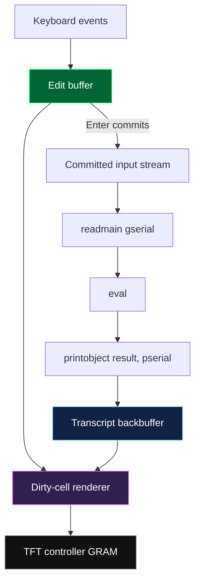
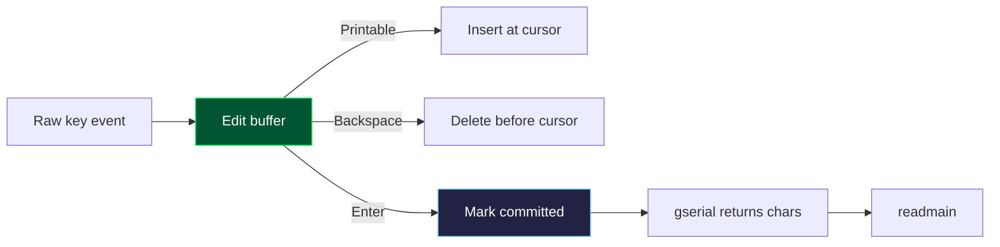
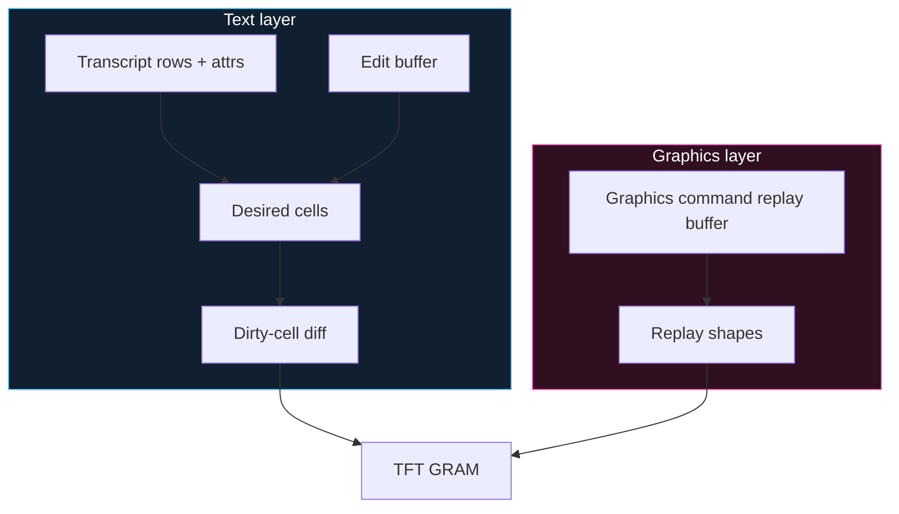

# PicoCalc uLisp REPL Window: Backbuffer Rendering and RAM-Conscious UI

This report explains the work done to turn the PicoCalc uLisp console from a direct terminal emulator into a proper REPL window with a backbuffer, editable input line, dirty-cell rendering, primitive graphics experiments, and finally a first integration into the real `ulisp-picocalc.ino` firmware. It is written as a technical deep dive rather than a changelog: the goal is to preserve the design reasoning, the data structures, the constraints of the RP2040, and the practical lessons about drawing text on a small TFT display without spending all available RAM.

> [!summary]
> - The central design shift was from **immediate terminal drawing** to **stateful UI composition**: output goes into a transcript backbuffer, input lives in a separate edit buffer, and the TFT is updated from a dirty text-cell renderer.
> - A full pixel framebuffer is not viable on RP2040 once uLisp is present: `320 × 320 × 2 = 204,800` bytes, before heap, stack, interpreter state, and buffers.
> - The primitive sketch validated the display model before touching uLisp; the integrated firmware now routes `pserial()` through `ReplBackBufferAppend()` and `gserial()` through committed edit-buffer input.
> - The final integration deliberately reduced the uLisp heap from `(23000-SDSIZE)` to `(18000-SDSIZE)`, trading Lisp object capacity for enough runtime headroom to host the REPL window.

## Why this note exists

The PicoCalc uLisp firmware began as a single-file embedded Lisp interpreter with a terminal-style display path. The code worked, but the interaction model was simple: every printed character immediately mutated the screen, and every typed character was echoed into the same display stream. That is how a serial terminal behaves. It is not how a comfortable on-device REPL behaves.

A proper REPL window needs three separate concepts that a terminal normally conflates:

1. **The transcript**, which is the durable history of prompts, submitted forms, printed results, and error messages.
2. **The input line**, which is mutable and not yet part of the transcript until the user presses Enter.
3. **The display viewport**, which shows some projection of transcript + input state on the TFT.

The difference matters because editing input is destructive and local, while transcript history is append-only. When those two operations share the same pixel stream, features such as cursor motion, backspace, history recall, and scrollback become awkward. When they are represented as state, the UI becomes simpler to reason about.

The project moved through three stages:

- First, a standalone C++ primitive sketch proved the display and keyboard primitives without uLisp.
- Second, the primitive sketch gained dirty-cell rendering, color attributes, bold text, icon/graphics experiments, and a `/demo` command.
- Third, the REPL pieces were extracted into `repl_window.h` and wired into the real uLisp firmware.

The most important lesson is that embedded UI work is not primarily about drawing pixels. It is about choosing the smallest useful state representation that can regenerate the pixels.

## The initial terminal model

The original uLisp PicoCalc firmware uses a terminal emulator model. The key functions live near the bottom of:

```text
/home/manuel/code/wesen/2026-05-05--ulisp-picocalc/ulisp-picocalc/ulisp-picocalc.ino
```

The old output path looked conceptually like this:

```cpp
void pserial(char c) {
  LastPrint = c;
  if (!tstflag(NOECHO)) Display(c);
  Serial.write(c);
}
```

`Display(c)` maintained static cursor position and interpreted characters such as newline, backspace, form feed, and terminal-ish special codes. It plotted characters with `tft.drawChar`, and when it reached the bottom row it called `ScrollDisplay()`.

That is a reasonable implementation for "print bytes to a terminal". But a REPL window is not just a terminal. It needs to show committed history while also letting the user edit an uncommitted form. If you type `(defun foo`, move the cursor, delete a character, or recall a previous input, those edits should not become history. They should be local to the input line until Enter commits them.

The old input path had the same conflation. `gserial()` polled the keyboard, `ProcessKey()` appended characters into `KybdBuf`, and printable keys were immediately sent to `Display(c)`. Enter made the keyboard buffer available to `readmain(gserial)`. That means input was both screen state and reader input, tied together through a flat terminal stream.

The new design cuts that knot.

## The target model: transcript, editor, renderer

The final mental model is small enough to draw:



The reader and evaluator remain recognizably uLisp. The integration did not rewrite Lisp parsing or evaluation. The key idea was to change the two streams that surround the evaluator:

- `pserial()` no longer draws directly to the TFT. It appends output characters to a transcript buffer.
- `gserial()` no longer exposes raw key events or a terminal echo buffer. It returns characters from the committed edit buffer.

This lets the existing loop keep its shape:

```cpp
pserial('>'); pserial(' ');
object *line = readmain(gserial);
line = eval(line, env);
printobject(line, pserial);
```

But the meaning of `pserial` and `gserial` changes. They become UI state adapters rather than terminal byte pipes.

## Why no full framebuffer

The first tempting solution to flicker is "just draw into a framebuffer and swap it." That is how desktop graphics works. It is not how this RP2040 firmware can afford to work.

The display is 320×320 pixels. In RGB565, each pixel is 2 bytes:

```text
320 × 320 × 2 = 204,800 bytes
```

The RP2040 has 264 KB of SRAM. A full framebuffer would consume roughly three quarters of all RAM before counting:

- uLisp workspace objects,
- global interpreter state,
- call stack,
- keyboard buffers,
- SD/LittleFS buffers,
- renderer state,
- TFT/SPI/library state.

The actual firmware before heap reduction compiled with the integrated REPL window at:

```text
Global variables use 227760 bytes (86%), leaving 34384 bytes.
```

That is already tight. A pixel framebuffer is not the right abstraction. The right abstraction is a **text-cell framebuffer**, because the UI is mostly text.

The screen grid is much smaller than the pixel grid:

```text
Columns = 320 / 6  = 53
Lines   = 320 / 10 = 32
Cells   = 53 × 32  = 1,696
```

A cell can store a character plus a compact attribute. Even two full 32×53 cell buffers are tiny compared with a pixel framebuffer. This is the key move: buffer semantic text cells, not pixels.

## The primitive sketch as laboratory

Before modifying uLisp, a separate C++-only Arduino sketch was created:

```text
/home/manuel/code/wesen/2026-05-05--ulisp-picocalc/repl-window-primitives/repl-window-primitives.ino
```

The purpose of the primitive sketch was to isolate hardware/UI uncertainty from interpreter uncertainty. The sketch had no Lisp reader, no evaluator, no object system, no garbage collector. It contained only:

- `TFT_eSPI` initialization,
- `PCKeyboard` initialization on `Wire1` with SDA=6/SCL=7,
- a transcript/backbuffer,
- an edit buffer,
- a renderer,
- a fake evaluator,
- commands such as `/spam`, `/demo`, `/fg`, `/bg`, `/line`, and `/circle`.

This was the correct order of operations. A large single-file firmware is hard to reason about when the hardware behavior is unknown. The primitive sketch answered smaller questions first:

- Does the screen initialize correctly?
- What key codes does the keyboard emit?
- Does full-screen redraw flicker?
- How much RAM does a text-cell renderer cost?
- Can an edit buffer and transcript be kept separate?
- Can primitive graphics coexist with text rendering?

The answer to the flicker question was immediate: full-screen redraw flickered. The fix was not to synchronize to a nonexistent framebuffer swap. The fix was to stop clearing pixels that had not changed.

## Dirty-cell rendering

The primitive sketch initially did the obvious thing: compose the whole screen, clear rows, redraw text. On the PicoCalc TFT, this flickered because `fillRect()` sends visible pixel changes over SPI before the replacement text arrives. Even if the final frame is identical, the intermediate blank row is visible.

The dirty-cell renderer fixes that by keeping two text-cell buffers:

```cpp
struct RenderCell {
  char ch;
  uint8_t attr;
  bool bold;
};

RenderCell desiredCells[Lines][Columns];
RenderCell drawnCells[Lines][Columns];
```

The renderer works in two phases. First it composes `desiredCells` from application state: transcript rows, status bar, and input line. Then it compares each desired cell with the last drawn cell. Only changed cells are redrawn.

```cpp
void renderAll() {
  clearDesiredCells();
  composeTranscript();
  composeStatus();
  composeInput();

  for (int row = 0; row < Lines; row++) {
    for (int col = 0; col < Columns; col++) {
      if (!drawnCellsValid || !cellsEqualAt(row, col)) {
        drawCellDirect(row, col);
        drawnCells[row][col] = desiredCells[row][col];
      }
    }
  }

  drawnCellsValid = true;
}
```

This does not eliminate all possible flicker. A changed cell is still cleared before being redrawn. But the blank region is a 6×10 cell rather than a 320-pixel row or a full screen. In practice, that is the difference between a flickering UI and a stable one.

The final integrated header uses the same principle in:

```text
/home/manuel/code/wesen/2026-05-05--ulisp-picocalc/ulisp-picocalc/repl_window.h
```

Key symbols:

```text
ReplBackBuffer
ReplEditBuffer
ReplRenderCell
ReplBackBufferAppend
ReplEditCommit
ReplRenderAll
ReplRenderIfDirty
```

## The transcript backbuffer

The transcript is a circular buffer of physical screen rows. It intentionally stores **wrapped rows**, not logical input/output records. That makes rendering simple: a visible transcript row maps directly to one backbuffer row.

In the integrated header:

```cpp
constexpr int ReplBackBufferRows = 160;
constexpr int ReplInputBufferSize = 512;

struct ReplBackBuffer {
  char rows[ReplBackBufferRows][ReplColumns];
  uint8_t attrs[ReplBackBufferRows][ReplColumns];
  bool bold[ReplBackBufferRows][ReplColumns];
  uint16_t currentRow;
  uint16_t currentCol;
  uint16_t count;
  uint16_t viewportStart;
  bool followTail;
};
```

Each row has three parallel arrays:

| Array | Purpose |
|---|---|
| `rows` | The actual ASCII character for each cell. |
| `attrs` | Packed foreground/background color index. |
| `bold` | Whether the cell should be drawn with a 1-pixel bold offset. |

The attribute byte is compact:

```cpp
inline uint8_t ReplPackAttr(uint8_t fg, uint8_t bg) {
  return ((fg & 0x0F) << 4) | (bg & 0x0F);
}
```

The top four bits are foreground color; the bottom four bits are background color. Sixteen colors are enough for a small REPL UI and avoid storing 16-bit RGB565 colors per cell.

The backbuffer appender is deliberately character-oriented, because `pserial()` is character-oriented:

```cpp
void ReplBackBufferAppend(char c) {
  if (c == '\r') return;
  if (c == '\n') {
    replAdvanceRow();
    replUiDirty = true;
    return;
  }

  replBack.rows[replBack.currentRow][replBack.currentCol] = c;
  replBack.attrs[replBack.currentRow][replBack.currentCol] =
      ReplPackAttr(replDrawState.fg, replDrawState.bg);
  replBack.bold[replBack.currentRow][replBack.currentCol] = replDrawState.bold;

  replBack.currentCol++;
  if (replBack.currentCol >= ReplColumns) replAdvanceRow();
  replUiDirty = true;
}
```

This is the bridge between old uLisp printing and the new UI. uLisp still prints characters; the characters now land in a transcript structure instead of directly mutating screen pixels.

## The edit buffer

The edit buffer is the opposite of the transcript. It is mutable, short-lived, and not history until Enter is pressed.

```cpp
struct ReplEditBuffer {
  char text[ReplInputBufferSize];
  uint16_t len;
  uint16_t cursor;
  bool committed;
  uint16_t readPos;
};
```

The important invariant is that `readmain(gserial)` sees only **committed input**. A raw keypress should not leak into the reader. Arrow keys, backspace, and cursor motion are UI events, not Lisp source characters.

The flow is:



When Enter is pressed, the input text is appended to the transcript and then exposed to the reader:

```cpp
void ReplEditCommit() {
  ReplSetInputStyle();
  for (uint16_t i = 0; i < replEdit.len; i++) {
    ReplBackBufferAppend(replEdit.text[i]);
  }
  ReplBackBufferAppend('\n');
  ReplSetOutputStyle();

  replEdit.committed = true;
  replEdit.readPos = 0;
}
```

A bug surfaced here: the first integration emitted a prompt both from the uLisp `repl()` loop and from `ReplEditCommit()`, producing lines like `> > (+ 1 2)`. The fix was conceptual rather than cosmetic: the REPL loop owns the prompt; the edit buffer owns only the input suffix. After the fix, prompt and input are one visual line, but emitted from two layers.

## Color as structure, not decoration

Color started as a primitive experiment but became useful in the integrated REPL. Prompt, input, and output need separation. Extra blank lines and repeated `>` characters were a crude substitute for structure. Color is a better separator on a 320×320 display.

The current integrated styles are:

```cpp
void ReplSetOutputStyle() {
  replDrawState.fg = 1;   // soft white
  replDrawState.bg = 0;   // black
  replDrawState.bold = false;
}

void ReplSetPromptStyle() {
  replDrawState.fg = 4;   // neon cyan
  replDrawState.bg = 0;
  replDrawState.bold = true;
}

void ReplSetInputStyle() {
  replDrawState.fg = 3;   // neon green
  replDrawState.bg = 0;
  replDrawState.bold = false;
}
```

This changes the transcript from a monochrome terminal stream into a lightly structured document:

- Prompt: cyan and bold.
- Input: green.
- Output: white.
- Error styling is reserved as neon pink but not fully wired into the error path yet.

The important point is that style is applied at append time. Once a character enters the transcript, its attribute is stored with it. Rendering later does not need to rediscover whether a character was input or output. The transcript remembers.

## How `pserial()` changed

The old `pserial()` called `Display(c)`. The new one calls `ReplBackBufferAppend(c)`.

```cpp
void pserial(char c) {
  LastPrint = c;
  if (!tstflag(NOECHO)) ReplBackBufferAppend(c);

  #if defined(serialmonitor)
  if (c == '\n') Serial.write('\r');
  Serial.write(c);
  #endif
}
```

This is a small code change with large architectural consequences. `pserial` remains a character sink. uLisp printing code does not need to know about TFT drawing. But the sink now feeds a stateful renderer rather than a terminal cursor.

The `NOECHO` flag still matters. Some uLisp paths suppress display output when loading/pasting/listing. The integration preserves the guard:

```cpp
if (!tstflag(NOECHO)) ReplBackBufferAppend(c);
```

That means the display path changed without throwing away an existing interpreter convention.

## How `gserial()` changed

The new `gserial()` polls the keyboard, updates the edit buffer, renders when dirty, and returns committed input characters one by one.

The logic is:

```cpp
while (true) {
  if (Serial.available()) return Serial.read();

  if (pc_kbd.keyCount() > 0) {
    key = pc_kbd.keyEvent();
    if (key.state == Press) {
      if (key == Escape) set ESCAPE flag;
      else ReplProcessKey(key);
    }
  }

  if (replEdit.committed) {
    if (replEdit.readPos < replEdit.len)
      return replEdit.text[replEdit.readPos++];

    ReplEditReset();
    return '\n';
  }

  ReplRenderIfDirty();
}
```

The reader still sees a normal character stream. It does not know that the source was an editable line. That is the correct boundary: the reader reads; the UI edits.

## Primitive graphics experiments

The primitive sketch also explored graphics primitives:

- `/line x0 y0 x1 y1 col`
- `/rect x y w h col`
- `/fillrect x y w h col`
- `/circle x y r col`
- `/fillcircle x y r col`
- `/icon name x y col`
- `/demo`

These were deliberately **not** integrated into uLisp yet. They served two purposes.

First, they tested whether text and direct pixel drawing can coexist. The primitive solution used a small graphics command replay buffer. Text rendering happens first; graphics commands replay afterward. This makes graphics appear on top of text and survive dirty-cell text renders.

Second, they showed the boundary between a text UI layer and a graphics layer. The text layer is cell-buffered. The graphics layer is command-buffered. Neither requires a full pixel framebuffer.



For the final REPL window integration, graphics are unnecessary. The REPL needs text editing and transcript output first. The graphics experiments remain valuable because they demonstrate a general embedded UI rule: preserve high-level drawing commands, not pixels, when RAM is scarce.

## The RAM tradeoff

The integrated header added buffers. The first integrated compile left too little room:

```text
Global variables use 227760 bytes (86%), leaving 34384 bytes.
```

Instead of prematurely optimizing every buffer, the chosen first fix was to shrink the uLisp heap:

```cpp
#define WORKSPACESIZE (18000-SDSIZE)
```

The original RP2040 value was `(23000-SDSIZE)`. uLisp objects are 8 bytes each, so reducing by 5,000 objects frees about 40 KB:

```text
5,000 objects × 8 bytes = 40,000 bytes
```

The compile result after heap reduction was:

```text
Global variables use 187760 bytes (71%), leaving 74384 bytes.
```

That is still an embedded system with tight memory, but it is a much more plausible hardware-test build.

This choice is not final. It is a pragmatic staging decision. Later optimization can recover RAM in several ways:

| Option | Saves RAM | Cost |
|---|---:|---|
| Reduce `ReplBackBufferRows` from 160 to 80 | Several KB | Less scrollback. |
| Remove per-cell `bold[][]` | `160 × 53 ≈ 8.5 KB` | Bold becomes transient or style-only. |
| Compose rows one at a time instead of storing full `replDesired` | `32 × 53 × sizeof(cell)` | More complex renderer. |
| Store attributes only when non-default | Variable | More complex sparse representation. |
| Use a smaller edit buffer | Small | Lower max input length. |

The important point is that the architecture permits tuning. We did not commit to a pixel framebuffer. We committed to compact semantic buffers.

## The Arduino project structure trap

One failure mode had nothing to do with rendering. Arduino sketch structure is unusual: a sketch is a **directory**, and Arduino compiles every `.ino` in that directory as part of the same program.

The `ulisp-picocalc` directory contained:

```text
ulisp-picocalc.ino
ulisp-picocalc-comments.ino
```

The comments file was another full copy of the program, so compilation produced duplicate definitions:

```text
error: redefinition of 'void setup()'
error: redefinition of 'void repl(object*)'
error: redefinition of 'void loop()'
```

The fix was to rename the comments copy:

```text
ulisp-picocalc-comments.ino.bak
```

That makes the sketch directory compile as one program. This is a good general rule for Arduino work: do not keep alternate full sketches as `.ino` files in the same sketch directory.

A second Arduino-specific trap came from `PCKeyboard.h`: it has no include guard. Including it both in `ulisp-picocalc.ino` and `repl_window.h` redefined the class. The header now relies on the `.ino` to include `PCKeyboard.h` first and does not include it itself.

## Project artifacts

The main source artifacts are:

```text
/home/manuel/code/wesen/2026-05-05--ulisp-picocalc/repl-window-primitives/repl-window-primitives.ino
/home/manuel/code/wesen/2026-05-05--ulisp-picocalc/ulisp-picocalc/repl_window.h
/home/manuel/code/wesen/2026-05-05--ulisp-picocalc/ulisp-picocalc/ulisp-picocalc.ino
```

The main ticket docs are:

```text
ttmp/2026/05/05/repl-window--proper-repl-window-with-backscroll-buffer-and-input-line-editor/design/01-repl-window-layout-design.md
ttmp/2026/05/05/repl-window--proper-repl-window-with-backscroll-buffer-and-input-line-editor/design/03-dirty-cell-renderer-design-and-implementation-guide.md
ttmp/2026/05/05/repl-window--proper-repl-window-with-backscroll-buffer-and-input-line-editor/design/04-color-control-codes-bold-and-tft-graphics-primitives.md
ttmp/2026/05/05/repl-window--proper-repl-window-with-backscroll-buffer-and-input-line-editor/design/05-integrating-repl-window-header-into-ulisp-picocalc-ino.md
ttmp/2026/05/05/repl-window--proper-repl-window-with-backscroll-buffer-and-input-line-editor/reference/04-integration-implementation-diary.md
```

Key commits in the outer repo:

```text
c46ef29  Add PicoCalc REPL primitive sketch
cde826b  Implement dirty-cell renderer to fix TFT flicker
0665760  Add palette, colors, bold, icons, graphics, /demo to primitive sketch
8bd35bc  Document REPL window uLisp integration
31acea3  Document REPL transcript styling fix
```

Key commits in the nested `ulisp-picocalc` repo:

```text
84a1e97  Integrate REPL window header
ddc137c  Colorize REPL transcript roles
```

Build artifacts were uploaded to the PicoCalc SD card under:

```text
/Volumes/NO NAME/pico1-apps/PicoCalc_uLisp_REPL_Window.uf2
/Volumes/NO NAME/pico1-apps/uLisp_REPL_Window.bin
```

## Recommended implementation sequence for future work

If doing this again, the best sequence is now clear.

1. **Build a primitive sketch first.** Validate display, keyboard, and rendering behavior outside the interpreter.
2. **Avoid a pixel framebuffer.** Use text-cell buffers and command buffers instead.
3. **Make flicker visible early.** A full redraw loop will flicker; do it once so the dirty-cell renderer is motivated by evidence.
4. **Introduce a dirty-cell renderer.** Keep desired and drawn text cells and only redraw changed cells.
5. **Add attributes before polish.** Color roles help reveal whether the transcript has the right semantics.
6. **Integrate at the `pserial()` / `gserial()` boundary.** Do not rewrite the evaluator unless necessary.
7. **Keep prompt ownership clear.** The REPL loop prints the prompt; the input commit writes only the edited input text.
8. **Tune RAM last, but measure it every compile.** The heap can be reduced for headroom, but buffer design should remain compact.

## Open questions

The current build is ready for hardware testing, but not finished.

- Does the integrated REPL boot cleanly on hardware with the reduced heap?
- Does the prompt/input/output color separation feel right on the PicoCalc display?
- Does error output need a pink error style path through `errorsub()`?
- Do arrow key codes `0xA1`–`0xA5` match the keyboard firmware consistently?
- Should autocomplete and parenthesis highlighting be reimplemented against `ReplEditBuffer`?
- How small can `ReplBackBufferRows` become before scrollback feels insufficient?
- Should the renderer eventually become a C++ class-based subsystem to avoid Arduino preprocessor pitfalls?

## Working rules distilled

The work produced a few reusable embedded UI rules:

- **Do not store pixels when the UI is mostly text.** Store cells, styles, and commands.
- **Separate mutable input from committed transcript.** Editing is not history until Enter.
- **Treat `pserial()` and `gserial()` as adapters.** They are the safest place to retrofit an interpreter with a better UI.
- **Use color to encode role.** Prompt, input, output, and errors are different semantic streams.
- **Measure RAM after every architectural change.** On RP2040, a good design can still fail by being 20 KB too ambitious.
- **Respect Arduino's sketch directory model.** One sketch directory should not contain multiple full `.ino` programs.

## Closing

The backbuffer REPL work is a good example of embedded design pressure producing a cleaner architecture. A desktop version of this UI would likely reach for a framebuffer, a widget tree, and a rendering library. The PicoCalc version cannot afford that. It has to represent just enough state to redraw what matters: transcript rows, input text, cursor position, and a small amount of style.

That constraint was useful. It forced the design toward explicit boundaries. The evaluator evaluates. The reader reads committed input. The printer appends characters to a transcript. The renderer turns cells into pixels only when the cells change. Once those responsibilities are separated, the REPL becomes easier to extend than the old terminal stream ever was.
