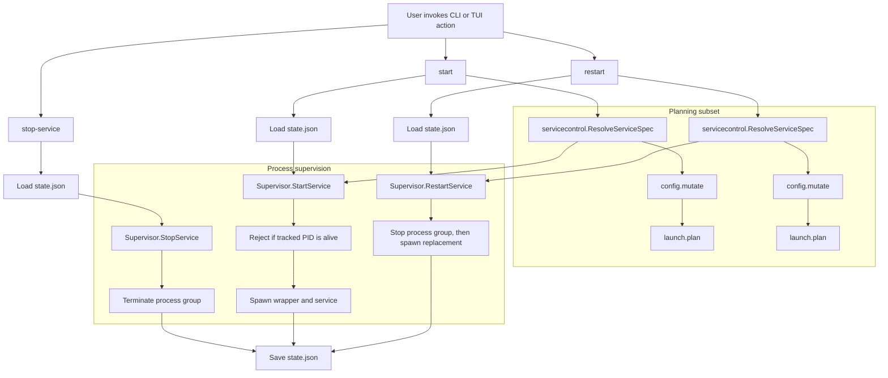

# devctl Service Lifecycle Controls: Start, Stop, Restart, and the Midstream Redesign

This report explains the implementation of individual service lifecycle controls in `devctl`: `stop-service`, `start`, `restart`, and the corresponding TUI actions. It also explains the redesign that happened midway through the work, when the initial implementation was corrected to avoid persisting raw service environments in `.devctl/state.json`.

The central idea is that service lifecycle control is not only process control. Stopping one process is a supervision problem. Starting or restarting one process is also a planning problem, because the command, working directory, health check, and environment for that process are produced by plugins. The final implementation keeps those two responsibilities separate: the service-control layer resolves a fresh service specification from plugins, and the supervisor starts or stops processes from that specification.

> [!summary]
> - `devctl` gained individual service lifecycle commands: `devctl stop-service <name>`, `devctl start <name>`, and `devctl restart <name>`.
> - The first implementation stored a launchable service spec in state so stopped services could be started again later.
> - Code review exposed two design problems: duplicate starts were possible, and raw service environment variables could be persisted.
> - The redesign removed raw env persistence and made `start`/`restart` re-run `config.mutate + launch.plan` to recover a fresh in-memory `ServiceSpec`.

## Why this feature exists

Before this work, `devctl` managed services as a group. A project could define multiple long-running services through plugins, and `devctl up` would start them together. `devctl down` would stop them together. That model is simple and useful for whole-environment setup, but it is too coarse for common development loops.

A developer often needs to replace one service while keeping the rest of the environment stable:

```bash
devctl restart api
```

or temporarily stop a noisy service without destroying the rest of the environment:

```bash
devctl stop-service worker
```

or bring back a previously stopped service:

```bash
devctl start worker
```

These commands are small at the interface level, but they cut across the two major subsystems in `devctl`:

1. The plugin pipeline produces service specifications.
2. The supervisor turns service specifications into running process groups and persisted state.

The implementation therefore had to answer two questions. First, how do we stop exactly one tracked process group and preserve a coherent state file? Second, when a service has been stopped, where does the complete launch specification come from when the user starts it again?

## The baseline architecture

A normal `devctl up` run follows a pipeline. It loads project configuration, starts plugin clients, asks plugins to mutate configuration, runs setup phases, obtains a launch plan, and then supervises the planned services.

```text
.devctl.yaml
  -> plugin discovery
  -> plugin clients
  -> config.mutate
  -> build.run
  -> prepare.run
  -> validate.run
  -> launch.plan
  -> supervisor
  -> .devctl/state.json
```

The important object produced by planning is `engine.ServiceSpec`:

```go
type ServiceSpec struct {
    Name    string            `json:"name"`
    Cwd     string            `json:"cwd,omitempty"`
    Command []string          `json:"command"`
    Env     map[string]string `json:"env,omitempty"`
    Health  *HealthCheck      `json:"health,omitempty"`
}
```

The supervisor converts each `ServiceSpec` into a `state.ServiceRecord`. The record contains the service name, PID, command, working directory, log paths, start time, exit information, and sanitized environment values for display.

```text
ServiceSpec                  ServiceRecord
-----------                  -------------
name               ----->    name
command            ----->    command
cwd                ----->    cwd
env                ----->    sanitized env for display
health             ----->    readiness behavior during start
process handle     ----->    pid
log files          ----->    stdout/stderr log paths
```

The state file is the bridge between commands. `devctl up` exits after launching services; a later `devctl status`, `devctl stop-service`, `devctl start`, or `devctl restart` is a new process. There is no resident devctl daemon that remembers the launch plan in memory. The state file is therefore the durable coordination point between CLI invocations.

## The first phase: stopping one service

Stopping one service is the cleanest part of the feature because it needs only persisted state and process supervision. The command path is:

```text
devctl stop-service <name>
  -> load state.json
  -> find service record by name
  -> stop process group for recorded PID
  -> mark service stopped in state
  -> save state.json
```

The corresponding supervisor method is conceptually:

```text
StopService(ctx, state, name):
    record = state.Services[name]
    if record does not exist:
        return error

    if record.PID <= 0:
        mark as stopped
        save state
        return

    terminate process group(record.PID)
    record.PID = 0
    record.ExitInfo = "stopped"
    save state
```

The implementation follows the same process-group rules used by full shutdown. Stopping a service must stop the tracked process tree, not only the immediate shell process. This is important because service commands often look like:

```bash
bash -c 'npm run dev'
```

or:

```bash
bash -c 'go run ./cmd/server'
```

The PID recorded by `devctl` may be the wrapper or shell process, while the useful work is performed by a child process. Process-group shutdown keeps `stop-service` aligned with `down`.

## The second phase: starting a stopped service

Starting one service is harder than stopping one service. A stopped service record can preserve the name, prior command, working directory, logs, and last PID, but it may not contain everything needed to launch the service safely. The complete launch input is the service specification produced by the plugin pipeline.

The first implementation solved this by persisting a `ServiceSpecRecord` inside each `ServiceRecord`. That meant the start path could avoid the plugin pipeline:

```text
devctl start <name>
  -> load state.json
  -> find service record
  -> reconstruct ServiceSpec from record.Spec
  -> supervisor starts process
  -> save state.json
```

This was attractive because it made start and restart local operations. The supervisor already had the necessary data, and `start` could work even if plugin planning was expensive.

The initial state shape was based on the idea that the state file should contain a restartable description of each service. The implementation added tests for state round-tripping and backward compatibility so older state files could still be read.

This design passed the first functional requirement. A user could stop `ticker`, start it again, and see a new PID while other services kept running.

## The third phase: restart as stop plus start

With single-service stop and start available, restart could be implemented as an ordered composition:

```text
RestartService(ctx, state, spec-or-name):
    StopService(ctx, state, name)
    StartService(ctx, state, spec-or-name)
```

At the CLI level:

```bash
devctl restart counter
```

should stop only `counter`, start only `counter`, and leave all other service records unchanged except for incidental status fields such as timestamps or health state.

The TUI feature followed the same model. The service dashboard already had actions for whole-environment control. The work added per-service stop and restart actions, routed through the same supervisor methods as the CLI. This matters because the TUI should not implement a separate lifecycle model. It should be another interface onto the same service-control behavior.

## Real validation with two services

A temporary test project under `/tmp/devctl-test` used an auto-discovered plugin that emitted two services: `counter` and `ticker`. The smoke test exercised the individual lifecycle operations against actual processes.

The sequence was:

```bash
devctl up

devctl restart counter

devctl stop-service ticker

devctl start ticker

devctl status

devctl down
```

The expected state transitions were:

| Step | `counter` | `ticker` |
|---|---|---|
| After `up` | Running with PID A | Running with PID B |
| After `restart counter` | Running with PID C | Still running with PID B |
| After `stop-service ticker` | Running with PID C | Stopped with PID 0 |
| After `start ticker` | Running with PID C | Running with PID D |
| After `down` | Stopped | Stopped |

This test was important because it validated the feature at the process boundary. Unit tests can verify method behavior, but they do not prove that process groups, log files, state writes, and command invocations work together under real shell processes.

## The first redesign pressure: duplicate starts

The first code review issue was direct: `StartService` should not start a service that is already running.

Without this guard, the following sequence could create an unmanaged process:

```bash
devctl up
devctl start api
```

If `api` was already alive, a naive start implementation would launch a second `api` process and then overwrite the state record with the second PID. The first process would still exist, but `devctl` would no longer track it. Future `stop-service api` or `down` operations would stop only the second process.

The fix is an invariant in `StartService`:

```text
if service has a tracked PID and that PID is alive:
    return an error
```

The command distinction becomes precise:

- `start` means start a service that is stopped or no longer alive.
- `restart` means intentionally replace a running service.

This invariant belongs in the supervisor, not only in the CLI. The TUI and any future caller should get the same safety property.

## The second redesign pressure: raw environment persistence

The larger review issue concerned secrets. The initial `ServiceSpecRecord` approach risked writing raw service environment variables to `.devctl/state.json`. A service environment can contain API keys, access tokens, database passwords, cloud credentials, or local secret paths. Even if the file is local, storing raw env in a project directory increases the chance that secrets are copied, inspected, logged, or accidentally committed.

There was already a distinction in the state layer: display env values can be sanitized or redacted. But a restartable raw `ServiceSpec` is different from display state. It requires exact env values, not redacted values. If those values are persisted, the state file becomes a secret store.

That forced a design choice. There are several possible ways to recover the env for a later start or restart:

| Option | Result |
|---|---|
| Persist raw env in state | Functionally simple but unsafe. |
| Read env from a supervisor process | Not available because devctl has no resident daemon. |
| Read `/proc/<pid>/environ` | Linux-specific, unavailable for stopped services, and still exposes secrets. |
| Re-run planning | Correct for the current architecture, but planning phases must be idempotent. |
| Introduce a daemon or restart-token protocol | Larger architectural change outside this PR. |

The final implementation chose re-planning.

## The final design after the redesign

After the redesign, `start` and `restart` no longer reconstruct raw launch specs from state. Instead, they resolve a fresh service spec by running the planning subset of the plugin pipeline.

```text
devctl start <name>
  -> load state.json
  -> run config.mutate
  -> run launch.plan
  -> select ServiceSpec named <name>
  -> StartService(ctx, state, spec)
  -> save state.json
```

```text
devctl restart <name>
  -> load state.json
  -> run config.mutate
  -> run launch.plan
  -> select ServiceSpec named <name>
  -> StopService(ctx, state, name)
  -> StartService(ctx, state, spec)
  -> save state.json
```

The phases intentionally run only planning operations:

- `config.mutate`
- `launch.plan`

They intentionally do not run:

- `build.run`
- `prepare.run`
- `validate.run`

This is the essential behavioral contract introduced by the redesign. Starting or restarting one service needs the current launch plan, but it should not redo the full environment setup pipeline.

## The new servicecontrol package

The redesign introduced `pkg/servicecontrol/resolve.go`. This package owns the planning-side operation required by `start` and `restart`.

The conceptual function is:

```go
func ResolveServiceSpec(ctx context.Context, opts ResolveOptions, serviceName string) (engine.ServiceSpec, error)
```

Its job is narrow:

```text
ResolveServiceSpec:
    load repository configuration
    discover and start plugin clients
    run config.mutate across plugins
    run launch.plan across plugins
    find the service with the requested name
    return that service spec
```

This package exists to preserve a clean boundary. The supervisor should not load repositories, discover plugins, or understand pipeline phases. The CLI and TUI need a service spec; `servicecontrol` knows how to produce one.

## The final component boundaries



The diagram shows the main architectural correction. Stop is purely a state-and-process operation. Start and restart are both state-and-planning operations. The planning subset produces an in-memory `ServiceSpec`; the supervisor consumes that spec and records the process outcome.

## State after the redesign

The state layer still records useful service metadata, but it no longer stores raw env inside the restart spec. The persisted service spec is limited to non-secret launch metadata such as name, command, working directory, and health information.

A representative record looks like this:

```json
{
  "name": "api",
  "pid": 42420,
  "command": ["go", "run", "./cmd/api"],
  "cwd": "/home/example/project",
  "env": {
    "API_TOKEN": "[REDACTED]"
  },
  "stdout_log": ".devctl/logs/api.stdout.log",
  "stderr_log": ".devctl/logs/api.stderr.log",
  "spec": {
    "name": "api",
    "cwd": "/home/example/project",
    "command": ["go", "run", "./cmd/api"]
  }
}
```

The important absence is the raw env map under `spec`. Tests now assert that a secret value used to launch a service does not appear in the serialized state file.

## Why re-planning is correct in devctl's current architecture

The strongest reason for re-planning is that a service spec is not necessarily local to one plugin. The effective configuration is built through a sequence of plugin mutations, and the launch plan is produced from that effective configuration.

A plugin can depend on values that another plugin inserted earlier during `config.mutate`. Therefore, restarting one service by asking only one plugin for its plan would be incomplete. The full planning subset preserves the same semantics as `devctl up` for service selection.

The final rule is:

```text
The source of launch truth is the plugin planning pipeline, not state.json.
```

State tells `devctl` what is currently tracked. Planning tells `devctl` how a service should be launched now.

## Consequence for plugin authors

The redesign establishes a new expectation for plugin phase behavior. Since `config.mutate` and `launch.plan` can run during `start` and `restart`, those phases must be safe to run more than once.

Good planning-phase behavior:

- Compute a service command from config.
- Add default config fields.
- Select a port or working directory from deterministic project settings.
- Return health checks and service metadata.

Bad planning-phase behavior:

- Create external resources.
- Mutate databases.
- Generate irreversible files.
- Start background processes.
- Perform expensive setup that belongs in `prepare.run`.

This distinction was present conceptually before the feature. Individual service lifecycle controls make it operationally visible.

## Tests added and hardened

The implementation added and adjusted tests across the state and supervisor layers.

The important test categories were:

| Test category | Purpose |
|---|---|
| State round-trip tests | Verify service records persist and reload correctly. |
| Backward compatibility tests | Ensure older state files remain readable. |
| Duplicate start test | Verify `StartService` fails when the tracked PID is alive. |
| Env non-persistence test | Verify raw secret env values are not serialized to `state.json`. |
| Readiness timeout cleanup test | Verify services are stopped when readiness does not complete. |

One CI failure appeared in `TestSupervisor_ReadinessTimeoutStopsServices`:

```text
open /tmp/devctl-supervise-test-490747441/pid.txt: no such file or directory
```

The test was racing the process startup path. The fix made the test more robust by increasing the readiness timeout and passing the PID-file path explicitly through an environment variable. The corrected test continued to validate the same behavior: if readiness times out, the supervisor must stop the service process rather than leaving it running.

## User-facing behavior

The final commands are:

```bash
devctl stop-service <service>
devctl start <service>
devctl restart <service>
```

Their behavior can be summarized as:

| Command | Requires service in state? | Re-runs planning? | Allows already-running service? | Main effect |
|---|---:|---:|---:|---|
| `stop-service` | Yes | No | Yes | Stops the tracked process group and sets PID to 0. |
| `start` | Yes | Yes | No | Starts a stopped/crashed service from a fresh spec. |
| `restart` | Yes | Yes | Yes | Stops the tracked service and starts a replacement from a fresh spec. |

`start` and `restart` require the service to be known in state. This prevents accidentally starting arbitrary services from a launch plan without an existing devctl environment context. The feature is individual lifecycle control for a tracked environment, not a separate service launcher.

## Implementation map

| Area | File | Role |
|---|---|---|
| CLI registration | `cmd/devctl/cmds/root.go` | Wires the new commands into the root command. |
| Stop command | `cmd/devctl/cmds/stop_service.go` | Loads state and calls `Supervisor.StopService`. |
| Start command | `cmd/devctl/cmds/start_service.go` | Resolves a fresh spec and calls `Supervisor.StartService`. |
| Restart command | `cmd/devctl/cmds/restart.go` | Resolves a fresh spec and calls `Supervisor.RestartService`. |
| Planning resolver | `pkg/servicecontrol/resolve.go` | Runs `config.mutate + launch.plan` and selects the named service. |
| Supervisor | `pkg/supervise/supervisor.go` | Implements single-service stop/start/restart process control. |
| State model | `pkg/state/state.go` | Persists records without raw service env in spec. |
| TUI actions | `pkg/tui/action_runner.go` | Routes per-service stop/restart through the same service lifecycle logic. |
| Supervisor tests | `pkg/supervise/supervisor_test.go` | Covers duplicate starts, env non-persistence, readiness cleanup. |
| State tests | `pkg/state/state_test.go` | Covers state compatibility and serialization behavior. |

## Commit history as a design narrative

The commit sequence shows the implementation moving from a direct respawn model to the final planning-aware model:

```text
70d90b0 feat(devctl): store ServiceSpec in state for individual service restart
8a41a37 feat(devctl): add single-service StopService/StartService/RestartService to supervisor
33ca243 feat(devctl): add restart and stop-service CLI commands
9b81ffb feat(devctl): implement ActionStop and per-service ActionRestart in TUI
d2d09e2 test(devctl): add state round-trip and backward compatibility tests
228fbf0 feat(devctl): add start command for starting previously stopped services
10a61c1 test(devctl): make readiness timeout supervisor test robust
ae537e9 fix(devctl): re-plan service specs for start and restart
7522f3d docs(devctl): document service start/restart re-planning behavior
```

The early commits built the feature around persisted specs. The later correction changed the source of restart truth from persisted specs to fresh planning output. That is the central redesign.

## What changed midway

The midpoint redesign can be stated precisely.

Before redesign:

```text
state.json contains enough raw service spec data to start the service again.
start/restart reconstruct ServiceSpec from state.
supervisor owns most of the restart behavior.
```

After redesign:

```text
state.json records tracked process state and non-secret metadata.
start/restart resolve ServiceSpec by re-running config.mutate + launch.plan.
servicecontrol owns planning resolution.
supervisor owns process control.
```

The new design has a stronger security property and a clearer boundary between planning and supervision. Its cost is that `start` and `restart` run plugin planning phases. That cost is acceptable because those phases are supposed to be idempotent and because it preserves correct plugin semantics without turning `state.json` into a secret store.

## Open design questions

This feature does not solve every service orchestration problem. It establishes a foundation.

The main open questions are:

- Should devctl eventually model service dependencies so restarting a database can optionally restart dependent services?
- Should there be a persistent daemon mode that can hold runtime-only service metadata in memory?
- Should plugins be able to declare that their planning phases are pure, expensive, or side-effectful?
- Should `start` support services present in the current launch plan but absent from state, or should that remain the responsibility of `devctl up`?

These are larger questions than PR #6. The current implementation keeps the feature narrow and preserves the existing devctl lifecycle model.

## Key points

- `stop-service` is a process-supervision operation based on persisted state.
- `start` and `restart` are both planning and supervision operations.
- The first implementation stored service specs in state to make restart local and simple.
- The redesign removed raw env persistence and made planning the source of launch truth.
- `StartService` now rejects duplicate starts when the tracked PID is alive.
- The TUI uses the same service lifecycle machinery as the CLI.
- Plugin planning phases now have a visible idempotency requirement because they run during individual service start/restart.

## Related source artifacts

- Repository: `/home/manuel/workspaces/2026-05-04/devctl-multiple-profiles/devctl`
- Ticket: `/home/manuel/workspaces/2026-05-04/devctl-multiple-profiles/devctl/ttmp/2026/05/04/DCTL-SERVICES--devctl-individual-service-start-stop-analysis-design-and-implementation-guide/`
- PR: https://github.com/go-go-golems/devctl/pull/6
- Companion note: [[ARTICLE - devctl Service Restart - Replanning Service Specs Without Persisting Secrets]]
