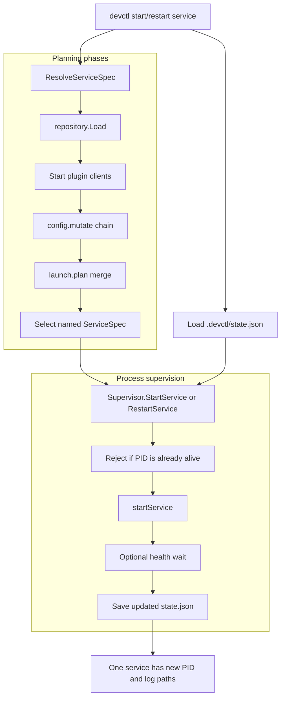

# devctl Service Restart: Replanning Service Specs Without Persisting Secrets

This note explains the service restart design added to `devctl`: how individual services can be stopped, started, and restarted without tearing down the whole development environment, why the first implementation changed after review, and why the final design re-runs the planning phases instead of storing raw environment variables in `state.json`.

The audience is a developer who understands Go and command-line tools but has not yet read the `devctl` codebase. The goal is to understand the architecture well enough to modify it safely.

> [!summary]
> - `devctl` originally had an all-or-nothing lifecycle: `up` started all services and `down` stopped all services.
> - Individual service control is implemented by combining persisted service state with freshly resolved service specs.
> - `devctl start` and `devctl restart` re-run `config.mutate` and `launch.plan`, then start only the selected service.
> - Raw service environment variables are not persisted in `state.json`; they exist only in memory during planning and process launch.

## Why this note exists

The service restart work began with a simple user need: restart the backend server without restarting the frontend dev server, database, mock API, or other services in a full-stack development environment. Before this change, the only reliable workflow was:

```bash
devctl down
devctl up
```

That workflow is correct but coarse. It restarts all supervised processes, recreates log streams, and re-runs the entire pipeline. For day-to-day development, a narrower operation is useful:

```bash
devctl restart api-server
```

The implementation is not just a small command wrapper. It touches the central boundary between the plugin planning system and the process supervision system. The difficult part is not sending `SIGTERM` to one PID. The difficult part is deciding where the replacement service specification comes from, especially when plugins compute service commands and environments dynamically.

## The existing devctl lifecycle

`devctl` delegates project-specific behavior to plugins. Each plugin is a process that speaks the devctl protocol over standard input and standard output. The core `devctl` binary starts these plugins, calls protocol operations, merges their results, and supervises the resulting services.

The simplified `up` path is:

```text
load .devctl.yaml
  -> discover plugins
  -> start plugin clients
  -> config.mutate
  -> build.run
  -> prepare.run
  -> validate.run
  -> launch.plan
  -> supervise services
  -> write .devctl/state.json
```

The important type is `engine.ServiceSpec`:

```go
type ServiceSpec struct {
    Name    string            `json:"name"`
    Cwd     string            `json:"cwd,omitempty"`
    Command []string          `json:"command"`
    Env     map[string]string `json:"env,omitempty"`
    Health  *HealthCheck      `json:"health,omitempty"`
}
```

A `ServiceSpec` is a plan, not a running process. It says what should be executed, where it should run, what environment should be applied, and how readiness should be checked. The supervisor converts that plan into a `state.ServiceRecord`, which includes the process PID and log paths.

```go
type ServiceRecord struct {
    Name      string            `json:"name"`
    PID       int               `json:"pid"`
    Command   []string          `json:"command"`
    Cwd       string            `json:"cwd"`
    Env       map[string]string `json:"env,omitempty"`
    StdoutLog string            `json:"stdout_log"`
    StderrLog string            `json:"stderr_log"`
    ExitInfo  string            `json:"exit_info,omitempty"`
    StartedAt time.Time         `json:"started_at,omitempty"`
    Spec      *ServiceSpecRecord `json:"spec,omitempty"`
}
```

The `Env` field in `ServiceRecord` is sanitized for display. Secret-looking keys are redacted. This is deliberate: `state.json` is useful for status and logs, but it should not become a plaintext secret store.

## The original difficulty: service specs are produced by a pipeline

Individual service restart would be simple if services were written directly in `.devctl.yaml`. In devctl, services are returned by plugins after a shared configuration mutation phase. The pipeline creates a dependency between plugins even when service names look independent.

The important sequence is:

```text
Plugin A: config.mutate(currentConfig) -> patch A
Plugin B: config.mutate(config + patch A) -> patch B
Plugin C: launch.plan(finalConfig) -> services
```

A later plugin can depend on configuration produced by an earlier plugin. This means `launch.plan` is not a pure function of one plugin's local settings. It is a function of the effective configuration after the full `config.mutate` sequence.

That observation rules out a common but incorrect shortcut: call only the plugin that originally produced the service. The merged launch plan does not preserve sufficient provenance for that to be correct, and even if it did, the plugin's output might depend on configuration established by other plugins.

The safe planning unit is the full planning path:

```text
all configured plugins
  -> config.mutate chain
  -> launch.plan merge
  -> select service by name
```

## The first implementation and the review correction

The first implementation stored enough information in `state.json` to respawn a service without re-running the plugin pipeline. The state record gained a `ServiceSpecRecord`, and the supervisor could reconstruct a service command from that stored record.

That design made restarts fast and simple, but it had a serious flaw: the stored service spec included raw environment variables. A service environment can contain API keys, database passwords, tokens, private paths, and credentials. Persisting those values in `.devctl/state.json` increases the risk of accidental disclosure.

A review on PR #6 identified two issues:

1. `StartService` could start a duplicate service if the service was already running.
2. Persisting raw `ServiceSpec.Env` in `state.json` was unsafe.

The first issue is a process-management invariant. Starting an already-running service would create a second process and then overwrite the tracked PID, leaving the original process unmanaged.

The second issue changes the architecture. The replacement service spec must be recovered without storing raw env values. The final implementation solves that by re-running the planning phases at start/restart time.

## The final design

The final design separates three responsibilities:

| Responsibility | Package / file | What it does |
|---|---|---|
| Service planning | `pkg/servicecontrol/resolve.go` | Re-runs `config.mutate + launch.plan` and selects one service. |
| Process supervision | `pkg/supervise/supervisor.go` | Starts, stops, and restarts processes from an `engine.ServiceSpec`. |
| State persistence | `pkg/state/state.go` | Records PIDs, logs, sanitized env, and non-secret service metadata. |

The resulting command behavior is:

```bash
devctl stop-service api-server
# Stop only api-server and set its PID to 0 in state.json.

devctl start api-server
# Re-run config.mutate + launch.plan, find api-server, start only api-server.

devctl restart api-server
# Stop only api-server, re-run config.mutate + launch.plan, start only api-server.
```

`devctl start` and `devctl restart` run only the planning phases:

- `config.mutate`
- `launch.plan`

They do not run:

- `build.run`
- `prepare.run`
- `validate.run`

This boundary matters. Plugin authors should treat `config.mutate` and `launch.plan` as idempotent planning phases. Destructive or expensive side effects belong elsewhere.

## Architecture diagram



The diagram shows why the design avoids secret persistence. The effective `ServiceSpec` is computed in memory and passed directly to the supervisor. The persisted state stores the result of supervision, not the raw input environment.

## The planning resolver

The new package `pkg/servicecontrol` owns the step that recovers a service spec. It deliberately stays outside the supervisor. The supervisor should not know how to load repositories or start plugin clients; its job is process management.

The resolver is shaped like this:

```go
type ResolveOptions struct {
    RepoRoot   string
    ConfigPath string
    Cwd        string
    DryRun     bool
    Strict     bool
    Timeout    time.Duration
}

func ResolveServiceSpec(ctx context.Context, opts ResolveOptions, serviceName string) (engine.ServiceSpec, error)
```

The algorithm is:

```text
ResolveServiceSpec(ctx, opts, serviceName):
    repo = repository.Load(opts)
    clients = repo.StartClients(factory)
    pipeline = engine.Pipeline{Clients: clients}

    conf = pipeline.MutateConfig({})
    plan = pipeline.LaunchPlan(conf)

    for service in plan.Services:
        if service.Name == serviceName:
            return service

    return error "service not found in launch plan"
```

This function is the code-level expression of the design decision. Start and restart do not depend on persisted raw env. They compute the effective env the same way `devctl up` computes it.

## The supervisor boundary

The supervisor was changed to accept a complete `engine.ServiceSpec` for start/restart:

```go
func (s *Supervisor) StartService(ctx context.Context, st *state.State, spec engine.ServiceSpec) error
func (s *Supervisor) RestartService(ctx context.Context, st *state.State, spec engine.ServiceSpec) error
```

This keeps the supervisor small. It does not resolve plugins. It does not know about `.devctl.yaml`. It receives a service spec and starts a process.

The first review comment produced an invariant inside `StartService`:

```go
if rec.PID > 0 && state.ProcessAlive(rec.PID) {
    return errors.Errorf("service %q is already running (pid %d)", name, rec.PID)
}
```

That guard prevents duplicate starts. If the service is alive, `devctl start service` fails. If the user wants a new process, the correct command is `devctl restart service`, which stops the tracked process before starting the replacement.

## State after the correction

The state file stores sanitized information for inspection and enough non-secret metadata to make status useful. It does not store raw service env.

```json
{
  "name": "api-server",
  "pid": 12345,
  "command": ["go", "run", "./cmd/api"],
  "cwd": "/repo",
  "env": {
    "API_KEY": "[REDACTED]"
  },
  "stdout_log": ".devctl/logs/api.stdout.log",
  "stderr_log": ".devctl/logs/api.stderr.log",
  "spec": {
    "name": "api-server",
    "cwd": "/repo",
    "command": ["go", "run", "./cmd/api"]
  }
}
```

The raw env is not present in `spec`. A test now asserts this property by starting a service with `API_KEY=secret-value`, saving state, reading `state.json`, and checking that `secret-value` does not appear.

## Command behavior

The user-visible commands now have distinct meanings:

| Command | Meaning | Planning phases run? | Process effect |
|---|---|---:|---|
| `devctl up` | Start a full environment. | Full pipeline | Starts all planned services. |
| `devctl down` | Stop a full environment. | No | Stops all tracked services and removes state. |
| `devctl stop-service name` | Stop one tracked service. | No | Stops one process group and sets PID to 0. |
| `devctl start name` | Start one stopped or crashed tracked service. | `config.mutate + launch.plan` | Starts one process from fresh spec. |
| `devctl restart name` | Replace one tracked service process. | `config.mutate + launch.plan` | Stops one process, then starts one process from fresh spec. |

The distinction between `start` and `restart` is important. `start` refuses to duplicate a running service. `restart` is explicit about replacement.

## Real test used during development

A real tmux test used a temporary devctl repo with an auto-discovered plugin under `plugins/devctl-multi-service`. The plugin returned two long-running services:

```text
counter: bash -c 'for i in $(seq 1 3600); do echo count $i; sleep 1; done'
ticker:  bash -c 'while true; do date +%s; sleep 2; done'
```

The test sequence was:

```bash
./devctl up --repo-root /tmp/devctl-test
./devctl restart counter --repo-root /tmp/devctl-test
./devctl stop-service ticker --repo-root /tmp/devctl-test
./devctl start ticker --repo-root /tmp/devctl-test
./devctl status --repo-root /tmp/devctl-test
./devctl down --repo-root /tmp/devctl-test
```

The important observation was that restarting `counter` changed only the `counter` PID. `ticker` kept running. Stopping `ticker` set only `ticker` to `pid=0`. Starting `ticker` created a new `ticker` PID while `counter` continued running.

## Failure modes and design rules

This feature creates new expectations for plugin authors and for future devctl changes.

### Planning phases must be idempotent

`config.mutate` and `launch.plan` can now run during `up`, `start`, and `restart`. They should compute configuration and service specs. They should not create files that cannot be overwritten, allocate external resources, mutate databases, or perform irreversible actions.

If a plugin needs side effects, it should use one of these locations:

- `build.run` for build artifacts.
- `prepare.run` for setup work that is intentionally part of environment startup.
- The service command itself for long-running runtime behavior.
- A plugin dynamic command for explicit user-triggered work.

### State is not the source of raw launch truth

The state file records what is running. It is not the canonical source for raw service env. This reduces secret exposure and makes start/restart reflect current planning inputs.

### Re-planning can change a service spec

If `.devctl.yaml`, plugin code, or environment variables change after `devctl up`, a later `devctl restart service` can start the service with a new command or env. This is a deliberate consequence of re-planning. It is usually useful in development, but it should be documented because it differs from the first kill-and-respawn design.

### There is no dependency graph yet

Restarting a database can temporarily break an API server that depends on it. The current implementation does not know dependency relationships. It operates on the named service only. A future dependency model would need explicit service dependency metadata in `ServiceSpec` or in a higher-level plan structure.

## Code locations

| File | Role |
|---|---|
| `/home/manuel/workspaces/2026-05-04/devctl-multiple-profiles/devctl/pkg/servicecontrol/resolve.go` | Re-runs `config.mutate + launch.plan` and selects the named service. |
| `/home/manuel/workspaces/2026-05-04/devctl-multiple-profiles/devctl/pkg/supervise/supervisor.go` | Starts, stops, and restarts process groups from service specs. |
| `/home/manuel/workspaces/2026-05-04/devctl-multiple-profiles/devctl/pkg/state/state.go` | Persists service records with sanitized env and non-secret metadata. |
| `/home/manuel/workspaces/2026-05-04/devctl-multiple-profiles/devctl/cmd/devctl/cmds/start_service.go` | Implements `devctl start <service>`. |
| `/home/manuel/workspaces/2026-05-04/devctl-multiple-profiles/devctl/cmd/devctl/cmds/restart.go` | Implements `devctl restart <service>`. |
| `/home/manuel/workspaces/2026-05-04/devctl-multiple-profiles/devctl/cmd/devctl/cmds/stop_service.go` | Implements `devctl stop-service <service>`. |
| `/home/manuel/workspaces/2026-05-04/devctl-multiple-profiles/devctl/pkg/tui/action_runner.go` | Implements per-service stop/restart for the TUI. |
| `/home/manuel/workspaces/2026-05-04/devctl-multiple-profiles/devctl/pkg/supervise/supervisor_test.go` | Tests duplicate start rejection, env non-persistence, readiness cleanup. |

## Commit sequence

The relevant commits are:

```text
70d90b0 feat(devctl): store ServiceSpec in state for individual service restart
8a41a37 feat(devctl): add single-service StopService/StartService/RestartService to supervisor
33ca243 feat(devctl): add restart and stop-service CLI commands
9b81ffb feat(devctl): implement ActionStop and per-service ActionRestart in TUI
d2d09e2 test(devctl): add state round-trip and backward compatibility tests
228fbf0 feat(devctl): add start command for starting previously stopped services
10a61c1 test(devctl): make readiness timeout supervisor test robust
ae537e9 fix(devctl): re-plan service specs for start and restart
7522f3d docs(devctl): document service start/restart re-planning behavior
```

The key architectural correction is `ae537e9`: start/restart no longer depend on raw env persisted in state.

## Key points

- Individual service control requires both process operations and service-spec recovery.
- The final implementation recovers service specs by re-running `config.mutate + launch.plan` and selecting the named service.
- The supervisor does not know how to plan services; it only starts and stops process groups.
- `state.json` stores sanitized env for display and non-secret metadata for inspection.
- `devctl start` refuses to start a service whose tracked PID is still alive.
- Plugin authors should keep `config.mutate` and `launch.plan` idempotent because these phases now run outside `devctl up`.

## Related source artifacts

- Ticket docs: `/home/manuel/workspaces/2026-05-04/devctl-multiple-profiles/devctl/ttmp/2026/05/04/DCTL-SERVICES--devctl-individual-service-start-stop-analysis-design-and-implementation-guide/`
- PR: https://github.com/go-go-golems/devctl/pull/6
