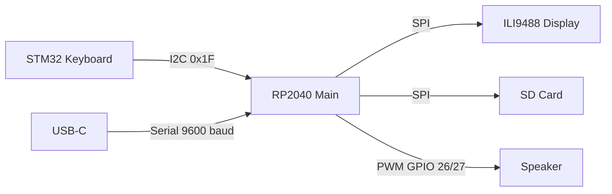
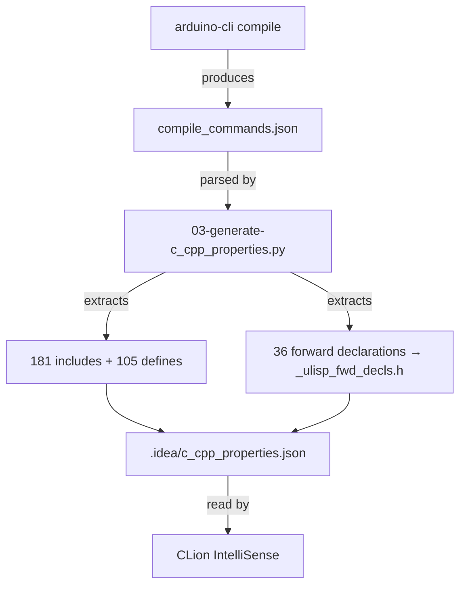

# uLisp PicoCalc — From Cross-Compilation to a Lisp Machine in Your Hand

This project turned a kit-built handheld computer — the Clockwork Pi PicoCalc, a $40 device with a Raspberry Pi Pico, a 320×320 color screen, and a physical keyboard — into a self-contained Lisp machine running uLisp 4.8f. Along the way we set up a full cross-compilation toolchain, discovered a native C99 port that compiles in one command on Linux, configured CLion for IntelliSense across 181 Arduino include paths, probed the keyboard's I2C registers from the REPL, drew spirographs, crashed the hardware by reading the wrong register, and wrote a navigable index of all 500+ functions in the 7,793-line source.

> [!summary]
> The project has three important identities:
> 1. A **working Lisp handheld** — uLisp 4.8f compiled, flashed, and running on the PicoCalc with graphics, keyboard, SD card, and sound
> 2. A **native development environment** — a 349 KB Linux binary compiled from the C99 port, running in tmux for fast test cycles
> 3. A **reproducible toolchain** — build scripts, CLion configuration generator, source index, and playbook that let anyone reproduce the setup from scratch

## Why this project exists

The PicoCalc ships with a BASIC interpreter. It is a capable little machine — RP2040 dual-core ARM at 200 MHz, 264 KB RAM, 2 MB flash, ILI9488 display, QWERTY keyboard, SD slot, speaker — but BASIC is not where the magic is. uLisp is a Lisp interpreter designed for exactly this class of microcontroller, and the author (David Johnson-Davies) maintains a dedicated PicoCalc fork at `technoblogy/ulisp-picocalc`. The goal was to get that running, understand every layer of the build, and create tooling so we can develop Lisp programs for it productively.

## Current project status

The firmware is built, flashed, and running on hardware. A native Linux REPL is available for host-side testing. CLion is configured for code navigation. The full source has been indexed and annotated. What remains is benchmarking, writing Lisp programs that exercise the hardware, and potentially contributing fixes back to the keyboard library.

## Project shape

```
2026-05-05--ulisp-picocalc/
├── ulisp-picocalc/              # technoblogy/ulisp-picocalc (v4.8f, 7793 lines)
├── ulisp-picocalc-sketch/       # Our sketch directory for compilation
├── ulisp-wasm/                  # eliot-akira/ulisp-wasm (C99 port)
├── PicoCalc/                    # clockworkpi/PicoCalc (hardware docs, keyboard firmware)
├── arduino_picocalc_kbd/        # cuu/arduino_picocalc_kbd (keyboard I2C library)
├── build/                       # Build output (compile_commands.json, .uf2, .bin)
├── .idea/                       # CLion IntelliSense config
├── _ulisp_fwd_decls.h           # 36 forward declarations for CLion
├── docs/
│   └── ulisp-picocalc-source-index.md   # 1000-line annotated source index
└── ttmp/.../scripts/            # Build scripts, config generators
```


## Architecture

The PicoCalc has three processors, and understanding why there are three is the first step to understanding the build:

1. **RP2040** (the main processor) — dual-core ARM Cortex-M0+ at 200 MHz, 264 KB SRAM, 2 MB flash. Runs our Lisp interpreter. Every uLisp function call, garbage collection cycle, and pixel draw happens here.

2. **STM32F103** (the keyboard scanner) — a dedicated microcontroller that constantly scans the key matrix and exposes pressed keys over I2C at address `0x1F`. The RP2040 asks "any keys?" when it's ready; the STM32 answers. This offload means the main processor never has to interrupt Lisp evaluation to poll for keys.

3. **ILI9488** (the display controller) — not a general-purpose processor, but a dedicated chip that understands pixel commands over SPI. When uLisp prints a character, TFT_eSPI looks up the font bitmap and writes pixels to this chip one transaction at a time.



The Lisp data flow on boot: `setup()` initializes the display, keyboard, and workspace; `loop()` calls `repl()` which reads from the keyboard (`gserial()` → `readmain()`), evaluates (`eval()`), prints the result (`printobject()` → `pserial()` → `Display()` → TFT), and loops forever.

---

## Implementation details

### Building the firmware: cross-compilation with arduino-cli

The firmware is a single `.ino` file — 7,793 lines of C++ that contains the entire Lisp system: reader, evaluator, printer, garbage collector, editor, ARM assembler, graphics engine, terminal emulator, and filesystem. There is no CMake, no Makefile beyond a one-line `arduino-cli compile` command, no other source files. The Arduino toolchain handles the rest.

**Toolchain setup.** We installed `arduino-cli` v1.4.1, added the `arduino-pico` board manager URL (`https://github.com/earlephilhower/arduino-pico/releases/download/global/package_rp2040_index.json`), and installed the RP2040 core v5.6.0. This core includes the GCC 14.3.0 cross-compiler (`arm-none-eabi-g++`), the pico-sdk headers, and all the Arduino-compatible libraries (SPI, Wire, LittleFS, etc.).

**Library patching.** TFT_eSPI v2.5.34 was installed via `arduino-cli lib install`, but it does not know which display is connected. The PicoCalc uses an ILI9488 on GPIO 10–15 via SPI1 at 25 MHz with BGR color order. Two files must change:

1. Copy `Setup60_RP2040_ILI9488.h` (from the ulisp-picocalc repo) into `~/Arduino/libraries/TFT_eSPI/User_Setups/`
2. Edit `~/Arduino/libraries/TFT_eSPI/User_Setup_Select.h`: comment out the default `#include <User_Setup.h>` and add `#include <Setup60_RP2040_ILI9488.h>`

Missing either step produces no error message — the display simply stays blank. This is the number-one gotcha in the build.

**The keyboard library.** Cloned `cuu/arduino_picocalc_kbd` into `~/Arduino/libraries/`. This speaks I2C to the STM32 keyboard scanner. No patching needed — it works out of the box with BIOS 1.2.

**The build command:**

```bash
arduino-cli compile \
    --fqbn rp2040:rp2040:rpipico \
    --build-path ./build \
    --warnings all \
    ./ulisp-picocalc-sketch
```

This produces `build/compile_commands.json` (the compilation database), `build/sketch/ulisp-picocalc-sketch.ino.cpp` (the Arduino-preprocessed source with forward declarations), and the firmware: `build/ulisp-picocalc-sketch.ino.uf2` at 460,800 bytes.

The RP2040 core uses GCC extensions heavily: `-iprefix` to set a prefix for hundreds of pico-sdk include directories, and `@file` response files (`platform_def.txt`, `platform_inc.txt`, `core_inc.txt`) to pass flags that would exceed the shell's command-line length limit. These extensions are invisible in normal Arduino IDE usage but matter deeply when you try to make another tool (like CLion) understand the build.

**Memory layout.** The build reports: 211,448 bytes (10%) program, 193,800 bytes (73%) dynamic memory. The dynamic memory is dominated by `object Workspace[22280]` — 22,280 Lisp objects at 8 bytes each = 178,240 bytes. That is the Lisp heap. It leaves about 68 KB for stack and other globals.


### Native Linux uLisp: one command, zero dependencies

The user asked for a version compiled for the host PC — not the RP2040 target. Research led to `eliot-akira/ulisp-wasm`, a community monorepo that is far more than its name suggests. It contains a pure C99 port of the uLisp core, a WebAssembly build for browsers, a Node.js runtime, a Zig auto-translation, and mirrors of all official uLisp sources.

The native build requires exactly one command:

```bash
clang -std=c99 -lm -O3 \
    -D_DEFAULT_SOURCE -D_XOPEN_SOURCE -D__HAS_RANDOM__=1 \
    -o build/ulisp-cli \
    -I c99 c99/ulisp.c c99/bestline.c
```

Zero warnings. 349 KB binary. It runs immediately — arithmetic, factorial, fibonacci, closures, tail-call optimization, floating point, strings. The C99 port replaces Arduino calls with POSIX: `Serial.print` → `printf`, `delay` → `nanosleep`. The workspace is 65,536 objects (8× the PicoCalc's 23,000) — no memory pressure on a desktop.

This gives us a development workflow: write and test Lisp code on the host at native speed, then deploy to the PicoCalc via UF2 flash. The build script is at `ttmp/.../scripts/02-build-ulisp-native-linux.sh`.

### Hardware testing: serial console, graphics, and I2C

Connecting the PicoCalc via USB-C gave us a serial console on `/dev/ttyUSB0` at 9600 baud. We launched `screen` in a tmux session, sent a newline, and the uLisp prompt appeared: `22280>` — the workspace size matching our build exactly (23,000 − 720 SD card = 22,280 objects).

We drew geometric shapes from the REPL: concentric rectangles, circles via midpoint algorithm, spirograph curves using parametric equations, diamonds, colored grids. Each `(draw-pixel ...)` is an individual SPI transaction — a full spirograph (3,600 points) takes a few seconds. The examples are saved in `ttmp/.../examples/01-geometric-shapes.lisp`.

Then we probed the keyboard's I2C registers. The keyboard sits at address `0x1F` on `Wire1` (I2C1, GP6/GP7), but uLisp routes addresses ≥ 128 to Wire1 — so the keyboard must be accessed at `#x9F`, not `#x1F`. This quirk is not documented anywhere; we discovered it by reading the source (`Wire1.setSDA(6); Wire1.setSCL(7); pc_kbd.begin(0x1f,&Wire1);` at line 7320, and the `with-i2c` routing logic at line 3151).

We identified our keyboard as **BIOS 1.2** (the VER register returns 0, meaning the version field was not implemented in that revision). We turned on both backlights (display: register `0x05`, keyboard: register `0x0A`, values 0–255).

**The crash.** During the register dump, reading register `0x08` (RST — the keyboard reset register) triggered a reset of the STM32 keyboard processor. The I2C bus hung and the uLisp REPL froze. The PicoCalc needed a power cycle. This was the one hard failure of the session. Register `0x08` is now marked as dangerous in all our documentation.


### Configuring CLion for Arduino development

Making CLion's IntelliSense work on an Arduino `.ino` project presented three specific challenges, each with its own solution.

**Challenge 1: No CMake, no `compile_commands.json` awareness.** CLion's native build system is CMake. Arduino projects have no `CMakeLists.txt`. Instead, `arduino-cli compile` produces a `compile_commands.json` that captures the exact compiler flags for every source file — 240 entries covering the sketch, core, and all libraries. This file is the single source of truth for the build configuration.

The solution: `.idea/compdb.xml` points CLion at `build/compile_commands.json`, and `.idea/c_cpp_properties.json` provides the explicit include paths and defines that CLion's IntelliSense engine needs. The latter is generated by a script.

**Challenge 2: `-iprefix` and `@file` response files.** The RP2040 core passes hundreds of include directories using GCC extensions. `-iprefix` sets a prefix path that the compiler automatically searches under. `@platform_def.txt`, `@platform_inc.txt`, and `@core_inc.txt` are response files containing additional `-I` and `-D` flags. CLion's IntelliSense parser does not expand either of these.

The solution: `scripts/03-generate-c_cpp_properties.py` reads `compile_commands.json`, parses the `@file` response files line by line, walks the pico-sdk tree to discover all `*/include` directories, and produces a `.idea/c_cpp_properties.json` with **181 include paths** and **105 defines**. After a build, running this script regenerates the configuration to match.

**Challenge 3: Forward references in the `.ino`.** Arduino `.ino` files are not valid C++. The Arduino builder preprocesses them by generating forward declarations for every function and inserting them before the first function body. A 7,793-line `.ino` becomes an 8,721-line `.cpp` with 462 forward declarations injected. CLion parses the raw `.ino` without this preprocessing, so calls to functions defined later (like `pserial` at line 6976 being called from line 293) show as unresolved.

The initial fix extracted all 462 Arduino-generated prototypes into a forced-include header. But analysis showed that only **36 of those 462** are actually needed — functions that are called before their definition. The generator script now scans the `.ino` to find forward-referenced functions and extracts only those 36 prototypes into `_ulisp_fwd_decls.h`, which is listed as a `forcedInclude` in `c_cpp_properties.json`.

The complete configuration pipeline:



A playbook documenting the full CLion setup process (12 steps, with troubleshooting for every common failure mode) is at `ttmp/.../design/03-playbook-clion-for-arduino-picocalc-development.md`.


### Source documentation: mapping the 7,793-line monolith

The uLisp PicoCalc source is a single `.ino` file containing 501 function definitions. To make it navigable, we wrote `docs/ulisp-picocalc-source-index.md` — a 1,000-line annotated index organized into 28 sections. Each section lists every function with its line number and a one-line description. The sections are grouped by responsibility: error handling, memory management, object constructors, symbol interning, image persistence, tracing, type checking, radix-40 encoding, equality, arithmetic, arrays, strings, environments and closures, I/O streams, pretty printing, editor and ARM assembler, special forms, tail-call forms, built-in functions (list ops, arithmetic, comparison, strings, bitwise, I/O, hardware, graphics), data tables, the evaluator, the printer, the terminal emulator, the reader, and the entry points.

The index also includes textbook-style explanatory paragraphs for each section — what the code does, why it exists, and how it connects to the rest of the system. It was uploaded to reMarkable for offline reading.

### Key technical findings

| Finding | Detail |
|---------|--------|
| **Keyboard BIOS** | Version 1.2 (VER register = 0) — fully compatible with uLisp |
| **I2C routing** | Keyboard at address `0x1F` on Wire1 — must use `#x9F` in uLisp (addresses ≥ 128 route to Wire1) |
| **Dangerous register** | `0x08` (RST) crashes the keyboard MCU — never read or write it |
| **Display backlight** | I2C register `0x05`, value 0–255 |
| **Keyboard backlight** | I2C register `0x0A`, value 0–255 |
| **Workspace** | 22,280 objects (178 KB) on RP2040 Pico — 73% of RAM |
| **UF2 overhead** | Exactly 2× the raw binary (256 payload bytes per 512-byte UF2 block) |
| **Forward declarations** | Arduino injects 462 prototypes; only 36 are actually needed for CLion |
| **Native uLisp** | 65,536 objects, compiles with one `clang` command, zero dependencies |
| **Core version** | RP2040 core v5.6.0 compiles uLisp fine despite docs testing with v4.5.0 |

## Important project docs

| Document | Location |
|----------|----------|
| Build script | `ttmp/.../scripts/01-compile-ulisp-picocalc.sh` |
| Native build script | `ttmp/.../scripts/02-build-ulisp-native-linux.sh` |
| CLion config generator | `ttmp/.../scripts/03-generate-c_cpp_properties.py` |
| Forward-decl extractor | `ttmp/.../scripts/04-extract-forward-declarations.py` |
| CLion setup playbook | `ttmp/.../design/03-playbook-clion-for-arduino-picocalc-development.md` |
| Source index (annotated) | `docs/ulisp-picocalc-source-index.md` |
| Investigation diary | `ttmp/.../reference/01-diary.md` |
| Postmortem | `ttmp/.../reference/04-postmortem.md` |
| Deep Q&A | `ttmp/.../reference/03-questions-and-deep-answers.md` |
| Geometric shapes example | `ttmp/.../examples/01-geometric-shapes.lisp` |
| I2C keyboard example | `ttmp/.../examples/02-i2c-keyboard.lisp` |
| Textbook build guide | `ttmp/.../reference/02-building-ulisp-picocalc-guide.md` |

All 19 web source documents are archived in `ttmp/.../sources/`.

## Open questions

- **BIOS 1.4/1.6 compatibility** — The keyboard firmware has evolved through three versions. BIOS 1.4 changed the I2C protocol and broke uLisp and MicroPython. BIOS 1.6 may have fixed this. We have not tested either. The `arduino_picocalc_kbd` library's register map diverges from the firmware source at register `0x0C`.
- **Core version mismatch** — We built with RP2040 core v5.6.0; the docs tested with v4.5.0. No issues seen so far, but benchmarks against the reported uLisp 4.7b numbers would confirm performance parity.
- **73% RAM usage** — The Lisp workspace uses 73% of the RP2040's 264 KB RAM. This leaves ~68 KB for stack and globals. Enough for normal use, but deeply recursive programs or large string operations could hit the limit.

## Near-term next steps

- **Run benchmarks** from the archived forum posts and compare against reported numbers
- **Test SD card and LittleFS** — `(directory)` and `(save-image)` to verify persistent storage
- **Save a screenshot** using `(save-bmp "test.bmp")` to capture the geometric shapes
- **Write Lisp test suites** that run on native Linux, then port to PicoCalc
- **Explore the WASM playground** at `eliot-akira.github.io/ulisp-wasm` for interactive tutorials

## KB reviews

- [[KB-PLAYBOOK-TRIAL - Intern Reports for 6 Projects]] (2026-05-11) — concept extraction + classification; C99 native port at 2/3, TFT_eSPI patching at 2/3, deviates from ESP-IDF patterns

## Related KB entries — the *other* firmware architecture we use (not this one; this project uses Arduino-cli instead of ESP-IDF)

**Tribal candidates** (our-specific patterns not yet at 3-project threshold):
- C99 native port for host testing (2/3) — compile a host-side REPL for fast iteration, then deploy to target via UF2; seen in uLisp PicoCalc, Smalltalk-80 VM (partial)
- TFT_eSPI patching for RP2040 (2/3) — two-file configuration dance (User_Setups + Setup_Select) with the "blank screen with no error" gotcha; any RP2040 + TFT_eSPI project hits this
- I2C address routing quirk (1/3) — addresses ≥ 128 route to Wire1 in uLisp; keyboard must use `#x9F` not `#x1F`; discovered by reading source, not documented anywhere
- Dangerous register gotcha (1/3) — reading keyboard I2C register `0x08` (RST) crashes the STM32 MCU and hangs the I2C bus

**On-Ramp candidates** (lookupable concepts our angle is missing, not yet at 5-project threshold):
- Arduino-cli cross-compilation (2/5) — headless Arduino builds from the command line, no IDE; our specific workflow with reproducible scripts

## Project working rule

When resuming this project: read the diary at `ttmp/.../reference/01-diary.md` first, check the postmortem at `ttmp/.../reference/04-postmortem.md` for the full arc, and use the source index at `docs/ulisp-picocalc-source-index.md` to navigate the source. The CLion playbook at `ttmp/.../design/03-playbook-clion-for-arduino-picocalc-development.md` covers IDE setup from scratch. All build scripts are in `ttmp/.../scripts/` with numeric prefixes for execution order.
