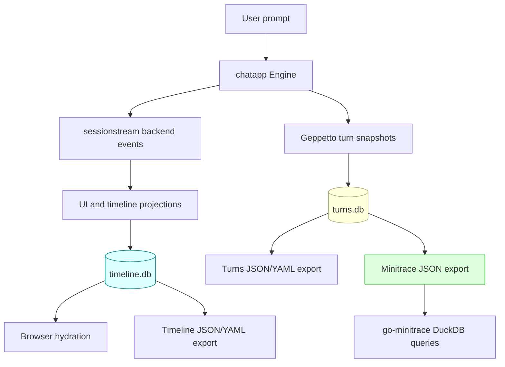

# Conversation Export Pipelines: Pinocchio, CoinVault, Timeline State, Turns, and Minitrace

A chat application becomes much easier to debug when its state can leave the browser. Pinocchio and CoinVault already had durable pieces of state: sessionstream timeline entities for UI hydration, and Geppetto turns for model replay. What they lacked was a clear operator path from a visible conversation to a file: a JSON or YAML export for inspection, and a minitrace export for deeper analysis.

This article is a technical deep dive into the export pipeline added for COINVAULT-038. It explains the data model, the package boundary, the route design, the minitrace conversion, and the failure modes that shaped the implementation.

> [!summary]
> Conversation export has two different source streams: **timeline entities** explain what the UI renders, while **turns** explain what the model saw and produced. The implementation keeps those sources separate, adds a shared `pinocchio/pkg/chatapp/export` package, wires thin HTTP endpoints in Pinocchio and CoinVault, and emits `.minitrace.json` from file-backed turns databases.

## Why this note exists

The phrase “download conversation” hides three different questions.

The first question is: what did the user see? That is the timeline question. Sessionstream stores hydratable timeline entities: chat messages, tool calls, tool results, reasoning rows, AgentMode entities, and CoinVault widget entities. If a browser reloads and the conversation reappears, it comes from this timeline state.

The second question is: what did the model see? That is the turns question. Geppetto turns are accumulator snapshots containing blocks: user text, assistant text, reasoning, tool calls, tool results, and metadata. This is the state needed for replay and multi-turn context.

The third question is: how can we analyze many sessions? That is the minitrace question. Minitrace has a normalized session schema designed for cross-agent analysis with DuckDB. It knows about turns, tool calls, timing, quality tiers, annotations, and framework metadata.

A good export system answers all three without pretending they are the same data structure.

## The mental model

The most important distinction is between **presentation state** and **inference state**. Timeline entities are presentation state. Turns are inference state. They overlap, but they do not replace one another.

Timeline entities are optimized for a UI. They have kinds, IDs, created ordinals, last-event ordinals, tombstones, and protobuf payloads. Their job is to say: “Here is the current durable thing the browser should render.”

Turns are optimized for model execution. They are snapshots of a growing accumulator. Their job is to say: “Here is the conversation state that the runtime can continue from.”

Minitrace is optimized for analysis. Its job is to say: “Here is a normalized transcript and tool trace that a query engine can compare against other sessions.”



The export implementation follows this diagram. It does not try to synthesize turns from timeline entities, and it does not try to synthesize timeline state from turns. Each export reads the source that owns the relevant truth.

## Architecture

The reusable package lives in Pinocchio:

```text
pinocchio/pkg/chatapp/export/
├── types.go       # formats, views, options, export structs, typed errors
├── service.go     # timeline and turns JSON/YAML export
├── render.go      # JSON/YAML/minitrace render helpers
└── minitrace.go   # file-backed turns.db -> minitrace-compatible JSON
```

Pinocchio owns this shared code because `chatapp` is the common layer used by both Pinocchio web-chat and CoinVault. CoinVault should not duplicate turn rendering, protobuf conversion, minitrace shaping, or error mapping. It should provide only the application-specific pieces: route mounting, authorization, and UI placement.

The shared service has a deliberately small shape:

```go
type Service struct {
    snapshotProvider SnapshotProvider
    turnStore        chatstore.TurnStore
    turnsDBPath      string
    now              func() time.Time
}
```

The `SnapshotProvider` interface is important. The export package does not need to know about all of `chatapp.Service`; it only needs the ability to ask for a sessionstream snapshot.

```go
type SnapshotProvider interface {
    Snapshot(ctx context.Context, sid sessionstream.SessionId) (sessionstream.Snapshot, error)
}
```

That one seam makes the package testable. Unit tests can provide a fake snapshot provider, while real servers pass the actual `chatapp.Service`.

## Endpoint shape

Both Pinocchio and CoinVault expose the same route family:

```text
GET /api/chat/sessions/{id}/timeline
GET /api/chat/sessions/{id}/turns
GET /api/chat/sessions/{id}/export
```

The query parameters select format and view:

```text
?format=json
?format=yaml
?format=minitrace
?view=entities
?download=true
?phase=final
```

The first implementation supports:

- timeline export as JSON/YAML, using the `entities` view;
- turns export as JSON/YAML, using `TurnStore.List()`;
- turns export as `.minitrace.json`, using a file-backed `turns.db`;
- full export as a JSON/YAML bundle of timeline plus turns.

The routes are thin. They parse query options, call the shared export service, render the result, and optionally set a download filename.

```go
func (s *Server) handleTurnsExport(w http.ResponseWriter, r *http.Request, sid sessionstream.SessionId) {
    opts := parseExportOptions(r)

    var exported any
    if opts.Format == export.FormatMinitrace {
        exported, err = s.exportService.ExportTurnsMinitrace(r.Context(), string(sid), opts)
    } else {
        exported, err = s.exportService.ExportTurns(r.Context(), string(sid), opts)
    }

    writeRenderedExport(w, r, exported, opts.Format, "pinocchio-...-turns")
}
```

CoinVault uses the same pattern, but it verifies conversation ownership before export:

```go
func (s *CanonicalServer) verifyExportAllowed(r *http.Request, sid sessionstream.SessionId) error {
    if s.authorizer != nil {
        return s.authorizer.Verify(r.Context(), string(sid))
    }
    return nil
}
```

This matters because export is a read operation, and it should match hydration semantics. If a user cannot hydrate a conversation, they should not be able to download it either.

## Timeline export

Timeline export starts from the sessionstream snapshot:

```go
snap, err := snapshotProvider.Snapshot(ctx, sessionstream.SessionId(sessionID))
```

Each timeline entity becomes an export row:

```go
type EntityExport struct {
    Kind             string
    ID               string
    CreatedOrdinal   uint64
    LastEventOrdinal uint64
    Tombstone        bool
    Payload          any
}
```

The protobuf payload is converted through `protojson` using proto field names. This is intentionally close to the wire format but readable enough for operators.

```go
body, err := protojson.MarshalOptions{
    EmitUnpopulated: false,
    UseProtoNames:   true,
}.Marshal(msg)
```

A timeline export is the answer to: “What durable UI state exists for this session?” It is not the answer to: “What prompt will the model replay?” That distinction keeps the design honest.

## Turns export

Turns export starts from `chatstore.TurnStore.List()`:

```go
rows, err := turnStore.List(ctx, chatstore.TurnQuery{
    ConvID: sessionID,
    Phase:  "final",
    Limit:  1000,
})
```

The store returns newest-first snapshots, which is useful for debug APIs but not for export reading. The exporter sorts them oldest-first:

```go
sort.SliceStable(turns, func(i, j int) bool {
    if turns[i].CreatedAtMs != turns[j].CreatedAtMs {
        return turns[i].CreatedAtMs < turns[j].CreatedAtMs
    }
    return turns[i].TurnID < turns[j].TurnID
})
```

The JSON/YAML turns export intentionally keeps the raw YAML payload. That payload is a Geppetto turn snapshot. Operators sometimes need to inspect exactly what was persisted, not a lossy pretty rendering.

```yaml
session_id: smoke-session
phase: final
turns:
  - turn_id: turn-1
    runtime_key: gpt-5-mini
    created_at: "2026-02-02T02:40:00Z"
    payload: |
      id: turn-1
      blocks:
        ...
```

## Minitrace export

Minitrace export is the most interesting piece because it changes shape. A Geppetto turn store is an accumulator store. A minitrace session is a transcript. Converting between them requires choosing canonical snapshots and extracting deltas.

The converter reads the normalized SQLite tables directly:

```sql
SELECT
  t.conv_id,
  t.session_id,
  t.turn_id,
  t.turn_created_at_ms,
  t.runtime_key,
  t.inference_id,
  m.phase,
  m.snapshot_created_at_ms
FROM turns t
JOIN turn_block_membership m
  ON m.conv_id = t.conv_id
 AND m.session_id = t.session_id
 AND m.turn_id = t.turn_id
WHERE t.conv_id = ?
```

For each persisted turn, it chooses the best available phase:

```text
final
post_tools
post_inference
pre_inference
```

This preference list encodes the idea that a completed turn is better than an intermediate snapshot, but an intermediate snapshot is still better than no export.

The next problem is duplication. Accumulator snapshots repeat old blocks. If turn 2 contains all of turn 1 plus a new assistant block, a naive converter would emit turn 1 twice. The exporter avoids this by computing a block delta between each canonical snapshot and the previous canonical snapshot.

```go
func minitraceDelta(previous, current []Block) []Block {
    seen := map[string]int{}
    for _, block := range previous {
        seen[fingerprint(block)]++
    }

    var out []Block
    for _, block := range current {
        fp := fingerprint(block)
        if seen[fp] > 0 {
            seen[fp]--
            continue
        }
        out = append(out, block)
    }
    return out
}
```

The block fingerprint includes kind, role, ID, payload, and metadata. This is not a semantic diff. It is a pragmatic structural diff that says: “Do not emit the exact same block material twice.”

The resulting minitrace file has the shape expected by go-minitrace:

```json
{
  "id": "smoke-session",
  "schema_version": "minitrace-v0.2.0",
  "provenance": {
    "source_format": "pinocchio-turns-sqlite-v1"
  },
  "environment": {
    "agent_framework": "pinocchio",
    "model": "gpt-5-mini"
  },
  "turns": [...],
  "tool_calls": [...],
  "metrics": {
    "turn_count": 2,
    "tool_call_count": 0
  }
}
```

## Why not import go-minitrace directly?

The first design proposed reusing `go-minitrace/pkg/adapters/turnsdb` directly. That package already knows how to convert Pinocchio turns DBs, and reusing it would avoid drift.

The practical problem is dependency shape. `go-minitrace` is an application module with CLI, DuckDB, query runtime, JavaScript command support, and web UI dependencies. Pulling that entire module into Pinocchio and CoinVault just to serve a debug download would make the chat runtime depend on an analysis tool.

The first pass therefore implements a smaller minitrace-compatible converter inside `pinocchio/pkg/chatapp/export`. This is not the ideal final architecture; it is the least risky architecture for shipping the endpoint without expanding the dependency graph.

The better long-term architecture is a tiny shared library:

```text
go-minitrace/pkg/adapters/turnsdbcore
```

or:

```text
sessionstream/geppetto turns export helper
```

with an API like:

```go
func ConvertTurnsDB(ctx context.Context, db *sql.DB, convID string) (*minitrace.Session, error)
```

Then both go-minitrace and Pinocchio can call the same core without either importing the other's CLI surface.

## Validation

The smoke test used a temporary Pinocchio app server and a real file-backed turns DB. It downloaded the minitrace file through HTTP, then queried it with go-minitrace.

The smoke command was:

```bash
/home/manuel/code/wesen/corporate-headquarters/go-minitrace/go-minitrace query duckdb \
  --archive-glob '/tmp/coinvault038-export-smoke/*.minitrace.json' \
  --preset session-list \
  --output json
```

The query returned:

```json
[
  {
    "duration_s": 0,
    "framework": "pinocchio",
    "id": "smoke-session",
    "model": "gpt-5-mini",
    "read_ratio": null,
    "source_format": "pinocchio-turns-sqlite-v1",
    "started_at": "2026-02-02T02:40:00Z",
    "title": "Explain CoinVault export smoke testing.",
    "tools": 0,
    "turns": 2
  }
]
```

That result is the important end-to-end proof. The browser-facing endpoint emits a file that the external analysis tool can read.

## Failure modes and sharp edges

### A file-backed turns DB is required

Minitrace conversion currently reads the SQLite database directly. If a server is configured only with an opaque `--turns-dsn`, the exporter may not know which file to open. The endpoint therefore returns a conflict unless `--turns-db` was provided.

```text
409 Conflict
minitrace export requires a file-backed turns database
```

This is better than guessing. Debug exports should fail explicitly when their source is unavailable.

### CoinVault depends on unreleased Pinocchio code

CoinVault imports the new shared package:

```go
github.com/go-go-golems/pinocchio/pkg/chatapp/export
```

Workspace-mode tests pass, but CoinVault's pre-commit hook runs `GOWORK=off`. In that mode it sees the released Pinocchio module version, which does not yet contain the new package. Until Pinocchio is released or CoinVault's dependency is updated/replaced, CoinVault commits touching this path require a known workaround.

### Minitrace parity is good enough, not perfect

The local converter emits minitrace-compatible JSON and passes query smoke testing. It does not yet replicate every detail of go-minitrace's adapter, especially around richer tool context and annotations. That is acceptable for the first export feature, but it is the main reason a shared converter library remains desirable.

## Implementation sequence

The implementation worked because it followed the dependency graph rather than the UI surface.

1. Build the reusable export package.
2. Add Pinocchio HTTP endpoints.
3. Add CoinVault HTTP endpoints and owner checks.
4. Implement real minitrace conversion.
5. Add endpoint-level success tests.
6. Run an external go-minitrace query smoke.
7. Only then add frontend buttons.

Starting with the frontend would have been backwards. A button is easy; deciding what file it downloads is the hard part.

## Key commits

Pinocchio:

- `f779a0e feat(chatapp): add conversation export core`
- `52f25ee feat(web-chat): expose conversation export endpoints`
- `8252b5d feat(chatapp): export turns as minitrace`
- `92f1eb7 test(web-chat): cover minitrace export response`

CoinVault:

- `884308c feat(webchat): expose conversation export endpoints`
- `e3f37df test(webchat): cover minitrace export response`

Ticket documentation:

- `COINVAULT-038` under `2026-03-16--gec-rag/ttmp/2026/05/06/`

## Working rules

- Export timeline state from sessionstream snapshots.
- Export replay/debug turns from `chatstore.TurnStore`.
- Export minitrace from the normalized turns SQLite tables, not from pretty YAML snapshots.
- Keep app-specific authorization at the app boundary.
- Keep transformation and rendering code in a reusable package.
- Make missing persistence explicit; never silently export an empty success file when the configured source is unavailable.

## Near-term next steps

The backend is now far enough along for frontend work. The next useful increment is small: add direct download buttons before building a modal viewer.

For Pinocchio:

```text
Export ▾
  Download timeline JSON
  Download turns YAML
  Download turns minitrace
```

For CoinVault:

```text
Actions ▾
  Download timeline JSON
  Download turns YAML
  Download minitrace
```

After that, a viewer modal can make YAML inspection pleasant. But the critical path is already in place: backend endpoints return useful files, and the minitrace file can be queried.

## Related files

- `pinocchio/pkg/chatapp/export/`
- `pinocchio/cmd/web-chat/app/server_export.go`
- `pinocchio/cmd/web-chat/app/server_test.go`
- `2026-03-16--gec-rag/internal/webchat/sessionstream_export.go`
- `2026-03-16--gec-rag/internal/webchat/sessionstream_server_test.go`
- `2026-03-16--gec-rag/ttmp/2026/05/06/COINVAULT-038--add-timeline-and-turns-download-view-endpoints-with-yaml-json-markdown-export/`
