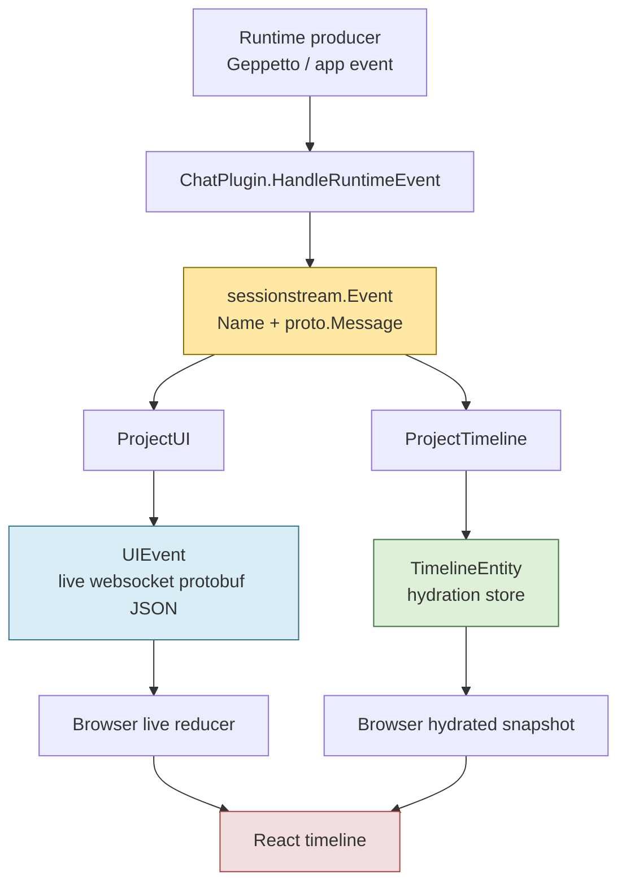
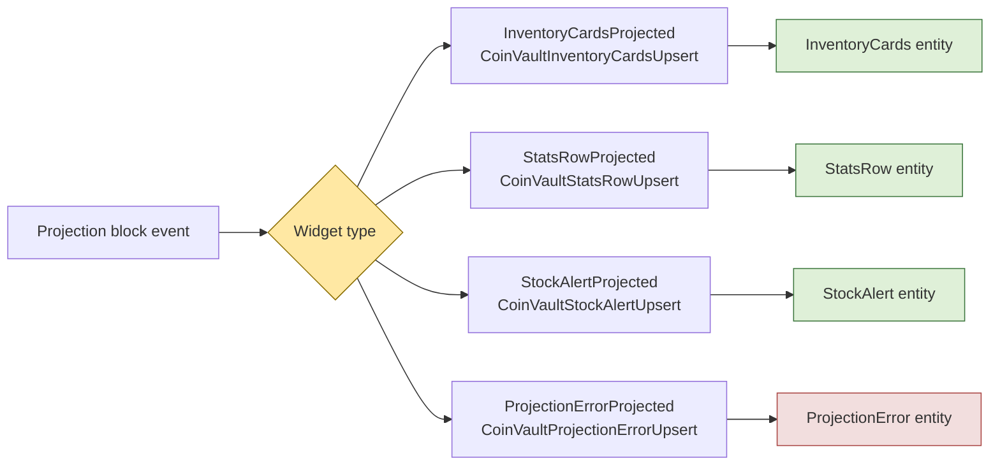

# Protobuf Payload Contracts and Sessionstream Schema Vet

This article explains the protobuf payload migration in Pinocchio and CoinVault, and the `sessionstream-lint` vettool that now enforces the core rule: sessionstream schema registrations should use concrete, feature-owned protobuf messages, not top-level `google.protobuf.Struct` payloads. The point is not merely that typed protobuf messages are tidier than ad hoc JSON. The point is that a sessionstream payload is a long-lived contract between runtime code, projection code, hydration, WebSocket transport, and frontend rendering.

> [!summary]
> - Top-level `google.protobuf.Struct` made live and hydrated payloads drift apart because the compiler could not see the contract.
> - Pinocchio now models chat, reasoning, agent mode, tool calls, and preview-clearing events with explicit protobuf messages.
> - CoinVault now models each rich widget as its own protobuf-backed event/UI/entity family rather than using a generic wrapper blob.
> - `sessionstream-lint` is a shared `go vet` analyzer that rejects top-level `*structpb.Struct` registrations on `sessionstream.SchemaRegistry`.

The reference work lives across three repositories in `/home/manuel/workspaces/2026-05-02/use-sessionstream-coinvault`:

- `pinocchio/` — chatapp payload migration and downstream `make schema-vet` consumer.
- `sessionstream/` — shared `SchemaRegistry` owner and new `sessionstream-lint` vettool home.
- `2026-03-16--gec-rag/` — CoinVault application, widget protobuf migration, and downstream `make schema-vet` consumer.

## Why this note exists

The migration started from a concrete bug, not from a preference for stronger types. Agent mode preview data rendered correctly while events were live, but after hydration the same conceptual payload came back with a different JSON shape. The frontend expected one shape, the hydrated timeline snapshot carried another, and the UI displayed `No analysis` even though the analysis had existed earlier.

That is the kind of bug that `Struct` invites. A `google.protobuf.Struct` is a valid protobuf message, but it is the protobuf equivalent of saying, "there will be some JSON here." That can be useful inside a typed message when a field is truly open-ended metadata. It is dangerous as the top-level contract for a command, backend event, UI event, or timeline entity, because those payloads cross process, storage, and language boundaries.

The durable rule became:

> Every sessionstream command, backend event, UI event, and timeline entity payload should be a concrete, named, feature-owned protobuf message. `google.protobuf.Struct` may appear inside a typed message field for intentionally open-ended sub-data, but not as the top-level schema registration payload.

This distinction matters. A nested `Struct` says, "this particular field is open-ended." A top-level `Struct` says, "the entire contract is open-ended." The first is a design choice. The second is a missing schema.

## The mental model: one event stream, several consumers

A sessionstream payload travels through more code than it first appears to. It is easy to think of it as a Go value passed from one function to another, but that is only the first hop. The same payload also becomes persisted snapshot state, protobuf JSON over a WebSocket, frontend state, and sometimes replayed or hydrated timeline state.



The important requirement is not that live UI and hydrated timeline use the same Go struct internally. The requirement is that both paths preserve the same semantic fields with stable names. If the live path emits `analysis` but the hydrated path stores that value under a nested `value.fields.analysis.stringValue` shape, the UI has to learn two contracts. That is how drift enters.

Concrete protobuf messages make the contract visible:

- Go code gets generated getters such as `GetMessageId()` and `GetAnalysis()`.
- TypeScript code can be generated or written against stable protobuf JSON field names.
- Hydration stores a known message type rather than an untyped JSON object.
- `go vet` can enforce the registration policy before the browser discovers the bug.

## Before: Struct as the universal solvent

The previous pattern was convenient in the short term. A plugin could register arbitrary payloads as `*structpb.Struct` and then construct maps by hand.

```go
reg.RegisterEvent(agentModePreviewEventName, &structpb.Struct{})
reg.RegisterUIEvent(agentModePreviewUIName, &structpb.Struct{})
reg.RegisterTimelineEntity(agentModeTimelineEntityKind, &structpb.Struct{})
```

This is appealing because it makes the first implementation cheap. You do not need to edit a `.proto` file, regenerate code, or decide whether a field is optional, repeated, or structured. You can publish a map and move on.

The cost is paid later. A map has no generated accessors. It has no field numbering. It does not describe whether `messageId` is required by convention. It does not tell the frontend whether `analysis` is a top-level string or a nested value. When the payload crosses the live/hydrated boundary, the code that reconstructs it must already know the shape. With `Struct`, the compiler cannot help.

A good rule of thumb is:

| Payload location | Good use of `Struct`? | Reason |
|---|---:|---|
| Top-level sessionstream command payload | No | Commands are API contracts. |
| Top-level backend event payload | No | Events are canonical history. |
| Top-level UI event payload | No | UI reducers need stable fields. |
| Top-level timeline entity payload | No | Hydration depends on stable schemas. |
| Nested metadata field inside a typed message | Sometimes | The openness is scoped and named. |

## After: explicit messages in Pinocchio

Pinocchio's chat payloads now live in `pinocchio/proto/pinocchio/chatapp/v1/chat.proto`. The schema is not trying to be clever. It names the domain concepts directly: chat updates, reasoning updates, agent mode preview and commit events, preview clears, and tool call/result entities.

```proto
message ReasoningUpdate {
  string message_id = 1;
  string parent_message_id = 2;
  int32 segment = 3;
  string role = 4;
  string chunk = 5;
  string text = 6;
  string content = 7;
  string status = 8;
  bool streaming = 9;
  string source = 10;
  string segment_type = 11;
}

message AgentModePreviewUpdate {
  string message_id = 1;
  string candidate_mode = 2;
  string analysis = 3;
  string parse_state = 4;
  bool preview = 5;
}

message AgentModeCommittedUpdate {
  string message_id = 1;
  string title = 2;
  string from = 3;
  string to = 4;
  string analysis = 5;
  bool preview = 6;
}

message AgentModePreviewCleared {
  string message_id = 1;
}

message AgentModeEntity {
  string message_id = 1;
  string title = 2;
  string from = 3;
  string to = 4;
  string analysis = 5;
  bool preview = 6;
}
```

The field list tells the reader what the feature owns. `ReasoningUpdate` models a thinking segment. `AgentModePreviewUpdate` models a tentative mode switch. `AgentModeCommittedUpdate` models the committed switch. `AgentModePreviewCleared` looks almost trivial, but it is important: the frontend needs the `message_id` to delete the preview chip associated with a specific assistant message.

The registration code is now explicit:

```go
func (agentModePlugin) RegisterSchemas(reg *sessionstream.SchemaRegistry) error {
    for _, err := range []error{
        reg.RegisterEvent(agentModePreviewEventName, &chatappv1.AgentModePreviewUpdate{}),
        reg.RegisterEvent(agentModeCommittedEventName, &chatappv1.AgentModeCommittedUpdate{}),
        reg.RegisterUIEvent(agentModePreviewUIName, &chatappv1.AgentModePreviewUpdate{}),
        reg.RegisterUIEvent(agentModeCommittedUIName, &chatappv1.AgentModeCommittedUpdate{}),
        reg.RegisterUIEvent(agentModePreviewClearUIName, &chatappv1.AgentModePreviewCleared{}),
        reg.RegisterTimelineEntity(agentModeTimelineEntityKind, &chatappv1.AgentModeEntity{}),
    } {
        if err != nil {
            return err
        }
    }
    return nil
}
```

That code has a useful property: the type names are a design review. If someone registers `AgentModeCommitted` with `AgentModePreviewUpdate`, the mismatch is visible at the call site. If someone tries to return to `&structpb.Struct{}`, the vettool catches it.

## Reasoning streams: segments as first-class messages

Reasoning output is a good example of why a dedicated message is better than overloading a generic chat message. Reasoning text is related to the assistant message, but it has its own segment identity and lifecycle. It can start, append deltas, finish, or be summarized by a provider.

The plugin now registers and publishes `ReasoningUpdate` for every reasoning lifecycle event:

```go
reg.RegisterEvent(ReasoningStartedEventName, &chatappv1.ReasoningUpdate{})
reg.RegisterEvent(ReasoningDeltaEventName, &chatappv1.ReasoningUpdate{})
reg.RegisterEvent(ReasoningFinishedEventName, &chatappv1.ReasoningUpdate{})
reg.RegisterUIEvent(ReasoningStartedUIName, &chatappv1.ReasoningUpdate{})
reg.RegisterUIEvent(ReasoningAppendedUIName, &chatappv1.ReasoningUpdate{})
reg.RegisterUIEvent(ReasoningFinishedUIName, &chatappv1.ReasoningUpdate{})
```

When a thinking delta arrives, the plugin fills in the relationship to the parent assistant message:

```go
return runtime.Publish(ctx, ReasoningDeltaEventName, &chatappv1.ReasoningUpdate{
    MessageId:       reasoningMessageID,
    ParentMessageId: parentMessageID,
    Segment:         segment,
    Role:            "thinking",
    Chunk:           ev.Delta,
    Content:         ev.Completion,
    Text:            ev.Completion,
    Status:          "streaming",
    Streaming:       true,
    Source:          "thinking",
    SegmentType:     "thinking",
})
```

This is more than a mechanical conversion from map keys to fields. The message encodes the feature's vocabulary: `parent_message_id`, `segment`, `source`, and `segment_type` are the concepts a future reader needs in order to reason about thinking streams. The same names flow into UI events and timeline entities, which makes live rendering and hydration speak the same language.

A small secondary fix fell out of this work: because protobuf stores `segment` as `int32`, the reasoning plugin now tracks segment counters as `int32` rather than converting from `int` at each publication site. That avoids `gosec` G115 warnings and aligns the in-memory counter with the wire schema.

## Agent mode: the tiny clear event that needed an ID

The agent mode preview bug illustrates a subtle point: even tiny messages deserve schemas. A clear event sounds like it might not need a payload. But the frontend deletes a specific preview entity, and that entity is keyed by message ID. An empty clear event is not neutral; it is ambiguous.

The current terminal clear path copies the assistant message ID from the finished or stopped chat message payload:

```go
case chatapp.EventInferenceFinished, chatapp.EventInferenceStopped:
    payload, ok := ev.Payload.(*chatappv1.ChatMessageUpdate)
    if !ok || payload == nil {
        return nil, true, unexpectedAgentModePayload(&chatappv1.ChatMessageUpdate{}, ev.Payload)
    }
    clearPB := &chatappv1.AgentModePreviewCleared{MessageId: payload.GetMessageId()}
    return []sessionstream.UIEvent{{Name: agentModePreviewClearUIName, Payload: clearPB}}, true, nil
```

The lesson is not specific to agent mode. Terminal or cleanup events often look payload-free from the backend's perspective, but the UI usually needs identity. If a reducer deletes something, it needs the key of the thing being deleted. A typed clear message forces that question into the schema.

## CoinVault: one widget family per concept

CoinVault had a related but slightly different problem. It renders rich inventory widgets produced by projection events: inventory cards, inventory tables, stats rows, stock alerts, and projection errors. One possible design would have been a single `CoinVaultWidget` wrapper with a `oneof` inside it. The migration deliberately avoided that as the main durable contract.

Instead, each widget gets its own event name, UI event name, timeline entity kind, and protobuf message family:

```go
reg.RegisterEvent(coinVaultInventoryCardsProjectedEvent, &coinvaultwidgetsv1.CoinVaultInventoryCardsUpsert{})
reg.RegisterUIEvent(coinVaultInventoryCardsUpsertUI, &coinvaultwidgetsv1.CoinVaultInventoryCardsUpsert{})
reg.RegisterTimelineEntity(coinVaultInventoryCardsEntityKind, &coinvaultwidgetsv1.CoinVaultInventoryCardsEntity{})

reg.RegisterEvent(coinVaultStatsRowProjectedEvent, &coinvaultwidgetsv1.CoinVaultStatsRowUpsert{})
reg.RegisterUIEvent(coinVaultStatsRowUpsertUI, &coinvaultwidgetsv1.CoinVaultStatsRowUpsert{})
reg.RegisterTimelineEntity(coinVaultStatsRowEntityKind, &coinvaultwidgetsv1.CoinVaultStatsRowEntity{})

reg.RegisterEvent(coinVaultProjectionErrorProjectedEvent, &coinvaultwidgetsv1.CoinVaultProjectionErrorUpsert{})
reg.RegisterUIEvent(coinVaultProjectionErrorUpsertUI, &coinvaultwidgetsv1.CoinVaultProjectionErrorUpsert{})
reg.RegisterTimelineEntity(coinVaultProjectionErrorEntityKind, &coinvaultwidgetsv1.CoinVaultProjectionErrorEntity{})
```

The design uses sessionstream's existing dispatch keys instead of inventing a second dispatch layer. Event names and entity kinds already answer the question, "what kind of thing is this?" The protobuf message should then describe the fields of that thing, not wrap every possible thing in the system.



This keeps widget evolution local. Adding a new widget means adding a new message and registrations for that widget. It does not require editing a mega-wrapper that becomes a central merge-conflict point and a conceptual dumping ground.

## The schema registry is the enforcement boundary

The policy belongs where the contract is registered. In sessionstream, the `SchemaRegistry` stores protobuf prototypes for four categories:

```go
type SchemaRegistry struct {
    commands map[string]proto.Message
    events   map[string]proto.Message
    uiEvents map[string]proto.Message
    entities map[string]proto.Message
}

func (r *SchemaRegistry) RegisterCommand(name string, msg proto.Message) error
func (r *SchemaRegistry) RegisterEvent(name string, msg proto.Message) error
func (r *SchemaRegistry) RegisterUIEvent(name string, msg proto.Message) error
func (r *SchemaRegistry) RegisterTimelineEntity(kind string, msg proto.Message) error
```

These methods are the narrow waist of the architecture. Producers, projections, hydration, and transport all depend on the prototypes registered here. That makes `SchemaRegistry` the right enforcement point. A linter that searched for the text `structpb.Struct` anywhere in the repository would be too blunt. It would catch nested metadata fields that are allowed. It might miss aliases. It would not understand whether the `Struct` is being used as a sessionstream top-level payload or for some unrelated purpose.

The analyzer therefore asks a type-aware question:

> Is this a call to `RegisterCommand`, `RegisterEvent`, `RegisterUIEvent`, or `RegisterTimelineEntity` on `*github.com/go-go-golems/sessionstream/pkg/sessionstream.SchemaRegistry`, and is the second argument a `*google.golang.org/protobuf/types/known/structpb.Struct`?

That question is precise enough to be useful.

## How the Go analyzer works

A Go vettool is a Go program that hosts one or more `go/analysis` analyzers. An analyzer receives a type-checked package, inspects its syntax and type information, and reports diagnostics. The sessionstream analyzer is intentionally small because its policy is intentionally narrow.

The analyzer declaration names the check and declares that it needs the `inspect` pass:

```go
var Analyzer = &analysis.Analyzer{
    Name:     "sessionstreamschema",
    Doc:      "reject generic Struct top-level sessionstream schema payload registrations",
    Requires: []*analysis.Analyzer{inspect.Analyzer},
    Run:      run,
}
```

The `Run` function walks every call expression:

```go
func run(pass *analysis.Pass) (any, error) {
    insp := pass.ResultOf[inspect.Analyzer].(*inspector.Inspector)
    insp.Preorder([]ast.Node{(*ast.CallExpr)(nil)}, func(n ast.Node) {
        call := n.(*ast.CallExpr)
        if !isSchemaRegistrationCall(pass, call) || len(call.Args) < 2 {
            return
        }
        payload := call.Args[1]
        if isPointerToStructPBStruct(pass.TypesInfo.TypeOf(payload)) {
            pass.Reportf(payload.Pos(),
                "sessionstream schema registrations must use concrete protobuf messages, not *structpb.Struct")
        }
    })
    return nil, nil
}
```

The helper `isSchemaRegistrationCall` first checks the selector name, then uses type information to verify the receiver:

```go
func isSchemaRegistrationCall(pass *analysis.Pass, call *ast.CallExpr) bool {
    sel, ok := call.Fun.(*ast.SelectorExpr)
    if !ok {
        return false
    }
    switch sel.Sel.Name {
    case "RegisterCommand", "RegisterEvent", "RegisterUIEvent", "RegisterTimelineEntity":
        // continue
    default:
        return false
    }
    recv := pass.TypesInfo.TypeOf(sel.X)
    return isSessionstreamSchemaRegistry(recv)
}
```

The receiver check unwraps a pointer, looks for a named type, and compares the package path:

```go
func isSessionstreamSchemaRegistry(t types.Type) bool {
    if ptr, ok := t.(*types.Pointer); ok {
        t = ptr.Elem()
    }
    named, ok := t.(*types.Named)
    if !ok || named.Obj() == nil || named.Obj().Pkg() == nil {
        return false
    }
    return named.Obj().Name() == "SchemaRegistry" &&
        named.Obj().Pkg().Path() == "github.com/go-go-golems/sessionstream/pkg/sessionstream"
}
```

The payload check is similarly type-aware:

```go
func isPointerToStructPBStruct(t types.Type) bool {
    ptr, ok := t.(*types.Pointer)
    if !ok {
        return false
    }
    named, ok := ptr.Elem().(*types.Named)
    if !ok || named.Obj() == nil || named.Obj().Pkg() == nil {
        return false
    }
    return named.Obj().Name() == "Struct" &&
        named.Obj().Pkg().Path() == "google.golang.org/protobuf/types/known/structpb"
}
```

There is no string matching here. If a file imports `structpb` under a different local name, the analyzer still sees the underlying type. If another package has a method named `RegisterEvent`, the analyzer ignores it unless the receiver type is sessionstream's `SchemaRegistry`.

## Building a vettool

The command that turns the analyzer into a `go vet` tool is almost comically small:

```go
package main

import (
    "github.com/go-go-golems/sessionstream/pkg/analysis/sessionstreamschema"
    "golang.org/x/tools/go/analysis/singlechecker"
)

func main() {
    singlechecker.Main(sessionstreamschema.Analyzer)
}
```

`singlechecker` is the right choice when the binary hosts one analyzer. It handles command-line flags, package loading protocol, and vettool integration. The older Pinocchio-local command used `unitchecker`, which is also part of the analyzer ecosystem, but the shared Sessionstream command is simpler as a standalone single-analyzer tool.

Build it like any other Go command:

```bash
cd sessionstream
go build -o /tmp/sessionstream-lint ./cmd/sessionstream-lint
```

Then run it as a vettool:

```bash
go vet -vettool=/tmp/sessionstream-lint ./pkg/analysis/sessionstreamschema ./cmd/sessionstream-lint
```

Downstream projects build the same command from the workspace path and run it over their application packages:

```bash
cd pinocchio
go build -o /tmp/sessionstream-lint ../sessionstream/cmd/sessionstream-lint
go vet -vettool=/tmp/sessionstream-lint ./cmd/... ./pkg/...
```

```bash
cd 2026-03-16--gec-rag
go build -o /tmp/sessionstream-lint ../sessionstream/cmd/sessionstream-lint
go vet -vettool=/tmp/sessionstream-lint ./cmd/... ./internal/...
```

The corresponding Makefile pattern is:

```make
SESSIONSTREAM_LINT ?= /tmp/sessionstream-lint
SESSIONSTREAM_LINT_PKG ?= ../sessionstream/cmd/sessionstream-lint

schema-vet:
	go build -o $(SESSIONSTREAM_LINT) $(SESSIONSTREAM_LINT_PKG)
	go vet -vettool=$(SESSIONSTREAM_LINT) ./cmd/... ./pkg/...
```

For an external module, install the tool from the module path:

```bash
go install github.com/go-go-golems/sessionstream/cmd/sessionstream-lint@latest
go vet -vettool="$(go env GOPATH)/bin/sessionstream-lint" ./...
```

## Why move the analyzer into Sessionstream?

The analyzer began in Pinocchio because that is where the first migration happened. That was useful for proving the rule, but it was the wrong long-term ownership boundary. The analyzer does not enforce a Pinocchio-specific policy. It enforces a rule about `sessionstream.SchemaRegistry`, which lives in Sessionstream and is used by downstream applications.

Moving it into Sessionstream did three things:

- It made Sessionstream the source of truth for its own registration contract.
- It removed duplicated analyzer ownership from Pinocchio.
- It let CoinVault and future sessionstream consumers use the same tool without copying policy code.

The final layout is:

```text
sessionstream/
├── pkg/analysis/sessionstreamschema/analyzer.go
└── cmd/sessionstream-lint/main.go

pinocchio/
└── Makefile              # builds ../sessionstream/cmd/sessionstream-lint

2026-03-16--gec-rag/
└── Makefile              # builds ../sessionstream/cmd/sessionstream-lint
```

Pinocchio's former local analyzer files were removed:

```text
pinocchio/pkg/analysis/sessionstreamschema/analyzer.go
pinocchio/cmd/tools/pinocchio-lint/main.go
```

That deletion is important. If the old local analyzer stayed behind, future engineers would have to ask which copy was authoritative. A duplicated lint rule is itself a schema drift problem.

## Implementation sequence for future migrations

When migrating another feature from `Struct` to concrete protobuf messages, use this order:

1. **Name the domain concepts first.** Decide whether the feature owns one message or several. Do not start by copying JSON keys into a proto file.
2. **Add protobuf messages.** Put stable fields into a feature-owned package and use nested messages only where structure repeats.
3. **Regenerate code.** Generate Go, and TypeScript if the frontend consumes generated protobuf types directly.
4. **Change schema registrations.** Replace `&structpb.Struct{}` with `&featurev1.SomeConcreteMessage{}`.
5. **Change producers.** Publish generated protobuf structs instead of maps.
6. **Change UI projections.** Type assert to the concrete message and return typed UI payloads.
7. **Change timeline projections.** Store typed entity payloads so hydration matches live rendering.
8. **Update frontend parsing.** Remove Struct-specific unwrapping where the payload is now concrete protobuf JSON.
9. **Run schema-vet.** Let the analyzer catch any remaining top-level `Struct` registrations.
10. **Run live and hydration smoke tests.** The bug class is specifically about live/hydrated disagreement, so both paths must be exercised.

In pseudocode:

```text
for each sessionstream registration:
    if payload prototype is *structpb.Struct:
        identify feature and event/entity semantic role
        create ConcretePayload message
        replace registration prototype
        replace map construction with generated message construction
        update projections and frontend reducers
        run schema-vet
        test live event path
        test hydration path
```

The key is to migrate by semantic role, not by file. One feature may need separate messages for preview, commit, clear, and entity state. Another feature may need separate messages for each widget kind.

## Failure modes and how the new system prevents them

### Failure mode: live path and hydration path disagree

This is the original AgentMode failure. Live UI events used one JSON shape and hydrated snapshots used another. Explicit timeline entity messages prevent this because the hydrated payload is serialized from the same generated message type the projection creates.

### Failure mode: cleanup event lacks identity

`AgentModePreviewCleared` looked like it could be empty. It could not. The frontend deletion needs a message ID. Giving the clear event a concrete message made that requirement visible and testable.

### Failure mode: widget wrapper becomes a dumping ground

A generic `CoinVaultWidget` wrapper would centralize every widget change. Per-widget messages keep event names, UI names, entity kinds, and payload fields aligned.

### Failure mode: linter catches too much

A text grep for `structpb.Struct` would reject legitimate nested metadata and unrelated uses. The analyzer avoids this by checking both the receiver type and the second argument type.

### Failure mode: linter catches too little

A source scanner can miss aliases, helper functions, or differently formatted code. The analyzer uses Go type information, so it detects the actual type of the registered payload.

## Current caveat: Sessionstream's own fixtures

The shared analyzer exists in Sessionstream now, but Sessionstream itself still contains some test and systemlab fixtures that register top-level `*structpb.Struct` payloads. For the migration step, `sessionstream make schema-vet` is scoped to the analyzer package and lint command. Pinocchio and CoinVault run the shared tool across their application packages.

That is an honest transitional state. The rule is correct, the downstream apps are clean, and the remaining work is to convert Sessionstream's own tests and systemlab examples to typed fixture messages. Once that is done, Sessionstream can broaden its self-vet target to `./pkg/... ./cmd/...`.

This is also a good reminder that lint rules should be introduced with a migration plan. A rule that is correct but immediately fails the owner repository is not wrong. It is simply telling you the migration is not finished.

## Validation commands from the migration

The migration used these validation commands:

```bash
cd sessionstream
make schema-vet
go test ./pkg/analysis/sessionstreamschema ./cmd/sessionstream-lint -count=1
```

```bash
cd pinocchio
make schema-vet
go test ./pkg/chatapp ./pkg/chatapp/plugins ./cmd/web-chat -count=1
```

```bash
cd 2026-03-16--gec-rag
make schema-vet
go test ./internal/webchat ./internal/projectionlookup ./internal/projectionblocks -count=1
```

The important part is not only that tests passed. The important part is that the validation now contains a structural policy check. Future code can still have logic bugs, but it should not silently reintroduce top-level generic payload contracts in Pinocchio or CoinVault.

## Working rules

- A sessionstream schema registration is a public contract inside the system. Treat it like an API boundary, not like a local helper.
- Use `Struct` only when the openness is deliberately scoped inside a named message field.
- Prefer several small feature-owned protobuf messages over one generic wrapper that must represent every future case.
- Put the lint rule where the framework contract lives. In this case, that means Sessionstream, not Pinocchio.
- Make the vettool easy to run locally. A Makefile target that builds `/tmp/sessionstream-lint` and runs `go vet -vettool=...` is enough.
- Test both live UI events and hydrated timeline snapshots. Schema bugs often hide until reload.

## Related code and documents

Source files:

- `/home/manuel/workspaces/2026-05-02/use-sessionstream-coinvault/pinocchio/proto/pinocchio/chatapp/v1/chat.proto`
- `/home/manuel/workspaces/2026-05-02/use-sessionstream-coinvault/pinocchio/pkg/chatapp/plugins/reasoning.go`
- `/home/manuel/workspaces/2026-05-02/use-sessionstream-coinvault/pinocchio/cmd/web-chat/agentmode_chat_feature.go`
- `/home/manuel/workspaces/2026-05-02/use-sessionstream-coinvault/sessionstream/pkg/analysis/sessionstreamschema/analyzer.go`
- `/home/manuel/workspaces/2026-05-02/use-sessionstream-coinvault/sessionstream/cmd/sessionstream-lint/main.go`
- `/home/manuel/workspaces/2026-05-02/use-sessionstream-coinvault/2026-03-16--gec-rag/proto/coinvault/widgets/v1/widgets.proto`
- `/home/manuel/workspaces/2026-05-02/use-sessionstream-coinvault/2026-03-16--gec-rag/internal/webchat/coinvault_projection_feature.go`

Ticket documents:

- `/home/manuel/workspaces/2026-05-02/use-sessionstream-coinvault/pinocchio/ttmp/2026/05/06/PINO-PROTO-SCHEMAS--migrate-struct-payloads-to-explicit-protobuf-schemas-and-enforce-with-vet/design/01-explicit-protobuf-payloads-and-vet-enforcement.md`
- `/home/manuel/workspaces/2026-05-02/use-sessionstream-coinvault/pinocchio/ttmp/2026/05/06/PINO-PROTO-SCHEMAS--migrate-struct-payloads-to-explicit-protobuf-schemas-and-enforce-with-vet/reference/01-implementation-diary.md`
- `/home/manuel/workspaces/2026-05-02/use-sessionstream-coinvault/sessionstream/ttmp/2026/05/06/SS-SCHEMA-VET--move-sessionstream-schema-vet-analyzer-into-sessionstream/design/01-sessionstream-schema-vet-analyzer-migration-plan.md`

## Closing

The protobuf migration is best understood as a contract-hardening pass. It took payload shapes that were implicit in maps, frontend assumptions, and hydration behavior, and moved them into named protobuf messages. The schema-vet tool then turned the design rule into executable enforcement.

That is the useful pattern to carry forward: when a bug reveals an architectural boundary, do not only fix the symptom. Name the boundary, encode the contract, and add a small tool that prevents the old shape from coming back.
