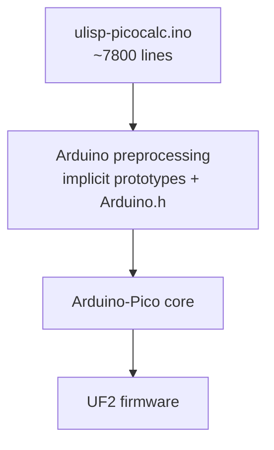
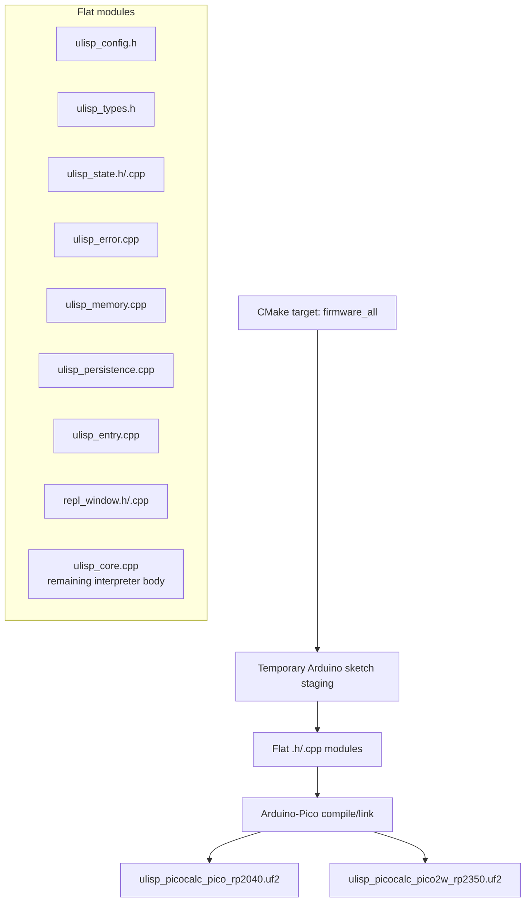

# uLisp PicoCalc Firmware Split — CMake Modularization Report

This report explains the current state of the uLisp PicoCalc firmware split: what changed, why it changed, what now builds, and what a future maintainer should understand before continuing. The project began with a single large Arduino sketch, `ulisp-picocalc.ino`, and now has a flat set of side-by-side C++ modules that can be built for both RP2040 and Pico 2W/RP2350 through a CMake-orchestrated Arduino-Pico bridge.

The most important idea is that this is not yet a full rewrite, and it is not yet a pure Pico SDK port. It is a deliberate bridge. The firmware still depends on Arduino-Pico, `TFT_eSPI`, `PCKeyboard`, SD, LittleFS, SPI, Wire, and the same uLisp interpreter logic. What changed is the source organization and build control. The code is now moving from "one sketch that Arduino preprocesses" toward "normal C++ translation units with explicit ownership."

> [!summary]
> - The firmware now builds from flat side-by-side `.h` / `.cpp` modules instead of relying only on a monolithic `.ino` sketch.
> - CMake builds both `ulisp_picocalc_pico_rp2040.uf2` and `ulisp_picocalc_pico2w_rp2350.uf2` through an Arduino-Pico bridge.
> - The Pico 2W/RP2350 UF2 has been repeatedly deployed through UF2 Loader under `/pico2-apps/`, including the post-forward-header-removal build, and the user reported that everything still works.
> - The broad split is now complete: streams, print, platform, pretty, terminal, reader, tables, evaluator, graphics, Arduino/Pico primitives, PicoCalc extras, runtime helpers, builtin families, and shared messages all live in flat modules.
> - The generated `ulisp_fwd_decls.h` bridge has been deleted and replaced by focused subsystem headers; requested include preambles have been cleaned in the small, runtime-family, and builtin-family modules.
> - Root `Makefile` targets now provide self-service UF2 Loader status, mount, deploy, sync, and unmount workflows.

## Why this project exists

The original firmware did what it needed to do: it compiled in Arduino IDE style, ran uLisp on the PicoCalc, drew a REPL on the TFT display, read keyboard events, used SD/LittleFS storage, and produced UF2 images. The problem was not that the program failed. The problem was that the program was hard to reason about as a project.

A single `.ino` sketch has two properties that are convenient at first and costly later. First, Arduino performs hidden preprocessing: it includes `Arduino.h`, generates prototypes, chooses board macros, and wires libraries. Second, the whole file behaves like one translation unit. A helper can depend on a macro, a global, or a function defined thousands of lines away, and the compiler often accepts it because the Arduino build system has already massaged the sketch into a form it can compile.

That convenience becomes a tax when the project grows. A new contributor cannot easily answer simple questions:

- Which code owns the REPL UI state?
- Which code owns the Lisp heap?
- Which code decides RP2040 versus RP2350 workspace size?
- Which code is responsible for persistence, and does it respect UF2 Loader flash constraints?
- Which symbols are part of the interpreter's public internal API, and which are just implementation details?

The split exists to make those questions answerable. A module boundary is not merely a file boundary. It is a claim about responsibility. `ulisp_memory.cpp` says: allocation, constructors, interning, GC, and compaction live here. `ulisp_entry.cpp` says: Arduino `setup()`, `loop()`, and REPL orchestration live here. The file names become the map.

## Current project status

The repository is:

```text
/home/manuel/code/wesen/2026-05-05--ulisp-picocalc
```

The active firmware submodule/source directory is:

```text
/home/manuel/code/wesen/2026-05-05--ulisp-picocalc/ulisp-picocalc
```

The active docmgr ticket is:

```text
/home/manuel/code/wesen/2026-05-05--ulisp-picocalc/ttmp/2026/05/06/ulisp-cmake-split--split-ulisp-picocalc-firmware-into-c-modules-and-build-with-cmake
```

The current implementation has crossed an important threshold: both target UF2s build after multiple real module extractions.

```bash
cmake --build build-ulisp-cmake --target firmware_all -j1
```

The output artifacts are:

```text
build-ulisp-cmake/uf2/ulisp_picocalc_pico_rp2040.uf2
build-ulisp-cmake/uf2/ulisp_picocalc_pico2w_rp2350.uf2
```

The latest recorded build sizes after extracting persistence were:

| Target | UF2 | Program storage | Global RAM | Remaining RAM |
|---|---|---:|---:|---:|
| Pico / RP2040 | `ulisp_picocalc_pico_rp2040.uf2` | `200664` bytes | `187760` bytes | `74384` bytes |
| Pico 2W / RP2350 | `ulisp_picocalc_pico2w_rp2350.uf2` | `459388` bytes | `423544` bytes | `100744` bytes |

The Pico 2W build is the current hardware path. It has been copied to the UF2 Loader SD-card app folder:

```text
/pico2-apps/ulisp_picocalc_pico2w_rp2350.uf2
```

The corresponding RP2040 app folder remains:

```text
/pico1-apps/ulisp_picocalc_pico_rp2040.uf2
```

## The mental model: from sketch to modules

The old build had a simple shape:



This was compact, but the architecture was implicit. The new shape keeps Arduino-Pico as the compiler/linker provider but makes the project source explicit:



This diagram is intentionally honest. The build is not "pure CMake" in the sense of bypassing Arduino-Pico. Instead, CMake orchestrates a repeatable Arduino-Pico build. The bridge script stages the flat source files into a temporary sketch directory because `arduino-cli` still expects a sketch wrapper. The `.ino` in that staging area is empty; the firmware entry points are in `ulisp_entry.cpp`.

That distinction matters. It means we have solved source organization and repeatable multi-target build orchestration without yet solving the larger problem of replacing Arduino libraries with Pico SDK equivalents. That larger port may happen later, but it is not necessary to get the benefits of modularization now.

## Why the source stays flat

The project deliberately uses side-by-side `.h` / `.cpp` files in `ulisp-picocalc/` rather than an `include/` and `src/` split. This is not an accident or a shortcut. It is a readability choice for the current phase.

The code is still being extracted from a monolith. During this phase, the main task is not packaging a stable public library. The main task is discovering the real seams. A flat directory makes that work easier because a contributor can see the firmware surface in one listing:

```text
ulisp_config.h
ulisp_types.h
ulisp_state.h
ulisp_state.cpp
ulisp_error.cpp
ulisp_memory.cpp
ulisp_persistence.cpp
ulisp_entry.cpp
repl_window.h
repl_window.cpp
ulisp_core.cpp
```

The file prefixes carry meaning:

- `ulisp_*` files belong to the Lisp interpreter, runtime, persistence, or build configuration.
- `repl_*` files belong to the on-device REPL UI/editor.
- Future `picocalc_*` files should own board-specific hardware adapters.

Subdirectories may become useful later, but moving too early would hide unstable boundaries behind a tidy-looking tree. A pure move into subdirectories should wait until `ulisp_fwd_decls.h` is gone or mostly replaced by real subsystem headers.

## Build and deployment pipeline

The current build pipeline has three layers:

1. CMake defines the firmware targets.
2. A helper script stages the flat C++ files into an Arduino-compatible temporary sketch directory.
3. `arduino-cli` compiles the staged files with the Earle Philhower Arduino-Pico core.

The important files are:

```text
ulisp-picocalc/CMakeLists.txt
ulisp-picocalc/build_firmware_with_arduino_cli.sh
ulisp-picocalc/deploy_uf2loader.sh
```

The CMake target names are explicit:

```text
ulisp_picocalc_pico_rp2040
ulisp_picocalc_pico2w_rp2350
firmware_all
```

The build helper creates a temporary sketch directory because `arduino-cli` expects a directory containing a same-named `.ino` file. The trick is that this `.ino` is empty. The real program is compiled from the staged `.cpp` files.

In pseudocode, the helper does this:

```text
build_firmware_with_arduino_cli(source_dir, build_dir, fqbn, target_name, output_uf2):
    sketch_dir = build_dir / "sketch-" + target_name
    arduino_build_dir = build_dir / "arduino-" + target_name

    create empty sketch_dir / basename(sketch_dir) + ".ino"

    copy flat firmware files into sketch_dir:
        ulisp_core.cpp
        ulisp_entry.cpp
        ulisp_config.h
        ulisp_types.h
        ulisp_state.h/.cpp
        ulisp_error.cpp
        ulisp_memory.cpp
        ulisp_persistence.cpp
        repl_window.h/.cpp
        Setup60_RP2040_ILI9488.h
        ...

    arduino-cli compile --fqbn fqbn --build-path arduino_build_dir sketch_dir
    copy generated .uf2 to build-ulisp-cmake/uf2/output_name.uf2
```

The deploy helper knows the UF2 Loader folder convention:

```text
pico   -> /pico1-apps/ulisp_picocalc_pico_rp2040.uf2
pico2w -> /pico2-apps/ulisp_picocalc_pico2w_rp2350.uf2
```

This reduces a real class of mistakes: copying an RP2350 image into the RP2040 app folder, or overwriting the wrong file while testing.

## UF2 Loader: the deployment assumption

The project now targets the `pelrun/uf2loader` workflow. That means the firmware build emits ordinary application UF2s. It does not try to produce legacy ClockworkPi stock multibooter `.bin` files.

The SD card has two board-family app folders:

```text
/BOOT2040.UF2
/pico1-apps/*.uf2

/BOOT2350.UF2
/pico2-apps/*.uf2
```

The flashed bootloader differs by board family:

| Board family | Flash once | SD root menu | App folder |
|---|---|---|---|
| Pico / Pico W / RP2040 | `bootloader_pico.uf2` | `BOOT2040.UF2` | `/pico1-apps/` |
| Pico 2 / Pico 2W / RP2350 | `bootloader_pico2.uf2` | `BOOT2350.UF2` | `/pico2-apps/` |

This distinction matters because the bootloader, the menu UI, and the application are all UF2 files but they are not interchangeable. The bootloader is flashed to the Pico module. The menu UI lives at the SD root. The uLisp app lives in the appropriate app directory.

The current hardware is Pico 2W, so the daily loop is:

```bash
cmake --build build-ulisp-cmake --target firmware_all -j1
udisksctl mount -b /dev/sda1
ulisp-picocalc/deploy_uf2loader.sh pico2w /media/manuel/1216-8671
udisksctl unmount -b /dev/sda1
```

Then select the app from the PicoCalc UF2 Loader menu.

## The modules that exist now

### `ulisp_config.h`: build-time decisions in one place

`ulisp_config.h` exists because preprocessor state is part of the program. In the monolithic sketch, feature flags and board macros lived at the top of the `.ino`. Once the code became multiple translation units, those definitions had to become shared.

This header now centralizes:

- feature flags such as `printfreespace`, `sdcardsupport`, `gfxsupport`, and `assemblerlist`;
- LittleFS mode strings;
- platform attributes such as `WORDALIGNED`, `RAMFUNC`, and `MEMBANK`;
- board selection branches for RP2040, Pico W, Pico 2, Pico 2W, and Pimoroni Pico Plus 2;
- workspace sizing and stack-difference constants.

This file also prevents a recurrence of the slow-boot bug. That bug happened because `#define Serial Serial1` was local to the old sketch body. When `setup()` moved to `ulisp_entry.cpp`, it used real USB `Serial` and waited up to five seconds. The fix was to use `Serial1` explicitly in the entry module. The lesson is broader: translation-unit-local macros are migration hazards. Shared policy belongs in shared headers or explicit functions.

### `ulisp_types.h`: the object model and interpreter vocabulary

The uLisp runtime revolves around a single object representation. Every Lisp value is an `object`: numbers, strings, symbols, pairs, arrays, streams, and code references. `ulisp_types.h` defines that representation and the macros used to manipulate it.

The core structure is still the original C-style tagged union:

```cpp
typedef struct sobject {
  union {
    struct {
      sobject *car;
      sobject *cdr;
    };
    struct {
      unsigned int type;
      union {
        symbol_t name;
        int integer;
        chars_t chars;
        float single_float;
      };
    };
  };
} object;
```

This representation is compact and central. A pair uses `car` and `cdr`. An atom uses a type tag plus a payload. The same memory cell can be interpreted differently depending on its tag. The garbage collector, reader, evaluator, and printer all depend on this exact layout.

The header also contains macros such as:

```cpp
#define car(x)      (((object *) (x))->car)
#define cdr(x)      (((object *) (x))->cdr)
#define first(x)    car(x)
#define rest(x)     cdr(x)
#define protect(y)  push((y), GCStack)
#define unprotect() pop(GCStack)
```

These macros are not ornamental. They are the vocabulary of the interpreter. Moving them into a shared header removes duplicated mini-definitions from `ulisp_entry.cpp` and makes later splits possible.

### `ulisp_state.h` and `ulisp_state.cpp`: one home for global state

The interpreter has a great deal of global state because it is an embedded Lisp runtime, not a multi-instance library. The state includes:

- `Workspace[WORKSPACESIZE]`, the fixed Lisp heap;
- `Freelist` and `Freespace`, the allocator state;
- `GlobalEnv`, the global Lisp environment;
- `GCStack`, the temporary root stack used during allocation;
- trace and backtrace buffers;
- `Flags`, runtime control bits;
- `tee`, the Lisp `t` object.

Before the split, all of this lived in the monolithic sketch. Now declarations live in `ulisp_state.h` and definitions live in `ulisp_state.cpp`.

The pattern is the normal C++ pattern:

```cpp
// ulisp_state.h
extern object *GlobalEnv;
extern object *GCStack;
extern flags_t Flags;

// ulisp_state.cpp
object *GlobalEnv;
object *GCStack = NULL;
flags_t Flags = 1 << PRINTREADABLY;
```

This matters because global state should have exactly one definition. Header-defined globals were acceptable in the single-translation-unit world; they become linker errors or accidental duplicate storage in a modular world.

### `ulisp_error.cpp`: longjmp-based error recovery

uLisp uses C `setjmp` / `longjmp` for error recovery. That is an important design choice. Errors deep inside the evaluator do not return error objects through every call frame. They print diagnostics and jump back to the top-level handler.

The core flow is:

```text
error("message", object)
    -> errorsym(...)
        -> errorsub(...) prints context
        -> errorend()
            -> longjmp(*handler, 1)
```

Moving this code into `ulisp_error.cpp` makes the control-flow boundary visible. It also creates the right home for future cleanup around error messages, because persistence extraction already exposed that some error strings have internal linkage and need a shared ownership policy.

### `ulisp_memory.cpp`: heap, constructors, interning, GC, compaction

`ulisp_memory.cpp` owns the most fundamental runtime mechanics. It initializes the heap, allocates objects, constructs Lisp values, interns symbols, marks live data, sweeps dead data, and compacts the workspace for image save.

The allocator is deliberately simple:

```text
initworkspace():
    Freelist = NULL
    for each object in Workspace from end to start:
        obj.car = NULL
        obj.cdr = Freelist
        Freelist = obj
        Freespace++

myalloc():
    if Freespace == 0:
        error "no room"
    temp = Freelist
    Freelist = Freelist.cdr
    Freespace--
    return temp
```

This is a fixed-size embedded heap. There is no `new`, no general-purpose allocator, and no heap fragmentation in the usual C++ sense. The cost is that every Lisp object must fit the `object` representation and every temporary allocation must be protected correctly.

The garbage collector follows the classic mark-and-sweep pattern:

```text
gc(form, env):
    mark tee
    mark GlobalEnv
    mark GCStack
    mark current form
    mark current env
    sweep Workspace
```

The important roots are now easy to find because state is centralized in `ulisp_state.*` and GC is centralized in `ulisp_memory.cpp`.

### `ulisp_persistence.cpp`: images, SD, LittleFS, and flash backends

The persistence module owns the uLisp image save/load mechanism. That includes filename conversion, SD/LittleFS integer serialization, conditional flash backend helpers, `saveimage()`, `loadimage()`, and `autorunimage()`.

This is one of the most important modules for the PicoCalc because UF2 Loader changes the meaning of "safe flash." On RP2040, UF2 Loader occupies/protects the top part of flash and exposes safe-flash metadata. On RP2350, the loader uses a partition model. The firmware currently builds, but the persistence operations still need hardware validation under UF2 Loader.

The risk is not that `save-image` fails to compile. The risk is that a flash-writing path assumes more flash is available than UF2 Loader permits. Now that persistence code lives in one module, that risk has a natural review location.

## The slow-boot regression and what it taught us

The most instructive bug so far was the slow boot after moving entry code into `ulisp_entry.cpp`. The symptom was simple: the firmware seemed to take much longer to start. The cause was subtle but typical of sketch-to-C++ migrations.

In the old sketch, this line appeared near the hardware setup:

```cpp
#define Serial Serial1
```

Later, `setup()` used `Serial`:

```cpp
Serial.begin(9600);
int start = millis();
while ((millis() - start) < 5000) { if (Serial) break; }
```

In the single `.ino`, the macro transformed this into `Serial1`. After splitting, `setup()` lived in a new translation unit that did not see the macro. The same source text now meant USB serial, not PicoCalc UART. The wait loop could therefore consume the full five seconds.

The fix was explicit:

```cpp
Serial1.begin(9600);
int start = millis();
while ((millis() - start) < 5000) { if (Serial1) break; }
```

The deeper lesson is that a module split is not just moving text. Preprocessor context is part of the behavior. Every new `.cpp` file needs the configuration, aliases, and feature flags that the old `.ino` had implicitly.

## Commit trail

The main code commits in `ulisp-picocalc` are:

```text
abf373f Build uLisp firmware via CMake bridge
702817b Move REPL window implementation to cpp
99037c9 Move Arduino entry loop to cpp module
a1792c4 Use PicoCalc UART in entry module
7a439f5 Extract uLisp compile configuration
7860bf1 Add UF2 Loader deploy helper
c5f2618 Extract uLisp core types header
6eae73d Extract uLisp global state module
2cd35c7 Extract uLisp error handling module
1d5a75e Extract uLisp memory management module
294f2c7 Extract uLisp persistence module
```

The root repository also records docmgr diary and ticket updates, including the submodule pointer.

## What remains in `ulisp_core.cpp`

`ulisp_core.cpp` is smaller, but it remains large. It still contains major interpreter and platform subsystems, including:

- tracing and predicates;
- radix-40 encoding;
- equality and comparison;
- arithmetic internals;
- arrays and strings;
- environment and closures;
- streams and hardware I/O;
- pretty printing and editor support;
- special forms and tail forms;
- builtin functions;
- lookup tables and documentation strings;
- evaluator;
- printer;
- reader.

The next extraction should probably be `ulisp_streams.cpp`, because the stream layer is a strong architectural seam. It is where Lisp I/O abstractions meet Arduino/PicoCalc hardware APIs.

## Recommended next split: streams

The stream layer is the point where the interpreter says, "I need a character" or "I need to write a character," without caring whether the backing device is serial, I2C, SPI, SD, WiFi, a string, or graphics.

The relevant function pointer types are already in `ulisp_types.h`:

```cpp
typedef int (*gfun_t)();
typedef void (*pfun_t)(char);
```

The stream dispatch table maps Lisp stream objects to concrete callbacks:

```text
serial stream -> pserial / gserial
I2C stream    -> i2cwrite / i2cread
SPI stream    -> spiwrite / spiread
SD stream     -> SDwrite / SDread
gfx stream    -> gfxwrite
```

This module will probably need to carry Arduino dependencies (`SPI`, `Wire`, `SD`) and some PicoCalc dependencies (`tft` for `gfxwrite`). Extracting it will reduce `ulisp_core.cpp` and clarify the hardware boundary.

## Open risks and questions

- `ulisp_fwd_decls.h` is still a broad generated bridge. It should shrink as real subsystem headers appear.
- Error message strings still live in `ulisp_core.cpp`. Cross-module references will expose C++ internal-linkage issues unless these strings get a proper shared home.
- Persistence builds, but `save-image` / `load-image` need hardware testing under UF2 Loader.
- Pico 2W/RP2350 has enough RAM headroom to build and boot, but the build reports high global RAM use. This should stay visible during further splits.
- The project is still using Arduino-Pico as the underlying toolchain provider. A pure Pico SDK port remains a separate future project.

## Near-term next steps

1. Flash and test the latest persistence-split Pico 2W UF2.
2. Test the REPL path: prompt, keyboard input, evaluation, output rendering, Escape handling.
3. Test persistence: `save-image` and `load-image`, watching for UF2 Loader flash/partition safety issues.
4. Extract `ulisp_streams.cpp`.
5. Extract `ulisp_print.cpp` and `ulisp_reader.cpp`.
6. Replace `ulisp_fwd_decls.h` with smaller hand-maintained headers as the subsystem APIs stabilize.

## Working rule

Keep the project flat until the seams stop moving. Each split should move one coherent responsibility, rebuild both targets, and preferably produce a commit that can be reviewed on its own. If a move requires behavior changes, make the behavior change explicit in the commit message and diary. The goal is not to make the directory look clean; the goal is to make the firmware understandable without changing what it does.

---

## 2026-05-06 update: broad split complete, generated declarations removed, and deployment automated

The report above captures the project at an earlier midpoint: the build bridge was working, core state/error/memory/persistence had been extracted, and several major seams still remained in `ulisp_core.cpp`. Since then, the project crossed another threshold. The firmware is no longer merely partially extracted. It is now a broad flat-module C++ firmware with `ulisp_core.cpp` reduced to a thin integration unit.

This update records what changed after the original report, what was validated on hardware, and what remains worth doing.

> [!success]
> The latest hardware-good baseline before include-preamble cleanup was the post-`ulisp_fwd_decls.h` Pico 2W/RP2350 build. It was deployed through UF2 Loader, tested on the PicoCalc, and the user reported: “everything still works.”

### New current status

The current build command remains:

```bash
cmake --build build-ulisp-cmake --target firmware_all -j1
```

The latest build summaries after the generated-header removal and requested preamble cleanup are unchanged from the modular baseline:

| Target | UF2 | Program storage | Global RAM | Remaining RAM |
|---|---|---:|---:|---:|
| Pico / RP2040 | `ulisp_picocalc_pico_rp2040.uf2` | `200948` bytes | `187776` bytes | `74368` bytes |
| Pico 2W / RP2350 | `ulisp_picocalc_pico2w_rp2350.uf2` | `459640` bytes | `423560` bytes | `100728` bytes |

The generated files are still:

```text
build-ulisp-cmake/uf2/ulisp_picocalc_pico_rp2040.uf2
build-ulisp-cmake/uf2/ulisp_picocalc_pico2w_rp2350.uf2
```

The deployment target for current hardware remains:

```text
/pico2-apps/ulisp_picocalc_pico2w_rp2350.uf2
```

### New self-service deployment workflow

A root `Makefile` target now wraps the CMake build, UF2 Loader mount, deploy, sync, and unmount steps. The normal Pico 2W workflow is now:

```bash
make uf2loader-deploy-pico2w-unmount
```

That target performs the following sequence:

```text
cmake -S ulisp-picocalc -B build-ulisp-cmake
cmake --build build-ulisp-cmake --target firmware_all -j1
udisksctl mount -b /dev/disk/by-uuid/1216-8671   # if not already mounted
ulisp-picocalc/deploy_uf2loader.sh pico2w /media/$USER/1216-8671
sync
udisksctl unmount -b /dev/disk/by-uuid/1216-8671
```

Useful related targets are:

```bash
make uf2loader-status
make uf2loader-mount
make uf2loader-unmount
make uf2loader-deploy-pico2w
make uf2loader-deploy-pico2w-unmount
make uf2loader-deploy-pico
make uf2loader-deploy-pico-unmount
```

The Makefile defaults to the SD-card UUID observed during development:

```make
UF2LOADER_UUID ?= 1216-8671
```

A different card can be selected without editing the Makefile:

```bash
make UF2LOADER_UUID=XXXX-YYYY uf2loader-deploy-pico2w-unmount
```

This matters because the deployment workflow is now encoded in the repository. The user should not need an assistant to remember the `udisksctl` sequence.

### What moved out of `ulisp_core.cpp`

The original report said that streams, print, reader, evaluator, builtins, and tables still remained to be extracted. That is no longer true. The broad extraction is now complete.

`ulisp_core.cpp` is now an integration unit that owns the license/banner area, the high-level include stack, and PicoCalc global object definitions such as:

```cpp
PCKeyboard pc_kbd;
TFT_eSPI tft;
```

The interpreter and hardware subsystems live in flat side-by-side modules.

### Current module map

The important modules now include:

| Area | Files | Responsibility |
|---|---|---|
| Configuration/types/state | `ulisp_config.h`, `ulisp_types.h`, `ulisp_state.h/.cpp` | Feature flags, object model, global interpreter state. |
| Errors/messages | `ulisp_error.h/.cpp`, `ulisp_messages.h/.cpp` | Error reporting, `longjmp` recovery, shared error strings/constants. |
| Memory/persistence | `ulisp_memory.h/.cpp`, `ulisp_persistence.h/.cpp` | Allocation, GC, interning, image compaction, save/load backends. |
| Entry/REPL lifecycle | `ulisp_entry.h/.cpp`, `repl_window.h/.cpp` | Arduino setup/loop, REPL orchestration, display back-buffer helpers. |
| Streams | `ulisp_streams.h/.cpp` | Serial/I2C/SPI/SD/Wi-Fi/string/graphics stream dispatch. |
| Printing | `ulisp_print.h/.cpp` | Scalar, object, list, symbol, string, float, and stream printing. |
| Platform helpers | `ulisp_platform.h/.cpp` | I2C init, analog pin validation, tone/note, sleep/doze helpers. |
| Pretty/editor | `ulisp_pretty.h/.cpp` | Width calculation, superprint, tree editor helpers. |
| Terminal/input | `ulisp_terminal.h/.cpp`, `ulisp_reader.h/.cpp` | PicoCalc keyboard/display path, reader/parser/input loop. |
| Tables/eval | `ulisp_tables.h/.cpp`, `ulisp_eval.h/.cpp` | Builtin lookup tables/docs/minmax metadata and evaluator. |
| Hardware builtins | `ulisp_gfx.h/.cpp`, `ulisp_arduino.h/.cpp`, `ulisp_picocalc.h/.cpp` | Graphics, Arduino/Pico primitives, PicoCalc-specific builtins. |
| Builtin families | `ulisp_builtins*.cpp`, `ulisp_builtins.h` | Special forms, list/core, numeric, string/bitwise, and system builtins. |
| Runtime families | `ulisp_runtime*.cpp`, `ulisp_runtime.h` | Symbols, predicates, math helpers, data/string/array helpers, env/closure helpers. |

The broad split kept the user's requested layout: flat `.h`/`.cpp` files in the same `ulisp-picocalc/` directory, not `include/` plus `src/`.

### Builtin-family split

The large builtin body was split into family files:

```text
ulisp_builtins_control.cpp
ulisp_builtins_core.cpp
ulisp_builtins_numbers.cpp
ulisp_builtins_strings.cpp
ulisp_builtins_system.cpp
```

The split is organized around behavior:

- `ulisp_builtins_control.cpp` owns assembler/code helpers, special forms, accessors, other special forms, and tail forms.
- `ulisp_builtins_core.cpp` owns core predicates and list functions.
- `ulisp_builtins_numbers.cpp` owns arithmetic, comparisons, number predicates, and float functions.
- `ulisp_builtins_strings.cpp` owns character, string, and bitwise functions.
- `ulisp_builtins_system.cpp` owns system, editor, pretty-print, format, library, documentation, dynamic error, SD, and Wi-Fi functions.

This is not yet a public API design. It is a maintainability split. The important improvement is that a future reader no longer has to search one enormous builtin section to find the implementation family they care about.

### Runtime-family split

The runtime helper body was split into:

```text
ulisp_runtime_symbols.cpp
ulisp_runtime_math.cpp
ulisp_runtime_data.cpp
ulisp_runtime_env.cpp
```

The split is:

- `ulisp_runtime_symbols.cpp`: tracing, helper predicates, radix-40 and symbol helpers.
- `ulisp_runtime_math.cpp`: numeric and mathematical helper routines.
- `ulisp_runtime_data.cpp`: association lists, arrays, strings, documentation helpers, IP/string conversion.
- `ulisp_runtime_env.cpp`: closures, environment lookup, in-place operations, checked car/cdr, mapping helpers, and body evaluation helpers.

One dependency exposed by later include cleanup is worth noting: `ulisp_runtime_env.cpp` uses `tf_progn`, so it currently includes `ulisp_builtins.h`. That is correct for the current code, but it indicates a future cycle worth untangling if the evaluator/control-flow API is refined.

### Shared messages and constants

A major cleanup was adding:

```text
ulisp_messages.h
ulisp_messages.cpp
```

These files own shared constants and error strings that used to be vulnerable to C++ internal-linkage problems when moved across translation units. They include:

```text
LispLibrary
COLOR_WHITE
COLOR_BLACK
KEY_ESC
notanumber
notaninteger
notastring
notalist
notasymbol
notproper
toomanyargs
toofewargs
noargument
nostream
overflow
divisionbyzero
indexnegative
invalidarg
invalidkey
illegalclause
illegalfn
invalidpin
oddargs
indexrange
canttakecar
canttakecdr
unknownstreamtype
```

This change matters because C++ treats namespace-scope `const` variables as internally linked by default unless declared/defined correctly. Moving code from one `.ino` translation unit into many `.cpp` files made those linkage rules visible.

### The generated forward-declaration bridge is gone

Earlier in the project, `ulisp_fwd_decls.h` served as a temporary bridge. It reproduced the prototypes that Arduino's sketch preprocessing had implicitly provided. That file was useful while extracting modules quickly, but it hid real dependencies.

The bridge has now been removed entirely:

```text
ulisp_fwd_decls.h  # deleted
```

The declarations now live in focused subsystem headers, including:

```text
ulisp_error.h
ulisp_memory.h
ulisp_persistence.h
ulisp_runtime.h
ulisp_streams.h
ulisp_tables.h
ulisp_builtins.h
ulisp_arduino.h
ulisp_gfx.h
ulisp_picocalc.h
ulisp_entry.h
```

The migration was compiler-guided. Removing the generated header exposed missing direct includes and stale local prototypes. Examples included:

```text
checkinteger / checkkeyword not declared
readmain not declared
superprint not declared
tf_progn not declared
```

It also exposed stale local prototypes whose signatures no longer matched the corrected public headers:

```text
bool isbuiltin(object*, builtin_t)   # stale local declaration
int tablesize(int)                   # stale local declaration
```

Those were removed or replaced with includes of the owning headers.

### Include-preamble cleanup

After the generated header was deleted, many implementation files had conservative preambles that included nearly every focused project header. That was a safe intermediate state, but it was noisy.

The following requested modules had their preambles reduced:

```text
ulisp_error.cpp
ulisp_arduino.cpp
ulisp_gfx.cpp
ulisp_picocalc.cpp
ulisp_runtime_symbols.cpp
ulisp_runtime_math.cpp
ulisp_runtime_data.cpp
ulisp_runtime_env.cpp
ulisp_builtins_control.cpp
ulisp_builtins_core.cpp
ulisp_builtins_numbers.cpp
ulisp_builtins_strings.cpp
ulisp_builtins_system.cpp
```

The cleanup removed obvious unrelated includes and kept direct dependencies. The net result was:

```text
13 files changed, 54 insertions(+), 246 deletions(-)
```

That is 192 net lines removed, mostly unnecessary include lines. Firmware size did not change, which is expected: include cleanup changes compile visibility, not linked behavior.

### Hardware validation checkpoints

There are two important hardware validation points after the original report:

1. After the broad family/message split, the Pico 2W/RP2350 build was deployed and the user reported that all checks worked.
2. After deleting `ulisp_fwd_decls.h` and deploying the post-header-cleanup Pico 2W/RP2350 build, the user reported: “everything still works.”

The second point is especially important. It means the project moved from an Arduino-generated/bridge-prototype model to explicit subsystem headers without breaking observed PicoCalc behavior.

The preamble-cleaned build currently compiles for both targets but should still be hardware-tested before it is treated as the newest device-good baseline.

### Current commit trail after the original report

Important additional submodule commits include:

```text
0500b4e Extract uLisp stream dispatch module
2df41d4 Extract uLisp print helpers
406c744 Extract uLisp platform and pretty helpers
edf644f Extract uLisp terminal and reader modules
dca95fb Extract uLisp tables and evaluator
3c3b6cc Extract uLisp hardware builtin modules
10a6854 Extract uLisp runtime helpers
15dbc9f Extract remaining uLisp builtins
ed376b6 Split uLisp builtin families
87ec7f7 Split uLisp runtime helper families
9ae6f9e Extract uLisp shared messages
66065e9 Reduce generated forward declarations reach
0bfbc54 Add focused error and memory headers
2bc3da7 Replace generated forward declarations with focused headers
8bf2ed5 Shrink uLisp module include preambles
```

Important root/documentation/workflow commits include:

```text
780424f Diary: record modular firmware validation
d660a41 Add UF2 Loader Makefile deploy targets
33afe2c Diary: record post-header-cleanup hardware validation
ae4b018 Diary: record include preamble cleanup
```

### Scripts and reproducibility

Mechanical scripts used during the header cleanup were stored in the docmgr ticket workspace:

```text
ttmp/2026/05/06/ulisp-cmake-split--split-ulisp-picocalc-firmware-into-c-modules-and-build-with-cmake/scripts/
```

The relevant script sequence is:

```text
01-remove-generated-forward-decls.py
02-add-focused-include-preambles.py
03-add-entry-header.py
04-remove-stale-local-prototypes.py
05-remove-terminal-stale-prototypes.py
06-drop-generated-forward-header.py
07-shrink-requested-include-preambles.py
08-fix-preamble-missing-headers.py
09-fix-runtime-env-preamble.py
```

This is useful for review because the most mechanical parts of the cleanup are not just hidden in the final diff; they are preserved as ticket artifacts.

### Updated risk register

The biggest old risk, `ulisp_fwd_decls.h`, is resolved. The current risks are narrower:

- The preamble-cleaned build should be deployed and tested before becoming the newest hardware-good baseline.
- `ulisp_builtins.h` and `ulisp_runtime.h` are still broad API headers. They are real owned headers now, but they are not minimal interfaces.
- `ulisp_runtime_env.cpp` depending on `tf_progn` through `ulisp_builtins.h` suggests a future evaluator/control-flow boundary cleanup.
- Some implementation files outside the requested preamble cleanup still have broader-than-necessary include blocks.
- Persistence has been included in user validation, but if future work changes UF2 Loader flash assumptions, `save-image` / `load-image` should be retested explicitly.
- Global RAM use on Pico 2W/RP2350 remains high: `423560` bytes out of `524288`, leaving `100728` bytes.

### Updated near-term next steps

The project no longer needs another broad split. It is now in refinement mode.

Recommended next steps are:

1. Deploy the preamble-cleaned build with:

   ```bash
   make uf2loader-deploy-pico2w-unmount
   ```

2. Hardware-test the same representative checklist:
   - boot speed;
   - REPL input and output;
   - simple arithmetic such as `(+ 1 2)`;
   - function definition/evaluation such as `(defun square (x) (* x x))` and `(square 9)`;
   - strings;
   - errors;
   - keyboard;
   - graphics;
   - persistence if convenient.

3. If hardware passes, record the preamble-cleaned build as the latest device-good baseline.
4. Optionally shrink preambles in the remaining modules not covered by this cleanup.
5. Optionally split `ulisp_builtins.h` and `ulisp_runtime.h` into narrower headers if a future change needs clearer API boundaries.

### Updated working rule

The project has moved past the risky extraction phase. The new rule is: avoid mechanical churn unless it clarifies a real dependency or makes a future change safer.

In practical terms:

- Keep the flat layout.
- Keep both RP2040 and RP2350/Pico 2W builds passing.
- Use `make uf2loader-deploy-pico2w-unmount` for deployment.
- Keep diary/changelog updates for meaningful cleanup batches.
- Prefer hardware validation after any change that touches entry, reader, printer, stream, persistence, or include/declaration structure across many files.


### Final validation note: preamble-cleaned build works

After the include-preamble cleanup, the preamble-cleaned PicoCalc firmware was tested on hardware and the user reported that it works. This makes the latest preamble-cleaned build the newest device-good baseline.

The important validated source checkpoint is:

```text
8bf2ed5 Shrink uLisp module include preambles
```

At this point, the original goal has effectively been met:

- the firmware is split out of the monolithic `.ino` into flat side-by-side `.h` / `.cpp` modules;
- both RP2040 and Pico 2W/RP2350 builds pass;
- Pico 2W/RP2350 deployment through UF2 Loader works;
- the generated Arduino-style forward-declaration bridge is gone;
- requested broad include preambles have been reduced;
- the current result is hardware validated.

Remaining work is optional refinement, not required completion work for this ticket.
