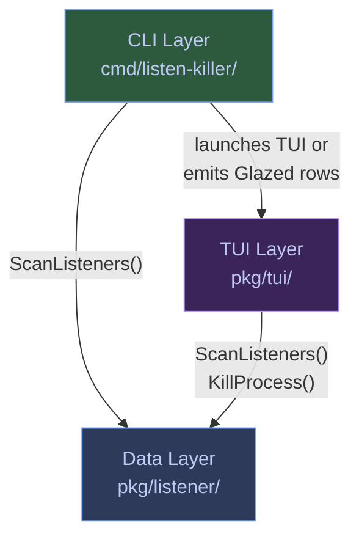
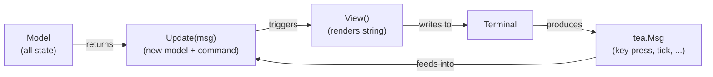

# Building a Bubbletea TUI with the Glazed Command Framework

This article is a technical deep dive into building a real terminal UI application — Listen Killer — that combines two Go ecosystems: Charm's Bubbletea for the interactive TUI and the Glazed command framework for structured CLI output. It explains the architecture from the ground up, why each design decision was made, and the specific traps we fell into along the way. The goal is not to document what Listen Killer does (its README covers that), but to teach a future builder how to combine these frameworks correctly — and where the sharp edges are.

> [!summary]
> 1. A three-layer architecture (data → TUI → CLI) keeps concerns separable and testable independently. The scanner knows nothing about Bubbletea; the TUI knows nothing about Cobra flags.
> 2. Bubbletea's Elm Architecture is deceptively simple: every key must reach the right component. If you intercept a key and forget to delegate it to a child widget, navigation silently breaks.
> 3. Go value-receiver methods create copies. If your helper mutates the model and returns only `(bool, tea.Cmd)`, those mutations are silently discarded. This is the single most common bug in Bubbletea refactorings.

## Why this note exists

Building a TUI that combines Bubbletea and Glazed is not well-documented anywhere. Bubbletea's own examples are single-purpose programs that don't need to worry about CLI output modes, structured data, or command frameworks. Glazed's examples are data-processing pipelines that never take over a terminal. When you need both — an interactive dashboard that also supports `--output json` for scripting — you have to figure out the integration yourself. This article records what we learned so the next person doesn't have to re-derive it from scratch.

The reference implementation is Listen Killer, a dashboard for discovering, inspecting, and killing TCP listener daemons. It's small enough to understand in one sitting (1472 lines across 10 source files) but rich enough to demonstrate every integration point: multi-mark selection, a detail pane, browser launching, bulk kill, and dual-mode output.

## The three-layer architecture

Listen Killer is built in three layers, each with a single responsibility:



The data layer talks to the operating system. The TUI layer renders a dashboard. The CLI layer decides which one runs. None of them reach past their boundaries:

- The scanner (`pkg/listener/scanner.go`) uses gopsutil to read `/proc/net/tcp` and `/proc/<pid>/stat`. It has no concept of a "table row" or a "key binding."
- The TUI (`pkg/tui/`) uses Bubbletea and Lipgloss to draw a table, a detail pane, and a kill dialog. It calls `ScanListeners()` and `KillProcess()` but has no idea that Cobra or Glazed exist.
- The CLI (`cmd/listen-killer/`) wires a Cobra root command with Glazed sections, decides whether to launch the TUI or emit structured rows, and handles `--output json`.

Why separate layers at all? Because the scanner can be reused in a web API, the TUI can be swapped for a different framework without touching data gathering, and the CLI can be tested without a terminal. If everything lived in one `main.go`, you'd have gopsutil calls next to Lipgloss styles next to Cobra flag definitions. It works for a weekend prototype. It doesn't work when you need to test, extend, or reason about the system.

## Layer 1: The data layer

### Finding TCP listeners with gopsutil

On Linux, every listening TCP socket appears in `/proc/net/tcp` as a hex-encoded address and port. You could parse that file directly — and people do — but gopsutil does it for you with typed structs and cross-platform support. The call is a single function:

```go
conns, err := net.Connections("inet")
```

This returns every IPv4 and IPv6 socket on the system — established connections, time-waits, listeners, everything. The filter is your responsibility:

```go
if conn.Type != uint32(syscall.SOCK_STREAM) || conn.Status != "LISTEN" {
    continue
}
```

`SOCK_STREAM` means TCP (as opposed to `SOCK_DGRAM` for UDP). `Status == "LISTEN"` means the socket is accepting new connections, not actively transferring data. Without both checks, you'd show every open TCP connection on the machine — not what you want.

### Enriching sockets with process metadata

A socket alone is just an address and a port. What makes Listen Killer useful is knowing *who* opened it. `gopsutil/process` gives you that:

```go
proc, _ := process.NewProcess(conn.Pid)
name, _ := proc.Name()
cmdline, _ := proc.Exe()
username, _ := proc.Username()
```

Every `gopsutil` call returns an error, and we deliberately ignore most of them with `_`. This is not laziness — it's a design choice. On a typical Linux desktop, some listeners are owned by kernel threads or other users' processes that we don't have permission to inspect. If we errored on the first inaccessible PID, the entire scan would fail. Instead, we skip what we can't read and keep going.

The one call that deserves special attention is `proc.Percent(0)`. gopsutil's CPU usage measurement works by sampling twice and computing the delta. If you pass a positive duration, it blocks for that long. Passing `0` returns the last cached value — which is `0.0` on the first call. This means the CPU% column always reads `0.0%` on the first scan and only becomes accurate on refresh. We accept this tradeoff because blocking the TUI for a second per process would make the initial load painfully slow.

### The central data type: ListenerInfo

Every listening socket produces one `ListenerInfo`:

```go
type ListenerInfo struct {
    PID           int32   `json:"pid"            glazed:"pid"`
    Name          string  `json:"name"           glazed:"name"`
    Cmdline       string  `json:"cmdline"        glazed:"cmdline"`
    Exe           string  `json:"exe"            glazed:"exe"`
    Username      string  `json:"username"       glazed:"username"`
    Port          uint32  `json:"port"           glazed:"port"`
    Address       string  `json:"address"        glazed:"address"`
    Protocol      string  `json:"protocol"       glazed:"protocol"`
    Uptime        string  `json:"uptime"         glazed:"uptime"`
    UptimeSeconds int64   `json:"uptime_seconds" glazed:"uptime_seconds"`
    CPUPercent    float64 `json:"cpu_percent"    glazed:"cpu_percent"`
    RSSBytes      uint64  `json:"rss_bytes"      glazed:"rss_bytes"`
    RSSHuman      string  `json:"rss_human"      glazed:"rss_human"`
}
```

Note the struct tags. Every field has both `json` and `glazed` tags. The `json` tags drive API serialization. The `glazed` tags drive the Glazed CLI output — when the user runs `listen-killer list --no-tui --output json`, Glazed reads these tags to map struct fields to table columns and JSON keys. One struct, two serialization contexts, zero code duplication.

### Killing a process

`KillProcess` is three lines of real logic wrapped in a switch:

```go
var sig syscall.Signal
switch strings.ToUpper(signal) {
case "TERM": sig = syscall.SIGTERM
case "KILL": sig = syscall.SIGKILL
case "INT":  sig = syscall.SIGINT
}
return syscall.Kill(int(pid), sig)
```

`syscall.Kill` sends a signal to a process. SIGTERM asks it to shut down gracefully. SIGKILL forces immediate termination. SIGINT is what Ctrl+C sends — a softer interrupt. We offer all three in the kill dialog because different situations call for different signals: a dev server might clean up on TERM, but a stuck process might need KILL.

## Layer 2: The TUI layer

### The Elm Architecture

Bubbletea implements the Elm Architecture — a pattern from the Elm language that structures interactive programs around three functions:



The key insight: **there is no direct mutation**. `Update` receives the current model and a message, and returns a *new* model. `View` is a pure function of the model. This makes state changes predictable and testable — you always know exactly what changed because `Update` tells you.

In Go, "no direct mutation" means every method has a value receiver, and changes only stick if you return the modified copy. This has consequences that we'll return to.

### The Model struct

The Model holds everything the TUI needs to know:

```go
type Model struct {
    listeners []listener.ListenerInfo  // the data
    table     table.Model              // the table widget
    marked    map[int32]bool           // multi-mark state
    showDetail bool                    // detail pane toggle
    mode      viewMode                 // table, kill dialog
    killPIDs  []int32                  // targets for kill
    killSignal string                  // TERM, KILL, or INT
    // ... styles, help, dimensions, status message
}
```

The `marked` map is the multi-mark feature. When the user presses `space`, we toggle an entry: `m.marked[pid] = true`. When the user presses `K`, we collect all marked PIDs and open the kill dialog. When the kill completes, we delete them from the map. The `●` column in the table is rendered by checking `m.marked[pid]` during row conversion.

The `mode` field controls which key handler runs. There are two modes: `modeTable` (navigation and actions) and `modeKill` (kill confirmation). In table mode, most keys are delegated to the table widget for navigation. In kill mode, `y` confirms, `n` cancels, and `↑↓` changes the signal.

### The critical bug: value receivers and lost mutations

This is the most important lesson in the entire project, and we learned it the hard way.

When we first refactored the table key handling out of `Update()` into a helper method, we wrote this:

```go
func (m Model) handleTableKey(key string) (bool, tea.Cmd) {
    switch key {
    case "K":
        m.mode = modeKill   // ← THIS MUTATION IS LOST
        return true, nil
    }
    return false, nil
}
```

`handleTableKey` is a value-receiver method. When Go calls it, `m` is a copy. Setting `m.mode = modeKill` modifies the copy. The caller still has the original, unmodified model. The kill dialog never opens.

The fix is to return the model:

```go
func (m Model) handleTableKey(key string) (Model, bool, tea.Cmd) {
    switch key {
    case "K":
        m.mode = modeKill   // ← mutation on copy, but we return it
        return m, true, nil
    }
    return m, false, nil
}
```

Now the caller receives the modified copy:

```go
m, handled, cmd := m.handleTableKey(key)
if handled {
    return m, cmd  // ← m now carries the mode change
}
```

This is not a Bubbletea bug — it's Go semantics. But it's the single most common bug when refactoring Bubbletea update logic, because the compiler doesn't warn you. The code compiles. The tests pass. The feature just doesn't work.

### The second critical bug: swallowed navigation keys

Our first `handleTableKey` handled specific keys and returned `m, true, nil` for everything else. The problem: when the user pressed `j` (down), `handleTableKey` didn't match it, returned `handled=true`, and the key was consumed. It never reached the table widget. Navigation was silently broken.

The fix: only intercept keys we explicitly handle. Return `handled=false` for everything else, and the caller delegates to the table:

```go
m, handled, cmd := m.handleTableKey(key)
if handled {
    return m, cmd
}
// Not our key — let the table widget handle navigation
var tCmd tea.Cmd
m.table, tCmd = m.table.Update(msg)
return m, tCmd
```

The `bubbles/table` widget has its own key bindings: `up/k` for LineUp, `down/j` for LineDown, `pgup` for PageUp, `home/g` for GotoTop. If you intercept these before they reach the table, the user sees a frozen cursor. The rule is simple: **in table mode, you are a filter, not a sink**. Pass through what you don't consume.

### Multi-mark: space toggles, auto-advances

The space key does two things: toggles the mark on the current row, and moves the cursor down one row. The auto-advance is deliberate — it lets the user rapid-mark multiple rows without alternating between `space` and `j`:

```go
case " ":
    if m.marked[info.PID] {
        delete(m.marked, info.PID)
    } else {
        m.marked[info.PID] = true
    }
    m.table.SetRows(m.listenersToRows())  // refresh to show ●
    // Auto-advance cursor
    m.table, _ = m.table.Update(tea.KeyMsg{Type: tea.KeyDown})
```

After toggling, we re-render the table rows so the `●` marker appears immediately. Then we synthesize a `KeyDown` event and feed it to the table widget. This is a Bubbletea pattern: you can programmatically generate messages to drive child components.

The `listenersToRows` method (not a free function — it needs `m.marked`) converts the data into table rows with the mark column:

```go
mark := " "
if m.marked[l.PID] {
    mark = "●"
}
rows[i] = table.Row{mark, pid, name, user, port, addr, uptime, cpu, memory}
```

### The detail pane: vertical split below the table

The detail pane sits below the table, separated by a horizontal rule. It uses the full terminal width, which gives enough room for a compact multi-column layout:

```
 585731 — Discord
 PID    585731  Name   Discord   User   manuel   Uptime   7h15m
 Port   6463    Addr   127.0.0.1  CPU    0.0%     Memory  565 MB
 Binary /home/manuel/.config/discord/app-1.0.137/Discord
 Cmd    /proc/self/exe --type=renderer ...
 URL    http://127.0.0.1:6463  ● MARKED
```

Each line is built with `lipgloss.JoinHorizontal`, which places styled label+value pairs side by side. The detail pane auto-updates when the cursor moves because `View()` is called on every frame, and `selectedListener()` reads the current table selection.

The `d` key toggles the detail pane. When toggling, we adjust the table height:

```go
if m.showDetail {
    m.table.SetHeight(m.height - 5 - 12)  // 12 lines for detail
} else {
    m.table.SetHeight(m.height - 5)        // full height
}
```

The magic numbers 5 and 12 account for: title bar (1), header (1), separator (1), footer (1), padding (1) = 5; detail pane ≈ 12 lines. These aren't precise — they're good enough. The detail pane is not a fixed-height widget; it's just a rendered string that the vertical join places below the table.

### Opening a browser from the TUI

Pressing `o` constructs a URL from the selected listener and opens it with `xdg-open` (Linux) or `open` (macOS). The tricky part is normalizing the bind address:

```go
func listenerURL(l *listener.ListenerInfo) string {
    host := l.Address
    if host == "" || host == "*" || host == "::" || host == "0.0.0.0" {
        host = "127.0.0.1"
    }
    return fmt.Sprintf("http://%s:%d", host, l.Port)
}
```

A process bound to `0.0.0.0:8080` is listening on all interfaces. Your browser can't connect to `0.0.0.0` — you need `127.0.0.1`. Similarly, `::` (IPv6 all-interfaces) maps to `[::1]`, but we normalize to `127.0.0.1` for simplicity. A production version would offer both options.

The browser command runs asynchronously via a `tea.Cmd`:

```go
func openBrowserCmd(url string) tea.Cmd {
    return func() tea.Msg {
        cmd := exec.Command("xdg-open", url)
        err := cmd.Start()  // Start, not Run — don't block waiting for the browser
        return BrowserOpenedMsg{URL: url, Err: err}
    }
}
```

`cmd.Start()` fires the browser and returns immediately. `cmd.Run()` would block until the browser exits, which would freeze the TUI. The distinction matters: `Start` is fire-and-forget, `Run` is wait-for-completion.

### The kill dialog: overlay, not replacement

When the kill dialog is active, we don't destroy the table underneath. Instead, we render the table first, then overlay the dialog on top using `lipgloss.Place`:

```go
func (m Model) renderKillOverlay() string {
    dialog := m.styles.Dialog.Render(title + info + signals + footer)
    return lipgloss.Place(w, h, lipgloss.Center, lipgloss.Center, dialog)
}
```

`lipgloss.Place` centers the dialog in the available space. The table is still there — you just can't see it because the dialog covers it. When the user cancels (`n`) or confirms (`y`), we switch `m.mode` back to `modeTable` and the table reappears.

For bulk kills (when multiple processes are marked), the dialog lists all targets:

```
⚠ Kill Process

3 processes:
  • PID 585731 — Discord
  • PID 971766 — coinvault
  • PID 1188438 — python3

  ▶ TERM (graceful)
    KILL (force)
    INT (interrupt)

[y] Confirm  •  [n] Cancel  •  [↑↓] Signal
```

The signal selector is a simple index (`m.killIdx`) that increments or decrements with `↑↓`. The active signal is highlighted with a different Lipgloss style.

## Layer 3: The CLI layer

### Dual mode: TUI vs. structured output

The `ListCommand` implements Glazed's `GlazeCommand` interface. Its `RunIntoGlazeProcessor` method decides which mode to use:

```go
func (c *ListCommand) RunIntoGlazeProcessor(ctx, vals, gp) error {
    useTUI := settings.TUI || (!settings.NoTUI && isTerminal())
    if useTUI {
        return runTUI()        // takes over the terminal
    }
    return runCLI(ctx, gp)      // emits rows through Glazed
}
```

`isTerminal()` checks if stdin is a TTY using `term.IsTerminal`. This means `listen-killer list` launches the TUI, while `listen-killer list | jq` automatically switches to CLI mode because stdout is piped. The `--tui` and `--no-tui` flags let the user override the detection.

When the TUI runs, it calls `tea.NewProgram(m, tea.WithAltScreen()).Run()`. This takes over the terminal completely — alternate screen buffer, raw mode, the works. Glazed's processor is not involved.

When CLI mode runs, the same `ScanListeners()` call produces `ListenerInfo` structs, but instead of feeding them to a table widget, we emit them as Glazed rows:

```go
row := types.NewRow(
    types.MRP("pid", l.PID),
    types.MRP("name", l.Name),
    types.MRP("port", l.Port),
    // ...
)
gp.AddRow(ctx, row)
```

Glazed's processor then handles `--output json`, `--output csv`, `--fields pid,name,port`, and `--sort-columns uptime` without any additional code. This is the core value of the framework: emit rows once, get every output format for free.

### Wiring the root command

The root Cobra command follows the Glazed initialization pattern: add logging flags, register the list subcommand, set up the help system, and default to `list` when no subcommand is given:

```go
if len(os.Args) == 1 {
    os.Args = append(os.Args, "list")
}
```

This is a pragmatic hack. Without it, `listen-killer` with no arguments would show Cobra's default help text instead of launching the TUI. The alternative — setting `rootCmd.RunE` to invoke the list subcommand — caused an infinite recursion because `rootCmd.Execute()` re-invokes `RunE`. The `os.Args` manipulation is fragile but works for a single-subcommand app.

## Common failure modes

### 1. Value-receiver mutations are silently discarded

We covered this above. The fix: always return the model from helper methods. The compiler won't help you — you need to check the return types.

### 2. Navigation keys swallowed by the parent Update

If you handle a key in your top-level `Update` and return early, the table widget never sees it. The fix: only return early for keys you explicitly handle. Delegate everything else.

### 3. viewport.Height defaults to 0 before WindowSizeMsg

The `bubbles/table` widget initializes its viewport with height 20, but `SetHeight` is called in the `WindowSizeMsg` handler. If the first data arrives before the first resize event, the viewport height is still 20 and rows render correctly. But if `SetHeight(0)` is accidentally called first (which happened in an earlier version), `UpdateViewport` computes `end = clamp(0, 0, N) = 0` and renders zero rows. The fix: always set a reasonable default height in the constructor and never set height to 0.

### 4. Footer width underflow before WindowSizeMsg

Before the first resize, `m.width` is 0. Computing `m.width - lipgloss.Width(status) - 4` can produce a negative number, which causes Lipgloss to panic. The fix: clamp to 0:

```go
avail := m.width - lipgloss.Width(status) - lipgloss.Width(helpView) - 4
if avail < 0 {
    avail = 0
}
```

### 5. Kitty terminal and xdotool windowsize

When taking screenshots, `xdotool windowsize` did not resize a kitty window — kitty apparently has a minimum window size determined by its font metrics. The workaround: let kitty open at its natural size, then use ImageMagick `convert -trim -resize` to produce README-friendly images.

## Working rules

- Every key you don't explicitly handle in table mode must be delegated to the table widget. You are a filter, not a sink.
- Helper methods that mutate the model must return it. The Go compiler will not warn you when value-receiver mutations are lost.
- Always set a default table height in the constructor. Never assume `WindowSizeMsg` arrives before data.
- Use `cmd.Start()` for browser opens, not `cmd.Run()`. Blocking on an external process freezes the TUI.
- Normalize bind addresses (`0.0.0.0`, `*`, `::`) to `127.0.0.1` before constructing browser URLs.
- Ignore gopsutil errors gracefully with `_` — some processes are inaccessible, and the scan should continue.
- The `glazed` and `json` struct tags on `ListenerInfo` are the contract between the data layer and both output contexts. Keep them in sync.

## Related notes

- [[PROJ - ZK Tool]] — another Go CLI project using Glazed for structured output
- The Glazed tutorial at `/home/manuel/code/wesen/corporate-headquarters/glazed/pkg/doc/tutorials/05-build-first-command.md`
- The existing `lsof-who` tool at `/home/manuel/code/wesen/corporate-headquarters/go-go-labs/cmd/apps/lsof-who/main.go` — the single-port predecessor that inspired Listen Killer
