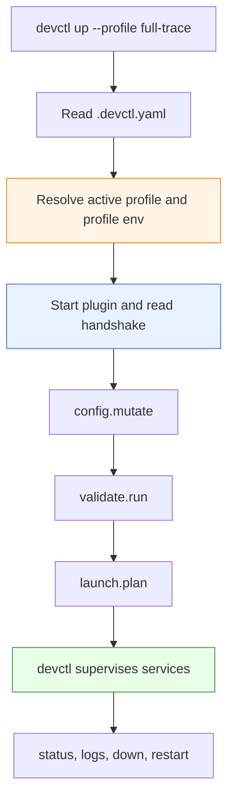
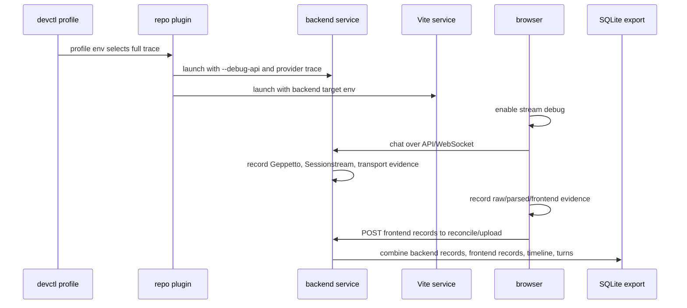

# Devctl Trace Profiles for Pinocchio and CoinVault

This report explains the devctl configuration work that makes Pinocchio and CoinVault launchable in repeatable debugging modes. The practical goal is simple: when an engineer wants to collect provider-to-browser evidence, they should not have to remember a long command line. They should select a devctl profile, let the repository plugin compute the launch plan, and know that the backend, frontend, debug API, and Geppetto observability settings are aligned.

> [!summary]
> - Pinocchio uses `web-chat` and `web-chat-observe` profiles to launch its standalone web-chat backend and Vite frontend.
> - CoinVault uses `local`, `debug`, and `full-trace` profiles to choose between normal local development, compact debug API tracing, and provider-level full-trace collection.
> - In both repositories, the profile does not start services by itself. It selects plugin environment, the plugin returns a launch plan, and devctl supervises the processes.
> - The durable rule is: put run-mode policy in `.devctl.yaml`, put repository-specific command construction in the plugin, and keep long-running service supervision in devctl.

## Why this note exists

The observability work across Geppetto, Sessionstream, Pinocchio, and CoinVault created the ability to correlate streaming evidence from several layers of the system. That ability only becomes useful in daily development if the launch recipe is reliable. A missing `--debug-api` flag means the browser cannot upload frontend records. A missing `--geppetto-trace-level provider` flag means the SQLite database will not contain provider decoded-object records. A missing Vite backend target means the browser may be talking to the wrong backend.

Devctl provides the right abstraction for this problem. The repository describes its local development modes in `.devctl.yaml`. A small plugin knows how to translate those modes into concrete commands. Devctl runs the plugin protocol, validates prerequisites, launches services, captures logs, and stops processes later. The important separation is that the plugin computes facts and plans; it does not become a process supervisor.

The two repositories use the same architectural pattern but with different details. Pinocchio is the reusable chat application and debug reference implementation. CoinVault is an application built on the same stack, with its own MySQL configuration, profile defaults, frontend, and debug export route. Their devctl settings should therefore feel similar, but not identical.

## The devctl model

A devctl repository has two main parts. The first is `.devctl.yaml`, which names plugins and defines optional profiles. The second is a plugin executable, usually a Python script, that speaks devctl's NDJSON stdio protocol. The first stdout line must be a handshake. After that, stdout must contain only protocol frames. Human-readable logs go to stderr.

The profile is a selection and environment layer. It says which plugins participate and what environment values should be visible to them. It does not contain the service command itself. The command belongs in the plugin because the plugin can inspect the repository, choose ports, validate prerequisites, and return a structured launch plan.

The core sequence is:



This sequence matters because it tells you where a bug belongs. If the wrong profile is active, inspect `.devctl.yaml`. If the plan lacks `--debug-api`, inspect the plugin's environment parsing and command builder. If the command is correct but the backend dies, inspect service logs. If the profile exists but devctl does not list it, inspect YAML shape and plugin IDs.

## Pinocchio: the reference web-chat launcher

Pinocchio has two devctl configuration files with the same profiles:

```text
pinocchio/.devctl.yaml
pinocchio/cmd/web-chat/.devctl.yaml
```

This duplication is intentional. It lets an engineer run devctl from the repository root or from `cmd/web-chat`. The root config invokes:

```yaml
plugins:
  - id: pinocchio-webchat
    path: python3
    args:
      - ./cmd/web-chat/plugins/webchat.py
    priority: 10
```

The `cmd/web-chat` config invokes the same plugin through a local path:

```yaml
plugins:
  - id: pinocchio-webchat
    path: python3
    args:
      - ./plugins/webchat.py
    priority: 10
```

The profiles are:

| Profile | Debug API | Geppetto trace level | Purpose |
|---|---:|---:|---|
| `web-chat` | on | `off` | Launch the ordinary Pinocchio web-chat backend and Vite frontend, with debug API routes available but provider tracing disabled. |
| `web-chat-observe` | on | `provider` | Launch web-chat with debug APIs and Geppetto provider-level observability enabled. |

The profile definitions are small because they only express policy:

```yaml
profile:
  active: web-chat

profiles:
  web-chat:
    display_name: Web Chat
    plugins:
      - pinocchio-webchat
    env:
      PINOCCHIO_WEBCHAT_DEBUG_API: "true"
      PINOCCHIO_WEBCHAT_TRACE_LEVEL: "off"

  web-chat-observe:
    display_name: Web Chat with Provider Observability
    plugins:
      - pinocchio-webchat
    env:
      PINOCCHIO_WEBCHAT_DEBUG_API: "true"
      PINOCCHIO_WEBCHAT_TRACE_LEVEL: "provider"
```

The plugin lives at:

```text
pinocchio/cmd/web-chat/plugins/webchat.py
```

It handles several repository-specific responsibilities:

- It emits the devctl protocol handshake before doing anything else.
- It supports `config.mutate`, `validate.run`, `build.run`, `prepare.run`, `launch.plan`, and `command.run`.
- It can locate the web-chat app whether devctl was run from `pinocchio/` or from `pinocchio/cmd/web-chat/`.
- It can choose free backend and Vite ports if the preferred ports are unavailable.
- It builds the Go backend binary into `cmd/web-chat/bin/web-chat` during `build.run`.
- It installs frontend dependencies during `prepare.run` when needed.
- It returns a two-service plan: `backend` and `vite`.

The plugin's configuration environment is intentionally narrow:

```text
PINOCCHIO_WEBCHAT_PROFILE
PINOCCHIO_WEBCHAT_PROFILE_REGISTRIES
PINOCCHIO_WEBCHAT_TRACE_LEVEL
PINOCCHIO_WEBCHAT_DEBUG_API
PINOCCHIO_WEBCHAT_ROOT
PINOCCHIO_WEBCHAT_BACKEND_PORT
PINOCCHIO_WEBCHAT_VITE_PORT
```

The backend command is built in `launch.plan`. The important debug-related fragment is:

```python
backend_args = [
    bin_path,
    "web-chat",
    "--addr", f":{backend_port}",
    "--root", root,
    "--timeline-db", os.path.join(data_dir, "timeline.sqlite"),
    "--turns-db", os.path.join(data_dir, "turns.sqlite"),
    "--geppetto-trace-level", trace_level,
]
if debug_api:
    backend_args.append("--debug-api")
```

The ordinary `web-chat` profile therefore creates a backend that has debug endpoints but does not store provider records. The `web-chat-observe` profile changes only the trace level. That is the smallest useful difference: one profile for everyday local chat, one profile for provider observability.

### Pinocchio command reference

From the repository root:

```bash
cd /home/manuel/workspaces/2026-05-02/use-sessionstream-coinvault/pinocchio

devctl profiles list
devctl plan --profile web-chat --dry-run
devctl plan --profile web-chat-observe --dry-run
devctl up --profile web-chat-observe --force --timeout 180s
```

From the app directory:

```bash
cd /home/manuel/workspaces/2026-05-02/use-sessionstream-coinvault/pinocchio/cmd/web-chat

devctl profiles list
devctl up --profile web-chat-observe --force --timeout 180s
```

The same plugin supports both workflows by detecting the app root.

## CoinVault: application-specific full-trace launcher

CoinVault lives at:

```text
/home/manuel/workspaces/2026-05-02/use-sessionstream-coinvault/2026-03-16--gec-rag
```

Its devctl config is:

```text
2026-03-16--gec-rag/.devctl.yaml
```

Its plugin is:

```text
2026-03-16--gec-rag/plugins/devctl_coinvault.py
```

CoinVault needs more profile choices than Pinocchio because it is an application rather than only the reusable web-chat reference. It has MySQL settings, CoinVault-specific ports, a default Pinocchio profile registry, application profile defaults, durable timeline and turn databases under `var/devctl`, and a full-trace debugging mode that should enable both backend debug routes and provider-level observability.

The committed profiles are:

| Profile | Backend log level | Debug API | Geppetto trace level | Max records | Purpose |
|---|---:|---:|---:|---:|---|
| `local` | `debug` | off | `off` | `100000` default | Normal local CoinVault backend and Vite frontend. |
| `debug` | `debug` | on | `events` | `100000` | Compact debug API run for backend/frontend reconciliation without provider decoded-object records. |
| `full-trace` | `trace` | on | `provider` | `250000` | Full provider-to-browser correlation for SQLite analysis. |

The profile values are expressed as environment variables:

```yaml
profiles:
  full-trace:
    display_name: Full provider trace
    description: Run CoinVault with trace logs, debug API routes, and provider-level Geppetto records for SQLite correlation.
    plugins:
      - coinvault
    env:
      COINVAULT_LOG_LEVEL: trace
      COINVAULT_DEBUG_API: "true"
      COINVAULT_GEPPETTO_TRACE_LEVEL: provider
      COINVAULT_GEPPETTO_TRACE_MAX_RECORDS: "250000"
```

The plugin reads those values in `merged_env()`:

```python
"log_level": os.environ.get("COINVAULT_LOG_LEVEL", DEFAULTS["log_level"]),
"debug_api": os.environ.get("COINVAULT_DEBUG_API", DEFAULTS["debug_api"]),
"geppetto_trace_level": os.environ.get(
    "COINVAULT_GEPPETTO_TRACE_LEVEL",
    DEFAULTS["geppetto_trace_level"],
),
"geppetto_trace_max_records": os.environ.get(
    "COINVAULT_GEPPETTO_TRACE_MAX_RECORDS",
    DEFAULTS["geppetto_trace_max_records"],
),
```

It then validates the trace settings:

```python
if cfg["geppetto_trace_level"] not in {"off", "events", "provider"}:
    errors.append({
        "code": "E_TRACE_LEVEL",
        "message": "COINVAULT_GEPPETTO_TRACE_LEVEL must be one of: off, events, provider",
    })

try:
    max_records = int(cfg["geppetto_trace_max_records"])
    if max_records <= 0:
        raise ValueError("must be positive")
except ValueError:
    errors.append({
        "code": "E_TRACE_MAX_RECORDS",
        "message": "COINVAULT_GEPPETTO_TRACE_MAX_RECORDS must be a positive integer",
    })
```

The backend command is constructed as a shell wrapper that creates `var/devctl` and then `exec`s the real Go command:

```python
script = " ".join([
    "mkdir -p var/devctl && exec",
    "go run ./cmd/coinvault",
    "--log-level", json.dumps(cfg["log_level"]),
    "--with-caller",
    "serve",
    "--serve-host", json.dumps(cfg["backend_host"]),
    "--serve-port", json.dumps(cfg["backend_port"]),
    "--timeline-db", "var/devctl/timeline.db",
    "--turns-db", "var/devctl/turns.db",
    "--profile-registries", json.dumps(cfg["profile_registry"]),
    "--profile", json.dumps(cfg["profile"]),
    "--geppetto-trace-level", json.dumps(cfg["geppetto_trace_level"]),
    "--geppetto-trace-max-records", json.dumps(cfg["geppetto_trace_max_records"]),
])
if truthy(cfg["debug_api"]):
    script += " --debug-api"
```

For `full-trace`, the resulting backend command contains the four settings that matter for deep correlation:

```text
--log-level "trace"
--debug-api
--geppetto-trace-level "provider"
--geppetto-trace-max-records "250000"
```

That command is only one half of the plan. The plugin also launches Vite with a backend target:

```python
{
    "name": "coinvault-vite",
    "cwd": str(repo / "web"),
    "command": ["pnpm", "dev", "--", "--host", cfg["vite_host"], "--port", cfg["vite_port"]],
    "env": {"VITE_COINVAULT_BACKEND_TARGET": backend_url},
}
```

That environment variable keeps browser API and WebSocket requests pointed at the devctl-managed backend. Without it, the frontend may start successfully while talking to the wrong backend, which is one of the easiest ways to collect misleading debug data.

### CoinVault command reference

```bash
cd /home/manuel/workspaces/2026-05-02/use-sessionstream-coinvault/2026-03-16--gec-rag

devctl profiles list
devctl plan --profile local --dry-run --timeout 60s
devctl plan --profile debug --dry-run --timeout 60s
devctl plan --profile full-trace --dry-run --timeout 60s
devctl up --profile full-trace --force --timeout 180s
```

After the browser is open, frontend recording is still a browser-side choice. The backend profile enables the debug API and provider tracing, but the browser must record and upload its local stream evidence. The console helper is:

```js
window.__coinvaultStreamDebug.enable()
window.__coinvaultStreamDebug.uploadSQLite()
```

The UI also exposes the same flow through the export actions that toggle stream debug and download the debug SQLite file.

## Comparing the two repositories

Pinocchio and CoinVault use the same devctl pattern, but their plugins answer different questions.

| Concern | Pinocchio web-chat | CoinVault |
|---|---|---|
| Plugin path | `cmd/web-chat/plugins/webchat.py` | `plugins/devctl_coinvault.py` |
| Main profiles | `web-chat`, `web-chat-observe` | `local`, `debug`, `full-trace` |
| Backend command | Built binary: `bin/web-chat web-chat ...` | `go run ./cmd/coinvault serve ...` |
| Frontend command | `npx vite --port ...` | `pnpm dev -- --host ... --port ...` |
| Port behavior | Finds free backend and Vite ports. | Uses configured defaults unless overridden by env. |
| Debug API setting | `PINOCCHIO_WEBCHAT_DEBUG_API` | `COINVAULT_DEBUG_API` |
| Geppetto trace setting | `PINOCCHIO_WEBCHAT_TRACE_LEVEL` | `COINVAULT_GEPPETTO_TRACE_LEVEL` |
| Trace retention setting | Not profile-controlled in current plugin. | `COINVAULT_GEPPETTO_TRACE_MAX_RECORDS` |
| Durable local data | `cmd/web-chat/var/devctl/*.sqlite` | `var/devctl/timeline.db` and `var/devctl/turns.db` |
| App-specific state | Optional Pinocchio profile and root prefix. | MySQL settings, Pinocchio profile registry, CoinVault profile, timeline/turn DBs. |

The comparison shows why the two plugins should not be forced into one shape. Pinocchio is a reference runtime with a richer devctl lifecycle (`build.run`, `prepare.run`, and `command.run`). CoinVault is an application launcher with a simpler lifecycle and more deployment-specific environment. The common part is not the number of profiles or exact command line. The common part is the contract: profiles choose mode, plugins construct plans, devctl supervises.

## The full-trace mental model

Full tracing is not a single switch. It is a coordinated launch state. At minimum, the backend must expose debug routes, the Geppetto engines must receive an observer configuration, Sessionstream must emit pipeline and transport observer records, and the browser must capture frontend records. Devctl can only configure the backend and frontend processes. It cannot force a human browser tab to record unless the frontend is written to default that behavior on.

The process looks like this:



The key point is that full trace is a chain of necessary conditions. If any condition is missing, the SQLite artifact has a hole:

- Without `--debug-api`, the frontend upload and backend debug endpoints are absent.
- Without `--geppetto-trace-level provider`, provider decoded-object records are absent.
- Without Sessionstream observers, backend pipeline and transport records are absent.
- Without frontend stream debug, browser receipt and mutation evidence is absent.
- Without the Vite backend target, the browser may speak to a different backend than the one devctl launched.

Devctl profiles solve the first, second, and fifth conditions. The application code solves the third and fourth.

## Recommended validation sequence

When changing devctl settings, validate in layers. Start with static protocol and configuration checks, then inspect the plan, then run services.

For Pinocchio:

```bash
cd /home/manuel/workspaces/2026-05-02/use-sessionstream-coinvault/pinocchio

python3 -m py_compile cmd/web-chat/plugins/webchat.py
devctl profiles list
devctl plugins list
devctl plan --profile web-chat-observe --dry-run --timeout 60s
devctl up --profile web-chat-observe --dry-run --timeout 60s
```

For CoinVault:

```bash
cd /home/manuel/workspaces/2026-05-02/use-sessionstream-coinvault/2026-03-16--gec-rag

python3 -m py_compile plugins/devctl_coinvault.py
devctl profiles list
devctl plugins list
devctl plan --profile full-trace --dry-run --timeout 60s
devctl up --profile full-trace --dry-run --timeout 60s
```

The dry-run plan is the most important review artifact. It should show the exact backend command. In CoinVault full-trace mode, look for:

```text
--log-level "trace"
--debug-api
--geppetto-trace-level "provider"
--geppetto-trace-max-records "250000"
```

In Pinocchio observe mode, look for:

```text
--debug-api
--geppetto-trace-level provider
```

After the dry-run plan is correct, run the real environment:

```bash
devctl up --profile full-trace --force --timeout 180s
devctl status --tail-lines 20
devctl logs --service coinvault-api --follow
```

The service names differ by repository. Pinocchio uses `backend` and `vite`. CoinVault uses `coinvault-api` and `coinvault-vite`.

## Common failure modes

### The profile exists but the plan does not change

This usually means the profile environment variable is not the one the plugin reads. In Pinocchio, the plugin reads `PINOCCHIO_WEBCHAT_TRACE_LEVEL`. In CoinVault, the plugin reads `COINVAULT_GEPPETTO_TRACE_LEVEL`. A profile that sets a plausible but wrong variable will appear valid while doing nothing.

### The plugin emits non-JSON stdout

Devctl plugins use stdout for protocol frames. Any diagnostic print on stdout can corrupt the protocol. The Pinocchio plugin has a `log()` helper that writes to stderr. The CoinVault plugin currently has no human logging helper, and its protocol output goes through `emit()`, `respond()`, and `fail()`. Keep it that way.

### The backend is traced but the browser artifact is empty

Backend tracing and frontend recording are separate. The CoinVault `full-trace` profile enables backend debug APIs and provider records. The browser still needs stream debug enabled before the relevant WebSocket messages arrive.

### The browser talks to the wrong backend

This is a frontend proxy/target problem. Pinocchio sets `VITE_BACKEND_ORIGIN`. CoinVault sets `VITE_COINVAULT_BACKEND_TARGET`. If those values are missing or stale, the UI may render while sending traffic elsewhere.

### Trace artifacts grow too large

Provider-level observability records are intentionally high-frequency. CoinVault's `full-trace` profile raises retained records to `250000`. That is appropriate for debugging a single real session, but it should not be treated as a production default. If long traces become common, add explicit retention guidance or a local override.

## Working rules

- A devctl profile should describe a run mode, not duplicate the full service command.
- A plugin should return a launch plan and let devctl supervise long-running processes.
- A full-trace profile should make debug state visible in `devctl plan`, not hide it in an opaque shell script.
- Profile environment variables should be named after the application boundary: `PINOCCHIO_WEBCHAT_*` for Pinocchio web-chat and `COINVAULT_*` for CoinVault.
- Dry-run plans should be reviewed before real smoke tests because they reveal missing flags without starting services.
- Browser-side stream recording is a separate step from backend trace profile selection.
- Do not add raw provider stream capture unless the observability policy explicitly changes; the current trace mode records decoded provider objects and emitted events.

## Current status

Pinocchio has a working devctl setup for ordinary web-chat and provider-observed web-chat. The root and app-local configs support the same profiles so engineers can run from either directory.

CoinVault now has a working devctl setup for normal local runs, debug API/event tracing, and full provider trace runs. The `full-trace` profile is the intended launcher for provider-to-browser SQLite correlation work.

The next useful step is a real browser-backed smoke for each repository: start the observe/full-trace profile, send a prompt, download SQLite, and run a small set of SQL checks proving that provider IDs join to browser reasoning updates.

## Related files

Pinocchio:

- `/home/manuel/workspaces/2026-05-02/use-sessionstream-coinvault/pinocchio/.devctl.yaml`
- `/home/manuel/workspaces/2026-05-02/use-sessionstream-coinvault/pinocchio/cmd/web-chat/.devctl.yaml`
- `/home/manuel/workspaces/2026-05-02/use-sessionstream-coinvault/pinocchio/cmd/web-chat/plugins/webchat.py`

CoinVault:

- `/home/manuel/workspaces/2026-05-02/use-sessionstream-coinvault/2026-03-16--gec-rag/.devctl.yaml`
- `/home/manuel/workspaces/2026-05-02/use-sessionstream-coinvault/2026-03-16--gec-rag/plugins/devctl_coinvault.py`
- `/home/manuel/workspaces/2026-05-02/use-sessionstream-coinvault/2026-03-16--gec-rag/ttmp/2026/05/07/COINVAULT-OBSERVABILITY--add-observer-correlation-export-for-coinvault-web-chat/design/01-coinvault-observer-correlation-architecture-and-implementation-guide.md`
- `/home/manuel/workspaces/2026-05-02/use-sessionstream-coinvault/2026-03-16--gec-rag/ttmp/2026/05/07/COINVAULT-OBSERVABILITY--add-observer-correlation-export-for-coinvault-web-chat/reference/01-implementation-diary.md`

Related Obsidian note:

- [[ARTICLE - Observer Instrumentation - Geppetto Pinocchio Sessionstream Deep Dive]]
