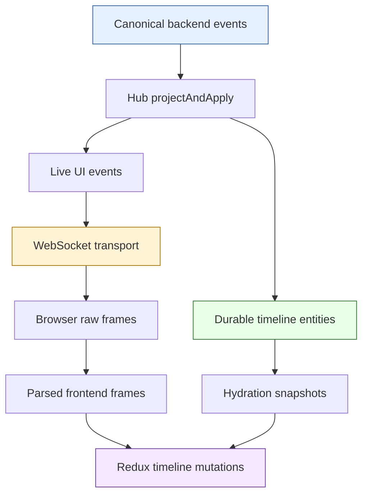
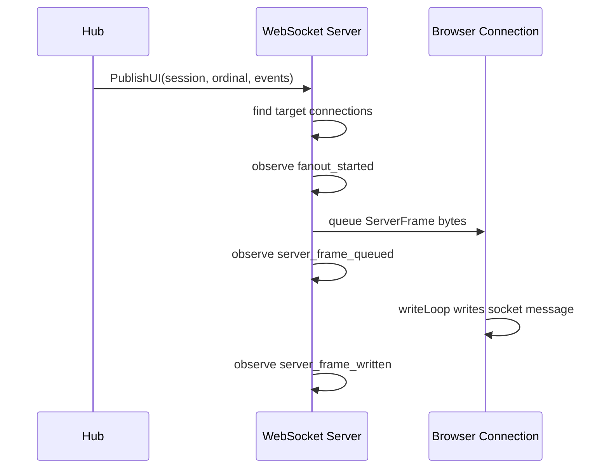
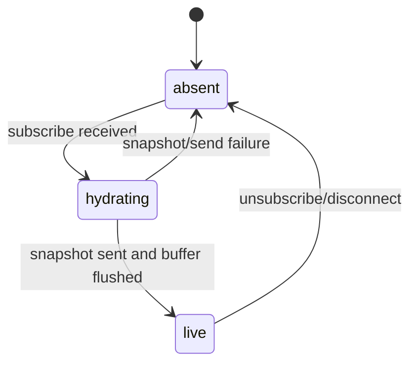
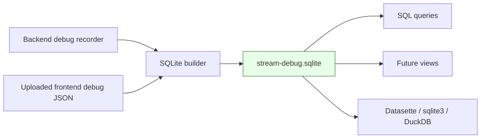

# Instrumenting Sessionstream and Browser Streaming Debug Pipelines

This is the transport-observability branch of the [[sessionstream]] project map.

This article explains the observability architecture we built around `sessionstream` and Pinocchio's browser chat UI. The goal is not merely to say that we added logging. The goal is to show how a streaming system can be instrumented so that a future debugging session can answer a precise question: **where did this event disappear?**

> [!summary]
> - The backend now exposes structured observations from the Sessionstream Hub pipeline and WebSocket transport instead of relying on unstructured logs.
> - The browser records raw WebSocket frames, parsed frames, hydration snapshots, UI-event mutations, and lifecycle events behind `localStorage.setItem('pinocchio.debugStream', '1')`.
> - A reconcile/upload endpoint accepts browser logs and returns a SQLite database containing backend and frontend evidence in schematized tables, so analysis can grow incrementally over time.

The implementation spans two repositories in the workspace:

- `sessionstream`: `/home/manuel/workspaces/2026-05-02/use-sessionstream-coinvault/sessionstream`
- `pinocchio`: `/home/manuel/workspaces/2026-05-02/use-sessionstream-coinvault/pinocchio`

The important commits are:

- `sessionstream` `7cd6789` — Hub `PipelineObserver`.
- `sessionstream` `c0a4b66` — WebSocket `TransportObserver`.
- `sessionstream` `53ad2ff` — subscribe hydration buffering race fix.
- `pinocchio` `89a0423` — backend debug recorder and debug endpoints.
- `pinocchio` `dec3457` — frontend stream debug overlay.
- `pinocchio` `5b7125e` — backend reconciliation endpoint.
- `pinocchio` `beb4c46` — reconcile/upload endpoint returning SQLite.

## Why this note exists

Streaming bugs are hard because the system is doing several things at once. The backend is producing events. Projections are turning those events into UI messages and durable timeline entities. A WebSocket server is delivering frames to one or more browsers. The browser is parsing protobuf JSON, hydrating Redux state, applying live mutations, and rendering cards.

When the UI is wrong, it is tempting to ask a vague question: "Did streaming break?" That question is too large to answer. A useful debugging system turns it into smaller questions:

- Did the backend publish the canonical event?
- Did the Hub projection produce a UI event for that canonical event?
- Did the timeline projection persist durable state for hydration?
- Did WebSocket fanout target the reconnecting browser?
- Was the frame queued?
- Was the frame actually written to the socket?
- Did the browser receive the raw frame?
- Did the browser parse the protobuf JSON wrapper correctly?
- Did the frontend produce a timeline mutation?
- Did the entity survive hydration and rendering?

The instrumentation described here exists to answer those questions with evidence.

## The core mental model: three ledgers and one handoff

A streaming chat system has three ledgers. The word "ledger" is useful because each layer records a different kind of truth.



The first ledger is the **backend event ledger**. It says what happened in the system: an inference started, a message chunk arrived, an agent mode switched, a tool result became available.

The second ledger is the **durable timeline ledger**. It says what state should be restored after reconnect: messages, reasoning blocks, agent mode cards, tool calls, and tool results.

The third ledger is the **live delivery ledger**. It says what frames were sent to which browser connections right now.

The handoff between a durable snapshot and live WebSocket events is the dangerous part. A browser that reconnects during streaming needs to see a coherent story:

```text
snapshot at ordinal N
then live event N+1
then live event N+2
...
```

If the browser receives live event `N+1` before the snapshot, the snapshot may clear the UI state and erase the live event. If the browser receives the snapshot but misses live event `N+1`, the UI can become stuck or incomplete. The instrumentation and race fix were built around this handoff.

## Sessionstream's Hub pipeline observer

The Sessionstream Hub is the backend center of gravity. In normal operation, a command handler publishes backend events. For each backend event, the Hub appends the event, loads the current timeline view, runs projections, applies durable entities, advances the projection cursor, and fans out UI events.

The key function is:

```text
sessionstream/pkg/sessionstream/hub.go
  projectAndApply(ctx, ev)
```

Before instrumentation, this function did the right work but did not expose a structured trace of that work. The new `PipelineObserver` turns one event's journey through the Hub into a record.

The observer API lives in:

```text
sessionstream/pkg/sessionstream/pipeline_observer.go
```

Its conceptual shape is:

```go
type PipelineRecord struct {
    Mode      PipelineMode // live or rebuild
    SessionId SessionId
    Ordinal   uint64
    EventName string
    Event     Event

    EventAppended bool
    AppendErr     error

    ViewOrdinal uint64
    ViewErr     error

    UIEvents        []UIEvent
    UIProjectionErr error

    TimelineEntities      []TimelineEntity
    TimelineProjectionErr error

    AppliedEntities []TimelineEntity
    ApplyErr        error

    TimelineCursorAdvanced bool
    CursorErr              error

    FanoutEvents []UIEvent
    FanoutErr    error
}
```

The important detail is that observation is done with a `defer`. This means early failures are also visible. If the event append fails, the observer still sees a record with `AppendErr`. If UI projection fails, the observer sees the projection error before the existing error policy returns.

Pseudocode:

```go
func projectAndApply(ctx, ev) {
    rec := PipelineRecord{Mode: live, Event: clone(ev)}
    defer observePipeline(ctx, rec)

    rec.EventAppended, rec.AppendErr = appendEvent(ev)
    if rec.AppendErr != nil { return }

    view, err := store.View(ev.SessionId)
    rec.ViewErr = err
    rec.ViewOrdinal = view.Ordinal()
    if err != nil { return }

    uiEvents, uiErr := uiProjection.Project(ev, view)
    rec.UIEvents = clone(uiEvents)
    rec.UIProjectionErr = uiErr

    entities, tlErr := timelineProjection.Project(ev, view)
    rec.TimelineEntities = clone(entities)
    rec.TimelineProjectionErr = tlErr

    applied, applyErr := store.Apply(entities)
    rec.AppliedEntities = clone(applied)
    rec.ApplyErr = applyErr

    fanoutErr := fanout.PublishUI(uiEvents)
    rec.FanoutEvents = clone(uiEvents)
    rec.FanoutErr = fanoutErr
}
```

The observer also instruments rebuild mode. This matters because live streaming and timeline rebuild are separate paths. A system can look correct live but rebuild durable state differently. The record therefore includes:

```go
type PipelineMode string

const (
    PipelineModeLive    PipelineMode = "live"
    PipelineModeRebuild PipelineMode = "rebuild"
)
```

### Why this observer belongs in Sessionstream

This observer is generic. It does not know about Pinocchio, chat bubbles, Redux, or browser overlays. It exposes the framework's own transformation chain. Applications can store those records however they want.

That boundary is important. Sessionstream owns event projection and fanout. Pinocchio owns chat-specific debug APIs, UI panels, and report formats.

## Sessionstream's WebSocket transport observer

The Hub observer answers: **what did the backend produce?**

The WebSocket observer answers: **what happened to that output on the way to a browser connection?**

It lives in:

```text
sessionstream/pkg/sessionstream/transport/ws/observer.go
sessionstream/pkg/sessionstream/transport/ws/server.go
```

The transport observer records stages such as:

```text
connected
client_frame_read
client_frame_decoded
subscribe_received
snapshot_load_started
snapshot_loaded
subscription_registered
fanout_started
fanout_no_targets
ui_event_buffered
hydration_buffer_flushed
subscription_live
server_frame_queued
server_frame_written
server_frame_queue_full
server_frame_write_error
disconnected
```

This distinction is subtle but crucial. A frame can be produced, then queued, then fail during actual socket write. The old `OnUIEventSent` hook meant something closer to "queued" than "written". The new observer makes the lifecycle explicit.

The outgoing channel now carries a small wrapper:

```go
type outboundFrame struct {
    body      []byte
    frameType string
}
```

That lets the write loop report a `server_frame_written` observation without reparsing the protobuf JSON bytes.



## The reconnect race and the hydrating subscription state

The original WebSocket subscribe flow had a race:

```text
client sends subscribe
server loads snapshot
server sends snapshot
server registers connection as subscribed
future live events go to connection
```

The gap is between snapshot loading and subscription registration. If the backend emits a live UI event in that window, the new connection is not yet in `bySession`, so fanout has no target.

The bad interleaving looks like this:

```text
T1  browser sends subscribe
T2  server starts loading snapshot
T3  snapshot returns ordinal 100
T4  backend emits uiEvent ordinal 101
T5  fanout sees no target for new connection
T6  server sends snapshot ordinal 100
T7  server registers connection
T8  backend emits uiEvent ordinal 102
T9  browser receives 102 but missed 101
```

The fix is not simply "subscribe earlier." If live events are sent before the snapshot, the browser may process them and then have hydration clear them. The correct fix is a small state machine:

```text
absent -> hydrating -> live
```

While `hydrating`, the connection is visible to fanout, but events are buffered instead of sent.



The fixed sequence is:

```text
subscribe_received
subscription_registered(state=hydrating)
snapshot_load_started
fanout_started(ordinal=N+1, targets=[conn])
ui_event_buffered(ordinal=N+1)
snapshot_loaded(snapshotOrdinal=N)
server_frame_queued(snapshot N)
hydration_buffer_flushed(ordinals>N)
server_frame_queued(uiEvent N+1)
subscription_live
server_frame_queued(subscribed)
```

The filtering rule is the heart of correctness:

```go
for _, batch := range buffer {
    if batch.ordinal > snapshot.SnapshotOrdinal {
        flush(batch)
    }
}
```

If a buffered event has ordinal less than or equal to the snapshot ordinal, the snapshot may already contain its durable timeline state. Re-sending it as a live event risks duplicate UI state. Events greater than the snapshot ordinal are the ones the browser could otherwise miss.

## Pinocchio's backend debug recorder

Once Sessionstream had generic observers, Pinocchio could wire them into an application-specific recorder.

The recorder lives in:

```text
pinocchio/cmd/web-chat/app/debug_recorder.go
```

It is installed from:

```text
pinocchio/cmd/web-chat/app/server.go
```

when debug mode is enabled.

Conceptually:

```go
recorder := app.NewStreamDebugRecorder(10000)

wsServer, _ := ws.NewServer(snapshotProvider,
    ws.WithTransportObserver(recorder),
)

hub, _ := sessionstream.NewHub(
    sessionstream.WithPipelineObserver(recorder),
    sessionstream.WithUIFanout(wsServer),
)
```

The recorder implements both observer interfaces:

```go
func (r *StreamDebugRecorder) OnPipeline(ctx context.Context, rec sessionstream.PipelineRecord)
func (r *StreamDebugRecorder) OnTransport(ctx context.Context, rec ws.TransportRecord)
```

It converts those records into JSON-safe DTOs. That conversion matters because raw observer records contain protobuf messages and Go `error` values. The HTTP API should not leak arbitrary Go structs as its external contract.

The debug endpoints are enabled by the existing `--debug-api` flag:

```text
GET /api/debug/sessions/{id}/pipeline
GET /api/debug/sessions/{id}/transport
GET /api/debug/sessions/{id}/records
GET /api/debug/sessions/{id}/reconcile
POST /api/debug/sessions/{id}/reconcile/upload
```

The first three endpoints expose raw backend evidence. The fourth does a small backend-only reconciliation. The fifth creates the SQLite artifact described later.

## Pinocchio's browser-side debug recorder

The browser recorder lives in:

```text
pinocchio/cmd/web-chat/web/src/ws/streamDebug.ts
```

It is gated by localStorage:

```js
localStorage.setItem('pinocchio.debugStream', '1')
```

When disabled, recording calls are no-ops. When enabled, the browser stores up to 10,000 debug entries in memory and exposes helpers through:

```js
window.__pinocchioStreamDebug
```

The instrumented frontend path is:

```text
WebSocket raw message
  -> parseServerFrame
  -> CanonicalFrame
  -> applySnapshot or applyUIEvent
  -> timelineMutationFromUIEvent
  -> Redux dispatch
```

The recorder captures:

| Record type | Meaning |
|-------------|---------|
| `raw-ws` | The raw WebSocket message string as received by the browser. |
| `parsed-frame` | The normalized canonical frame after protobuf JSON parsing. |
| `snapshot` | Snapshot ordinal, entity count, and entity mapping/drop information. |
| `ui-event` | UI event ordinal/name/messageId and resulting timeline mutation. |
| `ws-lifecycle` | Browser WebSocket lifecycle such as connect-start, open, close, error. |

The visual overlay lives in:

```text
pinocchio/cmd/web-chat/web/src/webchat/components/StreamDebugPanel.tsx
```

It provides:

- an entry count;
- a free-text filter;
- per-entry JSON expansion;
- clear;
- JSON export;
- Ctrl/Cmd+Shift+D toggle.

It renders only when `pinocchio.debugStream` is enabled.

## Why raw and parsed frontend records both matter

It might seem redundant to store both `raw-ws` and `parsed-frame`. It is not.

A raw WebSocket frame answers transport questions:

- Did the browser receive anything?
- What exactly arrived over the socket?
- Was the server using the protobuf JSON oneof wrapper shape?
- Was the payload a `google.protobuf.Any` with the expected `@type`?

A parsed frame answers frontend protocol questions:

- Did `parseServerFrame` recognize the oneof field?
- Did `unwrapAnyPayload` return the expected payload shape?
- Did `safeOrdinal` accept the ordinal?
- Did the frame become `ui-event`, `snapshot`, `hello`, or `error`?

A UI-event mutation record answers application mapping questions:

- Did `timelineMutationFromUIEvent` handle this event name?
- Did it return `null`?
- Did it create an upsert or delete?
- Which entity ID and kind did it use?

These three records form a browser-side chain of custody.

## The SQLite reconcile/upload artifact

The most recent layer is the SQLite export endpoint:

```text
POST /api/debug/sessions/{sessionId}/reconcile/upload
```

The request body contains frontend debug records. The backend combines them with its own in-memory backend records and returns a SQLite database.

This is intentionally not a one-off analysis report. It is a data artifact.



The endpoint accepts either:

```json
{ "records": [ ... ] }
```

or:

```json
[ ... ]
```

It returns:

```text
Content-Type: application/vnd.sqlite3
Content-Disposition: attachment; filename="pinocchio-stream-debug-{sessionId}.sqlite"
```

The implementation lives in:

```text
pinocchio/cmd/web-chat/app/debug_reconcile_db.go
```

## SQLite schema: raw evidence plus parsed tables

The schema stores every record as raw JSON and also inserts parsed columns into typed tables. This is the right compromise. Raw JSON preserves future fields. Parsed tables make common queries easy.

### Backend tables

```text
backend_records
backend_pipeline
backend_pipeline_ui_events
backend_pipeline_entities
backend_transport
backend_transport_snapshot_entities
```

`backend_records` is the root table:

```sql
CREATE TABLE backend_records (
    id INTEGER PRIMARY KEY AUTOINCREMENT,
    kind TEXT NOT NULL,
    ts TEXT,
    session_id TEXT,
    connection_id TEXT,
    ordinal INTEGER,
    raw_json TEXT NOT NULL
);
```

A Hub pipeline record is expanded into `backend_pipeline`, `backend_pipeline_ui_events`, and `backend_pipeline_entities`.

A WebSocket transport record is expanded into `backend_transport` and, when relevant, `backend_transport_snapshot_entities`.

### Frontend tables

```text
frontend_records
frontend_raw_ws
frontend_parsed_frames
frontend_snapshots
frontend_snapshot_entities
frontend_ui_events
frontend_lifecycle
```

`frontend_records` is the root table:

```sql
CREATE TABLE frontend_records (
    id INTEGER PRIMARY KEY,
    type TEXT NOT NULL,
    ts_ms INTEGER,
    ts_iso TEXT,
    session_id TEXT,
    ordinal INTEGER,
    raw_json TEXT NOT NULL
);
```

A `parsed-frame` record is expanded into `frontend_parsed_frames`. A `ui-event` record is expanded into `frontend_ui_events`. A `snapshot` record is expanded into `frontend_snapshots` and `frontend_snapshot_entities`.

This lets us ask simple questions:

```sql
SELECT ordinal, name
FROM frontend_ui_events
JOIN frontend_records ON frontend_records.id = frontend_ui_events.record_id
ORDER BY ordinal;
```

Or:

```sql
SELECT ordinal, stage, frame_type, error
FROM backend_transport
JOIN backend_records ON backend_records.id = backend_transport.record_id
WHERE stage IN ('fanout_no_targets', 'server_frame_queue_full', 'server_frame_write_error')
ORDER BY ordinal;
```

## How to use the system during an investigation

A typical investigation now has a clear sequence.

### 1. Start Pinocchio with debug API

```bash
web-chat --debug-api ...
```

### 2. Enable browser debug mode

In the browser console:

```js
localStorage.setItem('pinocchio.debugStream', '1')
location.reload()
```

### 3. Reproduce the bug

For example:

- send a prompt;
- reload during streaming;
- open a second tab;
- disconnect/reconnect network;
- watch for missing reasoning/tool/agent-mode entities.

### 4. Inspect live backend endpoints

```bash
curl http://127.0.0.1:8092/api/debug/sessions/$SID/reconcile
curl http://127.0.0.1:8092/api/debug/sessions/$SID/transport
curl http://127.0.0.1:8092/api/debug/sessions/$SID/pipeline
```

### 5. Export browser debug JSON

Use the overlay's **Export** button or:

```js
window.__pinocchioStreamDebug.exportJSON()
```

### 6. Upload browser records and download SQLite

The frontend button is a future convenience, but the endpoint is already available:

```bash
curl -X POST \
  -H 'Content-Type: application/json' \
  --data @frontend-debug.json \
  -o stream-debug.sqlite \
  http://127.0.0.1:8092/api/debug/sessions/$SID/reconcile/upload
```

### 7. Query the database

```bash
sqlite3 stream-debug.sqlite '.tables'
sqlite3 stream-debug.sqlite 'SELECT * FROM meta;'
```

Useful starter queries:

```sql
-- Backend fanout ordinals.
SELECT ordinal, stage, fanout_event_count
FROM backend_records
JOIN backend_transport ON backend_transport.record_id = backend_records.id
WHERE stage = 'fanout_started'
ORDER BY ordinal;
```

```sql
-- Frontend parsed UI event ordinals.
SELECT ordinal, name
FROM frontend_records
JOIN frontend_parsed_frames ON frontend_parsed_frames.record_id = frontend_records.id
WHERE frame_type = 'ui-event'
ORDER BY ordinal;
```

```sql
-- Snapshot entities that frontend dropped.
SELECT record_id, raw_kind, raw_id
FROM frontend_snapshot_entities
WHERE dropped = 1;
```

```sql
-- Transport write errors or queue pressure.
SELECT ordinal, stage, frame_type, queue_len, queue_cap, error
FROM backend_records
JOIN backend_transport ON backend_transport.record_id = backend_records.id
WHERE stage IN ('server_frame_queue_full', 'server_frame_write_error')
ORDER BY ordinal;
```

## Failure modes this architecture can now separate

The point of this design is separation. A single missing UI card can now be classified.

### Backend projection failure

Evidence:

- No `backend_pipeline_ui_events` row for the expected ordinal/event.
- Or `backend_pipeline.ui_projection_error` is non-empty.

Interpretation: the event existed, but projection did not produce a UI event.

### Durable hydration failure

Evidence:

- `backend_pipeline_ui_events` contains the live event.
- `backend_pipeline_entities` lacks the corresponding applied entity.
- Or `backend_pipeline.apply_error` is non-empty.

Interpretation: live stream may have looked correct, but reload/hydration cannot restore it.

### WebSocket targeting failure

Evidence:

- Hub `fanoutEvents` exists for ordinal N.
- No `backend_transport.stage = 'fanout_started'` for ordinal N.
- Or `fanout_no_targets` appears.

Interpretation: the event got out of the Hub but did not target the expected browser connection.

### WebSocket write failure

Evidence:

- `server_frame_queued` exists.
- `server_frame_write_error` exists.
- Or `server_frame_written` is absent for the connection/frame.

Interpretation: the server tried to send the frame but the socket path failed.

### Browser parser failure

Evidence:

- Raw frontend WebSocket record exists.
- Parsed frontend frame is missing or malformed.

Interpretation: likely frontend protocol parsing, oneof shape, `Any` unwrapping, or ordinal parsing.

### Mutation mapping failure

Evidence:

- `frontend_parsed_frames` has `ui-event` ordinal N.
- `frontend_ui_events` has null or empty mutation for that ordinal.

Interpretation: the event reached the browser but the frontend did not map it to a timeline update.

### Hydration mapping failure

Evidence:

- Backend snapshot contains entity kind/id.
- Frontend snapshot record has `dropped = 1` for that entity.

Interpretation: `timelineEntityFromSnapshotEntity` did not understand the entity or payload shape.

## Working rules for future instrumentation

The strongest lesson from this work is that observability should follow ownership boundaries.

- Sessionstream should expose generic framework observations.
- Pinocchio should record and serve app-specific debug artifacts.
- The browser should record what it actually receives and mutates.
- SQLite should preserve raw evidence and make common fields queryable.

Do not put Pinocchio debug endpoints in Sessionstream. Do not put browser rendering knowledge in the Hub. Do not rely on unstructured logs when the real question is a data-flow question.

A good streaming debug record should be able to answer:

```text
What session?
What connection?
What ordinal?
What stage?
What event name?
What entity ID?
What error?
What raw payload?
What parsed payload?
```

If a record cannot answer those questions, it is probably not at the right seam.

## Open questions

The system is now useful, but not finished.

- Should the frontend overlay get a one-click **Upload and download SQLite** button?
- Should the SQLite builder add views such as `delivery_chain`, `missing_frontend_ordinals`, and `snapshot_dropped_entities`?
- Should debug records be persisted server-side for long-running sessions, or is the bounded in-memory recorder enough?
- Should the browser record rendered entity lists after every Redux mutation, or is mutation-level evidence sufficient?
- Should the debug API support pagination for very large backend logs?

## Near-term next steps

The most useful next steps are:

1. Add a frontend button that POSTs `window.__pinocchioStreamDebug.entries()` to `/reconcile/upload` and downloads the returned SQLite DB.
2. Add SQL views to the SQLite artifact for common delivery-chain questions.
3. Run a real browser smoke test for reload-during-streaming with both backend and frontend debug enabled.
4. Use the resulting SQLite DB as the first real artifact to refine the schema.

## Related implementation docs

In the workspace, the main implementation docs are:

- `sessionstream/ttmp/2026/05/06/SS-OBSERVERS--add-hub-and-websocket-observers-for-sessionstream-diagnostics/design-doc/01-observer-implementation-guide.md`
- `sessionstream/ttmp/2026/05/06/SS-WS-RACE--fix-websocket-subscribe-snapshot-race-during-streaming-reconnect/design-doc/01-websocket-subscribe-race-fix-guide.md`
- `pinocchio/ttmp/2026/05/07/PINO-STREAM-DEBUG--investigate-and-harden-web-chat-streaming-robustness-with-event-recording-and-frontend-debug-mode/design/01-streaming-pipeline-investigation-and-debug-guide.md`
- `pinocchio/ttmp/2026/05/07/PINO-STREAM-DEBUG--investigate-and-harden-web-chat-streaming-robustness-with-event-recording-and-frontend-debug-mode/design/02-reconcile-upload-sqlite-export.md`

The durable pattern is larger than these particular files: **instrument the seams, preserve raw evidence, parse enough structure for queries, and let analysis grow as SQL over a stable artifact.**
