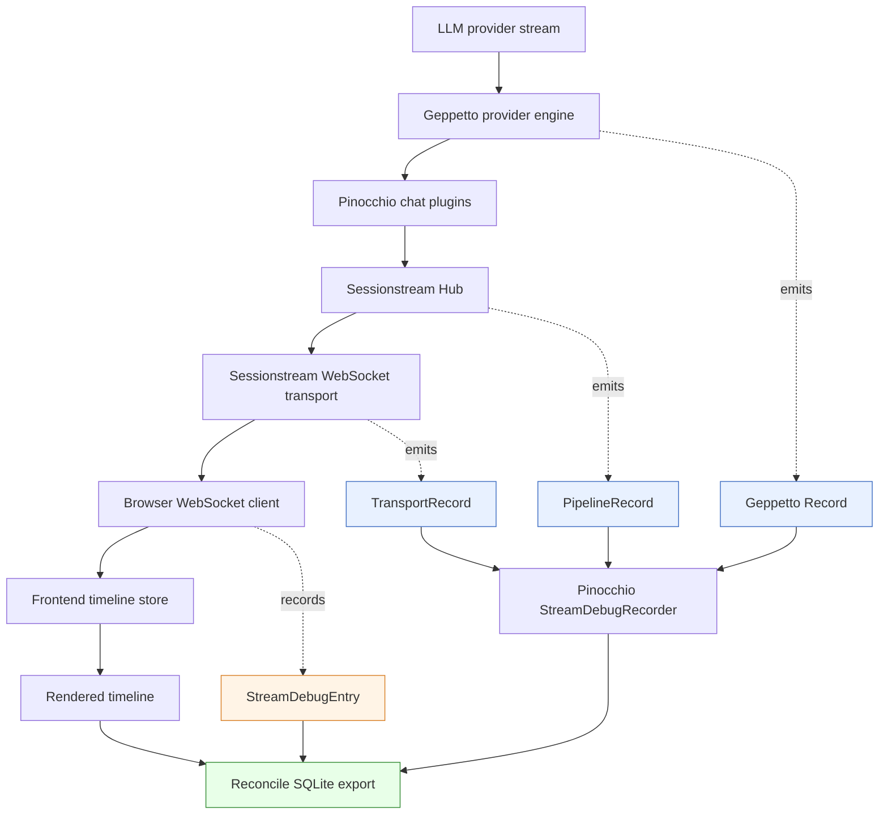

# Observer Instrumentation: Geppetto, Pinocchio, and Sessionstream Deep Dive

This is the end-to-end observer and evidence branch of the [[sessionstream]] project map.

This report explains the observer instrumentation work across Sessionstream, Pinocchio, and Geppetto. The purpose is not to list every commit. The purpose is to preserve the engineering model: where evidence is captured, why each boundary exists, how provider-level inference events become browser-visible timeline mutations, and what failure modes the new instrumentation can now diagnose.

The work spans three repositories in `/home/manuel/workspaces/2026-05-02/use-sessionstream-coinvault`:

- `sessionstream`: reusable event, projection, hydration, and websocket transport infrastructure.
- `geppetto`: reusable LLM provider engines and provider/event observability records.
- `pinocchio`: the web-chat application that wires Sessionstream and Geppetto together, records observer output, exposes debug APIs, and exports SQLite reconciliation artifacts.

> [!summary]
> - Sessionstream now emits neutral Hub pipeline and WebSocket transport observations, so applications can see whether an event was projected, applied, fanned out, queued, and written.
> - Geppetto now emits neutral provider and compact publish-boundary observations, so applications can inspect decoded provider payloads and stable provider identifiers without coupling Geppetto to app-specific storage.
> - Pinocchio owns the recorder, debug HTTP endpoints, browser-side stream recorder, and SQLite export. It is the correlation layer, not the source of reusable observer semantics.
> - The strongest invariant is provider-to-browser traceability: a provider reasoning delta can be related to a Geppetto record, a Sessionstream UI event, a frontend parsed frame, and a durable timeline entity.

## Why this work exists

Streaming chat failures are usually not located at a single line of code. A user sees missing text, duplicated reasoning, stale state after reload, or a blank timeline. The root cause may be much earlier than the symptom: a provider chunk may not contain an item ID, a parser may drop it, Geppetto may normalize a delta, the chat plugin may assign it to the wrong reasoning segment, Sessionstream may project it correctly but fail to fan it out, the WebSocket server may queue it but not write it, or the browser may receive it and fail to mutate Redux state.

Before this work, those boundaries were hard to inspect together. Individual packages had logs and tests, but there was no unified evidence path. The system needed observer APIs that could expose facts without changing runtime behavior, and it needed an application-owned artifact where those facts could be joined.

The design principle is simple: each reusable package emits neutral records about the boundaries it owns, and the application decides what to store, expose, and export.

That decision creates a clean ownership model:

| Layer | Owns | Does not own |
|---|---|---|
| Sessionstream | Hub pipeline observations and WebSocket transport observations. | Pinocchio debug endpoints, SQLite schema, frontend UI. |
| Geppetto | Provider/event observability records and trace-level semantics. | Pinocchio recorder, HTTP API, SQLite export, browser debug UX. |
| Pinocchio | Recorder, debug API, browser stream recorder, SQLite reconciliation, web-chat-specific correlation. | Reusable provider decoding or reusable transport observer semantics. |

This separation matters because Sessionstream and Geppetto are libraries. If either package learned about Pinocchio's debug panel or SQLite schema, the instrumentation would become application code. Instead, Pinocchio implements observer interfaces and records the resulting evidence.

## The end-to-end path

The system now records the path from provider data to browser state. The following diagram shows the important domains and the observer records emitted at each boundary.



A complete investigation can now ask specific questions:

- Did the provider send the field we expected?
- Did Geppetto decode the provider object and preserve provider identity?
- Did the chat plugin publish the right typed UI event?
- Did Sessionstream project that UI event into backend timeline state?
- Did the Hub fan it out?
- Did the WebSocket transport target a connection, queue a frame, and write it?
- Did the browser parse the frame?
- Did the frontend produce a timeline mutation?
- Did the durable timeline contain the expected entity after the stream completed?

Each question corresponds to a table, view, or record field in the debug artifact.

## Sessionstream: observing the event and transport boundaries

Sessionstream owns the reusable event pipeline. It receives backend events, runs projections, applies timeline entities, advances cursors, and fans out UI events. It also owns the WebSocket transport that handles subscribe, snapshot, fanout, queueing, and writes.

The observer work began in Sessionstream because Pinocchio could not reliably debug streaming behavior without knowing what happened inside the framework. Application logs can show that a prompt was submitted. Browser logs can show that a frame arrived. They cannot show whether a projection failed before fanout, whether the fanout target list was empty, or whether a reconnecting client missed events during snapshot loading.

### Hub pipeline observer

The Hub observer API lives in `sessionstream/pkg/sessionstream/pipeline_observer.go`.

The core type is `PipelineRecord`:

```go
type PipelineRecord struct {
    Mode PipelineMode

    SessionId SessionId
    Ordinal   uint64
    EventName string
    Event     Event

    EventAppended bool
    AppendErr     error

    SessionErr error

    ViewOrdinal uint64
    ViewErr     error

    UIEvents        []UIEvent
    UIProjectionErr error

    TimelineEntities      []TimelineEntity
    TimelineProjectionErr error

    AppliedEntities []TimelineEntity
    ApplyErr        error

    TimelineCursorAdvanced bool
    CursorErr              error

    FanoutEvents []UIEvent
    FanoutErr    error
}
```

The record is intentionally wide. A single backend event crosses several internal boundaries, and a useful debug record must describe all of them. If an event was appended but the UI projection failed, that is a different failure from an event that projected successfully but failed during timeline apply. If the Hub fanned out two UI events, the record should contain those events so a later SQL query can compare them with transport and frontend records.

The observer delivery is best-effort and panic-safe:

```go
func (h *Hub) observePipeline(ctx context.Context, rec PipelineRecord) {
    if h == nil || h.pipelineObserver == nil {
        return
    }
    safe := clonePipelineRecord(rec)
    defer func() { _ = recover() }()
    h.pipelineObserver.OnPipeline(ctx, safe)
}
```

Two details are important.

First, the record is cloned before delivery. Protobuf payloads and timeline entities can be mutable. A diagnostic recorder must be able to retain records without retaining live pipeline state.

Second, observer failures cannot affect the pipeline. Observability is evidence. It is not part of command execution semantics. If a recorder panics, the chat should continue.

The Hub observer has two modes:

- `PipelineModeLive` observes normal event processing through `projectAndApply`.
- `PipelineModeRebuild` observes timeline replay through `rebuildTimelineEvent`.

The rebuild mode matters because hydration and reload bugs often involve reconstructed timeline state, not just live events. If only the live path is observed, a class of snapshot and replay bugs remains invisible.

### WebSocket transport observer

The WebSocket transport observer lives in `sessionstream/pkg/sessionstream/transport/ws/observer.go`.

The core type is `TransportRecord`:

```go
type TransportRecord struct {
    Stage     TransportStage
    Direction FrameDirection

    ConnectionId sessionstream.ConnectionId
    SessionId    sessionstream.SessionId

    FrameType   string
    Ordinal     uint64
    EventName   string
    PayloadType string

    SinceSnapshotOrdinal uint64
    SnapshotOrdinal      uint64
    SnapshotEntityCount  int
    SnapshotEntities     []TimelineEntitySummary

    FanoutEventCount int
    FanoutTargetIds  []sessionstream.ConnectionId

    UIEvent sessionstream.UIEvent

    RawBytes int
    QueueLen int
    QueueCap int

    Err error
}
```

Transport observations answer questions that the Hub cannot answer. The Hub can say it produced UI events for fanout. The transport can say whether a connection existed, whether a snapshot was loaded, whether fanout found targets, whether a frame entered the send queue, and whether the write loop wrote it to the socket.

The stages are deliberately precise. Examples include:

- `connected` and `disconnected`
- `client_frame_read` and `client_frame_decoded`
- `subscribe_received`
- `snapshot_load_started`, `snapshot_loaded`, and `snapshot_sent`
- `fanout_started`, `fanout_no_targets`, and `fanout_completed`
- `server_frame_queued`, `server_frame_queue_full`, and `server_frame_written`
- `ui_event_buffered`, `hydration_buffer_flushed`, and `subscription_live`

The diary records one semantic clarification that became important during implementation: the existing `OnUIEventSent` hook meant “queued into the send channel,” not “written to the socket.” The new transport observer separates those facts. `server_frame_queued` and `server_frame_written` are different stages.

That distinction is necessary when debugging browser delivery. If a UI event is queued but never written, the problem is not projection and not target selection. It is queue/write behavior or connection lifecycle.

### The subscribe hydration race

The observer work exposed and supported a separate Sessionstream correctness fix: reconnecting during streaming must receive a snapshot first, then any live events after that snapshot ordinal. The old flow loaded and sent the snapshot before registering the connection in the subscribed connection map. A live event emitted during that gap had no target and could be missed.

The fixed flow is:

```text
1. Register the connection as subscribed but hydrating.
2. Load the snapshot.
3. Fanout sees the hydrating connection and buffers live event batches.
4. Queue the snapshot.
5. Flush buffered batches with ordinal > snapshot ordinal.
6. Mark the subscription live.
7. Queue the subscribed frame.
```

The key invariant is:

```text
snapshot ordinal N is queued first;
only buffered UI batches with ordinal > N are flushed after it;
then the subscription becomes live.
```

This is not only a transport fix. It is also an observability story. The transport observer now emits stages that prove the sequence: hydrating registration, buffered events, buffer flush, subscription live, and subsequent live delivery.

## Geppetto: observing provider and inference boundaries

Geppetto owns the LLM provider engines. It is the only layer that sees decoded provider stream events before they become Geppetto events. That is the boundary where provider schema drift, missing fields, wrong provider interpretation, and reasoning item identity must be captured.

The observer API lives in `geppetto/pkg/observability`.

### Trace levels

The trace configuration is intentionally small:

```go
type TraceLevel string

const (
    TraceOff      TraceLevel = "off"
    TraceEvents   TraceLevel = "events"
    TraceProvider TraceLevel = "provider"
)
```

The levels mean:

| Level | Meaning |
|---|---|
| `off` | Emit no Geppetto observability records. This is the default. |
| `events` | Emit compact Geppetto publish-boundary records. |
| `provider` | Emit event records plus provider routed/normalization records with decoded provider `objectJson`. |

The `raw` level is rejected. This was a deliberate scope decision. Early design discussion considered raw stream string capture. The requirement was then narrowed: store decoded provider `object_json`, not raw SSE strings. This preserves the evidence needed for most schema and interpretation bugs while avoiding raw-wire capture in the first implementation.

The parser makes that policy explicit:

```go
case "raw":
    return "", fmt.Errorf(
        "invalid geppetto trace level %q: raw stream capture is reserved for a future implementation; use off, events, or provider",
        s,
    )
```

### The neutral Geppetto record

The central record type is `geppetto/pkg/observability.Record`:

```go
type Record struct {
    Timestamp time.Time `json:"timestamp"`

    Provider string `json:"provider,omitempty"`
    Model    string `json:"model,omitempty"`

    SessionID   string `json:"sessionId,omitempty"`
    InferenceID string `json:"inferenceId,omitempty"`
    TurnID      string `json:"turnId,omitempty"`
    MessageID   string `json:"messageId,omitempty"`

    Stage       Stage  `json:"stage"`
    EventType   string `json:"eventType,omitempty"`
    InfoMessage string `json:"infoMessage,omitempty"`

    ResponseID   string `json:"responseId,omitempty"`
    ItemID       string `json:"itemId,omitempty"`
    OutputIndex  *int   `json:"outputIndex,omitempty"`
    SummaryIndex *int   `json:"summaryIndex,omitempty"`

    ObjectJSON   json.RawMessage `json:"objectJson,omitempty"`
    EventJSON    json.RawMessage `json:"eventJson,omitempty"`
    MetadataJSON json.RawMessage `json:"metadataJson,omitempty"`

    DeltaLen           int `json:"deltaLen,omitempty"`
    NormalizedDeltaLen int `json:"normalizedDeltaLen,omitempty"`
    BufferLen          int `json:"bufferLen,omitempty"`

    Error string `json:"error,omitempty"`
}
```

This type has two categories of data.

The scalar fields are the query contract. They let SQLite views and debug endpoints filter by stage, provider, event type, response ID, item ID, output index, and session.

The JSON fields are diagnostic evidence. They make it possible to inspect the decoded provider object and, where supported historically, emitted event/metadata payloads. The current policy for OpenAI Chat Completions, OpenAI Responses, and Claude is compact publish-started records without full event/metadata payload JSON. Provider records still carry decoded `objectJson` in provider mode.

The observer delivery function has the same invariant as Sessionstream: observer failures cannot change inference behavior.

```go
func Notify(ctx context.Context, obs Observer, rec Record) {
    if obs == nil {
        return
    }
    if rec.Timestamp.IsZero() {
        rec.Timestamp = time.Now().UTC()
    }
    defer func() {
        _ = recover()
    }()
    obs.OnGeppettoRecord(ctx, rec)
}
```

### Why decoded `objectJson` is the first evidence boundary

The key debugging question for provider integration is often: did the provider omit a field, or did our code lose it?

A normalized event alone cannot answer that question. If normalization is wrong, the normalized event encodes the mistake. The decoded provider object provides lower-level evidence without storing the raw stream string.

For OpenAI Responses reasoning streams, the object can contain fields such as:

- `response_id`
- `item_id`
- `output_index`
- `summary_index`
- `delta`
- nested `response.id`
- nested `item.id`

Those fields must survive into Geppetto records and, eventually, into browser-visible `ReasoningUpdate` payloads. Otherwise a missing reasoning block in the UI cannot be traced back to a provider item.

### Provider-specific instrumentation

The same observer pattern was applied to three Geppetto provider paths.

#### OpenAI Responses

The OpenAI Responses path is the most detailed because it produces reasoning summary deltas and item identity fields. Its observability helper lives in `geppetto/pkg/steps/ai/openai_responses/observability.go`.

It emits two provider stages:

- `provider_routed_event`: a decoded provider object was routed by the provider stream loop.
- `provider_normalize_delta`: a reasoning delta was normalized, with original and normalized lengths recorded.

The provider record extraction is careful to pull identity from several possible provider shapes:

```go
func providerRecordBase(metadata events.EventMetadata, model string, currentResponseID string, eventType string, m map[string]any) geppettoobs.Record {
    rec := geppettoobs.Record{
        Provider:    "openai_responses",
        Model:       model,
        SessionID:   metadata.SessionID,
        InferenceID: metadata.InferenceID,
        TurnID:      metadata.TurnID,
        MessageID:   metadata.ID.String(),
        EventType:   eventType,
        ResponseID:  currentResponseID,
    }
    if v := stringFromProviderMap(m, "response_id"); v != "" {
        rec.ResponseID = v
    } else if response, ok := m["response"].(map[string]any); ok {
        if v := stringFromProviderMap(response, "id"); v != "" {
            rec.ResponseID = v
        }
    }
    if v := itemIDFromProviderObject(m); v != "" {
        rec.ItemID = v
    }
    if idx, ok := intFromProviderNumber(m["output_index"]); ok {
        rec.OutputIndex = &idx
    }
    if idx, ok := intFromProviderNumber(m["summary_index"]); ok {
        rec.SummaryIndex = &idx
    }
    return rec
}
```

The important implementation detail is not the helper itself. The important detail is when records are emitted. Provider records are captured before the object is translated into higher-level Geppetto events. Normalization records are captured around the specific transformation where provider reasoning text becomes browser-visible reasoning chunks.

#### OpenAI Chat Completions

The OpenAI Chat Completions path lives under `geppetto/pkg/steps/ai/openai`. The implementation reuses the same public option pattern:

```go
type EngineOption func(*OpenAIEngine)

func WithObserver(obs geppettoobs.Observer) EngineOption
func WithObservabilityConfig(cfg geppettoobs.Config) EngineOption
```

It emits provider records from `chatStreamEvent.RawPayload`. This was a low-risk implementation because `chatStreamEvent` already retained the decoded provider chunk. The record derives provider name from `settings.Chat.ApiType`, model from the chunk or metadata, event type from the provider `object` field, and response ID from the provider `id`.

OpenAI Chat Completions also emits compact `geppetto_publish_started` records at events trace level. It does not emit publish-done records.

#### Claude / Anthropic

The Claude path lives under `geppetto/pkg/steps/ai/claude`. Its provider stream yields typed `api.StreamingEvent` values. The observer records are emitted immediately after receiving each typed provider event and before `ContentBlockMerger.Add(event)` mutates or merges stream state.

The Claude provider base record extracts:

- provider name from settings, defaulting to `claude`
- model from `ev.Message.Model`
- response ID from `ev.Message.ID`
- item ID from `ev.ContentBlock.ID`
- output index from content block start/delta/stop events
- delta length from text and partial JSON deltas
- provider error message from `ev.Error.Message`

This preserves provider event identity while keeping the Claude SSE decoder unchanged.

### Compact publish-started policy

A major policy change occurred during implementation: publish-boundary records should be compact and started-only for these provider paths.

Earlier design stages experimented with publish-started and publish-done records carrying full event and metadata JSON. Browser validation showed that object/event/metadata capture can make even tiny prompts produce large artifacts. The current policy is:

- `TraceEvents` records compact `StageGeppettoPublishStarted` records.
- Provider mode adds provider routed and normalization records.
- OpenAI Chat Completions, OpenAI Responses, and Claude do not emit publish-done records.
- Publish records intentionally omit full `EventJSON` and `MetadataJSON` to avoid duplicating large streamed payloads.

This leaves one cleanup item: some Pinocchio SQLite schema columns and older views still contain names such as `geppetto_publish_done`, `event_json`, and `metadata_json`. They are harmless as schema capacity, but views that depend on publish-done event JSON should be updated or clearly marked as legacy.

## Pinocchio: recording, exposing, and reconciling evidence

Pinocchio is where the observer streams become usable. It owns the web-chat runtime, the debug recorder, HTTP routes, frontend stream recorder, and SQLite export. This is application code and should remain application code.

### The recorder implements all observer interfaces

The central type is `StreamDebugRecorder` in `pinocchio/cmd/web-chat/app/debug_recorder.go`.

It implements three observer methods:

```go
func (r *StreamDebugRecorder) OnPipeline(ctx context.Context, rec sessionstream.PipelineRecord) {
    r.RecordPipeline(ctx, rec)
}

func (r *StreamDebugRecorder) OnTransport(ctx context.Context, rec wstransport.TransportRecord) {
    r.RecordTransport(ctx, rec)
}

func (r *StreamDebugRecorder) OnGeppettoRecord(ctx context.Context, rec geppettoobs.Record) {
    r.RecordGeppetto(ctx, rec)
}
```

This is the integration point that justifies keeping Sessionstream and Geppetto observers neutral. Pinocchio can accept records from both packages without either package importing Pinocchio.

The recorder stores a bounded in-memory ring:

```go
func (r *StreamDebugRecorder) append(rec DebugRecord) {
    r.mu.Lock()
    defer r.mu.Unlock()
    r.records = append(r.records, rec)
    if len(r.records) > r.maxRecords {
        copy(r.records, r.records[len(r.records)-r.maxRecords:])
        r.records = r.records[:r.maxRecords]
    }
}
```

The default limit is 10,000 records. The limit is appropriate for debug mode, but the browser validation showed that high-frequency provider traces can grow quickly. Long sessions should use explicit max-record settings and eventually stronger retention controls.

### Debug API routes

When `--debug-api` is enabled, Pinocchio exposes session-scoped debug endpoints under `/api/debug/sessions/{id}/...`.

The important routes are:

- `/pipeline`: Sessionstream Hub pipeline records.
- `/transport`: WebSocket transport records.
- `/geppetto`: Geppetto provider/event observability records.
- `/records`: combined backend records.
- `/reconcile`: a lightweight backend pipeline-vs-transport ordinal comparison.
- `/reconcile/upload`: accepts frontend stream debug entries and returns a SQLite database.

The debug API is disabled by default. This is correct because records can include prompt content, provider objects, raw WebSocket frames, and timeline state.

### Runtime wiring

The web-chat command decodes Geppetto observability settings, creates the recorder if `--debug-api` is enabled, and injects provider observer options into the engine factory when tracing is enabled.

The essential wiring in `pinocchio/cmd/web-chat/main.go` is:

```go
var debugRecorder *appserver.StreamDebugRecorder
if s.DebugAPI {
    debugRecorder = appserver.NewStreamDebugRecorder(obsSettings.MaxRecords)
}
if debugRecorder != nil && obsConfig.Enabled() {
    runtimeComposer.WithEngineFactory(enginefactory.NewStandardEngineFactory(
        enginefactory.WithOpenAIResponsesOptions(
            openairesponses.WithObserver(debugRecorder),
            openairesponses.WithObservabilityConfig(obsConfig),
        ),
        enginefactory.WithClaudeOptions(
            claude.WithObserver(debugRecorder),
            claude.WithObservabilityConfig(obsConfig),
        ),
    ))
}
```

One later validation exposed an integration gap: Claude observability was implemented in Geppetto, but Pinocchio initially only wired OpenAI Responses options. The fix was to add `WithClaudeOptions(...)` to the factory construction above.

OpenAI Chat Completions has Geppetto engine support and factory option support, but the current web-chat wiring shown here explicitly includes OpenAI Responses and Claude. If a profile uses the OpenAI Chat Completions engine path and must be traced through web-chat, Pinocchio should also wire `WithOpenAIOptions(...)`.

### Frontend stream recorder

Backend records are not enough. A frame can be produced, fanned out, queued, and written, but still be parsed incorrectly or mapped into the wrong frontend mutation. Pinocchio therefore has a browser-side recorder in `pinocchio/cmd/web-chat/web/src/ws/streamDebug.ts`.

It is gated by localStorage:

```ts
const STORAGE_KEY = 'pinocchio.debugStream';

function isEnabled(): boolean {
  try {
    return window.localStorage.getItem(STORAGE_KEY) === '1';
  } catch {
    return false;
  }
}
```

The recorder captures:

- `raw-ws`: raw WebSocket message strings, size, and preview.
- `parsed-frame`: canonical parsed frames.
- `snapshot`: snapshot mapping details and dropped entities.
- `ui-event`: frontend UI-event mutation details.
- `ws-lifecycle`: connect, open, close, error, reconnect.

The browser exposes `window.__pinocchioStreamDebug` with methods for entries, clear, JSON export, SQLite upload/download, enable, and disable. The UI also includes a debug panel and a SQLite download button.

A later P2 bug fix changed the SQLite upload URL from an absolute `/api/debug/...` path to a runtime-prefix-aware URL using `basePrefixFromLocation()`. This matters when web-chat is served under a root such as `/chat` with `--root`.

The fixed code uses:

```ts
const basePrefix = basePrefixFromLocation();
const resp = await fetch(`${basePrefix}/api/debug/sessions/${encodeURIComponent(sessionId)}/reconcile/upload`, {
  method: 'POST',
  headers: { 'Content-Type': 'application/json' },
  body,
});
```

That small fix is part of the same instrumentation story: debug tools must respect the same deployment topology as the app they debug.

### SQLite as the reconciliation artifact

The SQLite export is the most important Pinocchio deliverable. It turns ephemeral in-memory and browser records into a queryable artifact.

The schema includes backend records:

- `backend_records`
- `backend_pipeline`
- `backend_pipeline_ui_events`
- `backend_pipeline_entities`
- `backend_transport`
- `backend_transport_snapshot_entities`

It includes Geppetto records:

- `geppetto_records`
- `geppetto_provider_events`
- `geppetto_emitted_events`

It includes frontend records:

- `frontend_records`
- `frontend_raw_ws`
- `frontend_parsed_frames`
- `frontend_snapshots`
- `frontend_snapshot_entities`
- `frontend_ui_events`
- `frontend_lifecycle`

It also includes persisted state:

- `timeline_entities`
- `turns`

This combination is the key design move. Events explain what happened. Persisted state explains what remained after it happened. A debug artifact that contains only events cannot prove whether the final timeline is correct. A debug artifact that contains only state cannot explain how that state was produced.

The schema keeps raw JSON alongside typed columns. This is deliberate. Typed columns support common joins and filters. Raw JSON protects future investigations from schema incompleteness.

### Built-in views

Several views encode common questions:

| View | Question answered |
|---|---|
| `missing_transport_fanout` | Which pipeline fanout ordinals did not reach WebSocket transport fanout? |
| `extra_transport_fanout` | Which transport fanouts have no corresponding pipeline record? |
| `backend_pipeline_errors` | Which Hub stages recorded errors? |
| `backend_transport_errors` | Which transport stages recorded errors? |
| `frontend_parsed_no_mutation` | Which parsed UI-event frames did not produce frontend mutations? |
| `frontend_dropped_entities` | Which snapshot entities were dropped during frontend hydration mapping? |
| `delivery_chain` | For each backend ordinal, did transport fanout and frontend parsing occur? |
| `entity_kind_summary` | What durable timeline entities exist by kind? |
| `geppetto_reasoning_sequence` | What reasoning/provider records exist in chronological order? |
| `geppetto_summary_without_item_id` | Which summary records are missing provider item IDs? |
| `geppetto_publish_errors` | Which Geppetto publish records contain errors? |
| `geppetto_provider_to_emitted` | Which provider item IDs relate to emitted Geppetto events? |
| `geppetto_reasoning_to_frontend` | How do provider reasoning deltas relate to backend/frontend/timeline records? |

Some Geppetto views were built during the earlier publish-done/event-json phase and should be reviewed against the current compact publish-started policy. The stable direction is direct provider ID propagation into `ReasoningUpdate`, not dependence on publish-done event JSON.

## Reasoning identity: the provider ID problem

The deepest correlation issue was reasoning identity. Provider streams can interleave reasoning items. A browser-visible reasoning block is not just “the current assistant message.” It may correspond to a provider response ID, item ID, output index, and summary index.

The first browser-backed SQLite run showed that provider records and frontend reasoning chunks could be correlated by row order and exact chunk matching. That was useful, but it was not strong enough. Row-order matching is diagnostic, not a durable contract.

The fix was to carry provider IDs into Pinocchio's typed `ReasoningUpdate` payload.

The protobuf fields added were:

- `provider`
- `response_id`
- `item_id`
- optional `output_index`
- optional `summary_index`

The reasoning plugin then preserves these fields from Geppetto event metadata and emits them through started/delta/finished reasoning updates. The tests specifically verify zero-valued optional indexes, because `output_index = 0` and `summary_index = 0` are valid provider values and must not be mistaken for missing values.

This forced a second correctness fix: the reasoning state machine needed provider-aware segment keys.

The state now distinguishes segments by a key containing:

- parent message ID
- provider
- response ID
- item ID
- output index presence/value

`summaryIndex` is treated as metadata, not as segment identity. That prevents summary updates from detaching from the provider item segment they summarize.

This also fixed a real duplication bug. A later `reasoning-summary` event was creating a second thinking entity after the first reasoning segment had ended. The durable timeline showed two entities:

```text
chat-msg-1:thinking:1
chat-msg-1:thinking:2
```

The fix was to treat `reasoning-summary` as an update to the completed reasoning segment when one exists, not as a new reasoning segment.

## Reading the artifact: provider to browser

A complete provider-to-browser reasoning query follows this conceptual sequence:

```text
provider object
  -> Geppetto provider_normalize_delta record
  -> Geppetto publish/start or backend event context
  -> Sessionstream backend pipeline UI event
  -> WebSocket transport fanout and write
  -> frontend parsed ChatReasoningAppended frame
  -> frontend UI-event mutation
  -> timeline entity
```

In the browser-backed validation runs, the recorded counts showed that the chain was not theoretical.

One run produced:

```text
frontend_record_count: 837
backend_record_count: 1941
geppetto_record_count: 1111
geppetto_provider_events: 547
geppetto_emitted_events: 564
geppetto_reasoning_sequence: 545
geppetto_summary_without_item_id: 0
geppetto_publish_errors: 0
delivery_chain: 275
```

A later run produced:

```text
backend_record_count: 2690
frontend_record_count: 1158
geppetto_record_count: 1539
geppetto_provider_events: 757
geppetto_emitted_events: 782
geppetto_reasoning_sequence: 752
geppetto_summary_without_item_id: 0
geppetto_publish_errors: 0
delivery_chain: 382
```

The correlation quality check found exact matches between post-normalization Geppetto deltas and frontend chunks:

```text
geppetto_to_frontend: 359/359 exact matches
backend_to_frontend: 359/359 exact matches
provider_to_frontend: 356/359 exact matches
```

The provider-to-frontend mismatches were expected. Provider `object_json.delta` is pre-normalization. Frontend chunks reflect normalized Geppetto output. The stable exact comparison is Geppetto's post-normalization delta to frontend `payload.chunk`.

That distinction is important. It tells the reader where to compare if the question is “did the browser receive what Geppetto emitted?” and where to compare if the question is “did Geppetto normalize provider text?”

## Validation history

The implementation was validated at several levels.

### Sessionstream validation

Sessionstream observer and race-fix work used targeted package tests:

```bash
go test ./pkg/sessionstream -count=1
go test ./pkg/sessionstream/... -count=1
go test ./pkg/sessionstream/transport/ws -race -count=1
```

The race detector command was listed as future/feasible validation in the diary. The main deterministic tests covered observer delivery, observer panic recovery, rebuild observation, malformed WebSocket frames, fanout with no targets, subscribe buffering, duplicate prevention, multi-tab live/hydrating behavior, and buffer overflow.

### Geppetto validation

Geppetto validation included provider-specific tests and full repository hooks:

```bash
go test ./pkg/observability ./pkg/cli/bootstrap ./pkg/steps/ai/openai_responses -count=1
go test ./pkg/inference/engine/factory ./pkg/steps/ai/openai_responses ./pkg/observability ./pkg/cli/bootstrap -count=1
go test ./pkg/steps/ai/openai ./pkg/inference/engine/factory
go test ./pkg/steps/ai/openai ./pkg/steps/ai/openai_responses ./pkg/inference/engine/factory
go test ./pkg/steps/ai/claude ./pkg/inference/engine/factory
```

A Gosec issue later appeared around unsigned narrowing in Pinocchio's reasoning index parsing, not in Geppetto. The fix converted unsigned values through safe string parsing and added overflow tests.

### Pinocchio validation

Pinocchio validation included backend tests, frontend typecheck/tests, Playwright browser runs, and SQLite queries:

```bash
go test ./cmd/web-chat ./cmd/web-chat/app -count=1
go test ./pkg/chatapp ./pkg/chatapp/plugins ./cmd/web-chat -count=1
cd cmd/web-chat/web && npm run typecheck
cd cmd/web-chat/web && npx vitest run src/ws/streamDebug.test.ts src/ws/wsManager.test.ts src/utils/basePrefix.test.ts
make web-check
```

Browser validation exercised:

- real web-chat sessions through the UI;
- frontend stream debug enabled in the browser;
- `/geppetto` debug endpoint;
- frontend debug upload to `/reconcile/upload`;
- SQLite artifacts saved under `/tmp/browser-chat-e2e.sqlite` and `/tmp/browser-chat-e2e2.sqlite`;
- reload-during-streaming with snapshot and buffered live events;
- OpenAI Responses profile runthrough;
- Claude `haiku` profile runthrough.

The Claude run confirmed:

```text
Geppetto records: 14
provider_routed_event: 8
geppetto_publish_started: 6
publish_done records: 0
visible assistant output: pong
browser console warnings/errors: none
```

The OpenAI Responses size run confirmed that publish-started records were small compared to provider `objectJson` records.

## What was difficult

### Cross-repository dependency state

Pinocchio depends on local Sessionstream observer APIs and local Geppetto observability APIs. During the work, Pinocchio's normal `GOWORK=off` hook could not always pass because the pinned module versions did not contain the local APIs. Workspace-mode targeted tests passed, but module-isolated linting failed until dependencies are released or updated.

This is not an observer design problem, but it is a release coordination problem. Cross-repository instrumentation must be merged in dependency order or tested with explicit local replacement strategy.

### Payload size

Provider mode emits high-frequency records. Even small prompts produced large artifacts when full payload JSON was duplicated at several stages. This led to the compact publish-started policy.

The working rule should be:

- Provider records may carry decoded `objectJson` when provider mode is enabled.
- Publish-boundary records should stay compact unless a specific investigation requires full event payloads.
- SQLite should keep schema capacity for raw JSON, but retention policy should be owned by the application recorder/export layer.

### Correlation identity

The first provider-to-browser proof relied on ordered chunk matching. That was enough to prove feasibility, but not enough for a stable debugging contract. Provider identity needed to be carried into `ReasoningUpdate` and durable timeline entities.

This is a general rule: if a provider gives stable item IDs, carry them forward. Do not depend on sequence order when the provider already supplied identity.

### Frontend and deployment details

The stream debug SQLite upload originally used an absolute `/api/debug/...` URL. That failed under a configured web-chat root prefix such as `/chat`. Debugging features must use the same runtime base-prefix mechanism as normal application requests.

Biome also surfaced unrelated frontend import and unused-variable issues. These were fixed and `web-check` was routed through the repository `make web-check` target, with `web-check` added to pre-push.

## Implementation sequence for future observer work

The safest sequence for adding a new observer surface is:

1. Add the reusable neutral observer type in the owning package.
2. Make observer delivery best-effort, panic-safe, and non-mutating.
3. Add options that preserve existing constructors and callers.
4. Emit records at stable boundaries before application-specific storage exists.
5. Add package-level tests for trace-off behavior, observer panic recovery, and record content.
6. Wire the application recorder as an observer.
7. Add debug endpoints behind an explicit debug flag.
8. Add SQLite tables with both typed columns and raw JSON.
9. Add views only after real artifacts show which joins are useful.
10. Run a browser-backed validation that includes frontend records, backend records, provider records, and persisted state.

The pseudocode looks like this:

```go
// Reusable package.
type Observer interface {
    OnRecord(ctx context.Context, rec Record)
}

func Notify(ctx context.Context, obs Observer, rec Record) {
    if obs == nil { return }
    rec = cloneOrNormalize(rec)
    defer func() { _ = recover() }()
    obs.OnRecord(ctx, rec)
}

// Application package.
type Recorder struct { ... }

func (r *Recorder) OnRecord(ctx context.Context, rec Record) {
    r.append(encodeForDebugAPI(rec))
}

// Runtime wiring.
if debugAPI && traceConfig.Enabled() {
    engineFactory = NewFactory(WithProviderOptions(
        WithObserver(recorder),
        WithObservabilityConfig(traceConfig),
    ))
}
```

This sequence prevents the common mistake of designing the database schema first. The schema should be informed by real records and real questions.

## Working rules

- Observer records must never change runtime behavior. They should be panic-safe and best-effort.
- Reusable packages should emit neutral records. Application packages should own storage, HTTP routes, export formats, and UI.
- Stable scalar fields are for queries. Raw or decoded JSON fields are for inspection.
- Provider IDs should be propagated whenever they exist. Sequence order is a fallback, not a contract.
- Snapshot hydration must preserve order: snapshot first, then buffered events with ordinals greater than the snapshot ordinal, then live subscription.
- Frontend debug evidence must include both raw receipt and interpreted mutation. Either side can be wrong.
- SQLite artifacts should contain events and state. A complete debug artifact needs both.
- Debug routes and upload URLs must honor the same base prefix and deployment root as the normal application.
- High-frequency traces require explicit retention policy. The recorder/export layer is the right place to own that policy.

## Important files

Sessionstream:

- `/home/manuel/workspaces/2026-05-02/use-sessionstream-coinvault/sessionstream/pkg/sessionstream/pipeline_observer.go`
- `/home/manuel/workspaces/2026-05-02/use-sessionstream-coinvault/sessionstream/pkg/sessionstream/hub.go`
- `/home/manuel/workspaces/2026-05-02/use-sessionstream-coinvault/sessionstream/pkg/sessionstream/transport/ws/observer.go`
- `/home/manuel/workspaces/2026-05-02/use-sessionstream-coinvault/sessionstream/pkg/sessionstream/transport/ws/server.go`

Geppetto:

- `/home/manuel/workspaces/2026-05-02/use-sessionstream-coinvault/geppetto/pkg/observability/observer.go`
- `/home/manuel/workspaces/2026-05-02/use-sessionstream-coinvault/geppetto/pkg/observability/config.go`
- `/home/manuel/workspaces/2026-05-02/use-sessionstream-coinvault/geppetto/pkg/steps/ai/openai_responses/observability.go`
- `/home/manuel/workspaces/2026-05-02/use-sessionstream-coinvault/geppetto/pkg/steps/ai/openai/observability.go`
- `/home/manuel/workspaces/2026-05-02/use-sessionstream-coinvault/geppetto/pkg/steps/ai/claude/observability.go`
- `/home/manuel/workspaces/2026-05-02/use-sessionstream-coinvault/geppetto/pkg/inference/engine/factory/factory.go`

Pinocchio:

- `/home/manuel/workspaces/2026-05-02/use-sessionstream-coinvault/pinocchio/cmd/web-chat/main.go`
- `/home/manuel/workspaces/2026-05-02/use-sessionstream-coinvault/pinocchio/cmd/web-chat/app/debug_recorder.go`
- `/home/manuel/workspaces/2026-05-02/use-sessionstream-coinvault/pinocchio/cmd/web-chat/app/debug_record_geppetto.go`
- `/home/manuel/workspaces/2026-05-02/use-sessionstream-coinvault/pinocchio/cmd/web-chat/app/debug_reconcile_schema.go`
- `/home/manuel/workspaces/2026-05-02/use-sessionstream-coinvault/pinocchio/cmd/web-chat/app/debug_reconcile_views.go`
- `/home/manuel/workspaces/2026-05-02/use-sessionstream-coinvault/pinocchio/cmd/web-chat/web/src/ws/streamDebug.ts`
- `/home/manuel/workspaces/2026-05-02/use-sessionstream-coinvault/pinocchio/pkg/chatapp/plugins/reasoning.go`
- `/home/manuel/workspaces/2026-05-02/use-sessionstream-coinvault/pinocchio/proto/pinocchio/chatapp/v1/chat.proto`

## Open follow-ups

1. Update Pinocchio Geppetto SQLite views for the current compact publish-started policy. In particular, any view that depends on `geppetto_publish_done` and `event_json` should be revised, replaced, or marked legacy.
2. Wire OpenAI Chat Completions observability into Pinocchio web-chat if any web-chat profile uses that engine path and should be traced from the browser.
3. Align released module versions so Pinocchio `GOWORK=off` validation can see the Sessionstream observer APIs and Geppetto observability APIs.
4. Add explicit retention controls for high-frequency provider traces, possibly per kind or per session.
5. Add automated browser-backed SQLite validation as a repeatable integration test or dev script.
6. Consider adding SQLite views that directly use `ReasoningUpdate` provider IDs instead of row-order joins for reasoning deltas.
7. Keep raw stream string capture out of the default path unless a specific malformed-frame investigation requires it.

## Closing

The observer instrumentation work changed the debugging model. The system no longer depends on a single log stream or a single frontend symptom. It records the boundaries that matter: provider decode, Geppetto normalization, chat plugin publication, Sessionstream projection, WebSocket transport, browser parsing, frontend mutation, and durable state.

The most important result is not one endpoint or one table. The important result is that each layer now reports the facts it owns, and Pinocchio can assemble those facts into a single SQLite artifact. That artifact lets an engineer debug streaming behavior by asking precise questions and following evidence across repository boundaries.
