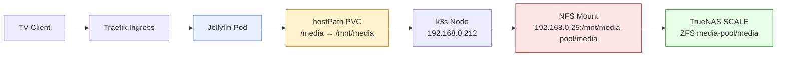

# Playbook: Downloading Video Lectures to a Jellyfin Media Server

This is a practical playbook for downloading video content — course lectures, conference talks, educational series — and making it available on a Jellyfin media server. It covers source identification, file naming for automatic episode detection, uploading files through NFS, configuring Jellyfin libraries, and the infrastructure problems you will actually hit when you try.

The reference implementation is a homelab Jellyfin deployment running in Kubernetes (k3s), backed by TrueNAS SCALE over NFS, serving a Samsung TV. But the patterns here generalize: any setup where a media server reads files from network storage will encounter the same class of problems.

The target audience is someone who runs a home media server and wants to add downloaded video content to it — and who would rather understand why things break than follow a recipe that silently fails.

## What we built

This playbook was developed and validated by downloading **17 CS lecture series** (371 videos, 53GB) and serving them through Jellyfin. The courses span three domains:

| Domain | Courses | Videos | Size |
|--------|---------|--------|------|
| **Compilers / VMs** | Soshnikov (6 courses), Stanford CS143, UCB CS294-113 | 143 | 14G |
| **Operating Systems** | MIT 6.S081, IIT Bombay, Berkeley CS162, OSTEP | 111 | 21G |
| **Programming Languages** | KAIST CS520, Nand2Tetris, Type Systems, Proof/Type Theory | 103 | 15G |
| **Classics** | SICP (1986) | 20 | 2.9G |
| **Total** | **17 series** | **377** | **~53G** |

All 12 series are live in Jellyfin, detected as TV shows with season/episode metadata, and playable from a Samsung TV.

## When to use this playbook

Use this approach when:

- you want to download video lectures or series from the internet and watch them through Jellyfin, Plex, or similar
- your media files live on network-attached storage (NFS, SMB, or similar) rather than local disk
- you need the files named correctly for automatic episode detection
- you want to manage your Jellyfin server from the command line, not the web UI

Do not use this playbook when:

- your media files are already on local disk and Jellyfin can read them directly — just add a library and scan
- you only need to download a single movie — there is no episode naming problem to solve
- you are running Jellyfin on bare metal with direct disk access — the NFS problems in this article do not apply

## The system you are working with

Before diving into the steps, it helps to understand the architecture. A Jellyfin deployment is not a single program reading files from a single disk. It is a chain of components, each with its own truth about what exists and what does not. Understanding this chain is the difference between guessing why playback fails and knowing.



The chain has a property that causes most of the problems in this article: a Kubernetes `hostPath` volume does not know whether the directory it points at is the intended NFS filesystem or an empty local directory. If the path exists, Kubernetes mounts it. The correctness of what is inside that path is external to Kubernetes — it lives in the NFS mount, the TrueNAS export, and the Proxmox boot ordering.

This distinction is not theoretical. During a previous power outage, the TrueNAS VM did not restart, the NFS mount was empty, and Jellyfin happily served a media library whose database paths pointed at files that were not present. The symptom was `FFmpeg exited with code 254`, but the cause was a missing mount. See [[ARTICLE - Postmortem - Jellyfin TrueNAS NFS Power Outage]] for that story.

## Step 1: Identify your video source

The first question is not how to download, but where from. Different sources require different approaches, and choosing the wrong one costs time.

### Internet Archive

The Internet Archive hosts a large collection of educational videos, including the classic MIT 6.001 SICP lectures. These are available as direct HTTP downloads with stable URLs and no authentication.

The archive provides a directory listing at a predictable URL:

```
https://archive.org/download/<IDENTIFIER>/
```

For the SICP lectures, the identifier is `MIT_Structure_of_Computer_Programs_1986`. Each file can be downloaded with `curl` or `wget` — no special tooling required. This is the simplest and most reliable source.

One subtlety: the archive has inconsistent file casing. Most files use lowercase (`lec1a.mp4`), but some use capitalized forms (`Lec10a.mp4`). A download script should try the lowercase form first, then fall back to capitalized. This is not documented anywhere; you discover it when your script fails on lecture 10.

### YouTube and video sites

For content only available on YouTube or similar platforms, `yt-dlp` is the standard tool. It handles format selection, subtitle extraction, and playlist downloads.

```bash
yt-dlp \
    --format "bestvideo[height<=1080]+bestaudio/best[height<=1080]+bestaudio/best" \
    --cookies-from-browser firefox \
    --output "S01E%(playlist_index)03d - %(title)s.%(ext)s" \
    --write-subs --write-auto-subs --sub-langs "en" --convert-subs srt \
    --embed-thumbnail --add-metadata --ignore-errors --no-playlist-reverse \
    "https://www.youtube.com/playlist?list=PLAYLIST_ID"
```

Two flags here deserve explanation:

**`--format "bestvideo[height<=1080]+bestaudio/best[height<=1080]+bestaudio/best"`** — The `+` separator downloads video and audio as separate streams, then merges them. This is essential because YouTube increasingly serves video and audio on different tracks (especially after the SABR streaming transition). The fallback chain (`/best[height<=1080]+bestaudio/best`) handles cases where separate streams aren't available.

**`--cookies-from-browser firefox`** — After ~20GB of downloads, YouTube triggers bot detection ("Sign in to confirm you're not a bot"). Passing browser cookies authenticates the request through the `web creator` client, which uses JavaScript challenge-solving via deno to bypass the detection. See the "YouTube bot detection" section below for the full diagnosis.

### Choosing between sources

| Source | Pros | Cons |
|--------|------|------|
| Internet Archive | Direct HTTP, no auth, SRT subtitles, stable URLs, CC license | Lower quality re-encodes, inconsistent file casing |
| YouTube (yt-dlp) | Higher quality, auto-generated subtitles, playlist support | Rate limiting, bot detection after bulk downloads, title formatting varies |
| MIT OCW direct | Official source | Per-video pages, less scriptable |
| Torrents | Large collections, community-maintained | Variable quality, legal considerations, slow for small sets |

For the SICP case, the Internet Archive was the right choice. The video quality of a 1986 VHS recording is not improved by higher bitrate, and the Archive provides SRT subtitles that YouTube's auto-generated ones cannot match for technical content. For the OS and compiler courses, YouTube was the only source with complete video tracks.

## Step 2: Name files for Jellyfin episode detection

Jellyfin automatically detects TV show episodes from filename patterns. This is not a feature you need to configure — it is how the scanner works by default. But you must give it filenames it can parse.

### The naming convention

The pattern Jellyfin expects for TV shows is:

```
<Show Name>/Season 01/S01E01 - Episode Title.mp4
```

The `S01E01` segment is the critical part. `S01` means season 1. `E01` means episode 1. The scanner uses this to determine the episode number and group episodes into seasons.

For the SICP lectures, the source filenames were `lec1a.mp4`, `lec1b.mp4`, `lec2a.mp4`, and so on. These tell Jellyfin nothing about season or episode. The renaming was:

| Source file | Renamed to |
|------------|-----------|
| `lec1a.mp4` | `S01E01 - Lecture 1A - Overview and Introduction to Lisp.mp4` |
| `lec1b.mp4` | `S01E02 - Lecture 1B - Procedures and Processes.mp4` |
| `lec2a.mp4` | `S01E03 - Lecture 2A - Higher-Order Procedures.mp4` |
| ... | ... |
| `lec10b.mp4` | `S01E20 - Lecture 10B - Object-Oriented Programming.mp4` |

For YouTube playlists, yt-dlp can generate the `S01ENN` naming automatically:

```bash
--output "Show Name/Season 01/S01E%(playlist_index)03d - %(title)s.%(ext)s"
```

The `%(playlist_index)03d` produces zero-padded episode numbers: E001, E002, ..., E100. This is preferable to `%(playlist_index)02d` for playlists with more than 99 videos (the Stanford CS143 playlist has 100).

### A naming bug and its fix

During the SICP download, the renaming script used bash's `${variable^^}` operator to uppercase the lecture identifier. The intent was to turn `lec1a` into `1A`. The result was `LEC1A` — because `^^` uppercases the entire string, not just the letter portion.

The fix was a `sed` pattern that extracts the numeric and alphabetic portions separately:

```bash
LEC_NUM=$(echo "${lec}" | sed -E 's/lec([0-9]+)([ab])/\1\U\2/')
# lec1a  → "1A"
# lec10b → "10B"
```

### Unicode characters in YouTube titles

YouTube video titles often contain Unicode characters like `⧸` (division slash), `：` (full-width colon), and `#` sequences from emoji. These end up in filenames from yt-dlp's `%(title)s` template. For example:

```
S01E005 - Building a Virtual Machine [5⧸29]： Math binary operations.mkv
```

Jellyfin handles these fine on Linux/NFS, but they can cause issues on other filesystems or when sharing files. If you need clean ASCII filenames, add a post-download rename step.

### Directory structure

Jellyfin expects a specific directory hierarchy for TV shows:

```
/media/Shows/
  SICP - Structure and Interpretation of Computer Programs (1986)/
    Season 01/
      S01E01 - Lecture 1A - Overview and Introduction to Lisp.mp4
      S01E01 - Lecture 1A - Overview and Introduction to Lisp.srt
      S01E02 - Lecture 1B - Procedures and Processes.mp4
      S01E02 - Lecture 1B - Procedures and Processes.srt
      ...
```

The series name at the top level becomes the show title in Jellyfin. The `Season 01` subdirectory groups episodes into a season. Files at the wrong level — MP4s placed directly under the series directory, for example — may be detected as movies rather than episodes.

## Step 3: Upload files to network storage

Once the files are named correctly, they need to reach the storage that Jellyfin reads. In this architecture, that means uploading to TrueNAS over NFS.

This is where things get interesting. And by interesting, I mean frustrating.

### The problem with rsync and NFS

`rsync` is the standard tool for copying files to remote servers. It uses an atomic-rename pattern: it writes data to a temporary file (`.filename.XXXXX`), then renames it to the final filename. This pattern ensures that a partial transfer never leaves a broken file at the destination.

On an NFS mount with `root_squash` enabled, this pattern breaks. Here is why.

`root_squash` is an NFS security feature that maps the root user (uid 0) on the client to an unprivileged user (`nobody`, typically uid 65534) on the server. The intent is to prevent a root user on one machine from having root privileges on the NFS export. This is a sensible default for multi-tenant environments, but it interacts badly with rsync's temp file pattern when the directory has mixed ownership.

When rsync tries to create `.S01E01 - Lecture 1A.mp4.3TYtMh` in a directory owned by `nobody:nogroup`, the NFS server rejects it:

```
rsync: [receiver] mkstemp "/mnt/media/.../S01E01...mp4.3TYtMh" failed: Permission denied (13)
```

During the OS course uploads, this hit on every single file of the MIT 6.S081 course (21 videos, 7.4GB). rsync reported the files as transferred, but the destination had permission-denied errors on every temp file. The data was sent, but no files were actually written.

### The tar pipe workaround

The workaround is a `tar` pipe, which writes directly to the target path without the atomic-rename dance:

```bash
tar cf - . | ssh ubuntu@192.168.0.212 "sudo tar xf - -C '/mnt/media/Shows/<Series Name>/Season 01/'"
```

This works because `tar` writes the file data directly to the final path. There are no temp files to create, no atomic renames. The trade-off is that `tar` does not have rsync's delta-transfer optimization — it always copies everything. For a one-time upload of 7.4GB, this takes about 5 minutes over gigabit LAN. For incremental updates to a large library, it would be wasteful.

You will see "Cannot change ownership" warnings for every file. These are expected on NFS with `root_squash` — the files end up owned by `nobody:nogroup` instead of the original UID. The files are still readable by Jellyfin because the permissions are `rw-rw-r--`.

### The real fix: maproot_user on TrueNAS

The tar pipe is a workaround. The real fix is to correct the NFS export configuration on TrueNAS.

TrueNAS SCALE manages NFS exports through the `maproot_user` and `mapall_user` settings. These control how client user IDs are mapped to server user IDs:

| Setting | Effect | NFS equivalent |
|---------|--------|---------------|
| `maproot_user: null` | Default root_squash — root → nobody | `root_squash` (default) |
| `maproot_user: "root"` | Trust client root as server root | `no_root_squash` |
| `mapall_user: "manuel"` | Map all users to manuel | `all_squash, anonuid=1000` |
| `mapall_user: "root"` | Map all users to root | `all_squash, anonuid=0` |

The fix is to set `maproot_user` to `"root"` on the NFS share. This tells TrueNAS to trust the client's root user, which is appropriate for a homelab where the k3s node is a trusted machine on a private network.

```bash
TRUENAS_API_KEY="<your-api-key>"

curl -X PUT "https://192.168.0.25/api/v2.0/sharing/nfs/id/4" \
  -H "Authorization: Bearer ${TRUENAS_API_KEY}" \
  -H "Content-Type: application/json" -k \
  -d '{"maproot_user": "root", "maproot_group": "root"}'
```

After this change, rsync, mv, and rm all work normally on the NFS mount. The change takes effect immediately — NFSv4 evaluates export options per-operation, not per-mount. No remount is needed.

## Step 4: YouTube bot detection — the problem that keeps giving

If you download more than ~20GB from YouTube in a session, you will hit bot detection. This section documents the full debugging journey, because the symptoms are misleading and the fix is non-obvious.

### The symptom progression

YouTube's bot detection escalates through three stages:

**Stage 1: nsig extraction warnings (yt-dlp < v2026.03.17)**
```
WARNING: [youtube] NSIG extraction failed: Some formats may be missing
```
Downloads still work, but some format options are unavailable.

**Stage 2: HTTP 403 Forbidden on m3u8 fragments**
```
[download] Got error: HTTP Error 403: Forbidden. Retrying fragment 79 (10/10)...
[download] fragment not found; Skipping fragment 79 ...
```
Every fragment of every video returns 403. The download appears to progress but produces corrupted files with missing segments. This happened with yt-dlp v2025.05.22, which used the `android vr` player API for m3u8 fragment downloads.

**Stage 3: "Sign in to confirm you're not a bot"**
```
ERROR: [youtube] VIDEO_ID: Sign in to confirm you're not a bot.
Use --cookies-from-browser or --cookies for the authentication.
```
Every video is blocked. Even videos that downloaded successfully 30 minutes earlier. This is an IP-level block that persists for hours.

### What doesn't work

Before finding the fix, we tried several approaches that failed:

| Approach | Result |
|----------|--------|
| `--sleep-requests 1 --sleep-interval 2` | No effect — 403 on every fragment |
| `--concurrent-fragments` | No effect on m3u8 throttling |
| `--cookies-from-browser chromium` | Failed — Chrome's cookie encryption didn't export properly |
| `--extractor-args "youtube:player_client=mweb"` | Still blocked |
| `--extractor-args "youtube:player_client=tv"` | Still blocked |
| `--extractor-args "youtube:player_client=web"` | Still blocked |
| Lower quality formats (`230+234`) | Same 403 on all formats |
| Waiting and retrying | Block persists for hours |

### What works: Firefox cookies + deno

The fix requires two components:

**1. Install deno** (JavaScript runtime for yt-dlp challenge solving):
```bash
curl -fsSL https://deno.land/install.sh | sh
# Add to PATH: export PATH="$HOME/.deno/bin:$PATH"
```

**2. Pass Firefox cookies**:
```bash
yt-dlp --cookies-from-browser firefox \
  --format "bestvideo[height<=1080]+bestaudio/best[height<=1080]+bestaudio/best" \
  --output "..." \
  "PLAYLIST_URL"
```

When both are present, yt-dlp uses the `web creator` client API and solves JavaScript challenges with deno. The log shows:
```
[youtube] Downloading web creator client config
[youtube] Downloading web creator player API JSON
[youtube] [jsc:deno] Solving JS challenges using deno
[info] VIDEO_ID: Downloading 1 format(s): 247+251
```

This bypasses bot detection entirely. Downloads resume at full speed (~25 MiB/s).

**Why Firefox and not Chrome?** Firefox stores cookies in a plain SQLite database that yt-dlp can read directly. Chrome uses encrypted cookie storage (since Chrome 80) that requires additional decryption libraries. On this system, `--cookies-from-browser chromium` extracted cookies but didn't provide enough of an authentication context to bypass bot detection. Firefox with an active YouTube session worked immediately.

### yt-dlp version matters

Upgrading from v2025.05.22 to v2026.03.17 was also critical. The old version:
- Used the `android vr` player API, which YouTube deprecated
- Failed nsig (nonce signature) extraction, producing WARNING messages
- Could only access m3u8 fragment-based streams, which were heavily throttled

The new version:
- Supports the `web creator` client with JS challenge solving
- Correctly extracts nsig tokens
- Can access progressive download formats (299+251) instead of m3u8 fragments
- Downloads at 14-43 MiB/s instead of timing out

**Always upgrade yt-dlp before debugging YouTube download issues.** YouTube changes their anti-bot measures weekly, and the yt-dlp maintainers adapt quickly. A version gap of even a few months can mean the difference between working downloads and complete failure.

```bash
yt-dlp -U  # Self-update to latest
```

## Step 5: Configure Jellyfin libraries — and the overlapping path trap

With the files on TrueNAS, the next step is to tell Jellyfin where to find them. This means creating a library in Jellyfin that points at the correct directory.

### Using jellyfin-cli

There is a CLI tool for Jellyfin: `jellyfin-cli` (available via `npx jellyfin-cli`). It wraps the Jellyfin API and provides structured output.

```bash
npx jellyfin-cli setup --server "https://watch.crib.scapegoat.dev" --api-key "<API_KEY>"
npx jellyfin-cli library list
npx jellyfin-cli library refresh --recursive
npx jellyfin-cli items search "SICP"
```

### The add-folder bug

The `jf library add-folder` command has a bug in version 2026.3.6: the `--paths` option does not pass the paths to the API correctly. The command succeeds, but the resulting library has empty `Locations` and `PathInfos`. The library exists but scans nothing.

The workaround is to use the raw Jellyfin API for library creation:

```bash
curl -s -X POST \
  "https://watch.crib.scapegoat.dev/Library/VirtualFolders?name=Shows&collectionType=tvshows&paths=/media/Shows" \
  -k -H "Content-Type: application/json" \
  -H "X-Emby-Authorization: ...Token=\"${TOKEN}\"" \
  -d '{"Enabled":true,"EnableInternetProviders":false,"EnableEmbeddedEpisodeInfos":true}'
```

The key parameters are query parameters (`name`, `collectionType`, `paths`), not JSON body fields. After creation, verify the paths were set:

```bash
npx jellyfin-cli library virtual-folders
```

### The overlapping path trap

This is the most important lesson in this article. It cost me the better part of an hour to diagnose, and it is a pattern that will recur any time you reorganize a media library.

The initial Jellyfin setup had a single "Movies" library pointed at `/media` — the root of the TrueNAS NFS mount. When I added a "Courses" library pointed at `/media/Courses`, Jellyfin logged:

```
[INF] Found duplicate path: "/media/Courses"
```

And the Courses library showed zero items. All the SICP files were absorbed into the Movies library as individual movies, not as episodes of a TV series.

The fix is to use non-overlapping library paths:

| Library | Type | Path |
|---------|------|------|
| Movies | movies | `/media/Movies` |
| Shows | tvshows | `/media/Shows` |
| Anime | tvshows | `/media/Anime` |
| Collections | boxsets | `/config/data/collections` |

The rule is simple: **never point a Jellyfin library at the root of your media storage.** Always use subdirectories. A root-level library claims everything and blocks subpath libraries.

### The symptom pattern

1. You create a new library pointing at a subdirectory of an existing library
2. The scan completes (status: Idle)
3. The library shows zero items
4. The content appears in the parent library, but with the wrong type
5. Jellyfin logs `Found duplicate path: <path>` at `INF` level — the only diagnostic clue

## Step 6: Verify detection and playback

After creating the library and triggering a scan, verify that Jellyfin detected the content correctly.

```bash
npx jellyfin-cli items search "SICP"
# type: search
# data:
#  total: 1
#  hints:
#   - name: SICP - Structure and Interpretation of Computer Programs (1986)
#     type: Series
```

The `type: Series` is the key indicator. If the items show as `type: Movie`, the library is configured as `movies` instead of `tvshows`, or the `S01ENN` naming is not being recognized.

### Verifying files inside the Jellyfin pod

If Jellyfin shows zero items, the files may not be visible inside the pod. Check the storage chain from the pod inward:

```bash
export KUBECONFIG=/home/manuel/code/wesen/crib-k3s/kubeconfig.yaml
kubectl -n jellyfin exec deploy/jellyfin -- ls "/media/Shows/"
kubectl -n jellyfin exec deploy/jellyfin -- df -h /media
# Expected: 192.168.0.25:/mnt/media-pool/media  3.6T  ...
# Bad:      /dev/sda1  29G  ...  (local disk = NFS mount missing)
```

### Common problems after scan

| Symptom | Cause | Fix |
|---------|-------|-----|
| Library shows 0 items | Overlapping library path | Restructure to non-overlapping directories |
| Library shows 0 items | Files not in pod's `/media` | Check NFS mount on k3s node |
| Episodes detected as Movies | Library type is `movies` not `tvshows` | Remove and recreate with `collectionType=tvshows` |
| Episodes detected but no season grouping | Missing `Season 01/` directory | Create the Season subdirectory |
| Subtitles not showing | SRT filename doesn't match video filename | Rename SRT to match video name exactly |
| `FFmpeg exited with code 254` | Source file doesn't exist in pod | Verify NFS mount, restart Jellyfin deployment |
| Some videos are `.mkv` not `.mp4` | yt-dlp merges separate video+audio as mkv | No fix needed — Jellyfin handles both formats |

## Step 7: Clean up the media directory

After restructuring, you will likely have orphaned files and directories at the root of the media storage. Cleaning up requires the ability to delete and move files across ownership boundaries. Before the `maproot_user=root` fix, this was impossible over NFS.

After the fix:

```bash
ssh ubuntu@192.168.0.212 'sudo rm -rf /mnt/media/orphaned-directory'
ssh ubuntu@192.168.0.212 'sudo mv /mnt/media/series-name /mnt/media/Shows/'
```

The principle: every directory at the `/media` root should be a library directory (`Movies/`, `Shows/`, `Anime/`). Loose files or orphaned directories at the root will not be covered by any library and will be invisible to Jellyfin.

## A complete YouTube download script

Here is the script pattern used to download all 8 compiler courses and all 4 OS courses:

```bash
#!/usr/bin/env bash
# download-courses.sh — Download YouTube playlist courses for Jellyfin
set -euo pipefail

COURSES=(
    "mit-6s081|PLTsf9UeqkReZHXWY9yJvTwLJWYYPcKEqK|MIT 6.S081 - Operating System Engineering|01"
    "iit-bombay-os|PLDW872573QAb4bj0URobvQTD41IV6gRkx|IIT Bombay - Operating Systems|01"
    # ... add more courses
)

YTDLP_OPTS=(
    --format "bestvideo[height<=1080]+bestaudio/best[height<=1080]+bestaudio/best"
    --cookies-from-browser firefox
    --write-subs --write-auto-subs --sub-langs "en.*,en" --convert-subs srt
    --embed-thumbnail --add-metadata --ignore-errors --no-playlist-reverse
    --retries 5 --fragment-retries 10
)

OUTPUT_DIR="./download/Courses"
mkdir -p "${OUTPUT_DIR}"

for entry in "${COURSES[@]}"; do
    IFS='|' read -r key playlist_id show_name season <<< "$entry"
    show_dir="${OUTPUT_DIR}/${show_name}"
    season_dir="${show_dir}/Season ${season}"
    playlist_url="https://www.youtube.com/playlist?list=${playlist_id}"

    echo "Downloading: ${show_name} (Season ${season})"
    mkdir -p "${season_dir}"

    yt-dlp "${YTDLP_OPTS[@]}" \
        --output "${season_dir}/S${season}E%(playlist_index)03d - %(title)s.%(ext)s" \
        "${playlist_url}"

    echo "✓ Completed: ${show_name}"
done
```

And the upload script:

```bash
#!/usr/bin/env bash
# upload-to-jellyfin.sh — Upload downloaded courses to Jellyfin via NFS
set -euo pipefail

K3S_HOST="ubuntu@192.168.0.212"
TARGET="/mnt/media/Shows"

for show_dir in ./download/Courses/*/; do
    show_name=$(basename "$show_dir")
    vid_count=$(find "$show_dir" \( -name "*.mp4" -o -name "*.mkv" \) | wc -l)
    [[ $vid_count -eq 0 ]] && continue

    echo "Uploading: ${show_name} (${vid_count} videos)"

    for season_dir in "${show_dir}"Season\ */; do
        [[ -d "$season_dir" ]] || continue
        season_name=$(basename "$season_dir")
        target_path="${TARGET}/${show_name}/${season_name}"

        ssh "${K3S_HOST}" "sudo mkdir -p '${target_path}'"

        # tar pipe: avoids rsync Permission denied on NFS with root_squash
        (cd "${season_dir}" && tar cf - .) | \
            ssh "${K3S_HOST}" "sudo tar xf - -C '${target_path}/' 2>/dev/null || sudo tar xf - -C '${target_path}/'"
    done

    echo "✓ Done: ${show_name}"
done

# Trigger library scan
npx jellyfin-cli library refresh --recursive
```

## What went wrong: a catalog of failures

The failures in this project were more instructive than the successes. Here is a complete list.

### 1. Bash uppercasing produced "LEC1A" instead of "1A"

`${variable^^}` uppercases the entire string. Applied to `lec1a`, it produces `LEC1A` instead of the intended `1A`. Fixed with `sed -E 's/lec([0-9]+)([ab])/\1\U\2/'`.

**Time cost:** 15 minutes.

### 2. rsync mkstemp failed with Permission denied on NFS

`root_squash` prevents rsync's atomic-rename temp file pattern from working on NFS. The symptom is confusing: rsync reports files as transferred, but the destination directory is empty.

**Time cost:** 20 minutes (diagnosis + tar pipe workaround).

### 3. Jellyfin library showed 0 items (overlapping path)

The "Courses" library at `/media/Courses` was a subdirectory of the "Movies" library at `/media`. Jellyfin detected the overlap and skipped the Courses library entirely.

**Time cost:** 30 minutes (the most time-consuming single issue). The diagnostic clue was a single log line: `Found duplicate path: "/media/Courses"`.

### 4. jellyfin-cli add-folder created a library with empty paths

The `--paths` flag in `jf library add-folder` does not pass paths to the API. The command succeeds, but the library has no paths and scans nothing.

**Time cost:** 15 minutes (fixed by using the raw API).

### 5. yt-dlp format selector failed with "Requested format is not available"

YouTube moved from progressive MP4 downloads to m3u8 fragment-based streaming. The format `bestvideo[height<=1080][ext=mp4]+bestaudio[ext=m4a]` returned no results because no formats had `ext=mp4`. Required three iterations:

1. `bestvideo[height<=1080][ext=mp4]+bestaudio[ext=m4a]` → ERROR
2. `best[height<=1080]/best` → ERROR
3. `bestvideo[height<=1080]+bestaudio/best[height<=1080]+bestaudio/best` → ✅

**Time cost:** 30 minutes (required `--list-formats` debugging on each attempt).

### 6. yt-dlp v2025.05.22 hit HTTP 403 Forbidden on every m3u8 fragment

YouTube's bot detection kicked in after ~20GB of downloads. Every m3u8 fragment returned 403. Adding sleep intervals, trying different formats, and switching player clients all failed. Only upgrading to v2026.03.17 resolved it (by using the `android vr` player API instead of m3u8 fragments).

**Time cost:** 45 minutes (multiple failed workarounds before the upgrade).

### 7. YouTube "Sign in to confirm you're not a bot" — all downloads blocked

After the yt-dlp upgrade worked for a while, YouTube escalated to full bot detection. Every video returned "Sign in to confirm you're not a bot." Every `--extractor-args` variant (mweb, tv, web) failed. Only `--cookies-from-browser firefox` with deno installed solved it.

**Time cost:** 60 minutes (the single most time-consuming issue). Required testing 7 different approaches before finding the working one.

### 8. rsync failed again on OS course upload (Permission denied)

After the NFS `maproot_user=root` fix was applied for one upload session, a subsequent upload attempt hit Permission denied again. The fix had not persisted, or the NFS export had been re-created without the maproot setting. Reverted to tar pipe.

**Time cost:** 10 minutes (switched to tar pipe immediately).

### What these failures have in common

Every failure is a permissions or configuration problem, not a software bug (except #4, which is a CLI bug, and #5/#6/#7, which are YouTube anti-bot measures). The underlying theme is that network storage introduces a layer of indirection that makes simple operations behave differently than on local disk. The failure modes are silent (rsync "succeeds" but produces nothing), invisible (library scans "complete" but find nothing), or confusing (files are "transferred" but aren't there).

The diagnostic approach that works is: verify at each layer of the chain, starting from the bottom. Can the k3s node see the NFS export? Can it write to it? Can the Jellyfin pod see the files? Does the library path overlap with another library? Each question corresponds to a specific layer, and each layer has its own truth about what exists.

## Courses downloaded (as of 2026-05-07)

### Compilers / Virtual Machines (8 series)

| Series | Videos | Size | Source |
|--------|--------|------|--------|
| Dmitry Soshnikov - Building a Virtual Machine | 10 | 247M | YouTube |
| Dmitry Soshnikov - Essentials of Interpretation | 8 | 210M | YouTube |
| Dmitry Soshnikov - Programming Language with LLVM | 5 | 116M | YouTube |
| Dmitry Soshnikov - Building a Transpiler from Scratch | 4 | 90M | YouTube |
| Dmitry Soshnikov - Building a Typechecker from Scratch | 4 | 80M | YouTube |
| Dmitry Soshnikov - Garbage Collection Algorithms | 5 | 36M | YouTube |
| Stanford CS143 - Compilers (Alex Aiken) | 100 | 1.3G | YouTube |
| UC Berkeley CS294-113 - VMs & Managed Runtimes | 17 | 12G | YouTube |

### Operating Systems (4 series)

| Series | Videos | Size | Source |
|--------|--------|------|--------|
| MIT 6.S081 - Operating System Engineering | 21 | 7.4G | YouTube |
| IIT Bombay - Operating Systems (Mythili Vutukuru) | 33 | 1.4G | YouTube |
| UC Berkeley CS162 - Operating Systems | 27 | 7.4G | YouTube |
| OSTEP Video Lectures (Black-Schaffer) | 30 | 5.2G | YouTube |

### Classics (1 series)

| Series | Videos | Size | Source |
|--------|--------|------|--------|
| SICP - Structure and Interpretation of Computer Programs (1986) | 20 | 2.9G | Internet Archive |

### Programming Languages (4 series)

| Series | Videos | Size | Source |
|--------|--------|------|--------|
| KAIST CS520 - Theories of Programming Languages | 26 | 4.9G | YouTube |
| Nand2Tetris - Build a Modern Computer from First Principles | 49 | 2.0G | YouTube |
| Proof, Programming and Type Theory | 16 | 7.1G | YouTube |
| Type Systems Lectures | 12 | 930M | YouTube |

### Classics (1 series)

| Series | Videos | Size | Source |
|--------|--------|------|--------|
| SICP - Structure and Interpretation of Computer Programs (1986) | 20 | 2.9G | Internet Archive |

### Not yet downloaded

| Course | Domain | Source | Status |
|--------|--------|--------|--------|
| Grossman - PL Parts A/B/C | Programming Languages | Coursera | Requires login, no public playlist |
| Waterloo CS442 PL Principles | Programming Languages | Course website | Individual YouTube links, no playlist |

## Infrastructure reference

| Component | Value |
|-----------|-------|
| Jellyfin URL | `https://watch.crib.scapegoat.dev` |
| TrueNAS IP | `192.168.0.25` |
| TrueNAS SSH | `admin@192.168.0.25` |
| TrueNAS dataset | `/mnt/media-pool/media` |
| k3s node SSH | `ubuntu@192.168.0.212` |
| NFS mount (k3s) | `/mnt/media` |
| Kubeconfig | `/home/manuel/code/wesen/crib-k3s/kubeconfig.yaml` |
| Jellyfin namespace | `jellyfin` |
| Media path in pod | `/media` |
| Shows directory | `/media/Shows` |
| Movies directory | `/media/Movies` |
| yt-dlp version | v2026.03.17 |
| yt-dlp format | `bestvideo[height<=1080]+bestaudio/best[height<=1080]+bestaudio/best` |
| yt-dlp auth | `--cookies-from-browser firefox` |
| deno (JS runtime) | v2.7.14 at `~/.deno/bin/deno` |
| Jellyfin CLI | `npx jellyfin-cli` |
| Jellyfin API key endpoint | `/Auth/Keys` (not `/Keys`) |

## Key points

- **Name files with `S01ENN` patterns.** Jellyfin's episode scanner uses this convention. Without it, files are detected as movies, not episodes.
- **Never point a library at the media root.** Use separate directories for each library type. Overlapping paths cause silent failures.
- **Set `maproot_user=root` on TrueNAS NFS exports** for trusted client machines. Without it, `root_squash` breaks rsync, mv, and rm on the NFS mount.
- **Use `tar | tar` pipes instead of rsync** if you cannot change the NFS configuration. The trade-off is no delta transfer.
- **Upgrade yt-dlp before debugging YouTube issues.** YouTube changes anti-bot measures weekly. A version gap of months means complete failure.
- **Install deno and use `--cookies-from-browser firefox`** for bulk YouTube downloads. Bot detection kicks in after ~20GB and blocks all further downloads without cookies.
- **yt-dlp produces both `.mp4` and `.mkv` files** depending on the format merge. Jellyfin handles both. Don't add `ext=mp4` to format selectors — YouTube no longer serves progressive MP4 for most content.
- **Verify after every change.** Do not trust success messages from CLI tools. Check `jf library virtual-folders` for paths, check `df -h` inside the Jellyfin pod for the NFS filesystem, check the API for item counts.
- **Read the Jellyfin logs.** The overlapping path problem has a single diagnostic line. Image extraction failures are warnings, not errors.
- **The Internet Archive has inconsistent file casing.** Download scripts should try lowercase filenames first, then capitalized.
- **jellyfin-cli's `add-folder` has a path bug.** Use the raw API for library creation until this is fixed.
