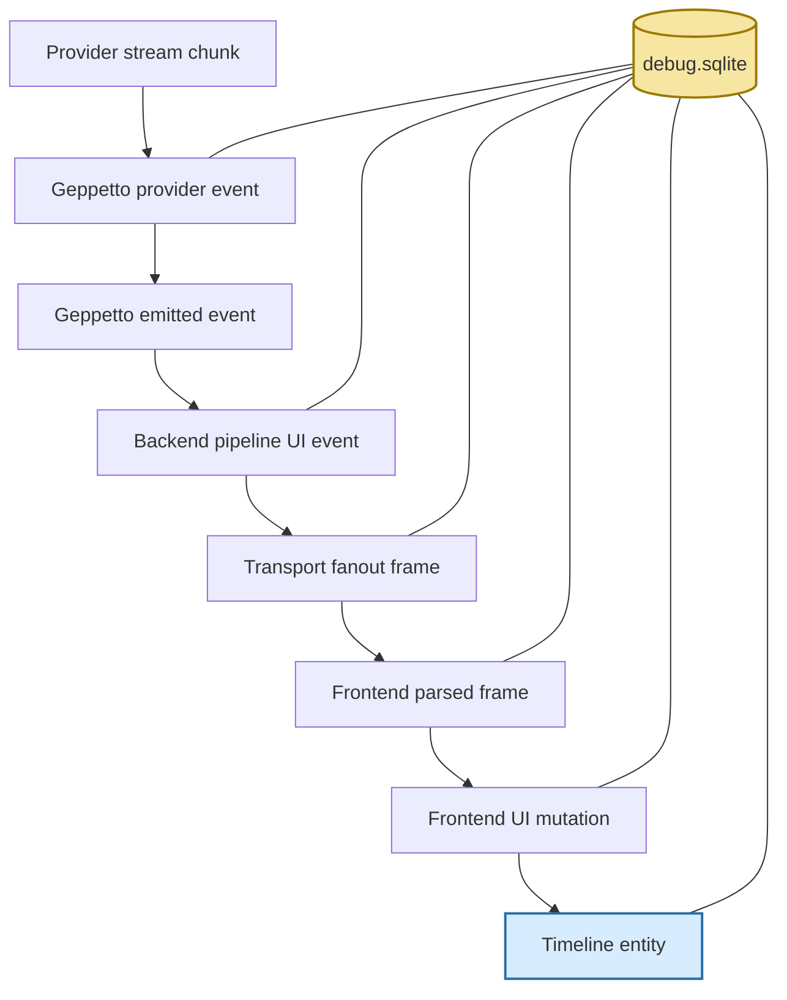
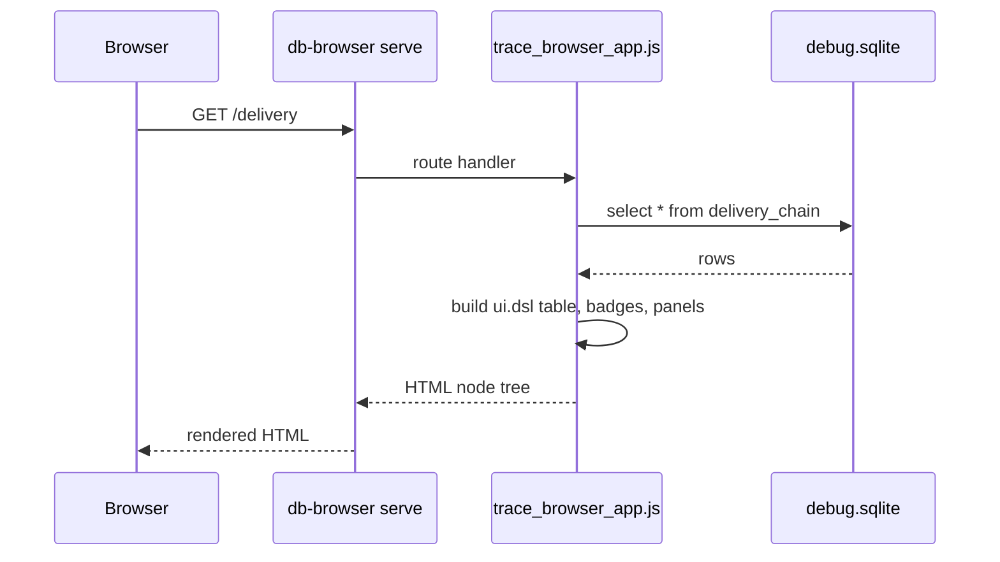

# SQLite Trace Browser: Building a db-browser JavaScript Inspection App

This report explains the small JavaScript browsing app built for inspecting CoinVault debug SQLite traces with `db-browser serve`. The important idea is not that a SQLite file can be shown in a web page. The important idea is that a trace database should be read in the same order as the system that produced it. Provider chunks become Geppetto events; backend events become transport frames; browser frames become UI mutations; UI mutations become timeline entities. A useful browser teaches that chain instead of dumping thirty tables on the reader.

> [!summary]
> - The app is a ticket-local `db-browser serve` script that turns a debug SQLite artifact into guided inspection pages.
> - Its core design is defensive schema reading: check whether tables, views, and columns exist before assuming a trace artifact has the newest shape.
> - The browser uses `ui.dsl` components for tables, badges, tabs, SQL blocks, and JSON blocks, then wraps them in a retro but compact visual theme.
> - The application is read-only by design. A debug SQLite trace is evidence, and the browser should help an operator understand it without mutating it.

The implementation lives in the CoinVault worktree under:

```text
/home/manuel/workspaces/2026-05-02/use-sessionstream-coinvault/2026-03-16--gec-rag/ttmp/2026/05/07/SQLITE-TRACE-VERBS--design-sqlite-trace-inspection-verbs/scripts/serve/trace_browser_app.js
```

The matching terminal verbs live beside it in:

```text
/home/manuel/workspaces/2026-05-02/use-sessionstream-coinvault/2026-03-16--gec-rag/ttmp/2026/05/07/SQLITE-TRACE-VERBS--design-sqlite-trace-inspection-verbs/scripts/verbs/trace_verbs.js
```

The source artifact used while building the app was a DeepSeek full-trace run exported from CoinVault:

```text
ttmp/2026/05/07/COINVAULT-OBSERVABILITY--add-observer-correlation-export-for-coinvault-web-chat/various/browser-runs/deepseekv4pro-thinking-20260507-193544/debug.sqlite
```

## 1. Why this browser exists

A debug SQLite trace is valuable because it preserves evidence from multiple layers of a streaming chat system. It is also difficult to read because each layer has its own language. A provider stream talks about deltas, choices, tool calls, and response IDs. Geppetto talks about normalized provider events and emitted events. Sessionstream talks about backend pipeline records and transport fanout. The browser talks about raw websocket bytes, parsed protobuf frames, UI events, and timeline entities.

A generic SQLite table browser can show those rows, but it cannot explain their relationship. The trace browser was built to answer a more specific question: where did this event go? If a reasoning chunk was emitted by the provider, did it become a Geppetto event? Did a backend UI event exist for it? Did it leave through transport? Did the frontend parse it? Did a timeline entity reflect it?

That question has a natural direction. The browser therefore has a natural reading order:

```text
Overview
  -> Conversation
  -> Delivery
  -> Correlations
  -> Reasoning
  -> Tool Calls
  -> Entities
  -> Schema / Raw Rows
```

The schema page still exists because raw inspection is sometimes necessary. But it is deliberately at the end of the story. The first thing an operator needs is orientation, not a thousand rows of JSON.

## 2. The mental model: traces are journeys, not tables

The simplest model is a ladder. Each rung records the same conversation from a different vantage point. The trace browser's job is to let the reader climb the ladder in both directions: from provider to browser when checking delivery, and from browser state back to provider evidence when debugging a surprising UI result.



This model explains the page structure. The `/delivery` page reads the backend-to-frontend rungs. The `/correlations` page reads the provider identity rungs. The `/reasoning` and `/tool-calls` pages inspect high-frequency stream content where correlation mistakes are most likely. The `/timeline/:ordinal` page gives the operator a place to stop at one rung and inspect the backend and frontend evidence side by side.

The model also explains why the app uses SQLite views when they exist. A view such as `delivery_chain` already encodes a relationship across tables. The browser should not force the reader to rediscover that relationship every time. It should render the relationship and keep the raw tables one click away.

## 3. The db-browser application shape

The app is intentionally small. It is a single JavaScript file loaded by `db-browser serve`. The runtime gives the script three modules:

```javascript
const db = require("db");
const express = require("express");
const ui = require("ui.dsl");
```

Those three imports define the whole architecture:

| Module | Responsibility in the trace browser |
|---|---|
| `db` | Run SQLite queries against the selected trace database. |
| `express` | Register server-side routes such as `/schema`, `/delivery`, and `/raw/:name`. |
| `ui.dsl` | Build escaped HTML components: pages, tables, badges, tabs, SQL blocks, and JSON blocks. |

The route handlers are not client-side React components. They are server-rendered pages. A request comes in, the handler runs SQL, the handler builds a `ui.dsl` tree, and `res.html(...)` sends a complete page back to the browser.



This is a good fit for an inspection tool. There is no local application state to synchronize and no API boundary to maintain. The database is already local to the server process. The browser page is just a rendered view of a query.

## 4. Defensive schema reading

The non-obvious design choice is that the app does not treat the schema as fixed. Trace schemas evolve as observability improves. Older artifacts may have `item_id` but not `correlation_key`. Newer artifacts may include `choice_index`, `stream_kind`, `tool_call_id`, and `tool_call_index`. Some views may be present only after a newer export path has been used.

The helper functions at the top of the script encode the rule:

```javascript
function q(sql, ...args) { return db.query(sql, ...args) || []; }
function one(sql, ...args) { return q(sql, ...args)[0] || {}; }
function exists(name) {
  return q("select 1 as ok from sqlite_master where name = ?", name).length > 0;
}
function columns(name) {
  return q(`pragma table_info(${quoteIdent(name)})`).map(r => String(r.name));
}
function hasColumn(name, column) {
  return columns(name).indexOf(column) >= 0;
}
```

The point is not elegance; the point is survivability. An inspection tool is most useful precisely when the system is in flux. If the browser crashes because one exploratory artifact lacks a new view, the operator loses the tool at the moment they need it most.

The correlation route shows the pattern well:

```javascript
if (exists("geppetto_correlation_to_frontend")) {
  rows = q("select * from geppetto_correlation_to_frontend limit 1000");
} else if (exists("geppetto_provider_to_emitted")) {
  rows = q("select * from geppetto_provider_to_emitted limit 1000");
} else if (exists("geppetto_provider_events")) {
  const keyExpr = hasColumn("geppetto_provider_events", "correlation_key")
    ? "correlation_key"
    : "item_id";
  rows = q(`select record_id as provider_record_id,
                   provider_event_type,
                   response_id,
                   item_id,
                   ${keyExpr} as correlation_key
              from geppetto_provider_events
             order by record_id
             limit 1000`);
}
```

This is a small piece of code, but it captures a durable principle: prefer the best semantic view, fall back to a less complete view, and only then fall back to raw tables. The user still gets a useful page even when the artifact is old.

## 5. Routes as chapters in a debugging textbook

Each route is a small chapter. A chapter has a question, a query, and a visual form.

| Route | Question it answers | Main evidence |
|---|---|---|
| `/` | What kind of trace am I looking at? | Counts for Geppetto, backend, frontend, entities, and views. |
| `/conversation` | What conversation and entity state does this artifact represent? | `turns`, `entity_kind_summary`. |
| `/delivery` | Did backend events reach transport and frontend parsing? | `delivery_chain`. |
| `/correlations` | Do provider identity keys survive downstream? | `geppetto_correlation_to_frontend`, fallback views/tables. |
| `/reasoning` | How did reasoning chunks move through the system? | `geppetto_reasoning_to_frontend` or related sequence views. |
| `/tool-calls` | How did tool-call chunks, IDs, names, and UI mutations line up? | Provider JSON, backend tool UI events, frontend mutations. |
| `/entities` | What state did the timeline materialize? | `timeline_entities`. |
| `/timeline/:ordinal` | What happened at one event ordinal? | Backend and frontend records for that ordinal. |
| `/schema` | What tables and views exist in this artifact? | `sqlite_master`. |
| `/raw/:name` | What do the underlying rows look like? | Direct table/view query. |

This route list is the teaching structure of the app. It is not merely navigation. The tabs tell the operator what kinds of questions are legitimate and in what order to ask them.

## 6. Rendering with ui.dsl components

The first version of a tool like this is often a pile of `<pre>` tags. That works for the author, but it does not scale to other readers. `ui.dsl` gives the script a compact vocabulary for inspection interfaces:

```javascript
function table(id, rows, configure) {
  const builder = ui.table.fromRows(id, rows || []);
  if (configure) {
    builder.columns(configure);
  } else {
    builder.columns(c => c.text("name").text("n"));
  }
  return builder
    .features(f => f.filters().pagination({ size: 50 }).sorting().columnPicker())
    .render({ query: {} });
}

function jsonBlock(value, title) {
  return ui.jsonBlock(value == null ? "" : value, {
    title,
    lineNumbers: true,
    wrap: true,
    copy: true,
  });
}

function sqlBlock(value, title) {
  return ui.sql(value || "-- no SQL available", {
    title,
    lineNumbers: true,
    wrap: false,
    copy: true,
  });
}
```

The table helper is important because every page needs the same basic affordances: filter, sort, paginate, and choose columns. Those features are not luxuries in a trace browser. They are how an operator reduces a thousand rows to the five rows that matter.

Tabs serve a similar purpose. A raw record often has three useful representations: a summary row, the full JSON, and one or more parsed JSON fields. The app uses `ui.tabs(...)` to keep those representations adjacent without forcing the page to become a wall of text.

```text
Record
  ├─ Summary tab
  ├─ raw_json tab
  └─ payload_json / mutation_json tab
```

The result is still simple HTML, but it behaves like an inspection workbench.

## 7. The visual theme: retro chrome without excess chrome

The app ended with a retro Macintosh-inspired stylesheet. The styling matters because a trace browser is dense: it contains tables, badges, SQL blocks, JSON blocks, tabs, and links. Without visual hierarchy, every row competes with every other row.

The theme uses:

- black window borders and title bars for section boundaries;
- muted grey backgrounds for toolbars and table filters;
- small badge backgrounds for status values;
- monospaced code blocks with caption bars and copy buttons;
- a muted blue link color so schema pages do not become a field of aggressive browser-blue text.

The first themed version had a menu bar and a top-level application window. That looked charming but consumed space and made the app feel more like a demo than a workbench. The final page shell removes that outer chrome:

```javascript
function page(title, ...children) {
  return ui.page({ title: "Trace Browser · " + title },
    ui.style(ui.raw(retroCSS)),
    ui.main({ class: "desktop" },
      nav(),
      children
    )
  );
}
```

This is a useful UI lesson. Retro styling works best here when it frames the evidence, not when it frames the entire browser. The content windows keep their title bars. The application itself gets out of the way.

The canvas also had to widen. Schema rows and raw JSON previews are not narrow prose. The `.desktop` rule now gives the page room while still fitting smaller screens:

```css
.desktop{
  width:min(100vw - 28px,1420px);
  max-width:1420px;
  margin:12px auto 24px;
  padding:0 14px;
}
```

## 8. Running the app

From the CoinVault repo root:

```bash
cd /home/manuel/workspaces/2026-05-02/use-sessionstream-coinvault/2026-03-16--gec-rag

TRACE_DIR="ttmp/2026/05/07/COINVAULT-OBSERVABILITY--add-observer-correlation-export-for-coinvault-web-chat/various/browser-runs/deepseekv4pro-thinking-20260507-193544"
TRACE_DB="$TRACE_DIR/debug.sqlite"
SERVE_SCRIPTS="ttmp/2026/05/07/SQLITE-TRACE-VERBS--design-sqlite-trace-inspection-verbs/scripts/serve"

db-browser serve \
  --db "$TRACE_DB" \
  --scripts-dir "$SERVE_SCRIPTS" \
  --addr :18080 \
  --dev
```

Then open:

```text
http://127.0.0.1:18080/
```

Useful pages:

```text
/conversation
/delivery
/correlations
/reasoning
/tool-calls
/entities
/schema
/schema/geppetto_records
/raw/geppetto_records
/timeline/1
```

The most common mistake is to point `db-browser serve --scripts-dir` at a directory that also contains verb-only files. Serve scripts and verb scripts run in different JavaScript environments. The serve app expects `express` and route registration. Verb files expect `__package__` and `__verb__`. Mixing them makes one runtime try to execute the other runtime's entrypoints.

The project therefore uses two directories:

```text
scripts/serve/trace_browser_app.js
scripts/verbs/trace_verbs.js
```

That split is not cosmetic. It prevents protocol contamination between two different JavaScript execution models.

## 9. The companion CLI verbs

The browser is for reading. The verbs are for quick terminal checks. They answer questions that an operator may want in CI logs, scripts, or a terminal pane:

```bash
db-browser verbs \
  --repository "$VERB_REPO" \
  --db "$TRACE_DB" \
  trace overview \
  --output json

 db-browser verbs \
  --repository "$VERB_REPO" \
  --db "$TRACE_DB" \
  trace delivery-gaps \
  --output json
```

The browser and verbs are siblings, not replacements. The CLI gives a compact answer; the browser gives context. A good workflow is to run `trace delivery-gaps` first, then open `/delivery` and `/timeline/:ordinal` for the specific rows that look suspicious.

## 10. Failure modes and design rules

The app is small enough that its failure modes are easy to name. Naming them matters because the future version of this tool will be tempting to overbuild.

| Failure mode | Why it matters | Rule that prevents it |
|---|---|---|
| Treating the schema as fixed. | Older artifacts become unreadable when observability evolves. | Check table/view/column presence and degrade gracefully. |
| Starting with raw tables. | Operators lose the event journey and drown in JSON. | Lead with guided pages, keep raw rows as drilldown. |
| Mixing serve and verb scripts. | One runtime executes globals from the other and fails. | Keep `scripts/serve` and `scripts/verbs` separate. |
| Using raw HTML for database values. | Debug artifacts may contain provider text, prompts, and payload JSON. | Render dynamic content through escaped `ui.dsl` components. |
| Making the app mutate traces. | A trace is evidence; mutation destroys trust. | Keep the browser read-only. |
| Adding too much decorative chrome. | Dense tables need space more than decoration. | Style the evidence windows, not the whole page shell. |

The security rule is worth stating directly: `ui.raw(...)` is acceptable for the static CSS string because the script owns that string. It should not be used for values read from SQLite or request parameters. Database content belongs in escaped components such as `ui.table`, `ui.jsonBlock`, `ui.sql`, and text nodes.

## 11. What the implementation teaches

This project is a good example of an inspection app that grows out of an operational need rather than a framework preference. The app did not begin with a frontend stack. It began with a trace artifact and a set of questions. The framework choices followed from those questions.

A server-rendered JavaScript script is enough because the state is already in SQLite. A table builder is enough because most evidence is relational. Tabs and code blocks are enough because the hard part is moving between summary and raw evidence. A small stylesheet is enough because the interface needs hierarchy, not animation.

The key points to internalize:

- A trace browser should follow the event path. If the system is a pipeline, the UI should read like a pipeline.
- SQLite views are semantic affordances. When a view encodes a cross-layer relationship, the browser should render it as a first-class page.
- Defensive schema reading is an observability feature. It lets old evidence remain useful while the recorder evolves.
- `ui.dsl` components turn a one-off script into a maintainable inspection app because they standardize tables, code blocks, JSON, badges, and tabs.
- Visual design is part of debugging. Muted links, wider tables, compact tabs, and clear window boundaries reduce cognitive load in dense traces.

## 12. Near-term next steps

The prototype is useful, but it is still a prototype. The next improvements should preserve its small shape.

1. Add a tiny fixture SQLite database so the app can be smoke-tested without the large 32 MB debug artifact.
2. Add route-aware active tab styling so the current page is visually marked in the top tabs.
3. Validate the browser against a newer trace artifact that includes normalized `correlation_key`, `choice_index`, `stream_kind`, `tool_call_id`, and `tool_call_index` columns.
4. Consider moving the retro stylesheet into a reusable `db-browser` host theme if more inspection apps want the same visual language.
5. Add a flatter tool-events view to the SQLite export so tool names, IDs, statuses, and frontend mutations can be read without repeatedly extracting JSON.

## Related project material

- Design ticket: `SQLITE-TRACE-VERBS--design-sqlite-trace-inspection-verbs`.
- Browser script: `ttmp/2026/05/07/SQLITE-TRACE-VERBS--design-sqlite-trace-inspection-verbs/scripts/serve/trace_browser_app.js`.
- CLI verbs script: `ttmp/2026/05/07/SQLITE-TRACE-VERBS--design-sqlite-trace-inspection-verbs/scripts/verbs/trace_verbs.js`.
- Design guide: `ttmp/2026/05/07/SQLITE-TRACE-VERBS--design-sqlite-trace-inspection-verbs/design-doc/01-sqlite-trace-inspection-verbs-design-and-implementation-guide.md`.
- Source artifact: `ttmp/2026/05/07/COINVAULT-OBSERVABILITY--add-observer-correlation-export-for-coinvault-web-chat/various/browser-runs/deepseekv4pro-thinking-20260507-193544/debug.sqlite`.

The durable lesson is simple: when a distributed stream becomes hard to understand, do not start by building a dashboard. Start by preserving evidence, then build a reader that follows the evidence in the same order the system produced it.
