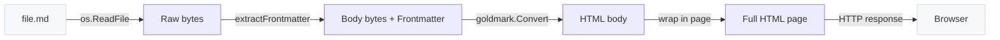

# Building md-view — A Daemon-Based Markdown Viewer in Go

md-view is a background daemon that renders Markdown files as styled HTML and opens them in a browser window. The user runs `md-view view file.md` and the file appears in Firefox. Edit the file and the page reloads within a second. The daemon handles everything else — HTTP serving, file watching, browser launching, and inter-process communication over a Unix domain socket.

This article explains why a markdown viewer needs a daemon at all, how the three-protocol architecture (HTTP, Unix socket, SSE) fits together, and what each layer does. The goal is not to document the tool — the user guide does that — but to explain the design decisions and their consequences. A reader who finishes this article should understand how to build a similar daemon for any local-file-serving use case, and why the architecture looks the way it does.

> [!summary]
> The article has three central ideas:
> 1. A local daemon with Unix-socket IPC solves the "start once, serve many" problem for CLI tools that need a persistent server
> 2. Server-Sent Events provide live reload with less complexity than WebSockets because the communication is strictly unidirectional
> 3. Go's stdlib covers nearly all the infrastructure; the four external dependencies (goldmark, chroma, fsnotify, Glazed) each do one thing that the stdlib cannot

## Why this note exists

Building a CLI tool that serves files over HTTP is a common pattern — `python -m http.server` is the most frequent incantation. But the pattern breaks down when you want the server to persist across invocations, accept commands from a CLI, and push updates to a browser. The naive approach (start a server each time, open a tab, kill the server when done) creates port conflicts, startup latency, and redundant rendering.

md-view exists because the gap between "start a temporary server" and "run a persistent daemon" is narrow, but the design choices required to cross it affect every layer of the system. This article captures those choices and their trade-offs.

## When to use this pattern

The daemon-plus-CLI pattern applies whenever:

- A CLI tool needs to serve content over HTTP but should not block the terminal
- Multiple CLI invocations should talk to the same server instance
- The server needs to push updates to a browser without polling
- The server should auto-start when needed and auto-stop when unused

Concrete examples beyond markdown viewing: a local documentation server, a static site previewer, a log viewer that tails files in the browser, or any tool where `command <file>` should produce a browser result.

## Core mental model

md-view has three processes and three protocols. The processes are the CLI, the daemon, and the browser. The protocols are NDJSON over Unix socket, HTTP over TCP, and SSE over HTTP.

```
┌──────────────┐   Unix Socket    ┌──────────────────┐    HTTP     ┌─────────┐
│  md-view CLI │ ─── JSON cmd ──► │  md-view server  │ ─────────► │ Browser │
│  (ephemeral) │                  │  (daemon)        │            │         │
└──────────────┘                  │                  │  ◄── SSE ── │         │
                                  │  - Renders .md   │   reload   │         │
                                  │  - Serves HTML   │            └─────────┘
                                  │  - Watches files │
                                  └──────────────────┘
```

Each protocol serves exactly one purpose. The Unix socket carries commands from the CLI to the daemon. HTTP carries rendered pages from the daemon to the browser. SSE carries file-change notifications from the daemon back to the browser. None of these protocols talks to a process it was not designed for. The CLI never speaks HTTP. The browser never speaks Unix socket. SSE is a one-way channel from server to client, not a general-purpose bidirectional pipe.

This separation is not accidental. When a protocol serves one purpose, the message format stays simple, the error handling stays local, and the implementation stays testable. When a protocol tries to serve multiple purposes — for example, using HTTP for both CLI↔daemon communication and browser↔server rendering — the message format becomes conditional, the routing becomes complex, and the tests become fragile.

## Architecture

### Package structure

The code is organized into six packages, each responsible for one layer:

```
cmd/md-view/           # Entry point, Glazed root command
pkg/commands/          # CLI commands: view, serve, stop, status
pkg/server/            # HTTP server, Unix socket handler, SSE endpoint
pkg/renderer/          # Markdown → HTML, frontmatter, embedded CSS/JS
pkg/daemon/            # PID file, state directory, start/stop/status
pkg/protocol/          # NDJSON message types
pkg/watcher/           # File watcher via fsnotify
```

The dependency graph is acyclic and mostly flat. `commands` depends on `server`, `daemon`, and `protocol`. `server` depends on `renderer`, `watcher`, `daemon`, and `protocol`. The other packages depend only on the standard library. This matters because it means each package can be tested independently — the renderer has no knowledge of HTTP, the watcher has no knowledge of sockets, and the protocol has no knowledge of anything at all.

### The command path

When a user runs `md-view view ./README.md`, four things happen in sequence. Understanding that sequence is the key to understanding the system.

First, the CLI resolves the file path to an absolute path. This is a precondition, not a convenience — the daemon needs an absolute path because it serves files from anywhere on the filesystem, and relative paths would be ambiguous.

Second, the CLI checks whether the daemon is alive. It reads the PID file from `~/.local/state/md-view/md-view.pid` and sends a signal-zero to the process. If the process exists, the daemon is running. If the PID file is missing or the process does not exist, the daemon is not running and must be started.

Third, if the daemon is not running, the CLI starts it. This is the part that differs from the traditional Unix daemon pattern. Go does not have `fork()` — it has `exec.Command`. The CLI constructs a command that re-executes the current binary with the `serve` subcommand, calls `Start()` (not `Run`), and detaches using `SysProcAttr{Setpgid: true}` on Linux. The parent process — the CLI — then waits for the socket file to appear, polling every 50 milliseconds for up to 5 seconds.

Fourth, the CLI sends the view command over the Unix socket. The message is a single line of JSON: `{"command": "view", "path": "/home/user/README.md"}`. The daemon reads this line, constructs the rendered URL, writes a response, and opens the browser in a separate goroutine. The CLI prints the URL and exits. The daemon keeps running.

Pseudocode for the CLI side:

```
func RunView(file):
    absPath = filepath.Abs(file)
    if !daemon.IsAlive():
        exec.Command(os.Args[0], "serve").Start()
        waitForSocket(timeout=5s)
    socket = dial(daemon.SocketPath())
    socket.Write(JSON{"command":"view","path":absPath})
    response = socket.ReadJSON()
    print(response.url)
```

### The daemon lifecycle

The daemon starts when the first `view` command needs it. It stops when the user runs `md-view stop` or sends SIGTERM. In between, it listens on two sockets simultaneously: a TCP socket for HTTP and a Unix domain socket for CLI commands.

The daemon writes three files to `~/.local/state/md-view/`:

| File | Purpose | Written by |
|------|---------|-----------|
| `md-view.pid` | Process ID | Daemon on start |
| `md-view.port` | HTTP port number | Daemon after binding |
| `md-view.sock` | Unix socket path | Created by socket listener |

These files serve two audiences. The CLI reads the PID and port files to check daemon status. The browser accesses the server via the port. The socket file exists because the CLI needs a stable path to connect to, and the daemon needs to clean up the socket on shutdown.

On shutdown, the daemon traps SIGTERM and SIGINT, closes the fsnotify watcher, shuts down the HTTP server with a 5-second timeout, and removes all three state files. This is important because a stale PID file — one whose process no longer exists — would cause the CLI to think the daemon is running when it is not. The daemon handles this by checking `IsAlive(pid)` before trusting the PID file, and cleaning it up automatically when it is stale.

### The HTTP server

The HTTP server binds to `127.0.0.1` on a random available port. Binding to localhost only is a deliberate security decision: md-view serves any file the user requests, including files outside the current working directory. Exposing that to the network would be inappropriate. The random port avoids conflicts with other local services and is written to the port file so the CLI can discover it.

The server handles five routes:

| Route | Method | Purpose |
|-------|--------|---------|
| `/render?file=<path>` | GET | Render a Markdown file as styled HTML |
| `/raw?file=<path>` | GET | Serve the raw `.md` source |
| `/events?file=<path>` | GET | SSE endpoint for live reload |
| `/static/base.css` | GET | GitHub-flavored CSS |
| `/static/reload.js` | GET | SSE client JavaScript |
| `/favicon.ico` | GET | Returns 204 No Content |

The `/render` route does the heavy lifting. It resolves the file path to an absolute path, validates that the path points to a regular file (not a directory, not a device node), and passes the file content to the renderer. Error responses are styled HTML pages — not plain text — because the user will see them in the browser.

The `/events` route is the SSE endpoint. It sets the `Content-Type` to `text/event-stream`, registers the file path with the watcher, and blocks. When the watcher detects a change, it sends `event: reload\ndata: reload\n\n` to the client. The connection stays open until the client disconnects or the server shuts down.

## Rendering pipeline

The rendering pipeline has four stages: read, parse, convert, and wrap. Each stage has a clear input and output, and each can fail independently.



### Stage 1: Read

`os.ReadFile` reads the entire file into memory. Markdown files are typically small — a few kilobytes for a note, a few hundred kilobytes for a large document. Reading the whole file is simpler and faster than streaming for this size range.

### Stage 2: Parse frontmatter

The frontmatter parser looks for the `---\n` delimiter at the start of the file. If it finds one, it searches for the closing `\n---` delimiter. Everything between the two delimiters is parsed as YAML; everything after the closing delimiter is the Markdown body.

The parser is intentionally simple. It handles top-level `key: value` pairs and collects indented content below a key as the value. It does not handle multi-line scalars, anchors, or complex nesting. This simplicity is a feature, not a limitation — docmgr frontmatter, Hugo frontmatter, and Obsidian frontmatter all use flat or nearly-flat YAML that this parser handles correctly. A full YAML parser would add a dependency and handle cases that do not arise in practice.

The parser extracts one important field: `Title`. If the frontmatter contains `Title: My Document`, the browser tab becomes `md-view: My Document` instead of `md-view: filename.md`. This is a small detail that matters for window manager integration — a human-readable title is easier to match in an i3 rule than a filename.

### Stage 3: Convert Markdown to HTML

goldmark converts the Markdown body to HTML. The GFM extension provides tables, task lists, strikethrough, and autolinks. The highlighting extension provides syntax highlighting via Chroma.

The highlighting pipeline works like this: goldmark encounters a fenced code block with a language tag. It passes the source text to Chroma, which tokenizes it into semantic tokens (keyword, string, comment, etc.) and wraps each token in a `<span>` with a Chroma CSS class. The output is HTML with class annotations but no inline styles. The Chroma CSS stylesheet — generated once at startup and injected into the page `<head>` — maps those classes to colors.

This is server-side highlighting. The browser receives fully styled HTML. No JavaScript runs to highlight code. No external CSS file is fetched. The page loads and renders immediately.

### Stage 4: Wrap in page template

The final stage wraps the HTML body in a full page structure. The template includes:

- A `<title>` element derived from the frontmatter `Title` or the filename
- An inline `<style>` block containing the GitHub-flavored CSS (embedded in the binary via `go:embed`)
- An inline `<style>` block containing the Chroma highlighting CSS
- An inline `<style>` block containing the frontmatter `<details>` CSS
- The frontmatter `<details>` block (if the file has frontmatter)
- The rendered HTML body
- An inline `<script>` containing the SSE reload client (if live reload is enabled)

Everything is inlined. No external CSS, no external JavaScript, no CDN references. The page is self-contained and works offline. This decision trades cacheability for simplicity — the browser cannot cache the CSS across pages because it is embedded in each response. But for a local tool serving files from localhost, the network latency is zero and the cacheability trade-off does not matter.

## Live reload via Server-Sent Events

Live reload is the feature that makes md-view more than a one-shot renderer. When you view a file, the page watches for changes and reloads automatically. The implementation uses Server-Sent Events, not WebSockets, and the reason is worth understanding.

SSE is a one-way channel from server to client. The server pushes events; the client receives them. There is no client-to-server messaging over SSE. This is exactly the right model for file change notification: the server knows when a file changes (because fsnotify told it), and the client needs to know (so it can reload). The client never needs to send a message back over this channel. If it did — if, for example, the client wanted to request a different file — it would make a new HTTP request, which is the correct mechanism for request-response communication.

WebSockets provide bidirectional communication, which is more general than SSE. But that generality comes at a cost: the server needs to parse WebSocket frames, handle ping/pong, and manage a stateful connection. SSE rides on top of HTTP, which means the server uses the same request/response infrastructure it already has for `/render` and `/static`. The incremental complexity of adding SSE is close to zero.

The server-side implementation:

```go
func handleEvents(w, r):
    file = r.URL.Query().Get("file")
    ch = watcher.Watch(file)
    // SSE headers
    w.Header().Set("Content-Type", "text/event-stream")
    w.Write(": connected\n\n")  // initial comment
    for {
        select {
        case <-ch:
            w.Write("event: reload\ndata: reload\n\n")
            w.Flush()
        case <-r.Context().Done():
            return  // client disconnected
        }
    }
```

The client-side JavaScript is ten lines:

```javascript
function MDSReloader(eventsURL) {
    var es = new EventSource(eventsURL);
    es.addEventListener("reload", function() { location.reload(); });
    es.onerror = function() {
        setTimeout(function() { new MDSReloader(eventsURL); }, 2000);
        es.close();
    };
}
```

The `onerror` handler reconnects after two seconds. This matters because the daemon might restart — the old SSE connection would die, and the client needs to re-establish it. The `setTimeout` prevents a reconnect storm if the daemon is down for an extended period.

The watcher uses fsnotify, which wraps Linux inotify, macOS kqueue, and Windows ReadDirectoryChangesW. On Linux, it adds an inotify watch on the specific file. When the file is written, fsnotify delivers a `Write` event, and the watcher sends a signal to all SSE clients watching that file.

One failure mode worth noting: if the file is deleted and recreated — as `git checkout` does — the inotify watch is lost because inotify watches the inode, not the path. The SSE connection stays open, but no events arrive. The client will not reload until the page is manually refreshed or the daemon is restarted. A future improvement would be to watch the parent directory instead of the file, which would survive file recreation.

## Daemon management without fork

Traditional Unix daemons use the double-fork pattern: fork once to detach from the terminal, fork again to prevent the process from re-acquiring a controlling terminal. Go does not expose `fork()`. The `os/exec` package provides `exec.Command`, which creates a new process via `fork+exec`, but the parent cannot share file descriptors or state with the child the way a C program can after `fork()`.

md-view's daemon start uses a simpler approach: the CLI re-executes its own binary with the `serve` subcommand. The child process — the daemon — creates its own HTTP server, Unix socket listener, and file watcher from scratch. The parent — the CLI — waits for the socket file to appear and then sends the view command.

```go
func ensureDaemonRunning():
    if daemon.IsAlive():
        return
    cmd := exec.Command(os.Args[0], "serve")
    cmd.SysProcAttr = &syscall.SysProcAttr{Setpgid: true}
    cmd.Start()
    waitForSocket(timeout=5*time.Second)
```

The `Setpgid: true` flag creates a new process group for the daemon, preventing it from receiving signals sent to the CLI's process group. When the user presses Ctrl+C in the terminal, only the CLI exits. The daemon continues running.

The daemon detects shutdown via SIGTERM and SIGINT. On receiving either signal, it closes the fsnotify watcher, shuts down the HTTP server with a timeout, and removes the PID file, port file, and socket file. This cleanup is essential because stale state files would confuse the next CLI invocation.

## Frontmatter as structured metadata

YAML frontmatter is a convention, not a standard. Different tools use different frontmatter schemas: Hugo uses `title`, `date`, and `draft`; Jekyll uses `layout`, `title`, and `categories`; docmgr uses `Title`, `Ticket`, `Status`, `Topics`, and a dozen more. md-view's frontmatter parser is deliberately simple — it handles top-level `key: value` pairs and collects indented content as the value. This handles all the common frontmatter formats without requiring a full YAML parser dependency.

The rendering decision was non-obvious. The first version rendered frontmatter as a raw YAML code block inside a `<details>` element. This was technically correct but visually noisy — a 20-line frontmatter blob is hard to scan as undifferentiated text. The current version renders frontmatter as a key-value table where each top-level key gets its own row. Simple values appear inline; nested values (lists, maps) appear as formatted text. The `<details>` element is collapsed by default, so frontmatter does not push the actual content down.

The page title extraction is a detail that matters more than it seems. Without it, every browser tab is `md-view: 01-design-and-implementation-guide.md`. With it, the tab is `md-view: Design and Implementation Guide`. The difference is not cosmetic — it determines whether an i3 window rule based on `title="^md-view:.*"` can display a meaningful name in the window switcher.

## The Glazed command framework

md-view uses the Glazed command framework for its CLI. Glazed provides three things that plain Cobra does not: structured output, a help system with embedded documentation, and consistent flag handling across commands.

Structured output means that every command that produces data emits it as typed rows, not formatted strings. The `status` command, for example, emits a row with `running`, `pid`, `port`, `uptime`, and `socket` fields. Glazed then formats that row according to the user's `--output` flag: a pretty table by default, but also JSON, YAML, CSV, or a Go template. The command implementation never touches formatting. It just produces data.

The help system allows commands to carry embedded documentation that is browsable via `md-view help` and `md-view help <topic>`. This is more useful than Cobra's built-in `--help` for tools with conceptual documentation, not just flag descriptions.

The cost of using Glazed is the transitive dependency chain — Glazed pulls in a large number of packages for table formatting, template processing, and configuration management. For a small tool like md-view, most of these capabilities go unused. The benefit is consistency with the go-go-golems ecosystem and the structured output that comes for free.

## Common failure modes

**Stale PID files.** If the daemon crashes without running its shutdown handler — for example, `kill -9` or an out-of-memory kill — the PID file remains on disk. The next CLI invocation reads the PID, checks whether the process exists, discovers it does not, and removes the stale files before starting a new daemon. This recovery is automatic and requires no user intervention.

**Port conflicts.** The daemon binds to a random available port by default, which avoids conflicts with other services. The `--port` flag exists for users behind firewalls who need to open a specific port. If two daemons are started on the same port, the second one fails with `bind: address already in use` — a clear error with an obvious fix.

**Lost file watches.** fsnotify monitors the file's inode, not its path. If a file is deleted and recreated — the common case being `git checkout` — the watch is lost. The SSE connection remains open but no events arrive. The browser page does not reload. The fix is to restart the daemon or manually reload the page. A more robust solution would watch the parent directory, which survives file recreation, but this introduces complexity: the directory watcher would need to filter events for only the watched file, and would need to re-register the file watch after each recreation.

**Browser detection.** The daemon tries `$BROWSER`, then `xdg-open`, `firefox`, `google-chrome`, and `chromium` in order. If none of these exist, it logs a warning and does nothing. The user can override this with `--browser`. The failure mode is silent — no browser opens, but the daemon is running and the URL is printed — so the user can still copy-paste the URL manually.

## Working rules

> [!important]
> **One protocol, one purpose.** Never use the Unix socket for HTTP-style request/response rendering. Never use the HTTP channel for CLI commands. Keep the three channels (socket, HTTP, SSE) strictly separated.
>
> **Inline everything.** No external CSS, no CDN scripts, no fetched fonts. The rendered page must work offline and load without network requests.
>
> **Re-exec, don't fork.** Go does not have `fork()`. Re-executing the binary with a different subcommand is the correct way to start a background daemon from a Go CLI.
>
> **Auto-recover from stale state.** The CLI must detect stale PID files and clean them up before starting a new daemon. The user should never need to manually `rm ~/.local/state/md-view/md-view.*`.
>
> **Collapse metadata by default.** Frontmatter is metadata, not content. It should be hidden until the user asks to see it. The actual Markdown content should start at the top of the viewport.

## Key code locations

| File | Responsibility |
|------|---------------|
| `cmd/md-view/main.go` | Root Cobra command, Glazed initialization, help system |
| `pkg/commands/view.go` | `view` command definition (Glazed) |
| `pkg/commands/run.go` | `RunView`, `RunServe`, `RunStop` implementation |
| `pkg/commands/daemon_linux.go` | `SysProcAttr{Setpgid: true}` for Linux daemon start |
| `pkg/server/server.go` | HTTP server, Unix socket handler, SSE endpoint, browser launch |
| `pkg/renderer/renderer.go` | Markdown → HTML, frontmatter extraction, page template |
| `pkg/renderer/static/base.css` | GitHub-flavored Markdown CSS |
| `pkg/renderer/static/reload.js` | SSE client for live reload |
| `pkg/daemon/daemon.go` | PID file, state directory, IsAlive, Stop |
| `pkg/protocol/protocol.go` | NDJSON message types and `SendCommand` |
| `pkg/watcher/watcher.go` | fsnotify wrapper with per-file channels |

## Dependencies

| Package | Why it exists in this project |
|---------|------------------------------|
| `github.com/yuin/goldmark` | Markdown → HTML. The stdlib has no Markdown parser. |
| `github.com/alecthomas/chroma/v2` | Syntax highlighting. Goldmark-highlighting uses Chroma internally. |
| `github.com/fsnotify/fsnotify` | File change detection. The stdlib has no inotify wrapper. |
| `github.com/go-go-golems/glazed` | CLI framework. Provides structured output and help system beyond plain Cobra. |

The stdlib handles everything else: `net/http` for the server, `net` for Unix sockets, `encoding/json` for the protocol, `os/exec` for daemon start, `os/signal` for shutdown handling, and `embed` for static assets.

## Related notes

- The design and implementation guide is in the repo at `ttmp/.../design-impl-guide/01-design-and-implementation-guide.md`
- The implementation diary is at `ttmp/.../reference/01-diary.md`
- The user guide is at `docs/user-guide.md`
