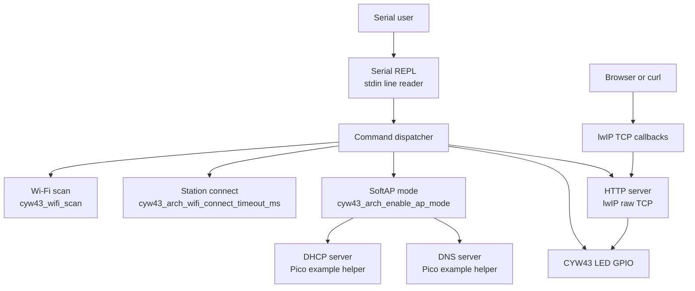
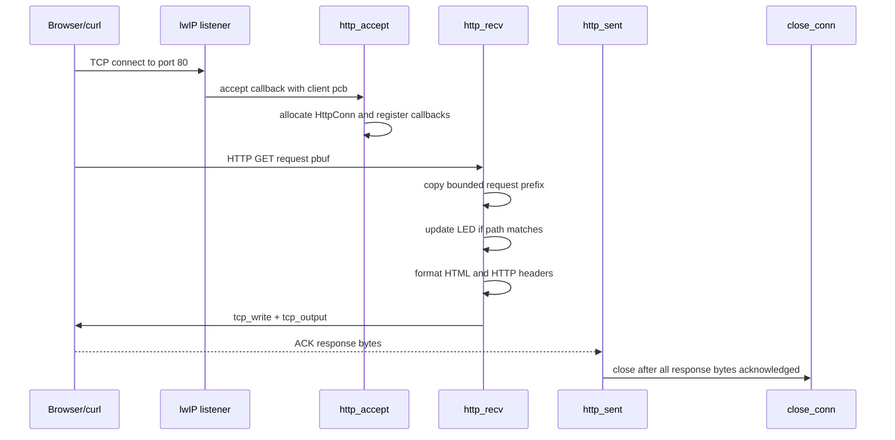
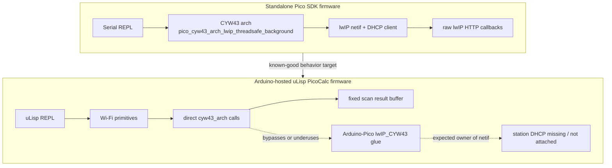

# Standalone Pico 2W Web Server: Pico SDK Deep Dive

This report explains the standalone Pico SDK web server experiment built under `/home/manuel/code/wesen/2026-05-05--ulisp-picocalc/pico-sdk-wifi-repl`. The project is a small C++ firmware for Pico 2W that exposes a serial REPL, Wi-Fi scan and station-mode commands, SoftAP setup, DHCP and DNS helpers, and a minimal raw-lwIP HTTP server. It was created to debug Pico 2W Wi-Fi behavior from below the Arduino-Pico and uLisp layers.

> [!summary]
> The standalone firmware separates three questions that were tangled in the uLisp HTTP proof of concept: whether the CYW43 radio can scan/connect, whether SoftAP networking works with DHCP, and whether a raw TCP web server can accept and answer requests on the Pico 2W.
>
> The implementation uses the Pico SDK directly: `cyw43_arch_init`, `cyw43_wifi_scan`, `cyw43_arch_wifi_connect_timeout_ms`, `cyw43_arch_enable_ap_mode`, copied Pico example DHCP/DNS helpers, and lwIP raw TCP callbacks.
>
> The report focuses on the current proof of concept, not a finished product. The code is intentionally narrow: one listening HTTP server, small fixed buffers, simple request recognition, serial commands for observability, and explicit build/flash targets.

## Why this project exists

The uLisp PicoCalc firmware had reached the point where the Lisp-facing HTTP primitives compiled and the Arduino-Pico `WiFiServer` path was wired in. The remaining problem was hardware behavior. The Pico 2W could see an access point in scans, but station connection attempts returned a disconnected status. At that point, further changes inside the uLisp layer risked obscuring the basic question: does the lower Pico SDK Wi-Fi path behave differently on the same board, radio, power environment, and network?

The standalone project answers that question by removing several layers at once. There is no uLisp evaluator, no Arduino `WiFi` wrapper, no Arduino `WiFiServer`, and no Lisp heap involved in accepting requests. The firmware starts the Pico SDK runtime, initializes the CYW43 driver, exposes a serial command loop, and performs Wi-Fi operations directly. If this firmware can connect or run an AP where the Arduino/uLisp firmware cannot, the next investigation should focus on wrapper behavior, configuration differences, timing, memory pressure, or initialization order. If it fails in the same way, the next investigation should focus on the access point configuration, board/power/radio conditions, Pico SDK/CYW43 support, or physical deployment environment.

The important design decision is that the firmware is not only a web server. It is a diagnostic control surface. A web server is useful only after the network exists. The serial REPL exists so the network can be built, inspected, stopped, and rebuilt without reflashing the board for each hypothesis.

## Current project status

The current implementation builds successfully for Pico 2W using Pico SDK 2.1.0. The build target is:

```text
pico_sdk_wifi_repl
```

The output UF2 is:

```text
build-pico-sdk-wifi-repl/pico_sdk_wifi_repl.uf2
```

The root `Makefile` now includes a workflow that matches the existing PicoCalc UF2 Loader SD card flow:

```bash
make wifi-firmware-build
make flash-wifi
```

`make flash-wifi` builds the firmware, mounts the UF2 Loader SD card using the existing `UF2LOADER_DEVICE` and `UF2LOADER_MOUNT` variables, copies the UF2 into `pico2-apps`, runs `sync`, and unmounts the loader device.

What is implemented today:

- a C++ Pico SDK application in `pico-sdk-wifi-repl/src/main.cpp`
- USB and UART stdio for the serial REPL
- scan, status, station connect, station disconnect, AP start, AP stop, HTTP start, HTTP stop, LED, and reboot commands
- SoftAP mode with DHCP and DNS helper servers copied from Pico SDK examples
- a raw-lwIP HTTP server on port 80
- a small generated HTML response with LED links and network status
- CMake configuration for Pico 2W by default, with `PICO_BOARD=pico_w` as an override

What is not implemented yet:

- robust HTTP request parsing
- multiple simultaneous clients
- POST bodies
- static files
- TLS
- WebSockets
- a route table
- structured serial command parsing with quoting
- persistent Wi-Fi credentials
- automatic station reconnection
- AP + STA coexistence policy beyond the direct SDK calls used here

The current firmware is a diagnostic proof of concept. That status matters because it explains the small buffers and narrow request handling. The code is designed to make specific network behaviors visible, not to serve as a general embedded web framework.

## Project shape

The source tree is small enough that every file has a clear role:

```text
pico-sdk-wifi-repl/
├── CMakeLists.txt                 # Pico SDK project definition
├── README.md                      # build, flash, and command instructions
├── lwipopts.h                     # lwIP configuration used by the firmware
├── pico_sdk_import.cmake          # standard Pico SDK import helper
├── src/
│   └── main.cpp                   # serial REPL, Wi-Fi commands, AP mode, HTTP server
├── dhcpserver/
│   ├── dhcpserver.c               # copied Pico example DHCP helper
│   └── dhcpserver.h
└── dnsserver/
    ├── dnsserver.c                # copied Pico example DNS helper
    └── dnsserver.h
```

The root repository adds deployment support:

```text
Makefile                           # wifi-firmware-build and flash-wifi targets
build-pico-sdk-wifi-repl/          # generated CMake build directory
```

The core code lives in one translation unit because the firmware is still an experiment. That choice keeps the control flow visible. Once the behavior is validated on hardware, the natural next step is to split `main.cpp` into small modules: `repl`, `wifi_commands`, `ap_server`, and `http_raw`.

## Architecture

The firmware has four cooperating subsystems:

1. The Pico SDK platform and CYW43 initialization path.
2. The serial REPL that accepts commands and prints evidence.
3. The Wi-Fi control path for scan, station mode, and SoftAP mode.
4. The raw-lwIP HTTP server that responds to TCP connections.



This structure is deliberately explicit. Each serial command maps to one narrow code path. When the user runs `scan`, the code starts a CYW43 scan and prints each result from the scan callback. When the user runs `connect`, the code calls `cyw43_arch_wifi_connect_timeout_ms` and prints the returned error plus link and IP status. When the user runs `ap`, the code enables AP mode and starts the DHCP/DNS helper servers. When the user runs `http start`, the code binds a raw TCP listener on port 80.

The REPL is the coordination point, but it is not the networking engine. The CYW43/lwIP background integration is provided by this link target:

```cmake
target_link_libraries(pico_sdk_wifi_repl
  pico_stdlib
  pico_cyw43_arch_lwip_threadsafe_background
)
```

That target selects the Pico SDK architecture in which the Wi-Fi driver and lwIP processing run through the SDK's background machinery. The main loop can block briefly while polling serial input, and the network stack can still make progress.

## The build system

The CMake project starts by selecting a board:

```cmake
if(NOT DEFINED PICO_BOARD)
  set(PICO_BOARD pico2_w)
endif()
```

This default matters because Pico 2W is the board under investigation. It still allows Pico W comparison builds:

```bash
cmake -S pico-sdk-wifi-repl -B build-pico-sdk-wifi-repl \
  -DPICO_SDK_PATH=/home/manuel/.pico-sdk/sdk/2.1.0 \
  -DPICO_BOARD=pico_w
```

The executable includes the main C++ file and the two C helper libraries copied from the Pico examples:

```cmake
add_executable(pico_sdk_wifi_repl
  src/main.cpp
  dhcpserver/dhcpserver.c
  dnsserver/dnsserver.c
)
```

Because the DHCP and DNS helpers are C files while the application is C++, the headers are included inside an `extern "C"` block:

```cpp
extern "C" {
#include "dhcpserver.h"
#include "dnsserver.h"
}
```

This detail is not cosmetic. The first build failed with unresolved references to `dhcp_server_init`, `dhcp_server_deinit`, `dns_server_init`, and `dns_server_deinit`. C++ changes symbol names during compilation; C does not. The `extern "C"` block tells the C++ compiler to use C linkage for those function declarations, so the object files link correctly.

The root `Makefile` wraps the build in commands that fit the rest of the repository:

```make
WIFI_CMAKE_BUILD    := build-pico-sdk-wifi-repl
WIFI_FIRMWARE_DIR   := pico-sdk-wifi-repl
WIFI_FIRMWARE_TARGET:= pico_sdk_wifi_repl
WIFI_BOARD          ?= pico2_w
WIFI_PICO_SDK_PATH  ?= /home/manuel/.pico-sdk/sdk/2.1.0
WIFI_UF2            := $(WIFI_CMAKE_BUILD)/$(WIFI_FIRMWARE_TARGET).uf2
WIFI_APP_DIR        ?= pico2-apps
WIFI_FLASH_MOUNT    ?= $(UF2LOADER_MOUNT)
```

The flash path intentionally reuses the UF2 Loader SD workflow rather than direct BOOTSEL flashing:

```make
wifi-firmware-flash: wifi-firmware-build uf2loader-mount
	mkdir -p "$(WIFI_FLASH_MOUNT)/$(WIFI_APP_DIR)"
	cp -v "$(WIFI_UF2)" "$(WIFI_FLASH_MOUNT)/$(WIFI_APP_DIR)/"
	sync
	@echo "=== Deployed Wi-Fi REPL UF2 to $(WIFI_FLASH_MOUNT)/$(WIFI_APP_DIR) ==="
	@echo "=== Unmount with: make uf2loader-unmount ==="

flash-wifi: wifi-firmware-flash uf2loader-unmount
```

This is a local deployment decision. The earlier version of the target looked for a direct Pico BOOTSEL mass-storage volume by searching mounted vfat filesystems for `INFO_UF2.TXT`. That did not match the working development setup. The repository already had a reliable UF2 Loader path, so the standalone firmware now uses it.

## The serial REPL

The REPL is small. It initializes stdio, waits briefly for the host serial connection, initializes CYW43, enables station mode, prints the command list, and then reads bytes into a fixed line buffer:

```cpp
int main() {
  stdio_init_all();
  sleep_ms(1500);
  puts("\nPico SDK WiFi REPL starting");

  if (cyw43_arch_init()) {
    puts("cyw43_arch_init failed");
    return 1;
  }
  cyw43_arch_enable_sta_mode();
  help();
  printf("> ");

  char line[256];
  size_t n = 0;
  while (true) {
    int ch = getchar_timeout_us(10000);
    ...
  }
}
```

The input parser is intentionally simple:

```cpp
std::vector<std::string> split(char *line) {
  std::vector<std::string> out;
  char *tok = strtok(line, " \t\r\n");
  while (tok) {
    out.emplace_back(tok);
    tok = strtok(nullptr, " \t\r\n");
  }
  return out;
}
```

This means SSIDs and passwords with spaces are not supported by the current command line. That is acceptable for the first diagnostic firmware, because the purpose is to test known simple access point configurations such as a phone hotspot or a temporary 2.4 GHz WPA2 network. If this tool becomes a reusable diagnostic utility, the parser should gain quoting, escaping, or a prompt-based credential entry mode.

The dispatcher is a direct command table written as an `if`/`else if` chain:

```cpp
if (cmd == "help" || cmd == "?") help();
else if (cmd == "scan") cmd_scan();
else if (cmd == "status") print_status();
else if (cmd == "connect") { ... }
else if (cmd == "disconnect") cmd_disconnect();
else if (cmd == "ap") cmd_ap(...);
else if (cmd == "apstop") ap_stop();
else if (cmd == "http") { ... }
else if (cmd == "led") { ... }
else if (cmd == "reboot") { ... }
else printf("unknown: %s\n", cmd.c_str());
```

This direct style has one advantage during debugging: the command path is easy to inspect. Each command calls one function. There is no framework state to inspect before reading the Wi-Fi logic.

## Wi-Fi scan path

The scan command starts station mode and calls `cyw43_wifi_scan`:

```cpp
void cmd_scan() {
  cyw43_arch_enable_sta_mode();
  cyw43_wifi_scan_options_t opts{};
  int err = cyw43_wifi_scan(&cyw43_state, &opts, nullptr, scan_cb);
  if (err) {
    printf("scan start failed: %d\n", err);
    return;
  }
  printf("scan started...\n");
  absolute_time_t deadline = make_timeout_time_ms(15000);
  while (cyw43_wifi_scan_active(&cyw43_state) && !time_reached(deadline)) {
    sleep_ms(100);
  }
  printf("scan done active=%d\n", cyw43_wifi_scan_active(&cyw43_state) ? 1 : 0);
}
```

The callback prints the SSID, RSSI, channel, authentication mode, and BSSID:

```cpp
int scan_cb(void *, const cyw43_ev_scan_result_t *result) {
  if (!result) return 0;
  printf("ssid='%-32s' rssi=%4d chan=%3d auth=%u(%s) bssid=%02x:%02x:%02x:%02x:%02x:%02x\n",
         result->ssid, result->rssi, result->channel,
         result->auth_mode, auth_name(result->auth_mode),
         result->bssid[0], result->bssid[1], result->bssid[2],
         result->bssid[3], result->bssid[4], result->bssid[5]);
  return 0;
}
```

This output is valuable because a successful scan only proves that the radio can hear the access point. It does not prove that the AP can accept this client. The RSSI, channel, and authentication mode give the next layer of evidence. For example, a visible SSID on an unsupported band, an unexpected authentication mode, or weak RSSI would point away from application code and toward network configuration or physical conditions.

The `auth_name` function maps the common CYW43 auth constants to names:

```cpp
const char *auth_name(uint32_t auth) {
  switch (auth) {
    case CYW43_AUTH_OPEN: return "open";
    case CYW43_AUTH_WPA_TKIP_PSK: return "wpa-tkip";
    case CYW43_AUTH_WPA2_AES_PSK: return "wpa2-aes";
    case CYW43_AUTH_WPA2_MIXED_PSK: return "wpa2-mixed";
    default: return "unknown";
  }
}
```

This mapping is not exhaustive, but it gives enough evidence for the first pass. If the problematic network reports an authentication mode outside this set, the next step should be to expand the mapping and compare it against Pico SDK/CYW43 support.

## Station connection path

The station connect command calls the Pico SDK connection function directly:

```cpp
void cmd_connect(const char *ssid, const char *pass, uint32_t auth = CYW43_AUTH_WPA2_AES_PSK) {
  if (!ssid || !*ssid) {
    printf("usage: connect <ssid> <pass> [open|wpa2]\n");
    return;
  }
  cyw43_arch_enable_sta_mode();
  printf("connecting ssid='%s' auth=%s timeout=30000ms...\n", ssid, auth_name(auth));
  int err = cyw43_arch_wifi_connect_timeout_ms(ssid, pass ? pass : "", auth, 30000);
  printf("connect result=%d link=%d\n", err, cyw43_wifi_link_status(&cyw43_state, CYW43_ITF_STA));
  print_status();
}
```

The key difference from the Arduino/uLisp path is the connection API. The uLisp firmware calls into Arduino-Pico's `WiFi.begin` and then observes Arduino-style status values. This firmware calls `cyw43_arch_wifi_connect_timeout_ms` and prints the SDK error return plus the CYW43 link status. If both paths fail in the same environment, that is strong evidence that the issue is below the Arduino wrapper. If this direct SDK path succeeds, then the Arduino wrapper path deserves closer inspection.

The command supports only two user-facing auth modes today:

```text
connect <ssid> <pass> [open|wpa2]
```

If the fourth argument is `open`, the code uses `CYW43_AUTH_OPEN`; otherwise it uses `CYW43_AUTH_WPA2_AES_PSK`. That is enough for controlled tests:

```text
connect picotest password123
connect OpenSSID ignored open
```

The status command prints both station and AP state. The current implementation reports Wi-Fi status, TCP/IP status, netif flags, DHCP state, and separately formatted IP/gateway/netmask values:

```cpp
void print_status() {
  netif *sta = &cyw43_state.netif[CYW43_ITF_STA];
  int wifi_status = cyw43_wifi_link_status(&cyw43_state, CYW43_ITF_STA);
  int tcpip_status = cyw43_tcpip_link_status(&cyw43_state, CYW43_ITF_STA);
  dhcp *dhcp_state = netif_dhcp_data(sta);

  char ip[16], gw[16], mask[16];
  ip4_to_str(netif_ip4_addr(sta), ip, sizeof(ip));
  ip4_to_str(netif_ip4_gw(sta), gw, sizeof(gw));
  ip4_to_str(netif_ip4_netmask(sta), mask, sizeof(mask));

  logf("STA wifi=%d(%s) tcpip=%d(%s) ... dhcp-state=%d ip=%s gw=%s mask=%s\n",
       wifi_status, link_status_name(wifi_status),
       tcpip_status, link_status_name(tcpip_status),
       dhcp_state ? dhcp_state->state : -1,
       ip, gw, mask);
}
```

This distinction matters. A station may have a radio link but no DHCP address yet. It may have a netif that is up but no meaningful IP. It may be disconnected while the AP side remains running. The richer status output keeps those cases separate and avoids the static-buffer bug caused by repeated `ip4addr_ntoa()` calls in one log statement.

## SoftAP path

The AP command starts a local access point using the Pico SDK:

```cpp
void cmd_ap(const char *ssid, const char *pass) {
  if (!ssid || !*ssid) {
    printf("usage: ap <ssid> [pass]\n");
    return;
  }
  ap_stop();
  uint32_t auth = (pass && strlen(pass) >= 8) ? CYW43_AUTH_WPA2_AES_PSK : CYW43_AUTH_OPEN;
  printf("starting ap ssid='%s' auth=%s\n", ssid, auth_name(auth));
  cyw43_arch_enable_ap_mode(ssid, (auth == CYW43_AUTH_OPEN) ? nullptr : pass, auth);
  ...
  dhcp_server_init(&g_dhcp, &g_ap_gw, &mask);
  dns_server_init(&g_dns, &g_ap_gw);
  g_ap_running = true;
  char ap_ip[16];
  ip4_to_str(&g_ap_gw, ap_ip, sizeof(ap_ip));
  logf("ap ip=%s dhcp=on dns=on\n", ap_ip);
}
```

The password rule follows the WPA2 minimum length requirement. If a password exists and has at least eight characters, the AP uses WPA2 AES PSK. Otherwise it starts an open AP. This is a practical REPL rule because it avoids passing an invalid short WPA2 password into the AP setup call.

The AP IP and mask are built from Pico SDK defaults:

```cpp
IP4(g_ap_gw).addr = PP_HTONL(CYW43_DEFAULT_IP_AP_ADDRESS);
IP4(mask).addr = PP_HTONL(CYW43_DEFAULT_IP_MASK);
```

In the normal Pico example configuration, the AP address is `192.168.4.1`. The smoke test is therefore:

```text
ap picosdk-test password123
http start
```

Then the host joins `picosdk-test` and opens:

```text
http://192.168.4.1/
```

The DHCP server is important because most laptops and phones expect an AP to provide an address. Without DHCP, the AP may be visible and joinable while the client has no route to the server. The DNS helper is less important for the current HTTP smoke test, but it is useful if later tests implement captive-portal-style behavior or name-based access.

The AP stop path shuts down in the reverse order:

```cpp
void ap_stop() {
  if (g_http.running) http_stop();
  if (g_ap_running) {
    dns_server_deinit(&g_dns);
    dhcp_server_deinit(&g_dhcp);
    cyw43_arch_disable_ap_mode();
    g_ap_running = false;
    printf("ap stopped\n");
  }
}
```

Stopping HTTP before tearing down the AP avoids leaving a listener around whose interface has just been disabled. The current code does not track accepted client connections globally, so this is not a full shutdown model. It is sufficient for the single-client diagnostic server.

## HTTP server model

The HTTP server is built on lwIP raw TCP callbacks. It does not use sockets, `netconn`, Arduino `WiFiServer`, or an HTTP library. The server state is small:

```cpp
struct HttpConn {
  tcp_pcb *pcb = nullptr;
  int sent = 0;
  int total = 0;
  char response[768] = {0};
};

struct HttpServer {
  tcp_pcb *pcb = nullptr;
  bool running = false;
};
```

The listening server holds one `tcp_pcb`. Each accepted client gets one allocated `HttpConn`. The connection object stores the client PCB, the response length, the number of bytes acknowledged as sent, and a fixed response buffer.

Starting the server follows the raw TCP sequence:

```cpp
bool http_start(uint16_t port = HTTP_PORT) {
  if (g_http.running) http_stop();
  tcp_pcb *pcb = tcp_new_ip_type(IPADDR_TYPE_ANY);
  if (!pcb) { ... }

  err_t err = tcp_bind(pcb, IP_ANY_TYPE, port);
  if (err != ERR_OK) { ... }

  g_http.pcb = tcp_listen_with_backlog(pcb, 1);
  if (!g_http.pcb) { ... }

  tcp_accept(g_http.pcb, http_accept);
  g_http.running = true;
  printf("http listening on %u\n", port);
  return true;
}
```

The sequence is strict:

1. Allocate a TCP PCB.
2. Bind it to port 80 on any local address.
3. Convert it into a listening PCB.
4. Register an accept callback.
5. Mark the server running only after all steps succeed.

The accept callback creates per-client state and registers callbacks on the client PCB:

```cpp
err_t http_accept(void *, tcp_pcb *client_pcb, err_t err) {
  if (err != ERR_OK || !client_pcb) return ERR_VAL;
  auto *conn = static_cast<HttpConn *>(calloc(1, sizeof(HttpConn)));
  if (!conn) return ERR_MEM;
  conn->pcb = client_pcb;
  tcp_arg(client_pcb, conn);
  tcp_sent(client_pcb, http_sent);
  tcp_recv(client_pcb, http_recv);
  tcp_poll(client_pcb, http_poll, 10);
  tcp_err(client_pcb, http_err);
  printf("http client connected\n");
  return ERR_OK;
}
```

In raw lwIP, `tcp_arg` is how the application associates its own state with a PCB. Later callbacks receive that pointer as their first argument. The code relies on that to connect `http_recv`, `http_sent`, `http_poll`, and `http_err` to the same `HttpConn` allocation.

## HTTP request and response flow

The receive callback reads the first part of the request into a small buffer:

```cpp
char req[192] = {0};
pbuf_copy_partial(p, req, std::min<size_t>(p->tot_len, sizeof(req) - 1), 0);
tcp_recved(pcb, p->tot_len);
pbuf_free(p);
```

The server does not parse HTTP generally. It recognizes two request forms by substring:

```cpp
if (strstr(req, "GET /led/on ")) {
  cyw43_gpio_set(&cyw43_state, LED_GPIO, true);
  led = true;
} else if (strstr(req, "GET /led/off ")) {
  cyw43_gpio_set(&cyw43_state, LED_GPIO, false);
  led = false;
}
```

Then it generates a small HTML body and writes a complete HTTP/1.1 response with `Content-Length` and `Connection: close`:

```cpp
conn->total = snprintf(conn->response, sizeof(conn->response),
    "HTTP/1.1 200 OK\r\nContent-Type: text/html; charset=utf-8\r\nContent-Length: %d\r\nConnection: close\r\n\r\n%.*s",
    body_len, body_len, body);

err_t err = tcp_write(pcb, conn->response, conn->total, TCP_WRITE_FLAG_COPY);
if (err != ERR_OK) return close_conn(conn, pcb, err);
tcp_output(pcb);
```

The `TCP_WRITE_FLAG_COPY` flag tells lwIP to copy the response data into its own buffers. That is appropriate here because the connection object may be closed after acknowledgments arrive, and the response buffer is stored in application memory. For a larger server, this choice would need review because copying consumes memory. For a 768-byte response buffer in a diagnostic server, it keeps ownership simple.

The send callback tracks acknowledgments:

```cpp
err_t http_sent(void *arg, tcp_pcb *pcb, u16_t len) {
  auto *conn = static_cast<HttpConn *>(arg);
  conn->sent += len;
  if (conn->sent >= conn->total) return close_conn(conn, pcb, ERR_OK);
  return ERR_OK;
}
```

This is the reason the server can close after the response has been acknowledged rather than immediately after `tcp_write`. In raw lwIP, writing queues data; it does not mean the peer has received it. The callback is the point at which lwIP reports that bytes have been acknowledged.

The complete client sequence is:



This sequence explains why there are several callbacks for one request. The server does not run a blocking `accept/read/write/close` loop. lwIP calls back into the firmware when connection, receive, acknowledgment, poll, or error events occur.

## Connection cleanup

The cleanup path unregisters callbacks, tries to close the PCB, and aborts if a normal close fails:

```cpp
err_t close_conn(HttpConn *conn, tcp_pcb *pcb, err_t close_err) {
  if (pcb) {
    tcp_arg(pcb, nullptr);
    tcp_poll(pcb, nullptr, 0);
    tcp_sent(pcb, nullptr);
    tcp_recv(pcb, nullptr);
    tcp_err(pcb, nullptr);
    err_t err = tcp_close(pcb);
    if (err != ERR_OK) {
      tcp_abort(pcb);
      close_err = ERR_ABRT;
    }
  }
  free(conn);
  return close_err;
}
```

This code is one of the most important places to review. Raw lwIP gives the application significant control over PCB lifetime, but that also means a mistake can cause leaks, double frees, or callbacks that point at freed state. The current implementation keeps the state model simple: one `calloc` in `http_accept`, one `free` in close/error paths, and callback pointers cleared before normal close.

There is still a subtle review point. `tcp_abort` requires care because callbacks that abort a PCB often need to return `ERR_ABRT` and avoid further use of the PCB. The current function sets `close_err = ERR_ABRT` when it aborts and returns that value. That is the right direction. The next hardening pass should audit each caller to ensure the return value is used consistently in every callback context.

The poll callback is used as a timeout:

```cpp
err_t http_poll(void *arg, tcp_pcb *pcb) {
  return close_conn(static_cast<HttpConn *>(arg), pcb, ERR_OK);
}
```

This prevents a client from opening a connection and leaving it around forever. It is not a full HTTP timeout policy, but it is useful in a memory-constrained diagnostic server.

## lwIP configuration

The project includes a local `lwipopts.h` derived from Pico example settings. The important choices include:

```c
#define NO_SYS                      1
#define LWIP_SOCKET                 0
#define MEM_ALIGNMENT               4
#define MEM_SIZE                    8000
#define LWIP_RAW                    1
#define LWIP_DHCP                   1
#define LWIP_IPV4                   1
#define LWIP_TCP                    1
#define LWIP_UDP                    1
#define LWIP_DNS                    1
#define LWIP_NETIF_STATUS_CALLBACK  1
#define LWIP_NETIF_LINK_CALLBACK    1
```

`LWIP_SOCKET` is disabled because this firmware uses the raw TCP API rather than BSD sockets. `LWIP_RAW`, `LWIP_TCP`, `LWIP_UDP`, `LWIP_DHCP`, and `LWIP_DNS` are enabled because the firmware needs raw TCP for HTTP and UDP-based helper services for AP DHCP/DNS behavior.

The choice of `NO_SYS=1` matches the Pico SDK no-RTOS style used by the examples. The application is not creating tasks or threads. It relies on the selected CYW43 arch mode to integrate lwIP progress with the main loop.

`MEM_SIZE` was set to 8000 rather than the smaller common example default. That is still modest, but the firmware includes TCP, DHCP, DNS, and Wi-Fi. If the AP accepts clients but the HTTP server behaves unreliably under repeated requests, lwIP pool and heap sizing should be one of the first things to inspect.

## How to operate the firmware

Build from the repository root:

```bash
make wifi-firmware-build
```

Flash through the PicoCalc UF2 Loader SD flow:

```bash
make flash-wifi
```

Open the serial console after boot. The firmware prints:

```text
Pico SDK WiFi REPL starting
commands:
  help
  scan
  status
  connect <ssid> <pass> [open|wpa2]
  disconnect
  ap <ssid> [pass>=8chars]
  apstop
  http start|stop
  led on|off
  reboot
>
```

A station-mode investigation starts with scan evidence:

```text
scan
status
connect YourSSID YourPassword
status
```

An AP-mode HTTP investigation starts with a local network created by the Pico:

```text
ap picosdk-test password123
http start
status
```

Then a host joins `picosdk-test` and requests:

```bash
curl -v http://192.168.4.1/
```

Expected behavior:

- the host receives a DHCP address from the Pico AP
- the Pico prints that an HTTP client connected
- `curl` receives HTTP status `200 OK`
- the response contains an HTML page with LED links and status values
- `/led/on` turns on the CYW43 LED
- `/led/off` turns it off

The simplest manual test sequence is:

```bash
curl -v http://192.168.4.1/
curl -v http://192.168.4.1/led/on
curl -v http://192.168.4.1/led/off
```

## What this proves and what it does not prove

A successful AP + HTTP test proves several things at once:

- the CYW43 driver initializes on the board
- the Pico can advertise a SoftAP
- a client can associate with that AP
- DHCP can assign a client address
- the Pico can bind TCP port 80
- lwIP raw TCP callbacks can accept a connection
- the firmware can write a valid HTTP response
- the client can receive that response

It does not prove station-mode compatibility with a particular home router. AP mode and station mode use different roles and different external dependencies. A board can successfully host an AP and still fail to join a WPA3-transition, 5 GHz band-steered, enterprise, or otherwise incompatible access point.

A successful station connect test proves a narrower but important fact: the Pico SDK direct connection path can join that SSID with that auth mode and password. If Arduino-Pico/uLisp fails against the same SSID after this succeeds, the investigation should compare initialization order, auth mode selection, DHCP timing, memory availability, and wrapper status handling.

A failed scan test is the most basic failure. It suggests the CYW43 stack is not initialized correctly, the board target is wrong, the radio is unavailable, or the environment prevents the device from seeing the AP. A successful scan with failed connect suggests authentication, AP compatibility, DHCP, or station association behavior rather than basic radio visibility.

## Failure modes to watch

### The firmware builds but does not enumerate serial

The CMake target enables both USB and UART stdio:

```cmake
pico_enable_stdio_usb(pico_sdk_wifi_repl 1)
pico_enable_stdio_uart(pico_sdk_wifi_repl 1)
```

If USB serial is not visible immediately after flashing, wait a few seconds and check `dmesg` or the serial device list. The firmware sleeps for 1500 ms after `stdio_init_all`, which gives the host a short window to attach.

### The flash target cannot find the device

The current `flash-wifi` target is for the PicoCalc UF2 Loader SD card, not for direct Pico BOOTSEL flashing. It depends on:

```make
UF2LOADER_UUID    ?= 1216-8671
UF2LOADER_DEVICE  ?= /dev/disk/by-uuid/$(UF2LOADER_UUID)
UF2LOADER_MOUNT   ?= /media/$(USER)/$(UF2LOADER_UUID)
```

If `make uf2loader-mount` works, `make flash-wifi` should use the same mount path. If a different loader card or UUID is used, override `UF2LOADER_UUID`, `UF2LOADER_DEVICE`, or `WIFI_FLASH_MOUNT`.

### The scan sees the SSID but connect fails

This is the failure class that motivated the standalone firmware. The next observations matter:

- RSSI from scan output
- channel from scan output
- auth mode from scan output
- return value from `cyw43_arch_wifi_connect_timeout_ms`
- link status from `cyw43_wifi_link_status`
- IP address from `status`

A controlled comparison should use a phone hotspot or router SSID configured for 2.4 GHz WPA2-PSK AES with a simple password. If that works but the original AP does not, the original AP configuration is the likely cause. If both fail, board, firmware, SDK version, or CYW43 behavior deserves closer inspection.

### AP starts but clients do not get an IP address

The AP command starts DHCP after enabling AP mode. If a client joins but receives no address, inspect whether `dhcp_server_init` ran and whether the client is actually associated. The current serial output only says that DHCP was started; it does not log leases. A useful next diagnostic improvement would add DHCP helper logging or a command that prints the AP netif state.

### HTTP starts but curl cannot connect

If `http start` prints `http listening on 80` but `curl` cannot connect, separate the network path from the TCP listener:

1. Confirm the host has an address in the AP subnet.
2. Confirm the Pico AP IP printed as `192.168.4.1` or the expected value.
3. Confirm the host is still joined to the Pico AP.
4. Run `status` on serial.
5. Try `curl -v --connect-timeout 5 http://192.168.4.1/`.

If the Pico prints `http client connected`, the TCP connection reached the firmware and the issue is likely inside the HTTP callback path. If it does not print that line, the issue is likely association, DHCP, routing, firewalling, or AP mode.

### Repeated HTTP requests behave inconsistently

The server has fixed buffers and a simple callback lifecycle. Repeated requests can expose raw lwIP lifetime bugs. The first places to inspect are:

- whether `close_conn` always frees exactly once
- whether `tcp_abort` return values are handled correctly
- whether `tcp_close` can return `ERR_MEM` under load
- whether the poll timeout closes idle connections too aggressively
- whether `MEM_SIZE`, `PBUF_POOL_SIZE`, or TCP segment counts are too small

## Why raw lwIP was chosen for this experiment

There are three reasonable ways to build a small Pico web server in this context:

| Approach | What it gives | What it hides | Fit for this experiment |
|---|---|---|---|
| Arduino-Pico `WiFiServer` | Simple C++ server API close to the uLisp POC | CYW43/lwIP details and wrapper behavior | Poor for isolating lower-level behavior |
| lwIP sockets | Familiar `socket/bind/listen/accept` model | Some lwIP callback and PCB details | Good later comparison, but not the smallest SDK example path |
| lwIP raw TCP | Direct callback control and minimal abstraction | Requires careful lifetime management | Best for direct Pico SDK/AP example alignment |

The raw API is not easier than sockets. It is more explicit. That explicitness is valuable here because this firmware is meant to reveal where behavior changes between layers. The code shows when the listener is bound, when a client is accepted, when request bytes arrive, when response bytes are queued, when bytes are acknowledged, and when the connection closes.

The cost is that the application must manage callback state carefully. There is no blocking connection object whose lifetime is controlled by stack scope. The connection state is allocated in `http_accept` and released later from callbacks. That is the main implementation risk in the current server.

## Recommended implementation sequence for a standalone Pico 2W web server

The current project suggests a practical sequence for building this class of firmware.

### Step 1: Build the smallest Pico SDK app for the correct board

Start with CMake, `pico_sdk_import.cmake`, `pico_stdlib`, and the correct `PICO_BOARD`. For Pico 2W, default to `pico2_w`. Confirm that the UF2 builds before adding Wi-Fi.

### Step 2: Add serial stdio before networking

A Wi-Fi firmware without serial evidence is difficult to debug. Enable USB and UART stdio and print startup state. The serial REPL is not only a user interface; it is the primary instrumentation channel.

### Step 3: Initialize CYW43 and prove scan

Call `cyw43_arch_init`, enable station mode, and implement scan before connect. Scan confirms that the radio path and board support are basically working.

### Step 4: Add station connect with explicit timeout and status

Use `cyw43_arch_wifi_connect_timeout_ms` with a controlled auth mode. Print both the function return value and link/IP status afterward. Do not treat a single connected/disconnected value as enough evidence.

### Step 5: Add SoftAP with DHCP

An AP without DHCP is inconvenient to test. Copy or reuse the Pico SDK DHCP helper, enable AP mode, initialize the helper with the AP gateway and mask, and verify that a phone or laptop receives an address.

### Step 6: Add raw TCP listener

Bind port 80, listen with a small backlog, and print when clients connect. At first, return the same fixed HTTP response for every request.

### Step 7: Add one observable side effect

The LED routes are enough:

```text
GET /led/on
GET /led/off
```

This proves that the request path is not only returning static bytes. It is parsing enough input to affect board state.

### Step 8: Harden only after hardware behavior is known

Do not build a full HTTP framework before confirming that scan, connect, AP, DHCP, and one HTTP request work on the target hardware. The first milestone is evidence, not generality.

## Pseudocode for the current firmware

The complete firmware can be summarized as this control flow:

```text
main:
  initialize USB/UART stdio
  initialize CYW43
  enable station mode
  print help

  forever:
    read one serial line
    split on whitespace
    dispatch command

scan command:
  enable station mode
  start cyw43 scan with callback
  while scan active and not timed out:
    sleep briefly
  print done

connect command:
  enable station mode
  select auth mode
  call cyw43_arch_wifi_connect_timeout_ms
  print return, link status, netif status, IP

ap command:
  stop previous AP and HTTP if needed
  choose open or WPA2 auth from password length
  enable AP mode
  initialize gateway and mask
  start DHCP helper
  start DNS helper
  mark AP running

http start command:
  allocate TCP PCB
  bind port 80
  listen with backlog 1
  register accept callback
  mark server running

accept callback:
  allocate HttpConn
  attach it to client PCB
  register sent, recv, poll, err callbacks

recv callback:
  copy bounded request prefix
  acknowledge received pbuf bytes
  free pbuf
  update LED if path matches
  format HTML body
  format HTTP response headers and body
  tcp_write response with copy flag
  tcp_output

sent callback:
  add acknowledged byte count
  if all response bytes acknowledged:
    close and free connection
```

This pseudocode is a useful review tool. If the real code ever gains more features, each new feature should be placed deliberately into one of these phases rather than being added wherever it is easiest to type.

## Relationship to the uLisp HTTP proof of concept

The standalone firmware was created after the uLisp HTTP POC had already taken shape. The uLisp POC exposes C++ primitives such as:

```lisp
(http-server-start [port])
(http-server-stop)
(http-accept)
(http-respond status content-type body [headers])
(url-decode string)
(html-escape string)
```

That design is cooperative and Lisp-driven. The Pico SDK standalone firmware is command-driven and callback-driven. These are different programming models, but they investigate the same hardware and network stack.

The useful comparison points are:

| Concern | uLisp / Arduino-Pico POC | Standalone Pico SDK REPL |
|---|---|---|
| Wi-Fi wrapper | Arduino-Pico `WiFi` | direct CYW43 arch APIs |
| HTTP transport | `WiFiServer::accept()` and `WiFiClient` | lwIP raw TCP callbacks |
| User control | Lisp forms at REPL | serial text commands |
| Request handling | Lisp foreground handler | fixed C++ callback response |
| Main risk | uLisp heap, Arduino wrapper, cooperative polling | raw PCB lifetime, lwIP configuration |
| Main value | proves Lisp-facing ergonomics | isolates lower-level network behavior |

The two firmwares should be used together. The Pico SDK firmware can establish a baseline: the board can scan, join, host AP, provide DHCP, and answer HTTP using direct SDK APIs. The uLisp firmware can then be compared against that baseline. If the baseline fails, there is little value in debugging Lisp HTTP handlers. If the baseline succeeds, the uLisp path has a concrete target behavior to match.


## Hardware validation: direct SDK association and TCP/IP up

The standalone firmware produced the first important hardware result: direct Pico SDK station mode can join the local test network and reach `CYW43_LINK_UP`. That changes the investigation. The original symptom looked like a general Wi-Fi connection failure from the uLisp/Arduino-Pico side. The Pico SDK experiment shows that the board, CYW43 driver, WPA2 authentication path, and lwIP interface can work on the same hardware.

The relevant diagnostic sequence used the verbose command:

```text
connect-debug <ssid> <redacted-password> wpa2 30000
```

The trace showed the expected join sequence:

```text
ASYNC(...,ASSOC_REQ_IE,0,0,0)
ASYNC(...,AUTH,0,0,0)
ASYNC(...,ASSOC_RESP_IE,0,0,0)
ASYNC(...,ASSOC,0,0,0)
ASYNC(...,LINK,0,0,0)
ASYNC(...,PSK_SUP,6,0,0)
NETIF link name=w0 up=1 link=1 ip=0.0.0.0
ASYNC(...,JOIN,0,0,0)
ASYNC(...,SET_SSID,0,0,0)
...
connect-change wifi=1(joined) tcpip=3(up) ...
connect-debug result=up
```

Each line narrows the problem space. `AUTH,0` and `ASSOC,0` show that authentication and association succeeded. `PSK_SUP,6` is the successful WPA supplicant keyed state. The `NETIF link` callback shows lwIP observing link-up. The final `tcpip=3(up)` and `connect-debug result=up` show that the Pico SDK considers the interface fully usable at the TCP/IP layer.

This does not automatically prove that every Arduino-Pico/uLisp Wi-Fi path is correct. It proves something more useful: there is now a known-good lower-level baseline on the same board. The next comparison should ask why the Arduino-Pico/uLisp firmware reported disconnected or no-IP states when the direct SDK path can complete. The likely comparison points are initialization order, connection timeout behavior, DHCP waiting, status interpretation, memory pressure, and auth-mode selection.

## Debug logging correction: `ip4addr_ntoa` and static buffers

The first successful `connect-debug` run appeared to print impossible IP data:

```text
ip=255.255.255.0 offered=255.255.255.0 gw=255.255.255.0 mask=255.255.255.0
```

That was a logging bug. lwIP's `ip4addr_ntoa()` returns a pointer to a shared static buffer. Calling it several times inside one `printf`-style call means every `%s` can display the most recent conversion rather than the intended field. The fix is to use the reentrant function, `ip4addr_ntoa_r()`, and store each address in a separate local buffer before logging.

The firmware now uses a small helper:

```cpp
void ip4_to_str(const ip4_addr_t *addr, char *buf, size_t len) {
  ip4addr_ntoa_r(addr, buf, (int)len);
}
```

The corrected approach is used in status output, netif callbacks, connect probes, AP logs, and the tiny HTTP response page. This is a useful embedded debugging lesson: before interpreting strange network state, verify that the instrumentation is not collapsing several fields through a shared formatting buffer.

## Near-term next steps

The immediate next step is hardware validation:

1. Flash the standalone firmware with `make flash-wifi`.
2. Open serial and run `scan`.
3. Save scan output for the problematic AP.
4. Try `connect <ssid> <password>` and save `connect result`, link status, and IP status.
5. Start AP mode with `ap picosdk-test password123`.
6. Start HTTP with `http start`.
7. Join the AP from a host and run `curl -v http://192.168.4.1/`.
8. Test `/led/on` and `/led/off`.

After that, the code should be hardened only in response to evidence. The most likely improvements are:

- add quoted argument parsing for SSIDs and passwords with spaces
- print more complete CYW43 link status names
- add DHCP lease logging or AP client visibility
- add an explicit `http status` command
- add a socket-based HTTP variant for comparison against raw TCP
- split `main.cpp` into modules after the behavior is stable
- add a small test plan document with expected serial and curl output

## Project working rule

> [!important]
> Keep this firmware diagnostic-first. Add features only when they improve the ability to isolate Pico 2W Wi-Fi, SoftAP, DHCP, or HTTP behavior. The code should remain small enough that a failed hardware test can be traced to one command path and one SDK subsystem.

---

## Addendum: Wi-Fi, scan, and DHCP integration deep dive

This addendum records the second half of the investigation: after the standalone Pico SDK firmware proved that the Pico 2W can associate with the local network and reach `CYW43_LINK_UP`, we tried to carry that knowledge back into the uLisp PicoCalc firmware. That changed the problem from “does the radio work?” to a much more precise embedded integration question: which layer is responsible for driving CYW43 scan callbacks, installing an lwIP netif, and starting DHCP?

> [!summary]
> The direct Pico SDK firmware is now the known-good baseline: station-mode WPA2 association and TCP/IP-up state are possible on this hardware.
>
> The Arduino-hosted uLisp firmware can talk directly to CYW43 enough to start scans and join the AP at the radio/authentication layer, but the station IP path currently stops at “joined but no IP”. The debug evidence shows `netif-up=0`, `link-up=0`, and `dhcp=-1(none)` after connect.
>
> The scan behavior is also asynchronous in a non-obvious way: both the standalone Pico SDK REPL and the uLisp build often deliver scan results only after a second scan command kicks the CYW43 scan path. The uLisp API was changed from blocking `(wifi-scan)` to explicit `(wifi-scan-start)`, `(wifi-scan-active)`, `(wifi-scan-results)`, and `(wifi-scan-clear)` primitives.

### The turning point: “joined” is not the same as “online”

The first failure mode looked like a Wi-Fi failure. The board scanned, saw `yolobolo`, attempted to connect, and then reported a failed result. The obvious interpretation was that authentication or association was broken. The standalone Pico SDK REPL disproved that.

The important direct-SDK trace was the verbose `connect-debug` run. It showed the CYW43 event sequence one wants to see during a WPA2 join:

```text
ASYNC(...,AUTH,0,0,0)
ASYNC(...,ASSOC,0,0,0)
ASYNC(...,LINK,0,0,0)
ASYNC(...,PSK_SUP,6,0,0)
NETIF link name=w0 up=1 link=1 ip=0.0.0.0
...
connect-change wifi=1(joined) tcpip=3(up) ...
connect-debug result=up
```

Those lines split the connection into layers:

1. **802.11 authentication and association**: `AUTH,0`, `ASSOC,0`, and `LINK` show that the radio joins the access point.
2. **WPA supplicant completion**: `PSK_SUP,6` shows that the WPA2 keying state reached the successful keyed state.
3. **lwIP link notification**: the netif callback reports link-up.
4. **DHCP/IP completion**: `tcpip=3(up)` is the SDK-level indication that the interface is usable at the TCP/IP layer.

That observation reframed the uLisp symptom. When the uLisp build later printed:

```text
connect-after wifi=1(joined) tcpip=1(joined) netif-up=0 link-up=0 dhcp=-1(none) tries=-1 ip=0.0.0.0 gw=0.0.0.0 mask=0.0.0.0
```

the right interpretation was no longer “the password is wrong” or “the AP is unreachable.” The CYW43 radio state says the station joined. The failure is below the Lisp API but above raw association: the TCP/IP netif and DHCP machinery are not being brought into the same state that the standalone SDK target reaches.

The lesson is worth preserving because it is a common embedded Wi-Fi debugging trap. A single word like “connected” is too coarse. On Pico W/Pico 2W with CYW43, a good diagnostic vocabulary needs at least these states:

| Layer | Evidence | What it proves | What it does not prove |
|---|---|---|---|
| Scan | scan result callback for SSID/BSSID | the radio hears beacons/probe responses | authentication will succeed |
| Join | `CYW43_LINK_JOIN`, `AUTH`, `ASSOC`, `PSK_SUP` | station associated and keyed | lwIP has an address |
| Link | netif link callback / link flag | lwIP was notified of carrier/link | DHCP has completed |
| IP | `CYW43_LINK_UP`, DHCP bound, non-zero local IP | TCP/IP is usable | application protocol works |
| HTTP | TCP accept and response | end-to-end server path works | reconnect/AP lifecycle is robust |

This is why the uLisp primitive now reports “connected but no ip” when CYW43 says joined but the TCP/IP layer did not come up. That error is more accurate than a generic connection failure.

### Why the standalone firmware works differently

The standalone firmware is linked against the Pico SDK background lwIP architecture:

```cmake
target_link_libraries(pico_sdk_wifi_repl
  pico_stdlib
  pico_cyw43_arch_lwip_threadsafe_background
)
```

That link target is not just a convenience library. It defines the execution model for the CYW43 driver and lwIP. The SDK owns the `cyw43_state.netif[]` integration, receives CYW43 Ethernet frames, updates lwIP link state, and lets DHCP progress in the background. The application can expose a simple serial command loop because the selected architecture continues to service network work.

The uLisp PicoCalc firmware is different. It is still built through Arduino-Pico, even after the active uLisp split sources stopped using Arduino `WiFi` helper classes. That means direct calls such as:

```cpp
cyw43_arch_enable_sta_mode();
cyw43_arch_wifi_connect_timeout_ms(ssid, pass, auth, timeout_ms);
```

run inside an Arduino-Pico environment whose CYW43/lwIP glue is not identical to the Pico SDK standalone target.

The relevant Arduino-Pico code path is subtle. The core wraps CYW43 callbacks and asks a weak hook for the active Arduino lwIP netif:

```cpp
extern struct netif *__getCYW43Netif() __attribute__((weak));
struct netif *__getCYW43Netif() {
    return nullptr;
}
```

Then the wrapped callbacks use that netif to pass frames and update link state:

```cpp
extern "C" void __wrap_cyw43_cb_process_ethernet(...) {
    struct netif *netif = __getCYW43Netif();
    if (netif && (netif->flags & NETIF_FLAG_LINK_UP)) {
        ...
        netif->input(p, netif);
    }
}

extern "C" void __wrap_cyw43_cb_tcpip_set_link_up(...) {
    struct netif *netif = __getCYW43Netif();
    if (netif) {
        netif_set_link_up(netif);
    }
}
```

The `lwIP_CYW43` library provides the real hook by storing a static `CYW43::_netif`:

```cpp
netif *CYW43::_netif = nullptr;

struct netif *__getCYW43Netif() {
    return CYW43::_netif;
}
```

and its `CYW43::begin(...)` method installs the Arduino lwIP netif, enables station mode, configures multicast, and then calls the same kind of direct SDK connect function:

```cpp
bool CYW43::begin(const uint8_t* address, netif* netif) {
    _netif = netif;
    _self = &cyw43_state;
    _itf = 0;
    cyw43_arch_enable_sta_mode();
    cyw43_wifi_get_mac(_self, _itf, netif->hwaddr);
    ...
    return cyw43_arch_wifi_connect_timeout_ms(_ssid, _password, authmode, _timeout) == 0;
}
```

This is the key distinction. Calling `cyw43_arch_wifi_connect_timeout_ms` directly is not equivalent to going through Arduino-Pico's `WiFi.begin()` or its lower `lwIP_CYW43` device path. The direct call can drive the radio join, but the Arduino-hosted lwIP path may still lack the installed netif and DHCP lifecycle that Arduino's wrapper normally sets up.

The current working hypothesis is therefore:

> In the Arduino-hosted uLisp build, the direct CYW43 station connect path is bypassing the Arduino-Pico `lwIP_CYW43` netif installation. That allows association/keying to succeed but leaves lwIP/DHCP inactive, which is why the debug state shows `netif-up=0`, `link-up=0`, and `dhcp=-1(none)`.

This does not contradict the standalone success. It explains it. The standalone target uses the Pico SDK's lwIP architecture. The Arduino-hosted target uses Arduino-Pico's CYW43 wrapper architecture. Both can expose functions named `cyw43_arch_*`, but the surrounding netif ownership model is different.

### What we changed in the uLisp firmware

The uLisp work became a controlled port of the standalone diagnostic approach into the production firmware, while keeping the rest of the PicoCalc application intact.

The active changes are concentrated in:

```text
ulisp-picocalc/ulisp_builtins_system.cpp
ulisp-picocalc/ulisp_builtins.h
ulisp-picocalc/ulisp_tables.cpp
ulisp-picocalc/ulisp_streams.cpp
ulisp-picocalc/ulisp_http.cpp
ulisp-picocalc/ulisp_entry.cpp
ulisp-picocalc/CMakeLists.txt
ulisp-picocalc/build_firmware_with_arduino_cli.sh
ulisp-picocalc/dhcpserver.c
ulisp-picocalc/dhcpserver.h
ulisp-picocalc/dnsserver.c
ulisp-picocalc/dnsserver.h
```

The first pass replaced the Lisp-facing Wi-Fi primitives with direct CYW43/lwIP calls:

- `(wifi-connect ...)` calls `cyw43_arch_wifi_connect_timeout_ms`.
- `(wifi-localip)` reads `netif_ip4_addr(&cyw43_state.netif[CYW43_ITF_STA])`.
- `(wifi-softap ...)` uses `cyw43_arch_enable_ap_mode`, then starts copied Pico SDK DHCP/DNS helpers.
- `(wifi-scan)` and `(wifi-scan-map ...)` use `cyw43_wifi_scan` callbacks.
- `(wifi-status)` returns `cyw43_tcpip_link_status`.
- `(wifi-debug)` reports Wi-Fi status, TCP/IP status, DHCP state, DHCP retry count, local IP, gateway, netmask, and RSSI.

The connect primitive now logs before and after states around the actual SDK connect call:

```cpp
cyw43_arch_enable_sta_mode();
wifi_set_trace(true);
wifi_log_state("connect-before");
int result = cyw43_arch_wifi_connect_timeout_ms(ssid, pass_cstr, auth, timeout_ms);
wifi_debugf("connect result=%d\n", result);
wifi_log_state("connect-after");
wifi_set_trace(false);
```

The state logger deliberately prints both radio and TCP/IP status, not just one status code:

```cpp
wifi_debugf(
  "%s wifi=%d(%s) tcpip=%d(%s) netif-up=%d link-up=%d "
  "dhcp=%d(%s) tries=%d ip=%s gw=%s mask=%s rssi=%ld%s\n",
  prefix,
  wifi_status, wifi_link_status_name(wifi_status),
  tcpip_status, wifi_link_status_name(tcpip_status),
  netif_is_up(sta) ? 1 : 0,
  netif_is_link_up(sta) ? 1 : 0,
  dhcp_state_num, wifi_dhcp_state_name(dhcp_state_num),
  dhcp_tries,
  ip, gw, mask,
  (long)rssi,
  rssi_err ? "(unavailable)" : ""
);
```

This is why the later failure was useful instead of opaque. Without this instrumentation, `wifi-connect` would only have returned an error. With the instrumentation, the failure became a precise state vector: joined radio, no lwIP link-up, no DHCP object.

### The scan mystery: active forever, callbacks later

The second major theme was scan timing. The first blocking scan implementation assumed a simple lifecycle:

```text
start scan
wait while cyw43_wifi_scan_active() is true
collect callbacks
return completed result list
```

That is the obvious model, but the hardware traces did not behave that way. In uLisp, the first scan could start successfully and remain active for a long time with no results visible to the Lisp caller:

```text
[     23642 ms] wifi: scan-start requested clear=1 active=0 count=0
[     24423 ms] wifi: scan-start result=0 active=1
0
...
[     37158 ms] wifi: scan-active active=1 count=0 last-start=0
t
...
[     52661 ms] wifi: scan-results count=0 active=1
nil
```

But a later scan command, issued while `active=1`, caused a flood of delayed callbacks:

```text
[     22862 ms] wifi: scan-start requested clear=1 active=1 count=0
[     22900 ms] wifi: scan result ssid='SETUP-B4A4' rssi=-72 chan=1 sec=5(wpa2+privacy) ...
[     23695 ms] wifi: scan result ssid='yolobolo' rssi=-48 chan=1 sec=5(wpa2+privacy) ...
...
[     26985 ms] wifi: scan-start result=0 active=1
```

The standalone Pico SDK REPL showed the same family of behavior. A first `scan` timed out with `active=1`, and a later `scan` printed the accumulated results before starting again. That comparison matters: the delayed-scan issue is not purely a Lisp heap problem, not purely an Arduino `WiFiClass` problem, and not caused by the new Lisp result list construction. It appears closer to the CYW43 scan callback lifecycle or async-context progress model on this setup.

The uLisp API was therefore changed to stop pretending that scan completion is synchronous. The new model is explicit and asynchronous:

```lisp
(wifi-scan-start [clear])
(wifi-scan-active)
(wifi-scan-results)
(wifi-scan-clear)
```

The implementation keeps a small fixed C buffer of scan results populated by the CYW43 callback:

```cpp
struct WifiScanResult {
  char ssid[33];
  int16_t rssi;
  uint8_t channel;
  uint8_t security;
  uint8_t bssid[6];
};

WifiScanResult WifiScanResults[kWifiMaxScanResults];
volatile size_t WifiScanCount = 0;
```

The callback does not allocate Lisp objects. It logs the result, copies the fields into the fixed buffer, and returns:

```cpp
static int wifi_scan_callback(void *, const cyw43_ev_scan_result_t *result) {
  if (!result) return 0;
  wifi_debugf("scan result ssid='%s' rssi=%d chan=%u sec=%u(%s) ...\n", ...);
  size_t index = WifiScanCount;
  if (index >= kWifiMaxScanResults) return 0;
  WifiScanCount = index + 1;
  WifiScanResult &out = WifiScanResults[index];
  strncpy(out.ssid, (const char *)result->ssid, sizeof(out.ssid) - 1);
  out.rssi = result->rssi;
  out.channel = result->channel;
  out.security = result->auth_mode;
  memcpy(out.bssid, result->bssid, sizeof(out.bssid));
  return 0;
}
```

Only foreground Lisp primitives construct Lisp lists:

```cpp
static object *wifi_results_list() {
  size_t n = WifiScanCount;
  object *result = nil;
  for (int i = (int)n - 1; i >= 0; i--) {
    result = cons(wifi_scan_entry(WifiScanResults[i]), result);
  }
  return result;
}
```

That separation is important. CYW43 callbacks may run from a context that should not touch the uLisp evaluator, heap, GC protection stack, or dynamic environment. The callback captures bytes. The foreground primitive allocates Lisp objects later.

The most recent scan change is counterintuitive but evidence-driven: `(wifi-scan-start)` no longer refuses to run when CYW43 says a scan is already active. Instead it logs and kicks the scan path again:

```cpp
if (cyw43_wifi_scan_active(&cyw43_state)) {
  wifi_debugf("scan already active; kicking CYW43 scan path to flush callbacks\n");
}
WifiLastScanStartResult = cyw43_wifi_scan(&cyw43_state, &options, nullptr, wifi_scan_callback);
```

That change matches the observed behavior in both firmwares: the second scan command is not merely redundant; it is currently the action that flushes pending result callbacks.

### Why the blocking scan workaround was removed

One attempted workaround treated scan results as complete after a quiet period: if callbacks had arrived and no new result appeared for 2.5 seconds, the primitive would return the buffered list even if `cyw43_wifi_scan_active()` remained true. That was a reasonable embedded compromise, but the user reported that it caused hangs in the uLisp firmware.

The quiet-period workaround was removed. The more robust design is to avoid blocking the Lisp primitive at all. The current rules are:

- `(wifi-scan-start)` starts or kicks scan work and returns a numeric result immediately.
- `(wifi-scan-active)` polls once, logs active/count state, and returns `t` or `nil`.
- `(wifi-scan-results)` returns the current buffer without waiting.
- `(wifi-scan-clear)` resets scan bookkeeping.
- `(wifi-scan)` is now only a convenience wrapper: if nothing has ever started, it starts a scan, then returns whatever is currently buffered.
- `(wifi-scan-map function)` maps over the current buffer and does not start a new blocking scan.

This is a general pattern worth reusing in the eventual HTTP server too. The embedded callback world and the Lisp allocation/evaluation world should be connected by fixed buffers and explicit foreground polling, not by long blocking waits inside a primitive.

### The uLisp reader pushback wrinkle

During scan debugging, the user also hit:

```text
read can only be used with one stream at a time
```

That error comes from `ulisp_reader.cpp`: the top-level reader expects the global pushback byte `LastChar` to be clear when a fresh read begins. Long-running Wi-Fi operations plus asynchronous serial diagnostics made it plausible that a primitive could return with stale reader state. The scan path now defensively logs and clears `LastChar` at scan entry/exit boundaries:

```cpp
static void wifi_clear_reader_pushback(const char *where) {
  if (LastChar) {
    wifi_debugf("clearing reader pushback at %s char=0x%02x\n", where, (unsigned char)LastChar);
    LastChar = 0;
  }
}
```

This is not a beautiful abstraction. It is a debugging guardrail. If the log prints that it cleared a character, the next question is which REPL input path left it behind. If it never prints, the guard is harmless. The broader lesson is that asynchronous diagnostics and interactive readers share a fragile serial/UI surface on tiny systems; if a primitive blocks for tens of seconds, the REPL invariants around pushback and prompt state deserve explicit attention.

### DHCP in SoftAP mode versus DHCP in station mode

The project now contains two distinct DHCP stories, and they should not be confused.

In **SoftAP mode**, the firmware acts as the network. The code chooses the default AP gateway address, starts a tiny DHCP server, and starts a DNS helper:

```cpp
ULISP_IP4(WifiApGw).addr = PP_HTONL(CYW43_DEFAULT_IP_AP_ADDRESS);
ULISP_IP4(mask).addr = PP_HTONL(CYW43_DEFAULT_IP_MASK);
dhcp_server_init(&WifiDhcpServer, &WifiApGw, &mask);
dns_server_init(&WifiDnsServer, &WifiApGw);
```

That path uses the DHCP/DNS helper files copied from the Pico SDK examples. It is appropriate for AP-mode demos where a laptop or phone joins the Pico-created network and receives an address from the Pico.

In **station mode**, the Pico is the DHCP client. It joins an existing network and should receive an address from the router. The `dhcp=-1(none)` uLisp debug output is about this station-mode DHCP client state. It means lwIP does not currently have DHCP client state attached to the station netif in the Arduino-hosted direct-CYW43 path.

The distinction matters for future work. Copying the Pico example DHCP server into `ulisp-picocalc/` helps SoftAP. It does not automatically fix station-mode DHCP client acquisition. Station-mode DHCP requires the correct lwIP netif to exist, receive link-up, receive frames, and run the DHCP client state machine.

### Current architecture map after this work

The project now has two related but different network stacks under investigation:



The diagram is intentionally asymmetric. The standalone firmware is a baseline. The uLisp firmware is the production target, but it is running inside a host environment whose network glue must be respected. The most promising next step is not to keep adding direct SDK calls blindly; it is to decide which netif ownership model the uLisp firmware should use.

### The practical conclusion

There are now three viable directions:

1. **Use Arduino-Pico's lower-level `lwIP_CYW43` path deliberately.** This would avoid the high-level `WiFiClass` API while still letting Arduino-Pico install the netif and DHCP client. It is the least disruptive option if the rest of PicoCalc should remain Arduino-hosted.
2. **Re-enable a narrow Arduino Wi-Fi connection path but keep diagnostics and HTTP clean.** This means using Arduino-Pico only to bring up station networking, while keeping the future HTTP server raw/buffered/foreground-safe. It is less pure, but it may be the fastest route to a working uLisp HTTP POC.
3. **Move the uLisp PicoCalc firmware toward a true Pico SDK build.** This aligns the production target with the proven standalone firmware, but it is a much larger port because the current PicoCalc display, keyboard, SD, and Arduino-compatible libraries are integrated through Arduino-Pico.

The clean-slate instinct was useful: removing Arduino `WiFi` helpers exposed the exact boundary where the direct approach stops working. But the evidence suggests that “no Arduino `WiFi` symbols in active uLisp sources” is not by itself the same as “using the Pico SDK network architecture.” In an Arduino-Pico binary, the CYW43 symbols live inside Arduino-Pico's wrapper model.

### Recommended implementation sequence from here

The next steps should be small and falsifiable:

1. **Validate the scan kick behavior in uLisp.** Flash the newest UF2 and run:

   ```lisp
   (wifi-scan-clear)
   (wifi-scan-start)
   ;; wait a few seconds
   (wifi-scan-start nil)
   (wifi-scan-results)
   ```

   The expected useful behavior is that the second `(wifi-scan-start nil)` flushes callbacks without clearing the buffer.

2. **Stop treating scan-active as completion truth.** If results are buffered, use them. The active flag is useful debug data, but in this setup it is not yet a reliable foreground completion condition.

3. **Instrument the Arduino netif path explicitly.** Before changing connection code again, confirm whether `__getCYW43Netif()` is returning null in the uLisp binary and whether the `lwIP_CYW43` object is ever constructed. This can be done with a small diagnostic shim or by temporarily linking/using the lower-level Arduino class directly.

4. **Prototype a minimal `lwIP_CYW43` station bring-up primitive.** The goal is not to return to the full `WiFiClass` API. The goal is to let Arduino-Pico install its expected netif/DHCP path, then compare `wifi-debug` output. Success criteria:

   ```text
   netif-up=1
   link-up=1
   dhcp=9(bound)
   ip=<non-zero router-provided address>
   tcpip=3(up)
   ```

5. **Only then resume raw-lwIP HTTP inside uLisp.** HTTP depends on a usable network interface. Until station DHCP is explained, HTTP debugging will produce misleading failures.

### Working rules learned from this phase

- Do not collapse Wi-Fi state into one boolean. Always log radio join, TCP/IP status, netif flags, DHCP state, IP/gateway/netmask, and RSSI separately.
- Treat `ip4addr_ntoa()` as unsafe in multi-field logs; use `ip4addr_ntoa_r()` into separate buffers.
- Do not allocate Lisp objects from CYW43/lwIP callbacks. Copy into fixed buffers, then allocate in foreground primitives.
- Prefer async, inspectable APIs over blocking primitives for scan and eventually HTTP accept loops.
- A direct SDK call inside Arduino-Pico is not necessarily equivalent to the same call inside a Pico SDK `pico_cyw43_arch_lwip_*` target.
- SoftAP DHCP server code and station DHCP client state are different problems.
- If a second command flushes async results, preserve that behavior in the diagnostic API instead of hiding it behind a synchronous abstraction.

The investigation is no longer stuck at “Wi-Fi does not work.” It has narrowed to a concrete integration seam: CYW43 radio control works, scan callbacks are asynchronous and kick-sensitive, and station DHCP/IP acquisition depends on using the correct lwIP netif owner for the build environment.
