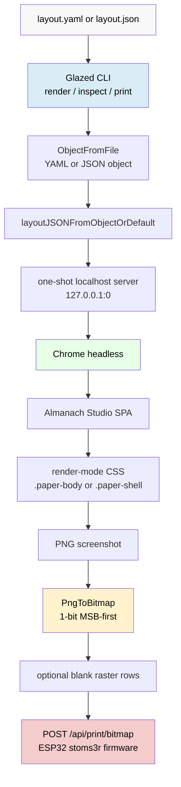

# Almanach Render Service — YAML CLI Rendering and Reliable Thermal Printing

This article is a technical report on the work that turned the Almanach Render Service from a server-only HTTP renderer into a complete local command-line tool for generating, inspecting, documenting, and printing thermal almanac layouts. The work added Glazed CLI verbs, YAML layout input through `objectFromFile`, a reusable one-shot Chrome rendering path, a layout example corpus, embedded help documentation, and a reliable host-side feed mechanism for physical tear-off spacing.

The intended reader is someone who needs to understand the system enough to modify it, package it into a separate repository, or build compatible layout generators. The article assumes familiarity with Go, HTTP, and basic browser rendering. It does not assume prior knowledge of the Almanach codebase.

> [!summary]
> - The render service now supports `serve`, `render`, `inspect`, and `print` commands. The `render`, `inspect`, and `print` commands run without a long-lived local HTTP server by starting an internal loopback server for one Chrome render pass.
> - Layout input is a YAML or JSON object loaded by Glazed `TypeObjectFromFile`. This supports both raw Almanach layouts and wrapped `{ layout, render }` request files.
> - The renderer now has explicit `RenderOptions`: base URL, selector, viewport, threshold, wait time, debug directory, and metrics collection. The CLI defaults to `.paper-body` for print-oriented output.
> - The printer feed problem was fixed by appending white raster rows to the bitmap before sending it to the ESP32 firmware. This made `--feed-lines` physically reliable on the K118 printer.
> - The binary now contains embedded Glazed help pages that teach the layout DSL: a getting-started guide, a user guide, a full reference, and two tutorials.

---

## Why This Work Was Needed

The first version of the Almanach Render Service solved a narrow problem: render an Almanach Studio page in Chrome headless and expose the result through HTTP endpoints. That server could render a page to PNG or bitmap and could forward the bitmap to the ESP32 printer firmware. It was useful for automation, but it was not yet a good development interface.

The missing capability was a direct local loop:

```text
write layout.yaml
render PNG
inspect dimensions and clipping metrics
print only after the preview is correct
```

Before this work, that loop required running the service, sending HTTP requests by hand, and managing output files outside the CLI. The process worked, but it placed too many details on the operator. The operator needed to remember the API path, the correct `Accept` header, the right layout schema, and the correct print endpoint. The renderer also hid several important assumptions: the capture selector was hardcoded, the viewport was hardcoded, debug metrics were unavailable, and the default generated layout had drifted away from the frontend schema.

A thermal-printer renderer needs a stricter workflow. The output is physical. If the renderer captures the wrong element, clips the paper body, includes editor controls, or fails to advance the paper after printing, the mistake is visible immediately on paper. The correct workflow must make previewing and inspecting cheaper than printing.

The work described here addressed that by adding a first-class CLI and by making the renderer itself observable.

---

## The Final User Interface

The resulting binary has four primary commands:

```bash
almanach-render-service serve
almanach-render-service render
almanach-render-service inspect
almanach-render-service print
```

The server mode remains available:

```bash
almanach-render-service serve --port 8199 --printer-ip 192.168.0.126
```

The one-shot render mode accepts YAML directly:

```bash
almanach-render-service render \
  --layout examples/layouts/01-minimal.yaml \
  --out /tmp/almanach.png \
  --output yaml
```

The inspect command reports layout metrics after render-mode CSS has been applied:

```bash
almanach-render-service inspect \
  --layout examples/layouts/01-minimal.yaml \
  --output yaml
```

The print command renders the layout, converts it to a 1-bit bitmap, appends blank raster rows for feed spacing, and posts the bitmap to the ESP32 printer firmware:

```bash
almanach-render-service print \
  --layout examples/layouts/01-minimal.yaml \
  --printer-ip 192.168.0.126 \
  --feed-lines 3 \
  --output yaml
```

The command surface is deliberately small. `serve` handles long-running API mode. `render` produces files. `inspect` answers layout debugging questions. `print` sends output to hardware. Each verb maps to a different operational intent.

---

## Architecture After the CLI Work

The system has five moving parts:

1. The **layout file** describes the page as YAML or JSON.
2. The **CLI** parses options, loads the layout object, and chooses a workflow.
3. The **one-shot static server** serves Almanach Studio to Chrome for a single render.
4. The **Chrome renderer** loads the SPA, injects the layout, applies render-mode CSS, captures an element, and converts the screenshot to a bitmap.
5. The **printer client** sends a packed 1-bit bitmap to the ESP32 firmware.



The important design choice is that Go does not implement an independent page renderer. The React SPA remains the rendering source of truth. The Go service drives the SPA through Chrome and captures the result. This avoids duplicating typography, spacing, SVG icons, and block rendering logic in Go.

The CLI does not remove HTTP from the renderer. Chrome still needs an HTTP URL to load `/almanach` and `/almanach/bundle.js`. The difference is that the CLI starts a temporary server internally, bound to `127.0.0.1:0`, and shuts it down after the render. The user does not have to manage a long-running service for local preview work.

---

## Phase 1: Aligning the Go Layout Schema with the React Frontend

The first code change fixed schema drift. The React frontend defines the layout DSL in `web/almanach/src/almanach-studio.jsx`. Its `DEFAULTS`, `BLOCK_TYPES`, `RENDERERS`, and `parseLayoutJson()` function define which block types are valid and which `data` fields each renderer reads.

The Go service had its own structs in `layout.go`, but several of them no longer matched the frontend. This kind of drift is difficult to diagnose because a layout can still be valid JSON while rendering with missing fields.

The key mismatches were:

| Old Go shape | Frontend shape | Effect |
|---|---|---|
| `TitleData.Title` | `data.text` | Title text could be ignored. |
| `WordData.PartOfSpeech` | `data.part` | Part-of-speech line could be blank. |
| `HistoryData{Year, Event}` | `data.items: [{year,event}]` | History renderer expected a list. |
| block type `did_you_know` | block type `did` | Frontend parser filtered the block out. |
| `DidYouKnowData.Text` | `data.items: []string` | Did-you-know renderer expected a fact list. |

The fix was to treat the frontend schema as canonical. The Go structs now mirror the frontend block data:

```go
type TitleData struct {
    Text     string `json:"text"`
    Subtitle string `json:"subtitle"`
}

type WordData struct {
    Label      string `json:"label"`
    Word       string `json:"word"`
    Phonetic   string `json:"phonetic,omitempty"`
    Part       string `json:"part"`
    Definition string `json:"definition"`
    Example    string `json:"example,omitempty"`
}

type HistoryData struct {
    Label string        `json:"label"`
    Items []HistoryItem `json:"items"`
}

type DidData struct {
    Label string   `json:"label"`
    Items []string `json:"items"`
}
```

The default layout builder now emits `did`, not `did_you_know`, and divider blocks now include the frontend default style:

```go
func dividerBlock() Block {
    return newBlock("divider", map[string]string{"style": "line"})
}
```

This phase also fixed empty HTTP request handling. In Go HTTP handlers, `r.Body` is usually non-nil even when the request has no body. The old implementation treated a non-nil but empty body as an explicit layout override and passed an empty string to the renderer. The new helper treats nil or whitespace-only input as a request to build the default layout:

```go
func (s *Server) layoutJSONFromReader(layoutOverride io.Reader) (string, error) {
    if layoutOverride != nil {
        data, err := io.ReadAll(layoutOverride)
        if err != nil {
            return "", fmt.Errorf("read layout: %w", err)
        }
        if len(bytes.TrimSpace(data)) > 0 {
            return string(data), nil
        }
    }

    layout, err := buildDefaultLayout(s.cfg)
    if err != nil {
        return "", fmt.Errorf("build layout: %w", err)
    }
    b, err := json.Marshal(layout)
    if err != nil {
        return "", fmt.Errorf("marshal layout: %w", err)
    }
    return string(b), nil
}
```

The first lesson is structural: before adding a new interface, align the data model that interface will expose. A CLI that accepts YAML would have made the schema drift more visible, but it would not have fixed it.

---

## Phase 2: Making Chrome Rendering Parameterized and Observable

The original renderer was a method on `Server` with several hardcoded decisions:

- Base URL: `http://localhost:<port>/almanach`
- Selector: `.paper-shell`
- Threshold: `128`
- Viewport: `1200x2000`
- Waits: fixed sleeps
- Debug artifacts: none
- DOM metrics: none

That was enough for a single HTTP endpoint, but it was not enough for a CLI. The CLI needed to render from an ephemeral server. It also needed to switch between `.paper-body` and `.paper-shell`, write debug artifacts, and inspect clipping behavior.

The renderer now accepts a `RenderOptions` struct:

```go
type RenderOptions struct {
    BaseURL        string
    Selector       string
    Threshold      uint8
    ViewportWidth  int
    ViewportHeight int
    WaitAfterLoad  time.Duration
    DebugDir       string
    CollectMetrics bool
}
```

The result object now includes metrics and selector information:

```go
type RenderResult struct {
    Bitmap     *Bitmap
    PNG        []byte
    Theme      string
    RenderedAt string
    LayoutJSON string
    Metrics    RenderMetrics
    Selector   string
}
```

The render flow became:

```text
renderWithChrome(ctx, allocatorCtx, layoutJSON, opts)
  apply option defaults
  create tab
  emulate viewport
  navigate opts.BaseURL + "/almanach"
  wait for window.almanachReady
  call window.almanachLoadLayout(JSON.parse(layoutJSON))
  wait for fonts and animation frames
  inject capture CSS
  wait for layout to settle
  collect metrics if requested
  screenshot opts.Selector
  convert PNG to bitmap
  write debug artifacts if requested
```

The most important fix in this phase was the render-mode CSS. Hiding the editor rails and topbar is not sufficient. The SPA itself has a full-screen editor layout with scroll containers. If those containers remain active, a screenshot of a descendant can still reflect clipped geometry.

The render-mode CSS makes the document content-sized and removes editor constraints:

```css
html, body, #root {
  margin: 0 !important;
  padding: 0 !important;
  width: fit-content !important;
  height: auto !important;
  min-height: 0 !important;
  overflow: visible !important;
  background: #ffffff !important;
}

.almanach-app {
  background: #ffffff !important;
  height: auto !important;
  min-height: 0 !important;
  overflow: visible !important;
  display: block !important;
}

.topbar, .rail, .block-controls {
  display: none !important;
}

.workspace, .canvas {
  display: block !important;
  height: auto !important;
  overflow: visible !important;
}
```

The renderer collects metrics after this CSS is injected. That timing matters. The metrics need to describe the screenshot layout, not the editor layout.

A representative inspect result reports each important selector:

```yaml
selector: .paper-body
found: true
width: 384
height: 955.46875
scroll_width: 384
scroll_height: 955
overflow: visible
overflow_x: visible
overflow_y: visible
display: block
position: relative
```

The second lesson is operational: image output is not enough for debugging a renderer. The renderer must also report the geometry that produced the image.

---

## Phase 3: One-Shot Rendering Without a User-Managed Server

The next step was to make local CLI rendering possible without requiring the user to run `serve` first. Chrome still needs an HTTP URL because the SPA host page loads `/almanach/bundle.js`. The solution was an internal one-shot server:

```go
type oneShotRenderRequest struct {
    LayoutJSON  string
    WebDir      string
    ChromePath  string
    ChromeWSURL string
    Options     RenderOptions
}
```

The helper starts an HTTP server on an OS-assigned loopback port:

```go
ln, err := net.Listen("tcp", "127.0.0.1:0")
if err != nil {
    return nil, fmt.Errorf("listen ephemeral render server: %w", err)
}
```

It registers the same static routes as the server mode:

```go
mux := http.NewServeMux()
registerStaticRoutes(mux, req.WebDir)
```

It then creates a Chrome allocator and renders against the temporary base URL:

```go
opts := req.Options.withDefaults()
opts.BaseURL = "http://" + ln.Addr().String()

allocatorCtx, allocatorCancel := newChromeAllocatorWithViewport(
    cfg,
    opts.ViewportWidth,
    opts.ViewportHeight,
)
defer allocatorCancel()

return renderWithChrome(ctx, allocatorCtx, req.LayoutJSON, opts)
```

This design keeps the public interface simple. The user runs one command. Internally, the command still uses the same browser renderer as the HTTP service.

The one-shot server also keeps the static asset contract identical. The SPA is served through `/almanach` and `/almanach/bundle.js` in both server and CLI mode. There is no separate `file://` path and no special HTML variant for CLI rendering.

---

## Phase 4: Glazed CLI Verbs

The CLI uses the Glazed command framework. The root command initializes logging and the Glazed help system, then registers the verbs.

```go
rootCmd := &cobra.Command{
    Use:     "almanach-render-service",
    Short:   "Render and print Almanach Studio thermal pages",
    Version: version,
    PersistentPreRunE: func(cmd *cobra.Command, args []string) error {
        return logging.InitLoggerFromCobra(cmd)
    },
    RunE: func(cmd *cobra.Command, args []string) error {
        return runServe(cmd.Context(), loadConfig())
    },
}
```

The no-argument behavior still starts server mode. This preserves compatibility with the previous binary while adding explicit `serve` mode.

### The `render` Command

The `render` command writes a PNG or bitmap artifact to a file and emits structured metadata. It does not write binary image data to stdout.

The layout flag uses Glazed `TypeObjectFromFile`:

```go
fields.New(
    "layout",
    fields.TypeObjectFromFile,
    fields.WithHelp("Layout object file to render. Accepts JSON or YAML."),
)
```

The settings struct receives the parsed object:

```go
type RenderSettings struct {
    Layout         map[string]interface{} `glazed:"layout"`
    Out            string                 `glazed:"out"`
    Format         string                 `glazed:"format"`
    Selector       string                 `glazed:"selector"`
    Threshold      int                    `glazed:"threshold"`
    ViewportWidth  int                    `glazed:"viewport-width"`
    ViewportHeight int                    `glazed:"viewport-height"`
    WaitMS         int                    `glazed:"wait-ms"`
    DebugDir       string                 `glazed:"debug-dir"`
    WebDir         string                 `glazed:"web-dir"`
    ChromePath     string                 `glazed:"chrome-path"`
    ChromeWSURL    string                 `glazed:"chrome-ws-url"`
}
```

This decision is central. The layout is not read as a string. Glazed parses YAML or JSON into an object, and the command converts that object into the JSON consumed by the SPA.

The command accepts two shapes:

```yaml
# Raw layout
almanach_studio_version: 1
theme: minimal
paperWidth: 384
blocks: []
```

and:

```yaml
# Wrapped request
layout:
  theme: minimal
  paperWidth: 384
  blocks: []
render:
  selector: .paper-body
  threshold: 128
```

This makes layout files usable both as pure content and as reproducible render requests.

### The `inspect` Command

The `inspect` command renders once and emits DOM metrics for important selectors. It uses the same render path as `render`, but its primary output is structured rows:

```text
.paper-shell
.paper-body
.canvas
.workspace
.almanach-app
```

This command exists because clipping failures are layout failures, not only image failures. A PNG can show that output is wrong. Metrics can show why.

### The `print` Command

The `print` command renders once, converts to bitmap, appends feed rows, and posts to the printer endpoint.

It supports:

```bash
--printer-ip 192.168.0.126
--printer-url http://192.168.0.126/api/print/bitmap
--feed-lines 3
--dry-run
```

The dry-run path renders and converts without contacting hardware. This is required for safe testing.

---

## Phase 5: Example Layouts and Rendered Previews

A CLI for a layout DSL needs examples that are both inputs and regression artifacts. The work added six YAML layouts under:

```text
stoms3r/cmd/almanach-render-service/examples/layouts/
```

The examples are:

| File | Purpose |
|---|---|
| `01-minimal.yaml` | Title, date, and quote smoke test. |
| `02-daily-briefing.yaml` | Weather, plan, news, and note. |
| `03-knowledge-strip.yaml` | Word, history, facts, and quote. |
| `04-tracker-journal.yaml` | Habits, mood, reading, and reflection. |
| `05-wrapped-render-request.yaml` | Demonstrates `{ layout, render }`. |
| `06-paper-shell-preview.yaml` | Demonstrates `.paper-shell` capture. |

Each example was rendered and inspected. The resulting PNG dimensions were:

| Layout | PNG size | Selector |
|---|---:|---|
| `01-minimal` | `384x343` | `.paper-body` |
| `02-daily-briefing` | `384x829` | `.paper-body` |
| `03-knowledge-strip` | `384x955` | `.paper-body` |
| `04-tracker-journal` | `384x1044` | `.paper-body` |
| `05-wrapped-render-request` | `384x607` | `.paper-body` |
| `06-paper-shell-preview` | `384x465` | `.paper-shell` |

The inspect outputs reported `overflow: visible` for all render-critical containers. A contact sheet was generated and reviewed:

```text
examples/rendered/contact-sheet.png
```

This example corpus now serves three purposes:

- It teaches users how to write layouts.
- It exercises the DSL across block families.
- It provides visual regression artifacts for future renderer changes.

---

## Phase 6: Reliable Feed by Appending Blank Raster Rows

The first print tests revealed that `--feed-lines` did not visibly advance paper after the bitmap. The path appeared correct in code:

- The Go service sent `X-Feed`.
- The firmware read `X-Feed`.
- The firmware called `printer_drv_feed(feed)`.
- `printer_drv_feed()` sent `ESC d n`.

The relevant firmware path was:

```c
char feed_hdr[8] = {0};
uint8_t feed = 3;
if (httpd_req_get_hdr_value_str(req, "X-Feed", feed_hdr, sizeof(feed_hdr)) == ESP_OK) {
    int f = atoi(feed_hdr);
    if (f >= 0 && f <= 20) feed = (uint8_t)f;
}
if (feed > 0) printer_drv_feed(feed);
```

The driver command was:

```c
esp_err_t printer_drv_feed(uint8_t lines)
{
    uint8_t cmd[] = { 0x1B, 0x64, lines };
    return send_bytes(cmd, sizeof(cmd));
}
```

The command existed, but physical behavior was not reliable after bitmap printing. The fix moved feed behavior into the bitmap itself. The host now appends white rows to the bitmap before sending it to the ESP32 firmware.

```go
const printerFeedLinePixels = 24

func bitmapWithTrailingBlankRows(bitmap *Bitmap, feedLines int) *Bitmap {
    if bitmap == nil || feedLines <= 0 || bitmap.BytesPerRow <= 0 {
        return bitmap
    }
    if feedLines > 20 {
        feedLines = 20
    }

    blankRows := feedLines * printerFeedLinePixels
    newData := make([]byte, len(bitmap.Data)+bitmap.BytesPerRow*blankRows)
    copy(newData, bitmap.Data)
    return &Bitmap{
        Width:       bitmap.Width,
        Height:      bitmap.Height + blankRows,
        BytesPerRow: bitmap.BytesPerRow,
        Data:        newData,
    }
}
```

White pixels are represented by zero bits, so the appended rows are zero-filled bytes. The service sends `X-Feed: 0` after padding to avoid double-feeding:

```go
req.Header.Set("X-Width", fmt.Sprintf("%d", bitmapToSend.Width))
req.Header.Set("X-Height", fmt.Sprintf("%d", bitmapToSend.Height))
req.Header.Set("X-Feed", "0")
```

This changed the semantics of host-side `--feed-lines`: it now means `feedLines * 24` blank raster rows at the bottom of the print. A physical print confirmed that this approach worked.

This phase illustrates an important embedded-system rule: when a later command in a device protocol is unreliable in a particular state, prefer sending the desired output through the command path that is already known to work. In this case, bitmap data was reliable, so trailing whitespace became bitmap data.

---

## Phase 7: Embedded Glazed Help for Layout Authors

The final step made the binary teach its own layout DSL. The CLI now embeds Glazed help pages from:

```text
stoms3r/cmd/almanach-render-service/doc/
```

The embedded loader is small:

```go
package doc

import (
    "embed"

    "github.com/go-go-golems/glazed/pkg/help"
)

//go:embed *.md
var docFS embed.FS

func AddDocToHelpSystem(helpSystem *help.HelpSystem) error {
    return helpSystem.LoadSectionsFromFS(docFS, ".")
}
```

The root command loads those pages before installing the help command:

```go
helpSystem := help.NewHelpSystem()
if err := almanachdoc.AddDocToHelpSystem(helpSystem); err != nil {
    return nil, err
}
help_cmd.SetupCobraRootCommand(helpSystem, rootCmd)
```

The help entries are:

| Slug | Purpose |
|---|---|
| `layouts-getting-started` | First YAML layout and preview workflow. |
| `layouts-user-guide` | Design guidance for readable thermal pages. |
| `layout-dsl-reference` | Complete block and field reference. |
| `tutorial-daily-briefing` | Tutorial for a daily briefing page. |
| `tutorial-knowledge-strip` | Tutorial for a word/history/facts page. |

They are available directly from the binary:

```bash
almanach-render-service help layouts-getting-started
almanach-render-service help layouts-user-guide
almanach-render-service help layout-dsl-reference
almanach-render-service help tutorial-daily-briefing
almanach-render-service help tutorial-knowledge-strip
```

This matters because the layout DSL is intended to be generated by people, scripts, and LLMs. The binary should therefore contain enough reference material to produce valid, printable layouts without requiring the reader to find a separate design document.

---

## The Layout DSL in Practice

The layout DSL is intentionally constrained. It is not arbitrary HTML. A layout file chooses from known block types, and each block type has a fixed data shape. This constraint is what makes the renderer stable.

A minimal layout is:

```yaml
almanach_studio_version: 1
theme: minimal
paperWidth: 384
bodyScale: 1.6
feedLines: 3
blocks:
  - id: title-1
    type: title
    data:
      text: THE ALMANACH
      subtitle: Minimal CLI smoke test

  - id: date-1
    type: date
    data:
      date: May 8, 2026
      day: Friday

  - id: quote-1
    type: quote
    data:
      label: Quote of the Day
      text: Simplicity is prerequisite for reliability.
      author: Edsger W. Dijkstra
```

A generated layout should obey these rules:

- Use `paperWidth: 384` for the target printer.
- Use `theme: minimal` for monochrome output.
- Use unique `id` values for blocks.
- Use supported `type` values exactly.
- Keep text short enough for 384px width.
- Quote YAML times, dates, and colon-containing strings.
- Render and inspect before printing.

The DSL has a small set of page-level controls and a larger set of content blocks. This gives generators enough flexibility to produce varied pages without allowing them to bypass the renderer's typography and spacing decisions.

---

## Physical Print Validation

The work included real printer tests against the ESP32 device at:

```text
192.168.0.126
```

A minimal example printed successfully twice through the initial CLI path. The feed-line behavior did not visibly advance paper. After the blank-raster-row fix, printing with `--feed-lines 3` produced a successful physical result with visible trailing space.

A custom cats-and-panthers knowledge strip was then generated, previewed, and printed. The rendered content was `384x993`, and the printed bitmap became `384x1065` after adding 72 blank rows for `--feed-lines 3`.

The print output reported:

```yaml
printed: true
printer_ok: true
printer_response:
  ok: true
width: 384
height: 1065
bytes: 51120
feed_lines: 3
selector: .paper-body
```

This validated the complete path:

```text
YAML layout
  -> Glazed objectFromFile
  -> one-shot Chrome render
  -> .paper-body PNG
  -> 1-bit bitmap
  -> trailing blank raster rows
  -> ESP32 /api/print/bitmap
  -> K118 physical print
```

---

## Files That Define the Implementation

The implementation now has clear responsibility boundaries, even though it still lives in a single Go package.

| File | Responsibility |
|---|---|
| `main.go` | Starts the Cobra/Glazed root command. |
| `cmd_root.go` | Configures logging, embedded help, and command registration. |
| `cmd_serve.go` | Runs the long-lived HTTP server mode. |
| `cmd_render.go` | Implements one-shot PNG/bitmap rendering. |
| `cmd_inspect.go` | Emits DOM metrics for layout debugging. |
| `cmd_print.go` | Renders and prints through the ESP32 bitmap endpoint. |
| `render_oneshot.go` | Starts the temporary loopback server and calls the renderer. |
| `renderer.go` | Drives Chrome headless, applies capture CSS, screenshots selectors, and writes debug artifacts. |
| `layout.go` | Defines the layout schema and default layout construction. |
| `bitmap.go` | Converts PNG images to packed 1-bit bitmaps. |
| `printer.go` | Sends bitmaps to the firmware and appends blank feed rows. |
| `doc/*.md` | Embedded Glazed layout-authoring help pages. |
| `examples/layouts/*.yaml` | Example layout inputs. |
| `examples/rendered/*.png` | Rendered visual reference outputs. |

A future packaging pass should move these files into separate packages such as `internal/render`, `internal/layout`, `internal/bitmap`, `internal/printer`, and `internal/cli`. The current structure is functional; the next repository shape should make package boundaries explicit.

---

## Failure Modes and Fixes

Several concrete failure modes appeared during the work.

### Schema drift between Go and React

The Go default layout structs did not match the frontend renderer. This produced layouts that were valid JSON but semantically wrong for the SPA. The fix was to make the frontend schema canonical and add tests for representative JSON keys.

### Empty HTTP bodies bypassed default layout generation

`r.Body` was non-nil even when empty. The old code treated this as an explicit empty layout override. The fix was to trim and check the body content before deciding whether to use it.

### Renderer clipping was hard to diagnose

A PNG alone did not explain whether the wrong selector was captured or an ancestor was clipping content. The fix was to collect DOM metrics after applying render-mode CSS.

### Post-bitmap feed did not visibly advance paper

`X-Feed` reached the firmware, and firmware code called `ESC d n`, but visible feed was unreliable. The fix was to add blank white rows to the bitmap itself.

### CLI docs would drift if kept outside the binary

The layout DSL needs to be available where the CLI is used. The fix was to embed Glazed help pages in the binary and expose them through `almanach-render-service help`.

---

## What Changed in the Git History

The main commits for this work were:

```text
967eeb6 docs: add Almanach CLI implementation plan
c3708df fix: align almanach layout schema with frontend
4ec7ee6 refactor: parameterize Chrome almanach renderer
81fe310 feat: add Glazed CLI verbs for almanach rendering
df08cca docs: document almanach CLI workflows
26dfedc test: add almanach layout examples
6debc0e fix: bake printer feed into bitmap output
1117575 docs: add embedded Almanach layout help
```

The documentation commits around those code commits updated the `ALMANACH-CLI` docmgr ticket, diary, tasks, and changelog. The implementation was intentionally split into reviewable phases: schema first, renderer second, CLI third, examples fourth, printer feed fifth, embedded help last.

---

## Recommended Next Repository Shape

The current code works, but it should move into a standalone repository with clear product boundaries. The recommended top-level structure is:

```text
almanach-printer/
├── README.md
├── Makefile
├── docs/
├── examples/
├── service/
├── firmware/
├── web/
├── scripts/
└── .github/workflows/
```

The service should become:

```text
service/
├── cmd/almanach-render-service/main.go
├── internal/cli/
├── internal/config/
├── internal/server/
├── internal/render/
├── internal/layout/
├── internal/bitmap/
├── internal/printer/
├── internal/fetchers/
├── doc/
├── testdata/
├── go.mod
└── README.md
```

The firmware should become a proper ESP-IDF project under `firmware/`, and the React Almanach Studio source should live under `web/`. The example layouts should be top-level product examples, not service internals.

The first user-facing success path in that repo should be:

```bash
git clone <repo>
cd almanach-printer
make build
make render-example
```

A user with flashed hardware should then run:

```bash
ALMANACH_PRINTER_IP=192.168.0.126 make print-example
```

This next packaging step is not only file movement. It is the step that turns the working system into a reproducible project for other users.

---

## Key Points to Retain

- The React SPA is the rendering source of truth. The Go code should automate it, not reimplement it.
- YAML layout input is useful because it is readable, editable, and easy for generators to produce.
- A renderer should expose geometry and debug artifacts, not only images.
- Print-oriented output should capture `.paper-body`; decorative previews can capture `.paper-shell`.
- Thermal-printer feed is more reliable when represented as blank raster rows in the bitmap payload.
- Embedded CLI help is part of the interface. If users generate layouts through the binary, the binary should document the layout DSL.

The work produced a complete local authoring loop: write YAML, render PNG, inspect layout metrics, print to the ESP32 device, and read the DSL documentation from the same binary. That loop is the foundation for packaging the firmware, web app, and render service into a separate repository.
