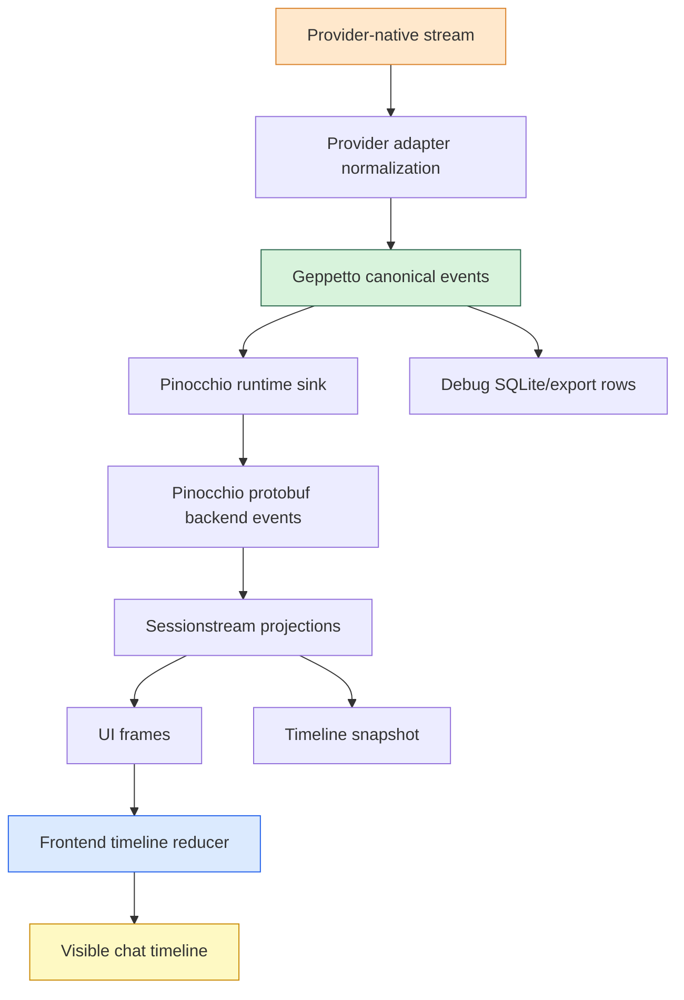

# Canonical Chat Event Protocol: Provider Streams to Browser State

This report explains the canonical chat event protocol work across Geppetto, Pinocchio, and the CoinVault integration workspace. The immediate project began as a vocabulary cutover: replace overloaded legacy text and final events with explicit lifecycle events for provider calls, text segments, reasoning segments, and tools. It became a broader hardening project because event names alone do not make a protocol reliable. A reliable protocol needs identity, terminal semantics, merge rules, and tests that encode the difference between a real transcript event and a provider envelope event.

The reference workspace is `/home/manuel/workspaces/2026-05-02/use-sessionstream-coinvault`. The main implementation repositories are `geppetto` and `pinocchio`, with downstream CoinVault validation still pending. The coordination ticket is `PINO-PROTOCOL-CONFORMANCE`, located at `/home/manuel/workspaces/2026-05-02/use-sessionstream-coinvault/pinocchio/ttmp/2026/05/08/PINO-PROTOCOL-CONFORMANCE--systematic-chat-protocol-conformance-tests-for-canonical-event-lifecycles`.

> [!summary]
> - The core design move was to turn chat streaming into explicit lifecycles: provider-call, text segment, reasoning segment, and tool call.
> - The core implementation move was to make provider adapters reducer-shaped: initialize state, consume provider-native events, normalize into canonical events, complete terminal state, and persist final turn metadata.
> - The core testing move was to use provider-native fixtures but shared lifecycle scenarios, so OpenAI, Claude, Gemini, and Pinocchio can all be tested without pretending their stream grammars are the same.

## Why this project exists

A chat stream looks simple when viewed from the browser: words appear, sometimes thinking appears, sometimes a tool is called, and eventually the answer finishes. The implementation is not simple. A single user prompt crosses several different protocols before it becomes a rendered message. The provider emits native stream events. Geppetto converts them into canonical events. Pinocchio converts those into protobuf backend events. Sessionstream projects them into UI events and timeline entities. The frontend converts UI events into sparse Redux patches. Persistence stores timeline snapshots and debug rows.

Every layer has a slightly different job. The provider adapter understands provider-native grammar. Geppetto owns the canonical event vocabulary. Pinocchio owns runtime projection and protobuf transport. The frontend owns display-state reduction. Bugs appear when one layer silently borrows responsibilities from another layer. The most common version is a terminal provider event being treated as if it were transcript text, or a sparse terminal patch clearing fields that arrived earlier.

The initial symptom was vocabulary overload. Events such as `EventFinal`, `EventPartialCompletion`, `ChatInferenceStarted`, `ChatTokensDelta`, and `ChatInferenceFinished` carried too much meaning. A “final” event could mean provider finished, text finished, run finished, or some aggregate result was ready. That ambiguity made it hard to reason about cancellation, tool calls, reasoning summaries, and browser state. The hard cutover removed those names from active runtime paths and replaced them with typed canonical lifecycles.

The deeper problem was not naming. The deeper problem was that the protocol did not yet have explicit invariants. Once the vocabulary became canonical, the project had to answer questions such as:

- Does a provider `message_stop`, `response.completed`, or EOF create text? No. It closes a provider call, and only closes text if real text was active.
- Does a failed stream after partial text throw away the partial transcript? No. Safe partial text should be preserved, while the terminal error remains visible.
- Does a partial tool-call argument stream become executable on cancellation? No. A tool request exists only after the provider produced a complete executable tool call.
- Does a sparse frontend patch with no `toolName` mean the tool name is now empty? No. Sparse means “not mentioned,” not “clear the previous value.”
- Does routing identity live in `metadata.Extra`? No. Routing and joining use typed `events.Correlation`; `metadata.Extra` is debug/provenance only.

These are protocol rules. They belong in tests, not in memory.

## The mental model: streams are small state machines

The most useful mental model for the project is this: every chat stream is a collection of small, nested state machines.

A provider call starts and finishes once. Inside it, zero or more text segments may start, receive deltas, and finish. Zero or more reasoning segments may do the same. Zero or more tool calls may start, accumulate arguments, become requested, execute, and finish. The provider’s native event stream is not the same as the canonical state machine. The provider stream is input. The canonical lifecycle is output.



The reducer shape follows naturally from this model. Instead of spreading stream state across a long provider loop, the adapter keeps an explicit state object and applies provider events to it. Each provider still has its own native inputs. OpenAI Responses emits SSE event names and JSON maps. Chat Completions emits choice deltas. Claude emits message and content-block events. Gemini emits `genai.GenerateContentResponse` chunks. The tests should respect that difference.

The shared part is the lifecycle vocabulary. Every provider should answer the same questions: what starts a provider call, what counts as transcript text, how are tool arguments accumulated, what happens on error, and which correlation fields identify the resulting entities?

## The canonical event vocabulary

The new Geppetto vocabulary separates lifecycle levels that were previously collapsed together.

| Lifecycle | Canonical events | What they mean |
|---|---|---|
| Provider call | `EventProviderCallStarted`, `EventProviderCallMetadataUpdated`, `EventProviderCallFinished` | A single call to a model/provider started, reported metadata, and ended. |
| Text segment | `EventTextSegmentStarted`, `EventTextDelta`, `EventTextSegmentFinished` | Assistant text exists as transcript content. |
| Reasoning segment | `EventReasoningSegmentStarted`, `EventReasoningDelta`, `EventReasoningSegmentFinished` | Reasoning/thinking content exists separately from assistant answer text. |
| Tool lifecycle | `EventToolCallStarted`, `EventToolCallArgumentsDelta`, `EventToolCallRequested`, `EventToolExecutionStarted`, `EventToolResultReady`, `EventToolCallFinished` | A model requested a tool, the runtime executed it, and the result became available. |
| Terminal failure/interrupt | `EventError`, `EventInterrupt` plus lifecycle finish events where needed | A run failed or was stopped while preserving safe partial state. |

The most important distinction is provider envelope versus transcript content. A provider can finish without producing text. A provider can report usage without producing text. A provider can emit stop metadata with no assistant content. None of those events should manufacture an empty assistant message. Text begins only when provider-native text exists.

The second important distinction is current delta versus accumulated state. For streamed tool arguments, the delta is the newly arrived fragment; the `Arguments` field represents the accumulated argument string. This matters because downstream layers need both semantics. A UI may show the current stream fragment for debugging, while the tool executor needs the full accumulated JSON when the call becomes executable.

## Correlation is identity, not decoration

The cutover made `events.Correlation` a first-class part of canonical events. Correlation is not just a debug annotation. It is the identity model that lets the downstream protocol join events without relying on provider-specific maps hidden in `metadata.Extra`.

The useful classification is layer-dependent:

| Correlation field | Role |
|---|---|
| `CorrelationKey` | Required canonical identity for all correlated events. |
| `ProviderCallID` | Required identity for provider-call lifecycle events. |
| `SegmentID`, `SegmentIndex`, `SegmentType` | Required or essential identity for text/reasoning segment events. |
| `ToolCallID`, `ToolCallIndex` | Required identity for tool lifecycle events. |
| `ParentCorrelationKey` | Hierarchy/provenance link from child entity to parent provider/run. |
| `ResponseID`, `ItemID`, `OutputIndex`, `SummaryIndex`, `ChoiceIndex`, `ContentBlockIndex` | Provider-native provenance fields that are functional during normalization and useful for debugging downstream. |

This rule simplified many downstream decisions. Pinocchio should not route text segments by poking through provider-specific `metadata.Extra`. The frontend should not join tool result rows by guessing display labels. SQLite debug export should preserve typed correlation so a browser trace can be matched back to provider events.

In code, the rule is enforced by `events.ValidateCanonicalEvent`. Provider tests now use it as an invariant check on emitted canonical events.

## Provider normalization: why reducer-shaped code helped

Provider adapters were the first place to harden because they are the earliest point where ambiguity enters the system. If an adapter misclassifies a provider event, every downstream layer inherits a bad canonical stream. The project therefore started Phase 1 in Geppetto, before adding Pinocchio-side matrices.

The adopted shape is deliberately boring:

```text
setup
initialize explicit stream state
consume stream
reduce or handle provider-native events
complete terminal state
append/persist final turn data
return partial/final turn plus terminal error if any
```

The value is not abstraction for its own sake. The value is that every phase has a name. Once the phases have names, they can be tested separately. The stream reader can remain tied to the SDK or HTTP transport. The reducer can be fed provider-native fixtures. The completion helper can be tested with synthetic terminal states.

A representative pseudocode version looks like this:

```go
func runStreamingInference(ctx context.Context, turn *turns.Turn) (*turns.Turn, error) {
    metadata := buildEventMetadata(turn)
    providerCorr := buildProviderCorrelation(metadata)
    publish(EventProviderCallStarted(metadata, providerCorr))

    state := newStreamState(providerCorr)
    terminalErr := consumeProviderStream(ctx, func(nativeEvent NativeEvent) error {
        effects := reduceProviderEvent(metadata, state, nativeEvent)
        publishAll(effects.Events)
        return nil
    })

    result, completionEvents := completeStream(turn, &metadata, state, terminalErr)
    persistInferenceResult(turn, result)
    publishAll(completionEvents)

    return turn, terminalErr
}
```

This pseudocode hides provider-specific details, but it shows the essential separation. A native event is not itself the protocol. A native event is reduced into canonical effects.

## OpenAI-compatible Chat Completions

Chat Completions became the reference implementation for the reducer pattern. The key files are:

- `/home/manuel/workspaces/2026-05-02/use-sessionstream-coinvault/geppetto/pkg/steps/ai/openai/chat_stream_reducer.go`
- `/home/manuel/workspaces/2026-05-02/use-sessionstream-coinvault/geppetto/pkg/steps/ai/openai/chat_stream_reducer_test.go`
- `/home/manuel/workspaces/2026-05-02/use-sessionstream-coinvault/geppetto/pkg/steps/ai/openai/engine_openai.go`

The reducer handles choice-scoped text, reasoning, and tool-call state. The engine loop reads provider chunks and turns them into reducer inputs. Terminal conditions such as EOF, cancellation, and error flow through a shared completion path.

The important behavior is easiest to state as tests:

- Text delta plus EOF starts text, emits a delta, closes text, and finishes the provider call.
- EOF with no content finishes the provider call without creating a text segment.
- Cancellation after text preserves partial text and returns a cancellation error.
- Error after reasoning preserves partial reasoning and returns the error.
- Tool argument deltas accumulate the full argument string.
- Cancellation or error after partial tool arguments does not emit `ToolCallRequested` and does not append executable tool blocks.
- Metadata-only final chunks update provider metadata without manufacturing transcript content.
- Sparse tool deltas preserve the tool name and accumulated JSON.

This provider established the table-driven style for the rest of the work. The tables use provider-like reducer inputs, not an artificial generic fixture type. The shared part is the expected canonical trace.

## OpenAI Responses

OpenAI Responses had the richest stream grammar, so it benefited most from the refactor. The important files are:

- `/home/manuel/workspaces/2026-05-02/use-sessionstream-coinvault/geppetto/pkg/steps/ai/openai_responses/stream_state.go`
- `/home/manuel/workspaces/2026-05-02/use-sessionstream-coinvault/geppetto/pkg/steps/ai/openai_responses/stream_events.go`
- `/home/manuel/workspaces/2026-05-02/use-sessionstream-coinvault/geppetto/pkg/steps/ai/openai_responses/streaming.go`
- `/home/manuel/workspaces/2026-05-02/use-sessionstream-coinvault/geppetto/pkg/steps/ai/openai_responses/engine_test.go`

The Responses work moved mutable state into `responsesStreamState`: assistant text, message item IDs, response ID, reasoning builders, summary buffers, tool calls by item, final calls, usage, stop reason, and terminal errors. The provider-event handler moved out of the main streaming function into `stream_events.go`. The HTTP stream opening logic, SSE consumption loop, final metadata persistence, and provider-call completion became named helpers.

The most important bug found by the new tests was sparse function-call finalization. A final `response.output_item.done` event can omit fields that appeared earlier, such as call ID, name, output index, status, or arguments. Treating omission as clearing would either lose the tool identity or emit an incomplete tool call. The fix was to backfill missing final fields from `streamState.callsByItem[itemID]` before deciding whether the tool call is executable.

The rule generalizes beyond OpenAI Responses:

```text
missing field means absent update
empty meaningful field means provider actually sent empty
previous accumulated state remains authoritative unless the provider explicitly replaces it
```

That rule will matter again in Pinocchio frontend sparse patches.

## Claude

Claude already had a reducer-like object: `ContentBlockMerger`. The relevant files are:

- `/home/manuel/workspaces/2026-05-02/use-sessionstream-coinvault/geppetto/pkg/steps/ai/claude/content-block-merger.go`
- `/home/manuel/workspaces/2026-05-02/use-sessionstream-coinvault/geppetto/pkg/steps/ai/claude/content-block-merger_test.go`
- `/home/manuel/workspaces/2026-05-02/use-sessionstream-coinvault/geppetto/pkg/steps/ai/claude/api/streaming.go`

This is an important lesson: not every provider needed a rewrite. Claude’s stream grammar is already organized around message events and content blocks. `ContentBlockMerger.Add(event)` accepts native `api.StreamingEvent` values, mutates merger state, and returns canonical events. That is close enough to the desired shape to test directly.

The review-derived tests covered:

- metadata-only `message_stop` does not create a text segment;
- split and sparse tool deltas preserve content-block/tool identity;
- stream error after active text preserves partial text and emits error.

The architectural point is that “reducer-oriented” does not mean every provider must have the same type names. It means the provider has an explicit state transition seam that tests can call with native inputs.

## Gemini

Gemini began as the least testable provider because stream state lived inline in `RunInference`. The relevant files after extraction are:

- `/home/manuel/workspaces/2026-05-02/use-sessionstream-coinvault/geppetto/pkg/steps/ai/gemini/stream_reducer.go`
- `/home/manuel/workspaces/2026-05-02/use-sessionstream-coinvault/geppetto/pkg/steps/ai/gemini/stream_helpers.go`
- `/home/manuel/workspaces/2026-05-02/use-sessionstream-coinvault/geppetto/pkg/steps/ai/gemini/engine_gemini.go`
- `/home/manuel/workspaces/2026-05-02/use-sessionstream-coinvault/geppetto/pkg/steps/ai/gemini/engine_gemini_test.go`

The extraction introduced `geminiStreamState`, `reduceGeminiStreamResponse`, `consumeGeminiStream`, `completeGeminiStream`, and `appendGeminiFinalTurnBlocks`. The engine still owns model setup and SDK orchestration, but chunk normalization and terminal completion are testable helpers.

Gemini’s current function calls arrive complete, so it does not need the same partial argument accumulation tests as Chat Completions or Responses. The tests instead focus on native `genai.GenerateContentResponse` chunks:

- metadata-only final chunk records usage/finish reason without creating text;
- multiple text chunks accumulate monotonically;
- complete function calls emit executable tool requests;
- terminal stream error after active text closes the text segment, preserves partial assistant text, emits `EventError`, and finishes the provider call as failed.

The final point matters because it aligns Gemini with the protocol rule that terminal errors should not silently lose partial text.

## Table-driven tests: same questions, different fixtures

The testing guide now lives in Geppetto at:

`/home/manuel/workspaces/2026-05-02/use-sessionstream-coinvault/geppetto/docs/design/implementation/01-provider-event-testing.md`

The guide’s main idea is simple: providers should not share an artificial input language. They should share scenario names and lifecycle invariants.

| Provider | Native fixture shape | Test seam |
|---|---|---|
| OpenAI Chat Completions | reducer inputs / chat completion chunks | `chat_stream_reducer.go` |
| OpenAI Responses | SSE event names plus provider JSON maps | `stream_events.go`, `stream_state.go`, `streaming.go` helpers |
| Claude | `api.StreamingEvent` values | `ContentBlockMerger.Add` |
| Gemini | `*genai.GenerateContentResponse` chunks | `reduceGeminiStreamResponse`, `completeGeminiStream` |

A shared canonical trace projection is useful, but it should be small. The tests usually need event type, segment type, stream kind, text delta, accumulated text, tool name, arguments, stop reason, finish class, usage presence, and whether canonical validation passes. They do not need full struct equality with generated IDs and timestamps.

A representative trace assertion might look like this:

```go
type canonicalTraceEvent struct {
    Type          events.EventType
    SegmentType   string
    Delta         string
    Text          string
    ToolName      string
    Arguments     string
    StopReason    string
    FinishClass   string
    CorrelationOK bool
}
```

The important part is not the exact helper. The important part is the discipline: each row states a provider-native input program and an expected canonical lifecycle.

## Terminal semantics are where protocols become honest

Happy-path streaming is easy to fake. Terminal behavior is where the protocol has to tell the truth.

There are three different terminal questions that often get collapsed:

1. Did the provider call end?
2. Did the text/reasoning segment end?
3. Did the overall run succeed, stop, or fail?

Those are not the same question. A provider call can fail after text has streamed. A run can be interrupted while a text segment is active. A provider can complete with usage metadata but no transcript content. A tool call can be partially streamed but never become executable.

The correct policy developed through the project is:

- EOF/final success closes active text and reasoning where appropriate.
- Error/cancel closes active text and reasoning safely where implemented.
- Error/cancel preserves safe partial transcript state.
- Error/cancel returns or records the terminal error.
- Error/cancel does not fabricate provider success.
- Error/cancel does not materialize partial tool calls as executable requests.
- Final provider envelope events do not manufacture text or reasoning.

This policy is now visible in the provider helper structure. Chat Completions has shared terminal completion. Responses has terminal state and failed provider-call finish behavior on stream errors. Gemini now has `completeGeminiStream`, including active-text terminal-error coverage. Claude tests encode stream-error behavior around its merger.

## Pinocchio: the next layer of the same problem

The Geppetto work brings provider-normalization to a good checkpoint. The next phase should move to Pinocchio, not because Geppetto is perfect, but because the largest remaining risk has moved downstream.

Pinocchio has a similar shape, but the inputs are already canonical Geppetto events. The questions change from “how do we normalize provider-native chunks?” to “how do we preserve canonical semantics through protobuf, sessionstream, projection, persistence, and sparse frontend merging?”

The important Pinocchio files are:

| Layer | Files | What to test |
|---|---|---|
| Runtime sink | `pinocchio/pkg/chatapp/runtime_sink.go` | Translation from Geppetto canonical events into protobuf events; active text finalization on error/interrupt. |
| Base projections | `pinocchio/pkg/chatapp/projections.go` | Empty text starts do not create timeline entities; finished/delta events preserve content and correlation. |
| Tool plugin | `pinocchio/pkg/chatapp/plugins/toolcall.go` | Tool lifecycle projection and sparse field preservation. |
| Reasoning plugin | `pinocchio/pkg/chatapp/plugins/reasoning.go` | Thinking segment lifecycle and empty-entity avoidance. |
| Frontend mapper | `pinocchio/cmd/web-chat/web/src/ws/timelineEvents.ts` | UI events become sparse timeline mutations without clearing omitted fields. |
| Redux merge | `pinocchio/cmd/web-chat/web/src/store/timelineSlice.ts` | Sparse `props` merge preserves existing state. |
| Timeline persistence | `pinocchio/pkg/ui/timeline_persist.go` | Durable snapshots preserve segment identity and close active segments correctly. |

The same reducer-oriented question applies. Pinocchio already has reducer-like pieces:

- `runtimeEventSink.PublishEvent` is a translator with internal state.
- `baseTimelineProjection` is a projection reducer over sessionstream events plus a timeline view.
- `timelineMutationFromUIEvent` is a frontend reducer input mapper.
- `timelineSlice.upsertEntity` is the Redux merge reducer.

It does make sense to move further in the reducer direction, but carefully. The next step should not be a large rewrite. The next step should be small pure helper seams where tests need them.

A useful Pinocchio-side shape would be:

```text
Geppetto canonical event program
  -> runtime sink translation
  -> protobuf backend event trace
  -> sessionstream projection result
  -> frontend UI mutation trace
  -> Redux final state
```

Not every test needs all stages. Start at the layer where the invariant lives.

## Pinocchio test matrix to build next

The Pinocchio test plan should encode the deferred review-derived scenarios from the provider guide.

### Phase 2: Go runtime protocol matrix

Build table-driven tests in `pinocchio/pkg/chatapp`, likely alongside or near `chat_test.go`, or in a new file such as `runtime_sink_protocol_test.go`.

The input should be synthetic Geppetto canonical events. The output should be published protobuf event names and payloads.

Priority rows:

- Text start + delta + error closes the active text segment once and publishes `ChatRunFailed`.
- Text start + delta + interrupt closes the active text segment once and publishes `ChatRunStopped`.
- Text segment already finished + later error does not rewrite the closed segment.
- Provider-call finished after text finished does not rewrite text.
- Correlation survives conversion from `events.Correlation` to `CorrelationInfo`.
- No active text + error does not manufacture `ChatTextSegmentFinished`.

This layer is the best place to test centralized terminal handling. The helper `finishActiveTextSegment` already exists. The tests should prove it is the only path that synthetic terminal events need.

### Phase 3: plugin projection matrices

Build table-driven tests in:

- `pinocchio/pkg/chatapp/plugins/toolcall_test.go`
- `pinocchio/pkg/chatapp/plugins/reasoning_test.go`

Priority rows for tools:

- Tool started with name, then sparse finish without name, preserves name in projected state.
- Tool requested with input, then sparse finished event, preserves input.
- A display fallback such as `tool` is not persisted as canonical tool name unless the event actually supplied it.
- Correlation fields survive tool projection.

Priority rows for reasoning:

- Reasoning start alone does not create an empty visible entity.
- Reasoning delta creates content and preserves correlation.
- Reasoning finished with no content does not erase previous content.
- Sparse reasoning terminal events do not clear provider/correlation fields.

### Phase 4: frontend reducer-backed conformance matrix

Build table-driven tests in the web-chat frontend, preferably near the existing `cmd/web-chat/web/src/ws/wsManager.test.ts` tests or in a new `timelineEvents.protocol.test.ts` if the file grows too large.

This is where the sparse patch contract becomes explicit. `timelineMutationFromUIEvent` already omits undefined/empty fields through `definedProps`, and `timelineSlice.upsertEntity` shallow-merges `props`. The tests should treat those as reducer semantics.

Priority rows:

- `ChatToolCallRequested` creates a tool with `toolName`, parsed input, and correlation.
- `ChatToolCallFinished` without `toolName` or `input` does not clear earlier `toolName` or `input` after Redux merge.
- A generic display fallback label is not stored as canonical `toolName`.
- `ChatTextSegmentFinished` with empty content does not create an empty message.
- `ChatTextSegmentFinished` after existing content preserves content when terminal payload is sparse.
- Correlation fields including zero indexes survive JSON/protobuf decoding and frontend mutation.

The current frontend tests already cover parts of this. The next step is to make them table-driven and explicitly connect them to protocol scenario names.

### Phase 5: timeline persistence protocol tests

Build tests around `pinocchio/pkg/ui/timeline_persist.go`.

Priority rows:

- Text start + delta + interrupt persists the partial text as terminal/stopped.
- Text start + delta + error persists partial text as failed or finished according to current policy.
- Provider-call finished does not rewrite an already closed text segment.
- Correlation key is used as the durable entity ID when available.
- Reasoning/tool persistence preserves typed correlation fields where the persistence layer stores them.

This phase should come after runtime and frontend reducer tests because persistence is easier to reason about once the upstream event contract is explicit.

## The answer to “should Pinocchio be reducer-oriented?”

Yes, but the right word is “reducer-shaped,” not “framework.” Pinocchio already has several reducer-shaped units. The goal should be to make their state transitions explicit and table-testable, not to invent a large generic conformance engine.

A good reducer-oriented refactor has three properties:

1. **The input is explicit.** A test can say, “given this canonical Geppetto event” or “given this UI frame.”
2. **The previous state is explicit.** A projection receives a timeline view; Redux receives existing entity state; the runtime sink has active text state.
3. **The output is explicit.** The reducer returns backend events, timeline entities, UI mutations, or final Redux state.

A bad refactor would hide provider/runtime/frontend differences behind an abstract event program too early. The Geppetto work showed the safer approach: first create provider-specific tables; only extract shared helpers when duplication is obvious.

For Pinocchio, this means:

- Keep Go runtime tests in Go, using Geppetto canonical event constructors and protobuf payload assertions.
- Keep frontend reducer tests in TypeScript, using UI frame objects and Redux state assertions.
- Use shared scenario IDs in test names or table fields, not shared fixture types across languages.
- Add small pure helpers only when they make tests easier to read.

## What was accomplished

The project completed several major pieces before this report:

- Added canonical Geppetto correlation types, builders, and validation.
- Migrated Claude, OpenAI Responses, OpenAI-compatible Chat Completions, and Gemini to canonical events.
- Removed legacy Geppetto chat event names from active runtime paths.
- Cut Pinocchio over to canonical protobuf/runtime/UI events.
- Added SQLite/debug export and browser validation for multiple model profiles.
- Refactored OpenAI Chat Completions around an explicit stream reducer.
- Refactored OpenAI Responses into explicit stream state, helper functions, stream opening, event handling, completion, and persistence helpers.
- Removed the OpenAI Responses non-streaming path so the provider has one lifecycle path.
- Added a Geppetto provider event table-driven testing guide.
- Added review-derived provider normalization tests across OpenAI Chat, Claude, OpenAI Responses, and Gemini.
- Extracted Gemini reducer and stream completion helpers.
- Kept Pinocchio ticket docs, tasks, changelog, and diary current.

Important Geppetto commits from the later provider-hardening phase include:

```text
4262075 Add OpenAI chat stream reducer tests
12d58dc Wire OpenAI chat stream reducer
ec6be03 Finalize OpenAI chat terminal streams
fe6423d Share Responses stream completion state
db0c69b Remove Responses nonstreaming path
2735014 Extract Responses stream opening
b56187c Extract Responses stream completion helper
a07ebac Extract Responses stream helper functions
acd7812 Move Responses assistant stream state into reducer state
6ed2113 Keep Responses response id in stream state
c9bebc8 Keep Responses tool stream state in reducer state
f1ddf3b Keep Responses terminal stream state in reducer state
78990d0 Keep Responses reasoning stream state in reducer state
f67e02d Extract Responses provider event handler
5bfa040 Move Responses provider event handling to stream events
0731beb Docs: add provider event testing guide
4bcf089 Test OpenAI chat review-derived stream scenarios
fab1d3c Test Claude review-derived stream scenarios
904c77a Test Responses review-derived stream scenarios
aeb3c38 Extract Gemini stream reducer tests
e57d532 Extract Gemini stream completion helpers
```

The latest ticket docs record the current state in:

```text
pinocchio/ttmp/2026/05/08/PINO-PROTOCOL-CONFORMANCE--systematic-chat-protocol-conformance-tests-for-canonical-event-lifecycles/tasks.md
pinocchio/ttmp/2026/05/08/PINO-PROTOCOL-CONFORMANCE--systematic-chat-protocol-conformance-tests-for-canonical-event-lifecycles/changelog.md
pinocchio/ttmp/2026/05/08/PINO-PROTOCOL-CONFORMANCE--systematic-chat-protocol-conformance-tests-for-canonical-event-lifecycles/reference/01-investigation-diary.md
```

## What failed or needed correction

The project had several useful failures. They are worth preserving because they explain why the final shape is conservative.

The first failed approach was overly broad local replacement during the OpenAI Responses refactor. Moving all local variables into state through large mechanical rewrites produced invalid expressions such as `streamState.streamState.currentResponseID`. That failure confirmed that stream refactors should move one semantic group at a time: assistant text, then response ID, then tool state, then terminal state, then reasoning state.

The second failure was helper migration without preserving local support functions. Moving the Responses event handler into `stream_events.go` temporarily lost helpers such as `normalizeResponsesEventName` and `toInt`, producing compile errors. That failure is mundane but important: extraction is not just moving the big function. It also means moving the tiny vocabulary helpers that define its local language.

The third failure was conceptual: early guide drafts included static analysis and finite-state model checking as if they were near-term implementation. Those documents are useful references, but the project explicitly deferred static-analysis and model-checking implementation. Deterministic table-driven tests are the right first tool. Fuzzing and model checking should come after the lifecycle rows are accepted.

The fourth failure was a documentation placement mistake. The provider testing guide initially lived inside the Pinocchio ticket-local docs tree. That made it harder to treat the guide as Geppetto provider adapter documentation. The guide was moved to `geppetto/docs/design/implementation/01-provider-event-testing.md`, while the Pinocchio ticket links to it.

## Validation

The implementation was validated at several levels.

Provider package tests were run repeatedly:

```bash
cd /home/manuel/workspaces/2026-05-02/use-sessionstream-coinvault/geppetto
go test ./pkg/steps/ai/openai -count=1
go test ./pkg/steps/ai/openai_responses -count=1
go test ./pkg/steps/ai/claude -count=1
go test ./pkg/steps/ai/gemini -count=1
```

Geppetto pre-commit hooks ran on code commits:

```bash
go test ./...
make lintmax
```

Pinocchio ticket docs were validated with docmgr:

```bash
docmgr doctor \
  --root /home/manuel/workspaces/2026-05-02/use-sessionstream-coinvault/pinocchio/ttmp \
  --ticket PINO-PROTOCOL-CONFORMANCE \
  --stale-after 30
```

Earlier browser validation covered Pinocchio web-chat correlation/debug behavior for `gpt-5-nano`, `haiku`, `gemini-2.5-flash`, and `wafer-qwen3.5-397b`. The full CoinVault trace/tool-use browser validation remains a later step.

## Working rules for the next phase

The next phase should preserve the same engineering style.

- Start with deterministic table-driven tests, not fuzzing.
- Name the lifecycle scenario before writing the fixture.
- Keep inputs native to the layer under test.
- Assert projected traces and final state, not incidental full struct equality.
- Treat sparse updates as patches, not replacements.
- Treat display fallbacks as rendering behavior, not persisted canonical state.
- Keep typed correlation as the joining mechanism across protobuf, sessionstream, SQLite, and frontend state.
- Commit after stable provider/layer checkpoints.
- Update the `PINO-PROTOCOL-CONFORMANCE` tasks, changelog, and diary after each phase.

## Near-term next steps

The best next step is Pinocchio Phase 2: table-driven Go runtime protocol tests in `pkg/chatapp`.

A practical first table would cover:

```text
RUNTIME-01 text delta then error closes active text and publishes run failed
RUNTIME-02 text delta then interrupt closes active text and publishes run stopped
RUNTIME-03 text already finished then error does not rewrite text
RUNTIME-04 no active text then error does not manufacture text segment finished
RUNTIME-05 provider-call finished preserves provider correlation and does not affect text state
RUNTIME-06 text correlation survives Geppetto -> CorrelationInfo conversion
```

After that, move to plugin projection tests for tools and reasoning, then frontend reducer tests, then persistence tests. Browser E2E should come after these deterministic matrices, not before them. Browser runs are excellent final validation, but they are too expensive and too indirect to be the first place protocol invariants are encoded.

## Key lesson

The project’s main lesson is that streaming chat should be treated as protocol design, not callback plumbing. Providers do not stream “messages” in the way users see messages. They stream protocol fragments. Some fragments are transcript content, some are provider envelopes, some are metadata, some are partial tool programs, and some are terminal signals. A durable chat system has to preserve those distinctions until the layer that is responsible for rendering or persistence intentionally collapses them.

Reducer-shaped code helped because it made the distinctions visible. Table-driven tests helped because they turned review comments into permanent protocol scenarios. Typed correlation helped because it gave every layer a shared identity language. Together, those three ideas make the next Pinocchio phase tractable.
