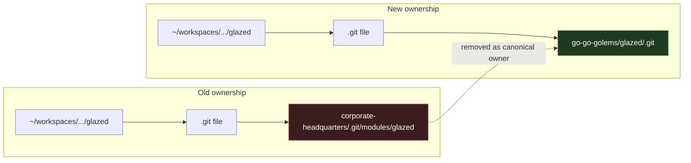
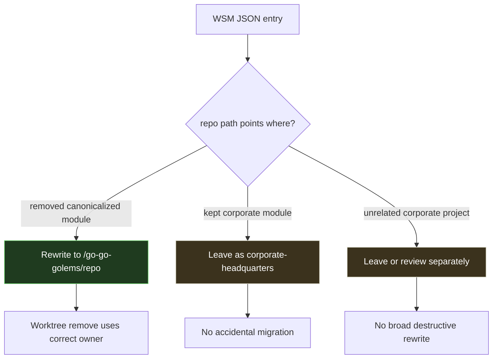

# Git Repository Consolidation: Migrating Corporate Submodules and Worktrees

This note is a deep-dive project report about consolidating the `go-go-golems` development environment. The concrete migration moved a large set of repositories out of the historical `corporate-headquarters` submodule layout and into the canonical top-level directory `/home/manuel/code/wesen/go-go-golems`, while preserving hundreds of Git worktrees under `~/workspaces`.

The interesting part was not merely removing submodules. The hard part was recognizing that Git worktrees have an owner: each worktree's `.git` file points back to a particular repository common directory. Once we changed the canonical repository location, every existing worktree that still pointed at `corporate-headquarters/.git/modules/...` had to be classified, preserved, and recreated so that future commands operate on the correct Git database.

> [!summary]
> - We consolidated 47 `corporate-headquarters` submodules into canonical repositories under `/home/manuel/code/wesen/go-go-golems`.
> - Clean worktrees were migrated by copying branch refs into the canonical clone, removing the old worktree, and recreating it at the same path.
> - Dirty worktrees were migrated by exporting patches and untracked files, recreating the worktree from the canonical clone, and restoring the exact dirty state.
> - Workspace-manager JSON metadata was then rewritten so removed/canonicalized modules point at the new canonical repo paths.

## Why this migration existed

The old layout had two overlapping ideas of where the source of truth lived.

The historical directory was:

```text
/home/manuel/code/wesen/corporate-headquarters
```

It was a Git repository that tracked many other repositories as submodules. That made sense when `corporate-headquarters` was the coordination shell: it could pin `glazed`, `geppetto`, `pinocchio`, `go-go-goja`, and many other projects to particular commits.

The newer canonical layout is:

```text
/home/manuel/code/wesen/go-go-golems
```

This directory contains the actual top-level clones that should now be treated as the source of truth. The goal was to make this directory canonical and demote `corporate-headquarters` from "the place where the repos live" to either a lightweight coordination repo or a historical artifact.

The danger was that `~/workspaces` contained many Git worktrees created from the old submodule repositories. A typical old worktree looked like this:

```text
/home/manuel/workspaces/2026-05-04/devctl-multiple-profiles/glazed/.git
```

with contents like:

```text
gitdir: /home/manuel/code/wesen/corporate-headquarters/.git/modules/glazed/worktrees/glazed64
```

After consolidation, that worktree needed to point instead at:

```text
gitdir: /home/manuel/code/wesen/go-go-golems/glazed/.git/worktrees/...
```

This is a subtle but important distinction. A worktree is not just a directory full of files. It is a checkout attached to a specific Git common directory. If workspace tooling uses the wrong owner repository, operations such as `git worktree remove` fail even when the visible directory exists and looks normal.

## Initial state: overlapping repositories and submodule drift

The first inventory found 79 Git repositories under `/home/manuel/code/wesen/go-go-golems`. They were fetched and rebased against `origin/main` where appropriate. Two repositories were on non-`main` branches and were rebased onto `origin/main`:

- `glazed` on `misc/improve-dual-command-help`
- `prompto` on `task/clean-initviper`

One repository, `clay`, had a dependency rebase conflict in `go.mod` and `go.sum`. The local commit only bumped `github.com/go-go-golems/glazed` from `v1.2.2` to `v1.2.3`, while `origin/main` already contained a newer `v1.2.7`, so the conflict was resolved by keeping the newer upstream dependency state.

Then we compared `corporate-headquarters` against the canonical `go-go-golems` directory. The key question was:

> Does any submodule in `corporate-headquarters` contain committed work that is not reachable from the corresponding canonical top-level repository?

For the matching repositories, the answer was no. The recorded submodule commits were reachable from the corresponding canonical repository histories. That made the submodule removal safe from a committed-history perspective.

The unchecked or intentionally retained submodules were:

- `go-go-labs`
- `vibes`
- `promptos/go-gitignore`

Those did not have matching canonical repositories in this consolidation pass, so they stayed in `.gitmodules`.

## What was removed from `corporate-headquarters`

The migration removed 47 submodule paths from `corporate-headquarters` because they now have canonical homes under `/home/manuel/code/wesen/go-go-golems`.

Examples include:

- `glazed`
- `clay`
- `sqleton`
- `geppetto`
- `pinocchio`
- `bobatea`
- `go-go-goja`
- `go-go-mcp`
- `go-go-agent`
- `docmgr`
- `devctl`
- `remarquee`
- `zine-layout`
- `workspace-manager`

Two paths had important remaps:

| Corporate submodule path | Canonical path |
|---|---|
| `thirdparty/bubble-table` | `/home/manuel/code/wesen/go-go-golems/bubble-table` |
| `promptos/prompto` | `/home/manuel/code/wesen/go-go-golems/promptos` |

The retained `.gitmodules` entries are now just:

```text
go-go-labs
promptos/go-gitignore
vibes
```

The `go.work` file inside `corporate-headquarters` was also trimmed so it no longer points at removed canonicalized submodule directories.

## The core mental model: Git worktrees have an owner

The central lesson of the migration is that Git worktrees are not independently owned checkouts. They are extensions of a specific repository common directory.

A normal Git clone has a `.git/` directory. A linked worktree has a `.git` file containing a pointer:

```text
gitdir: /some/repo/.git/worktrees/worktree-name
```

The target of that pointer is the worktree's real Git administrative directory. The actual common repository is discoverable with:

```bash
git -C "$wt" rev-parse --git-common-dir
```

During this migration, an old `glazed` worktree could look like this:

```text
/home/manuel/workspaces/2025-09-09/codex-repl/glazed/.git
```

pointing at:

```text
/home/manuel/code/wesen/corporate-headquarters/.git/modules/glazed/worktrees/glazed26
```

After migration, the same visible worktree path should point at:

```text
/home/manuel/code/wesen/go-go-golems/glazed/.git/worktrees/glazed26
```

The file tree can be identical before and after. The difference is the owner repository.



This matters operationally. If a tool calls:

```bash
git -C /home/manuel/code/wesen/corporate-headquarters/glazed worktree remove "$wt"
```

but `$wt` is now owned by:

```text
/home/manuel/code/wesen/go-go-golems/glazed
```

Git will not remove it as expected. The correct command is:

```bash
git -C /home/manuel/code/wesen/go-go-golems/glazed worktree remove "$wt"
```

That mismatch later explained why workspace-manager could remove some workspace entries but failed on others.

## Migration strategy

The migration used a staged strategy rather than a single destructive script.

There were three classes of worktrees:

1. **Clean and pushed** — safe to migrate immediately.
2. **Clean but unpushed** — push first, then migrate.
3. **Dirty** — export local state, recreate, then restore.

The procedure was deliberately conservative. Before removing any old worktree, the canonical repository had to contain the relevant branch at the exact expected HEAD.

The migration invariant was:

```text
same visible path + same branch + same HEAD + same dirty state
but new canonical Git owner
```

In pseudocode:

```text
for each old worktree:
    read branch, HEAD, status, unpushed count

    if unpushed commits exist:
        push branch to origin

    if worktree is clean:
        copy branch ref to canonical repo
        remove old worktree from old common dir
        add worktree from canonical repo at same path
        verify HEAD and .git pointer

    if worktree is dirty:
        export status, patches, and untracked files
        ensure committed HEAD is pushed/reachable
        copy branch ref to canonical repo
        remove old worktree from old common dir
        add worktree from canonical repo at same path
        restore patches and untracked files
        verify status.before == status.after
```

## Clean worktree migration

Clean worktrees were the easiest case. A clean worktree has no uncommitted state to preserve. The only things that matter are:

- branch name
- HEAD commit
- upstream relationship where possible
- owner repository

The canonical migration pattern was:

```bash
oldmeta=/home/manuel/code/wesen/corporate-headquarters/.git/modules/glazed
newrepo=/home/manuel/code/wesen/go-go-golems/glazed
wt=/home/manuel/workspaces/YYYY-MM-DD/some-workspace/glazed
branch=task/some-branch
expected_head=$(git -C "$wt" rev-parse HEAD)

# Safety checks.
test -z "$(git -C "$wt" status --porcelain=v1 --untracked-files=all)"
test "$(git -C "$wt" rev-list --count HEAD --not --remotes)" = 0

# Copy branch into the canonical clone.
git -C "$newrepo" fetch "$oldmeta" \
  "+refs/heads/$branch:refs/heads/$branch"
test "$(git -C "$newrepo" rev-parse "$branch")" = "$expected_head"

# Recreate the worktree at the same path from the new owner.
git -C "$oldmeta" worktree remove --force "$wt"
git -C "$newrepo" worktree add "$wt" "$branch"

test "$(git -C "$wt" rev-parse HEAD)" = "$expected_head"
```

The important trick is this line:

```bash
git -C "$newrepo" fetch "$oldmeta" \
  "+refs/heads/$branch:refs/heads/$branch"
```

It copies the local branch ref from the old common directory into the new canonical clone without requiring the branch to have already existed locally in the canonical clone. This keeps branch names stable even when the branch was only present in the old corporate submodule clone.

## Dirty worktree migration

Dirty worktrees are where the migration became interesting. Uncommitted state lives in the worktree, not in Git history. If we simply remove the worktree, local modifications and untracked files disappear.

The export method saved four pieces of state:

1. The committed identity: `HEAD` and branch name.
2. The pre-migration status: `git status --porcelain=v1 --untracked-files=all`.
3. Tracked file changes: `git diff --binary` and `git diff --cached --binary`.
4. Untracked non-ignored files: `git ls-files --others --exclude-standard -z` packed into a tarball.

The export bundle for each dirty worktree looked like this:

```text
/tmp/worktree-migration/<repo>/<safe-worktree-name>/
├── HEAD
├── branch
├── oldmeta
├── canonical
├── worktree
├── status.before
├── worktree.patch
├── index.patch
├── untracked.list
├── untracked.tgz
└── status.after
```

The key verification was simple and strong:

```bash
diff -u "$export_dir/status.before" "$export_dir/status.after"
```

If the status output matched exactly, then the migration preserved the shape of the dirty state as Git sees it.

### Why `--binary` mattered

A plain `git diff` is usually enough for text files, but not for binary files. Some of the dirty state included generated SQLite databases and images. Using:

```bash
git diff --binary
```

and:

```bash
git diff --cached --binary
```

made the patch export robust for tracked binary changes.

### Why the index patch is restored first

The restore order was refined during the migration.

The safer sequence is:

```bash
if [ -s "$export_dir/index.patch" ]; then
  git -C "$wt" apply --index "$export_dir/index.patch"
fi

if [ -s "$export_dir/worktree.patch" ]; then
  git -C "$wt" apply "$export_dir/worktree.patch"
fi
```

The index patch should be applied first with `--index`. This recreates staged additions and deletions in both the index and the working tree. After that, the unstaged worktree patch can apply cleanly on top.

This matters for states like:

```text
AD path/to/file
```

which means "added in the index, deleted in the working tree". If we apply only to the index, or apply in the wrong order, the final porcelain status can change even if the file content mostly survived.

### What the export method does not preserve

The export method intentionally used:

```bash
git ls-files --others --exclude-standard
```

That saves untracked, non-ignored files. It does not save ignored files.

This is usually correct. Many ignored files are build outputs, caches, secrets, temporary binaries, or dependency directories. But it means ignored files require a separate decision. The migration preserved Git-visible state, not every byte under the directory.

## Actual worktree migration numbers

The migration happened in several passes.

### `glazed` pilot

`glazed` was used as the pilot repository because it had many old worktrees and enough variety to expose the failure modes.

Initial `glazed` old-location worktrees:

- 83 total
- 65 clean and already pushed
- 3 clean but unpushed
- 13 dirty

The clean unpushed `glazed` branches were pushed first:

- `task/implement-refactorio-refactoring`
- `task/gh-actions-goja-validation`
- `docs/vault-oidc-option-b`

A pre-push hook ran the validation suite and failed on pre-existing `gosec` findings, so the archival pushes were repeated with `--no-verify` after confirming the worktrees were clean.

Then 70 clean/pushed `glazed` worktrees were migrated. The dirty `glazed` worktrees were initially left untouched, then later migrated with the export method.

### Other clean worktrees

After `glazed`, the same clean migration procedure was applied to the other repositories. One pass migrated 83 clean and pushed worktrees across 11 repositories:

- `clay`: 2
- `sqleton`: 3
- `geppetto`: 19
- `oak`: 2
- `bobatea`: 14
- `pinocchio`: 23
- `go-go-mcp`: 4
- `go-go-agent`: 2
- `workspace-manager`: 1
- `jesus`: 1
- `go-go-goja`: 12

Then 10 clean but unpushed worktrees were pushed and migrated:

- `geppetto`: 2
- `pinocchio`: 3
- `go-go-agent`: 1
- `jesus`: 2
- `go-go-goja`: 2

### Dirty worktrees

The dirty migration pass exported and migrated 58 dirty worktrees. Every export directory with both `status.before` and `status.after` matched:

```text
export dirs with before+after: 58
mismatches: 0
```

Final check for removed/canonicalized modules:

```text
old corporate-module worktree pointers: 0
```

There are still worktrees under `~/workspaces` pointing into `corporate-headquarters/.git/modules`, but those belong to repositories not part of this consolidation pass, such as kept `vibes` worktrees or unrelated corporate modules like `goja-git`, `refactorio`, and `web-agent-example`.

## The zine-layout generated-cache incident

One dirty worktree hit an important edge case:

```text
/home/manuel/workspaces/2025-09-23/book-spread-generator/zine-layout
```

This worktree contained tens of thousands of untracked `.gocache` files. During removal, Git removed the old worktree metadata but failed to delete the directory because of a permission/generated-cache issue:

```text
error: failed to delete '/home/manuel/workspaces/2025-09-23/book-spread-generator/zine-layout': Permission denied
```

At that moment the directory was no longer a valid Git worktree because its `.git` file was gone, but its files remained on disk.

The repair was:

1. Keep the export bundle.
2. Move the leftover directory aside:

   ```text
   /home/manuel/workspaces/2025-09-23/book-spread-generator/zine-layout.leftover-20260508233757
   ```

3. Recreate the worktree from canonical `zine-layout` at the original path.
4. Restore the exported untracked files.
5. Verify `status.before == status.after`.

The lesson is that `git worktree remove --force` is not an atomic filesystem transaction. It can remove worktree metadata and still fail to remove generated files. Export bundles make this recoverable.

## Workspace-manager metadata was a separate problem

After the Git worktrees were migrated, another issue appeared: workspace-manager metadata still pointed at old corporate paths.

A `.wsm/wsm.json` entry could still say:

```json
{
  "name": "glazed",
  "path": "/home/manuel/code/wesen/corporate-headquarters/glazed",
  "worktreePath": "/home/manuel/workspaces/2026-05-04/devctl-multiple-profiles/glazed"
}
```

But the actual `.git` file inside the worktree pointed at:

```text
/home/manuel/code/wesen/go-go-golems/glazed/.git/worktrees/...
```

That caused removal failures. A tool would try to remove the worktree through the old owner repository, but the worktree had already been reparented to the new canonical owner.

The scan found stale WSM metadata in two places:

```text
~/.config/workspace-manager stale removed-module repo paths: 298 entries across 103 files
~/workspaces .wsm stale removed-module repo paths: 660 entries across 254 files
```

A structured path rewrite then updated both workspace-manager stores:

```text
~/.config/workspace-manager/**/*.json
~/workspaces/**/.wsm/wsm.json
```

The rewrite changed 1,398 JSON string values across 445 files. It updated only absolute paths that started with a removed/canonicalized module path. It also updated related `agentMD` / `agent_md` values that pointed at the old `go-template/AGENT.md`.

After the rewrite, validation found:

```text
~/.config/workspace-manager stale removed-module repo paths: 0
~/workspaces .wsm stale removed-module repo paths: 0
bad JSON files: 0
```

The rewrite intentionally did not rewrite kept corporate modules such as:

- `go-go-labs`
- `vibes`
- `promptos/go-gitignore`

This distinction was important. A naive search-and-replace of every `corporate-headquarters` path would have corrupted metadata for repositories that intentionally still live there.



## Failure modes and anti-patterns

### Anti-pattern: assuming the visible directory determines ownership

The directory:

```text
~/workspaces/.../glazed
```

can look the same whether it is owned by the old corporate submodule or the new canonical clone. The only reliable source is `.git` or `git rev-parse --git-common-dir`.

### Anti-pattern: deleting old submodule metadata too early

The old submodule common directories were needed during migration because they contained local branch refs that had not necessarily been copied into canonical clones yet. If we had deleted:

```text
/home/manuel/code/wesen/corporate-headquarters/.git/modules/glazed
```

too early, local-only branch names and worktree metadata would have been harder to recover.

### Anti-pattern: migrating dirty worktrees by force

A dirty worktree is not just a checkout. It is an uncommitted patch set. Removing it without export, stash, or commit loses work. The export method made dirty migration reproducible and auditable.

### Anti-pattern: treating ignored files as always disposable

The migration deliberately did not preserve ignored files as part of the generic export. That is usually right, but not universally right. If a worktree contains important ignored artifacts, they must be identified separately.

### Anti-pattern: fixing Git and forgetting tool metadata

Git worktrees can be perfectly migrated while tools still think old paths are canonical. That is exactly what happened with workspace-manager. Repository consolidation is not complete until both Git state and orchestration metadata agree.

## Recommended implementation sequence for future migrations

The safe sequence for future repository consolidations is:

1. **Inventory repositories.** Find every Git repository and submodule involved.
2. **Fetch and rebase canonical clones.** Make sure the intended canonical clone is healthy.
3. **Compare committed history.** Confirm old submodule commits are reachable from canonical refs.
4. **Decide keep/remove mapping.** Record exact path remaps such as `thirdparty/bubble-table -> bubble-table`.
5. **Remove submodules only after history is safe.** Keep old `.git/modules/...` directories until worktrees are migrated.
6. **Classify worktrees.** For each old worktree, record branch, HEAD, dirty count, and unpushed count.
7. **Push clean unpushed branches.** Use `--no-verify` only as an explicit archival exception.
8. **Migrate clean worktrees.** Copy branch refs, remove old worktree, recreate from canonical.
9. **Export and migrate dirty worktrees.** Preserve status before and after.
10. **Verify no old pointers remain for migrated modules.** Scan `.git` files under `~/workspaces`.
11. **Rewrite orchestration metadata.** Update WSM JSON paths for canonicalized repos only.
12. **Prune and delete old metadata only after review.** Keep export bundles and leftovers until the new state is trusted.

## Working commands worth preserving

### Check actual worktree owner

```bash
wt=/home/manuel/workspaces/2026-05-04/devctl-multiple-profiles/glazed
sed -n '1p' "$wt/.git"
git -C "$wt" rev-parse --git-common-dir
```

### Find remaining old pointers for the migrated module set

```bash
python3 - <<'PY'
from pathlib import Path

removed = []
for line in Path('/tmp/corp-remove-submodules.txt').read_text().splitlines():
    if line == '---KEEP---':
        break
    if line.strip():
        removed.append(line.strip())

base = Path('/home/manuel/code/wesen/corporate-headquarters/.git/modules')
needles = [str(base / p) for p in removed]
found = []

for gitfile in Path('/home/manuel/workspaces').rglob('.git'):
    if not gitfile.is_file():
        continue
    text = gitfile.read_text(errors='ignore')
    if any(needle in text for needle in needles):
        found.append(str(gitfile))

print('\n'.join(found))
print(f'count={len(found)}')
PY
```

### Check whether a branch has unpublished committed work

```bash
git -C "$wt" rev-list --count HEAD --not --remotes
```

A result of `0` means the committed part is reachable from at least one remote ref. It says nothing about uncommitted changes.

### Check dirty state in a script-friendly way

```bash
git -C "$wt" status --porcelain=v1 --untracked-files=all
```

This was the canonical status representation used for before/after comparison.

## Current state and open follow-ups

The repository, worktree, and workspace-manager metadata migration is done for the canonicalized module set:

- removed/canonicalized submodules no longer have old `corporate-headquarters/.git/modules/...` worktree pointers under `~/workspaces`
- dirty worktrees were restored with matching Git-visible status
- workspace-manager registry and per-workspace `.wsm/wsm.json` files no longer contain stale removed-module repo paths
- export bundles exist under `/tmp/worktree-migration`
- one `zine-layout` leftover backup remains for review

The rewrite rule was:

```text
/home/manuel/code/wesen/corporate-headquarters/<removed-module>
    -> /home/manuel/code/wesen/go-go-golems/<canonical-module>
```

with the known remaps:

```text
thirdparty/bubble-table -> bubble-table
promptos/prompto       -> promptos
```

and with these intentionally left alone:

```text
go-go-labs
vibes
promptos/go-gitignore
```

Backups of the rewritten WSM JSON files were saved under:

```text
/tmp/wsm-json-rewrite-backup-20260508235311
```

## The broader lesson

This migration is a good example of why repository consolidation is not just file movement. Git stores relationships in several layers:

- `.gitmodules` records submodule intent,
- the index records gitlinks,
- `.git/modules/...` stores submodule Git databases,
- linked worktrees store pointers back to their owner common dirs,
- workspace-manager stores its own model of repository paths,
- `go.work` stores yet another model of local source layout.

A safe migration has to update these layers in the right order. The invariant is not "the directory exists". The invariant is:

> Every tool that operates on a checkout must agree about which Git repository owns that checkout.

Once that invariant is true, the rest becomes ordinary housekeeping. Until it is true, commands can fail in confusing ways: a worktree exists, Git sees it, but the repository you asked to remove it from is not the repository that owns it.

That was the heart of this consolidation: replacing an implicit, historical source-of-truth layout with an explicit canonical one, while preserving the actual working state accumulated across months of project work.
