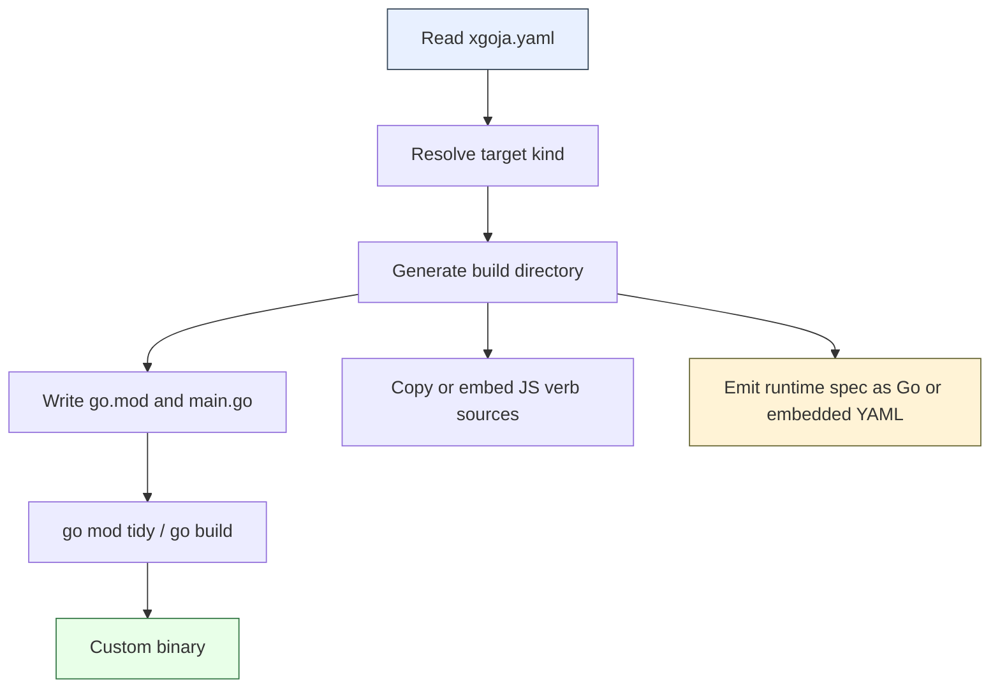
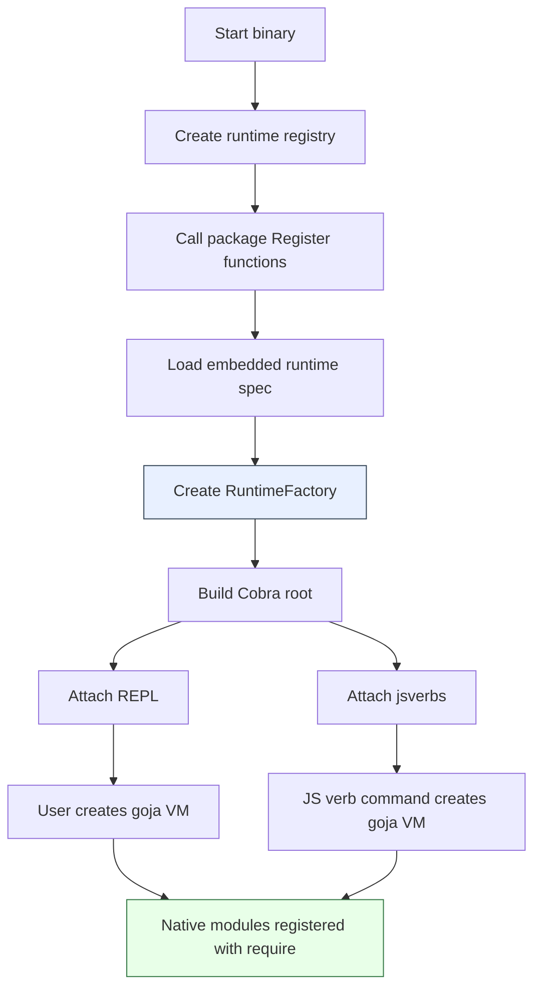

# Go Plugin Strategies and xgoja Compile-Time Module Composition

Go programs are easy to distribute as single binaries, but that strength complicates plugin systems. A plugin system asks a running program to accept new behavior after the main program has been built. Go's build model is optimized for whole-program compilation, static dependency resolution, and a single module graph at build time. Those properties make Go binaries predictable, but they make binary extension hard when the extension must run in process.

This note is a deep technical report on the main techniques for dealing with plugins in Go. It then develops the `xgoja` design: an `xcaddy`-style builder that composes Go packages, goja native modules, JS verb sources, REPL support, and Cobra command integration into a generated binary. The central claim is direct: for in-process Go extensions, the reliable boundary is not "load this new binary module into the old process". The reliable boundary is "generate a new Go program that imports the requested modules and build it once."

> [!summary]
> - Native Go plugins are real, but they are strict about build compatibility and are poor as a general-purpose user extension mechanism.
> - `debug/buildinfo` can inspect an installed Go binary, but it cannot reconstruct the exact source and build universe required for safe native plugin compatibility.
> - Out-of-process plugins, Wasm plugins, embedded scripting, and static composition each solve a different version of the plugin problem.
> - `xgoja` should use compile-time module composition: YAML selects packages, modules, module configs, JS verb sources, and target integration mode; generated Go code then builds a custom binary.

## Why this note exists

The motivating system has three concrete pieces.

First, there is a Go-hosted JavaScript runtime based on `goja`. It can expose native Go functionality as JavaScript modules. A package such as `github.com/go-go-golems/web-stuff` may expose several modules: `fetch`, `websocket`, `express`, and related pieces. The package is not itself a single module. It is a container of module providers.

Second, there is a `jsverbs` library. A JS verb is a JavaScript file that describes a CLI verb. The Go host loads the JS file, interprets its metadata, and mounts it as a Cobra command. This makes JavaScript files part of the command surface of a Go binary.

Third, there are existing standalone binaries, called STDBINs in this report. A STDBIN may already know how to create a goja runtime. It may already have native modules, a REPL, jsverbs, and a Cobra root command. The design problem is to add more goja modules and command behavior without giving up the single-process execution model.

This problem is not merely about loading code. It is about choosing the correct boundary between build time and run time. Once the requirement says "in process", the most robust solution is to make plugin composition part of the Go build, while leaving JS files and configuration as runtime inputs where possible.

## The extension problem in Go

A Go plugin system has to answer five questions.

| Question | Why it matters |
|---|---|
| When is extension code selected? | The answer determines whether the system needs runtime loading, compile-time composition, or both. |
| Where does extension code execute? | In-process execution gives direct Go calls but shares memory, panics, and dependency identity with the host. |
| Who owns the dependency graph? | Native in-process code must agree with the host about shared packages. |
| What is the user-facing install operation? | "Install a plugin" can mean copy a `.so`, build a new binary, add a JS file, or install a subprocess executable. |
| What is the compatibility contract? | A stable source-level API is easier to maintain than a stable Go binary ABI boundary. |

The key distinction is between **behavioral extension** and **binary extension**. A JS verb is behavioral extension: it changes what commands are available and how they run, but it does not add new Go machine code. A Go native module is binary extension: it adds compiled Go code that the VM can call. These two kinds of extension should not be managed with the same mechanism.

A good design lets JS verbs stay dynamic and lets Go native modules be static. That gives users a flexible command layer while preserving a predictable compiled runtime layer.

## Technique 1: Native Go plugins

Go has an official `plugin` package. A plugin is a Go `main` package built with `go build -buildmode=plugin`. The host opens the resulting shared object, looks up exported symbols, and calls them. When the plugin is first opened, the `init` functions of packages not already present in the program run; the plugin's `main` function does not run; the plugin is initialized once and cannot be closed.[^go-plugin-doc]

A minimal native plugin looks like this:

```go
// plugin/main.go
package main

import "github.com/example/host/pluginapi"

var Plugin pluginapi.Plugin = pluginapi.Plugin{
	Name: "websocket",
	Register: func(reg *pluginapi.Registry) error {
		return reg.Add("websocket", NewWebSocketModule)
	},
}
```

The host loads it like this:

```go
p, err := plugin.Open("websocket.so")
if err != nil {
	return err
}

sym, err := p.Lookup("Plugin")
if err != nil {
	return err
}

plug, ok := sym.(*pluginapi.Plugin)
if !ok {
	return fmt.Errorf("unexpected plugin symbol type")
}

return plug.Register(registry)
```

This can work in a controlled environment. It is appropriate when the host and plugins are built in the same repository, by the same build system, with the same Go toolchain, the same dependency source, the same build tags, and the same environment. That condition is stronger than many plugin users expect.

The failure mode is package identity. If the host and the plugin both depend on `github.com/example/pluginapi`, they must agree on the exact package build. If they disagree, the plugin may fail to open with an error indicating that it was built with a different version of a package. Even when module versions look identical, local replacements, generated files, build tags, CGO headers, or uncommitted changes can still make the actual compiled package differ.

For `xgoja`, native Go plugins are a poor default. The desired plugin packages are not isolated leaf functions. They expose goja modules, call shared runtime APIs, interact with `require`, participate in Cobra command creation, and may share host services. That means they would share exactly the kinds of packages that make native plugin compatibility fragile.

Native Go plugins are best treated as an expert-only deployment mode, not the main composition strategy.

## Technique 2: Build metadata inspection

An installed Go binary can be inspected. The `debug/buildinfo` package can read embedded build information from a Go binary. That build information includes the Go toolchain version and the module set for binaries built in module mode; `ReadFile` reads this information from a named binary file.[^go-buildinfo-doc]

The command-line form is:

```bash
go version -m /usr/local/bin/stdbin
```

The programmatic form is:

```go
info, err := buildinfo.ReadFile("/usr/local/bin/stdbin")
if err != nil {
	return err
}
fmt.Println(info.GoVersion)
fmt.Println(info.Main.Path, info.Main.Version)
for _, dep := range info.Deps {
	fmt.Println(dep.Path, dep.Version, dep.Sum)
}
```

This information is useful for diagnostics. It can tell `xgoja doctor` that a STDBIN was built with `go1.24.3`, that its main module was `github.com/acme/stdbin`, and that it depended on particular module versions. It can help explain why a native plugin build is unlikely to match.

It is not enough to safely build a compatible native plugin for an arbitrary installed binary.

The missing information is exactly the information that matters to package identity:

- The exact source tree used for replaced modules may not be reconstructable from the installed binary.
- The binary may have been built from a dirty checkout with uncommitted changes.
- Local generated files may have changed after the binary was built.
- Private module source may be unavailable.
- Build tags and tool flags may not be sufficient to reconstruct all selected files.
- CGO builds may depend on local system headers, compiler versions, and library contents.
- A workspace or local replacement may have changed the module graph in ways that are not usable from a third-party plugin build.

Build metadata is evidence, not a build recipe. It should be surfaced by tooling, but it should not become the foundation of the plugin architecture.

## Technique 3: Out-of-process plugins

Out-of-process plugins are normal executables. The host launches them and communicates over RPC, gRPC, stdio, sockets, or another protocol. This avoids the Go plugin ABI problem because the plugin is no longer loaded into the host's address space. Each process owns its own Go runtime and dependency graph.

The advantages are clear:

- The plugin can be built with a different Go version.
- A plugin panic does not directly panic the host process.
- Dependencies do not need to be package-identical with the host.
- Plugins can be written in languages other than Go if they implement the protocol.
- The host can restart or kill a plugin process.

The cost is also clear. Calls cross a process boundary. Values must be serialized. The plugin cannot directly hold Go pointers into the host. The API must become an explicit protocol.

For many production systems, this is the most robust general plugin model. For this system, it conflicts with the requirement that goja native modules run in process. A `fetch` or `websocket` module could call an out-of-process helper, but then the Go native module is no longer the plugin. It is a compiled adapter that speaks to a plugin process.

Out-of-process plugins remain useful as a secondary mechanism. A goja module could expose an RPC client to JavaScript. The native module would be part of the statically built `xgoja` binary; the heavy or unstable work could run elsewhere.

## Technique 4: C ABI shared libraries

Go can produce shared libraries for C consumers using other build modes, and C programs commonly load shared libraries as plugins. This is a different model from Go's native `plugin` package. It exposes a C ABI surface, not a Go package identity surface.

A C ABI boundary can be stable if the API is deliberately simple: integers, byte buffers, opaque handles, explicit allocation rules, and error codes. It becomes unsuitable when the desired interface is rich Go values, `goja.Value`, `*goja.Runtime`, `*cobra.Command`, or host services represented as Go interfaces.

For `xgoja`, a C ABI plugin would force the system to wrap Go runtime objects behind handles. The design would lose the main benefit of in-process Go modules: direct access to Go types. It would also introduce memory ownership rules and CGO complexity. This is usually a worse version of both native Go plugins and out-of-process plugins.

## Technique 5: Wasm modules

Wasm plugins place extension code into a sandboxed runtime. In Go hosts, a runtime such as `wazero` can execute Wasm modules in process while preserving a boundary between host and guest. The host exposes imports; the guest calls those imports. The guest can be compiled from TinyGo, Go WASI targets, Rust, C, or other languages depending on the toolchain.

Wasm changes the problem from Go package identity to host ABI design. That is a useful trade. The extension boundary becomes explicit. The host defines functions such as `http.fetch`, `fs.readFile`, or `log.info`, and the guest calls them with serialized values or linear-memory pointers.

For `xgoja`, Wasm is useful when plugin code should be sandboxed, portable, or language-neutral. It is less useful when the extension must register rich goja-native modules that manipulate `*goja.Runtime` directly. A Wasm module can expose functions to JavaScript through a Go wrapper, but the wrapper still needs to exist in the host binary.

The stable design is therefore layered:

```text
JavaScript code
    calls
Go goja native module
    optionally calls
Wasm guest module
```

Wasm can extend the behavior behind a native goja module. It should not be the only mechanism for registering new Go-backed module types into the VM.

## Technique 6: Embedded scripting

Embedded scripting solves a different part of the problem. If the extension is JavaScript, Lua, Starlark, or another embedded language, the host binary does not need new Go machine code. It only needs a runtime and a capability surface.

This is the natural layer for `jsverbs`. A JS verb can be added, edited, or removed without rebuilding the Go binary as long as it only uses modules already available in the runtime.

That gives a useful split:

| Layer | Changes without rebuild? | Adds new Go code? | Recommended mechanism |
|---|---:|---:|---|
| JS verb files | Yes | No | Load from filesystem or embedded FS |
| JS module configuration | Usually yes | No | YAML runtime spec |
| Go-backed native modules | No | Yes | Compile-time composition |
| External service behavior | Yes | No, if accessed through existing module | RPC, HTTP, subprocess, Wasm behind wrapper |

This split is central to `xgoja`. It lets operators change command behavior frequently while keeping the host's native capability set explicit and reproducible.

## Technique 7: xcaddy-style custom binary generation

The `xcaddy` pattern treats plugin selection as a build-time operation. The user does not load a compiled plugin into an existing Caddy binary. The user asks `xcaddy` to build a new Caddy binary with selected modules. Caddy's own build documentation describes `xcaddy` as the easiest way to build Caddy with version information and plugins, using `--with` to select plugin modules and `@` syntax to pin versions.[^caddy-xcaddy-doc]

The important detail is that this is still a normal Go build. The generated program imports the selected modules, the Go command resolves one module graph, and the result is a single executable. The plugin operation is reframed from runtime binary loading to source-level composition.

For `xgoja`, the same pattern is the right foundation. Instead of asking users to copy `.so` files next to a STDBIN, `xgoja` should read a YAML file, generate a Go program, import the selected module provider packages, configure runtime profiles, mount REPL and jsverbs commands, and build a new binary.

The user-facing command should look like this:

```bash
xgoja build -f xgoja.yaml
```

The YAML is the product interface. The generated Go code is an implementation detail. The built binary is the installed artifact.

## The xgoja design

`xgoja` should be a custom binary builder for goja-powered CLIs. Its job is not to be a dynamic loader. Its job is to create a complete source-level composition from a declarative build spec.

A package such as `github.com/go-go-golems/web-stuff/xgoja` should expose a registration function. That function should describe the modules and JS verb sources that the package provides.

```go
package xgoja

import "github.com/go-go-golems/xgoja/pkg/runtime"

func Register(reg *runtime.Registry) error {
	reg.Package("web",
		runtime.Module{
			Name:        "fetch",
			DefaultAs:   "fetch",
			Description: "Fetch API bindings for goja",
			New:         NewFetchModule,
		},
		runtime.Module{
			Name:        "websocket",
			DefaultAs:   "websocket",
			Description: "WebSocket client and server bindings",
			New:         NewWebSocketModule,
		},
		runtime.Module{
			Name:        "express",
			DefaultAs:   "express",
			Description: "Express-style HTTP routing for goja",
			New:         NewExpressModule,
		},
	)

	return nil
}
```

This explicit registration function is preferable to relying only on `init`. `init` is simple when all modules are always enabled. It becomes a poor fit when the YAML needs to select individual modules, rename them, configure them, and mount different sets into different runtime profiles.

The resulting architecture has four phases.



The generated binary then has its own runtime flow.



The system composes at build time but instantiates at run time. That distinction matters. Build time decides which Go packages are available. Run time decides which runtime profile is used, which JS verb is loaded, and which command is executed.

## The YAML shape

The YAML should separate **packages**, **runtime profiles**, **commands**, and **JS verb sources**. Do not make package declarations also mean module activation. A package is a source of possible modules. A runtime profile chooses actual module instances.

```yaml
name: webrepl

go:
  version: "1.24"
  module: example.com/generated/webrepl
  tags: []
  ldflags: []

target:
  kind: xgoja
  output: ./dist/webrepl

packages:
  - id: web
    import: github.com/go-go-golems/web-stuff/xgoja
    version: v0.3.0

  - id: sqlite
    import: github.com/go-go-golems/sqlite-stuff/xgoja
    version: v0.2.1

runtimes:
  main:
    modules:
      - package: web
        name: fetch

      - package: web
        name: websocket
        as: ws
        config:
          maxMessageSize: 1048576
          compression: true

      - package: web
        name: express
        config:
          listen: false

      - package: sqlite
        name: sqlite
        config:
          allowedPaths:
            - ./data

commands:
  repl:
    enabled: true
    runtime: main
    name: repl

  jsverbs:
    enabled: true
    runtime: main
    name: run
    mount: /

jsverbs:
  - id: local
    path: ./verbs
    embed: true
```

This shape allows the same package set to support multiple runtime profiles. A REPL profile can be broad. A jsverbs profile can be narrow.

```yaml
runtimes:
  repl:
    modules:
      - package: web
        name: fetch
      - package: web
        name: websocket
      - package: web
        name: express
      - package: sqlite
        name: sqlite

  jsverbs:
    modules:
      - package: web
        name: fetch
      - package: sqlite
        name: sqlite
        config:
          allowedPaths:
            - ./data

commands:
  repl:
    enabled: true
    runtime: repl

  jsverbs:
    enabled: true
    runtime: jsverbs
```

This is a capability boundary. The REPL may be intended for an operator. JS verbs may be distributed to users. The module set should be independently configurable.

## Module registration and goja require

The goja Node.js compatibility layer provides a `require` system. Its `RegisterNativeModule` mechanism registers a module that is loaded through a provided Go module loader rather than through a JavaScript source loader. Native modules take precedence over source-loaded modules with the same resolved name.[^goja-require-doc]

`xgoja` should build on a registry-specific module registration path rather than global registration where possible. A runtime factory should create a goja VM, enable `require`, then register native module loaders according to the selected runtime profile.

```go
type ModuleFactory func(ctx ModuleContext) (goja.Value, error)

type ModuleContext struct {
	VM     *goja.Runtime
	Name   string
	As     string
	Config json.RawMessage
	Host   HostServices
	Logger *slog.Logger
}

type Module struct {
	Name        string
	DefaultAs   string
	Description string
	New         ModuleFactory
}
```

The runtime factory translates a declarative module instance into a goja `require` binding.

```go
func (f *Factory) NewRuntime(ctx context.Context, profile string) (*goja.Runtime, error) {
	vm := goja.New()

	reqRegistry := require.NewRegistry()
	reqRegistry.Enable(vm)

	spec, err := f.spec.Runtime(profile)
	if err != nil {
		return nil, err
	}

	for _, instance := range spec.Modules {
		module, err := f.registry.Resolve(instance.Package, instance.Name)
		if err != nil {
			return nil, err
		}

		instance := instance
		module := module

		reqRegistry.RegisterNativeModule(instance.AsName(), func(vm *goja.Runtime, m *require.Module) {
			value, err := module.New(ModuleContext{
				VM:     vm,
				Name:   instance.Name,
				As:     instance.AsName(),
				Config: instance.Config,
				Host:   f.host,
				Logger: f.logger,
			})
			if err != nil {
				panic(vm.NewGoError(err))
			}
			m.Exports = value
		})
	}

	return vm, nil
}
```

The JavaScript side stays ordinary:

```js
const fetch = require("fetch")
const ws = require("ws")
const express = require("express")
```

This design keeps module selection outside the module package. The package provides capabilities. The YAML selects instances. The runtime factory materializes those instances for a VM.

## The generated Go program

For a pure `xgoja` target, the generated program can be small.

```go
package main

import (
	"context"
	"log"

	"github.com/go-go-golems/xgoja/pkg/app"
	"github.com/go-go-golems/xgoja/pkg/runtime"

	web "github.com/go-go-golems/web-stuff/xgoja"
	sqlite "github.com/go-go-golems/sqlite-stuff/xgoja"
)

func main() {
	ctx := context.Background()

	reg := runtime.NewRegistry()
	must(web.Register(reg))
	must(sqlite.Register(reg))

	spec := embeddedRuntimeSpec()
	factory, err := runtime.NewFactory(reg, spec)
	if err != nil {
		log.Fatal(err)
	}

	root, err := app.NewRootCommand(app.Options{
		RuntimeFactory: factory,
		EnableRepl:    true,
		EnableJSVerbs: true,
		JSVerbSources: embeddedJSVerbSources(),
	})
	if err != nil {
		log.Fatal(err)
	}

	if err := root.ExecuteContext(ctx); err != nil {
		log.Fatal(err)
	}
}

func must(err error) {
	if err != nil {
		log.Fatal(err)
	}
}
```

The generated `go.mod` is also simple. Local development must support replacements because module providers will often be developed alongside the host.

```go.mod
module example.com/generated/webrepl

go 1.24

require (
	github.com/go-go-golems/xgoja v0.1.0
	github.com/go-go-golems/web-stuff v0.3.0
	github.com/go-go-golems/sqlite-stuff v0.2.1
)

replace github.com/go-go-golems/web-stuff => ../web-stuff
```

Go's module system supports `replace` directives in the main module and workspaces; a replacement changes the module graph by substituting module contents from another module path or local filesystem path.[^go-mod-replace-doc] That makes `replace` a first-class development feature for `xgoja`, not a workaround.

The corresponding YAML should support it directly:

```yaml
packages:
  - id: web
    import: github.com/go-go-golems/web-stuff/xgoja
    version: v0.3.0
    replace: ../web-stuff
```

## Target modes

`xgoja` needs three target modes because not every binary starts from the same place.

### Target mode 1: pure xgoja binary

This mode builds a new command from the `xgoja` app package. It is the simplest target and the best default for experiments.

```yaml
target:
  kind: xgoja
  output: ./dist/webrepl
```

The generated binary owns the root command, the REPL command, the jsverbs command, and the runtime factory. It does not need to coordinate with an existing application's internal state.

### Target mode 2: STDBIN adapter

This mode rebuilds an existing STDBIN from an importable adapter package. It does not modify an already-compiled binary. It imports a source-level adapter that knows how to create the STDBIN root command and accept `xgoja` host services.

```yaml
target:
  kind: adapter
  import: github.com/acme/stdbin/xgojaadapter
  version: v0.9.0
  output: ./dist/stdbin-web
```

The adapter contract should be explicit.

```go
package xgojaadapter

import (
	"context"

	"github.com/go-go-golems/xgoja/pkg/host"
	"github.com/spf13/cobra"
)

func Build(ctx context.Context, h *host.Host) (*cobra.Command, error) {
	root := NewOriginalRootCommand()

	SetRuntimeFactory(root, h.RuntimeFactory("main"))
	h.AttachRepl(root)
	h.AttachJSVerbs(root)

	return root, nil
}
```

This is the correct way to "add modules to an existing STDBIN" while preserving in-process execution. The STDBIN must expose source-level hooks. If the installed binary is only an executable with no importable adapter, it cannot be extended in process by `xgoja` in a reliable way.

### Target mode 3: attach to a simple Cobra root

This mode handles an application that exports a Cobra root command constructor but does not have a full `xgoja` adapter.

```yaml
target:
  kind: cobra
  import: github.com/acme/mytool/cmd
  version: v1.4.0
  root: NewRootCommand
  output: ./dist/mytool-js
```

The generated program creates the original root command and attaches REPL and jsverbs subcommands. Cobra is designed around command trees; the package provides command structures for modern CLI applications and a controller for organizing application code.[^cobra-doc]

```go
root := target.NewRootCommand()

cobrax.AttachRepl(root, factory, cobrax.ReplOptions{
	CommandName: "repl",
})

cobrax.AttachJSVerbs(root, factory, cobrax.JSVerbOptions{
	CommandName: "js",
	Sources:     embeddedJSVerbSources(),
})

return root.Execute()
```

This mode is less integrated than the adapter mode. It can attach commands, but it may not be able to influence the target's internal runtime unless the target exposes that hook.

## JS verbs as command definitions

A JS verb should describe a command in data and provide a run function. The Go layer should translate that description into a Cobra command.

```js
const fetch = require("fetch")

export default {
  name: "get-json",
  short: "Fetch JSON from a URL",

  args: [
    {
      name: "url",
      required: true
    }
  ],

  async run(ctx) {
    const res = await fetch(ctx.args.url)
    const json = await res.json()
    console.log(JSON.stringify(json, null, 2))
  }
}
```

The Go mounting path should create a fresh runtime per command invocation unless the verb explicitly asks for a persistent session. Fresh runtimes reduce cross-command state leakage. Persistent runtimes are useful for REPLs and long-running commands, but they should be selected deliberately.

```go
func AttachJSVerbs(root *cobra.Command, factory runtime.Factory, opts JSVerbOptions) error {
	cmd := &cobra.Command{Use: opts.CommandName}

	for _, verb := range opts.Loader.LoadAll() {
		verb := verb

		cmd.AddCommand(&cobra.Command{
			Use:   verb.Name,
			Short: verb.Short,
			RunE: func(cmd *cobra.Command, args []string) error {
				vm, err := factory.NewRuntime(cmd.Context(), opts.RuntimeProfile)
				if err != nil {
					return err
				}

				return verb.Run(cmd.Context(), vm, args)
			},
		})
	}

	root.AddCommand(cmd)
	return nil
}
```

JS verbs can be embedded or loaded from disk. Embedded verbs are stable and travel with the binary. Disk-loaded verbs are editable without rebuilding.

```yaml
jsverbs:
  - id: bundled
    path: ./verbs
    embed: true

  - id: user
    path: ~/.config/mytool/verbs
    embed: false
```

This gives a useful operational split. Native modules are fixed by the binary. Verb behavior can remain editable.

## Package-provided JS verbs

A module provider package may also ship default JS verbs. For example, `web-stuff` could provide a `serve` verb or a `ws-client` verb. The package can embed these files and register them as named verb sources.

```go
package xgoja

import (
	"embed"

	"github.com/go-go-golems/xgoja/pkg/jsverbs"
	"github.com/go-go-golems/xgoja/pkg/runtime"
)

//go:embed verbs/**
var verbsFS embed.FS

func Register(reg *runtime.Registry) error {
	reg.Package("web", /* modules omitted */)
	reg.VerbSource("web", "default-verbs", jsverbs.FromFS("web-defaults", verbsFS, "verbs"))
	return nil
}
```

The YAML selects those sources explicitly.

```yaml
jsverbs:
  - package: web
    source: default-verbs
```

This avoids surprising behavior. Installing a package should not automatically mount every command it happens to contain. Package registration advertises possible verb sources. The YAML chooses which ones are active.

## Why not infer extension compatibility from STDBIN?

It is tempting to treat an installed STDBIN as a build template. `xgoja` could inspect it, recover the Go version and dependency list, build a plugin `.so`, and attempt to load it. This would make the user experience look like a classic binary plugin system.

That design should be rejected as the default. It creates a compatibility claim that the tool cannot keep.

The installed binary does not contain a complete source archive, all local replacements, all generated files, all private module contents, all build-system decisions, or all environment-sensitive inputs. It may contain enough information to make a best-effort report. It does not contain enough information to make a reliable in-process extension artifact.

The correct command is diagnostic:

```bash
xgoja inspect /usr/local/bin/stdbin
```

The output should be framed as evidence:

```text
Binary: /usr/local/bin/stdbin
Go: go1.24.3
Main module: github.com/acme/stdbin
Revision: abc123
Modified: false
Module count: 143
Native plugin compatibility: not guaranteed
Recommended extension mode: adapter rebuild
```

The safe command is rebuild-based:

```bash
xgoja build -f stdbin-web.yaml
```

That command imports the STDBIN adapter and builds a new binary. It does not promise to mutate or extend the installed one.

## Failure modes

A plugin system fails at its boundaries. For `xgoja`, the important boundaries are package registration, runtime instantiation, module naming, command mounting, and rebuild reproducibility.

| Failure mode | Cause | Design response |
|---|---|---|
| Module name collision | Two packages register `fetch`, or a module is aliased to an existing name. | Resolve through runtime profiles and require explicit `as` aliases where needed. |
| Hidden global registration | A package uses `init` to mutate global require state. | Prefer explicit `Register(reg)` and registry-scoped native module registration. |
| STDBIN not importable | Existing binary has no adapter package or root constructor. | Report that in-process extension requires rebuildable source-level hooks. |
| Overpowered JS verbs | The jsverbs runtime receives all modules by default. | Use separate runtime profiles for REPL and jsverbs. |
| Non-reproducible local development | Local `replace` directives are implicit or undocumented. | Put replacements in YAML and generated `go.mod`; show them in `xgoja doctor`. |
| Config shape drift | Module config is arbitrary JSON with no validation. | Allow modules to expose config schemas or validation functions. |
| Long-lived VM leakage | REPL and jsverbs share the same runtime unexpectedly. | Make runtime lifetime explicit: per-command, persistent session, or host-managed. |
| Package version mismatch | A provider package expects a different `xgoja` registry API version. | Version the provider API and fail during registration with a clear error. |

The best failure mode is early failure. `xgoja doctor` should validate the spec before invoking a full build.

```bash
xgoja doctor -f xgoja.yaml
```

Expected checks:

```text
✓ target kind is valid
✓ package web import path resolves
✓ package web exposes Register(*runtime.Registry) error
✓ runtime main references existing module web.fetch
✓ runtime main references existing module web.websocket
✓ module alias ws is unique within runtime main
✓ jsverb source ./verbs exists
✓ generated go.mod resolves
```

## Recommended implementation sequence

The project should be implemented from the inside out. Start with the runtime registry, then add YAML parsing, then code generation, then target adapters.

### 1. Define the provider API

The first stable API is the provider registration contract.

```go
type Provider interface {
	Register(*Registry) error
}
```

In practice, generated code will call package-level functions:

```go
must(web.Register(reg))
must(sqlite.Register(reg))
```

This avoids reflection and keeps generated code readable.

### 2. Define the runtime spec

The runtime spec should be independent of YAML. YAML should decode into Go structs. Generated code may embed the spec as JSON, YAML, or Go literals.

```go
type BuildSpec struct {
	Name     string
	Go       GoSpec
	Target   TargetSpec
	Packages []PackageSpec
	Runtimes map[string]RuntimeSpec
	Commands CommandSpec
	JSVerbs  []JSVerbSourceSpec
}
```

The runtime package should not know about build targets. It should only know how to turn a registry and a runtime profile into goja VMs.

### 3. Implement pure xgoja target

The first generated target should be the pure `xgoja` binary. This avoids STDBIN-specific concerns and tests the main pipeline:

```text
YAML -> generated Go -> go build -> binary -> repl/jsverbs
```

### 4. Add local replacements

Local replacement support should be implemented early because module packages will be developed locally.

```yaml
replace:
  github.com/go-go-golems/web-stuff: ../web-stuff
```

or per package:

```yaml
packages:
  - id: web
    import: github.com/go-go-golems/web-stuff/xgoja
    version: v0.3.0
    replace: ../web-stuff
```

### 5. Add STDBIN adapter mode

Adapter mode should require an explicit import path. Do not attempt to infer this from an installed binary.

```yaml
target:
  kind: adapter
  import: github.com/acme/stdbin/xgojaadapter
```

The adapter API should be small and stable. It should receive a host object, not a long list of options.

### 6. Add Cobra attach mode

Cobra attach mode should be a convenience target for applications that expose `NewRootCommand` but do not have a full adapter.

```yaml
target:
  kind: cobra
  import: github.com/acme/mytool/cmd
  root: NewRootCommand
```

This target is useful, but it should be documented as less integrated than adapter mode.

### 7. Add inspection and diagnostics

The inspection command should read build info from binaries and explain what it can and cannot prove.

```bash
xgoja inspect ./dist/mytool
```

The output should guide users toward rebuild mode, not suggest that native plugin compatibility can be guaranteed from metadata.

## Working rules

The rules for `xgoja` are simple and should stay visible in the project documentation.

- A Go-backed goja module is a source-level dependency, not a runtime binary artifact.
- A package can provide many modules; a runtime profile selects the module instances it wants.
- A module instance has a package, a name, an optional alias, and optional config.
- JS verbs may be dynamic; Go module availability is fixed by the built binary.
- Existing STDBINs can be extended in process only if they expose importable source-level hooks.
- An installed Go binary can be inspected, but it is not enough to reconstruct a safe native plugin build.
- `init` may be acceptable for simple packages, but explicit registration is the safer default for configurable module sets.
- The YAML is the user interface. Generated Go code should be readable, deterministic, and disposable.

## Open questions

Several design questions should be settled before the API is treated as stable.

- Should module provider packages expose config schemas, or should config validation happen only when a runtime is created?
- Should runtime profiles be allowed to inherit from other profiles?
- Should JS verbs be mounted by scanning files at startup, or should embedded verbs be compiled into a generated manifest?
- Should long-running JS verbs share a VM with the REPL, or should every command invocation receive a new VM by default?
- Should native modules be allowed to register globals, or should all capabilities be required through `require`?
- How should async behavior be represented in goja modules that wrap network and websocket operations?
- What is the minimum adapter API a STDBIN must expose to count as `xgoja`-compatible?

## Near-term project shape

A good repository layout for `xgoja` would keep build-time and runtime concerns separate.

```text
xgoja/
  cmd/xgoja/                  # build, doctor, inspect, list-modules
  pkg/buildspec/              # YAML schema and validation
  pkg/generate/               # main.go, go.mod, embed generation
  pkg/build/                  # go command execution
  pkg/runtime/                # Registry, Module, Factory, RuntimeSpec
  pkg/jsverbs/                # verb loading and execution
  pkg/repl/                   # REPL command implementation
  pkg/cobrax/                 # AttachRepl and AttachJSVerbs
  pkg/host/                   # Host object for STDBIN adapters
  pkg/app/                    # default xgoja root command
```

A provider package such as `web-stuff` would then keep its `xgoja` integration explicit.

```text
web-stuff/
  xgoja/
    register.go
    fetch.go
    websocket.go
    express.go
    verbs/
      serve.js
      ws-client.js
```

A STDBIN that wants first-class integration would add an adapter package.

```text
stdbin/
  cmd/stdbin/main.go
  pkg/app/root.go
  pkg/runtime/runtime.go
  xgojaadapter/adapter.go
```

This project shape keeps the central contract visible. `xgoja` composes importable Go packages. It does not perform binary surgery.

## References

[^go-plugin-doc]: Go `plugin` package documentation: https://pkg.go.dev/plugin
[^go-buildinfo-doc]: Go `debug/buildinfo` package documentation: https://pkg.go.dev/debug/buildinfo
[^caddy-xcaddy-doc]: Caddy build documentation, `xcaddy` section: https://caddyserver.com/docs/build
[^goja-require-doc]: `github.com/dop251/goja_nodejs/require` documentation: https://pkg.go.dev/github.com/dop251/goja_nodejs/require
[^go-mod-replace-doc]: Go Modules Reference, `replace` directive: https://go.dev/ref/mod
[^cobra-doc]: Cobra package documentation: https://pkg.go.dev/github.com/spf13/cobra
