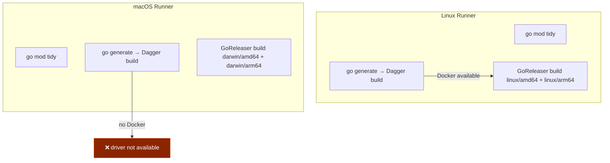

# Separating Dagger Build Steps from Split GoReleaser Pipelines

This article describes a CI architecture pattern for Go projects that use Dagger to build embedded frontend assets and GoReleaser's split-build mode for cross-platform releases. The pattern solves a specific failure mode — Dagger cannot run on GitHub's macOS runners because they lack a container runtime — and the solution generalizes to any Go project that combines `//go:embed` with Dagger-based build steps in its release pipeline.

The reference implementation is the go-minitrace project, which embeds a React/Vite SPA into a Go binary and releases for Linux and Darwin using GoReleaser Pro's `--split` mode.

> [!summary]
> 1. Dagger requires a container runtime; GitHub's macOS runners do not provide one, so any `go generate` step that invokes Dagger will fail on `macos-latest`.
> 2. The fix separates the Dagger build into a dedicated Linux job, shares the built assets as GitHub Actions artifacts, and has both platform-specific release jobs download and reuse those assets.
> 3. A `SKIP_DAGGER` environment variable in the build tool allows `go generate` to succeed as a no-op when the frontend has already been built, preserving local development workflows without modification.

## When this pattern applies

Use this pattern when your Go project satisfies all of these conditions:

- You use `//go:embed` to bundle frontend assets into the Go binary at compile time
- You use Dagger (or any container-dependent build tool) to produce those assets during `go generate`
- You release with GoReleaser's split-build mode, which runs separate jobs on different OS runners
- One of those runners is `macos-latest`, which lacks Docker

Do not use this pattern when:

- Your `go generate` step does not require a container runtime (the problem does not exist)
- You build all platforms from a single Linux runner (no macOS runner is involved)
- You are willing to install Docker on the macOS runner via Colima (slower, flakier, but possible)

## The failure mode

### What happens

GoReleaser's `before` hooks run `go generate ./...` before each build. When `go generate` invokes a Dagger pipeline, Dagger attempts to connect to a container runtime. On `ubuntu-latest`, Docker is available and the connection succeeds. On `macos-latest`, no container runtime exists, and Dagger fails immediately:

```
1   : connect
1   : connect ERROR [0.0s]
1   : ! start engine: driver for scheme "image" was not available
Error: start engine: driver for scheme "image" was not available
```

The Dagger CLI being installed on the runner is irrelevant. The CLI is a client; it needs a runtime to connect to. Without Docker, the CLI has nothing to talk to.

### Why it is not a Dagger bug

Dagger's architecture assumes a container runtime is present. This is by design — Dagger uses containers for isolation, reproducibility, and caching. The error message is accurate: the driver for the `image` scheme (which pulls and runs OCI images) is not available because no runtime is installed. GitHub's macOS runners ship with Xcode, Homebrew, and language runtimes, but not Docker.

### Why cross-compilation does not solve it

One might assume that building Darwin binaries from a Linux runner would avoid the problem entirely. For pure Go projects, this works. But the go-minitrace project uses `CGO_ENABLED=1`, which means cross-compiling Darwin from Linux requires the `osxcross` toolchain and Apple SDK headers — a fragile, hard-to-maintain setup in CI. The split-build approach exists specifically to avoid this: let each platform build natively on its own runner.

## The architecture before the fix



Both runners run the same `before` hooks from `.goreleaser.yaml`:

```yaml
before:
  hooks:
    - go mod tidy
    - go generate ./...
```

The `go generate` directive in `cmd/go-minitrace/cmds/serve/generate.go` invokes the Dagger build:

```go
//go:generate go run ../../../build-web
```

And `cmd/build-web/main.go` connects to Dagger unconditionally:

```go
func main() {
    if err := buildAndExportFrontend(context.Background()); err != nil {
        fmt.Fprintf(os.Stderr, "Error: %v\n", err)
        os.Exit(1)
    }
}
```

The `buildAndExportFrontend` function uses `dagger.Connect()` to spin up a Node container, run `pnpm install` and `pnpm build`, and export the resulting `dist/` directory into the Go embed path at `cmd/go-minitrace/cmds/serve/frontend/`.

The embed directive itself is straightforward:

```go
//go:embed all:frontend
var frontendEmbedFS embed.FS
```

Go's compiler embeds whatever is on disk at build time. If `go generate` has not run, the `frontend/` directory contains only `.gitkeep` (the built assets are gitignored), and the binary ships with an empty embedded filesystem.

## The architecture after the fix

```mermaid
flowchart TD
    subgraph Build Frontend Job - ubuntu-latest
        BF1[Install Dagger CLI]
        BF2[go run ./cmd/build-web]
        BF3[Upload frontend-dist artifact]
        BF2 --> BF3
    end

    subgraph Linux Release Job - ubuntu-latest
        LR1[Download frontend-dist]
        LR2[go mod tidy]
        LR3[go generate → SKIP_DAGGER=1 → no-op]
        LR4[GoReleaser build linux]
        LR1 --> LR3
    end

    subgraph Darwin Release Job - macos-latest
        DR1[Download frontend-dist]
        DR2[go mod tidy]
        DR3[go generate → SKIP_DAGGER=1 → no-op]
        DR4[GoReleaser build darwin]
        DR1 --> DR3
    end

    subgraph Merge Job - ubuntu-latest
        MG1[Download dist-linux + dist-darwin]
        MG2[GoReleaser continue --merge]
    end

    BF3 -->|artifact| LR1
    BF3 -->|artifact| DR1
    LR4 --> MG1
    DR4 --> MG1

    style BF2 fill:#2d4a22,stroke:#4a7c3f
    style LR3 fill:#4a4a22,stroke:#8a8a3f
    style DR3 fill:#4a4a22,stroke:#8a8a3f
```



The flow has four jobs instead of three. The `build-frontend` job runs first on Linux, uses Dagger to build the frontend, and uploads the result. Both release jobs depend on `build-frontend`, download the pre-built frontend into the embed path, and set `SKIP_DAGGER=1` so that `go generate` exits 0 immediately. The merge job is unchanged.

### Job dependency graph

```yaml
jobs:
  build-frontend:       # no dependencies
  goreleaser-linux:
    needs: build-frontend
  goreleaser-darwin:
    needs: build-frontend
  goreleaser-merge:
    needs: [goreleaser-linux, goreleaser-darwin]
```

Both release jobs can run in parallel once the frontend is built. The total wall time is: frontend build time + max(linux release, darwin release) + merge time. This is typically faster than the original flow, because the Dagger build no longer runs twice (once per runner).

## Implementation details

### Step 1: Add SKIP_DAGGER to the build tool

The `cmd/build-web/main.go` binary gains an early exit when `SKIP_DAGGER` is set:

```go
func main() {
    if os.Getenv("SKIP_DAGGER") != "" {
        fmt.Println("SKIP_DAGGER set, skipping Dagger frontend build")
        os.Exit(0)
    }

    if err := buildAndExportFrontend(context.Background()); err != nil {
        fmt.Fprintf(os.Stderr, "Error: %v\n", err)
        os.Exit(1)
    }
}
```

This exit is intentional and necessary. The `//go:generate` directive runs `go run ../../../build-web`, and `go run` propagates the exit code. If the binary exits 0, `go generate` considers the directive successful and continues. If it exits non-zero, `go generate` fails and the build stops.

By exiting 0, we tell `go generate` that nothing needs to be done. This is correct because the frontend artifacts have already been placed on disk by the separate `build-frontend` job. The `go generate` hook in `.goreleaser.yaml` remains unchanged — it just becomes a no-op.

Why not remove the `go generate` hook entirely? Because local development still needs it. A developer cloning the repo and running `go build` locally expects `go generate` to produce the frontend. The `SKIP_DAGGER` mechanism lets the same hook serve both purposes: full build locally, no-op in CI.

### Step 2: The build-frontend job

```yaml
build-frontend:
  runs-on: ubuntu-latest
  steps:
    - uses: actions/checkout@v6
      with:
        fetch-depth: 0
    - uses: actions/setup-go@v6
      with:
        go-version-file: go.mod
        cache: true
    - name: Install Dagger CLI
      run: |
        curl -fsSL https://dl.dagger.io/dagger/install.sh | \
          BIN_DIR="$HOME/.local/bin" DAGGER_VERSION=0.20.5 sh
        echo "$HOME/.local/bin" >> "$GITHUB_PATH"
        "$HOME/.local/bin/dagger" version
    - name: Build frontend with Dagger
      run: go run ./cmd/build-web
    - uses: actions/upload-artifact@v7
      with:
        name: frontend-dist
        path: cmd/go-minitrace/cmds/serve/frontend
```

This job runs `go run ./cmd/build-web` directly, not through `go generate`. The reason is control: we want the exit code to propagate, and we want the step name to be explicit in the CI log. Running through `go generate` would work but would bury the Dagger output under the generic "running hook" step name.

The artifact upload captures the entire `frontend/` directory — the built JS/HTML/CSS files plus the `.gitkeep` marker. Both release jobs will download this artifact into the same path, making the files available to the Go compiler at embed time.

### Step 3: Modified release jobs

The Darwin job changes from this:

```yaml
goreleaser-darwin:
  runs-on: macos-latest
  steps:
    - uses: actions/checkout@v6
    - uses: actions/setup-go@v6
    - name: Install Dagger CLI          # ← removed
      run: curl -fsSL ... | sh
    - uses: goreleaser/goreleaser-action@v7
      env:
        GITHUB_TOKEN: ${{ secrets.GITHUB_TOKEN }}
        GORELEASER_KEY: ${{ secrets.GORELEASER_KEY }}
        GGOOS: darwin
```

To this:

```yaml
goreleaser-darwin:
  runs-on: macos-latest
  needs: build-frontend
  steps:
    - uses: actions/checkout@v6
    - uses: actions/setup-go@v6
    - name: Download pre-built frontend
      uses: actions/download-artifact@v8
      with:
        name: frontend-dist
        path: cmd/go-minitrace/cmds/serve/frontend
    - uses: goreleaser/goreleaser-action@v7
      env:
        GITHUB_TOKEN: ${{ secrets.GITHUB_TOKEN }}
        GORELEASER_KEY: ${{ secrets.GORELEASER_KEY }}
        GGOOS: darwin
        SKIP_DAGGER: "1"
```

Three changes: the `needs` dependency, the artifact download step, and `SKIP_DAGGER=1` in the environment. The Dagger CLI install step is removed entirely because it is no longer needed.

The Linux job follows the same pattern with the addition of the arm64 cross-compiler installation step that was already present.

## The go install problem

Separate from the CI failure, there is a second problem that this architecture creates for users who install via `go install`. The `go install` command compiles and installs a binary without running `go generate`. Because the built frontend assets are gitignored, anyone doing `go install github.com/go-go-golems/go-minitrace/cmd/go-minitrace@latest` gets a binary whose embedded `frontend/` directory contains only `.gitkeep`.

### Detecting the missing frontend at runtime

A runtime check in the embed file catches this case early:

```go
var frontendFS = mustSubFS(frontendEmbedFS, "frontend")

func init() {
    if _, err := frontendFS.Open("index.html"); err != nil {
        log.Error().Msg(
            "Embedded frontend is missing index.html. " +
            "The web UI will not work. " +
            "Run `go generate ./cmd/go-minitrace/cmds/serve` before building, " +
            "or download a release binary from GitHub.")
    }
}
```

The `init()` function runs before `main()`. It opens `index.html` from the embedded filesystem. If the file does not exist — which happens when the frontend was never built — it logs a clear error message explaining what went wrong and how to fix it. The program does not crash; the user sees the error in the log and can take action.

This is a detection mechanism, not a fix. The actual fix for `go install` users is to download release binaries from GitHub (which are built by the CI pipeline with the full frontend) or to install via Homebrew.

### Why not commit the built frontend to git

Committing `dist/` to git would make `go install` work out of the box, at the cost of:

- Diff noise on every frontend change (generated JS bundles change frequently)
- Merge conflicts on generated files when multiple developers build concurrently
- A subtle dual-source-of-truth problem: the committed assets might not match the current source code

For a project in active frontend development, these costs outweigh the convenience. If the frontend reaches a stable state where changes are rare, committing the built output becomes more reasonable.

## Common failure modes

### "driver for scheme image was not available"

**Cause**: Dagger cannot find a container runtime. This happens on macOS runners without Docker, or on any runner where Docker is not running.  
**Fix**: Do not run Dagger on that runner. Use the separate build-frontend job pattern described in this article.

### `go generate` exits 0 but the frontend is missing

**Cause**: `SKIP_DAGGER=1` is set and the frontend artifact was not downloaded, or was downloaded to the wrong path.  
**Fix**: Verify that `actions/download-artifact` places files at the exact path the `//go:embed` directive reads. In this project, that path is `cmd/go-minitrace/cmds/serve/frontend/`.

### The build succeeds but the web UI returns 404

**Cause**: The embedded filesystem is empty — `index.html` is missing. This is the `go install` problem.  
**Fix**: Either build from source with `go generate` first, or use a release binary from GitHub. The runtime check in `init()` should surface this with a clear error message.

### The frontend artifact is empty or corrupt

**Cause**: The `build-frontend` job failed silently, or the `actions/upload-artifact` path did not match the actual output directory.  
**Fix**: Check the `build-frontend` job logs for Dagger errors. Verify the upload path matches where `cmd/build-web` writes its output.

### SKIP_DAGGER is set locally by accident

**Cause**: Someone exported `SKIP_DAGGER=1` in their shell profile or `.env` file.  
**Fix**: Unset it. The env var should only be set in CI. Locally, `go generate` should run the full Dagger build.

## Working rules

- **Dagger builds run on Linux only.** Never attempt to run Dagger on a macOS CI runner. The absence of Docker is not a bug; it is an environmental constraint.
- **The frontend is built once and shared.** Both release jobs consume the same artifact. This avoids divergent builds and reduces total CI time.
- **`SKIP_DAGGER` is a CI-only mechanism.** Local builds should always run the full Dagger pipeline. The env var exists to make `go generate` a no-op when the artifacts are already on disk.
- **The `go generate` hook stays in `.goreleaser.yaml`.** Removing it would break local builds. Making it conditional would require changes to GoReleaser's hook syntax. The `SKIP_DAGGER` approach is the simplest way to make the same hook behave differently in CI vs. locally.
- **Runtime checks catch `go install` users.** Do not assume everyone installs from release binaries. Add an `init()` check that detects the missing frontend and logs a helpful message.

## Measured results

The v0.0.11 release (first run with the new pipeline) completed successfully:

| Job | Duration |
|---|---|
| build-frontend | 1m14s |
| goreleaser-darwin | 1m7s |
| goreleaser-linux | 3m52s |
| goreleaser-merge | 1m49s |

The v0.0.10 release (the failing run) never completed because the Darwin job failed at the `go generate` step.

The total wall time for v0.0.11 was approximately 7 minutes, which is comparable to the original pipeline's intended time. The frontend build adds a sequential step at the start, but both release jobs run in parallel afterward, and the Darwin job is faster because it no longer installs Dagger CLI or attempts the Dagger build.

## Alternatives considered

| Approach | Why it was rejected |
|---|---|
| Install Docker on macOS via Colima | Adds 2-3 minutes startup time per run, fragile, Colima often breaks between GitHub Actions image updates |
| Cross-compile Darwin from Linux | Requires `osxcross` + Apple SDK, complex CI setup, the split-build approach exists to avoid this |
| Commit built frontend to git | Diff noise, merge conflicts, dual source of truth |
| Remove `go generate` from before hooks | Breaks local builds where `go generate` is the primary frontend build mechanism |
| Use `workflow_call` reusable workflow | Adds complexity for no benefit in a single-repo setup |

## Related notes

- [[ARTICLE - Go Web Frontend Embed - Adding a React SPA to a Go Backend with net/http and go:embed]] — the pattern for embedding a Vite SPA into a Go binary
- [[ARTICLE - Go Web Dagger Pnpm Build - Dagger-Based pnpm Web Build Pipeline for Go Repos]] — the Dagger build pipeline pattern this article builds on
