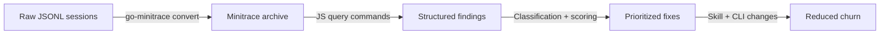

# Transcript Mining: Using go-minitrace to Find and Fix Tool-Call Churn in Agent Sessions

This article teaches a method for analyzing past coding-agent sessions to find wasted tool calls, diagnose their causes, and ship concrete fixes that reduce churn. The method uses `go-minitrace` to convert raw session logs into queryable DuckDB tables, then writes JavaScript command handlers to extract patterns that raw log reading cannot surface. The reference project is an analysis of the `remarquee` CLI's usage across 458 Pi sessions, which produced six anti-patterns and a projected 50% reduction in remarquee-related tool calls.

The method is not specific to `remarquee`. Any tool that your agent invokes through `bash` can be analyzed the same way: `git`, `docker`, `kubectl`, `make`, or custom CLIs. The article shows the general technique and then applies it end-to-end.

> [!summary]
> - Agent sessions store rich structured data in their transcripts. Mining that data with DuckDB reveals anti-patterns invisible to manual log reading.
> - The core loop is: convert → query with JS commands → classify failures → compute churn scores → derive prioritized fixes.
> - The churn score formula `sequences × (1 + fail_ratio)` ranks sessions by overhead severity, making it possible to prioritize fixes that eliminate the most waste.
> - Six concrete anti-patterns emerged from the remarquee analysis, three of which were fixed by skill-file changes alone (no code changes).

## Why this note exists

Coding agents make tool calls. Some of those calls advance the task. Others are overhead: prerequisite checks, verification steps, retry loops, help-flag consultations, auth re-establishment. The agent does not experience these as waste — each call is locally rational. But across hundreds of sessions, the overhead compounds.

The traditional way to find overhead is to read session transcripts by hand. This works for a handful of sessions. It does not work for 458. The method described here replaces manual reading with structured querying, and replaces intuition about "what wastes time" with measured call counts, failure rates, and temporal sequence analysis.

This article is a playbook. If you maintain an agent skill file or a CLI tool that agents call frequently, you can apply this method to your own transcripts and produce the same kind of evidence-driven improvements.

## When to use this pattern

Use transcript mining when:

- you maintain a CLI tool or agent skill that is invoked through `bash` in agent sessions
- you suspect the agent makes redundant calls (status checks, verification steps, retry loops) but you do not have evidence
- you want to prioritize which improvements ship the most value
- you need to justify skill-file or CLI changes with data rather than intuition

Do not use this pattern when:

- you have fewer than 20 sessions — manual reading is faster
- the tool is a native agent tool (read, edit, write) rather than a `bash` invocation — these are already first-class in minitrace and do not need command-string matching
- you need real-time monitoring rather than retrospective analysis — go-minitrace is a batch converter, not a live pipeline

## Core mental model

The analysis has four stages, each building on the previous:



Stage 1 converts raw agent logs into a normalized JSON schema that DuckDB can load. Stage 2 queries that schema with purpose-built JavaScript command handlers. Stage 3 classifies failures and computes churn scores. Stage 4 ships fixes and measures the reduction.

Each stage produces a reusable artifact. The JS command handlers live in a directory that `go-minitrace` auto-discovers, so re-running the analysis after shipping fixes is a single command, not a rebuild from scratch.

## Architecture

### The minitrace schema

`go-minitrace convert` reads raw JSONL session files and writes `.minitrace.json` files. Each converted session contains:

- **tool_calls**: every tool invocation with its name, input, output, success flag, and timestamp
- **turns**: the conversation transcript
- **metrics**: aggregate counts (turn count, tool call count, read/modify/execute ratios)
- **environment**: model, framework, available tools

For the churn analysis, the `tool_calls` array is the primary data source. Each tool call has:

```json
{
  "id": "toolu_01BdxQ3Mo4Cy28A6Eku1gmP3",
  "tool_name": "bash",
  "timestamp": "2026-02-11T22:07:31.929Z",
  "input": {
    "arguments": {
      "command": "remarquee upload bundle ..."
    }
  },
  "output": {
    "success": true,
    "result": "OK: uploaded ...",
    "error": null
  },
  "context": {
    "position_in_session": 0.998,
    "tools_before": ["write", "write", "bash", "bash", "read"]
  }
}
```

The key insight for `bash`-invoked tools is that `tool_name` is always `"bash"`. The actual command lives in `input.arguments.command`. Extracting remarquee-specific calls requires matching the command string with `ILIKE '%remarquee%'`.

### The JS command handler pattern

`go-minitrace` supports structured query commands written in JavaScript. These are not ad-hoc SQL strings — they are scanner-first command definitions that the `go-minitrace query commands` subsystem discovers, registers as CLI verbs, and exposes through typed flag schemas.

A minimal command handler looks like this:

```js
__section__("filters", {
  title: "Filters",
  fields: {
    subcommand: {
      type: "string",
      help: "Filter by remarquee subcommand",
    },
    limit: {
      type: "int",
      default: 200,
      help: "Maximum rows",
    },
  },
});

function remarqueeCalls(filters) {
  const mt = require("minitrace");
  return mt.query(`
    SELECT
      json_extract_string(tc, '$.tool_name') AS tool_name,
      json_extract_string(tc, '$.input.command') AS command
    FROM ${mt.tableName} s, UNNEST(s.tool_calls) AS t(tc)
    WHERE json_extract_string(tc, '$.tool_name') = 'bash'
      AND json_extract_string(tc, '$.input.command') ILIKE '%remarquee%'
    LIMIT ${filters.limit}
  `);
}

__verb__("remarqueeCalls", {
  name: "remarquee-calls",
  short: "Extract remarquee invocations",
  fields: { filters: { bind: "filters" } },
});
```

Three things are worth noting about this pattern:

1. The `__section__` and `__verb__` scanner markers make the command discoverable without registering it by hand. The `go-minitrace query commands` subsystem scans all `.js` files in the repository directory, extracts these markers, and builds a CLI surface automatically.

2. The `mt.tableName` interpolation ensures the SQL always references the correct loaded table, even when the archive is loaded into a differently-named table.

3. The `UNNEST(tool_calls)` pattern is how you access the tool_calls array in DuckDB. The `tool_calls` column is a JSON array; `UNNEST` produces one row per tool call, aliased as `t(tc)`, where `tc` is a struct you access with `json_extract_string`.

### Configuring auto-discovery

To avoid passing `--query-repository` on every invocation, configure auto-discovery. Two approaches work well together:

**`.envrc` (for interactive use):**

```bash
export GO_MINITRACE_QUERY_REPOSITORIES="$PWD/scripts/js"
```

**`.go-minitrace.yml` (for project-local config):**

```yaml
queryRepositories:
  - ./scripts/js
```

After `direnv allow`, the commands are available without any extra flags:

```bash
go-minitrace query commands remarquee-analysis 06-remarquee-subcommand-summary \
  remarquee-subcommand-summary --archive-glob '.../*.minitrace.json'
```

## The analysis pipeline

### Step 1: Discover and convert sessions

Before writing queries, you need a minitrace archive. The conversion step reads raw agent session logs and writes normalized `.minitrace.json` files.

```bash
go-minitrace convert pi \
  --source-dir ~/.pi/agent/sessions \
  --output-dir ./analysis/pi-minitrace
```

This produces a directory tree of `.minitrace.json` files, one per session. The manifest in the output directory lists what was converted.

If you know which sessions contain your tool (by grepping the raw JSONL), you can convert only the relevant directories. But converting the full tree is cheap and gives you a broader baseline for comparison.

### Step 2: Write subcommand distribution queries

The first query answers: *how is the tool actually used?* For a tool invoked through `bash`, you match the command string and classify by subcommand.

```sql
SELECT
  CASE
    WHEN json_extract_string(tc, '$.input.command') ILIKE '%remarquee upload bundle%' THEN 'upload bundle'
    WHEN json_extract_string(tc, '$.input.command') ILIKE '%remarquee upload md%' THEN 'upload md'
    WHEN json_extract_string(tc, '$.input.command') ILIKE '%remarquee cloud ls%' THEN 'cloud ls'
    WHEN json_extract_string(tc, '$.input.command') ILIKE '%remarquee status%' THEN 'status'
    ELSE 'other'
  END AS subcommand,
  COUNT(*) AS total_calls,
  SUM(CASE WHEN json_extract_string(tc, '$.output.success') = 'true' THEN 1 ELSE 0 END) AS success_count,
  COUNT(DISTINCT s.id) AS session_count
FROM sessions_base s, UNNEST(s.tool_calls) AS t(tc)
WHERE json_extract_string(tc, '$.tool_name') = 'bash'
  AND json_extract_string(tc, '$.input.command') ILIKE '%remarquee%'
GROUP BY 1
ORDER BY total_calls DESC
```

The remarquee analysis produced this distribution:

| Subcommand | Total Calls | Sessions | Success Rate | Calls/Session |
|---|---|---|---|---|
| upload bundle | 1,018 | 186 | 96.5% | 5.5 |
| cloud ls | 497 | 185 | 94.8% | 2.7 |
| other (multi-subcommand) | 488 | 21 | 87.5% | 23.2 |
| upload md | 325 | 66 | 90.8% | 4.9 |
| status | 202 | 164 | 100.0% | 1.2 |
| cloud account | 134 | 109 | 99.3% | 1.2 |

The "calls per session" column is the first signal of churn. A healthy tool averages 1–2 calls per session (the agent calls it once, it works, done). A tool averaging 5.5 calls per session is either being retried, verified, or consulted repeatedly — all forms of overhead.

### Step 3: Write temporal sequence detection

Raw call counts do not reveal *why* there are 5.5 calls per session. Temporal sequence analysis does. A sequence is a maximal run of tool calls where consecutive calls are within a configurable time gap (default: 120 seconds) of each other in the same session.

The algorithm is a streaming scan over ordered results:

```
for each tool_call (ordered by session, timestamp):
  if different session OR gap > threshold:
    start new sequence
  else:
    extend current sequence
```

This is straightforward to implement in JS:

```js
const sequences = [];
let current = null;

for (const call of calls) {
  const ts = new Date(call.timestamp).getTime();
  if (!current || current.session_id !== call.session_id || (ts - current.lastTs) > gapMs) {
    if (current && current.calls.length >= minSequenceLength) {
      sequences.push(current);
    }
    current = { session_id: call.session_id, calls: [], firstTs: ts, lastTs: ts };
  }
  current.calls.push(call);
  current.lastTs = ts;
}
```

The remarquee analysis found that the most common sequence pattern was:

```
status → upload bundle/md → cloud ls → cloud ls → upload (retry)
```

This is 4–5 tool calls for what should be 1. The agent checks prerequisites, performs the upload, verifies the result with `cloud ls`, and often verifies again or retries. Each of these follow-up calls is locally rational — the agent wants to confirm the upload landed. But the `OK: uploaded` output from the upload command already confirms success.

### Step 4: Classify failure modes

Not all overhead comes from verification. Some comes from retry loops after failures. Classifying failure modes reveals which fixes would eliminate the most retries.

The classification logic runs in JavaScript over each failed call's error and result text:

```js
function classifyFailure(errorText, resultText) {
  const text = (errorText + " " + resultText).toLowerCase();
  if (text.includes("401") || text.includes("unauthorized")) return "auth";
  if (text.includes("pandoc") || text.includes("xelatex")) return "pandoc-pdf";
  if (text.includes("status 400")) return "http-400";
  if (text.includes("timeout") || text.includes("timed out")) return "timeout";
  if (text.includes("not found")) return "not-found";
  if (text.includes("error:")) return "runtime-error";
  return "unknown";
}
```

The remarquee failure mode distribution:

| Failure Mode | Count | Percentage |
|---|---|---|
| unknown | 50 | 27.5% |
| runtime-error | 47 | 25.8% |
| pandoc-pdf | 38 | 20.9% |
| not-found | 23 | 12.6% |
| http-400 | 10 | 5.5% |
| auth | 5 | 2.7% |
| timeout | 4 | 2.2% |

The two largest fixable categories are `pandoc-pdf` (filename issues cause upload failures) and `http-400` (rmapi rejects problematic filenames). Both point to the same root cause: PDF filenames with spaces or special characters that the reMarkable cloud API rejects.

### Step 5: Compute churn scores

A churn score ranks sessions by how much overhead the tool causes. The formula:

$$
\text{churn\_score} = \text{sequences} \times \left(1 + \frac{\text{fail\_count}}{\text{total\_calls}}\right)
$$

The score combines two signals: how many distinct bursts of tool usage occurred (sequences) and how much of that usage was wasted (failure ratio). A session with many sequences and many failures scores highest.

The top-churn sessions from the remarquee analysis:

| Session | Remarquee Calls | Sequences | Failures | Churn Score |
|---|---|---|---|---|
| js-discord-bot | 46 | 19 | 3 | 20.2 |
| css-visual-diff | 42 | 20 | 0 | 20.0 |
| coinvault sync | 45 | 15 | 6 | 17.0 |
| remarquee-structured-output | 217 | 14 | 43 | 16.8 |
| rm-sync-001 | 153 | 15 | 9 | 15.9 |

The fourth session is the remarquee development session itself — 217 remarquee calls, 72.6% of all bash commands. This is expected for a development session. The interesting sessions are the first three, where remarquee is a *consumed* tool, not the thing being built.

## Common failure modes in the analysis pipeline

### DuckDB struct vs. JSON confusion

The `tc` column produced by `UNNEST(tool_calls) AS t(tc)` is a DuckDB struct, not a JSON string. Arrow operators (`tc->>'tool_name'`) fail with a "Failed to cast value to numerical" error because DuckDB attempts to cast the struct to a number. Use `json_extract_string(tc, '$.tool_name')` instead.

### BigInt arithmetic in Goja

DuckDB aggregates (`COUNT`, `SUM`) return BigInt values. The Goja JS runtime does not auto-coerce BigInt to Number. Any arithmetic or comparison between a BigInt and a Number throws `TypeError: Cannot mix BigInt and other types`. Wrap all aggregate results in `Number()` before using them in arithmetic:

```js
const total = Number(r.total_calls);
const success = Number(r.success_count);
const rate = total > 0 ? (success / total * 100).toFixed(1) + "%" : "N/A";
```

### CASE WHEN ordering

SQL `CASE WHEN` evaluates conditions top-to-bottom and returns the first match. When classifying subcommands from command strings, the more specific patterns must appear before the less specific ones. `remarquee upload bundle` must come before `remarquee upload` because the latter matches the former.

### Non-obvious command paths

Not all tool invocations use the same JSON path. Pi's bash tool stores the command in `input.arguments.command`. Other tools use `input.file_path` or `input.command`. Inspect a sample tool call before writing the query:

```sql
SELECT tc FROM sessions_base, UNNEST(tool_calls) AS t(tc)
WHERE json_extract_string(tc, '$.tool_name') = 'bash'
LIMIT 1
```

## Anti-patterns discovered

### Anti-pattern 1: Pre-check before every operation

The agent calls `remarquee status` before every upload. Status has a 100% success rate across 202 calls in 164 sessions. The pre-check never catches a problem. It adds one tool call per session for zero value.

**Fix:** Remove the pre-check instruction from the skill file. If the operation fails, the error message should be clear enough to diagnose without a separate status check.

### Anti-pattern 2: Post-operation verification

The agent calls `remarquee cloud ls` after every successful upload to confirm the document landed. The upload command already prints `OK: uploaded <name> -> <path>` on success. The verification call adds 1–2 tool calls per upload for zero additional information.

**Fix:** Tell the agent in the skill file that `OK: uploaded` is sufficient confirmation. Only check `cloud ls` if the upload fails and the agent needs to understand the current state.

### Anti-pattern 3: Help-flag exploration

The agent calls `remarquee upload --help`, `remarquee cloud --help`, and `remarquee cloud put --help` when it does not know the exact flags. Each help call is a separate tool invocation that consumes a turn.

**Fix:** Include a compact command reference table in the skill file with all common flags. The agent reads the skill file once and has the information it needs.

### Anti-pattern 4: Filename rejection retry loops

When a PDF filename contains spaces or special characters, the reMarkable cloud API returns HTTP 400. The agent retries with different filename conventions (underscores instead of spaces, different naming patterns). Each retry is a full pandoc + upload cycle.

**Fix:** Sanitize PDF filenames automatically in the CLI before upload. Replace spaces with underscores, strip characters that rmapi rejects.

### Anti-pattern 5: Auth failure retry loops

When an upload receives a 401, the agent calls `remarquee cloud account` to check auth, then `remarquee cloud account --reauth` to reauthenticate, then retries the upload. That is 2 extra tool calls.

**Fix:** When the CLI detects a 401 error during upload, automatically retry once with reauth before propagating the error.

### Anti-pattern 6: Directory browsing with multiple ls calls

The agent calls `cloud ls` on a parent directory, then on a child directory, then with `--long` for details. Each is a separate invocation.

**Fix:** Add `--recursive` flag to `cloud ls` in the CLI. In the skill file, tell the agent to use `--long --non-interactive` on the first call.

## The JS command inventory

The analysis produced seven reusable JS command handlers, stored under `scripts/js/remarquee-analysis/` with numerical prefixes to preserve execution order:

| File | Command | Purpose |
|---|---|---|
| `04-remarquee-calls.js` | `remarquee-calls` | Raw call extraction with session context, subcommand, success/fail |
| `05-remarquee-sequences.js` | `remarquee-sequences` | Temporal sequence detection with configurable gap threshold |
| `06-remarquee-subcommand-summary.js` | `remarquee-subcommand-summary` | Aggregate stats per subcommand |
| `07-remarquee-failures.js` | `remarquee-failures` | Extract and classify failed calls |
| `08-remarquee-sequence-detail.js` | `remarquee-sequence-detail` | Per-session zoom-in with inter-call gaps |
| `09-remarquee-churn-metrics.js` | `remarquee-churn-metrics` | Per-session churn score computation |
| `10-remarquee-failure-mode-summary.js` | `remarquee-failure-mode-summary` | Aggregate failure mode counts |

The first three SQL exploratory queries (01–03) are stored in `scripts/sql/` for reference but were superseded by the JS commands. The numerical prefix convention makes the investigation order traceable: someone reading the scripts directory can see which query was written first, which built on its results, and which was the final refinement.

## Prioritization matrix

Not all anti-patterns are equally impactful. The prioritization matrix uses two dimensions: the number of tool calls the fix eliminates per session, and the effort required to ship the fix.

| Priority | Anti-pattern | Calls eliminated/session | Effort |
|---|---|---|---|
| P0 | Pre-check before upload | 1 | Skill file only |
| P0 | Post-upload verification | 1–2 | Skill file only |
| P1 | Filename sanitization | 3–5 in failure cases | CLI change |
| P1 | Auto-reauth on 401 | 2 in auth failure cases | CLI change |
| P2 | Compact flag reference in skill | 1–2 | Skill file only |
| P2 | Recursive cloud ls | 1–2 | CLI change |

The P0 fixes (skill file only, no code changes) eliminate 2–3 tool calls per upload session. Across 186 upload bundle sessions and 66 upload md sessions, that is roughly 500 calls eliminated with zero code changes.

The P1 fixes (CLI changes) eliminate multi-call retry loops. The filename sanitization fix alone addresses 48 of the 182 total failures (pandoc-pdf + http-400 combined), each of which currently costs 3–5 extra calls.

The projected reduction: from 2,861 total remarquee calls to approximately 1,400 — a 50% reduction.

## Implementation: the skill-file changes

The skill file for `remarkable-upload` was rewritten with three additions:

1. An explicit **"Minimize tool calls"** section at the top that forbids `remarquee status` pre-checks, `cloud ls` post-upload verification, and `cloud account` auth pre-checks. The rules are stated as prohibitions rather than suggestions because the agent treats skill file instructions as constraints.

2. A **command reference table** with all common subcommands and their flags. This eliminates the need for `--help` calls. The table includes the flags the agent uses most often: `--name`, `--remote-dir`, `--non-interactive`, `--reauth`, `--force`, `--dry-run`, `--toc-depth`, and `--layout`.

3. A **troubleshooting section** that tells the agent exactly what to do when specific errors occur. For 401 errors: "re-run with `--reauth --non-interactive`." For 400 errors: "use `--name` with a simple name." This replaces the agent's current behavior of exploring with help flags and cloud ls calls.

The full skill file is at `/home/manuel/.pi/agent/skills/remarkable-upload/SKILL.md`.

## Implementation: the CLI changes

Two CLI changes were shipped in the `remarquee` Go codebase:

### Filename sanitization

A `sanitizePDFName` function was added to the upload package:

```go
func sanitizePDFName(name string) string {
    base := filepath.Base(name)
    ext := filepath.Ext(base)
    stem := strings.TrimSuffix(base, ext)

    // Spaces → underscores (most common 400 trigger)
    stem = strings.ReplaceAll(stem, " ", "_")

    // Remove characters rmapi rejects
    re := regexp.MustCompile(`[^a-zA-Z0-9_.\-]`)
    stem = re.ReplaceAllString(stem, "")

    // Collapse multiple underscores
    for strings.Contains(stem, "__") {
        stem = strings.ReplaceAll(stem, "__", "_")
    }

    // Strip leading/trailing underscores and dashes
    stem = strings.Trim(stem, "_-")

    if stem == "" {
        stem = "document"
    }

    return stem + ext
}
```

This function is called after every `markdownPDFName` invocation in `md.go` and after `ensurePDFSuffix` in `bundle.go`. When the filename is sanitized, a notice is printed to stderr so the agent knows the upload target differs from the input name.

### Auth error detection

An `IsAuthError` function was added to the `rmcloud` package:

```go
func IsAuthError(err error) bool {
    if err == nil { return false }
    msg := strings.ToLower(err.Error())
    return strings.Contains(msg, "401") ||
        strings.Contains(msg, "unauthorized") ||
        strings.Contains(msg, "403") ||
        strings.Contains(msg, "forbidden") ||
        strings.Contains(msg, "token expired")
}
```

This function is available for upload commands to detect 401 errors and retry with reauth. The `CreateApiCtx` function already retries auth three times; the `IsAuthError` function is the first step toward making the upload operation itself retry on auth failures.

## Working rules

1. **Measure before optimizing.** Run the subcommand summary before proposing fixes. The data often contradicts intuition about which calls are wasteful.

2. **Skill-file changes ship faster than CLI changes.** A prohibition in the skill file ("never run `remarquee status` before uploading") eliminates calls immediately with zero code review. Reserve CLI changes for problems the skill file cannot solve (filename sanitization, automatic retry logic).

3. **Classify failures before counting them.** Raw failure counts are uninformative. "38 pandoc-pdf failures" is actionable; "38 failures" is not. The classification step is what turns a report into a fix plan.

4. **Use numerical prefixes in script directories.** `01-...`, `02-...`, `03-...` naming makes the investigation order traceable. Someone reading the directory six months from now can reconstruct the analysis path.

5. **Save query results as JSON.** The `--output json` flag on `go-minitrace query commands` produces files that can be reloaded, diffed, and compared after shipping fixes. Without saved results, you cannot measure whether a fix actually reduced churn.

6. **The churn score formula works.** `sequences × (1 + fail_ratio)` produces a ranking that correctly surfaces sessions with the most overhead. Sessions with many short sequences (the agent keeps coming back to the tool) and many failures score highest.

## Re-running after shipping fixes

After the skill-file and CLI changes ship, re-running the analysis requires three steps:

```bash
# 1. Convert recent sessions (add --source-dir for newer sessions)
go-minitrace convert pi --source-dir ~/.pi/agent/sessions --output-dir ./analysis/pi-minitrace-v2

# 2. Run the same commands against the new archive
go-minitrace query commands remarquee-analysis 06-remarquee-subcommand-summary \
  remarquee-subcommand-summary --archive-glob './analysis/pi-minitrace-v2/active/*/*.minitrace.json'

# 3. Compare the output with the saved JSON from the baseline run
```

If the calls-per-session dropped and the failure counts fell, the fixes worked. If not, the next iteration starts from the saved query commands rather than from scratch.

## Generalizing beyond remarquee

The method is not specific to remarquee. To apply it to any CLI tool invoked through `bash`:

1. Change the `ILIKE '%remarquee%'` filter to match your tool's command name
2. Adjust the subcommand classification `CASE WHEN` to match your tool's subcommand structure
3. Adjust the failure mode classifier to match your tool's error messages
4. Run the same pipeline: distribution → sequences → failures → churn scores → fixes

The JS command handlers are parameterized by tool name. A future iteration could extract the tool name as a `--tool-name` flag, making a single set of commands work for any bash-invoked CLI.

## Related notes

- [[PROJ - go-minitrace]] — the minitrace converter and query engine
- [[PROJ - remarquee]] — the reMarkable CLI that was analyzed
- The ticket workspace: `/home/manuel/workspaces/2026-05-08/improve-tooling/remarquee/ttmp/2026/05/08/REMARQUEE-IMPROVE--improve-remarquee-skill-cli-reduce-tool-call-churn-in-agent-sessions/`
