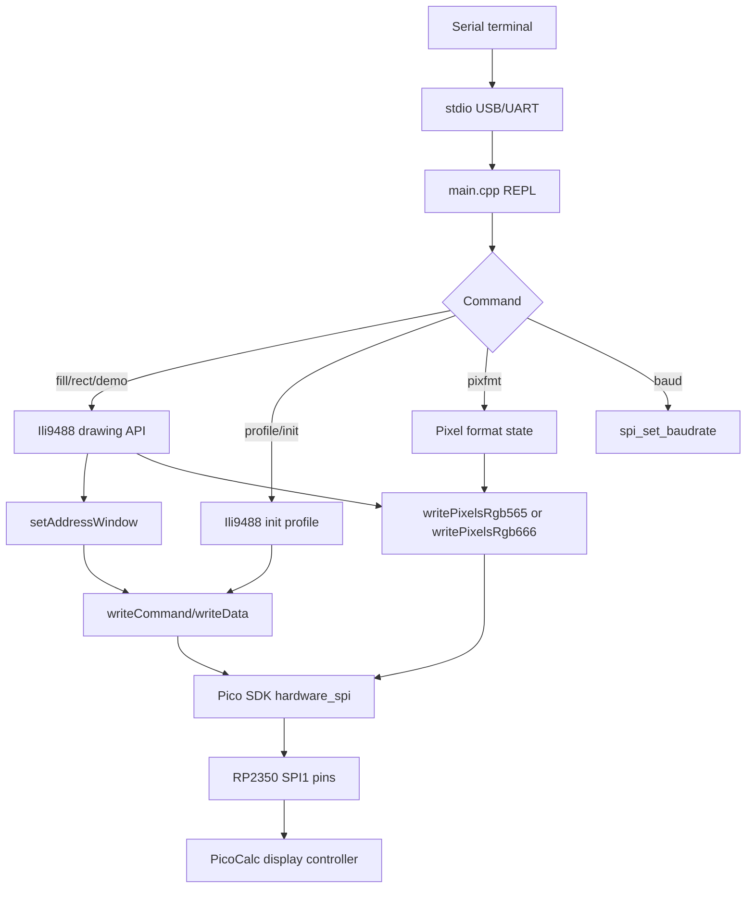
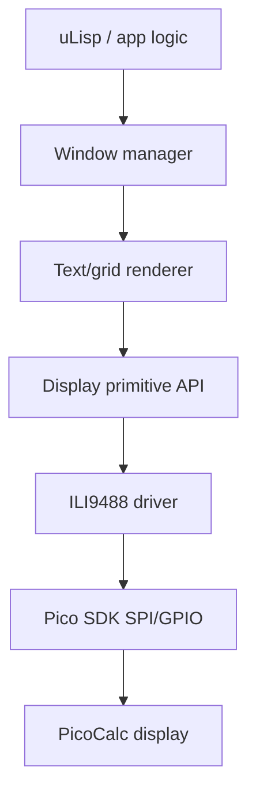

# PicoCalc Pico SDK Display Bring-up: ILI9488 Serial REPL Deep Dive

This article explains the PicoCalc display bring-up project that moved from an Arduino/TFT_eSPI-dependent display path toward a standalone C++ Pico SDK smoke-test firmware. The immediate output is a small RP2350 firmware that talks to the PicoCalc display, exposes a serial debugging REPL, and draws primitive graphics without Arduino. The larger purpose is to understand the display stack well enough to remove the `TFT_eSPI` dependency from the uLisp PicoCalc firmware later.

> [!summary]
> - The display is controlled through an SPI command/data protocol: select an address window, then stream pixel bytes into it.
> - The firmware now has a serial REPL, because a blank display must not mean a silent system.
> - Hardware testing showed the PicoCalc works well with the `minimal` profile, inversion on, RGB565 or RGB666 pixel formats, and an actual SPI baudrate of 75 MHz.
> - The original TFT_eSPI ILI9488 source remains important because it documents the full initialization table and the 18-bit SPI path.

## Why this project exists

The existing uLisp PicoCalc firmware uses Arduino-Pico and TFT_eSPI for display work. That is practical for an initial port, but it hides the hardware protocol behind a large library boundary. When the goal is to make the firmware smaller, clearer, and more directly controlled by Pico SDK code, the display layer is the right place to start. It is also the risky place to start, because display failure often produces no visible error. If the screen remains black, the firmware might have crashed, the display reset might be wrong, the data/command pin might be inverted, the pixel format might be wrong, or the address window might not match the visible panel.

The project therefore starts with a smoke test rather than a window manager. A smoke test is not a partial window manager. It is a hardware proof: initialize the bus, initialize the panel, draw full-screen colors, draw rectangles, and keep enough serial output to know what the firmware is doing. Once that works, text rendering and windowing can be built on a known display path.

The current implementation lives in a new standalone repository inside the main working tree:

```text
/home/manuel/code/wesen/2026-05-05--ulisp-picocalc/pico-sdk-picocalc-wm
```

It has its own Git history:

```text
e82a6c9 Add PicoCalc display smoke-test REPL
4f1765a Add TFT_eSPI ILI9488 profile and pixel modes
b33a59a Default to stable PicoCalc display settings
```

The parent repository also gained top-level build and deployment rules:

```text
c7c06b6 Add PicoCalc WM firmware flash targets
```

## The hardware and software boundary

The target board is RP2350 / Pico 2-class hardware. The display is driven through Pico SDK `hardware_spi`, not Arduino `SPI`. The debug interface uses Pico SDK stdio over USB/UART, not Arduino `Serial`. The code intentionally avoids Arduino headers and libraries.

The current display pin assumptions come from the existing TFT_eSPI setup file:

```text
ulisp-picocalc/Setup60_RP2040_ILI9488.h
```

The relevant pins are:

| Signal | GPIO | Role |
| --- | ---: | --- |
| SCK | 10 | SPI clock for display writes. |
| MOSI | 11 | SPI data from RP2350 to the display. |
| MISO | 12 | Display read path; configured but not required for first write-only tests. |
| CS | disabled by default | The setup says GPIO 13 is not connected, so the driver treats CS as optional. |
| DC | 14 | Data/command select. Low means command; high means data. |
| RST | 15 | Display reset. |
| SPI instance | `spi1` | Pico SDK hardware SPI peripheral. |

The stable hardware feedback so far is important:

- `profile minimal` works well.
- `invert on` is required for correct colors.
- Both `pixfmt 565` and `pixfmt 666` work.
- `baud 25000000` works.
- Requests above 75 MHz are quantized by the Pico SDK/RP2350 SPI divider to `actual=75000000`, and 75 MHz is stable on the tested PicoCalc.

That last point means the practical maximum in the current clock configuration is not the requested number; it is the actual value printed by `spi_set_baudrate()`.

## Project layout

The standalone smoke-test repository is deliberately small:

```text
pico-sdk-picocalc-wm/
├── CMakeLists.txt
├── README.md
├── pico_sdk_import.cmake
└── src/
    ├── main.cpp
    └── display/
        ├── color.hpp
        ├── ili9488.hpp
        └── ili9488.cpp
```

The division of responsibility is direct:

- `CMakeLists.txt` declares a Pico SDK C++17 firmware target, defaults to `PICO_BOARD=pico2`, links `pico_stdlib` and `hardware_spi`, and enables USB/UART stdio.
- `main.cpp` owns the serial REPL and calls display operations in response to commands.
- `display/color.hpp` defines RGB565 color constants and helpers.
- `display/ili9488.hpp` declares the display driver API, pixel-format modes, init profiles, and pin defaults.
- `display/ili9488.cpp` implements SPI initialization, reset, panel initialization, address windows, pixel streaming, and filled rectangles.

The parent `Makefile` provides convenience targets:

```text
wm-firmware-configure
wm-firmware-build
wm-firmware-flash
flash-wm
```

The normal build command is:

```bash
make wm-firmware-build
```

The one-step build/copy/sync/unmount command for the UF2 Loader SD card is:

```bash
make flash-wm
```

## The core protocol: commands, data, and address windows

The ILI9488 is not controlled by writing C++ drawing objects to memory. It is controlled by an SPI byte stream. The display has a data/command signal, usually called `DC`, that changes the interpretation of the next byte.

| DC level | Interpretation | Example |
| --- | --- | --- |
| Low | Command byte | `0x2A` means Column Address Set. |
| High | Data byte | Four bytes after `0x2A` define the start and end columns. |

A driver therefore needs two primitive write operations:

```cpp
void writeCommand(uint8_t command);
void writeData(const uint8_t *data, size_t len);
```

Everything else is built from those two operations. To draw a rectangle, the driver first selects a rectangular address window. Then it issues `Memory Write` and streams enough pixel bytes to fill that window.

```text
0x2A  Column Address Set
      x0 high, x0 low, x1 high, x1 low

0x2B  Page Address Set
      y0 high, y0 low, y1 high, y1 low

0x2C  Memory Write
      pixel bytes until the selected window is full
```

The implementation is correspondingly simple:

```cpp
void setAddressWindow(uint16_t x0, uint16_t y0, uint16_t x1, uint16_t y1) {
  uint8_t col[] = {
    uint8_t(x0 >> 8), uint8_t(x0),
    uint8_t(x1 >> 8), uint8_t(x1),
  };
  uint8_t row[] = {
    uint8_t(y0 >> 8), uint8_t(y0),
    uint8_t(y1 >> 8), uint8_t(y1),
  };

  writeCommandData(0x2A, col, sizeof(col));
  writeCommandData(0x2B, row, sizeof(row));
  writeCommand(0x2C);
}
```

Then a filled rectangle is just clipping, address-window setup, and a repeated pixel stream:

```cpp
void fillRect(uint16_t x, uint16_t y, uint16_t w, uint16_t h, uint16_t color) {
  if (w == 0 || h == 0) return;
  if (x >= width || y >= height) return;

  uint16_t clipped_w = min(w, width - x);
  uint16_t clipped_h = min(h, height - y);
  setAddressWindow(x, y, x + clipped_w - 1, y + clipped_h - 1);
  writePixels(color, size_t(clipped_w) * clipped_h);
}
```

This is the foundation for the later window manager. Text, borders, scrolling panes, and REPL cells all reduce to filled rectangles and glyph pixels at the bottom of the stack.

## Initialization profiles

The firmware has two initialization profiles. A profile is the command sequence used to configure the panel after reset. It is not the same as a pixel format.

```text
profile minimal
profile tftespi
```

The `minimal` profile sends only the commands needed to wake the display and make primitive drawing work:

```text
Software Reset
Sleep Out
Pixel Format
MADCTL
Inversion On
Display On
```

This profile works well on the tested PicoCalc. It is also easier to reason about because it changes fewer controller registers.

The `tftespi` profile ports the full ILI9488 initialization table from the local Arduino library:

```text
/home/manuel/Arduino/libraries/TFT_eSPI/TFT_Drivers/ILI9488_Init.h
```

That profile configures gamma, power control, VCOM, frame behavior, display-function control, entry mode, and adjust control before sending Sleep Out and Display On. It exists because the original Arduino firmware compiled that driver source, so it is the best local record of TFT_eSPI's known ILI9488 behavior.

The profile command is useful during hardware work because it allows this kind of test without reflashing:

```text
profile minimal
demo
profile tftespi
demo
```

If both profiles work, the display is tolerant of both initialization paths. If one profile works and the other fails, the difference becomes useful evidence.

## Pixel formats

The firmware has two pixel streaming formats:

```text
pixfmt 565
pixfmt 666
```

RGB565 is a two-byte format:

```text
rrrrrggg gggbbbbb
```

It stores red in 5 bits, green in 6 bits, and blue in 5 bits. It is compact and convenient for embedded software, so `color.hpp` exposes colors as RGB565 constants.

RGB666 is a three-byte path used by TFT_eSPI's ILI9488 SPI mode. The TFT_eSPI init table sets:

```text
0x3A = 0x66
```

That means the panel expects three bytes per pixel. The new Pico SDK driver still accepts a RGB565 color as the public API type, but in `pixfmt 666` it expands that color into three bytes before writing it.

```cpp
void rgb565ToRgb666Bytes(uint16_t rgb565, uint8_t *out) {
  out[0] = expand5To8(rgb565 >> 11);
  out[1] = expand6To8(rgb565 >> 5);
  out[2] = expand5To8(rgb565);
}
```

This split is important. The application can keep using simple RGB565 constants such as `kRed`, `kGreen`, and `kBlue`; the driver decides how those colors are serialized for the active panel mode.

Hardware testing showed both formats work on the current PicoCalc. Because `profile minimal` with RGB565 is stable and sends fewer bytes per pixel, it is now the default.

## Inversion and color correctness

The display needs inversion enabled for colors to be correct on the tested hardware. This matches an important clue in the existing uLisp Arduino initialization, which called:

```cpp
tft.invertDisplay(1);
```

The serial REPL exposes this directly:

```text
invert on
invert off
```

Inversion here is a display-controller command, not a color conversion in the firmware. If inversion is wrong, full-screen fills may appear with incorrect color behavior even though SPI writes and address windows are correct.

The current stable default keeps inversion on in the minimal profile. The practical hardware sequence is:

```text
profile minimal
invert on
pixfmt 565
demo
```

The explicit `invert on` is usually unnecessary after `profile minimal`, but it is useful when testing because it records intent in the serial session.

## SPI baudrate behavior on RP2350

The serial command:

```text
baud <hz>
```

calls:

```cpp
spi_set_baudrate(spi, requested_hz)
```

The Pico SDK returns the actual baudrate selected by the hardware divider. That actual value is what matters.

Hardware testing showed this behavior:

```text
picocalc> baud 625000000
requested=625000000 actual=75000000

picocalc> baud 80000000
requested=80000000 actual=75000000

picocalc> baud 100000000
requested=100000000 actual=75000000
```

The requested values above 75 MHz all quantize to 75 MHz in the current RP2350 clock configuration. The display remained stable at that actual baudrate, so the default was updated to:

```cpp
constexpr uint kDefaultBaudrate = 75'000'000;
```

The important rule is to trust the printed `actual` value, not the requested value. The SPI peripheral derives the clock from the system clock through hardware dividers. Not every requested frequency is representable, and high values may converge to the same maximum actual value.

## The serial REPL as test equipment

The REPL is part of the firmware because display bring-up needs feedback even when the display fails. It is enabled through Pico SDK stdio:

```cmake
pico_enable_stdio_usb(pico_sdk_picocalc_wm 1)
pico_enable_stdio_uart(pico_sdk_picocalc_wm 1)
```

For UART, use:

```text
115200 8N1
```

USB CDC serial does not depend on the electrical UART baudrate, but terminal programs still usually ask for a baud value; 115200 is the expected setting.

The main commands are:

```text
help
status
demo
fill red
fill green
fill blue
bars
quads
nested
rect 10 10 100 50 yellow
invert on
rotate 0
pixfmt 565
pixfmt 666
profile minimal
profile tftespi
baud 75000000
reset
init
reboot
```

The command loop is synchronous. A command runs to completion before the next prompt. That is the correct behavior for a bring-up firmware because it makes serial logs correspond directly to hardware actions.

## Data flow through the firmware

The complete runtime path is small enough to draw directly.



The design keeps the command parser and the panel driver separate. `main.cpp` knows command names, argument parsing, and diagnostic output. `ili9488.cpp` knows panel commands, pixel formats, and SPI writes. That boundary matters because the later window manager should depend on the display API, not on serial command parsing.

## Build and deployment

The top-level Makefile now has targets for this firmware:

```bash
make wm-firmware-build
```

This configures and builds:

```text
pico-sdk-picocalc-wm -> build-pico-sdk-picocalc-wm/pico_sdk_picocalc_wm.uf2
```

The target board is:

```text
PICO_BOARD=pico2
PICO_PLATFORM=rp2350-arm-s
```

The UF2 Loader SD card workflow is:

```bash
make wm-firmware-flash
```

This builds, mounts if necessary, copies to `pico2-apps/`, and leaves the card mounted.

The one-step build/copy/sync/unmount target is:

```bash
make flash-wm
```

The implementation intentionally matches the existing Wi-Fi REPL deployment style, so the smoke-test firmware fits into the same operational workflow.

## Current status

The firmware builds successfully and produces:

```text
build-pico-sdk-picocalc-wm/pico_sdk_picocalc_wm.uf2
```

The current stable defaults are:

```text
PICO_BOARD:      pico2
SPI baud actual: 75 MHz
profile:         minimal
pixel format:    RGB565 / two-byte writes
inversion:       on in the minimal profile
```

The hardware observations so far are:

- The `minimal` profile is good.
- Inversion must be on for correct colors.
- RGB565 and RGB666 pixel formats both work.
- 75 MHz actual SPI baudrate is stable.

These observations should be treated as implementation facts for the current PicoCalc hardware, not as universal ILI9488 facts. The serial REPL remains valuable because it keeps these settings testable on other units.

## Failure modes to remember

| Symptom | Likely cause | First test |
| --- | --- | --- |
| Serial prompt appears but screen is blank | Init profile, inversion, pixel format, reset, or address-window problem. | `profile minimal`, `invert on`, `pixfmt 565`, `fill white`. |
| Colors are wrong but drawing positions are correct | Inversion or BGR/MADCTL issue. | `invert on`, `bars`, `rotate 0`. |
| Drawing appears shifted or mirrored | MADCTL rotation bits or visible dimension assumption. | `rotate 0`, `rotate 1`, `quads`. |
| High requested baudrate always reports 75 MHz | RP2350 SPI divider quantization. | Trust the printed `actual` baudrate. |
| `pixfmt 666` is slower | Three-byte pixels send 50% more data than RGB565. | Use `pixfmt 565` if it is visually correct. |
| Full TFT_eSPI profile behaves differently from minimal | Analog/panel register differences in the full init table. | Compare `profile minimal` and `profile tftespi` with the same `pixfmt`. |

## Why this matters for the future window manager

The eventual window manager should not know about ILI9488 gamma registers, `COLMOD`, `MADCTL`, or SPI dividers. It should ask for operations such as `fillRect`, `drawGlyph`, and later `copyRect` or `scrollRegion`. This smoke-test project establishes that lower layer first.

The future stack should look like this:



The important dependency direction is downward. uLisp should not depend on TFT_eSPI. The window manager should not depend on serial debugging. The renderer should not know whether the panel is using RGB565 or RGB666 on the wire. Each layer should consume a smaller, clearer API from the layer below it.

## Working rules from this phase

- Keep serial feedback in every hardware bring-up firmware.
- Print actual hardware settings, not only requested settings.
- Keep init profile and pixel format separate in the API.
- Use the smallest profile that works as the default, but keep the known library profile available for comparison.
- Treat display inversion as a hardware setting that must be tested, not as a cosmetic option.
- Use RGB565 as the public color type unless a higher-level renderer needs more precision.
- Convert public colors into the active wire format inside the driver.
- Commit the standalone Pico SDK firmware separately from parent-repository deployment rules.

## Important files

```text
pico-sdk-picocalc-wm/src/main.cpp
pico-sdk-picocalc-wm/src/display/ili9488.hpp
pico-sdk-picocalc-wm/src/display/ili9488.cpp
pico-sdk-picocalc-wm/src/display/color.hpp
pico-sdk-picocalc-wm/README.md
Makefile
docs/picocalc-picosdk-wm-sketch/ili9488-reference.md
ttmp/2026/05/09/picocalc-picosdk-wm-sketch--create-pico-sdk-picocalc-window-manager-sketch/
```

## Near-term next steps

The next useful implementation step is a benchmark command:

```text
bench
```

It should measure full-screen fills and print:

```text
profile=minimal
pixfmt=565
baud actual=75000000
fill black: N ms
fill white: N ms
throughput: N pixels/sec, N bytes/sec
```

That will turn subjective visual testing into repeatable measurement. After that, the display layer is ready for a tiny bitmap font and a text grid. The window manager should begin only after those two pieces are stable.
