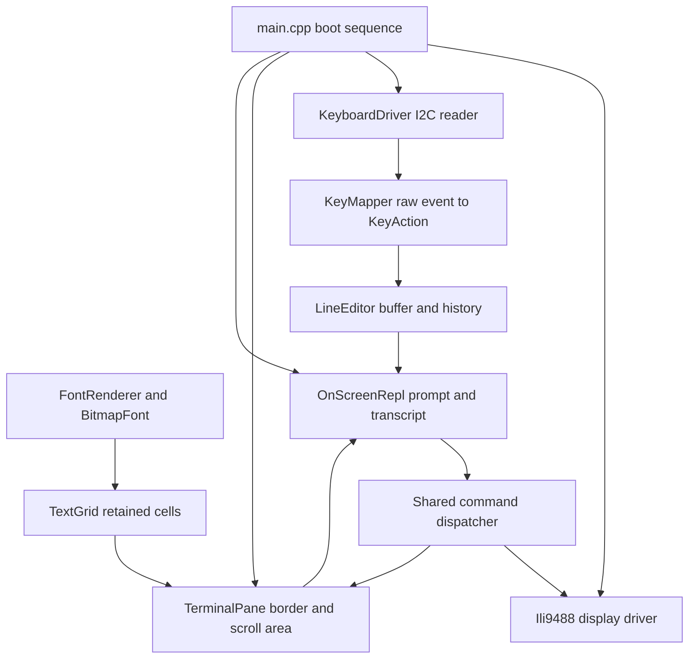
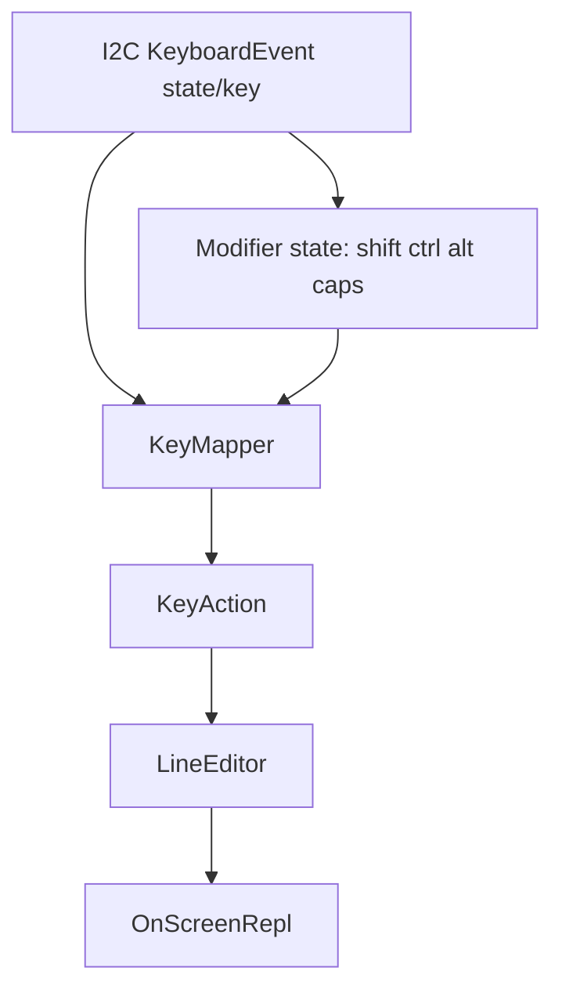
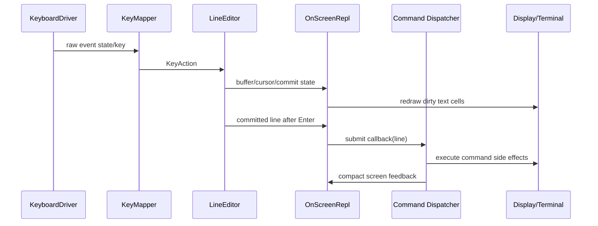

# PicoCalc Pico SDK Firmware Deep Dive: Drawing, Keyboard Input, and the On-Screen REPL

This article explains the standalone Pico SDK PicoCalc firmware that grew out of the display bring-up work. The implementation replaces the Arduino/TFT_eSPI path with direct C++ Pico SDK code for the display, keyboard, text grid, terminal pane, font rendering, and on-screen REPL. The goal is to describe the system at the level a future maintainer needs: what each layer owns, how data moves through the firmware, why the boundaries exist, and where the tricky hardware behavior appears.

> [!summary]
> - The display path is built from three primitive operations: command writes, address-window selection, and repeated pixel streaming.
> - The keyboard path separates raw I2C events from semantic key actions, so hardware-specific byte codes do not leak into the line editor.
> - The REPL is an on-screen command surface that shares the serial command dispatcher, supports history and editing shortcuts, and keeps serial available as a debug path.
> - The firmware remains Pico SDK only: no Arduino, no TFT_eSPI, no `Wire`, and no Arduino `SPI`.

## Why this note exists

The PicoCalc uLisp stack originally used Arduino infrastructure and TFT_eSPI for display output. That was a useful starting point because it proved the hardware path, but it also coupled the firmware to Arduino APIs, TFT_eSPI's display abstraction, and the previous terminal assumptions. The new firmware exists to build the PicoCalc interface directly on the Pico SDK. That means every layer has to be made explicit: SPI transactions, ILI9488 initialization, text rendering, I2C keyboard polling, key mapping, editing, and command dispatch.

This project is not only a port. A direct Pico SDK implementation exposes the real contracts. The display controller does not receive “draw rectangle” calls; it receives command bytes, address coordinates, and pixel streams. The keyboard controller does not produce high-level editor commands; it produces raw byte events through an I2C FIFO. The REPL does not become usable just because characters appear on the screen; it needs a line editor, cursor behavior, history, repeat handling, and a way to execute commands. The implementation is valuable because it turns each of those facts into a small, reviewable subsystem.

## Repository and source map

The firmware lives in:

```text
/home/manuel/code/wesen/2026-05-05--ulisp-picocalc/pico-sdk-picocalc-wm
```

The most important source files are:

```text
src/display/ili9488.hpp
src/display/ili9488.cpp
src/input/keyboard.hpp
src/input/keyboard.cpp
src/input/keymap.hpp
src/input/keymap.cpp
src/ui/font.hpp
src/ui/font.cpp
src/ui/text_grid.hpp
src/ui/text_grid.cpp
src/ui/terminal_pane.hpp
src/ui/terminal_pane.cpp
src/ui/line_editor.hpp
src/ui/line_editor.cpp
src/ui/on_screen_repl.hpp
src/ui/on_screen_repl.cpp
src/main.cpp
```

The code is intentionally organized around hardware and UI boundaries. `display` owns SPI and ILI9488 protocol. `input` owns I2C and raw-key conversion. `ui` owns text rendering, editing, and the on-screen REPL. `main.cpp` owns boot, serial commands, and wiring.



The diagram shows the main design rule: raw device details move upward into semantic events, while drawing moves downward into progressively lower-level display operations. The REPL sits in the middle. It accepts semantic key actions, renders text through the grid, and sends committed lines back to the shared firmware command dispatcher.

## The display foundation: commands, windows, and pixels

The ILI9488 display driver is built around the actual display protocol. The panel is not treated as a framebuffer. The firmware selects an address window, sends the `Memory Write` command, and streams pixels into that rectangular region. Higher-level drawing operations are thin layers over that operation.

The default display configuration is defined in `src/display/ili9488.hpp`:

```cpp
constexpr uint16_t kDisplayWidth = 320;
constexpr uint16_t kDisplayHeight = 320;
constexpr uint kDisplaySck = 10;
constexpr uint kDisplayMosi = 11;
constexpr uint kDisplayMiso = 12;
constexpr int kDisplayCs = -1;
constexpr uint kDisplayDc = 14;
constexpr uint kDisplayRst = 15;
constexpr uint kDefaultBaudrate = 75'000'000;
```

The important points are explicit. The firmware uses `spi1`, GPIO 10/11/12 for SPI signals, GPIO 14 for data/command selection, and GPIO 15 for reset. Chip select is disabled because the existing PicoCalc display setup marks GPIO 13 as not connected. The default SPI baudrate is 75 MHz because hardware testing showed that higher requested rates quantize to 75 MHz and this rate is stable on the tested PicoCalc.

The display driver has two initialization profiles:

```cpp
enum class InitProfile : uint8_t {
  TftEspiIli9488,
  MinimalRgb565,
};
```

The `TftEspiIli9488` profile preserves the known TFT_eSPI initialization sequence as a reference and fallback. The `MinimalRgb565` profile is the hardware-validated default. It performs software reset, sleep out, RGB565 pixel format selection, rotation setup, inversion-on, and display-on. The minimal profile matters because it is easier to reason about. Every command in it is required for the visible path that was tested.

The initialization sequence is small enough to read directly:

```cpp
void Ili9488::initMinimalRgb565() {
  writeCommand(kCmdSoftwareReset);
  sleep_ms(150);
  writeCommand(kCmdSleepOut);
  sleep_ms(150);
  setPixelFormat(PixelFormat::Rgb565);
  setRotation(0);
  invertDisplay(true);
  writeCommand(kCmdDisplayOn);
  sleep_ms(50);
}
```

The inversion step is not decorative. Hardware testing showed that `invert on` is required for correct colors on the PicoCalc display. The final defaults therefore encode measured behavior rather than only datasheet expectations.

### Address windows are the central drawing primitive

Every filled rectangle starts by clipping coordinates, selecting an address window, and streaming a repeated color. The address-window operation sends column and row bounds to the panel:

```cpp
void Ili9488::setAddressWindow(uint16_t x0, uint16_t y0,
                               uint16_t x1, uint16_t y1) {
  uint8_t col[] = {
      static_cast<uint8_t>(x0 >> 8), static_cast<uint8_t>(x0 & 0xFF),
      static_cast<uint8_t>(x1 >> 8), static_cast<uint8_t>(x1 & 0xFF),
  };
  uint8_t row[] = {
      static_cast<uint8_t>(y0 >> 8), static_cast<uint8_t>(y0 & 0xFF),
      static_cast<uint8_t>(y1 >> 8), static_cast<uint8_t>(y1 & 0xFF),
  };

  writeCommandData(kCmdColumnAddressSet, col, sizeof(col));
  writeCommandData(kCmdPageAddressSet, row, sizeof(row));
  writeCommand(kCmdMemoryWrite);
}
```

After this, pixel data belongs to that window. A full-screen fill is just a rectangle whose window covers the screen. A border is a few thin rectangles. A glyph is a set of 1-pixel rectangles inside a cell. The whole drawing stack reduces to this contract.


This design keeps primitive drawing simple. It does not require a framebuffer, DMA, sprites, or a retained scene graph. Those can be added later, but the first reliable firmware should prove the command/data path and pixel encoding before adding more machinery.

### Pixel formats are a controlled variable

The firmware supports RGB565 and RGB666:

```cpp
enum class PixelFormat : uint8_t {
  Rgb565 = 0x55,
  Rgb666 = 0x66,
};
```

RGB565 streams two bytes per pixel. RGB666 streams three bytes per pixel after expanding the 5-bit and 6-bit components into 8-bit channel values. Supporting both formats was useful during bring-up because ILI9488 modules are often sensitive to pixel-format assumptions. Hardware testing showed that both work, but RGB565 is the default because it is faster and matches the chosen minimal initialization path.

The driver keeps the conversion explicit:

```cpp
uint8_t expand5To8(uint16_t value) {
  value &= 0x1Fu;
  return static_cast<uint8_t>((value << 3u) | (value >> 2u));
}

uint8_t expand6To8(uint16_t value) {
  value &= 0x3Fu;
  return static_cast<uint8_t>((value << 2u) | (value >> 4u));
}
```

The important implementation rule is that the panel's `COLMOD` setting and the host's pixel stream must agree. If the display is configured for RGB565 and the host streams three bytes per pixel, every subsequent pixel boundary is wrong. If the display is configured for RGB666 and the host streams two bytes per pixel, the panel consumes the stream with the wrong grouping. The `PixelFormat` enum exists to keep those two decisions tied together.

## From drawing primitives to a terminal

Once rectangles work, text becomes a question of retained cells and glyph rendering. The firmware does not render strings directly into a global screen buffer. It keeps a `TextGrid` of cells, marks changed cells dirty, and redraws only those cells through the selected bitmap font.

A text cell stores the character and colors:

```cpp
struct TextCell {
  char ch = ' ';
  uint16_t fg = display::kGreen;
  uint16_t bg = display::kBlack;
  bool dirty = true;
};
```

The retained grid solves a specific problem: terminal operations change logical cells, not arbitrary pixels. When the cursor moves, only the old cursor cell and new cursor cell need to be redrawn. When a line scrolls, cell contents move up and become dirty. When a status row changes, only that row is touched. This is not a full GUI toolkit; it is the smallest retained model needed for terminal behavior.

The renderer currently supports several bitmap fonts:

```text
font small     -> custom 5x7 glyphs in 8x8 cells
font vga8x8    -> VGA 8x8 ASCII
font ulisp     -> Adafruit/TFT_eSPI GLCD-style 5x8 glyph in 6x10 cell
font term6x12  -> Terminus 6x12
font medium    -> Terminus 8x14
font large     -> Terminus 8x16
```

The default is now `font ulisp`, because it matches the original uLisp terminal metrics most closely. The point of the font abstraction is not only visual preference. Font size changes terminal geometry. A 6x10 cell yields more columns and rows than an 8x16 cell; the pane border and grid dimensions must be recomputed when the font changes.

The generic renderer works with row-oriented glyph data:

```cpp
void FontRenderer::drawGlyph(Ili9488 &display, const BitmapFont &font,
                             uint16_t x, uint16_t y, char ch,
                             uint16_t fg, uint16_t bg) {
  display.fillRect(x, y, font.cell_width, font.cell_height, bg);
  // For each row, draw set bits as foreground pixels.
}
```

The `TerminalPane` wraps the grid with a border. The `OnScreenRepl` reserves a status row at the top and an input row at the bottom. Everything between those rows is transcript output. This layout is simple, but it establishes the same separation used elsewhere: the grid manages cells, the pane manages geometry, and the REPL manages meaning.

## Keyboard protocol: raw I2C events first

The PicoCalc keyboard is controlled by a separate STM32 microcontroller. The Pico reads it over I2C at address `0x1F`, using I2C1 on GPIO6/GPIO7 at 10 kHz. The firmware reads two important registers:

```cpp
constexpr uint8_t kRegKeyStatus = 0x04;
constexpr uint8_t kRegFifo = 0x09;
```

The status register contains FIFO count and lock-state bits. The FIFO register returns one key event at a time. The event has a state byte and a key byte:

```cpp
struct KeyboardEvent {
  uint8_t state = 0;
  uint8_t key = 0;
  bool valid = false;

  bool pressed() const { return valid && state == 1; }
  bool repeated() const { return valid && state == 2; }
  bool released() const { return valid && state == 3; }
};
```

The driver deliberately does not interpret the key byte. Its job is transport: initialize I2C, select a register, read bytes, count errors, and expose raw events. This boundary is important because the keyboard protocol has hardware-specific codes that do not belong in the editor. For example, left Shift is `0xA2`, right Shift is `0xA3`, Delete is `0xD4`, and End is `0xD5`. Those bytes are facts about the keyboard controller, not facts about line editing.

The polling path is small:

```cpp
bool KeyboardDriver::pollEvent(KeyboardEvent *event) {
  event->valid = false;
  uint8_t status = 0;
  if (!readStatus(&status)) return false;
  if (fifoCount(status) == 0) return false;

  uint8_t bytes[2] = {0, 0};
  if (!readRegister(kRegFifo, bytes, sizeof(bytes))) return false;
  if (bytes[0] == 0 && bytes[1] == 0) return false;

  event->state = bytes[0];
  event->key = bytes[1];
  event->valid = true;
  return true;
}
```

The driver reads status first because polling an empty FIFO should not manufacture events. It then reads exactly two bytes from the FIFO. The rest of the system treats this as an input event stream.

## Key mapping: raw bytes become editor actions

The `KeyMapper` converts raw keyboard events into `KeyAction` values. This is where modifier state, shifted punctuation, cursor keys, function keys, and control shortcuts are handled.

The mapping layer owns constants such as:

```cpp
constexpr uint8_t kKeyLeftShift = 0xA2;
constexpr uint8_t kKeyRightShift = 0xA3;
constexpr uint8_t kKeyLeftCtrl = 0xA5;
constexpr uint8_t kKeyLeft = 0xB4;
constexpr uint8_t kKeyUp = 0xB5;
constexpr uint8_t kKeyDown = 0xB6;
constexpr uint8_t kKeyRight = 0xB7;
constexpr uint8_t kKeyHome = 0xD2;
constexpr uint8_t kKeyDelete = 0xD4;
constexpr uint8_t kKeyEnd = 0xD5;
```

The result of mapping is independent of the physical keyboard:

```cpp
KeyActionType::Insert
KeyActionType::Backspace
KeyActionType::Delete
KeyActionType::Left
KeyActionType::Right
KeyActionType::Home
KeyActionType::End
KeyActionType::HistoryPrevious
KeyActionType::HistoryNext
KeyActionType::Clear
KeyActionType::KillToEnd
KeyActionType::Help
KeyActionType::Status
KeyActionType::Redraw
```

This design is what allows serial simulation commands such as `key left`, `key enter`, and `keys (+ 1 2)` to exercise the same editor path as the physical keyboard. A test path that bypasses the real editor would be less useful. Here, serial simulation creates `KeyAction` values, and the keyboard mapper creates `KeyAction` values. From the line editor's perspective, they are the same class of input.



A subtle point is that some shifted keys are not represented as base key plus Shift. Hardware traces showed that Shift+Tab emits `0xD2` for Home, and Shift+Delete emits `0xD5` for End. The keymap therefore maps those transformed codes directly. Trying to infer Home from “Tab while Shift is held” would not work reliably because the keyboard controller already performed the transformation.

## Repeat handling: the host takes control

Held keys require special care. The upstream keyboard firmware defines `KEY_HOLD_TIME` as 300 ms and repeats about every 100 ms after hold begins. For many printable and navigation keys, the controller's hold path sends another pressed event rather than a cleanly separate repeat event. That means the host can see this sequence while one physical key remains down:

```text
pressed key=A
pressed key=A
pressed key=A
released key=A
```

If the host accepted every repeated press frame, repeat timing would be controlled by the keyboard controller. If the host also generated its own repeat, each held key could repeat twice. The Pico SDK firmware now handles this by tracking the currently down physical key. Repeated press frames for the same key before release are suppressed, and host-side repeat is generated with configurable timing.

The runtime command is:

```text
repeat status
repeat on
repeat off
repeat <delay_ms> <interval_ms>
```

The default is:

```text
delay    180 ms
interval 60 ms
```

The repeat policy only applies to safe editing actions:

```text
Insert, Backspace, Delete, Left, Right, Home, End
```

It does not repeat Enter, Esc, Caps Lock, Shift, Ctrl, Alt, function keys, or history navigation. Those actions either have side effects that should not multiply automatically or need a more deliberate policy.

The important lesson is that the keyboard protocol exposes enough information to build a good host policy, but not enough to rely entirely on controller-side configuration. The upstream register table includes debounce and frequency registers, but the observed I2C receive handler does not implement active cases for changing those values. Host-side repeat is therefore the safer control point.

## The line editor: a small state machine

The line editor owns a fixed-size input buffer, cursor position, committed line, and fixed-size history. It is intentionally heap-free. A PicoCalc command prompt should not require dynamic allocation for ordinary editing.

The central operation is `handle(KeyAction)`:

```cpp
bool LineEditor::handle(KeyAction action) {
  switch (action.type) {
    case KeyActionType::Insert: return insert(action.ch);
    case KeyActionType::Backspace: return backspace();
    case KeyActionType::Delete: return deleteAtCursor();
    case KeyActionType::Left: ...
    case KeyActionType::Right: ...
    case KeyActionType::Home: ...
    case KeyActionType::End: ...
    case KeyActionType::Enter: commit(); return true;
    case KeyActionType::HistoryPrevious: return historyPrevious();
    case KeyActionType::HistoryNext: return historyNext();
    ...
  }
}
```

The editor does not know about I2C. It does not know about display pixels. It does not know about command execution. It knows how to transform an input line. That narrow responsibility is why the same editor can be driven by serial simulation, physical keyboard events, and future UI controls.

Command history is stored as a ring. Empty commands are not added, and duplicate consecutive commands are ignored. Up and Down navigate history. In the current mapping, physical Up is `HistoryPrevious` and physical Down is `HistoryNext`.

The editor also stores a committed line and a one-shot committed flag. A previous bug showed why this matters: if the committed flag is not cleared after the REPL consumes it, every later keypress appears to submit the previous line again. The fixed invariant is simple: commit is an edge-triggered notification. The REPL copies the line, clears the flag, and then dispatches the command.

## The on-screen REPL: transcript, prompt, status, dispatch

The on-screen REPL is the composition layer. It owns the screen-facing behavior: status row, transcript output, prompt rendering, input row, cursor rendering, and submit callback. It does not implement display primitives or I2C protocol.

The layout is:

```text
row 0              status row
rows 1..N-2        transcript output
last row           prompt and editable input
```

When the input changes, the REPL clears the prompt row and rewrites prompt plus current editor text. The cursor is rendered by asking the `TextGrid` to invert the active cell. This is cheaper and simpler than drawing a separate cursor object because the grid already knows how to redraw dirty cells.

When the user presses Enter, the editor commits the line. The REPL copies the committed text, clears the commit flag, prints the prompt and line into the transcript, and invokes a submit callback:

```cpp
void OnScreenRepl::commitIfNeeded() {
  if (!editor_.committed()) return;
  char line[kLineEditorCapacity];
  std::snprintf(line, sizeof(line), "%s", editor_.committedLine());
  editor_.clearCommitted();

  print(prompt_);
  print(line);
  print("\n");

  if (submit_handler_) {
    submit_handler_(submit_user_, line);
  }
}
```

The callback lives in `main.cpp`, where command parsing and firmware command dispatch already exist. This keeps the REPL reusable. It does not need to know how to parse `fill red`, `bench 10`, `invert on`, or `font large`; it only reports that a line was submitted.



The same command dispatcher is used by serial input and screen input. This is a practical decision. Serial remains the recovery path when the display or keyboard path is being tested. The on-screen REPL becomes a local command surface without duplicating every command implementation.

Some commands still print detailed output to serial because the early command handlers use `printf`. The screen callback adds compact on-screen feedback for common commands such as `help`, `status`, and `clear`, and it executes the same side effects for display and terminal commands. A future improvement would be to introduce an output sink abstraction so every command can write structured output to serial, screen, or both.

## Command surface

The firmware now exposes a combined serial and on-screen command surface. Important commands include:

```text
status
help
demo
bench [loops]
fill <color>
rect <x> <y> <w> <h> <color>
bars
quads
nested
invert on|off
rotate <0-3>
pixfmt 565|666
profile tftespi|minimal
baud <hz>
kbd status
kbd poll
kbd raw on|off
font small|vga8x8|ulisp|term6x12|medium|large
repeat status|on|off|<delay_ms> <interval_ms>
repl
key <action>
keys <text...>
term <text...>
termclear
termrender
reboot
```

The command surface is both a user feature and a hardware validation tool. During display bring-up, `fill`, `rect`, `bars`, and `baud` helped isolate panel behavior. During keyboard bring-up, `kbd raw on` made it possible to record exact raw key codes. During REPL work, `key` and `keys` allowed editor logic to be tested without relying on every physical key mapping being complete.

## Hardware-driven decisions

Several defaults are based on observed PicoCalc behavior:

| Area | Decision | Reason |
|---|---|---|
| Display init | `minimal-rgb565` | It produced the best hardware result and is easy to reason about. |
| Display inversion | on | Required for correct colors on the tested panel. |
| SPI baudrate | 75 MHz | Requests above this quantize to 75 MHz and this rate was stable. |
| Pixel format | RGB565 | Both RGB565 and RGB666 work; RGB565 is faster and simpler. |
| Default font | `ulisp` | Closest to the original uLisp/TFT_eSPI terminal metrics. |
| Keyboard bus | I2C1, GPIO6/GPIO7, 10 kHz | Matches PicoCalc keyboard-controller expectations. |
| Repeat control | host-side | Controller repeat exists but is not safely configurable through observed I2C register handling. |

The project repeatedly used the same pattern: start with a diagnostic command, observe hardware behavior, then encode the validated result as a default while keeping the diagnostic command available. That is why `profile`, `pixfmt`, `baud`, `kbd raw`, `font`, and `repeat` still exist. They preserve the ability to test alternatives without reflashing.

## Failure modes and fixes

### A blank display needs serial feedback

A display bring-up failure can look like a dead firmware image. The serial REPL solves this by printing boot status and accepting commands even when the screen is wrong. This is why serial remains central rather than being removed after the on-screen REPL appeared.

### Terminal borders can clip if geometry ignores font metrics

The first terminal pane used a fixed 8x8 cell assumption. Once fonts became selectable, border dimensions and cursor positions had to use each font's `cell_width` and `cell_height`. Otherwise `font large` would draw glyphs with one geometry and the pane would draw borders with another.

### Keyboard repeat can arrive as repeated press frames

The keyboard controller's hold path does not always preserve a distinct repeat state for host consumers. Host repeat therefore has to track physical key-down state, not only filter `state=0x02`.

### Commit flags must be consumed once

The line editor's committed flag is a notification, not a mode. If the REPL leaves it set after consuming a line, ordinary keypresses replay the previous command. The fix is to copy the committed line and immediately clear the flag.

### Shifted keys may be transformed by the keyboard controller

Shift+Tab did not arrive as Tab with Shift held; it arrived as Home (`0xD2`). Shift+Delete arrived as End (`0xD5`). The keymap handles those as direct raw codes instead of deriving them from modifier state.

## Recommended implementation sequence for similar firmware

A useful way to reproduce this project is to build from lowest-risk observability upward:

1. Bring up serial first. A hardware UI project needs a diagnostic path that does not depend on the display working.
2. Implement the display command/data path before implementing widgets. Confirm reset, sleep out, pixel format, inversion, address windows, and full-screen fills.
3. Add a small drawing command set. `fill`, `rect`, `bars`, and `bench` expose hardware behavior quickly.
4. Add retained text cells only after rectangles work. Text rendering is easier to debug when each glyph is just a group of small rectangles.
5. Add keyboard raw diagnostics before editor behavior. Record raw key codes and states before deciding semantics.
6. Separate key mapping from line editing. Raw hardware codes should be converted into semantic actions at one boundary.
7. Build the line editor without command execution first. Editing, cursor movement, history, and commit semantics are their own subsystem.
8. Route committed lines into a shared dispatcher. Avoid implementing separate serial and on-screen command languages.
9. Preserve runtime controls. Font choice, repeat timing, baudrate, and pixel format are useful diagnostics even after defaults are chosen.

This sequence prevents a common embedded UI failure mode: too many unproven layers are added at once. Each step creates a tool that helps validate the next step.

## Current status

The current firmware builds successfully with:

```bash
make wm-firmware-build
```

The UF2 output is:

```text
build-pico-sdk-picocalc-wm/pico_sdk_picocalc_wm.uf2
```

The no-Arduino guardrail is:

```bash
rg -n "#include <Arduino|#include <TFT_eSPI|#include <PCKeyboard|#include <Wire\.h|#include <SPI\.h|target_link_libraries\([^)]*(Arduino|TFT_eSPI)" \
  pico-sdk-picocalc-wm/src pico-sdk-picocalc-wm/CMakeLists.txt || true
```

At the time of this note, the firmware has:

- direct Pico SDK SPI display initialization and drawing primitives;
- stable display defaults for the tested PicoCalc;
- keyboard I2C polling and raw diagnostics;
- hardware-derived key mapping for modifiers, arrows, Home, End, Delete, Backspace, Enter, Esc, Ctrl shortcuts, and F-key shortcuts;
- host-side repeat suppression and repeat timing control;
- selectable bitmap fonts with `ulisp` as the default;
- retained text grid, terminal pane, cursor rendering, and on-screen REPL;
- fixed-size line history and editing commands;
- shared command dispatch for serial and screen input.

## Open questions

The most important open question is output routing. Many command handlers still use `printf`, which means serial receives richer output than the on-screen REPL. The next architecture step should introduce a small output interface:

```cpp
struct CommandOutput {
  void (*write)(void *user, const char *text);
  void *user;
};
```

Then commands can write to serial, screen, or both without knowing where the text goes. This would also make command behavior easier to test.

Other open questions are smaller:

- Which font should remain the long-term default after hardware comparison?
- Should Up/Down eventually navigate multi-line command history with a preview row?
- Should Tab trigger completion rather than inserting a space?
- Should F keys remain firmware shortcuts or be exposed to future applications?
- Should the display driver gain DMA streaming for larger redraws?

## Key points

- The display driver works because it keeps the ILI9488 protocol explicit: initialize, set address window, stream pixels.
- The drawing primitives are intentionally small. `fillRect` and `fillScreen` are enough to build borders, glyphs, terminal cells, and demos.
- The keyboard driver reads raw I2C events and stops there. Key semantics belong in `KeyMapper`.
- The line editor consumes semantic actions, not hardware codes. This makes serial simulation and physical input share the same path.
- The on-screen REPL is a composition layer. It renders status, transcript, prompt, input, and cursor, then submits committed lines to `main.cpp`.
- Hardware observations shaped the defaults: inversion on, RGB565, 75 MHz SPI, uLisp font, and host-controlled repeat.

## Related project documents

- Firmware repository: `/home/manuel/code/wesen/2026-05-05--ulisp-picocalc/pico-sdk-picocalc-wm`
- Display/keyboard bring-up ticket: `/home/manuel/code/wesen/2026-05-05--ulisp-picocalc/ttmp/2026/05/09/picocalc-picosdk-wm-sketch--create-pico-sdk-picocalc-window-manager-sketch/`
- On-screen REPL ticket: `/home/manuel/code/wesen/2026-05-05--ulisp-picocalc/ttmp/2026/05/09/picocalc-onscreen-repl--picocalc-on-screen-repl-functionality/`
- ILI9488 reference: `/home/manuel/code/wesen/2026-05-05--ulisp-picocalc/docs/picocalc-picosdk-wm-sketch/ili9488-reference.md`
