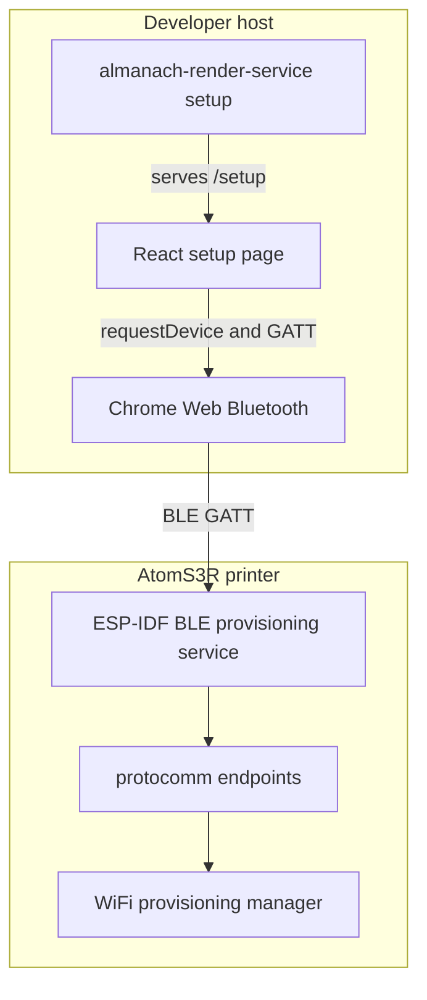
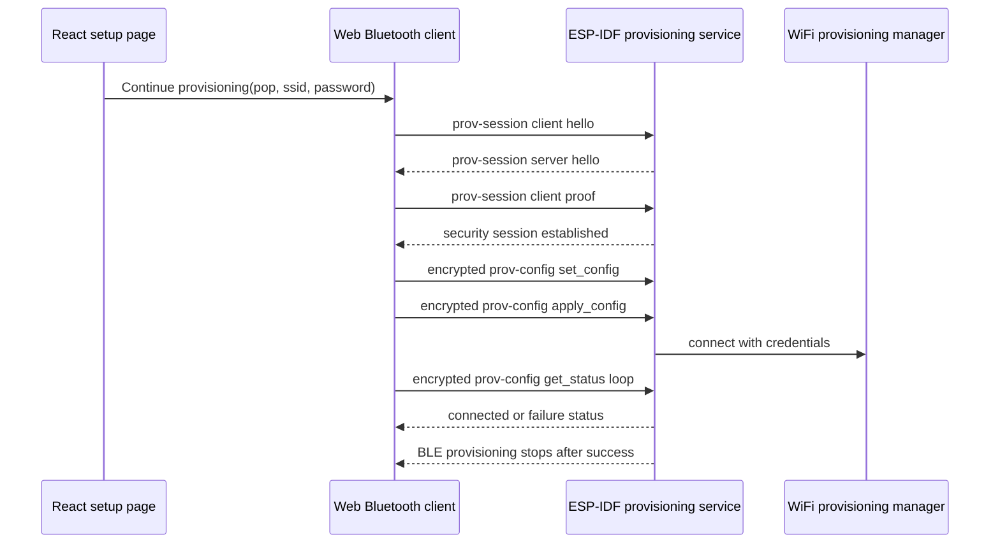

# Almanach BLE Provisioning: Chrome Web Bluetooth Pairing Deep Dive

This report explains the browser side of the Almanach BLE provisioning work: how a localhost React setup page became a real Chrome Web Bluetooth client for the AtomS3R printer. The firmware-side report explains how the device advertises ESP-IDF BLE provisioning and how the Linux CLI validates it through Espressif's Python client. This report covers the next layer: serving a secure browser origin from the Go binary, opening Chrome's Bluetooth chooser, connecting to the printer over GATT, discovering the ESP-IDF provisioning service, mapping protocomm endpoints, and verifying `proto-ver` from JavaScript.

The central result is that the browser is now proven through protocol-version validation. Chrome can select `ALM_0F2320`, connect to the AtomS3R, access the custom ESP-IDF provisioning service, discover all five provisioning characteristics, map them to endpoint names, write `v1.1` to `proto-ver`, and read back the expected ESP-IDF response. Credential transfer is not implemented yet; the remaining work is ESP-IDF Security 1, protobuf payloads, encrypted WiFi configuration, and provisioning status polling.

> [!summary]
> - The browser setup page is served from `http://localhost:<port>/setup`, which gives Chrome a secure context for Web Bluetooth without requiring the printer to host a page before WiFi exists.
> - The React setup page now has both a mock client and a real Web Bluetooth client behind the same provisioning boundary.
> - Chrome hardware testing validated the sequence through `proto-ver`: chooser, GATT connection, service discovery, endpoint descriptor mapping, and protocol-version probing.
> - A firmware pointer-lifetime bug in the custom BLE service UUID was exposed by Chrome service discovery and fixed by moving the UUID into static storage.

## Why this browser track exists

A first-boot AtomS3R printer has no WiFi credentials and therefore no IP address. It cannot serve an onboarding page until after onboarding is complete. The browser page must therefore come from somewhere else. In this implementation, the local Go binary serves the setup page from localhost, and the browser uses Web Bluetooth to send setup traffic to the device before the device is on the network.

This creates a division of responsibility that is worth making explicit. The firmware owns the ESP-IDF provisioning service. The Go binary owns local HTTP serving. React owns the user flow. Chrome owns the interactive Bluetooth permission model. The browser provisioning client owns the mapping between the React flow and ESP-IDF's BLE protocomm endpoints.



The browser cannot bypass Chrome's chooser. `navigator.bluetooth.requestDevice()` must run from a user gesture, and Chrome grants access only to the selected device and to services listed in `optionalServices`. These constraints shape the implementation. The UI cannot silently scan the room. It must present a button, let the user choose `ALM_...`, and request the ESP-IDF service UUID up front.

## Current status

The current browser implementation is intentionally staged. It validates transport and endpoint discovery, but it stops before credential transfer.

| Capability | Status | Evidence |
|---|---:|---|
| Localhost setup page | Done | `almanach-render-service setup` serves `/setup` and `/setup/bundle.js`. |
| Web Bluetooth availability check | Done | Chrome reports `Web Bluetooth is available on this origin`. |
| Chrome device chooser | Done | `ALM_0F2320` appears and can be selected. |
| GATT connection | Done | Page logs `GATT connection established`; firmware logs `BLE provisioning client connected`. |
| Provisioning service discovery | Done | Page finds `021a9004-0382-4aea-bff4-6b3f1c5adfb4`. |
| Endpoint discovery | Done | Page maps `prov-ctrl`, `prov-scan`, `prov-session`, `prov-config`, and `proto-ver`. |
| Protocol version probe | Done | Page reads `{ "prov": { "ver": "v1.1", ... } }`. |
| Security 1 session | Not yet | Requires X25519, PoP verification, and encrypted protocomm payloads. |
| WiFi credential transfer | Not yet | Requires ESP-IDF WiFi provisioning protobuf messages. |
| Status polling and success handling | Not yet | Requires decoding provisioning status responses and handling BLE disconnect after success. |

The successful browser trace is the most important evidence:

```text
20:09:27 Using real Web Bluetooth ESP-IDF client
20:09:27 Opening Chrome Bluetooth picker for ALM_ printers
20:09:30 Selected ALM_0F2320
20:09:30 Connecting to ALM_0F2320 over GATT
20:09:30 GATT connection established
20:09:30 Looking for ESP-IDF provisioning service 021a9004-0382-4aea-bff4-6b3f1c5adfb4
20:09:30 Found ESP-IDF provisioning service 021a9004-0382-4aea-bff4-6b3f1c5adfb4
20:09:30 Discovered 5 provisioning characteristic(s)
20:09:30 Mapped endpoint prov-ctrl -> 021aff4f-0382-4aea-bff4-6b3f1c5adfb4
20:09:30 Mapped endpoint prov-scan -> 021aff50-0382-4aea-bff4-6b3f1c5adfb4
20:09:30 Mapped endpoint prov-session -> 021aff51-0382-4aea-bff4-6b3f1c5adfb4
20:09:31 Mapped endpoint prov-config -> 021aff52-0382-4aea-bff4-6b3f1c5adfb4
20:09:31 Mapped endpoint proto-ver -> 021aff53-0382-4aea-bff4-6b3f1c5adfb4
20:09:31 Available ESP-IDF endpoints: proto-ver, prov-config, prov-ctrl, prov-scan, prov-session
20:09:31 proto-ver response: { "prov": { "ver": "v1.1", "sec_ver": 1, "sec_patch_ver": 0, "cap": ["wifi_scan"] } }
20:09:31 Verified ESP-IDF provisioning protocol v1.1
```

This trace means the browser is speaking to the same ESP-IDF provisioning surface that the Linux CLI validated earlier. The next browser work is no longer about discovering the device. It is about implementing the binary ESP-IDF provisioning protocol.

## The localhost setup server

The Go binary serves the setup page because Chrome requires a secure context for Web Bluetooth, and `localhost` is considered secure. A firmware-served page would be the wrong starting point for first-boot onboarding because the firmware does not have WiFi yet. A local HTTP server solves both problems: it is reachable before the printer is configured, and it gives Chrome the Web Bluetooth origin it needs.

The command is:

```bash
cd /home/manuel/workspaces/2026-05-08/extract-almanach/almanach
go run ./cmd/almanach-render-service setup --port 18299
```

The user opens:

```text
http://localhost:18299/setup
```

The route mapping is deliberately simple:

| Browser URL | Served file |
|---|---|
| `/setup` | `setup.html` |
| `/setup/bundle.js` | `setup-bundle.js` |
| `/almanach` | `index.html` |
| `/almanach/bundle.js` | `almanach-bundle.js` |

The setup command binds to `127.0.0.1`, not to the LAN. This matters because the setup page is an onboarding control surface. It contains WiFi credentials and BLE provisioning state. Binding to localhost keeps the browser flow local to the operator's machine.

## React boundary: one wizard, two clients

The React page was first built with a mock client so the setup UX could be reviewed without hardware. The real Web Bluetooth client was then added behind the same method boundary. That boundary is now the main design point in the browser code.

The wizard works with clients shaped like this:

```js
client.chooseDevice()
client.connect(device)
client.establishSession({ pop })
client.sendCredentials({ ssid, password })
client.waitForResult()
client.disconnect()
```

Today there are two implementations:

| Client | File | Purpose |
|---|---|---|
| Mock client | `web/src/provisioning/mock-client.js` | UI review, Storybook states, no hardware required. |
| Web Bluetooth client | `web/src/provisioning/espidf-client.js` | Chrome picker, GATT connection, service discovery, endpoint discovery, `proto-ver`. |

The wizard chooses the client from the button the user presses:

```js
async function chooseDevice(mode) {
  const selectedClient = mode === "real" ? realClient : mockClient;
  setBusy(true);
  try {
    setState((s) => ({
      ...s,
      clientMode: mode,
      step: ProvisioningStep.DEVICE,
      logs: appendLog(
        s.logs,
        mode === "real"
          ? "Using real Web Bluetooth ESP-IDF client"
          : "Using mock provisioning client for UI validation",
      ),
    }));
    const device = await selectedClient.chooseDevice();
    await selectedClient.connect(device);
    setState((s) => ({ ...s, clientMode: mode, device: { ...device, mode }, step: ProvisioningStep.WIFI }));
  } catch (e) {
    fail(e);
  } finally {
    setBusy(false);
  }
}
```

This code is not complex, but it protects the project from a common failure mode: tying UI state directly to one protocol implementation. Storybook can keep using the mock. The hardware path can advance slice by slice. When Security 1 and credential transfer are added, they will extend the real client without replacing the wizard.

## The Web Bluetooth client

The browser client begins with constants. These constants are not incidental; they are the contract between firmware and browser.

```js
export const ESP_IDF_PROVISIONING_SERVICE_UUID = "021a9004-0382-4aea-bff4-6b3f1c5adfb4";
export const ALMANACH_DEVICE_NAME_PREFIX = "ALM_";
export const ESP_IDF_ENDPOINTS = Object.freeze({
  PROV_CTRL: "prov-ctrl",
  PROV_SCAN: "prov-scan",
  PROV_SESSION: "prov-session",
  PROV_CONFIG: "prov-config",
  PROTO_VER: "proto-ver",
});
```

The service UUID comes from the firmware's custom provisioning UUID. Chrome needs that UUID in `optionalServices` during device selection. If the service is not listed there, later `getPrimaryService()` calls can fail even when the device has the service.

The device selection call is therefore:

```js
bluetoothDevice = await navigator.bluetooth.requestDevice({
  filters: [{ namePrefix: ALMANACH_DEVICE_NAME_PREFIX }],
  optionalServices: ESP_IDF_PROVISIONING_SERVICE_UUIDS,
});
```

The filter narrows the chooser to Almanach provisioning devices, whose names are generated by firmware as `ALM_` plus the last three bytes of the WiFi MAC address. On the tested device, the name is `ALM_0F2320` and the proof-of-possession is `alm-0f2320`.

After selection, the browser connects to GATT and looks for the provisioning service:

```js
gattServer = await bluetoothDevice.gatt.connect();
log("GATT connection established");
const found = await findProvisioningService(gattServer, log);
provisioningService = found.service;
log(`Found ESP-IDF provisioning service ${found.uuid}`);
```

The first Chrome hardware test reached `GATT connection established` and then failed. That failure was useful because it separated the problem precisely. The browser permission model, device picker, and GATT connection were working. The exact primary service UUID was not.

## The firmware UUID lifetime bug

Chrome service discovery exposed a firmware bug that the earlier Linux path had not surfaced clearly. The firmware originally passed a stack-allocated UUID array into ESP-IDF:

```c
esp_err_t provisioning_mgr_init(void)
{
    ...
    uint8_t custom_service_uuid[] = {
        0xb4, 0xdf, 0x5a, 0x1c, 0x3f, 0x6b, 0xf4, 0xbf,
        0xea, 0x4a, 0x82, 0x03, 0x04, 0x90, 0x1a, 0x02,
    };
    wifi_prov_scheme_ble_set_service_uuid(custom_service_uuid);
    ...
}
```

The ESP-IDF function `wifi_prov_scheme_ble_set_service_uuid()` stores the pointer rather than copying the bytes immediately. The actual copy into the BLE configuration happens later when provisioning starts. By then, the stack array can be invalid. The effect is an unstable or corrupted service UUID.

The fix was to store the UUID in static storage:

```c
static uint8_t s_custom_service_uuid[] = {
    0xb4, 0xdf, 0x5a, 0x1c, 0x3f, 0x6b, 0xf4, 0xbf,
    0xea, 0x4a, 0x82, 0x03, 0x04, 0x90, 0x1a, 0x02,
};

esp_err_t provisioning_mgr_init(void)
{
    ...
    wifi_prov_scheme_ble_set_service_uuid(s_custom_service_uuid);
    ...
}
```

The result was immediate. After flashing the fixed firmware, Chrome found the service UUID and listed all five provisioning characteristics. This is an important debugging lesson for ESP-IDF provisioning work: browser clients are strict about service UUID access, and pointer-lifetime bugs in firmware UUID setup can appear as browser-side service discovery failures.

## Endpoint discovery

ESP-IDF BLE provisioning uses one primary service with multiple characteristics. Each provisioning endpoint is represented by one characteristic. The endpoints are:

| Endpoint | Short UUID suffix | Full UUID in this firmware |
|---|---:|---|
| `prov-ctrl` | `0xFF4F` | `021aff4f-0382-4aea-bff4-6b3f1c5adfb4` |
| `prov-scan` | `0xFF50` | `021aff50-0382-4aea-bff4-6b3f1c5adfb4` |
| `prov-session` | `0xFF51` | `021aff51-0382-4aea-bff4-6b3f1c5adfb4` |
| `prov-config` | `0xFF52` | `021aff52-0382-4aea-bff4-6b3f1c5adfb4` |
| `proto-ver` | `0xFF53` | `021aff53-0382-4aea-bff4-6b3f1c5adfb4` |

The browser client follows the same strategy as Espressif's Python BLE client. It reads the characteristic User Description descriptor, UUID `0x2901`, and uses the descriptor text as the endpoint name.

```js
async function discoverEndpointCharacteristics(provisioningService, log) {
  const characteristics = await provisioningService.getCharacteristics();
  const endpoints = new Map();
  log(`Discovered ${characteristics.length} provisioning characteristic(s)`);

  for (const characteristic of characteristics) {
    let endpointName = null;
    const descriptors = await characteristic.getDescriptors();
    for (const descriptor of descriptors) {
      if (!descriptor.uuid.toLowerCase().includes("2901")) continue;
      const value = await descriptor.readValue();
      endpointName = dataViewToText(value).trim().toLowerCase();
      break;
    }

    if (endpointName) {
      endpoints.set(endpointName, characteristic);
      log(`Mapped endpoint ${endpointName} -> ${characteristic.uuid}`);
    }
  }

  return endpoints;
}
```

The implementation also includes fallback UUID mapping. Descriptor reads are the better source of truth because they reflect the endpoint names configured by ESP-IDF. Fallback UUIDs are useful during bring-up and when descriptor access fails because of platform behavior or stale browser state.

## The proto-ver probe

The `proto-ver` endpoint is the smallest protocol check that proves the browser can write to and read from ESP-IDF protocomm. It does not require Security 1. It accepts a text probe and returns a JSON string describing the provisioning protocol version and capabilities.

The browser helper is intentionally text-specific:

```js
async function writeCharacteristic(characteristic, text) {
  const data = textEncoder.encode(text);
  if (characteristic.writeValueWithResponse) {
    await characteristic.writeValueWithResponse(data);
    return;
  }
  await characteristic.writeValue(data);
}

async function readCharacteristicText(characteristic) {
  const value = await characteristic.readValue();
  return dataViewToText(value);
}
```

After endpoint discovery, the browser probes `proto-ver`:

```js
const protoVersion = await sendEndpointText(ESP_IDF_ENDPOINTS.PROTO_VER, "v1.1");
log(`proto-ver response: ${protoVersion}`);
if (!protoVersion.includes("v1.1")) {
  throw new Error(`Unexpected proto-ver response: ${protoVersion}`);
}
log("Verified ESP-IDF provisioning protocol v1.1");
```

The successful response was:

```json
{ "prov": { "ver": "v1.1", "sec_ver": 1, "sec_patch_ver": 0, "cap": ["wifi_scan"] } }
```

This response tells the browser what it needs to know for the next phase. The firmware speaks provisioning protocol `v1.1`, requires Security 1, and advertises WiFi scan capability. The browser has now reached the same diagnostic layer as the Linux CLI's `ble-provision --action version` command.

## Error handling as part of the protocol work

The browser work had one early misleading error. The page said:

```text
ERROR: No printer selected. Choose an ALM_ device from Chrome's Bluetooth picker.
```

But the log showed:

```text
Selected ALM_0F2320
Connecting to ALM_0F2320 over GATT
GATT connection established
```

The device had been selected. The failure was service discovery. Web Bluetooth uses `NotFoundError` in both places: `requestDevice()` can throw it when the user cancels the chooser, and `getPrimaryService()` can throw it when the service is absent or inaccessible. The fix was to pass context into error formatting:

```js
function formatBluetoothError(error, context = "bluetooth") {
  if (error.name === "NotFoundError" && context === "chooser") {
    return "No printer selected. Choose an ALM_ device from Chrome's Bluetooth picker.";
  }
  if (error.name === "NotFoundError" && context === "service") {
    return `Connected to the printer, but none of the expected ESP-IDF provisioning services were found (...)`;
  }
  ...
}
```

This matters because hardware bring-up depends on exact failure boundaries. A chooser error means the user or browser permission step failed. A service error means the selected device is connected but the GATT database does not match the expected ESP-IDF provisioning service. Those failures require different next actions.

## State of the UI

The setup page is a single wizard with progress logging. Its current real-client behavior is:

1. Show Web Bluetooth support status.
2. Accept PoP, SSID, and password inputs.
3. Let the user click **Find BLE printer**.
4. Open Chrome's Bluetooth chooser.
5. Connect to the selected `ALM_...` device.
6. Verify the provisioning service and protocol version.
7. Stop before Security 1 and credential transfer.

The page also retains **Use mock printer** for UI testing. This matters because Storybook and visual review should not depend on hardware. The Storybook fixture `RealBleConnected` records the post-discovery state for documentation and UI review.

The current real-client status message in the code still says the next step is `proto-ver`, Security 1, protobuf, credential transfer, and status polling. Since `proto-ver` is now implemented, the next UI polish should update that text to say that the next step is Security 1/protobuf and credential transfer.

## Testing procedure

The current browser validation procedure is:

```bash
cd /home/manuel/workspaces/2026-05-08/extract-almanach/almanach
go run ./cmd/almanach-render-service setup --port 18299
```

Open Chrome at:

```text
http://localhost:18299/setup
```

Put the device in provisioning mode. The monitor should show:

```text
Provisioning started with service name : ALM_0F2320
Device    : ALM_0F2320
PoP       : alm-0f2320
```

Then use the page:

1. Hard-refresh with `Ctrl+Shift+R` after rebuilding the setup bundle.
2. Click **Find BLE printer**.
3. Select `ALM_0F2320`.
4. Expect `Verified ESP-IDF provisioning protocol v1.1`.

If the device has stale browser state, open:

```text
chrome://bluetooth-internals/#devices
```

Forget the old `ALM_0F2320` entry and retry. If Chrome connects but service discovery fails, inspect `chrome://bluetooth-internals` and compare the service UUID list to the expected `021a9004-0382-4aea-bff4-6b3f1c5adfb4`.

## Remaining protocol work

The next browser phase is Security 1 and protobuf. This is the first phase that must be byte-oriented. The `proto-ver` helper encodes and decodes strings; Security 1 and WiFi configuration require binary protobuf messages and encrypted payloads.

The remaining flow is:



The implementation choices are:

| Choice | Description | Tradeoff |
|---|---|---|
| Use or adapt an existing JavaScript ESP-IDF provisioning implementation | Reuse existing Security 1/protobuf work if a compatible library exists. | Faster if the library is maintained and browser-compatible; risky if the API or dependencies are stale. |
| Implement the minimal protocol locally | Generate or hand-code the needed protobuf messages and implement Security 1 directly. | More control and easier long-term debugging; more cryptographic and binary-protocol work. |

The next research step should inspect ESP-IDF's Python implementation and protobuf schemas:

```text
/home/manuel/esp/esp-idf-5.4.2/components/protocomm/python/
/home/manuel/esp/esp-idf-5.4.2/components/protocomm/proto/
/home/manuel/esp/esp-idf-5.4.2/components/wifi_provisioning/proto/
/home/manuel/esp/esp-idf-5.4.2/tools/esp_prov/esp_prov.py
```

## Important implementation rules

The browser work so far establishes several rules that should guide the next phase.

- `requestDevice()` must remain behind a user click. Chrome requires user activation for the chooser.
- Every GATT service needed later must be listed in `optionalServices` during device selection.
- Errors must include the stage that failed. A chooser failure, GATT failure, service failure, descriptor failure, and protocol failure have different causes.
- Endpoint discovery should prefer descriptors and use UUID fallback only as a robustness layer.
- Text helpers are acceptable for `proto-ver`; Security 1 and WiFi provisioning must use `Uint8Array` payloads.
- BLE disconnect after successful provisioning should be treated as normal if it happens after credentials are accepted or WiFi status reports connected.
- The mock client should remain available for Storybook and UI review even after the real client is complete.

## Code map

| File | Role |
|---|---|
| `web/src/provisioning/espidf-client.js` | Real Chrome/Web Bluetooth client through service discovery and `proto-ver`. |
| `web/src/provisioning/mock-client.js` | Mock provisioning client for UI review and Storybook. |
| `web/src/provisioning/ProvisioningWizard.jsx` | React setup wizard and real-vs-mock client selection. |
| `web/src/provisioning/ProvisioningWizard.stories.jsx` | Storybook states, including the real BLE connected/protocol-verified fixture. |
| `web/src/provisioning/types.js` | Shared setup state and validation helpers. |
| `web/src/setup.jsx` | Standalone setup-page React entrypoint. |
| `web/esbuild.mjs` | Builds `setup.html` and `setup-bundle.js`. |
| `internal/app/cmd_setup.go` | Localhost setup command. |
| `internal/app/static.go` | Serves `/setup` and `/setup/bundle.js`. |
| `firmware/atoms3r/main/provisioning_mgr.c` | Firmware BLE provisioning identity, service UUID, and event handling. |

## Key commits

| Commit | What it contributed |
|---|---|
| `f0971c7 Add Storybook setup provisioning UI` | Added standalone setup UI, mock provisioning flow, and Storybook coverage. |
| `dc36e39 Serve setup page from localhost command` | Added `/setup` serving and localhost setup command. |
| `e9ae5eb Add browser BLE connection client` | Added real Web Bluetooth picker, GATT connect, and service discovery client. |
| `fb2d623 Try alternate BLE service UUID` | Improved service discovery diagnostics and tried UUID candidates. |
| `d2775d3 Keep BLE provisioning service UUID stable` | Fixed firmware UUID pointer lifetime bug exposed by Chrome. |
| `eb70275 Probe ESP-IDF proto-ver from browser` | Added endpoint discovery and browser `proto-ver` validation. |

## Conclusion

The Chrome setup path has moved from a UI concept to a verified browser BLE transport. It now reaches the ESP-IDF provisioning service and confirms protocol version `v1.1` on real hardware. That is the correct boundary before implementing credential transfer. The remaining work is not browser permission or service discovery; it is the ESP-IDF provisioning protocol itself: Security 1, protobuf messages, encrypted writes to `prov-config`, and status polling until WiFi connects.

The current implementation is structured to support that next step. The React wizard already separates mock and real clients. The Web Bluetooth client already maps endpoint names to characteristics. The firmware exposes a stable service UUID and a proven set of endpoints. The next implementation can focus on binary protocol correctness without re-solving browser origin, chooser, GATT, or endpoint discovery.
