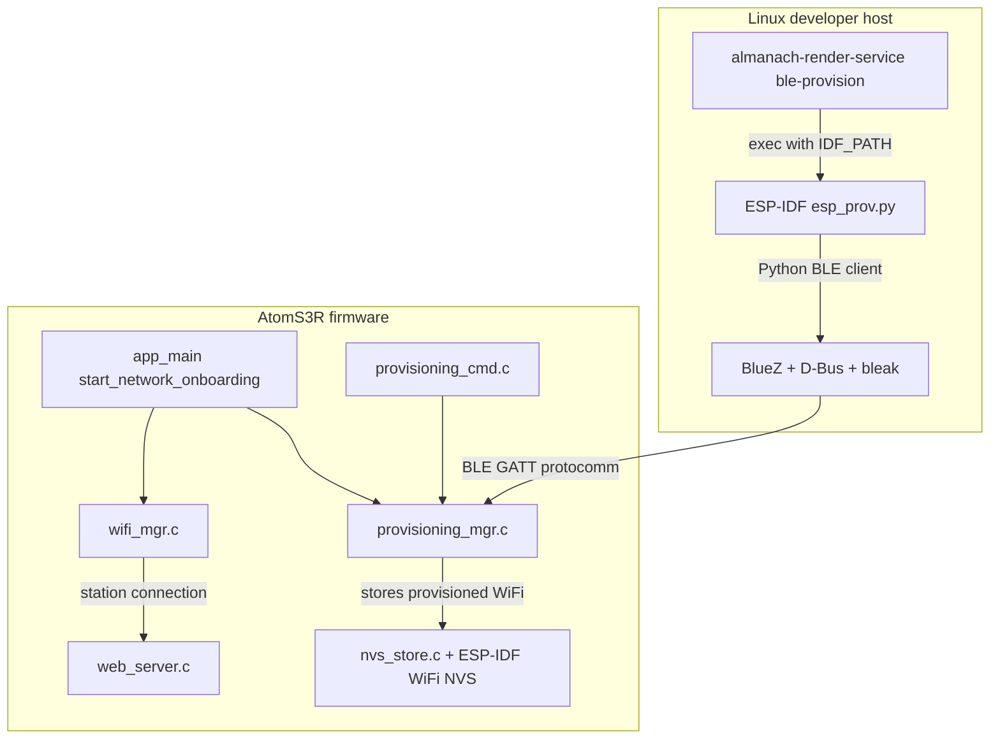
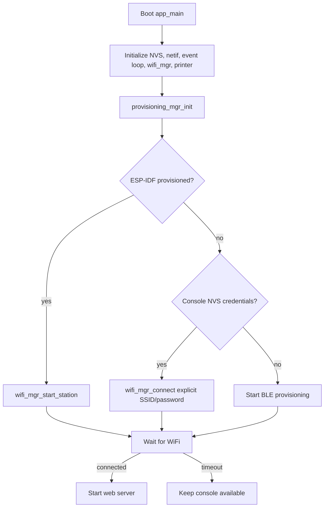
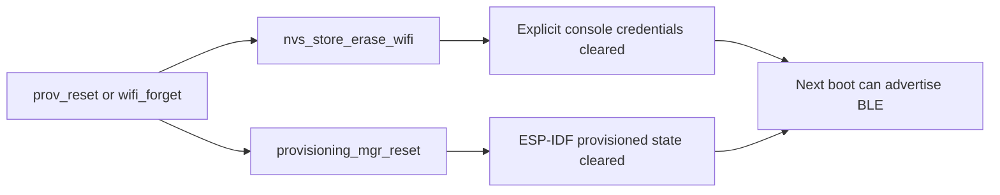
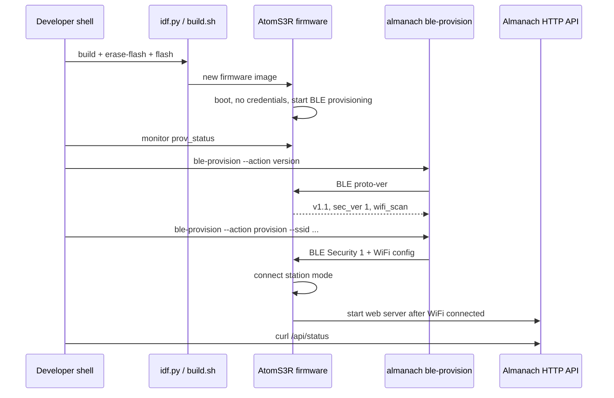
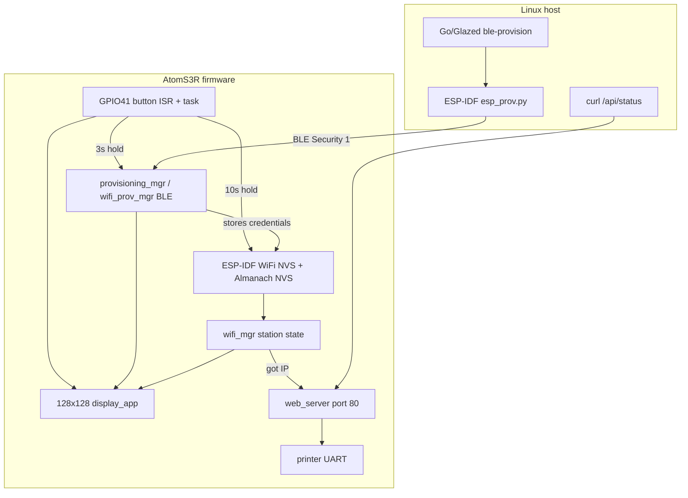
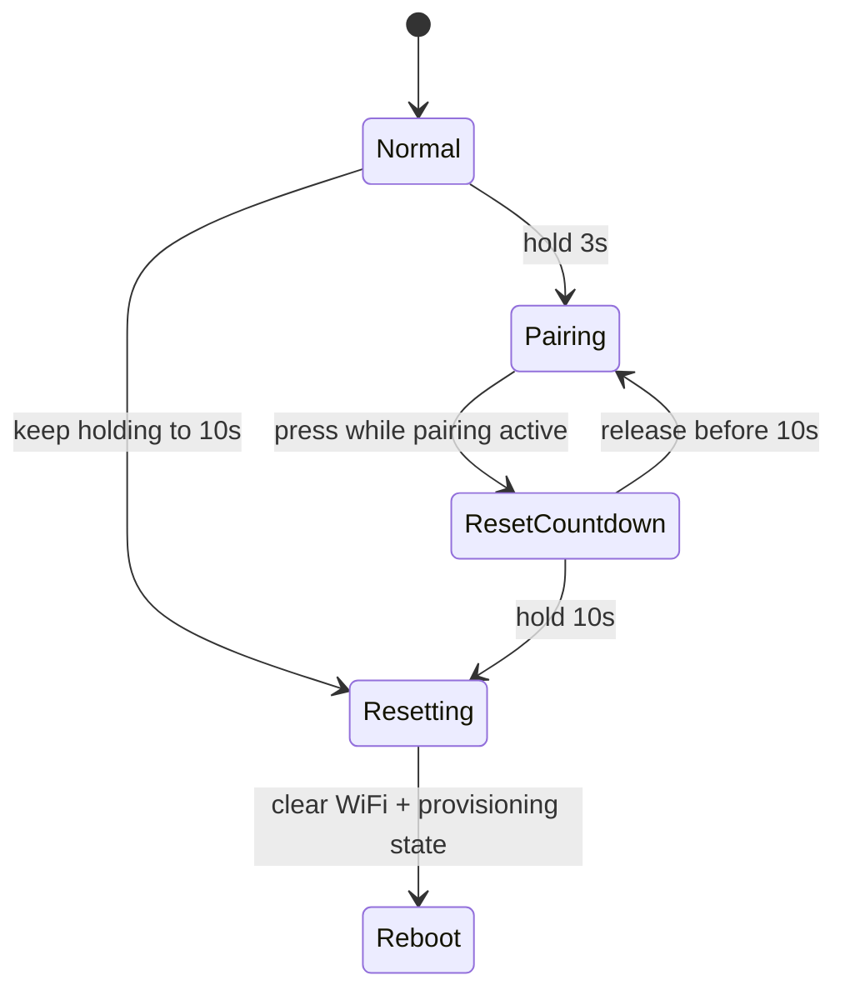

# Almanach BLE Provisioning: From AtomS3R Firmware to a Linux CLI Feedback Loop

This report explains the Almanach BLE WiFi provisioning work as a technical system rather than as a list of commits. The implementation spans ESP-IDF firmware, the existing thermal-printer web server, serial console recovery commands, a Go/Glazed CLI command, and ticket documentation. The central goal is simple: a freshly erased AtomS3R printer should be able to receive WiFi credentials without USB-only manual setup, and a developer on Linux should be able to test that flow quickly while iterating on firmware.

The work began after the Almanach project was separated into its own repository. The render service already had a Go command structure, a web build pipeline, and a firmware tree under `firmware/atoms3r`. The missing piece was first-boot onboarding. The firmware could print and serve HTTP once connected to WiFi, and it already had console commands for `wifi_scan`, `wifi_connect`, `wifi_status`, `wifi_disconnect`, and `wifi_forget`. What it did not have was a standard BLE provisioning path that a phone, browser, or local Linux host could use before the device was on the network.

> [!summary]
> - The firmware now uses ESP-IDF `wifi_prov_mgr` over BLE to advertise a provisioning service when no WiFi credentials are available.
> - The serial console now exposes `prov_status`, `prov_start`, and `prov_reset`, and `wifi_forget` clears both explicit console credentials and ESP-IDF provisioning state.
> - The Almanach Go binary now includes a `ble-provision` Glazed verb for Linux-based provisioning tests using Espressif's maintained `esp_prov.py` client.
> - The implementation preserves the existing console WiFi path, keeps firmware provisioning on the standard ESP-IDF protocol, and creates a local feedback loop for firmware iteration.

## The problem before this work

The AtomS3R firmware had two strong pieces already in place. First, it had the printer and web-server path: once WiFi was connected, the device could host the Almanach UI and accept print requests. Second, it had a USB serial console path: a developer could connect over USB Serial/JTAG and configure WiFi manually. That was enough for development, but it was not enough for first-use onboarding.

A first-boot device has no IP address. Any UI or API served by the device becomes available only after station-mode WiFi succeeds. This creates a strict ordering problem:

1. The device needs WiFi credentials.
2. The device cannot serve its normal HTTP UI until it has WiFi credentials.
3. A user should not need to use USB serial commands to provide those credentials.

BLE provisioning solves this ordering problem by using a transport that is available before WiFi. ESP-IDF already provides a provisioning manager that speaks a standard protocomm protocol over BLE. That manager can advertise a service, run a security handshake, receive WiFi credentials, apply them, and report connection status. The right firmware change was therefore not to invent a new BLE protocol. The right change was to integrate ESP-IDF's provisioning manager into the existing Almanach boot flow without breaking the working console WiFi behavior.

## The architecture after the work

The final shape is a layered system. Each layer has a narrow responsibility.



The host CLI is not responsible for BLE packet details. It is responsible for making the developer workflow predictable: parse flags, locate ESP-IDF, run the right client, redact secrets in output, apply a timeout, and return structured Glazed rows. The low-level BLE/protocomm work remains in Espressif's Python client, which is already compatible with ESP-IDF's provisioning manager.

The firmware is not responsible for knowing where credentials came from. It has a boot decision tree: if ESP-IDF provisioning state says the device is provisioned, start station mode; otherwise, if explicit console-saved credentials exist, connect with those; otherwise, start BLE provisioning.

## The firmware boot decision

The most important firmware change is the new onboarding decision in `firmware/atoms3r/main/app_main.c`. The decision is small, but it defines the system's behavior on every boot.

```c
static void start_network_onboarding(void)
{
    ESP_ERROR_CHECK(provisioning_mgr_init());

    bool provisioned = false;
    esp_err_t err = provisioning_mgr_is_provisioned(&provisioned);
    if (err == ESP_OK && provisioned) {
        ESP_LOGI(TAG, "Provisioned WiFi found — starting station mode");
        ESP_ERROR_CHECK(wifi_mgr_start_station());
        return;
    }

    char ssid[64] = {0};
    char password[64] = {0};
    if (nvs_store_load_wifi(ssid, sizeof(ssid), password, sizeof(password)) == ESP_OK) {
        ESP_LOGI(TAG, "Console-saved WiFi found: \"%s\" — connecting...", ssid);
        wifi_mgr_connect(ssid, password);
        return;
    }

    ESP_LOGI(TAG, "No saved WiFi credentials — starting BLE provisioning");
    bool started = false;
    err = provisioning_mgr_start_if_needed(&started);
    ...
}
```

The order matters. ESP-IDF provisioning state is checked first because BLE provisioning stores credentials through ESP-IDF's WiFi/provisioning stack. The old explicit console credentials remain valid as a fallback. This preserves existing development behavior while allowing the new standard provisioning path.

The web server remains delayed until station-mode WiFi is connected. The background task in `app_main.c` polls `wifi_mgr_is_connected()` for up to 30 seconds and starts `web_server_start()` only when WiFi is ready. That means provisioning and HTTP serving are still separated: provisioning obtains network access; the web server uses it.

The resulting boot flow is:



## The provisioning manager module

The new `firmware/atoms3r/main/provisioning_mgr.c` module wraps ESP-IDF's `wifi_prov_mgr` APIs behind an Almanach-specific interface. This is the right boundary because the rest of the application should not need to know about protocomm event bases, BLE service UUID byte arrays, or provisioning security parameter types.

The public API, declared in `firmware/atoms3r/main/provisioning_mgr.h`, gives the application enough control without exposing implementation details:

```c
esp_err_t provisioning_mgr_init(void);
esp_err_t provisioning_mgr_is_provisioned(bool *out_provisioned);
esp_err_t provisioning_mgr_start_if_needed(bool *out_started);
esp_err_t provisioning_mgr_start_force(void);
esp_err_t provisioning_mgr_stop(void);
esp_err_t provisioning_mgr_reset(void);
esp_err_t provisioning_mgr_get_status(provisioning_status_t *out);
```

The manager owns four pieces of runtime state:

- `s_initialized` records whether `wifi_prov_mgr_init()` has been called.
- `s_running` records whether provisioning is currently advertising/running.
- `s_client_connected` records whether a BLE provisioning client is connected.
- `s_security_ok` records whether the protocomm Security 1 session was established.

It also owns the visible provisioning identity:

```c
snprintf(s_service_name, sizeof(s_service_name),
         "ALM_%02X%02X%02X", mac[3], mac[4], mac[5]);
snprintf(s_pop, sizeof(s_pop),
         "alm-%02x%02x%02x", mac[3], mac[4], mac[5]);
```

On the tested device, this produced:

```text
Service name : ALM_0F2320
PoP          : alm-0f2320
```

The service name and proof-of-possession are not high-security manufacturing credentials. They are deterministic development credentials derived from the device MAC. This is a practical choice for the current stage: every developer can recover the identity from serial logs, and the value is unique enough to distinguish devices during local testing. A production provisioning flow should revisit credential generation, label printing, onboarding UX, and whether PoP should be random per device.

## ESP-IDF provisioning APIs used by the firmware

The firmware uses ESP-IDF's standard provisioning manager and BLE scheme:

- `wifi_prov_mgr_init(config)` initializes the provisioning manager.
- `wifi_prov_mgr_is_provisioned(&provisioned)` checks whether WiFi credentials already exist in ESP-IDF provisioning state.
- `wifi_prov_mgr_start_provisioning(security, security_params, service_name, service_key)` starts the BLE provisioning service.
- `wifi_prov_mgr_reset_provisioning()` clears provisioned WiFi state.
- `wifi_prov_mgr_stop_provisioning()` stops an active provisioning session.
- `wifi_prov_mgr_deinit()` releases provisioning manager resources.
- `wifi_prov_scheme_ble` selects BLE transport.
- `wifi_prov_scheme_ble_set_service_uuid(custom_service_uuid)` sets the BLE service UUID.
- `WIFI_PROV_SECURITY_1` selects X25519 plus PoP-authenticated Security 1.

The key start call appears in `provisioning_mgr_start_force()`:

```c
const wifi_prov_security_t security = WIFI_PROV_SECURITY_1;
const wifi_prov_security1_params_t *security_params = s_pop;
const char *service_key = NULL;

wifi_prov_mgr_start_provisioning(
    security,
    (const void *)security_params,
    s_service_name,
    service_key
);
```

When this succeeds, the device advertises a standard ESP-IDF BLE provisioning service. Compatible clients can use the same endpoint names as Espressif's examples: `proto-ver`, `prov-session`, `prov-config`, `prov-scan`, and `prov-ctrl`.

## Event ownership

The existing firmware already had a WiFi manager. That means the provisioning port had to avoid taking over general WiFi/IP event handling. The new provisioning manager handles provisioning-specific events and leaves station connectivity state to `wifi_mgr.c`.

The provisioning event handler listens to three event bases:

| Event base | Why it matters |
|---|---|
| `WIFI_PROV_EVENT` | Lifecycle and credential events from `wifi_prov_mgr`. |
| `PROTOCOMM_TRANSPORT_BLE_EVENT` | BLE client connect/disconnect state. |
| `PROTOCOMM_SECURITY_SESSION_EVENT` | Security 1 session success or failure. |

Important events include:

```c
case WIFI_PROV_START:
    s_running = true;
    ESP_LOGI(TAG, "BLE WiFi provisioning started");
    break;

case WIFI_PROV_CRED_RECV:
    ESP_LOGI(TAG, "Received WiFi credentials for SSID '%s'", cfg->ssid);
    break;

case WIFI_PROV_CRED_SUCCESS:
    ESP_LOGI(TAG, "Provisioned WiFi credentials connected successfully");
    break;

case WIFI_PROV_END:
    s_running = false;
    ESP_LOGI(TAG, "BLE WiFi provisioning ended");
    wifi_prov_mgr_deinit();
    s_initialized = false;
    break;
```

This event split keeps the system understandable. Provisioning reports the lifecycle of the provisioning session. WiFi manager reports whether the device has an IP and is connected. The web server starts only after the WiFi manager says the station is connected.

## Console recovery commands

BLE provisioning needs a serial recovery surface. During development, stale credentials, incorrect PoP values, host Bluetooth state, or interrupted provisioning sessions are common. The firmware therefore adds a separate command module in `firmware/atoms3r/main/provisioning_cmd.c` and registers it from `app_main.c`.

The new commands are:

| Command | Purpose |
|---|---|
| `prov_status` | Print manager state, service name, PoP, BLE state, and WiFi/IP state. |
| `prov_start` | Start BLE provisioning if the device is not already provisioned and provisioning is not already running. |
| `prov_reset` | Disconnect WiFi, erase explicit console credentials, reset ESP-IDF provisioning state, and reboot. |

The important design decision is that reset clears both credential stores. The system now has two sources of stored WiFi information:

1. ESP-IDF provisioning/WiFi NVS state.
2. Almanach's explicit console credential storage through `nvs_store_save_wifi()`.

If reset cleared only one of them, the device could reboot into a surprising state. `prov_reset` is therefore a full onboarding reset. `wifi_forget` was also changed so it clears provisioning state as well as explicit console credentials.



The hardware smoke test caught a useful console behavior bug. Calling `prov_start` while BLE provisioning was already running initially printed as though provisioning had just started. The fix was to make `provisioning_mgr_start_if_needed()` return success without setting `out_started=true` when `s_running` is already true. After the fix, `prov_start` reports that provisioning was not started because it is already running or already provisioned.

## Hardware validation

The firmware was erased, flashed, and monitored on a physical AtomS3R at `/dev/ttyACM0`. The validation sequence used:

```bash
cd almanach/firmware/atoms3r
./build.sh /dev/ttyACM0 erase-flash
./build.sh /dev/ttyACM0 flash
./build.sh /dev/ttyACM0 monitor
```

The device booted, found no saved credentials, and started BLE provisioning:

```text
No saved WiFi credentials — starting BLE provisioning
wifi_prov_mgr: Provisioning started with service name : ALM_0F2320
provisioning: BLE WiFi provisioning started
provisioning:   Transport : BLE
provisioning:   Device    : ALM_0F2320
provisioning:   Security  : Security 1
provisioning:   PoP       : alm-0f2320
```

The serial console remained available during BLE advertising. `prov_status` returned:

```text
Provisioning manager:
  initialized      : yes
  provisioned      : no
  BLE running      : yes
  client connected : no
  security ok      : no
  service name     : ALM_0F2320
  PoP              : alm-0f2320
WiFi: DISCONNECTED
```

This proves the firmware boot order, BLE provisioning start, NimBLE initialization, console command registration, and idempotent `prov_start` behavior. It does not yet prove full credential application and reboot autoconnect. That remains the next validation step.

## The Linux CLI feedback loop

After the firmware could advertise BLE provisioning, the next problem was developer workflow. Espressif's phone app can validate the standard provisioning protocol, but it is not the fastest loop while editing firmware and Go code. A Linux developer already has the repo, terminal, `idf.py monitor`, and the Almanach binary available. The new `ble-provision` command keeps provisioning tests in that environment.

The command is implemented in `internal/app/cmd_ble_provision.go` and registered from `internal/app/cmd_root.go` with the same Glazed machinery as the existing `render`, `inspect`, and `print` verbs.

The command exposes four actions:

| Action | Behavior |
|---|---|
| `version` | Connect over BLE and query the `proto-ver` endpoint without sending credentials. |
| `provision` | Send SSID/passphrase, apply config, and let ESP-IDF poll connection status. |
| `reset` | Send provisioning reset through `prov-ctrl`. |
| `reprov` | Send ESP-IDF reprovisioning request through `prov-ctrl`. |

The `version` action is the most useful first diagnostic. It answers four questions without mutating device state:

- Can Linux discover the BLE advertisement?
- Can the host connect to the BLE peripheral?
- Can the host find the provisioning GATT services and characteristics?
- Does the firmware respond with the expected ESP-IDF provisioning protocol metadata?

The validated command was:

```bash
go run ./cmd/almanach-render-service ble-provision \
  --action version \
  --service-name ALM_0F2320 \
  --pop alm-0f2320 \
  --timeout 30 \
  --output yaml
```

The successful output included:

```text
Discovering...
Connecting...
Getting Services...
proto-ver response :  {
        "prov": {
                "ver": "v1.1",
                "sec_ver": 1,
                "sec_patch_ver": 0,
                "cap": ["wifi_scan"]
        }
}
==== Verified protocol version successfully ====
Disconnecting...
```

The Glazed row reported `exit_code: 0`, the resolved `IDF_PATH`, the Python interpreter, and the service name. This is a useful regression check: if this command fails after firmware changes, the failure is below WiFi credential handling. It is in BLE advertisement, host BLE access, GATT discovery, or the provisioning manager's `proto-ver` endpoint.

## Why the CLI wraps Espressif's Python client

A pure-Go BLE provisioning client is possible, but it is not the smallest reliable step. ESP-IDF provisioning is not just a single BLE write. It includes:

- Linux BLE scanning and GATT access.
- Endpoint discovery.
- Protobuf request and response messages.
- A Security 1 session using X25519, proof-of-possession, and encrypted protocomm payloads.
- WiFi scan, config, apply, status, reset, and reprovision control messages.

Espressif already maintains this behavior in `tools/esp_prov/esp_prov.py`. The first local CLI therefore treats `esp_prov.py` as the protocol engine and wraps it in a Go command that fits the Almanach toolchain.

The wrapper still adds value:

- It keeps the user-facing command inside `almanach-render-service`.
- It uses Glazed flags and structured output.
- It resolves local ESP-IDF and Python paths.
- It applies subprocess timeouts.
- It redacts the WiFi passphrase from displayed command output.
- It provides an `--install-hints` path for Linux BLE/Python dependency failures.
- It adds a custom non-mutating `version` action.

The custom `version` action exists because `esp_prov.py --proto_ver v1.1` verifies the version and then continues into WiFi scan/config behavior. For a diagnostic command, that is the wrong endpoint. The Go wrapper instead runs a small Python snippet that imports Espressif's helper functions, connects over BLE, calls `version_match()`, and exits immediately.

```go
func buildBLEProvisionPythonArgs(s *BLEProvisionSettings, espProvPath string, passphrase string) ([]string, []string, error) {
    if s.Action == "version" {
        protoVer := s.ProtoVer
        if protoVer == "" {
            protoVer = "v1.1"
        }
        code := `import asyncio, os, sys
idf = os.environ['IDF_PATH']
sys.path.insert(0, idf + '/components/protocomm/python')
sys.path.insert(1, idf + '/tools/esp_prov')
import esp_prov
async def main():
    tp = await esp_prov.get_transport('ble', sys.argv[1])
    try:
        ok = await esp_prov.version_match(tp, sys.argv[2], True)
        print('==== Verified protocol version successfully ====' if ok else '==== Protocol version mismatch ====')
        raise SystemExit(0 if ok else 1)
    finally:
        await tp.disconnect()
asyncio.run(main())`
        ...
    }
    ...
}
```

This is an intentional boundary. The Go command controls workflow. Espressif's Python code controls protocol correctness.

## Host dependency failures encountered

The first direct `esp_prov.py` run failed because the selected ESP-IDF Python environment lacked `protobuf`:

```text
ModuleNotFoundError: No module named 'google'
```

The fix was to install the provisioning dependencies into the ESP-IDF Python environment:

```bash
/home/manuel/.espressif/python_env/idf5.4_py3.13_env/bin/python -m pip install protobuf cryptography bleak
```

`cryptography` was already installed. `protobuf`, `bleak`, and `dbus-fast` were installed. After that, Linux BLE discovery and `proto-ver` succeeded.

This failure is worth recording because many future provisioning failures will look like firmware problems but actually live on the host. On Linux, the provisioning client depends on BlueZ, D-Bus permissions, the `bleak` Python package, and a working Bluetooth adapter. The new command's `--install-hints` flag exists to keep that knowledge close to the failing command.

## The end-to-end development loop

The intended local feedback loop is now:



The important property is that the loop has checkpoints. A developer does not need to jump directly from flash to full provisioning. They can check each layer:

1. Serial boot logs confirm firmware startup.
2. `prov_status` confirms provisioning manager state.
3. `ble-provision --action version` confirms Linux BLE and `proto-ver`.
4. `ble-provision --action provision` sends credentials.
5. Firmware logs confirm WiFi connection.
6. `/api/status` confirms HTTP service availability.
7. Reboot confirms persistent credentials.
8. `prov_reset` confirms reset and re-provision behavior.

## Files that define the implementation

The core files are:

| File | Role |
|---|---|
| `firmware/atoms3r/main/provisioning_mgr.c` | ESP-IDF provisioning manager wrapper, service identity, event handling, start/reset/status APIs. |
| `firmware/atoms3r/main/provisioning_mgr.h` | Public provisioning manager API and status struct. |
| `firmware/atoms3r/main/provisioning_cmd.c` | Serial console commands for provisioning status, start, and reset. |
| `firmware/atoms3r/main/app_main.c` | Boot-time onboarding decision and command registration. |
| `firmware/atoms3r/main/wifi_mgr.c` | Existing WiFi station manager plus `wifi_mgr_start_station()` for ESP-IDF-stored credentials. |
| `firmware/atoms3r/main/wifi_cmd.c` | Existing console WiFi commands; `wifi_forget` now also clears provisioning state. |
| `firmware/atoms3r/sdkconfig.defaults` | BLE, NimBLE, and protocomm Security 1 defaults. |
| `internal/app/cmd_ble_provision.go` | Linux Go/Glazed provisioning command. |
| `internal/app/cmd_root.go` | Registers `ble-provision` into the Almanach binary. |
| `ttmp/.../design-doc/01-...` | Firmware provisioning design guide. |
| `ttmp/.../design-doc/02-...` | Web Bluetooth setup UI design guide. |
| `ttmp/.../design-doc/03-...` | Linux CLI provisioning feedback loop design guide. |
| `ttmp/.../reference/01-investigation-diary.md` | Chronological implementation diary and validation evidence. |

## Commits that mark the implementation stages

The work was committed in reviewable increments:

| Commit | Purpose |
|---|---|
| `af8bd39 Extract Almanach service and firmware` | Baseline extraction of the render service and firmware into the standalone `almanach` repo. |
| `af03525 Enable firmware BLE provisioning dependencies` | Added BLE/NimBLE/protocomm defaults and component dependencies. |
| `80c5732 Add AtomS3R BLE provisioning manager` | Added `provisioning_mgr` and integrated boot-flow provisioning decisions. |
| `a14f6d2 Add BLE provisioning console commands` | Added `prov_status`, `prov_start`, `prov_reset`, and reset semantics. |
| `b843728 Validate BLE provisioning console on hardware` | Hardware smoke-tested BLE advertising and console commands; fixed idempotent `prov_start`. |
| `f5437c4 Add Web Bluetooth provisioning UI design` | Documented the future browser setup path and secure-context constraints. |
| `864b748 Add Linux BLE provisioning CLI` | Added the Go/Glazed `ble-provision` command and intern-facing Linux CLI guide. |
| `d1a8f92 Track Linux provisioning CLI tasks` | Recorded CLI work completion in ticket tasks. |

## What remains to validate

The project has crossed an important boundary: the device advertises provisioning over BLE, the serial console can inspect it, and a Linux host can connect and query `proto-ver`. The remaining end-to-end validation is credential application.

The next validation should run:

```bash
go run ./cmd/almanach-render-service ble-provision \
  --action provision \
  --service-name ALM_0F2320 \
  --pop alm-0f2320 \
  --ssid YOUR_WIFI \
  --passphrase YOUR_PASSWORD \
  --timeout 120 \
  --output yaml
```

Pass criteria:

- Host establishes Security 1 session.
- Host sends WiFi credentials.
- Firmware logs `WIFI_PROV_CRED_RECV` and then `WIFI_PROV_CRED_SUCCESS`.
- WiFi manager reports a connected station and IP address.
- Web server starts.
- `curl http://DEVICE_IP/api/status` succeeds.
- Reboot reconnects without BLE provisioning.
- `prov_reset` returns the device to first-boot BLE advertising behavior.

Until that sequence is complete, the implementation should be treated as firmware and host provisioning transport validated, not full onboarding validated.

## Design decisions and trade-offs

### Use ESP-IDF `wifi_prov_mgr` rather than a custom firmware protocol

The firmware speaks the standard ESP-IDF BLE provisioning protocol. This enables immediate validation with Espressif tools and clients. It also keeps future browser work aligned with a known protocol rather than an application-specific GATT service.

### Preserve console WiFi support

The existing serial console WiFi path remains valuable. It is the recovery mechanism when BLE, host Bluetooth, or provisioning credentials fail. The implementation does not remove it. Instead, it makes reset semantics explicit so the two credential stores do not conflict silently.

### Make provisioning identity deterministic for development

The service name and PoP are derived from the MAC address. This makes the test device discoverable and recoverable without a manufacturing database. The trade-off is that production onboarding should revisit identity and PoP generation.

### Wrap `esp_prov.py` before implementing pure Go protocomm

The Linux CLI chooses reliability and speed of validation over binary self-containment. This was the correct first implementation because the immediate need was firmware feedback. A pure-Go client remains a future improvement once the firmware behavior is fully validated.

### Keep browser/Web Bluetooth as a separate client track

The project also has a design for a future web setup UI, but browser BLE has secure-context constraints. A firmware-served plain HTTP page is not a reliable first-boot Web Bluetooth origin. The web onboarding path should be hosted from localhost during development or HTTPS in production, while the firmware continues to expose the same standard ESP-IDF provisioning protocol.

## Open questions

- Should `wifi_forget` reboot like `prov_reset`, or is non-rebooting behavior better for a command named `wifi_forget`?
- Should the Linux CLI patch Espressif's Python client or add a helper script to avoid putting WiFi passphrases in child process arguments?
- Should `ble-provision` grow native `scan` and `status` actions that return Glazed rows?
- Should the firmware expose a post-connect provisioning/status block in `/api/status`, excluding PoP?
- What should production PoP generation and device labeling look like?
- Should the eventual Web Bluetooth client depend on `esp-idf-provisioning-web`, or should it share a lower-level protocol implementation with a future pure-Go CLI?

## Near-term next steps

1. Run full `ble-provision --action provision` with real WiFi credentials.
2. Capture the firmware monitor transcript for credential receive, connection success, and web server startup.
3. Verify `/api/status` after provisioning.
4. Reboot and verify station-mode autoconnect from ESP-IDF provisioned state.
5. Run `prov_reset` and verify the device advertises BLE provisioning again.
6. Decide whether the CLI should add `scan`, `status`, and `wait-api` actions.
7. Continue the web setup UI work only after the firmware and Linux CLI credential path is fully validated.

## Working rule

The provisioning system should be validated from the lowest layer upward. First prove firmware boot and BLE advertising from serial logs. Then prove Linux BLE and `proto-ver`. Then prove Security 1 and credential transfer. Then prove WiFi connection and HTTP API availability. Then prove persistence and reset. This order keeps failures local and prevents debugging the web UI, Go CLI, BLE stack, and firmware state machine at the same time.

---

## Update: Real provisioning, display status, button pairing, and post-provisioning HTTP startup

The report above captures the system at the point where BLE advertising, serial recovery commands, and the Linux `ble-provision --action version` feedback loop were validated. The work has since moved past that milestone. The firmware has now been exercised through real WiFi credential provisioning, reboot persistence, immediate HTTP startup after first-time provisioning, AtomS3R display status rendering, and physical button pairing mode.

The main new fact is that Almanach is no longer only transport-validated. The full onboarding loop works on the tested AtomS3R: BLE provisioning accepts real credentials for `Verizon_9DNVB9`, the device obtains IP `192.168.1.242`, the web server starts, `/api/status` returns JSON, and reboot autoconnect uses ESP-IDF's persisted provisioning state.

> [!summary]
> - Real BLE WiFi provisioning now succeeds end-to-end with the Linux Go/Glazed wrapper around `esp_prov.py`.
> - The firmware now starts HTTP after delayed first-time provisioning instead of requiring a reboot.
> - AtomS3R display support is implemented as a 128x128 text/status UI using M5GFX and the GC9107 panel.
> - The front button now uses a deliberate two-stage hold interaction: 3 seconds for BLE pairing mode, 10 seconds for destructive WiFi/provisioning reset.

### Updated validation status

The earlier "remaining end-to-end validation" checklist is now mostly complete. The real test used `idf.py flash monitor` in tmux and the Go provisioning CLI from a second shell. The successful provisioning run showed:

```text
==== Starting Session ====
==== Session Established ====
==== Sending Wi-Fi Credentials to Target ====
==== Wi-Fi Credentials sent successfully ====
==== Applying Wi-Fi Config to Target ====
==== Apply config sent successfully ====
==== Wi-Fi connection state  ====
++++ WiFi state: Connecting... ++++
==== Wi-Fi connection state  ====
==== WiFi state: Connected ====
==== Provisioning was successful ====
exit_code: 0
service_name: ALM_0F2320
ssid: Verizon_9DNVB9
```

The firmware monitor confirmed the corresponding device-side events:

```text
I provisioning: Received WiFi credentials for SSID 'Verizon_9DNVB9'
I wifi:connected with Verizon_9DNVB9, aid = 1, channel 11, 40D
I esp_netif_handlers: sta ip: 192.168.1.242, mask: 255.255.255.0, gw: 192.168.1.1
I wifi_mgr: Got IP: 192.168.1.242
I wifi_prov_mgr: STA Got IP
I provisioning: Provisioned WiFi credentials connected successfully
I wifi_prov_mgr: Provisioning stopped
I provisioning: BLE WiFi provisioning ended
I provisioning: WiFi provisioning manager deinitialized
```

After reboot, the persisted provisioning state worked:

```text
I stoms3r: Provisioned WiFi found — starting station mode
I wifi:connected with Verizon_9DNVB9, aid = 1, channel 11, 40D
I wifi_mgr: Got IP: 192.168.1.242
I stoms3r: WiFi connected — starting web server
I web_server: HTTP server started on port 80
```

The HTTP API was reachable:

```json
{"ok":true,"wifi":{"connected":true,"ip":"192.168.1.242"},"printer":{"baud":9600,"swapped":true}}
```

This changes the status of the project. BLE provisioning is no longer just advertised and protocol-checked; the device can now be configured onto real WiFi and serve its status endpoint afterward.

### The post-provisioning HTTP startup bug and fix

The real provisioning test exposed a subtle application-level timing bug. BLE provisioning succeeded and WiFi obtained an IP, but the first version of the firmware did not start HTTP until reboot. The reason was not a provisioning failure. It was the web server wait task in `app_main.c`.

Before the fix, `web_server_task()` waited for WiFi for only 30 seconds after boot, then deleted itself:

```c
for (int i = 0; i < 60; i++) {
    if (wifi_mgr_is_connected()) {
        web_server_start();
        vTaskDelete(NULL);
        return;
    }
    vTaskDelay(pdMS_TO_TICKS(500));
}
ESP_LOGW(TAG, "WiFi not connected after 30s — web server not started");
vTaskDelete(NULL);
```

First-time provisioning often crosses that 30-second boundary because the boot, BLE discovery, Security 1 session, credential transfer, AP association, and DHCP steps all happen before WiFi is connected. The result was a split-brain success state: provisioning and WiFi were successful, ping worked, but port 80 was closed.

The fix was to keep the task alive. It now warns once after 30 seconds but continues polling until WiFi is connected:

```c
static void web_server_task(void *arg)
{
    int wait_seconds = 0;
    bool logged_wait = false;

    while (true) {
        if (wifi_mgr_is_connected()) {
            ESP_LOGI(TAG, "WiFi connected — starting web server");
            esp_err_t err = web_server_start();
            if (err != ESP_OK) {
                ESP_LOGE(TAG, "Web server start failed: %s", esp_err_to_name(err));
            }
            vTaskDelete(NULL);
            return;
        }

        vTaskDelay(pdMS_TO_TICKS(1000));
        wait_seconds++;
        if (!logged_wait && wait_seconds >= 30) {
            ESP_LOGW(TAG, "WiFi not connected after 30s — still waiting to start web server");
            logged_wait = true;
        }
    }
}
```

The retest validated the exact failure mode and the fix:

```text
W stoms3r: WiFi not connected after 30s — still waiting to start web server
I provisioning: Received WiFi credentials for SSID 'Verizon_9DNVB9'
I wifi_mgr: Got IP: 192.168.1.242
I wifi_prov_mgr: STA Got IP
I provisioning: Provisioned WiFi credentials connected successfully
I stoms3r: WiFi connected — starting web server
I web_server: HTTP server started on port 80
```

The important lesson is that onboarding systems need event-driven or persistent readiness waits. A fixed boot-time timeout is fragile when network credentials arrive through an asynchronous setup channel.

### AtomS3R display status support

A separate ticket added the AtomS3R display and button UX around provisioning. The display is driven through M5GFX with a GC9107-compatible AtomS3R panel configuration.

The practical display facts are:

| Property | Value |
|---|---|
| Visible canvas | `128 x 128` |
| GC9107 internal RAM window | `128 x 160` |
| Firmware X offset | `0` |
| Firmware Y offset | `32` |
| LCD CS | GPIO14 |
| LCD SCK | GPIO15 |
| LCD MOSI | GPIO21 |
| LCD DC | GPIO42 |
| LCD RST | GPIO48 |
| Button | GPIO41 active-low |

The firmware Kconfig captures the screen shape:

```text
CONFIG_ALMANACH_ATOMS3R_LCD_HRES=128
CONFIG_ALMANACH_ATOMS3R_LCD_VRES=128
CONFIG_ALMANACH_ATOMS3R_LCD_X_OFFSET=0
CONFIG_ALMANACH_ATOMS3R_LCD_Y_OFFSET=32
```

The display implementation lives in:

| File | Role |
|---|---|
| `firmware/atoms3r/main/display_hal.cpp` | M5GFX/LovyanGFX panel and SPI bus setup for the AtomS3R GC9107 display. |
| `firmware/atoms3r/main/display_app.cpp` | Text-first boot/status/pairing/error screens on a 128x128 canvas. |
| `firmware/atoms3r/main/backlight.cpp` | Backlight preparation and I2C brightness control. |
| `firmware/atoms3r/main/button_input.c` | GPIO41 button ISR/task state machine for pairing/reset holds. |
| `firmware/atoms3r/main/Kconfig.projbuild` | Display, backlight, and button configuration symbols. |

The boot log now confirms display initialization:

```text
I display_app: display boot; free_heap=8673128 dma_free=279180
I display_backlight: backlight i2c init: port=0 scl=0 sda=45 addr=0x30 reg=0x0e
I display_hal: m5gfx init: pclk=40000000Hz gap=(0,32)
I display_app: canvas ok: 32768 bytes
```

The `32768` byte canvas length matches a 128x128 16-bit RGB565 sprite:

```text
128 * 128 * 2 = 32768 bytes
```

The UI is deliberately text-first. It shows `ONLINE` and the IP address after WiFi connects, `PAIR BLE` and service/PoP details while provisioning runs, `WIFI Connecting...` while provisioned but not connected, and `NO WIFI Hold button for pairing` when credentials are absent.

### Display integration failure: old and new I2C drivers cannot mix

The first display hardware flash found an ESP-IDF driver conflict before `app_main()` could run:

```text
E i2c: CONFLICT! driver_ng is not allowed to be used with this old driver
```

The cause was that the initial backlight helper used legacy `driver/i2c.h`, while the managed M5GFX component pulled in ESP-IDF's newer I2C driver stack. ESP-IDF aborts when both stacks are linked into the same app.

The fix was to move `backlight.cpp` to the new I2C master API:

- `driver/i2c_master.h`
- `i2c_new_master_bus()`
- `i2c_master_bus_add_device()`
- `i2c_master_transmit()`

This is a useful integration lesson: managed display components may silently constrain which ESP-IDF peripheral-driver generation the rest of the firmware can use. Build success was not enough; the conflict appeared only after flashing.

### GPIO7 backlight gate conflict remains intentionally unresolved

The donor AtomS3R display code used GPIO7 as an active-low backlight gate. Almanach's printer firmware uses GPIO7 in the printer UART mapping:

```text
Printer UART1 ready: TX=8 RX=7 CTS=6 baud=9600
Swapping TX/RX pins: TX=GPIO7 RX=GPIO8 CTS=GPIO6 (SWAPPED) baud=9600
```

The current display port therefore keeps the GPIO7 backlight gate disabled by default and relies on I2C brightness control:

```text
CONFIG_ALMANACH_ATOMS3R_BACKLIGHT_GATE_ENABLE=n
CONFIG_ALMANACH_ATOMS3R_BACKLIGHT_I2C_ENABLE=y
```

This is an intentional safety decision. The project should not blindly copy display code that would steal a printer UART pin. If the physical display is dim or blank in some cases, the next investigation should resolve the board-level GPIO7 conflict rather than enabling the gate unconditionally.

### Button pairing and reset UX

The AtomS3R front button is now part of onboarding. It is configured as GPIO41 active-low with a FreeRTOS task that consumes ISR edge events and handles debounce, hold thresholds, provisioning calls, and reset/reboot work outside interrupt context.

The current UX is:

| Action | Hold duration | Behavior |
|---|---:|---|
| Short press | less than 3 seconds | No destructive action. |
| Pairing hold | about 3 seconds | Force-start BLE provisioning/pairing mode. |
| Reset hold | about 10 seconds | Clear explicit WiFi credentials and ESP-IDF provisioning state, then reboot. |

The committed defaults are:

```text
CONFIG_ALMANACH_ATOMS3R_PAIRING_HOLD_MS=3000
CONFIG_ALMANACH_ATOMS3R_PAIRING_RESET_HOLD_MS=10000
```

The 3-second pairing path was validated physically. The logs show the press crossing the threshold and the device advertising BLE provisioning:

```text
I button_input: button press started
I button_input: button pairing hold reached: 3093 ms
I BLE_INIT: Bluetooth MAC: 98:88:e0:0f:23:22
I protocomm_nimble: BLE Host Task Started
I NimBLE: GAP procedure initiated: advertise;
I wifi_prov_mgr: Provisioning started with service name : ALM_0F2320
I provisioning: BLE WiFi provisioning started
I provisioning:   Device    : ALM_0F2320
I provisioning:   PoP       : alm-0f2320
I button_input: button released after 3383 ms
```

This test also corrected an important semantic mistake. The first version of the button code called `provisioning_mgr_start_if_needed()`. On a provisioned device that returned `Device already provisioned; BLE provisioning not started`, making the 3-second pairing hold look like a no-op. The button path now uses `provisioning_mgr_start_force()` because a physical pairing button should let an already configured device become discoverable again.

A later physical test showed that the reset countdown was not visible enough on the 128x128 screen. The latest UI feedback now makes the two phases explicit:

- before 3 seconds: `PAIR in Ns`
- after 3 seconds: `PAIR ON` and `Release OK`
- while continuing to hold: `RESET Ns`
- final reset countdown text turns red near the threshold

The firmware also logs hold progress once per second after the pairing threshold:

```text
button held: 5000 ms (reset in 5000 ms)
button held: 9000 ms (reset in 1000 ms)
```

As of this update, the 3-second pairing action is validated. The 10-second destructive reset path has been implemented and improved for visibility, but still needs a deliberate physical validation when it is acceptable to wipe credentials and reprovision.

### Updated architecture diagram

The project now has two onboarding surfaces: host-driven BLE provisioning and local-device button/display feedback. The resulting firmware architecture looks like this:



The main design invariant is now: every onboarding path should converge through the same underlying state. Serial `prov_reset`, `wifi_forget`, and 10-second button reset should all clear both credential stores. BLE provisioning from first boot, BLE provisioning from the button, and reboot autoconnect should all report state through the same `wifi_mgr` and display status surfaces.

### Updated commit map

Additional commits after the original report:

| Commit | Purpose |
|---|---|
| `c508f84 Add AtomS3R display pairing design ticket` | Created the display/status/button implementation ticket and intern-facing design. |
| `e039736 Add AtomS3R text display bring-up` | Added M5GFX dependency, display/backlight Kconfig, display HAL, text UI, and boot screen. |
| `a325f07 Show provisioning status on AtomS3R display` | Added live status task for provisioning/WiFi/IP display. |
| `f753f29 Add long-press BLE pairing button` | Added GPIO41 ISR/task button state machine and initial 2.5s/5s pairing/reset behavior. |
| `2108f14 Fix AtomS3R display I2C boot conflict` | Replaced legacy I2C backlight code with new ESP-IDF I2C master API after a hardware boot-loop. |
| `64929e5 Diary: record real BLE provisioning validation` | Recorded real WiFi credential provisioning, reboot autoconnect, and `/api/status` validation. |
| `a183a90 Start web server after delayed provisioning` | Fixed HTTP startup after first-time provisioning by keeping the web wait task alive. |
| `888ff42 Diary: record provisioning web server fix` | Recorded hardware validation of the delayed HTTP startup fix. |
| `56d57b7 Tune AtomS3R button pairing and reset holds` | Changed button UX to 3s pairing / 10s reset and force-started pairing from the button. |
| `1c22426 Diary: confirm button pairing mode` | Recorded hardware validation that 3s hold starts BLE pairing mode. |
| `f6c2fbc Improve button reset countdown feedback` | Improved on-screen reset countdown and once-per-second hold-progress logs. |

### Revised near-term next steps

The earlier next steps were about proving real BLE credential provisioning. That is now done. The current near-term work is narrower:

1. Physically validate the **10-second reset** path on the newly flashed countdown firmware.
2. Confirm the display countdown is visible and understandable while holding the button.
3. Decide whether forced pairing should have an inactivity timeout and return to normal station mode if no client connects.
4. Decide whether display writes should be serialized through one UI task; currently the status task and button task can both draw.
5. Resolve or explicitly document the GPIO7 backlight gate versus printer UART conflict before enabling any gate control.
6. Continue Web Bluetooth/browser setup work as a separate client track now that the firmware protocol is proven.

### Updated working rule

The updated rule is: treat onboarding as a complete user journey, not only as BLE credential transfer. A successful first-use path now means the device advertises, accepts credentials, connects to WiFi, starts HTTP without reboot, shows an understandable status on the 128x128 screen, provides a recoverable serial path, and has a physical button path for pairing and reset. Each layer has to be validated separately because a success at one layer can still leave a user stuck at another layer.

### Follow-up: reset countdown from the active pairing screen

A final button UX refinement came from testing the device after it was already in BLE pairing mode. The expected interaction was that a user should be able to get to reset from the pairing screen itself: enter pairing with a 3-second hold, then press-and-hold again from that pairing state to reach the destructive reset countdown. The logs showed that the previous implementation did not model this as a distinct state.

The relevant old log pattern was:

```text
I button_input: button press started
I button_input: button pairing hold reached: 3094 ms
I provisioning: BLE provisioning already running
```

That proves the button was still working, but the firmware was treating a hold from the pairing screen as another attempt to start pairing. It did not immediately communicate "you are now holding for reset." On the improved countdown build the logs showed hold progress, but still only through about five seconds in the captured excerpt:

```text
I button_input: button held: 3094 ms (reset in 6906 ms)
I button_input: button pairing hold reached: 3094 ms
I wifi_prov_mgr: Provisioning started with service name : ALM_0F2320
I button_input: button held: 4044 ms (reset in 5956 ms)
I button_input: button held: 5044 ms (reset in 4956 ms)
```

The fix was to make the already-pairing press path explicit. The button code is still not a full table-driven state machine, but it now has a concrete per-press state for this case: `reset_countdown_only`. When a button press begins and `provisioning_mgr_get_status()` reports that provisioning is already running, the firmware arms reset countdown immediately and shows a dedicated reset screen instead of waiting to cross the pairing threshold again.

The core logic is:

```c
provisioning_status_t st = {0};
if (provisioning_mgr_get_status(&st) == ESP_OK && st.running) {
    pairing_announced = true;
    reset_countdown_only = true;
    ESP_LOGI(TAG, "button press started while pairing is already active; reset countdown armed");
    display_app_show_reset_hold(0, CONFIG_ALMANACH_ATOMS3R_PAIRING_RESET_HOLD_MS);
} else {
    ESP_LOGI(TAG, "button press started");
}
```

The display layer also gained a separate reset-hold screen:

```c
void display_app_show_reset_hold(uint32_t held_ms, uint32_t target_ms)
```

That screen presents the destructive action directly: `RESET`, `in Ns`, `Keep hold`, `Release cancel`. This is different from the mixed pairing screen, which needs to say both `PAIR ON` and `RESET Ns`. The distinction matters on a 128x128 display because the user has very little space and only a few seconds to understand whether they are in a safe pairing state or a destructive reset state.

This update also added a draw mutex around the M5Canvas display code. Before this, the periodic display status task and the button task could both draw to the same canvas. That can make the screen appear not to change, flicker, or be overwritten quickly by the normal status task. The mutex is not a complete UI architecture, but it is an important safety improvement:

```c
static SemaphoreHandle_t s_draw_lock = NULL;

static bool begin_draw(void)
{
    if (!s_draw_lock) {
        return true;
    }
    return xSemaphoreTake(s_draw_lock, pdMS_TO_TICKS(250)) == pdTRUE;
}
```

The latest committed firmware for this refinement is:

```text
026ee98 Allow reset countdown from pairing screen
```

This changes the button mental model to:



The long-term recommendation is to make this an explicit enum-based state machine if the button UX grows further. A future implementation could use states such as `IDLE`, `HOLD_FOR_PAIR`, `PAIRING_ACTIVE`, `HOLD_FOR_RESET`, and `RESETTING`, with a single display event queue. For now, the concrete improvement is that reset is reachable from the pairing screen, and the screen should communicate that path more clearly.

The remaining validation item is narrow: with firmware `026ee98` flashed, enter pairing mode, press-and-hold again from the pairing screen, and hold for 10–11 seconds. The pass condition is a log sequence like:

```text
button press started while pairing is already active; reset countdown armed
button held: ... ms (reset in ... ms)
button reset hold reached; clearing WiFi/provisioning state
Provisioning reset complete / reboot
```

This follow-up is a useful example of why onboarding firmware should be validated as a physical interaction, not only as state transitions in code. The BLE stack, WiFi provisioning, and HTTP API were already correct; the remaining bug was in what the person holding the device could infer from a tiny screen and one button.
