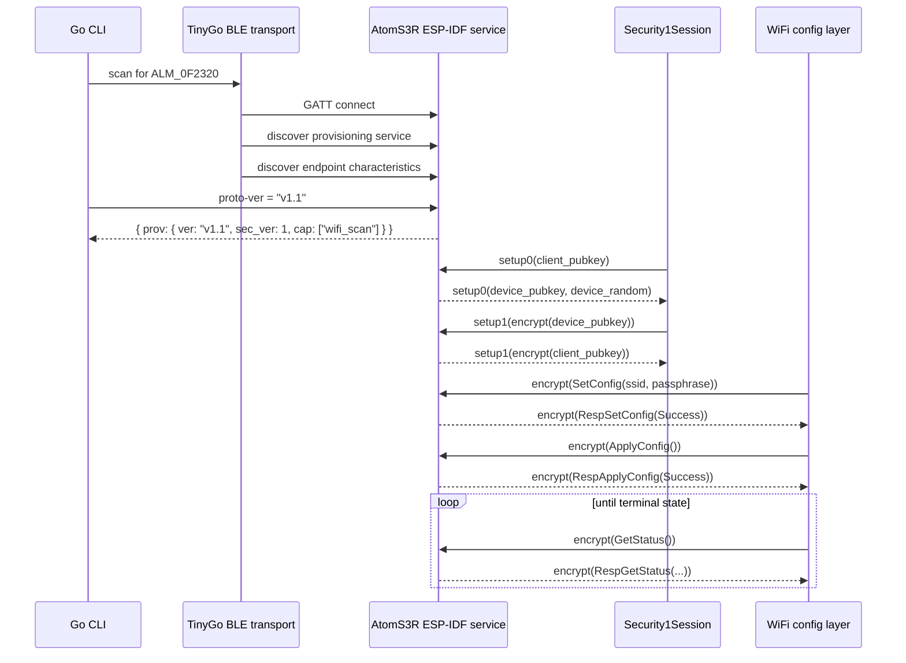
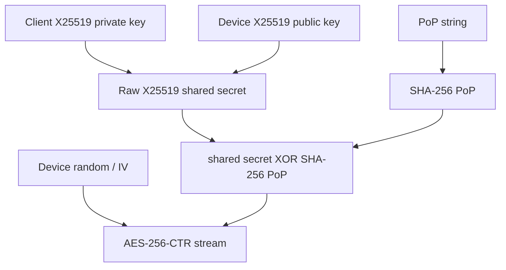

# Almanach BLE Provisioning: Native Go Protocol Deep Dive

This article explains how the Almanach AtomS3R printer can be provisioned over BLE by a native Go client. It is written as a technical deep dive rather than a changelog: the goal is to understand the protocol stack, the sequence of messages, the cryptographic session, and the implementation boundaries well enough that the same design can be carried into the browser JavaScript port later.

The key result is that the Go implementation no longer depends on Espressif's `esp_prov.py` for the main provisioning path. The Almanach binary can scan for the printer, connect over BLE, discover ESP-IDF protocomm endpoints, verify `proto-ver`, establish Security 1, send encrypted WiFi credentials, apply them, and poll until the firmware reports a connected state.

> [!summary]
> - ESP-IDF BLE provisioning is not a single protocol. It is a stack: BLE GATT transport, protocomm endpoints, protobuf payloads, Security 1, and WiFi provisioning commands.
> - The native Go implementation isolates BLE as a byte-oriented `Transport`, so the protocol code can be tested without hardware.
> - Security 1 is the compatibility-critical layer: X25519 derives a shared secret, PoP mutates it with SHA-256 XOR, and AES-CTR uses one continuous stream for both directions.
> - The implementation is now a reference for the future browser JavaScript port: JavaScript must reproduce the same endpoint ordering, protobuf shapes, and AES-CTR stream continuity.

## Why this note exists

A first-boot Almanach printer has no WiFi credentials. It cannot serve its own setup page because it is not yet on the network. ESP-IDF solves the first-boot problem by exposing a BLE provisioning service. A client connects to that service, proves it knows the proof-of-possession string, sends WiFi credentials through an encrypted channel, and waits while the device joins the access point.

At the beginning of this work, the Go command delegated to Espressif's Python client. That was a good validation tool, but a poor long-term foundation for a self-contained Almanach setup flow. The project needs a Go implementation because the Almanach binary should be able to provision the device without requiring an ESP-IDF Python environment. The project also needs a browser implementation later, and the browser version is easier to write once the protocol has already been reduced to a small, tested native reference.

The path therefore went through three stages:

1. Use Python to confirm that the firmware exposes a standard ESP-IDF provisioning service.
2. Port the protocol to Go and validate it with fake transports and real hardware.
3. Use the Go implementation as the teaching specimen for the browser JavaScript port.

This article focuses on stage two.

## The protocol stack

Provisioning looks simple from the command line:

```bash
almanach-render-service ble-provision \
  --implementation native \
  --action provision \
  --service-name ALM_0F2320 \
  --pop alm-0f2320 \
  --ssid <wifi-name>
```

Underneath that command are several layers. Each layer has a narrow job, and the Go implementation follows those boundaries closely.

| Layer | What it does | Almanach implementation |
|---|---|---|
| BLE GATT | Finds the device, connects, discovers service and characteristics, writes and reads bytes. | `internal/provisioning/native/tinygo_transport.go` |
| ESP-IDF protocomm endpoints | Names logical byte streams such as `proto-ver`, `prov-session`, and `prov-config`. | `internal/provisioning/native/transport.go`, `uuid.go` |
| Protobuf schemas | Defines binary message shapes for session and WiFi commands. | `internal/provisioning/native/proto/espidf/*.proto` and generated `*.pb.go` |
| Security 1 | Establishes an encrypted session using X25519, PoP, and AES-CTR. | `internal/provisioning/native/security1.go` |
| WiFi provisioning | Sends encrypted SetConfig, ApplyConfig, and GetStatus messages. | `internal/provisioning/native/wifi_config.go` |
| CLI orchestration | Sequences the layers and emits structured output. | `internal/app/cmd_ble_provision_native.go` |

The important design decision is that BLE is treated as a transport, not as the protocol. Once the GATT characteristic for `prov-config` has been found, the Security 1 and WiFi layers should not care whether bytes came from TinyGo Bluetooth, Web Bluetooth, a fake test transport, or a future USB transport.

```go
type Transport interface {
    Connect(ctx context.Context, serviceName string) error
    Disconnect(ctx context.Context) error
    Endpoints() map[string]EndpointInfo
    Send(ctx context.Context, endpoint string, request []byte) ([]byte, error)
}
```

That interface is deliberately small. It says: give me an endpoint name and bytes, and I will give you response bytes. Everything else is someone else's problem.

## The provisioning sequence

The successful Go hardware path has this shape:



Every arrow after setup1 consumes bytes from the same AES-CTR stream. That sentence is easy to miss and hard to debug. AES-CTR turns a block cipher into a keystream. Encryption and decryption are both XOR with that stream. If the client consumes the stream in a different order than the device, the next protobuf decode fails because the bytes are no longer meaningful protobuf.

## BLE transport and endpoint discovery

The firmware advertises a service name such as `ALM_0F2320`. The Go transport scans until it sees that exact local name, then connects and discovers the custom ESP-IDF provisioning service:

```text
021a9004-0382-4aea-bff4-6b3f1c5adfb4
```

ESP-IDF maps provisioning endpoints to characteristics. In the browser implementation, Chrome can read the `0x2901` user-description descriptors and recover names such as `proto-ver` and `prov-config`. The TinyGo central API used by the Go transport does not expose descriptor reads in the same way, so the native transport uses the endpoint UUID mapping validated earlier by Chrome:

| Endpoint | UUID | Purpose |
|---|---|---|
| `prov-ctrl` | `021aff4f-0382-4aea-bff4-6b3f1c5adfb4` | Control endpoint. |
| `prov-scan` | `021aff50-0382-4aea-bff4-6b3f1c5adfb4` | WiFi scan endpoint. |
| `prov-session` | `021aff51-0382-4aea-bff4-6b3f1c5adfb4` | Security 1 handshake. |
| `prov-config` | `021aff52-0382-4aea-bff4-6b3f1c5adfb4` | Encrypted WiFi config commands. |
| `proto-ver` | `021aff53-0382-4aea-bff4-6b3f1c5adfb4` | Plaintext protocol version probe. |

This is a pragmatic tradeoff. Descriptor discovery is more general, but known UUID mapping is stable for the current firmware and sufficient for Linux hardware validation. The JavaScript port can keep descriptor discovery because Web Bluetooth exposes descriptors.

## `proto-ver`: the plaintext sanity check

Before entering the encrypted session, the client writes `v1.1` to the `proto-ver` endpoint. The device replies with either a bare version string or a JSON capability envelope. The AtomS3R replied with:

```json
{
  "prov": {
    "ver": "v1.1",
    "sec_ver": 1,
    "sec_patch_ver": 0,
    "cap": ["wifi_scan"]
  }
}
```

This step is not just a nicety. It proves several things before cryptography enters the picture:

- The BLE device selected by the operator is the expected ESP-IDF provisioning device.
- The service UUID and characteristic mapping are correct.
- The firmware speaks the provisioning protocol version expected by the client.
- The firmware advertises Security 1 as the security scheme.

When debugging a provisioning failure, `proto-ver` is the first boundary to check. If `proto-ver` fails, the problem is transport or service discovery. If `proto-ver` succeeds but Security 1 fails, the problem is protobuf, X25519, PoP, or stream ordering.

## Protobuf: why generated bindings matter

ESP-IDF provisioning messages are protobuf messages. They are small, but they are not worth hand-maintaining. The Go implementation vendors the ESP-IDF `.proto` files and uses Buf to generate Go bindings.

The relevant schemas are:

```text
components/protocomm/proto/session.proto
components/protocomm/proto/sec1.proto
components/protocomm/proto/constants.proto
components/wifi_provisioning/proto/wifi_config.proto
components/wifi_provisioning/proto/wifi_constants.proto
```

The Almanach repository stores them under:

```text
internal/provisioning/native/proto/espidf/
```

Regeneration is explicit:

```bash
go generate ./internal/provisioning/native/proto
```

The generated bindings matter because the protocol is full of nested oneofs. For example, a Security 1 setup0 request is not simply “the public key.” It is a `SessionData` message with `sec_ver = SecScheme1`, whose `sec1` payload has `msg = Session_Command0`, whose oneof payload contains `sc0.client_pubkey`.

In pseudocode:

```text
SessionData {
  sec_ver = SecScheme1
  sec1 = Sec1Payload {
    msg = Session_Command0
    sc0 = SessionCmd0 {
      client_pubkey = <32 bytes>
    }
  }
}
```

Generated code keeps that structure honest. It also prevents a common class of mistakes where the field number is right but the oneof wrapper is wrong.

## Security 1, step by step

Security 1 is the heart of the protocol. Its job is to prove that both sides know the same shared secret and then use that shared secret to encrypt later provisioning messages.

The shared secret is built in three steps:

1. The client generates an X25519 key pair and sends its public key.
2. The device replies with its X25519 public key and a 16-byte random value used as the AES-CTR IV.
3. Both sides compute the X25519 shared secret. If a PoP exists, both sides compute `SHA256(PoP)` and XOR that digest into the shared secret.

The resulting 32-byte value is the AES-256 key.



The proof messages are then encrypted with AES-CTR:

| Message | Plaintext before encryption | Meaning |
|---|---|---|
| Client proof | device public key | The client proves it derived the same AES stream by encrypting the device's public key. |
| Device proof | client public key | The device proves it derived the same AES stream by encrypting the client's public key. |

The Go code mirrors Espressif's Python implementation:

```go
shared, err := s.privateKey.ECDH(deviceKey)
if len(s.pop) > 0 {
    digest := sha256.Sum256(s.pop)
    xorInPlace(shared, digest[:])
}
block, err := aes.NewCipher(shared)
s.cipherStream = cipher.NewCTR(block, deviceRandom)
```

The subtle part is that `cipherStream` is used continuously. The client encrypts the device public key for setup1, then decrypts the device proof, then encrypts SetConfig, then decrypts SetConfig response, and so on. There are not separate streams for requests and responses. There is not a reset between messages.

This is the rule to remember:

> Security 1 is not “AES-CTR per packet.” It is one AES-CTR stream shared across the entire session.

## WiFi config after Security 1

Once Security 1 is established, the WiFi config layer sends protobuf messages through `prov-config`. Each request is serialized as protobuf, encrypted with the current Security 1 stream position, sent to the device, and answered with an encrypted protobuf response.

The provisioning sequence is:

1. `TypeCmdSetConfig`: send SSID and passphrase.
2. `TypeCmdApplyConfig`: tell firmware to apply the credentials.
3. `TypeCmdGetStatus`: poll until the station state is connected, failed, or disconnected.

In pseudocode:

```text
set = WiFiConfigPayload(TypeCmdSetConfig, ssid, passphrase)
send prov-config encrypt(set)
expect TypeRespSetConfig(Success)

apply = WiFiConfigPayload(TypeCmdApplyConfig)
send prov-config encrypt(apply)
expect TypeRespApplyConfig(Success)

loop:
  get = WiFiConfigPayload(TypeCmdGetStatus)
  status = decrypt(send prov-config encrypt(get))
  if status is connected or failed or disconnected:
    return status
  sleep
```

The Go implementation exposes both small operations and a larger orchestration helper:

```go
func SetWiFiConfig(ctx context.Context, t Transport, sec *Security1Session, ssid, passphrase string) (espidf.Status, error)
func ApplyWiFiConfig(ctx context.Context, t Transport, sec *Security1Session) (espidf.Status, error)
func GetWiFiStatus(ctx context.Context, t Transport, sec *Security1Session) (*WiFiStatus, error)
func (c *Client) ProvisionWiFi(ctx context.Context, ssid, passphrase string, pollInterval time.Duration) (*WiFiStatus, error)
```

That split is useful because tests can validate each protocol piece, while the CLI can call the high-level helper.

## The fake transport is not a mock; it is a protocol simulator

The fake transport used in tests does more than return canned bytes. For Security 1, it behaves like a small device implementation. It receives the client's setup0 protobuf, derives the same X25519 shared secret, applies PoP, initializes AES-CTR with a deterministic IV, verifies the client's proof, sends the encrypted device proof, and then decrypts/encrypts later WiFi config messages.

That matters because the easiest broken implementation is one that can serialize protobufs but consumes the AES stream in the wrong order. A canned-response mock would not catch that. A fake peer with the same stream rules does.

The tests prove three different things:

- The handshake succeeds when both sides use the same PoP.
- The handshake fails when the PoP differs.
- The encrypted config flow can carry SSID/passphrase, apply the config, and poll statuses.

The test boundary is the same boundary used in production: `Transport.Send(endpoint, bytes)`.

## Hardware validation

The native command was validated on the real AtomS3R. The CLI reported a connected state:

```yaml
action: provision
implementation: native
proto_ver: v1.1
sec_ver: 1
service_name: ALM_0F2320
ssid: Verizon_9DNVB9
wifi_state: connected
wifi_status: Success
```

The firmware monitor independently confirmed the same story:

```text
provisioning: Provisioning security session established
provisioning: Received WiFi credentials for SSID 'Verizon_9DNVB9'
wifi:connected with Verizon_9DNVB9
esp_netif_handlers: sta ip: 192.168.1.242, mask: 255.255.255.0, gw: 192.168.1.1
wifi_mgr: Got IP: 192.168.1.242
provisioning: Provisioned WiFi credentials connected successfully
stoms3r: WiFi connected — starting web server
web_server: HTTP server started on port 80
wifi_prov_mgr: Provisioning stopped
provisioning: BLE WiFi provisioning ended
```

That trace is the strongest evidence because it crosses every boundary: Go command, Linux BLE stack, ESP-IDF protocomm, Security 1, WiFi manager, DHCP, and the firmware web server.

## Failure modes worth remembering

### A connected status can still show a default enum value

The first successful hardware run printed `wifi_fail_reason: AuthError` next to `wifi_state: connected`. The device was not reporting an authentication error. The bug was in the reader: protobuf enum zero defaults to `AuthError`, and the code called `GetFailReason()` without checking whether the oneof field was actually present.

The fix was to track oneof presence:

```go
if _, ok := status.GetState().(*espidf.RespGetStatus_FailReason); ok {
    out.FailReason = status.GetFailReason()
    out.HasFailReason = true
}
```

The general rule is broader than this project: in proto3, zero values are not evidence. Presence matters when interpreting oneofs and optional fields.

### AES-CTR stream drift looks like random protobuf failure

If encryption and decryption use separate CTR streams, or if one side consumes bytes in a different order, the next decrypted response becomes garbage. The symptom may appear as a protobuf parse error, but the cause is cryptographic stream drift.

When debugging this class of failure, ask: what bytes has each side consumed from the CTR stream, and in what order?

### BLE success changes the device state

A successful provisioning run stops BLE provisioning and starts the firmware web server. That is the desired behavior, but it makes repeated tests stateful. Future work should add native reset/reprovision support so the device can be returned to provisioning mode without external cleanup.

## How this maps to the browser JavaScript port

The JavaScript port should not reinvent the protocol. It should translate the Go implementation layer by layer.

| Go layer | Browser equivalent |
|---|---|
| `TinyGoTransport` | Web Bluetooth client in `web/src/provisioning/espidf-client.js` |
| `Transport.Send(endpoint, []byte)` | `sendEndpointBytes(endpoint, Uint8Array)` |
| Buf-generated Go protobufs | JavaScript protobuf helpers or generated JS/TS bindings |
| `Security1Session` | Browser Security 1 module using WebCrypto or a small X25519 implementation |
| `SetWiFiConfig` / `ApplyWiFiConfig` / `GetWiFiStatus` | Browser provisioning methods behind the React wizard client API |

The browser implementation already has picker, GATT connection, service discovery, endpoint mapping, and `proto-ver`. The missing pieces are exactly the layers that the Go implementation now teaches:

1. Binary endpoint send/receive instead of text-only `proto-ver` helpers.
2. Protobuf encoding/decoding for `SessionData` and `WiFiConfigPayload`.
3. X25519 key exchange and PoP-adjusted AES-CTR stream.
4. Encrypted WiFi SetConfig, ApplyConfig, and GetStatus.
5. UI progress states that reflect the real protocol stages.

The browser has one additional constraint: Web Bluetooth characteristic reads and writes are asynchronous and permission-bound. But that is a transport concern. The protocol logic should still look like the Go code: send bytes to an endpoint, get bytes back, advance the Security 1 stream, decode the response.

## Working rules

- Keep transport and protocol separate. BLE APIs are noisy; protocol code should speak endpoint bytes.
- Treat `proto-ver` as the first diagnostic boundary. Do not debug encryption until plaintext version probing works.
- Use generated or carefully tested protobuf helpers. Hand-written protobuf encoders are acceptable only if tests prove the exact bytes.
- Preserve AES-CTR stream continuity. Do not reset the stream per message.
- Check protobuf presence before interpreting default enum values.
- Keep Python fallback until native reset/reprovision and repeated hardware testing are comfortable.

## Current status and next steps

The native Go provisioning implementation works end-to-end on the AtomS3R. The code path is hardware-validated for initial provisioning and tested with fake transports for the cryptographic and encrypted configuration layers.

The next project step is the JavaScript port. The first browser milestone should not be a UI redesign; it should be a protocol milestone: reproduce Go's Security 1 and encrypted WiFi config sequence inside the existing Web Bluetooth client, then let the existing React wizard call it.

The document should be updated once the JavaScript port is complete. At that point, the most useful addition will be a side-by-side comparison of the Go and JavaScript implementations, especially around X25519 availability, AES-CTR stream handling, and protobuf generation strategy.
