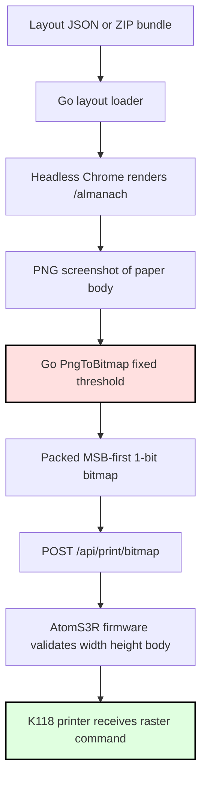
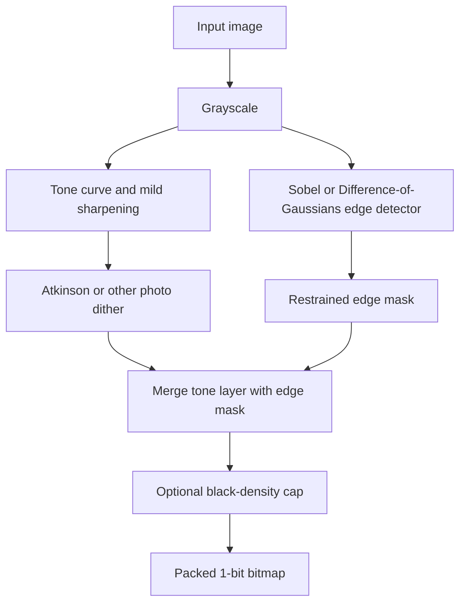
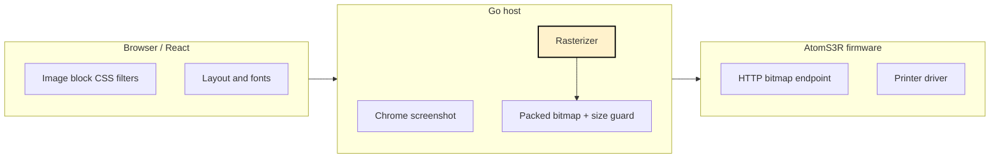
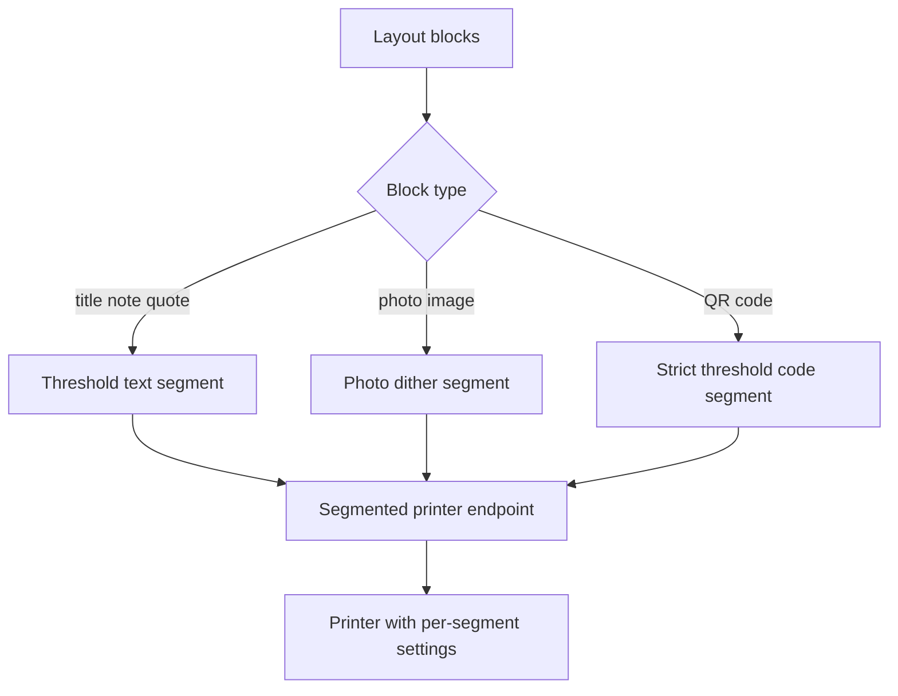

# Thermal Dithering Algorithms - Almanach Rasterization Deep Dive

Almanach prints beautiful little thermal-paper pages by turning a rendered web layout into a stream of black and white dots. That sounds simple until the page contains a photograph. Text wants crisp edges. A QR code wants exact modules. A cat portrait wants fur, whiskers, eyes, and shadow detail. A thermal printhead, however, only receives a binary instruction for each dot: heat this spot, or do not heat it.

This report explains the family of algorithms that sit between those worlds. It is written as a technical deep dive for someone who needs to understand the problem well enough to implement the next Almanach rasterizer, not merely choose a filter from a menu.

> [!summary]
> - Almanach currently uses fixed-threshold 1-bit rasterization after a Chrome screenshot. This is reliable for text but weak for photos.
> - Dithering algorithms simulate gray by distributing black dots across space. The main families are thresholding, ordered dithering, error diffusion, blue-noise masks, and edge-aware hybrids.
> - The best near-term Almanach experiment is a physical comparison sheet: threshold, Bayer, Floyd-Steinberg, Atkinson, Stucki/Sierra, blue-noise, and edge-hybrid on the same cat portraits.
> - The likely production direction is block-aware or segmented printing: text remains thresholded, images are dithered, and future firmware endpoints allow per-segment density and transport behavior.

## Why this note exists

The immediate trigger was practical: cat portraits printed on the AtomS3R/K118 thermal printer exposed the weakness of a fixed-threshold rasterizer. Some images looked too dark. Some fine edges disappeared. The printer itself was working; the problem had moved up the stack into image conversion.

That is an important distinction. When a physical printer produces bad photo output, it is tempting to look at the wire protocol first: baud rate, flow control, chunking, buffering, command bytes. Those matter, and in Almanach they were already investigated in the printer UART work. But once the endpoint reliably accepts a 1-bit bitmap, visual quality mostly depends on the rasterizer. The rasterizer decides which dots become black before the firmware ever sees the page.

The goal of this note is to preserve the mental model, algorithm vocabulary, and implementation plan for improving that rasterizer. It should help a future engineer answer three questions:

1. What is Almanach doing today?
2. Which algorithms are worth testing, and what tradeoffs do they make?
3. How should we introduce adaptive rasterization without breaking the working print path?

## The current Almanach print pipeline

Almanach’s current print path has a clean shape. The Go server renders the layout with headless Chrome, captures a PNG screenshot, converts the PNG to a packed 1-bit bitmap, and sends the bitmap to the ESP32 firmware.



The highlighted box is the part this report is about. `PngToBitmap` currently performs a single global threshold operation. For each pixel in the screenshot, it computes luminance and compares that gray value to a threshold, usually `128`.

The essential logic is:

```go
for y := 0; y < height; y++ {
    for x := 0; x < width; x++ {
        gray := 0.299*r + 0.587*g + 0.114*b
        if gray < threshold {
            setPackedBit(x, y)
        }
    }
}
```

There is no local contrast adjustment. There is no dithering. There is no special treatment for image blocks, text blocks, QR codes, or thin lines. The screenshot has already flattened everything into one image, and the converter treats every pixel the same.

That simplicity is valuable. It gives us a stable baseline and a known byte contract with the firmware. But it also explains the visual failure mode: one threshold cannot represent continuous tone.

## What a 1-bit thermal printer can and cannot do

A thermal printer is a grid of heating elements. If a dot is heated, the thermal paper darkens. If it is not heated, the paper remains light. Some printers and modes can vary effective darkness through timing, density, speed, or repeated passes, but Almanach’s current endpoint sends one 1-bit bitmap. The host has already decided the page.

This means the host must answer a hard question:

> If the original pixel is 40% gray, how do we represent that on a device that only has black and white?

There are only a few possible answers:

- We can treat 40% gray as white or black using a threshold.
- We can arrange black and white dots so that, from a distance, the region looks gray.
- We can preserve some structures, such as edges, even when the tone representation is imperfect.
- We can change printer density or speed per region, but that requires segmented printing or a richer firmware endpoint.

The second answer is dithering. The third answer is adaptive or edge-aware rasterization.

## The important distinction: text, photos, and codes are different objects

The hardest part of Almanach rasterization is not choosing one algorithm. It is recognizing that a page is not one kind of visual object.

Text is already symbolic. The browser has converted font outlines into antialiased pixels, but the intent is still crisp black strokes on white paper. If we run error diffusion across text, the glyph edges can become noisy. A dithered `e` may be technically tonal, but it is worse as text.

Photos are continuous-tone images. They need dot patterns to simulate gray. A thresholded photograph usually becomes either washed out or blocked up. Error diffusion, ordered dithering, and blue-noise masks exist for exactly this case.

QR codes and barcodes are neither text nor photos. They are machine-readable binary patterns. Dithering them is wrong. Resizing them carelessly is wrong. They should be thresholded sharply at the correct module size.

This gives us the first design rule:

> Almanach should eventually be block-aware. Text, codes, icons, line art, and photos should not all share the same rasterization policy.

The current screenshot path cannot fully enforce that rule because it flattens the page before rasterization. But the rule still guides the implementation plan. First we add whole-page raster modes for experimentation. Then we move toward block-aware or segmented printing.

## A map of the algorithm families

The main dithering and rasterization families differ in how they decide the black pixels.

| Family | Basic idea | Strength | Weakness | Almanach role |
|---|---|---|---|---|
| Fixed threshold | Compare each pixel to one value. | Crisp, fast, deterministic. | Loses midtones. | Text, QR, baseline. |
| Adaptive threshold | Compute threshold from local neighborhood. | Handles uneven lighting and line art. | Can amplify noise. | Scans, drawings, fallback for line art. |
| Ordered Bayer | Compare to repeated matrix. | Fast and stable. | Visible grid pattern. | Baseline, retro mode. |
| Blue-noise ordered | Compare to high-frequency mask. | Stable texture, good for photos. | Needs good mask. | Strong photo candidate. |
| Error diffusion | Push quantization error to neighbors. | Good tones and detail. | Worms, directionality, dark clusters. | Photo modes. |
| Edge hybrid | Combine tone dither with edge mask. | Preserves outlines. | Can add speckles. | Cat portraits and line-rich photos. |

The rest of this report walks through these families in a way that connects concept to implementation.

## Fixed thresholding: the baseline that should not disappear

Thresholding is the simplest rasterizer. It chooses a cutoff and makes every pixel darker than the cutoff black.

```text
if gray < 128:
    black
else:
    white
```

This is the current Almanach behavior. It is easy to criticize because it fails on photos, but it is also the correct choice for many objects. Text should often be thresholded. QR codes should be thresholded. A simple black icon should be thresholded.

The failure appears when thresholding is asked to represent tone. Imagine a smooth gradient from white to black. A threshold turns that gradient into a hard boundary. Everything lighter than the threshold is paper. Everything darker is ink. The middle of the gradient does not become gray; it becomes a cliff.

For a cat portrait, that cliff can erase the most important details. A dark cat’s fur may collapse into one black shape. A light cat’s whiskers may vanish into the paper. The face stops being a structure and becomes a silhouette.

Thresholding should remain in Almanach, but it should become one mode among several:

```yaml
render:
  rasterMode: threshold
  threshold: 128
```

The most important regression test for any new rasterizer is that `rasterMode: threshold` produces byte-identical output to the current implementation.

## Adaptive thresholding: local decisions instead of one global cutoff

Adaptive thresholding changes the question. Instead of asking whether a pixel is darker than one global threshold, it asks whether the pixel is darker than its local neighborhood.

A simple adaptive mean threshold looks like this:

```pseudocode
for each pixel p:
    window = pixels around p
    local_mean = average(window)
    threshold = local_mean + bias
    output[p] = gray[p] < threshold
```

This is useful for scanned documents and drawings because the background may not be uniform. A pencil line on a grayish background may be visible locally even if it is not very dark globally.

The more sophisticated versions, such as Niblack and Sauvola, use local variance as well as local mean. Their intuition is that flat background regions and textured detail regions should not be treated the same way.

```pseudocode
for each pixel p:
    m = mean(local_window)
    s = standard_deviation(local_window)
    threshold = m * (1 + k * (s / R - 1))
    output[p] = gray[p] < threshold
```

Adaptive thresholding is not automatically better for photos. It can turn texture into noise. Fur is especially dangerous because it contains real fine structure and high-frequency texture. The algorithm may amplify both.

For Almanach, adaptive thresholding is best treated as a line-art and scan mode, not the default photo mode.

## Ordered dithering: replacing gray with a repeated decision pattern

Ordered dithering uses a threshold matrix. The matrix is tiled across the image, and each pixel compares its gray value against the threshold at that matrix position.

A small Bayer matrix looks like this:

```text
 0  8  2 10
12  4 14  6
 3 11  1  9
15  7 13  5
```

The matrix encodes the order in which black dots appear as the desired tone gets darker. A light gray region receives only a few dots. A darker gray region receives more dots. Because the pattern repeats, the output is predictable.

```pseudocode
matrix = bayer8x8
for y, x:
    local_threshold = matrix[y mod 8][x mod 8]
    output[y][x] = gray[y][x] < local_threshold
```

Ordered dithering has two major advantages. It is fast, and it does not accumulate error. Every pixel can be processed independently. That makes it attractive for browser previews, embedded systems, and deterministic tests.

Its weakness is also obvious: the pattern can be visible. Bayer dithering often looks like a retro screen texture. Sometimes that is charming. Sometimes it fights the image.

For Almanach, Bayer 4x4 and 8x8 are worth including in the comparison lab because they provide stable reference points. They may not win the cat portrait test, but they help us see what the printer does with regular dot structure.

## Blue-noise masks: ordered dithering without the grid feeling

Blue-noise dithering is conceptually close to ordered dithering: compare each pixel to a mask. The difference is the shape of the mask. A Bayer matrix has visible order. A good blue-noise mask distributes dots in a way that avoids low-frequency clumps and obvious grid artifacts.

The human eye is sensitive to low-frequency structure. We notice bands, grids, and worms. Blue-noise patterns push the error into high frequencies, where the texture feels more like fine grain than a visible pattern.

The algorithmic shape is simple once we have the mask:

```pseudocode
mask = blue_noise_64x64_values_0_to_255
for y, x:
    t = mask[y mod 64][x mod 64]
    output[y][x] = gray[y][x] < t
```

The hard part is obtaining or generating a good mask. The first Almanach browser lab currently has a deterministic hash-mask approximation, which is useful for interaction but should not be mistaken for a real void-and-cluster blue-noise mask.

A production implementation should embed a known-good mask with a clear source and license. The mask should be treated like a test fixture: stable, versioned, and reproducible.

## Error diffusion: a local mistake becomes a future correction

Error diffusion starts with a single-pixel decision, just like thresholding. The difference is what happens afterward. If the algorithm turns a 40% gray pixel into white, it has made that pixel too light. Instead of ignoring the error, it distributes the error to neighboring pixels that have not yet been processed.

That is the central idea:

```pseudocode
old = gray[x,y]
new = black_or_white(old)
error = old - new
add parts of error to future neighbors
```

This makes a row of decisions behave like a tone-preserving system. If one pixel is forced to be white, another nearby pixel becomes more likely to be black. Over a region, the average darkness approximates the original gray value.

### Floyd-Steinberg

Floyd-Steinberg is the classic error diffusion algorithm. Its kernel is small:

```text
       X   7/16
3/16 5/16 1/16
```

The `X` is the current pixel. The weights show where the error goes.

```pseudocode
for y from top to bottom:
    for x from left to right:
        old = work[y][x]
        new = 0 if old < threshold else 255
        output[y][x] = new == 0
        error = old - new
        work[y][x+1]   += error * 7/16
        work[y+1][x-1] += error * 3/16
        work[y+1][x]   += error * 5/16
        work[y+1][x+1] += error * 1/16
```

Floyd-Steinberg is a strong baseline because it is efficient and widely understood. It usually preserves tone better than ordered Bayer dithering. But it can create worm-like artifacts, especially in smooth regions, and it may produce dark clusters that thermal paper renders too aggressively.

### Atkinson

Atkinson dithering is also error diffusion, but it diffuses less of the total error. It was used in early Macintosh graphics and often has a lighter, cleaner appearance.

A common Atkinson neighborhood is:

```text
      X  1  1
1  1  1
   1
/8
```

The important phrase is “less of the total error.” Atkinson does not fully conserve tone in the same way Floyd-Steinberg does. That sounds like a flaw, but on a thermal printer it can be a virtue. Thermal paper often prints photos too dark. A lighter algorithm can preserve face structure and avoid turning shadows into black pools.

For Almanach cat portraits, Atkinson is the algorithm to try early. It has the right failure mode. If it fails, it is likely to be slightly too stylized or too light, not a sheet of mud.

### Stucki, Burkes, and Sierra

Stucki, Burkes, and Sierra variants use different kernels. Larger kernels spread error more broadly. That can produce smoother tone, but it can also soften edges.

Stucki:

```text
          X   8  4
 2  4  8  4  2
 1  2  4  2  1
/42
```

Burkes:

```text
          X   8  4
 2  4  8  4  2
/32
```

Sierra 2-row:

```text
          X   4  3
 1  2  3  2  1
/16
```

These algorithms are worth testing because they occupy the middle ground between Floyd-Steinberg’s crispness and very smooth diffusion. The likely question is not “which one is mathematically best?” but “which one prints best on this paper, at this density, for Almanach’s images?”

## Edge-aware hybrid rasterization

A photograph is not only tone. It also has structure. Edges tell us where the cat’s eye ends, where the whisker crosses the background, and where fur changes direction. If dithering preserves average tone but loses those edges, the print still fails.

An edge-aware hybrid algorithm separates tone and structure.



The pseudocode is direct:

```pseudocode
gray = luminance(image)
toned = apply_brightness_contrast_gamma(gray)
toned = mild_unsharp_mask(toned)

tone_layer = atkinson_dither(toned)
edge_strength = sobel(gray)
edge_mask = edge_strength > edge_threshold
edge_mask = suppress_isolated_noise(edge_mask)

final = tone_layer OR edge_mask
final = cap_local_black_density(final)
```

The word “restrained” matters. A raw edge detector on fur will find thousands of edges. If we OR all of them into the final bitmap, the cat becomes noisy and dark. Edge preservation is useful only if it is selective.

Good edge-hybrid controls include:

- `edgeThreshold`, which decides how strong an edge must be before it is preserved.
- `edgeStrength`, which controls how much of the edge layer is merged.
- `maxBlackDensity`, which prevents local regions from becoming too dark.
- `sharpenAmount`, which can bring out whiskers before dithering but can also amplify noise.

Edge-hybrid mode is the likely “best quality” direction for Almanach photos, but it should not be the first production default. It needs physical test strips.

## Tone mapping matters as much as dithering

Dithering is not the whole pipeline. The grayscale image fed into the dither algorithm matters enormously.

For thermal paper, useful preprocessing includes:

- **Brightness lift.** Many photos need to be made lighter before dithering because thermal output darkens aggressively.
- **Contrast compression.** Reducing contrast can preserve detail in dark regions and prevent black blobs.
- **Gamma adjustment.** Gamma changes the shape of the midtones, often more naturally than a linear brightness shift.
- **Mild sharpening.** A small unsharp mask can preserve whiskers and face contours.
- **Black-density caps.** Local density limits prevent the printhead from producing large dark masses.

The current Almanach UI already has a CSS-level `thermalTone: light` mode. That is useful, but it is not a full rasterization strategy. It modifies the screenshot before thresholding; it does not control how dots are distributed.

A better Go-side option shape might be:

```yaml
render:
  rasterMode: atkinson
  threshold: 128
  brightness: 0.12
  contrast: 0.82
  gamma: 0.90
  ditherStrength: 1.0
```

For edge-hybrid mode:

```yaml
render:
  rasterMode: edge-hybrid
  threshold: 128
  brightness: 0.12
  contrast: 0.82
  gamma: 0.90
  edgeThreshold: 32
  edgeStrength: 0.5
  maxBlackDensity: 0.45
```

These values should not be treated as truth. They are starting points for physical comparison.

## The Almanach-specific design problem

If this were only an image conversion library, the implementation would be straightforward. Almanach is not only an image conversion library. It is a layout system, a browser renderer, a Go server, and a firmware print endpoint.

That means the rasterizer must respect system boundaries.



The first safe improvement lives in the Go host. The firmware should not need to know whether the bitmap came from thresholding or Atkinson dithering. It receives the same packed bytes.

That gives us a practical implementation rule:

> First change the host rasterizer. Do not change the firmware protocol until the visual algorithms have been tested.

The next limitation is semantic flattening. Once Chrome produces a screenshot, Go sees only pixels. It cannot tell which pixels are text and which pixels are photos unless we add extra metadata. This suggests a staged approach.

## Implementation sequence for Almanach

### Phase 1: preserve threshold behavior and add raster modes

The first code change should be conservative. It should wrap the existing threshold behavior in a new interface, then add one new mode.

```go
type RasterMode string

const (
    RasterThreshold RasterMode = "threshold"
    RasterAtkinson  RasterMode = "atkinson"
)

type RasterOptions struct {
    Mode      RasterMode
    Threshold uint8
    Brightness float64
    Contrast   float64
    Gamma      float64
}
```

The first test should prove that threshold mode is byte-identical to the current implementation.

```go
func TestThresholdMatchesLegacy(t *testing.T) {
    img := syntheticGradient(32, 8)
    old := imageToBitmap(img, 128)
    got := Rasterize(img, RasterOptions{Mode: RasterThreshold, Threshold: 128})
    require.Equal(t, old.Data, got.Data)
}
```

Then add Atkinson. Do not add every algorithm in the first branch. The goal is to prove the extension seam.

### Phase 2: expose `--raster-mode`

The CLI already exposes `--threshold`. Add:

```text
--raster-mode threshold|atkinson|floyd-steinberg|bayer8|edge-hybrid
--brightness
--contrast
--gamma
--edge-threshold
```

The layout wrapper can also carry render options:

```yaml
render:
  rasterMode: atkinson
  threshold: 128
layout:
  theme: minimal
  blocks: ...
```

### Phase 3: produce physical comparison sheets

Visual previews are helpful, but thermal paper is the judge. The comparison sheet should print the algorithm settings above each image. That is why the current browser lab was updated to print a settings header.

A good first sheet contains:

1. fixed threshold 128,
2. fixed threshold 160,
3. Bayer 8x8,
4. Floyd-Steinberg,
5. Atkinson,
6. Stucki or Sierra-2,
7. edge-hybrid.

Each strip should include the settings because otherwise physical test strips become anonymous paper fossils.

### Phase 4: add debug artifacts

When `--debug-dir` is set, the renderer should write more than `bitmap.bin`.

```text
screenshot.png
raster-preview.png
raster-gray.png
raster-tone.png
raster-edge.png
raster.json
bitmap.bin
```

`raster.json` should include:

```json
{
  "mode": "atkinson",
  "threshold": 128,
  "brightness": 0.12,
  "contrast": 0.82,
  "gamma": 0.90,
  "blackDensity": 0.37,
  "width": 384,
  "height": 511,
  "bytes": 24528
}
```

### Phase 5: move toward block-aware or segmented printing

Whole-page dithering will eventually hit a ceiling. Text and images want different treatment. The clean future shape is segmented printing:



This also helps with large prints. A single bitmap body is currently guarded at 90 KiB. Segments can be buffered, printed, and separated safely.

## Instructions for writing the full research report

A full research report on dithering for Almanach should not begin by listing algorithms. It should begin with the physical constraint: a thermal printer accepts black and white dots, while a photo contains continuous tone. The algorithms are answers to that constraint.

Use this structure:

1. **Open with the printer’s limitation.** Explain the 1-bit dot decision and why photos are hard.
2. **Map the current Almanach pipeline.** Show where browser rendering ends and bitmap conversion begins.
3. **Define the evaluation criteria.** Edge preservation, tone accuracy, text readability, black density, speed, determinism, and implementation complexity.
4. **Explain each algorithm family.** For each one, give intuition, pseudocode, strengths, weaknesses, and likely Almanach use.
5. **Separate preview quality from print quality.** Explain why a PNG preview is necessary but insufficient.
6. **Design physical experiments.** Include comparison sheets, labels, controlled inputs, and black-density measurements.
7. **Recommend a phased implementation.** Start with threshold-preserving refactor, then Atkinson, then comparison tooling, then edge-hybrid, then segmented printing.
8. **End with working rules.** Make the report actionable: when to use threshold, when to use Atkinson, when to avoid dithering, and when to segment.

The report should include these concrete artifacts:

- a diagram of the current render-to-print pipeline,
- a table comparing algorithm families,
- pseudocode for thresholding, ordered dithering, error diffusion, and edge hybrid,
- screenshots or printed scan examples for each algorithm,
- a description of the exact printer settings used,
- source links and code references,
- a reproducible command or browser lab workflow.

A good research report is not a list of facts. It is a teaching document that lets the next engineer make correct decisions without repeating the same investigation.

## Working rules for Almanach rasterization

- Keep fixed threshold as the default until physical tests justify changing it.
- Do not dither QR codes, barcodes, or small text.
- Use Atkinson as the first photo candidate because it tends to print lighter and cleaner on thermal paper.
- Treat Floyd-Steinberg as a baseline, not automatically as the best algorithm.
- Add a true blue-noise mask before judging blue-noise output seriously.
- Use edge-hybrid mode only with restrained edge thresholds and density controls.
- Print settings with every physical test strip.
- Measure black density and byte size; do not rely only on visual impressions.
- Keep the firmware bitmap contract stable while evaluating algorithms.
- Move to segmented printing when image-specific and text-specific rasterization need to coexist on one page.

## Current project artifacts

The rasterization work currently lives in the Almanach repo:

```text
/home/manuel/workspaces/2026-05-08/extract-almanach/almanach
```

The main ticket is:

```text
ttmp/2026/05/10/ALMANACH-RASTERIZATION--improve-thermal-image-rasterization-and-adaptive-dithering
```

Important files:

| File | Purpose |
|---|---|
| `internal/app/bitmap.go` | Current fixed-threshold bitmap conversion. |
| `internal/app/renderer.go` | Chrome screenshot path and `PngToBitmap` call. |
| `internal/app/printer.go` | Host-side packed bitmap POST and 90 KiB guard. |
| `firmware/atoms3r/main/web_server.c` | Firmware `/api/print/bitmap` validation and buffering. |
| `web/src/almanach-studio.jsx` | Image block controls and CSS thermal tone filters. |
| `ttmp/.../ALMANACH-RASTERIZATION.../design-doc/01-adaptive-thermal-rasterization-analysis-design-and-implementation-guide.md` | Intern-oriented implementation guide. |
| `ttmp/.../ALMANACH-RASTERIZATION.../various/raster-dither-lab.html` | Browser lab shell. |
| `ttmp/.../ALMANACH-RASTERIZATION.../various/raster-dither-lab.js` | Browser algorithms, controls, and print packing. |
| `ttmp/.../ALMANACH-RASTERIZATION.../scripts/01-serve-raster-dither-lab.py` | Localhost lab server and printer proxy. |

External references collected in the ticket include ImageMagick’s dithering examples, Tanner Helland’s algorithm writeup, Sweetcorn’s dithering notes, and Kagi Assistant research notes.

## Closing: the rasterizer is where page design becomes physics

A layout editor lives in fonts, margins, blocks, and images. A thermal printer lives in heat, paper, motion, and dots. Rasterization is the translation layer between those worlds. It is not a cosmetic afterthought; it is the moment the page becomes physical.

For Almanach, the right design is not one magic algorithm. The right design is a pipeline that knows what it is printing. Text should stay text-like. Codes should stay machine-readable. Photos should be dithered with tone and edge preservation. Long pages should be segmented so the printer receives stable, bounded work.

The next step is empirical. Print the same cat portrait with threshold, Atkinson, Floyd-Steinberg, Stucki or Sierra, Bayer, blue-noise, and edge-hybrid. Label every strip. Compare the eyes, whiskers, fur, shadows, and text labels. Then implement the smallest Go change that makes the winning behavior reproducible.
