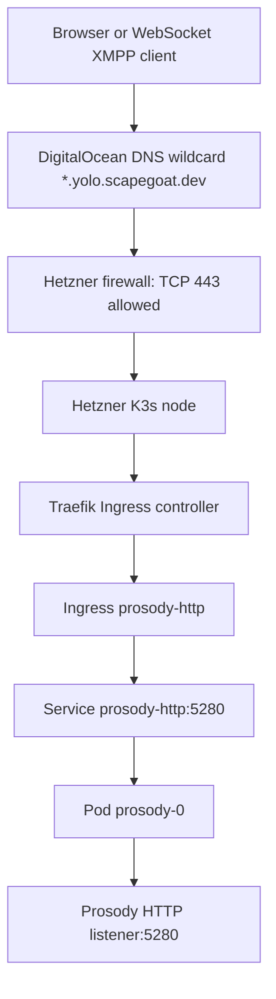
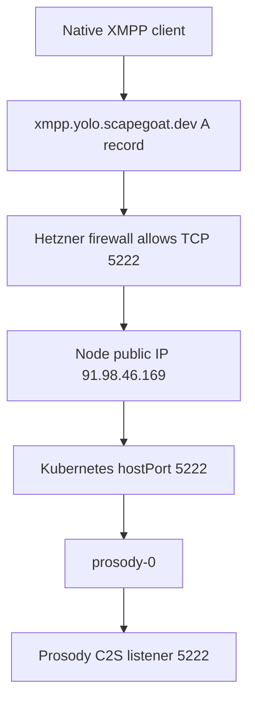
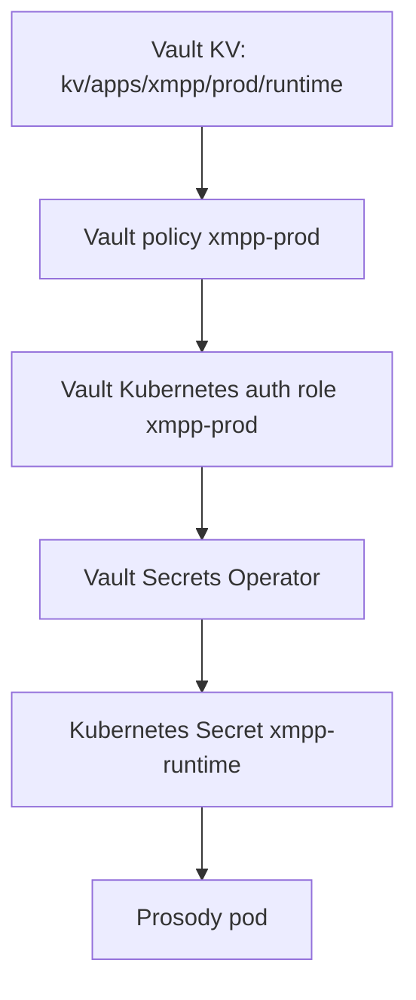

# XMPP on K3s: Prosody, Argo CD, Vault, DNS, and Firewall Boundaries

This report explains the XMPP deployment we built on the Hetzner K3s cluster. It is written as a technical deep dive rather than a changelog. The goal is to make the system understandable from first principles: what XMPP requires, how Kubernetes exposes network services, how Argo CD reconciles manifests, how Vault supplies runtime secrets, how cert-manager produces TLS material, how Terraform manages infrastructure boundaries, and why the firewall change was necessary for native XMPP clients.

> [!summary]
> - We deployed Prosody as a GitOps-managed XMPP server on the K3s cluster using Argo CD and Kustomize.
> - HTTPS WebSocket and BOSH endpoints are exposed through Traefik on `xmpp.yolo.scapegoat.dev`.
> - Native XMPP client traffic on TCP `5222` required two separate changes: a Kubernetes `hostPort` on the Prosody pod and a Hetzner firewall rule managed by Terraform.
> - Client discovery is now represented by an applied `_xmpp-client._tcp.xmpp.yolo.scapegoat.dev` SRV record in the Terraform-managed DigitalOcean DNS zone.
> - Federation is intentionally disabled: no S2S listener, no `5269` Service port, no firewall rule, and no `_xmpp-server` SRV record.

## Why this note exists

The XMPP rollout touched several layers that are easy to confuse if they are discussed only as commands. A working public endpoint is not created by one resource. It is created by a sequence of independently managed systems that must agree on names, ports, protocols, certificates, secrets, and ownership boundaries.

The most important example is the firewall work. Adding a Kubernetes `Service` for port `5222` is not the same as making port `5222` reachable from the public internet. A Kubernetes `Service` creates an in-cluster virtual endpoint. A Hetzner firewall rule decides whether packets from the public internet can reach the node at all. A pod `hostPort` decides whether a process inside the cluster is bound to the node's network port. DNS decides whether clients can discover the address and port. XMPP uses all of these layers.

This note records the architecture and the implementation decisions for future work on the deployment.

## The system we built

The deployed service is a Prosody XMPP server running in namespace `xmpp` on the Hetzner single-node K3s cluster. The GitOps source lives in:

```text
/home/manuel/code/wesen/2026-03-27--hetzner-k3s
```

The main files are:

```text
gitops/applications/xmpp.yaml
gitops/kustomize/xmpp/kustomization.yaml
gitops/kustomize/xmpp/configmap-prosody.yaml
gitops/kustomize/xmpp/statefulset-prosody.yaml
gitops/kustomize/xmpp/service-http.yaml
gitops/kustomize/xmpp/service-xmpp.yaml
gitops/kustomize/xmpp/ingress-http.yaml
gitops/kustomize/xmpp/vault-connection.yaml
gitops/kustomize/xmpp/vault-auth.yaml
gitops/kustomize/xmpp/vault-static-secret-runtime.yaml
vault/policies/kubernetes/xmpp-prod.hcl
vault/roles/kubernetes/xmpp-prod.json
scripts/bootstrap-xmpp-vault-secrets.sh
main.tf
```

The live state at the time of this report:

```text
Argo CD Application: xmpp
Sync status: Synced
Health status: Healthy
Revision: 0477d18db9a493bbeffa9229227fa9949b8da870

Pod: prosody-0
Status: Running
Ready: true

HTTP endpoints:
https://xmpp.yolo.scapegoat.dev/xmpp-websocket -> HTTP/2 200
https://xmpp.yolo.scapegoat.dev/http-bind       -> HTTP/2 200

Native XMPP client endpoint:
xmpp.yolo.scapegoat.dev:5222 -> STARTTLS succeeds with Let's Encrypt certificate

Client discovery:
_xmpp-client._tcp.xmpp.yolo.scapegoat.dev -> SRV 0 5 5222 xmpp.yolo.scapegoat.dev. (authoritative DigitalOcean DNS)

Federation:
Disabled; no S2S listener on 5269 and no _xmpp-server SRV record
```

## XMPP requirements

XMPP is not just an HTTP service. A minimal XMPP server may expose several protocol surfaces:

| Surface | Purpose | Typical port | Current status |
|---|---|---:|---|
| C2S | Client-to-server XMPP for native clients | `5222` | Exposed via pod `hostPort` and Hetzner firewall |
| S2S | Server-to-server XMPP federation | `5269` | Disabled by policy; no listener port, no Service port, no firewall rule, no SRV record |
| WebSocket | Browser-compatible XMPP transport | HTTPS path `/xmpp-websocket` | Exposed through Traefik Ingress |
| BOSH | HTTP binding for older/browser clients | HTTPS path `/http-bind` | Exposed through Traefik Ingress |
| Direct TLS C2S | XEP-0368 direct TLS client connections | `5223` | Deferred |
| Direct TLS S2S | XEP-0368 direct TLS server connections | `5270` | Deferred |

The distinction matters because Kubernetes HTTP Ingress solves only the HTTP surfaces. It can route `/xmpp-websocket` and `/http-bind`, but it does not make raw TCP `5222` reachable. Native XMPP client support requires a raw TCP path from the internet to the Prosody process.

The current deployment deliberately exposes only C2S on `5222`. Federation on `5269` is disabled by policy. That means Prosody is configured with no S2S listener ports, Kubernetes does not expose a Service port for `5269`, the Hetzner firewall does not allow `5269`, and Terraform DNS does not publish `_xmpp-server` records.

## The network path for HTTPS XMPP

The WebSocket and BOSH path uses the same HTTP ingress architecture as other applications on the cluster. A public client connects to `xmpp.yolo.scapegoat.dev` on `443`. Traefik receives the HTTPS request, terminates TLS using a cert-manager-managed certificate, and forwards the request to the `prosody-http` Service on port `5280`.



The GitOps resource responsible for this path is `gitops/kustomize/xmpp/ingress-http.yaml`:

```yaml
apiVersion: networking.k8s.io/v1
kind: Ingress
metadata:
  name: prosody-http
  annotations:
    argocd.argoproj.io/sync-wave: "0"
    cert-manager.io/cluster-issuer: letsencrypt-prod
    traefik.ingress.kubernetes.io/router.entrypoints: websecure
spec:
  ingressClassName: traefik
  tls:
    - hosts:
        - xmpp.yolo.scapegoat.dev
      secretName: xmpp-tls
  rules:
    - host: xmpp.yolo.scapegoat.dev
      http:
        paths:
          - path: /xmpp-websocket
          - path: /http-bind
```

The sync wave is `0` for a specific reason. Prosody mounts the `xmpp-tls` Secret as files under `/etc/prosody/certs`. That Secret is created by cert-manager only after the Ingress exists. If the Ingress is delayed until after the StatefulSet is healthy, the StatefulSet cannot become healthy because the pod cannot mount the certificate. We initially hit this deadlock and fixed it by moving the Ingress earlier.

The relevant dependency is:

```text
Ingress exists
  -> cert-manager observes TLS section
  -> cert-manager creates Certificate and ACME challenge
  -> Let's Encrypt issues certificate
  -> cert-manager writes Secret/xmpp-tls
  -> Prosody pod can mount /etc/prosody/certs
```

## The network path for native XMPP on port 5222

Native XMPP on `5222` has a different path. Traefik is not involved. The public packet must reach the node on TCP `5222`, and the node must have a pod binding that port.



This path has two required implementation pieces.

First, the pod must bind a port on the node. We did this with `hostPort` in `gitops/kustomize/xmpp/statefulset-prosody.yaml`:

```yaml
ports:
  - name: c2s
    containerPort: 5222
    hostPort: 5222
    protocol: TCP
```

Second, Hetzner must allow inbound traffic on that port. We did this in the root Terraform file `main.tf`:

```hcl
rule {
  direction  = "in"
  protocol   = "tcp"
  port       = "5222"
  source_ips = ["0.0.0.0/0", "::/0"]
}
```

These two changes are independent. If the Kubernetes `hostPort` exists but the Hetzner firewall blocks the port, external clients cannot connect. If the firewall allows `5222` but no pod binds `5222` on the node, clients can reach the node but no XMPP server answers. Both pieces are required.

The validation command was:

```bash
timeout 10 bash -c \
  'echo | openssl s_client -starttls xmpp \
    -connect xmpp.yolo.scapegoat.dev:5222 \
    -servername xmpp.yolo.scapegoat.dev'
```

The important result was that STARTTLS succeeded and the server presented the Let's Encrypt certificate for `xmpp.yolo.scapegoat.dev`:

```text
depth=0 CN = xmpp.yolo.scapegoat.dev
verify return:1
CONNECTED(00000003)
```

This proves that the path from the public internet to Prosody's C2S listener is working.

## Firewall boundaries

There are three firewall or routing boundaries to keep separate.

| Boundary | Managed by | What it controls | Example in this deployment |
|---|---|---|---|
| DNS resolution | `/home/manuel/code/wesen/terraform` DigitalOcean DNS | What hostname resolves to which target | `*.yolo.scapegoat.dev -> 91.98.46.169` |
| Cloud firewall | K3s repo root Terraform `hcloud_firewall.default` | Which public packets reach the Hetzner node | Allow TCP `5222` from `0.0.0.0/0` and `::/0` |
| Kubernetes pod binding | K3s GitOps manifests | Which process receives traffic once it reaches the node | `hostPort: 5222` on `prosody-0` |

The K3s cluster has long allowed `80` and `443` publicly because those are used by Traefik for HTTP and HTTPS applications. It also allows `40000-40100` for the MiroTalk SFU media path. It did not previously allow public `5222`, because no native XMPP service existed.

The relevant firewall section now looks like this:

```hcl
resource "hcloud_firewall" "default" {
  name = "${var.server_name}-fw"

  rule {
    direction  = "in"
    protocol   = "tcp"
    port       = "80"
    source_ips = ["0.0.0.0/0", "::/0"]
  }

  rule {
    direction  = "in"
    protocol   = "tcp"
    port       = "443"
    source_ips = ["0.0.0.0/0", "::/0"]
  }

  rule {
    direction  = "in"
    protocol   = "tcp"
    port       = "5222"
    source_ips = ["0.0.0.0/0", "::/0"]
  }
}
```

The rule is intentionally C2S-only. We did not open `5269` because that would expose server-to-server federation. Federation is not just another port. It changes the threat model by allowing remote XMPP servers to connect to this server. That should be done with an explicit moderation and monitoring plan.

## DNS and SRV records

DNS has two jobs in this deployment. The first job is ordinary address resolution: the hostname `xmpp.yolo.scapegoat.dev` must resolve to the K3s node. The second job is XMPP service discovery: a client that knows a JID domain must be able to discover the XMPP client endpoint and port. These are different DNS record types, and they live in the same Terraform-managed DigitalOcean zone.

The public hostname `xmpp.yolo.scapegoat.dev` currently resolves through the existing wildcard A record for `*.yolo.scapegoat.dev`. That wildcard is managed in the separate Terraform repository:

```text
/home/manuel/code/wesen/terraform/dns/zones/scapegoat-dev/envs/prod/main.tf
```

The K3s repo does not own the public DNS zone. This is an important ownership boundary:

- The K3s repo owns Kubernetes desired state and Hetzner node infrastructure for this cluster.
- The Terraform repo owns the DigitalOcean DNS zone for `scapegoat.dev`.

XMPP clients can use A-record fallback in some cases, but XMPP service discovery is designed around SRV records. The C2S SRV record is now live on DigitalOcean authoritative DNS:

```dns
_xmpp-client._tcp.xmpp.yolo.scapegoat.dev. 3600 IN SRV 0 5 5222 xmpp.yolo.scapegoat.dev.
```

This record says: for client connections to accounts under `xmpp.yolo.scapegoat.dev`, use `xmpp.yolo.scapegoat.dev` on TCP port `5222`. It does not enable server-to-server federation. Federation would require a separate `_xmpp-server._tcp...` record and a reachable `5269` listener, neither of which exists in the current deployment.

We prepared the Terraform DNS record loop to support SRV records by adding `port` and `weight` fields to the `digitalocean_record` resource loop in the Terraform repo:

```hcl
resource "digitalocean_record" "records" {
  for_each = local.records

  domain   = digitalocean_domain.scapegoat.id
  type     = each.value.type
  name     = each.value.name
  value    = each.value.value
  ttl      = each.value.ttl
  priority = lookup(each.value, "priority", null)
  port     = lookup(each.value, "port", null)
  weight   = lookup(each.value, "weight", null)
}
```

We later added and applied the actual client SRV record through the Terraform DNS repository. The DigitalOcean token is loaded from `/home/manuel/code/wesen/terraform/.envrc` for the apply path. The Terraform record is:

```hcl
xmpp_client_yolo_srv = {
  type     = "SRV"
  name     = "_xmpp-client._tcp.xmpp.yolo"
  value    = "xmpp.yolo.scapegoat.dev."
  priority = 0
  port     = 5222
  weight   = 5
  ttl      = 3600
}
```

There is intentionally no `_xmpp-server` record because federation is disabled. Authoritative DigitalOcean DNS now answers:

```text
_xmpp-client._tcp.xmpp.yolo.scapegoat.dev. 3600 IN SRV 0 5 5222 xmpp.yolo.scapegoat.dev.
```

Recursive resolvers may take longer to show the record if they cached a negative answer before the apply. The authoritative check is the correct immediate post-apply proof:

```bash
dig @ns1.digitalocean.com SRV _xmpp-client._tcp.xmpp.yolo.scapegoat.dev +noall +answer
```

## Argo CD and Kustomize

Argo CD is the controller that makes the cluster match Git. The `Application` resource is the object that tells Argo CD which Git repo, revision, and path to render.

The XMPP application is defined in `gitops/applications/xmpp.yaml`:

```yaml
apiVersion: argoproj.io/v1alpha1
kind: Application
metadata:
  name: xmpp
  namespace: argocd
spec:
  destination:
    server: https://kubernetes.default.svc
    namespace: xmpp
  source:
    repoURL: https://github.com/wesen/2026-03-27--hetzner-k3s.git
    targetRevision: main
    path: gitops/kustomize/xmpp
  syncPolicy:
    automated:
      prune: true
      selfHeal: true
```

The Kustomize package is the manifest bundle at `gitops/kustomize/xmpp`. It declares the resources that make up the XMPP service:

```text
Namespace
ServiceAccount
VaultConnection
VaultAuth
VaultStaticSecret
ConfigMap
StatefulSet
Service prosody-http
Service prosody-xmpp
Ingress prosody-http
```

The application was bootstrapped manually once because this repository does not currently have an app-of-apps layer that automatically creates new Argo CD `Application` resources from Git.

```bash
kubectl apply -f gitops/applications/xmpp.yaml
kubectl -n argocd annotate application xmpp argocd.argoproj.io/refresh=hard --overwrite
```

After that first apply, Argo CD owns the continuous reconciliation loop.

## Vault Secrets Operator and runtime secrets

The deployment uses Vault Secrets Operator rather than committing Kubernetes Secret values to Git. The flow is:



The Kubernetes resources are:

```text
gitops/kustomize/xmpp/vault-connection.yaml
gitops/kustomize/xmpp/vault-auth.yaml
gitops/kustomize/xmpp/vault-static-secret-runtime.yaml
```

The Vault files are:

```text
vault/policies/kubernetes/xmpp-prod.hcl
vault/roles/kubernetes/xmpp-prod.json
scripts/bootstrap-xmpp-vault-secrets.sh
```

The runtime secret contains at least:

```text
admin_jid
admin_password
component_secret
public_url
websocket_url
bosh_url
```

The pod consumes `admin_jid` and `admin_password` as environment variables. The current StatefulSet has a `postStart` hook that creates the configured admin account:

```sh
user="${PROSODY_ADMIN_JID%@*}"
host="${PROSODY_ADMIN_JID#*@}"
prosodyctl register "${user}" "${host}" "${PROSODY_ADMIN_PASSWORD}" || true
```

The hook does not print the password. The runtime validation confirmed that the account data file exists:

```text
/var/lib/prosody/xmpp%2eyolo%2escapegoat%2edev/accounts/admin.dat
```

The generated admin password was also stored in 1Password so it can be used from Monal on iPhone without copying the secret from terminal output. The item is in the `Private` vault of `my.1password.com`:

```text
Title: XMPP admin xmpp.yolo.scapegoat.dev
Item ID: 7eyqi36a3e5hiszfvtr5zu7quu
Username: admin@xmpp.yolo.scapegoat.dev
Server: xmpp://xmpp.yolo.scapegoat.dev
Tags: k3s, monal, prosody, xmpp
```

The password moved from Vault to 1Password through the `op` CLI using a JSON template, not a visible command-line assignment. That matters because command arguments can be visible in process listings and shell history, while a temporary template can be deleted after item creation.

## StatefulSet, storage, and the Prosody container

Prosody stores account data under `/var/lib/prosody`. The deployment uses a `StatefulSet` with a retained `local-path` PVC:

```yaml
volumeClaimTemplates:
  - metadata:
      name: data
    spec:
      accessModes:
        - ReadWriteOnce
      storageClassName: local-path
      resources:
        requests:
          storage: 10Gi
```

The first runtime attempt failed because the local-path data directory was root-owned and the Prosody container entrypoint tried to align the Prosody user with the mounted directory owner. The observed error was:

```text
usermod: UID '0' already exists
```

The fix was to add an initContainer:

```yaml
initContainers:
  - name: prepare-prosody-data
    image: busybox:1.36
    command:
      - sh
      - -c
      - chown -R 999:999 /var/lib/prosody
    volumeMounts:
      - name: data
        mountPath: /var/lib/prosody
```

This is a container-specific operational detail. The deployment now assumes that UID/GID `999:999` is appropriate for the Prosody image. A future hardening pass should verify and document this against the image metadata.

## No-federation policy

The no-federation decision is implemented in every layer that would otherwise participate in server-to-server XMPP.

| Layer | Federation-capable thing | Current state |
|---|---|---|
| Prosody config | `s2s_ports` | Empty: `s2s_ports = {}` |
| Prosody modules | dialback | Removed from `modules_enabled` |
| Kubernetes pod | `containerPort: 5269` | Removed |
| Kubernetes Service | `prosody-xmpp` port `5269` | Removed |
| Hetzner firewall | public TCP `5269` | Not present |
| DNS | `_xmpp-server._tcp...` | Not present |
| Direct TLS federation | `_xmpps-server._tcp...` / `5270` | Not present |

This is stronger than merely choosing not to publish a federation SRV record. A remote server cannot discover a federation endpoint through DNS, and even if it guessed the hostname, there is no public firewall rule and no Prosody S2S listener accepting traffic on `5269`. The Prosody logs confirm the runtime state:

```text
Activated service 's2s' on no ports
Activated service 's2s_direct_tls' on no ports
Activated service 'c2s' on [*]:5222, [::]:5222
```

The policy can be reopened later, but it should be reopened as a separate project decision. Federation changes the server's public interaction model and should come with abuse handling, monitoring, and explicit DNS/firewall changes.

## TLS and cert-manager

The deployment uses cert-manager with the existing `letsencrypt-prod` ClusterIssuer. The Ingress declares:

```yaml
tls:
  - hosts:
      - xmpp.yolo.scapegoat.dev
    secretName: xmpp-tls
```

cert-manager observes this and creates a `Certificate` named `xmpp-tls`. It solves an HTTP-01 challenge through Traefik, then writes the TLS key and certificate into the Kubernetes Secret `xmpp-tls`. Prosody mounts that same Secret:

```yaml
volumes:
  - name: tls
    secret:
      secretName: xmpp-tls
```

The TLS material is therefore shared by two surfaces:

- Traefik uses it to terminate HTTPS for `/xmpp-websocket` and `/http-bind`.
- Prosody uses it for STARTTLS on native XMPP `5222`.

This works because the certificate's common name/SAN covers `xmpp.yolo.scapegoat.dev`, and the XMPP virtual host is also `xmpp.yolo.scapegoat.dev`.

## What failed and what it taught us

The most useful part of this implementation was the sequence of failures. Each failure pointed to a boundary that had to be understood precisely.

| Failure | Symptom | Cause | Fix |
|---|---|---|---|
| Server-side dry-run failed after namespace dry-run | `namespaces "xmpp" not found` | A dry-run Namespace object does not make the namespace available to later dry-run objects in the same stream | Create the namespace once before server-side dry-run |
| Argo path did not exist | `gitops/kustomize/xmpp: app path does not exist` | The new GitOps package existed locally but had not been pushed | Rebase, push, refresh Argo |
| StatefulSet waited forever | Pod could not mount `xmpp-tls` | Ingress was in a later sync wave, so cert-manager had not created the Secret | Move Ingress to sync wave `0` |
| Prosody crashed | `usermod: UID '0' already exists` | local-path PVC was root-owned | Add initContainer to chown data directory |
| MUC config error | `restrict_room_creation` invalid value | Prosody 13 accepts `true`, `false`, or `local`, not `"admin"` | Use `restrict_room_creation = true` |
| Argo stayed OutOfSync | StatefulSet healthy but diff persisted | Kubernetes defaulted fields were not declared in Git | Declare defaults explicitly |
| Config warning remained until rollout | ConfigMap changed but pod did not restart | Kubernetes does not automatically roll pods on ConfigMap content changes | Add rollout annotation |
| Terraform DNS plan failed | `DIGITALOCEAN_TOKEN is required` | The token existed in the Terraform repo `.envrc`, but the agent environment had not sourced it | Source `/home/manuel/code/wesen/terraform/.envrc` without printing secrets, then run plan/apply |
| Recursive SRV lookup was initially empty | `dig +short SRV ...` returned no answer immediately after apply | Recursive resolver likely cached a prior negative answer | Verify against `ns1.digitalocean.com`, the authoritative DigitalOcean nameserver |

These are not incidental details. They are the operational contract of the system. Argo CD does not merely apply YAML; it waits for health and compares desired state to live state. cert-manager does not create a Secret until an Ingress or Certificate asks for it. Kubernetes does not restart a pod because a ConfigMap changed. A cloud firewall does not know about Kubernetes Services. Each controller has a clear boundary.

## Implementation sequence

The work proceeded in these stages:

1. Create the docmgr ticket and research package.
2. Write the Prosody/ejabberd design guide.
3. Clarify that public DNS belongs to the separate Terraform DNS repo.
4. Add optional `port` and `weight` support to the DigitalOcean DNS Terraform record loop.
5. Add the Argo CD Application and XMPP Kustomize package.
6. Add Vault policy, Vault Kubernetes auth role, and runtime secret bootstrap script.
7. Bootstrap the Argo CD Application.
8. Fix sync-wave ordering for TLS issuance.
9. Fix data directory ownership for the Prosody container.
10. Fix Prosody configuration for MUC room creation.
11. Declare StatefulSet defaults to remove Argo drift.
12. Bootstrap the admin account from Vault-backed secret data.
13. Add `hostPort: 5222` and the Hetzner firewall rule for native XMPP clients.
14. Validate HTTPS WebSocket/BOSH and native STARTTLS on `5222`.
15. Make the no-federation decision explicit by removing S2S listener and Service exposure.
16. Commit the client `_xmpp-client` SRV record in Terraform DNS.
17. Load `DIGITALOCEAN_TOKEN` from `/home/manuel/code/wesen/terraform/.envrc`, run the Terraform DNS plan, and apply the SRV record.
18. Store the generated admin login in 1Password for Monal/iPhone use without exposing the password in terminal output.

The commit history in the K3s repo records these steps. The Terraform DNS repo has two relevant commits:

```text
/home/manuel/code/wesen/terraform
5f885d3 Support SRV fields in DNS records
6c30bac Add XMPP client SRV DNS record
```

## Current status and remaining work

The service is usable as a Prosody pilot over HTTPS WebSocket/BOSH and native C2S TCP `5222`. It is not yet a fully federated public XMPP service.

Completed:

- Prosody runs in Kubernetes.
- Argo CD reports `Synced` and `Healthy`.
- Vault Secrets Operator syncs runtime secrets.
- cert-manager issued `xmpp-tls`.
- WebSocket and BOSH endpoints respond over HTTPS.
- Native XMPP STARTTLS on `5222` validates with the Let's Encrypt certificate.
- The initial admin account exists.
- The Hetzner firewall allows client TCP `5222`.
- The `_xmpp-client._tcp.xmpp.yolo.scapegoat.dev` SRV record is applied in DigitalOcean DNS.
- The admin login is stored in 1Password for Monal/iPhone use.
- Federation is disabled in config, Kubernetes, firewall policy, and DNS.

Still open:

- Re-check recursive DNS propagation for `_xmpp-client._tcp.xmpp.yolo.scapegoat.dev`; authoritative DigitalOcean DNS already serves the record.
- Test login from a real XMPP client using only the JID `admin@xmpp.yolo.scapegoat.dev` and the 1Password item.
- Keep S2S federation disabled unless a future ticket explicitly reopens that decision.
- Do not add `_xmpp-server._tcp` DNS or the Hetzner firewall rule for `5269` under the current policy.
- Decide whether to support direct TLS client records and ports (`5223`) later.
- Add a password rotation runbook for the admin account.
- Add backup and restore documentation for `/var/lib/prosody`.
- Add monitoring for pod health, certificate expiry, login failures, and abuse signals.

## Working rules for future XMPP changes

- Do not publish SRV records for ports that are not reachable from the public internet.
- Do not open `5269`; the current project policy is no federation.
- Keep DNS changes in `/home/manuel/code/wesen/terraform`; keep Kubernetes desired state in `/home/manuel/code/wesen/2026-03-27--hetzner-k3s`.
- Treat Vault as the source of runtime secret values and Git as the source of secret references, not secret contents.
- When a pod mounts a Secret created by cert-manager, ensure the Certificate/Ingress can be created before the pod is required to be healthy.
- When Argo reports `OutOfSync` after a resource is healthy, compare desired and live specs for Kubernetes-defaulted fields before changing runtime behavior.
- When exposing a non-HTTP protocol, identify all required layers: DNS, cloud firewall, node binding, pod listener, and protocol-level TLS.

## Review commands

Use these commands to check the live system without exposing secrets:

```bash
kubectl -n argocd get application xmpp \
  -o jsonpath='{.status.sync.status}{"\n"}{.status.health.status}{"\n"}{.status.sync.revision}{"\n"}'

kubectl -n xmpp get pods,pvc,svc,ingress,certificate,vaultstaticsecret,vaultauth,vaultconnection
kubectl -n xmpp exec prosody-0 -- prosodyctl check config

dig @ns1.digitalocean.com SRV _xmpp-client._tcp.xmpp.yolo.scapegoat.dev +noall +answer

openssl s_client -starttls xmpp \
  -connect xmpp.yolo.scapegoat.dev:5222 \
  -servername xmpp.yolo.scapegoat.dev </dev/null
```

Expected properties:

- Argo reports `Synced` and `Healthy`.
- `prosody-0` is ready.
- `prosody-xmpp` exposes only `5222`.
- Prosody logs show S2S on no ports.
- The SRV record points at `xmpp.yolo.scapegoat.dev:5222`.
- STARTTLS presents a valid Let's Encrypt certificate for `xmpp.yolo.scapegoat.dev`.

## Related artifacts

- Ticket: `/home/manuel/code/wesen/2026-03-27--hetzner-k3s/ttmp/2026/05/10/HK3S-0029--install-xmpp-server-on-k3s-via-argo-cd`
- Design guide: `/home/manuel/code/wesen/2026-03-27--hetzner-k3s/ttmp/2026/05/10/HK3S-0029--install-xmpp-server-on-k3s-via-argo-cd/design-doc/01-xmpp-server-prosody-and-ejabberd-argo-cd-installation-guide.md`
- Diary: `/home/manuel/code/wesen/2026-03-27--hetzner-k3s/ttmp/2026/05/10/HK3S-0029--install-xmpp-server-on-k3s-via-argo-cd/reference/01-investigation-diary.md`
- K3s repo: `/home/manuel/code/wesen/2026-03-27--hetzner-k3s`
- Terraform DNS repo: `/home/manuel/code/wesen/terraform`
