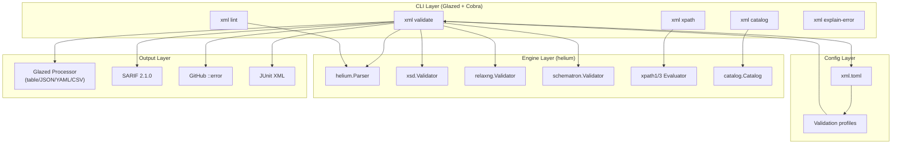

# Deep Dive: Building a Modern XML CLI in Go — Part 1

This article is the first in a series about building `xml`, a production-grade command-line tool for XML processing in Go. The tool wraps the helium native Go XML library behind the Glazed command framework, providing unified validation, linting, XPath evaluation, catalog management, and error translation — all with structured multi-format output. By the end of Part 1, you will understand the three-layer architecture, see how each command is built from the Glazed skeleton, and know how the validation pipeline turns helium's API calls into rows that flow through table, JSON, YAML, CSV, SARIF, and GitHub Actions formatters.

The target audience is a developer who writes Go CLIs and wants to see a real worked example of the Glazed framework applied to a non-trivial domain, or a developer who works with XML and wants to understand what a modern CLI replacement for `xmllint` looks like from the inside.

> [!summary]
> This article covers three core ideas:
> 1. The three-layer architecture (engine, config, CLI) and why the boundaries exist where they do.
> 2. The validation pipeline pattern: how `xml validate` chains XSD, RELAX NG, Schematron, and DTD checks into a single structured stream.
> 3. The Glazed command skeleton: the three-struct pattern, how flags become typed Go values, and how rows flow through the processor to become tables, JSON, YAML, CSV, SARIF, and GitHub annotations.

## Why this project exists

XML validation and processing tooling in 2026 is fragmented. A practitioner who wants to validate a document against an XSD schema, run Schematron business rules, and produce a CI-consumable report reaches for `xmllint`, `jing`, `saxon`, and custom scripts. Each tool has its own flag conventions, its own output format, and its own error vocabulary. Combining them into a CI pipeline requires ad-hoc glue code that does not generalize.

The `xml` CLI addresses this by unifying the entire XML development lifecycle into one Go binary backed by a single engine — the helium library. Every command speaks the same flag language, produces the same structured output formats, and uses the same error translation layer. A validation that chains XSD and Schematron checks is one invocation, not three.

## The engine: helium

Helium (`github.com/lestrrat-go/helium`) is a native Go XML stack written entirely in Go. It is not a cgo binding to libxml2, and it is not a JVM wrapper around Saxon. This matters for the CLI because it means the tool compiles to a single static binary with no runtime dependencies.

The library provides 15 subpackages covering every major XML specification:

| Package | Capability | Key types |
|---------|-------------|-----------|
| `helium` (root) | XML parsing, DOM building, serialization | `Parser`, `Document`, `Writer` |
| `xsd` | XML Schema 1.0 compilation and validation | `Compiler`, `Schema`, `Validator` |
| `relaxng` | RELAX NG compilation and validation | `Compiler`, `Grammar`, `Validator` |
| `schematron` | Schematron compilation and validation | `Compiler`, `Schema`, `Validator` |
| `xslt3` | XSLT 3.0 stylesheet compilation and execution | `Compiler`, `Stylesheet`, `Invocation` |
| `xpath1` | XPath 1.0 evaluation | `Compiler`, `Evaluator`, `Result` |
| `xpath3` | XPath 3.1 evaluation | `Compiler`, `Evaluator`, `Result` |
| `catalog` | OASIS XML Catalog loading and resolution | `Catalog`, `Load()` |
| `c14n` | W3C Canonical XML (1.0, 1.1, Exclusive) | `Canonicalizer`, `Mode` |
| `xinclude` | XInclude processing | `Processor` |

Every validation workflow in helium follows the same three-step pattern:

```text
Parse  →  Compile  →  Validate
```

Parse reads raw bytes into a DOM tree. Compile reads the schema into an internal representation. Validate checks the document against that representation and reports errors through an `ErrorHandler` interface. This uniformity is what makes the validation pipeline possible — every schema type uses the same sequence, just with different compiler and validator types.

### The Parser is a value type

Helium's `Parser` is a struct value, not a pointer. `NewParser()` returns `Parser`, and every option method returns a new `Parser` value:

```go
p := helium.NewParser()
p = p.BaseURI("doc.xml")
p = p.StripBlanks(true)
p = p.AllowNetwork(false)
```

This is a deliberate API choice — the parser is configured through immutable method chaining rather than mutable setter calls. The CLI wraps this in a `ParseOptions` struct that maps flags to parser method calls:

```go
type ParseOptions struct {
    BaseURI       string
    NoNetwork     bool
    StripBlanks   bool
    ValidateDTD   bool
    // ...
}

func NewParser(opts ParseOptions) (helium.Parser, *catalog.Catalog, error) {
    p := helium.NewParser()
    if opts.BaseURI != "" {
        p = p.BaseURI(opts.BaseURI)
    }
    if opts.NoNetwork {
        p = p.AllowNetwork(false)
    }
    // ...
    return p, cat, nil
}
```

The return type is `helium.Parser`, not `*helium.Parser`. Getting this wrong produces a compile error — `cannot use nil as helium.Parser value in return statement` — which is how the bug was discovered during initial development.

### The ErrorHandler interface

Validation errors flow through `helium.ErrorHandler`, a single-method interface:

```go
type ErrorHandler interface {
    Handle(context.Context, error)
}
```

The CLI implements this interface as `resultCollector`, which accumulates errors as `ValidationResult` structs instead of writing them directly to stderr:

```go
type resultCollector struct {
    results    []ValidationResult
    file       string
    schemaType string
    schemaFile string
}

func (c *resultCollector) Handle(_ context.Context, err error) {
    c.results = append(c.results, ValidationResult{
        File:       c.file,
        Severity:   "error",
        Message:    err.Error(),
        SchemaType: c.schemaType,
        SchemaFile: c.schemaFile,
    })
}
```

This indirection is what enables structured output. Instead of printing error text to the terminal, the collector stores it in a data structure that the CLI can emit as a table row, a JSON object, a SARIF result, or a GitHub annotation.

## The command framework: Glazed

Glazed (`github.com/go-go-golems/glazed`) provides the command skeleton that every `xml` subcommand is built on. It handles flag definition, flag-to-struct decoding, Cobra integration, and multi-format output. The framework enforces a consistent structure so that adding a new command follows the same pattern every time.

### The three-struct pattern

Every Glazed command requires exactly three structs:

1. **Command struct** — embeds `*cmds.CommandDescription`, which holds the command metadata, flag definitions, and section layout.
2. **Settings struct** — maps flag names to typed Go fields using `glazed:` struct tags.
3. **No separate processor struct** — the Glazed `Processor` is passed into the `RunIntoGlazeProcessor` method.

A minimal validate command skeleton:

```go
type ValidateCommand struct {
    *cmds.CommandDescription
}

type ValidateSettings struct {
    SchemaFile string `glazed:"schema"`
    SchemaType string `glazed:"schema-type"`
    NoNetwork  bool   `glazed:"no-network"`
}

func (c *ValidateCommand) RunIntoGlazeProcessor(
    ctx context.Context,
    vals *values.Values,
    gp middlewares.Processor,
) error {
    s := &ValidateSettings{}
    if err := vals.DecodeSectionInto(schema.DefaultSlug, s); err != nil {
        return err
    }
    // ... run validation, emit rows ...
    row := types.NewRow(
        types.MRP("file", r.File),
        types.MRP("severity", r.Severity),
        types.MRP("message", r.Message),
    )
    return gp.AddRow(ctx, row)
}
```

The `RunIntoGlazeProcessor` method is the heart of every command. It receives resolved flag values, decodes them into the settings struct, executes business logic, and emits rows through the processor. The processor handles all output formatting — the command never writes to stdout directly.

### How flags become Go values

The constructor builds the command description using `cmds.NewCommandDescription` with `cmds.WithFlags` and `cmds.WithSections`:

```go
cmdDesc := cmds.NewCommandDescription(
    "validate",
    cmds.WithShort("Validate XML documents against schemas"),
    cmds.WithFlags(
        fields.New("schema", fields.TypeString,
            fields.WithHelp("Schema file (type auto-detected from extension)"),
        ),
        fields.New("xsd", fields.TypeString,
            fields.WithHelp("Validate against XSD schema"),
        ),
        fields.New("no-network", fields.TypeBool,
            fields.WithDefault(false),
            fields.WithHelp("Block network access for DTD/entity resolution"),
        ),
    ),
    cmds.WithSections(glazedSection, cmdSettingsSection),
)
```

At runtime, Cobra parses the command line and Glazed resolves values from flags, environment variables, and config files. The resolved values are decoded into the settings struct through the `glazed:` tags:

```go
s := &ValidateSettings{}
vals.DecodeSectionInto(schema.DefaultSlug, s)
// s.Xsd now contains the value of --xsd
// s.NoNetwork now contains the value of --no-network
```

This indirection through `Values` and `DecodeSectionInto` is what enables Glazed to support multiple value sources (CLI flags, environment variables, config files) without the command knowing or caring where a value came from.

### The output system

Every command emits rows through the `middlewares.Processor` interface. The processor applies middlewares (field selection, sorting, filtering) and then formats the output based on the `--output` flag:

```bash
xml validate doc.xml --xsd schema.xsd                 # table
xml validate doc.xml --xsd schema.xsd --output json    # JSON
xml validate doc.xml --xsd schema.xsd --output yaml    # YAML
xml validate doc.xml --xsd schema.xsd --output csv     # CSV
```

The command does not contain any formatting code. The processor handles it all. This means adding a new output format requires zero changes to any command — only a new formatter in the Glazed framework.

### Common Glazed pitfalls

The integration surfaced six concrete problems worth documenting:

| Problem | Symptom | Fix |
|---------|---------|-----|
| `helium.Parser` is a value type | `cannot use nil as helium.Parser value` | Return `helium.Parser{}` instead of `nil` |
| `WithSectionsList` does not exist | `undefined: cmds.WithSectionsList` | Use `cmds.WithSections` |
| `types.NewRow` returns `Row`, not `*Row` | `cannot use *Row as Row` | Match return type to what `NewRow` actually returns |
| Glazed provides `--output` by default | `Flag 'output' already exists` | Do not redefine Glazed's built-in flags |
| Glazed provides `--output-file` by default | Same conflict | Rename custom output flags |
| `schema.Section` is an interface | Confusing pointer-to-interface errors | Use `schema.Section`, not `*schema.Section` |

These are not theoretical — every one of them produced a compile error during the first build.

## The validation pipeline

The validation pipeline is the most important piece of the Phase 1 implementation. It is the code path that turns `xml validate doc.xml --xsd schema.xsd --sch rules.sch` into a structured list of findings.

### The pipeline abstraction

The pipeline is defined by three types:

```go
type ValidationStep struct {
    Type       string // "xsd", "rng", "sch", "dtd", "xpath-assert"
    SchemaFile string
    AssertExpr string // for xpath-assert steps
    AssertMsg  string // for xpath-assert steps
}

type ValidationResult struct {
    File         string
    Severity     string // "error", "warning", "info"
    Message      string
    Line         int
    Column       int
    SchemaFile   string
    SchemaType   string
    Rule         string
    Context      string
    SuggestedFix string
    RawCode      string
}

type ValidationPipeline struct {
    steps        []ValidationStep
    catalogFiles []string
    noNetwork    bool
    timing       bool
}
```

A `ValidationStep` declares what to do. A `ValidationResult` records what happened. A `ValidationPipeline` runs a sequence of steps against a file and collects all results.

### The Run method

The pipeline's `Run` method follows a fixed sequence:

1. Parse the input file (well-formedness check).
2. If parsing fails, return a single `well-formedness` result and skip all schema steps.
3. If parsing succeeds, run each step in order.
4. Collect all results from all steps into a single slice.

```pseudocode
function Pipeline.Run(ctx, file):
    doc, err = parse(file)
    if err != nil:
        return [ValidationResult{schemaType: "well-formedness", ...}]

    results = []
    for step in steps:
        stepResults = runStep(ctx, step, file, doc)
        results.append(stepResults)

    return results
```

The key design decision: every step runs even if a previous step produced errors. A document that fails XSD validation may still produce useful Schematron findings. The pipeline does not short-circuit.

### Step dispatch

Each step type dispatches to a dedicated method that knows how to compile and run that schema type:

```go
func (p *ValidationPipeline) runStep(ctx, step, file, doc) []ValidationResult {
    switch step.Type {
    case "xsd":  return p.runXSDValidation(ctx, step, file, doc)
    case "rng":  return p.runRNGValidation(ctx, step, file, doc)
    case "sch":  return p.runSchematronValidation(ctx, step, file, doc)
    case "dtd":  return p.runDTDValidation(ctx, step, file, doc)
    }
}
```

Each method follows the same internal pattern: compile the schema, create a validator, attach the error-collecting handler, and run. For XSD:

```go
func (p *ValidationPipeline) runXSDValidation(ctx, step, file, doc) []ValidationResult {
    schema, err := xsd.NewCompiler().CompileFile(ctx, step.SchemaFile)
    if err != nil {
        return []ValidationResult{{Message: "schema compilation failed: " + err.Error(), ...}}
    }

    collector := &resultCollector{file: file, schemaType: "xsd", schemaFile: step.SchemaFile}
    _ = xsd.NewValidator(schema).ErrorHandler(collector).Validate(ctx, doc)
    return collector.results
}
```

The `_ =` on the `Validate` return value is intentional. Validation errors flow through the `ErrorHandler`, not through the return value. The return value indicates whether the validator itself encountered a fatal error (like a null document), not whether the document was valid.

### Schema type auto-detection

When the user passes `--schema schema.xsd` without specifying `--schema-type`, the pipeline detects the type from the file extension:

```go
func DetectSchemaType(path string) string {
    switch {
    case strings.HasSuffix(strings.ToLower(path), ".xsd"): return "xsd"
    case strings.HasSuffix(strings.ToLower(path), ".rng"): return "rng"
    case strings.HasSuffix(strings.ToLower(path), ".rnc"): return "rnc"
    case strings.HasSuffix(strings.ToLower(path), ".sch"): return "sch"
    case strings.HasSuffix(strings.ToLower(path), ".dtd"): return "dtd"
    default: return "xsd"
    }
}
```

The fallback to `"xsd"` is a pragmatic default, not a correct one. Future phases should peek at the file content (namespace URIs, root element names) for more accurate detection.

## The validate command end to end

This section traces a complete request from shell invocation to terminal output, showing how each layer contributes.

### Input

```bash
xml validate invoice.xml --xsd schema.xsd --output json
```

### 1. Cobra dispatches to ValidateCommand

Cobra routes the `validate` subcommand to the `ValidateCommand` registered in the root command. Glazed's parser resolves the flags into a `values.Values` map.

### 2. Settings are decoded

```go
s := &ValidateSettings{}
vals.DecodeSectionInto(schema.DefaultSlug, s)
// s.Xsd = "schema.xsd"
// s.Files = "invoice.xml"
// s.Format = "glazed" (default)
```

### 3. Validation steps are built from flags

The `buildSteps` function converts `--xsd`, `--rng`, `--sch`, and `--dtd` flags into `ValidationStep` structs:

```go
steps := []ValidationStep{{Type: "xsd", SchemaFile: "schema.xsd"}}
```

### 4. The pipeline runs

```go
pipeline := NewPipeline(steps, WithPipelineNoNetwork(s.NoNetwork))
results, err := pipeline.Run(ctx, "invoice.xml")
```

Inside the pipeline, the XSD step compiles the schema, validates the document, and collects any errors through the `resultCollector`.

### 5. Rows are emitted through the Glazed processor

For the default Glazed format, each result becomes a row:

```go
row := types.NewRow(
    types.MRP("file", r.File),
    types.MRP("severity", r.Severity),
    types.MRP("message", r.Message),
    types.MRP("schema-type", r.SchemaType),
)
gp.AddRow(ctx, row)
```

### 6. The processor formats the output

Because `--output json` was specified, Glazed formats the rows as JSON and writes to stdout.

### Output

```json
[
  {
    "file": "invoice.xml",
    "severity": "error",
    "message": "Element 'customer': Missing child element(s). Expected is ( address ).",
    "schema-type": "xsd"
  }
]
```

For invalid documents, the command returns `ErrValidationFailed`, which Cobra translates into exit code 1.

## Specialized output formats

Beyond Glazed's built-in table/JSON/YAML/CSV, the validate command supports three CI-specific formats that write directly to stdout, bypassing the Glazed processor entirely.

### SARIF 2.1.0

SARIF (Static Analysis Results Interchange Format) is the standard for GitHub Advanced Security and Azure DevOps. The output structure:

```text
SARIF
├── version: "2.1.0"
├── $schema: "https://...sarif-schema-2.1.0.json"
└── runs[]
    ├── tool.driver
    │   ├── name: "xml"
    │   ├── version: "0.1.0"
    │   └── informationUri: "https://github.com/go-go-golems/xml"
    └── results[]
        ├── ruleId: "xsd" (or raw-code like "cvc-elt.1.a")
        ├── level: "error" | "warning" | "note"
        ├── message.text: "..."
        └── locations[].physicalLocation
            ├── artifactLocation.uri: "doc.xml"
            └── region.startLine: 10
```

### GitHub Actions annotations

GitHub Actions recognizes `::error` and `::warning` lines in workflow logs:

```text
::error file=doc.xml,line=10,col=5::Missing required element
```

The severity mapping: `error` → `::error`, `warning` → `::warning`, `info` → `::notice`.

### JUnit XML

JUnit is the standard for CI test reporting. Validation results map naturally: each file is a test case, and errors become `<failure>` elements:

```xml
<testsuites>
  <testsuite name="xml-validate" tests="3" errors="1" failures="1">
    <testcase name="doc.xml" classname="xsd">
      <failure message="Missing required element" type="xsd">
        Missing required element
      </failure>
    </testcase>
  </testsuite>
</testsuites>
```

### The exit code problem

When the specialized format writers succeed (SARIF writes valid JSON, GitHub writes valid annotations), but validation found errors, the command must still return a non-zero exit code. The initial implementation returned the writer's error (which is `nil` on success), causing exit code 0 even when validation failed. The fix tracks both the write error and the `hasErrors` flag:

```go
var writeErr error
switch s.Format {
case "sarif":
    writeErr = output.WriteSARIF(allResults, "xml", "0.1.0", os.Stdout)
case "github":
    writeErr = output.WriteGitHubAnnotations(allResults, os.Stdout)
case "junit":
    writeErr = output.WriteJUnit(allResults, os.Stdout)
default:
    // Glazed output...
}

if writeErr != nil {
    return writeErr
}
if hasErrors {
    return ErrValidationFailed
}
return nil
```

## Project configuration: xml.toml

The `xml.toml` file defines validation profiles — named, multi-step pipelines that can be invoked with `--profile`:

```toml
[validation.invoice]
description = "Invoice validation pipeline"
files = "invoices/**/*.xml"

[[validation.invoice.steps]]
type = "xsd"
schema = "schemas/invoice.xsd"

[[validation.invoice.steps]]
type = "schematron"
schema = "rules/invoice-business-rules.sch"

[[validation.invoice.steps]]
type = "xpath-assert"
assert = "count(//Invoice/Line) > 0"
message = "Invoice must contain at least one line"
```

Then:

```bash
xml validate . --profile invoice
```

This is the configuration layer that turns the CLI from a one-off checker into a project build system. The same pattern that `Makefile` uses for compile steps, `xml.toml` uses for validation steps.

The config loading is tolerant: if `xml.toml` does not exist, the function returns `nil, nil` (no config, no error). CLI flags work without any project configuration. When `xml.toml` is present, profile steps are appended to the steps built from CLI flags, so `xml validate doc.xml --profile invoice --sch extra-rules.sch` works as expected.

## Error translation

XML Schema validators produce error codes like `cvc-complex-type.2.4.a`. These codes carry precise technical meaning, but that meaning is opaque to most developers. The error translator maps these codes to human-readable explanations:

```go
var errorCodeDB = map[string]ErrorExplanation{
    "cvc-complex-type.2.4.a": {
        Code:    "cvc-complex-type.2.4.a",
        Summary: "Invalid content found at this position",
        Meaning:  "The element contains a child that is not allowed, " +
                 "or the child elements are in the wrong order.",
        Causes: []string{
            "Child elements are out of the declared order",
            "A required earlier sibling element is missing",
            "The wrong namespace is being used",
            "The schema loaded is not the schema you expected",
        },
        SuggestedFixes: []string{
            "Check the content model of the parent element in the schema",
            "Verify namespace bindings match the schema's target namespace",
        },
    },
    // ... 15 codes total
}
```

The `xml explain-error` command exposes this database:

```bash
xml explain-error --code cvc-complex-type.2.4.a
xml explain-error --message "cvc-elt.1.a: Element not declared"
xml explain-error --list
```

The `ExtractErrorCode` function pulls codes from raw error messages by looking for the `cvc-` prefix:

```go
func ExtractErrorCode(msg string) string {
    // Find "cvc-" prefix
    // Extract until space, colon, or paren
    // Return the code or ""
}
```

This enables the validate command to attach raw codes to results automatically, so that downstream tooling (SARIF viewers, CI dashboards) can look up explanations without a separate invocation.

## Architecture diagram



## Directory structure

The project follows the Glazed convention of one directory per command group, one file per verb:

```text
xml-tool/
├── cmd/xml/main.go                  # entry point
├── pkg/
│   ├── cmds/
│   │   ├── root.go                  # root command + help + logging
│   │   ├── validate/
│   │   │   └── validate.go          # ValidateCommand + pipeline wiring
│   │   ├── lint/
│   │   │   └── lint.go              # LintCommand
│   │   ├── xpath/
│   │   │   └── xpath.go             # XPathCommand (1.0 + 3.1)
│   │   ├── catalog/
│   │   │   └── catalog.go           # Init, Add, Resolve, Check
│   │   └── explain_error/
│   │       └── explain.go           # ExplainErrorCommand
│   ├── config/
│   │   └── config.go                # xml.toml loading + profiles
│   ├── engine/
│   │   ├── parse.go                 # ParseOptions, NewParser, CollectFiles
│   │   └── validate.go              # ValidationPipeline, ValidationStep, ValidationResult
│   ├── errors/
│   │   └── translator.go            # 15 cvc-* codes + ExtractErrorCode
│   └── output/
│       ├── sarif.go                  # SARIF 2.1.0 writer
│       ├── github.go                # GitHub Actions annotation writer
│       └── junit.go                  # JUnit XML writer
├── test/
│   ├── integration/
│   │   └── integration_test.go      # 79 CLI integration tests
│   └── testdata/
│       ├── valid/                   # well-formed valid XML
│       ├── invalid/                 # well-formed invalid XML
│       ├── malformed/               # not well-formed
│       ├── schemas/                 # XSD, RNG, Schematron
│       ├── catalog/                 # OASIS catalog files
│       └── profiles/                # xml.toml test configs
├── go.mod
└── Makefile
```

## Test design

The test suite has four layers, each testing a different property of the system.

### Layer 1: Package unit tests (69 tests)

Every exported function in the engine, errors, output, and config packages is tested independently. Schema type detection is exercised with 12 inputs including edge cases like empty strings and missing extensions. The validation pipeline is tested with valid and invalid documents for each schema type (XSD, RELAX NG, Schematron, DTD), plus malformed XML, empty files, plain text, nonexistent schemas, bad schema files, and unknown step types.

### Layer 2: CLI integration tests (55 tests)

The real binary is built once in `TestMain`, then invoked as a subprocess for each test. Each test captures stdout, stderr, and the exit code. The validate command is tested across all output formats (table, JSON, YAML, CSV, SARIF, GitHub, JUnit), all schema types, and all error paths (no input, nonexistent file, nonexistent schema, malformed input). The lint command is tested with every flag combination (format, noout, c14n variants, dropdtd, noblanks). The xpath command is tested with every result type (nodeset, count, boolean, string) and both engine versions.

### Layer 3: Scenario tests (4 tests)

These test multi-command workflows: validate with a catalog, a full catalog round-trip (init → add → check → resolve), lint-then-validate, and xpath-after-validate.

### Layer 4: Adversarial input (12 tests)

These test what happens when the input is deliberately hostile: unclosed tags, empty files, plain text, binary content (PNG header bytes), deeply nested XML (100 levels), large attribute values (10KB), 50 namespace declarations, Unicode content (CJK, Greek, Hebrew), processing instructions, CDATA sections, and self-closing elements.

### Test-to-code ratio

The project has 2,917 lines of production code and 2,152 lines of test code, for a ratio of 0.74. The 148 tests cover every command, every schema type, every output format, and multiple classes of malformed input.

## What comes next

Phase 2 adds the schema workbench: `xml schema convert` (RNG ↔ XSD ↔ DTD), `xml schema infer` (generate a schema from example documents), `xml schema graph` (dependency visualization), `xml schema diff` (semantic comparison), and `xml schema breakage` (breaking-change analysis against a corpus of valid documents). The pipeline abstraction extends naturally — a `ValidationStep` can become a `SchemaStep`, and the `ValidationResult` pattern carries over to schema analysis findings.

Phase 3 adds Schematron and XSLT workflows: `xml sch compile/test/coverage`, `xml xsl run/test/debug/profile`. These require deeper integration with helium's XSLT 3.0 engine, including step-through debugging and template-level profiling.

Phase 4 adds the TUI (`xml validate --tui` with Bubble Tea panes) and the language server (`xmlls` with LSP completion, hover, and diagnostics). Both share the same engine and validation pipeline as the CLI — no duplication.

The architecture described in this article is designed to support all four phases without restructuring. The pipeline, the config, the error translator, and the output formatters are all domain primitives that will grow in capability but will not change in shape.
